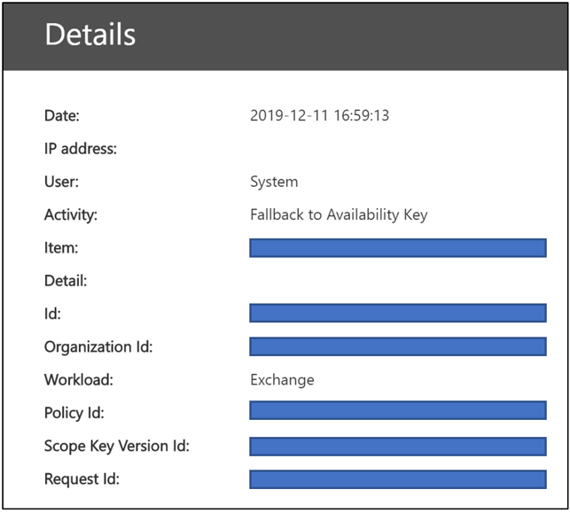

# 了解可用性金鑰的 Office 365 客戶金鑰

可用性機碼是根機碼會自動產生並佈建當您建立的資料加密原則。 Office 365 會儲存並保護可用性機碼。 可用性機碼具有相同的作用就像使用客戶金鑰服務加密您提供兩個根機碼。 可用性機碼中自動換列的較低的機碼一層的金鑰階層。 不同於您提供並管理 Azure 金鑰保存庫中的機碼，您無法直接存取可用性機碼。 自動化 office 365 服務管理的可用性金鑰使用 PowerShell cmdlet。 這些指令程式起始的永遠不相關的直接存取權的可用性機碼自動化的作業。

可用性按鍵的主要用途是提供從您管理的根機碼未預期遺失的復原能力。 遺失可能引發爭議性或惡意巨集指令的結果。 如果您遺失根機碼的控制，連絡 Microsoft 支援服務與 Microsoft 將協助您透過使用可用性金鑰復原的程序。 您將使用的可用性機碼移轉至新的資料加密原則與您佈建的新根機碼。

儲存區和可用性機碼的控制是刻意不同的三個原因的 Azure Key Vault 機碼：

- 可用性機碼會提供復原、 」 符號玻璃 」 功能，如果這兩個 Azure Key Vault 機碼控制會遺失。
- 邏輯控制項及安全存放裝置位置的區隔提供深度防禦，並提供保護，避免遺失所有索引鍵和您的資料，從單一攻擊或失敗點。
- 如果 Office 365 服務無法到達因暫時性錯誤而裝載於 Azure 金鑰保存庫中的機碼，可用性機碼會提供高可用性功能。 此規則僅適用於 Exchange Online 與 Skype for Business 服務加密。 SharePoint Online、 商務用 OneDrive，以及小組檔案永遠不會使用可用性金鑰] 除非您明確指示 Microsoft，以啟動復原程序。

共用來保護您的資料，使用不同的保護和處理程序的金鑰管理責任最終可降低風險，所有金鑰 （，因此您的資料） 將會永久遺失或損毀。 Microsoft 為您提供權力透過停用或損毀的可用性索引鍵時保留該服務。 根據設計，在 Microsoft 沒有其他有可用性機碼權限： 這不是藉由 Office 365 服務的程式碼。

請參閱[Microsoft 信任中心](https://www.microsoft.com/trustcenter/Privacy/govt-requests-for-data)的我們如何保護機碼的詳細資訊。
  
## 可用性機碼使用

可用性金鑰提供在此案例的復原功能外部因此或惡意的測試人員竊取您金鑰保存庫，或是當不慎引發爭議性會導致遺失根機碼的控制項。 所有 Office 365 服務使用客戶金鑰相容適都用於此復原功能。 個別服務以不同方式使用可用性鍵。 Office 365 只會使用可用性機碼如下所述的方式。

### Exchange Online 和商務用 Skype

除了復原功能，Exchange Online 和商務用 Skype 會使用可用性鍵以確保資料可用性期間暫時性或斷斷續續作業相關的問題，存取根機碼的服務。 當服務無法達到您在 Azure 金鑰保存庫中的客戶金鑰任一因為暫時性錯誤時，服務會自動使用可用性機碼。 服務永遠不會直接移至可用性機碼。

在 Exchange Online 組織和 Skype 的公司可能使用期間暫時性錯誤可用性金鑰來支援自動化後端服務，例如防毒、 e-探索、 資料外洩防護，信箱移動，自動化的系統和編製索引的資料。

### SharePoint Online、 商務用 OneDrive，以及小組檔案使用

SharePoint online、 商務用 OneDrive 和小組檔案，可用性的重點是永不使用復原功能之外，和客戶必須明確地指示 Microsoft，以啟動期間復原案例中使用可用性機碼。 自動化作業完全依賴您 Azure 金鑰保存庫中的客戶金鑰的服務。 深入的金鑰階層的這些服務的運作方式的詳細資訊，請參閱[如何 SharePoint Online、 商務用 OneDrive 和小組檔案所使用的可用性金鑰](#how-sharepoint-online-onedrive-for-business-and-teams-files-use-the-availability-key)。

## 可用性主要的安全性

Microsoft 與您共用資料保護的責任，以執行個體化的可用性機碼和廣泛的措施，以保護它。 Microsoft 不會公開給客戶的可用性金鑰直接控制。 例如，您可以只復原 （旋轉） 您所擁有的機碼 Azure 金鑰保存庫中。 如需詳細資訊，請參閱[復原或旋轉客戶金鑰或可用性機碼](customer-key-availability-key-roll.md)。

### 可用性金鑰秘密存放區

Microsoft 會保護在類似客戶使用 Azure 金鑰保存庫的存取控制 」、 「 內部秘密存放區中的可用性機碼。 我們實作存取控制，以防止 Microsoft 系統管理員無法直接存取中包含機密資料。 密碼儲存作業，包括關鍵旋轉、 刪除及擷取發生透過自動化永遠不會牽涉到的直接存取權的可用性機碼的命令。 調整這些命令的存取限制在特定工程師，且需要透過內部的工具，加密箱的權限提升。 權限提升需要管理員核准及之前要授與的正當理由。 Lockbox 可確保存取繫結與自動存取撤銷時的時間到期或工程師登出的時間。

**Exchange Online 和商務用 Skype**可用性機碼會儲存在 Active Directory 密碼存放區。 Exchange Online 的 Active Directory 是由將流量路由傳送的管理樹系並內含的物件、 身分識別和資料容量樹系所組成。 容量的樹系是由帳戶樹系和資源樹系所組成。 帳戶樹系具有多個容量網域控制站與另一個同步處理的。 可用性機碼是安全地儲存於這些容量網域控制站。 此安全存放裝置位置是個別而獨立的 SharePoint Online、 商務用 OneDrive，以及小組檔案秘密存放區。

**SharePoint Online、 商務用 OneDrive 和小組檔案**可用性機碼儲存在由服務小組內部秘密存放區。 這安全，機密資料儲存服務應用程式端點與 SQL 資料庫後端作為前端伺服器。 可用性機碼會儲存在 SQL 資料庫，並會進行三重包裝 （加密） 所用的 AES 256 和 HMAC 組合來加密靜態的可用性索引鍵的秘密 store 加密金鑰。 秘密 store 加密金鑰會儲存在相同的 SQL 資料庫的邏輯隔離元件，並進一步加密具有內含受管理的 Microsoft 憑證授權單位 (CA) 的憑證中的 RSA 2048 索引鍵。 這些憑證會儲存在資料庫執行作業的秘密存放區前端伺服器。

### 深度防禦

Microsoft 會採用防禦縱深策略以防止惡意的動作項目影響的機密性、 完整性或儲存在 Microsoft Cloud 中的客戶資料的可用性。 特定的預防性和偵查控制項所實作，以保護密碼儲存區和可用性金鑰做些安全性策略的一部分。

Office 365 內建以預防不當使用可用性機碼。 應用程式層級是透過此機碼，包括可用性機碼，可以用來加密及解密資料的唯一方法。 只有 Office 365 服務的程式碼有解譯及周遊加密和解密活動的金鑰階層的能力。 如果是惡意的 Microsoft 系統管理員來防止從秘密存放區擷取可用性機碼的控制項，機碼都無法使用存取客戶資料。 客戶金鑰、 可用性機碼，其他階層式金鑰和客戶資料的存放位置之間存在邏輯隔離。 事件中一或多個位置遭到洩漏，這項隔離會減少資料的風險的風險。 在階層中的每個圖層具有內建於 24 x 7 入侵偵測功能來保護資料及機密資料存放區。

若要避免未經授權的存取包括可用性金鑰秘密存放區的內部系統實作存取控制。 Microsoft 工程師不需要的可用性金鑰秘密存放區的直接存取。 存取控制項上的其他詳細資訊，請先檢閱[Office 365 中的系統管理存取控制](https://docs.microsoft.com/Office365/securitycompliance/office-365-administrative-access-controls-overview)。

技術控制項登入高度為最低權限服務帳戶，可能用攻擊者模擬 Office 365 服務，以防止 Microsoft 人員。 例如，這些控制項防止互動式登入。

安全性記錄及監視功能控制項是另一位深度防禦實作可保護減輕 Microsoft 服務和資料的風險。 Microsoft 服務小組已部署作用中的監視解決方案所產生的警示和稽核記錄。 所有服務小組會將其記錄檔都上載至集中存放庫的記錄檔彙總，而處理。 內部工具會自動檢查記錄，以確認服務運作正常最佳、 彈性，且安全的狀態。 不尋常的活動會標示為進一步檢閱。

任何記錄事件，表示潛在的 Microsoft 安全性原則違規情形會立即被帶到注意的 Microsoft 安全性小組。 Office 365 安全性已設定的警示，以偵測嘗試的存取可用性金鑰秘密存放區。 如果 Microsoft 人員嘗試互動式登入服務帳戶，也就是禁止受保護的存取控制，也會產生警示。 Office 365 安全性也會偵測並在偏差從標準基準線上操作的 Office 365 服務時，系統會通知。 Malefactors 嘗試誤用 Office 365 服務會觸發警示產生冒犯者的收回 Microsoft 雲端環境中。

## 使用復原金鑰遺失的可用性索引鍵

如果您遺失的客戶金鑰控制，可用性機碼會提供您復原，並重新加密資料的能力。

### Exchange Online 和商務用 Skype 的復原程序

如果您遺失的客戶金鑰控制，可用性機碼可讓您以復原資料，並使受影響的 Office 365 資源回復上線的功能。 可用性機碼會繼續以保護您的資料，雖然您復原。在高的層級，若要完全復原按鍵而造成遺失，您需要建立新的 DEP 和受影響的資源移至新的原則。

若要使用新的客戶金鑰來加密資料，在 Azure 金鑰保存庫中建立新的機碼，建立新的 DEP 使用新的客戶金鑰，然後將新的 DEP 指派給目前使用其機碼已遺失或洩漏先前 DEP 加密的信箱。

此重新加密程序可能需要長達 72 小時。 這是當您變更相依性的標準持續時間
  
### 復原程序的 SharePoint Online、 商務用 OneDrive 和小組檔案

SharePoint online、 商務用 OneDrive 和小組檔案可用性機碼是永不使用復原功能之外。 您必須明確地指示 Microsoft，以啟動期間復原案例中使用可用性機碼。 若要啟動的復原程序，請連絡 Microsoft，以啟用可用性金鑰。 一旦啟動，可用性索引鍵是自動用來解密您讓您可使用新建立的 DEP 關聯至新的客戶金鑰來加密資料的資料。  

這項作業是在您的組織中的網站數目成正比。 一旦您呼叫 Microsoft，以使用可用性機碼，您應該會完全在線上約四個小時內。

## Exchange Online 和商務用 Skype 如何使用可用性機碼

當您建立 DEP 使用客戶金鑰時，Office 365 會產生該 DEP 相關聯的資料加密原則金鑰 （DEP 索引鍵） 此服務會將 DEP 金鑰加密三次： 一次每個客戶金鑰與一次對可用性機碼。 儲存僅限 DEP 金鑰加密的版本，並只可以使用客戶金鑰或可用性金鑰解密 DEP 金鑰。 DEP 鍵然後用來加密信箱金鑰，加密個別的信箱。
  
Office 365 會遵循此程序來解密，客戶會使用服務時提供資料：
  
1. 使用客戶金鑰 DEP 金鑰解密。

2. 使用解密的 DEP 金鑰來解密信箱金鑰。

3. 使用已解密的信箱金鑰來解密信箱本身，讓您存取信箱內的資料。

Office 365 會發出兩個解密要求至 Azure Key Vault，稍微偏移解密 DEP 機碼。 若要完成的第一個提供結果，取消其他要求。

## 如何在 SharePoint Online、 商務用 OneDrive，以及小組檔案使用的可用性機碼

SharePoint Online 和 OneDrive for Business 架構、 實作客戶金鑰及可用性的機碼是不同於 Exchange Online 和商務用 Skype。
  
當組織移至客戶管理機碼時，Office 365 會建立租用戶特定中繼機碼 (TIK)。 Office 365 加密 TIK 兩次，一次使用每個客戶金鑰，並將儲存兩個 TIK 加密的版本。 儲存 TIK 的加密的版本，以及 TIK 只能使用客戶金鑰解密。 TIK 然後用來加密網站金鑰，然後用來加密 blob 機碼 （也稱為檔案區塊機碼）。 根據檔案大小，該服務可能檔案分割成多個檔案的區塊每個具有唯一索引鍵。 Blob （檔案的區塊） 本身的 blob 機碼會使用加密且儲存在 Microsoft Azure Blob 儲存體服務。
  
Office 365 會遵循此程序來解密，客戶會使用服務時提供客戶檔案：

1. 解密使用客戶金鑰 TIK。

2. 使用解密的 TIK 網站金鑰解密。

3. 使用解密的網站金鑰來解密 blob 金鑰。

4. 使用解密的 blob 金鑰來解密 blob。

Office 365 解密 TIK 發出兩個解密要求至 Azure Key Vault，稍微偏移。 若要完成的第一個提供結果，取消其他要求。
  
以防您會失去存取至您的客戶金鑰，Office 365 也使用可用性金鑰加密 TIK，並將此儲存以及與每個客戶金鑰加密 TIKs。 使用可用性金鑰加密 TIK 只適用於客戶會呼叫 Microsoft 編列復原路徑時遭到惡意或不小心，它們有其機碼，遺失存取。
  
對於可用性和規模原因，已解密的 TIKs 快取時間限制記憶體快取中。 兩個小時才能 TIK 快取設為過期，Office 365 會嘗試解密每個 TIK。 解密 TIKs 延伸的快取的存留期。 如果 TIK 解密失敗相當長的時間，Office 365 就會產生通知的快取到期時間之前工程警示。 只有當客戶會呼叫 Microsoft Office 365 會起始復原作業，其中包括解密 TIK 和一組新的 Microsoft 秘密存放區和上架再次使用 [解密租用戶中儲存與可用性機碼 TIK 嗎客戶提供 Azure Key Vault 鍵。
  
截至今天，客戶金鑰涉及儲存在 Azure blob 存放區，但不是 SharePoint Online 的清單項目或中繼資料儲存在 SQL 資料庫中的 SharePoint Online 檔案資料的加密和解密鏈結。 Office 365 不會不使用可用性鍵用於 Exchange Online、 Skype 商務、 SharePoint Online、 商務用 OneDrive 和小組以外的案例上述，為客戶起始的檔案。 客戶資料的人性化存取受保護的客戶加密箱。

## 可用性金鑰觸發程序

Office 365 會觸發只在特定情況下的可用性索引鍵。 這些情況下會有所不同由服務。

### 觸發程序的 Exchange Online 和商務用 Skype
  
1. Office 365 會讀取信箱來判斷 Azure 金鑰保存庫中的兩個客戶機碼位置指派 DEP。

2. Office 365 隨機選擇下列其中一個兩個客戶金鑰從 DEP，然後將要求傳送至 Azure 金鑰保存庫解除包裝使用客戶金鑰 DEP 機碼。

3. 若要解除包裝使用客戶金鑰 DEP 機碼的要求失敗，Office 365 第二個將要求傳送至 Azure Key Vault，此時指示 」，以使用替代 （秒） 的客戶金鑰。

4. 若要解除包裝使用客戶金鑰 DEP 機碼的第二個要求失敗，Office 365 會檢查這兩個要求的結果。

    - 如果檢查判斷要求失敗傳回系統錯誤：

       - Office 365 會觸發可用性金鑰來解密 DEP 金鑰。

       - Office 365 然後使用 DEP 金鑰來解密信箱金鑰並完成使用者要求。 

       - 在此情況下，Azure 金鑰保存庫是無法回應或無法存取之因為暫時性錯誤。

    - 如果檢查判斷要求失敗傳回 「 拒絕存取 」:

       - 這表示故意、 不慎或惡意巨集指令已採取來轉譯客戶金鑰無法使用 （例如，在過程資料清除一部分離開服務）。

       - 在此情況下，將不會使用可用性金鑰、 使用者要求失敗，及使用者會收到錯誤訊息。

>[!IMPORTANT]
>Office 365 服務的程式碼一定會具有隨手的有效登入 token 優先提供的值新增雲端服務的客戶資料。 因此，直到可用性金鑰已遭刪除，它可用於做為後援動作，起始，或是內部、 建立或移動信箱 Exchange Online 與 Skype for Business，例如搜尋編製索引。 這適用於這兩種暫時性錯誤，以及 Azure Key Vault 拒絕存取要求。

### SharePoint online、 商務用 OneDrive，以及小組會觸發檔案

SharePoint online、 商務用 OneDrive 和小組檔案，可用性的重點是永不使用復原功能之外，和客戶必須明確地指示 Microsoft，以啟動期間復原案例中使用可用性機碼。

## 稽核記錄和可用性機碼

自動化 Office 365 程序中的系統的所有資料在流過系統，以提供雲端服務，例如防毒、 e-探索、 資料遺失防護，資料編製索引。 Office 365 並不會產生執行活動的客戶顯示記錄檔。 此外，Microsoft 人員不存取您的資料，這些一般系統作業的一部分。

### Exchange Online 與 Skype for Business 可用性索引鍵記錄

Exchange Online 和商務用 Skype 會自動在暫時性錯誤期間使用的可用性機碼。 這個後援發生時，Office 365 會發佈客戶顯示記錄檔可存取的安全性與合規性中心。 可用性金鑰作業的稽核記錄檔記錄就會產生這些服務會使用可用性金鑰每次。 新的記錄類型，呼叫活動類型 「 後援到可用性的金鑰 」 與 「 客戶金鑰服務加密 」 可讓系統管理員來篩選[整合的稽核記錄](https://docs.microsoft.com/microsoft-365/compliance/search-the-audit-log-in-security-and-compliance)搜尋結果，以檢視可用性索引鍵記錄。 可用性索引鍵記錄取得產生只有當客戶金鑰可用來存取資料時，不能用於 Microsoft 服務受管理的機碼。

記錄包含屬性，例如日期、 時間、 活動、 組織識別碼，以及資料加密原則識別碼。 記錄會提供 Office 365 整合的稽核記錄的一部分且可存取 [Office 365 安全性與合規性中心的稽核記錄搜尋] 索引標籤。

Exchange Online 與 Skype 商務可用性索引鍵記錄使用與 Office 365 管理活動[常見的結構描述](https://docs.microsoft.com/office/office-365-management-api/office-365-management-activity-api-schema#common-schema)新增自訂的參數： 原則識別碼、 範圍金鑰版本 Id 及要求 id。

### SharePoint Online、 商務用 OneDrive，以及小組檔案可用性索引鍵記錄

可用性索引鍵記錄並未提供這些服務的尚未。 SharePoint Online、 商務用 OneDrive 和小組檔案，可用性時，用於復原用途另外指示機碼僅 Microsoft，以啟動。 因此，您已知道每個可用性機碼用於這些服務的事件。

## 客戶金鑰階層中的可用性機碼
  
Office 365 會使用可用性金鑰來為客戶金鑰服務加密所建立的金鑰階層中包裝的機碼較低層。 服務之間有不同的金鑰階層。 可用性機碼和其他金鑰階層中的每個適用的服務之間的演算法也不同。 不同服務所使用的可用性演算法如下所示：

- Exchange Online 與 Skype for Business 可用性機碼使用 AES 256。

- SharePoint Online、 商務用 OneDrive，以及小組檔案可用性機碼使用 RSA 2048。

### 加密 cipher 用來加密金鑰，Exchange Online 和商務用 Skype

### 用來加密金鑰，SharePoint Online 和商務用 OneDrive 加密 cipher

## 相關文章

- [Office 365 使用客戶金鑰服務加密](customer-key-overview.md)

- [設定 Office 365 客戶金鑰](customer-key-set-up.md)

- [管理 office 365 的客戶金鑰](customer-key-manage.md)

- [展開或旋轉客戶金鑰或可用性機碼](customer-key-availability-key-roll.md)
