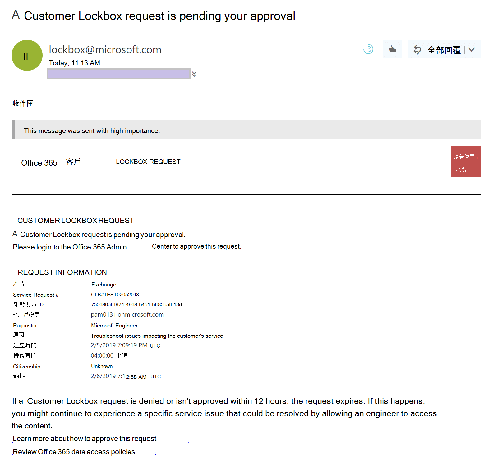
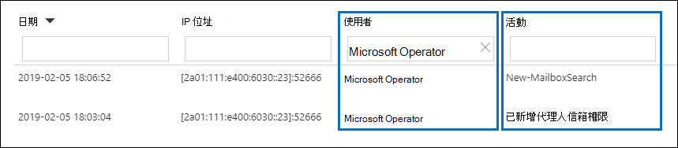

# Office 365 中的客戶加密箱Customer Lockbox in Office 365

本文提供客戶加密箱的部署和設定指導。This article provides deployment and configuration guidance for Customer Lockbox. 客戶加密箱支援存取 Exchange Online 中的資料、SharePoint 線上和商務 OneDrive 的要求。Customer Lockbox supports requests to access data in Exchange Online, SharePoint Online, and OneDrive for Business. 若要建議支援其他服務，請提交 [Office 365 UserVoice](https://office365.uservoice.com/)的要求。To recommend support for other services, please submit a request at [Office 365 UserVoice](https://office365.uservoice.com/).

若要查看授權您的使用者受益于 Microsoft 365 規範服務（包含這項服務）2020的選項，請參閱 [microsoft 365 授權指南以取得安全性 & 合規性](/office365/servicedescriptions/microsoft-365-service-descriptions/microsoft-365-tenantlevel-services-licensing-guidance/microsoft-365-security-compliance-licensing-guidance)。To see the options for licensing your users to benefit from Microsoft 365 compliance offerings, including this one, as of April 1, 2020, see the [Microsoft 365 licensing guidance for security & compliance](/office365/servicedescriptions/microsoft-365-service-descriptions/microsoft-365-tenantlevel-services-licensing-guidance/microsoft-365-security-compliance-licensing-guidance).

客戶加密箱可確保 Microsoft 無法存取您的內容，即可在未明確核准的情況下執行服務作業。Customer Lockbox ensures that Microsoft cannot access your content to perform a service operation without your explicit approval. 客戶加密箱會將您帶入核准工作流程，以取得存取內容的要求。Customer Lockbox brings you into the approval workflow for requests to access your content.

在某些情況下，Microsoft 工程師會協助疑難排解並修正支援流程中的客戶報告問題。Occasionally, Microsoft engineers help troubleshoot and fix customer reported issues in the support process. 通常，您可以透過 Microsoft 已針對其服務所具備的大量遙測和調試工具，修正問題。Usually, issues are fixed through extensive telemetry and debugging tools Microsoft has in place for its services. 不過，某些案例需要 Microsoft 工程師存取客戶內容，以判斷根本原因並修正問題。However, some cases require a Microsoft engineer to access customer content to determine the root cause and fix the issue. 客戶加密箱會要求工程師在核准工作流程的最後一個步驟向客戶要求存取。Customer Lockbox requires the engineer to request access from the customer as a final step in the approval workflow. 這可讓組織選擇核准或拒絕這些要求，並為客戶提供直接存取控制。This gives organizations the option to approve or deny these requests, and provide direct-access control to the customer.

### 客戶加密箱概述影片Customer Lockbox overview video

> [!VIDEO https://www.microsoft.com/videoplayer/embed/8fecf10b-1f03-4849-8b67-76d3d2a43f26?autoplay=false]

## 客戶加密箱工作流程Customer Lockbox workflow

當 Microsoft 工程師初始化客戶加密箱要求時，下列步驟會概括一般的工作流程：The following steps outline the typical workflow when a Microsoft engineer initiates a Customer Lockbox request:

1. 組織中的某人遇到 Microsoft 365 信箱的問題。Someone at an organization experiences an issue with their Microsoft 365 mailbox.

2. 在使用者診斷問題，但無法修正時，他們會以 Microsoft 支援服務開啟支援要求。After the user troubleshoots the issue, but can't fix it, they open a support request with Microsoft Support.

3. Microsoft 支援工程師會檢查服務要求，並決定是否需要存取組織的承租人，以在 Exchange Online 中修復問題。A Microsoft support engineer reviews the service request and determines a need to access the organization's tenant to repair the issue in Exchange Online.

4. Microsoft 支援工程師會登入客戶加密箱要求工具，並進行資料存取要求，其中包含組織的租使用者名稱、服務要求號碼，以及工程師需要存取資料的預估時間。The Microsoft support engineer logs into the Customer Lockbox request tool and makes a data access request that includes the organization's tenant name, service request number, and the estimated time the engineer needs access to the data.

5. Microsoft 支援管理員核准要求後，客戶加密箱會傳送組織中指定的核准者的電子郵件通知，告知 Microsoft 的未決存取要求。After a Microsoft Support manager approves the request, Customer Lockbox sends the designated approver at the organization an email notification about the pending access request from Microsoft.

    

   在 Microsoft 365 系統管理中心中指派 [客戶密碼箱存取核准者](/office365/admin/add-users/about-admin-roles) 系統管理員角色的任何人，都可以核准客戶加密箱要求。Anyone who is assigned the [Customer Lockbox access approver](/office365/admin/add-users/about-admin-roles) admin role in Microsoft 365 admin center can approve Customer Lockbox requests.

6. 核准者會登入 Microsoft 365 系統管理中心，並核准要求。The approver signs in to the Microsoft 365 admin center and approves the request. 此步驟會觸發搜尋審核記錄檔，以建立可使用的審計記錄。This step triggers the creation of an audit record available by searching the audit log. 如需詳細資訊，請參閱 [審核客戶密碼箱要求](#auditing-customer-lockbox-requests)。For more information, see [Auditing Customer Lockbox requests](#auditing-customer-lockbox-requests).

   如果客戶拒絕要求，或未在12小時內核准要求，要求就會到期，而且不會授與 Microsoft 工程師的存取權。If the customer rejects the request or doesn't approve the request within 12 hours, the request expires and no access is granted to the Microsoft engineer.

   > [!IMPORTANT]
   > Microsoft 不會在客戶密碼箱的電子郵件通知中包含任何需要您登入 Office 365 的連結。Microsoft does not include any links in Customer Lockbox email notifications requiring you to sign in to Office 365.

7. 組織中的核准者核准要求之後，Microsoft 工程師會收到核准訊息，登入 Exchange Online 中的租使用者，並修正客戶的問題。After the approver from the organization approves the request, the Microsoft engineer receives the approval message, logs into the tenant in Exchange Online, and fixes the customer's issue. Microsoft 工程師已要求期間修正問題，之後將自動撤銷存取權。Microsoft engineers have the requested duration to fix the issue after which the access is automatically revoked.

> [!NOTE]
> Microsoft 工程師所執行的所有動作都會記錄在審計記錄檔中。All actions performed by a Microsoft engineer are logged in the audit log. 您可以搜尋並複查這些審計記錄。You can search for and review these audit records.

## 開啟或關閉客戶加密箱要求Turn Customer Lockbox requests on or off

您可以在 Microsoft 365 系統管理中心中開啟客戶密碼箱控制項。You can turn on Customer Lockbox controls in the Microsoft 365 admin center. 當您開啟客戶密碼箱時，Microsoft 必須先取得您的組織核准，才能存取任何租使用者的內容。When you turn on Customer Lockbox, Microsoft must obtain your organization's approval before accessing any of your tenant's content.

1. 使用指派有全域管理員或 **客戶密碼箱存取核准者** 角色的工作或學校帳戶，移至並登 [https://admin.microsoft.com](https://admin.microsoft.com) 入。Using a work or school account that has either the global administrator or the **Customer Lockbox access approver** role assigned, go to [https://admin.microsoft.com](https://admin.microsoft.com) and sign in.

2. 選擇 [ **設定] > 的組織設定**。Choose **Settings > Org Settings**.

3. 選取 [**安全性 & 隱私權**  >  **客戶密碼箱**  >  **編輯**]，然後將開關移至 [**開啟**] 或 [**關閉**] 開啟或關閉該功能。Select **Security & Privacy** > **Customer Lockbox** > **Edit**, and then move the toggle to **On** or **Off** to turn the feature on or off.

    

## 核准或拒絕客戶加密箱要求Approve or deny a Customer Lockbox request

1. 使用指派有全域管理員或 **客戶密碼箱存取核准者** 角色的工作或學校帳戶，移至並登 [https://admin.microsoft.com](https://admin.microsoft.com) 入。Using a work or school account that has either the global administrator or the **Customer Lockbox access approver** role assigned, go to [https://admin.microsoft.com](https://admin.microsoft.com) and sign in.

2. 選擇 [ **支援 > 客戶加密箱要求**。Choose **Support > Customer Lockbox Requests**.

    ![按一下 [支援]，然後按一下 [客戶密碼箱要求]](../media/CustomerLockbox5.png)

    客戶加密箱要求的清單隨即顯示。A list of Customer Lockbox requests displays.

    

3. 選取客戶加密箱要求，然後選擇 [ **核准** ] 或 [ **拒絕**]。Select a Customer Lockbox request, and then choose **Approve** or **Deny**.

    

    會顯示客戶加密箱要求之核准的確認訊息。A confirmation message about the approval of the Customer Lockbox request displays.

    

> [!NOTE]
> 使用 Set-AccessToCustomerDataRequest Cmdlet 來核准、拒絕或取消由 Microsoft 支援工程師控制您資料存取權的 Microsoft 365 客戶加密箱要求。Use the Set-AccessToCustomerDataRequest cmdlet to approve, deny, or cancel Microsoft 365 customer lockbox requests that control access to your data by Microsoft support engineers. 如需詳細資訊，請參閱 [AccessToCustomerDataRequest](/powershell/module/exchange/set-accesstocustomerdatarequest)。For more information, see [Set-AccessToCustomerDataRequest](/powershell/module/exchange/set-accesstocustomerdatarequest).

## 審核客戶加密箱要求Auditing Customer Lockbox requests

對應至客戶密碼箱要求的審計記錄會記錄在審計記錄檔中。Audit records that correspond to the Customer Lockbox requests are logged in the audit log. 您可以使用安全性 & 規範中心中的「 [審核記錄搜尋」工具](search-the-audit-log-in-security-and-compliance.md) ，存取這些記錄檔。You can access these logs by using the [audit log search tool](search-the-audit-log-in-security-and-compliance.md) in the Security & Compliance Center. 有關接受或拒絕客戶加密箱要求的動作，以及 Microsoft 工程師所執行的動作) 也會記錄在審計記錄檔中 (當存取要求獲核准時。Actions related to accepting or denying a Customer Lockbox request and actions performed by Microsoft engineers (when access requests are approved) are also logged in the audit log. 您可以搜尋並複查這些審計記錄。You can search for and review these audit records.

### 在審計記錄檔中搜尋與客戶加密箱要求相關的活動Search the audit log for activity related to Customer Lockbox requests

在您可以使用「審核記錄檔」追蹤客戶的要求之後，您必須採取一些步驟來設定審核記錄。Before you can use the audit log to track requests for Customer Lockbox, there are some steps you need to take to set up audit logging. 如需詳細資訊，請參閱在 [安全性 & 規範中心搜尋審核記錄](/office365/securitycompliance/search-the-audit-log-in-security-and-compliance#before-you-begin)檔。For more information, see [Search the audit log in the Security & Compliance Center](/office365/securitycompliance/search-the-audit-log-in-security-and-compliance#before-you-begin). 完成安裝後，請使用下列步驟來建立審核記錄搜尋查詢，以傳回與客戶密碼箱相關的審計記錄：Once you've completed setup, use these steps to create an audit log search query to return audit records related to Customer Lockbox:

1. 請移至 [https://protection.office.com](https://protection.office.com)。Go to [https://protection.office.com](https://protection.office.com).
  
2. 使用您的公司或學校帳戶登入。Sign in using your work or school account.

3. 在安全性 & 規範中心的左窗格中，選擇 [**搜尋 & 調查**  >  **審核記錄搜尋**]。In the left pane of the Security & Compliance Center, choose **Search & investigation** > **Audit log search**.

    [ **審計記錄檔搜尋** ] 頁面隨即顯示。The **Audit log search** page displays.

    
  
4. 設定下列搜尋準則：Configure the following search criteria:

    1. **活動** -將此欄位保留空白，讓搜尋傳回所有活動的審計記錄。**Activities** - Leave this field blank so that the search returns audit records for all activities. 若要傳回與 Microsoft 工程師所執行之客戶加密箱要求和對應活動相關的任何審計記錄，必須這麼做。This is necessary to return any audit records related to Customer Lockbox requests and corresponding activity performed by Microsoft engineers.

    1. **開始日期** 和 **結束日期** -選取日期和時間範圍，以顯示在該期間內發生的事件。**Start date** and **End date** - Select a date and time range to display the events that occurred within that period.

    1. **使用者** -將此欄位保留空白。**Users** - Leave this field blank.

    1. **檔、資料夾或網站** -將此欄位保留空白。**File, folder, or site** - Leave this field blank.

5. 按一下 **[搜尋]** 以使用您的搜尋準則執行搜尋。Click **Search** to run the search using your search criteria.

    搜尋結果會經過載入，然後在 [**審計記錄檔搜尋**] 頁面的 [**結果**] 底下出現一段時間。The search results are loaded, and after a few moments they are displayed under **Results** on the **Audit log search** page.

6. 按一下搜尋結果頁面上的 [ **篩選結果** ]，然後執行下列其中一項動作：Click **Filter results** on the search results page, and do one of the following things:

   - 若要顯示與組織中核准或拒絕客戶加密箱要求相關之核准的審計記錄：在 [ **活動** ] 欄下方的方塊中，輸入 **AccessToCustomerDataRequest**。To display audit records related to an approver in your organization approving or denying a Customer Lockbox request: In the box under the **Activity** column, type **Set-AccessToCustomerDataRequest**.

   - 顯示與 Microsoft 工程師相關的審計記錄，以回應核准的客戶加密箱要求：在 [ **使用者** ] 欄下方的方塊中，輸入 **Microsoft 接線員**。To display audit records related to a Microsoft engineer performing actions in response to an approved Customer Lockbox request: In the box under the **User** column, type **Microsoft Operator**. [ **活動** ] 欄會顯示工程師所執行的動作。The **Activity** column displays the action performed by the engineer.

      

7. 在結果清單中，按一下要顯示的審計記錄。In the list of results, click an audit record to display it.

### 客戶加密箱存取要求的審計記錄Audit record for a Customer Lockbox access request

當您組織中的人員核准或拒絕客戶加密箱要求時，會在審計記錄檔中記錄審計記錄。When a person in your organization approves or denies a Customer Lockbox request, an audit record is logged in the audit log. 此記錄包含下列資訊。This record contains the following information.

| Audit record 屬性Audit record property| 描述Description|
|:---------- |:----------|
| 日期Date       | 客戶加密箱要求核准或拒絕的日期和時間。The date and time when the Customer Lockbox request was approved or denied.
| IP 位址IP address | 核准者用來核准或拒絕要求之電腦的 IP 位址。The IP address of the machine the approver used to approve or deny a request. |
| 使用者User       | 服務帳戶 BOXServiceAccount@ \[ customerforest \] 。 prod.outlook.com。The service account BOXServiceAccount@\[customerforest\].prod.outlook.com.            |
| 活動Activity   | Set-AccessToCustomerDataRequest;這是當您核准或拒絕客戶加密箱要求時所記錄的審計活動。Set-AccessToCustomerDataRequest; this is the auditing activity that is logged when you approve or deny a Customer Lockbox request.                                |
| 項目Item       | 客戶加密箱要求的 GuidThe Guid of the Customer Lockbox request                             |

下列螢幕擷取畫面顯示對應至已核准客戶加密箱要求的審計記錄檔範例。The following screenshot shows an example of an audit log record that corresponds to an approved Customer Lockbox request. 如果客戶加密箱要求遭到拒絕，則 **ApprovalDecision** 參數的值將會是 **Deny**。If a Customer Lockbox request was denied, then the value of **ApprovalDecision** parameter would be **Deny**.

> [!TIP]
> 若要在審計記錄中顯示更詳細的資訊，請按一下 [ **詳細資訊**]。To display more detailed information in an audit record, click **More information**.

### Microsoft 工程師所執行動作的審計記錄Audit record for an action performed by a Microsoft engineer

客戶加密箱要求經過核准後，Microsoft 工程師會執行的動作 (，而且可能會導致存取客戶內容) 記錄在審計記錄中。The actions performed by a Microsoft engineer after a Customer Lockbox request is approved (and that may result in accessing customer content) are logged in the audit log. 這些記錄包含下列資訊。These records contain the following information.

| Audit record 屬性Audit record property| 描述Description|
|:---------- |:----------|
| 日期Date       | 執行動作的日期時間。Date time when the action was performed. 請注意，此動作執行的時間會在客戶加密箱要求核准的4小時內。Note that the time that this action was performed will be within 4 hours of when the Customer Lockbox request was approved.              |
| IP 位址IP address | Microsoft 工程師使用的電腦 IP 位址。The IP Address of the machine Microsoft engineer used. |
| 使用者User       | Microsoft 操作員;此值表示此記錄與客戶加密箱要求相關。Microsoft Operator; this value indicates that this record is related to a Customer Lockbox request.                                  |
| 活動Activity   | Microsoft 工程師所執行的活動名稱。Name of the activity performed by the Microsoft engineer.|
| 項目Item       | \<empty\>                                             |

## 常見問題集Frequently asked questions

#### 客戶加密箱適用于哪些 Microsoft 365 服務？Which Microsoft 365 services does Customer Lockbox apply to?

客戶加密箱目前在 Exchange Online 中支援，SharePoint 線上，且 OneDrive 商務。Customer Lockbox is currently supported in Exchange Online, SharePoint Online, and OneDrive for Business.

#### 客戶加密箱是否可供所有客戶使用？Is Customer Lockbox available to all customers?

客戶加密箱隨附于 Microsoft 365 或 Office 365 E5 訂閱中，而且可以新增至具有資訊保護和合規性的其他計畫，也可以新增至其他計畫。Customer Lockbox is included with the Microsoft 365 or Office 365 E5 subscriptions and can be added to other plans with an Information Protection and Compliance or an Advanced Compliance add-on subscription. 如需詳細資訊，請參閱 [方案和價格](https://products.office.com/business/office-365-enterprise-e5-business-software) 。Please see [Plans and pricing](https://products.office.com/business/office-365-enterprise-e5-business-software) for more information.

#### 何謂客戶內容？What is customer content?

客戶內容是由 Microsoft 365 服務和應用程式的使用者所建立的資料。Customer content is the data created by users of Microsoft 365 services and applications. 客戶內容的範例包括：Examples of customer content include:

- 電子郵件內文或電子郵件附件Email body or email attachments

- SharePoint 網站內容SharePoint site contents

- SharePoint 檔本文中的資訊Information in the body of a SharePoint file

- 商務用 Skype 簡報檔內文Skype for Business presentation file body

- 立即訊息 (IM) 或語音交談Instant messages (IM) or voice conversations

- 客戶產生的 blob 或結構化儲存資料 (例如，SQL 容器) Customer-generated blob or structured storage data (for example, SQL Containers)

- 客戶擁有的安全性資訊 (例如憑證、加密金鑰和密碼) Customer-owned security information (for example, certificates, encryption keys, and passwords)

- 推斷及所有後續的推斷，如果客戶內容仍然存在Inferences, and all subsequent inferences, if customer content remains

如需 Office 365 中客戶內容的詳細資訊，請參閱 [Office 365 信任中心](https://products.office.com/business/office-365-trust-center-privacy/)。For additional information about customer content in Office 365, see the [Office 365 Trust Center](https://products.office.com/business/office-365-trust-center-privacy/).

#### 要求存取我的內容時，誰會收到通知？Who is notified when there is a request to access my content?

全域管理員及已指派客戶密碼箱存取核准者系統管理員角色的任何人都會收到通知。Global administrators and anyone assigned the Customer Lockbox access approver admin role are notified. 這些使用者也是可核准客戶加密箱要求的使用者。These are also the same users who can approve for Customer Lockbox requests.

#### 誰可以核准或拒絕組織中的這些要求？Who can approve or reject these requests in my organization?

全域系統管理員和任何獲指派客戶密碼箱存取權管理員角色的人員，都可以核准客戶加密箱要求。Global administrators and anyone assigned the Customer Lockbox access approver admin role can approve Customer Lockbox requests. 客戶在其組織中控制這些角色指派。Customers control these role assignments in their organizations.

#### 如何加入宣告客戶密碼箱？How do I opt in to Customer Lockbox?

全域管理員可以在 Microsoft 365 或 Microsoft 365 系統管理中心內啟用和設定客戶加密箱。A global administrator can enable and configure Customer Lockbox in the Microsoft 365 or Microsoft 365 admin center.

#### 如果我核准客戶加密箱要求，工程師可以做什麼，如何知道我的 Microsoft 工程師會怎麼做？If I approve a Customer Lockbox request, what can the engineer do and how will I know what the Microsoft engineer did?

核准客戶加密箱要求之後，Microsoft 工程師會授與這些必要的許可權，以使用預先核准的 Cmdlet 存取客戶內容。After you approve a Customer Lockbox request, the Microsoft engineer granted these necessary privileges to access customer content by using pre-approved cmdlets. Microsoft 工程師在回應客戶加密箱要求時所採取的動作會在安全性 & 合規性中心的審計記錄檔中記錄和存取。Actions taken by Microsoft engineers in response to Customer Lockbox requests are logged and accessible in the audit log in the Security & Compliance Center.

#### 如何知道 Microsoft 遵循核准程式？How do I know that Microsoft follows the approval process?

您可以使用 Microsoft 365 系統管理中心內的客戶加密箱要求記錄，在組織中相互參照傳送給系統管理員和核准者的電子郵件核准通知。You can cross-reference the email approval notifications sent to admins and approvers in your organization with the Customer Lockbox request history in the Microsoft 365 admin center.

客戶加密箱包含在最新的 [SOC 1 SSAE 16 審核報告](https://servicetrust.microsoft.com/ViewPage/MSComplianceGuide?command=Download&downloadType=Document&downloadId=91592749-e86a-43ac-801e-121382614681&docTab=4ce99610-c9c0-11e7-8c2c-f908a777fa4d_SOC%20%2F%20SSAE%2016%20Reports)中。Customer Lockbox is included in the latest [SOC 1 SSAE 16 audit report](https://servicetrust.microsoft.com/ViewPage/MSComplianceGuide?command=Download&downloadType=Document&downloadId=91592749-e86a-43ac-801e-121382614681&docTab=4ce99610-c9c0-11e7-8c2c-f908a777fa4d_SOC%20%2F%20SSAE%2016%20Reports). 如需詳細資訊，您可以在 [Microsoft 服務信任入口網站](https://servicetrust.microsoft.com/ViewPage/MSComplianceGuide?command=Download&downloadType=Document&downloadId=91592749-e86a-43ac-801e-121382614681&docTab=4ce99610-c9c0-11e7-8c2c-f908a777fa4d_SOC%20%2F%20SSAE%2016%20Reports)中尋找最新的報告。For more details, you can find the latest reports in the [Microsoft Service Trust Portal](https://servicetrust.microsoft.com/ViewPage/MSComplianceGuide?command=Download&downloadType=Document&downloadId=91592749-e86a-43ac-801e-121382614681&docTab=4ce99610-c9c0-11e7-8c2c-f908a777fa4d_SOC%20%2F%20SSAE%2016%20Reports).

#### Microsoft 是否可以修改我租使用者的核准者清單？Can Microsoft modify the list of approvers for my tenant? 如果不是，它會如何避免？If not, how is it prevented?

只有組織中的全域管理員可以指定誰可以核准客戶加密箱要求。Only a global administrator in your organization can specify who can approve Customer Lockbox requests. 這表示只有 Azure Active Directory 中全域管理員群組的成員可以指定誰可以核准要求。That means only the members of the Global administrator group in Azure Active Directory can specify who can approve request. Azure Active Directory 中全域管理員群組的成員資格只由您的組織管理。Membership of the Global administrator group in Azure Active Directory is managed only by your organization.

#### 如果我需要內容存取要求的詳細資訊來核准它，該怎麼辦？What if I need more information about a content access request to approve it?

每個客戶加密箱要求都包含 Microsoft 365 服務要求號碼。Each Customer Lockbox request contains a Microsoft 365 service request number. 您可以聯繫 Microsoft 支援部門並參考此服務號碼，以取得有關要求的詳細資訊。You can contact Microsoft Support and reference this service number to get more information about the request.

#### 客戶加密箱要求獲批准時，許可權的有效期是多久？When a Customer Lockbox request is approved, how long are the permissions valid?

目前，授與 Microsoft 工程師之存取權限的最長期限是4小時。Currently, the maximum period for the access permissions granted to the Microsoft engineer is 4 hours. Microsoft 工程師也可以要求較短的期間。The Microsoft engineer can also request a shorter period.

#### 如何取得所有客戶加密箱要求的歷史記錄？How can I get a history of all Customer Lockbox requests?

所有客戶加密箱要求都是在 Microsoft 365 系統管理中心中查看。All Customer Lockbox requests are viewed in the Microsoft 365 admin center.

#### 如何將內容存取要求與相關的審計記錄檔關聯？How do I correlate the content access requests with the related audit logs?

「規範中心」活動摘要包含客戶密碼箱的記錄活動。The Compliance Center Activity Feed contains log activities of Customer Lockbox. 客戶可以對照接收的電子郵件要求，從活動摘要中，對客戶加密箱記錄活動進行互交。Customers can cross-reference the Customer Lockbox log activities from the activity feed against the email request they receive.

#### 當客戶未回應客戶加密箱要求時，會發生什麼情況？What happens when a customer doesn't respond to a Customer Lockbox request?

客戶加密箱要求的預設工期為12小時。Customer Lockbox requests have a default duration of 12 hours. 如果您未在12小時內回應要求，要求就會到期。If you don't respond to a request within 12 hour, the request expires.

#### 當客戶拒絕客戶加密箱要求時，Microsoft 會執行什麼動作？What does Microsoft do when a customer rejects a Customer Lockbox request?

如果客戶拒絕客戶加密箱要求，就不會發生客戶內容的存取權。If a customer rejects a Customer Lockbox request, no access to customer content occurs. 如果您組織中的使用者繼續遇到服務問題，而要求 Microsoft 存取客戶內容以解決問題，則服務問題可能會繼續，而 Microsoft 會通知使用者這一點。If a user in your organization continues to experience a service issue requiring Microsoft to access customer content to resolve the issue, then the service issue might persist and Microsoft will inform the user about this.

#### 客戶加密箱是否要防範法律強制執行機構或其他協力廠商的資料要求？Does Customer Lockbox protect against data requests from law enforcement agencies or other third parties?

否。No. Microsoft 會認真對待客戶資料的協力廠商要求。Microsoft takes third-party requests for customer data seriously. 身為雲端服務提供者，Microsoft 總支援客戶資料的隱私權。As a cloud service provider, Microsoft always advocates for the privacy of customer data. 在我們取得傳票的情況下，Microsoft 一定會嘗試將協力廠商重新導向至客戶以取得資訊。In the event we get a subpoena, Microsoft always attempts to redirect the third party to the customer to obtain the information.  (讀取 Brad Smith 的博客： [防止客戶資料) 政府窺探](https://blogs.microsoft.com/blog/2013/12/04/protecting-customer-data-from-government-snooping/) 。(Read Brad Smith's blog: [Protecting customer data from government snooping](https://blogs.microsoft.com/blog/2013/12/04/protecting-customer-data-from-government-snooping/)). 我們會定期發佈 Microsoft 所收到之法律強制要求的 [詳細資訊](https://www.microsoft.com/corporate-responsibility/lerr) 。We periodically publish [detailed information](https://www.microsoft.com/corporate-responsibility/lerr) about the law enforcement requests that Microsoft receives.

如需詳細資訊，請參閱有關協力廠商資料要求和[線上服務條款](https://www.microsoft.com/Licensing/product-licensing/products.aspx)中「客戶資料的洩漏」一節的[Microsoft 信任中心](https://www.microsoft.com/trustcenter/default.aspx)。See the [Microsoft Trust Center](https://www.microsoft.com/trustcenter/default.aspx) regarding third-party data requests and the "Disclosure of Customer Data" section in the [Online Services Terms](https://www.microsoft.com/Licensing/product-licensing/products.aspx) for more information.

#### Microsoft 如何確保其員工的成員無法存取 Office 365 應用程式中的客戶內容？How does Microsoft ensure that a member of its staff doesn't have standing access to customer content in Office 365 applications?

Microsoft 透過存取控制系統來執行大量的預防措施，以及偵探措施來識別並處理繞過這些存取控制系統的企圖。Microsoft implements extensive preventive measures through access control systems, and detective measures to identify and address attempts to circumvent these access control systems. Microsoft 365 的運作方式是最低許可權和即時存取的原則。Microsoft 365 operates with the principles of least privilege and just-in-time access. 因此，任何 Microsoft 人員都沒有任何可讓您不斷存取客戶內容的許可權。Therefore, no Microsoft personnel have permission to access customer content on an ongoing basis. 如果授與許可權，它會在有限期限內。If permission is granted, it is for a limited duration. 

Microsoft 365 使用稱為「 *密碼箱* 」的存取控制系統，處理授與服務中執行作業和系統管理功能之許可權的許可權要求。Microsoft 365 uses an access control system called *Lockbox* to process requests for permissions that grant the ability to perform operational and administrative functions within the service. 操作員必須使用密碼箱要求存取客戶內容，然後再要求第二個人採取要求的動作 (例如，核准它) ，再授與存取權。An operator must request access to customer content using Lockbox, which then requires a second person to take action on the request (e.g., approve it) before access is granted. 第二個人不能是要求者，必須指定以核准客戶內容的存取權。That second person can't be the requestor and must be designated to approve access to customer content. 只有在核准要求時，操作員才能取得客戶內容的暫時存取權。Only if the request is approved does the operator acquire temporary access to customer content. 提升期限到期後，密碼箱會撤銷存取權。After the elevation period expires, Lockbox revokes access.

請參閱 [線上服務條款](https://www.microsoft.com/licensing/product-licensing/products) ，以取得 Microsoft 一般安全性作法的詳細資料。Please refer to the [Online Services Terms](https://www.microsoft.com/licensing/product-licensing/products) for more details about Microsoft general security practices.

#### 在哪些情況下，Microsoft 工程師需要存取我的內容？Under what circumstances do Microsoft engineers need access to my content?

最常見的情形是 Microsoft 工程師需要存取客戶內容的情形是，當客戶進行支援的支援要求時，需要存取權。The most common scenario where Microsoft engineers need access customer content is when the customer makes a support request requiring access for troubleshooting. Microsoft 365 的基礎原則是服務的運作方式，不需要 Microsoft 存取客戶內容。A foundational principle of Microsoft 365 is that the service operates without Microsoft access to customer content. Microsoft 所執行的所有服務作業幾乎都是完全自動化的，人工干預是高度控制的，而且會從客戶內容中進一步抽象出來。Nearly all service operations performed by Microsoft are fully automated and human involvement is highly controlled and abstracted away from customer content. Microsoft 365 的目標是存取客戶內容以支援服務，直到客戶核准特定的 Microsoft access 要求為止。The goal for Microsoft 365 is access to customer content to support the service isn't needed until the customer approves a specific request for Microsoft access.

#### 我已將我的資料設為與 Microsoft 雲端的安全性，所以我為何需要客戶密碼箱？I already thought my data was secure with the Microsoft cloud, so why do I need Customer Lockbox?

客戶加密箱為客戶提供服務作業的明確存取授權功能，提供額外的控制層級。Customer Lockbox provides an extra layer of control by offering customers the ability to give explicit access authorization for service operations. 透過示範明確資料存取授權的程式，客戶加密箱也可協助客戶符合特定合規性義務，例如 HIPAA 和 FEDRAMP。By demonstrating that procedures are in place for explicit data access authorization, Customer Lockbox also helps customers meet certain compliance obligations such as HIPAA and FEDRAMP.