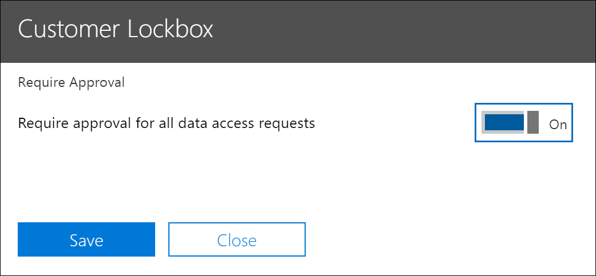
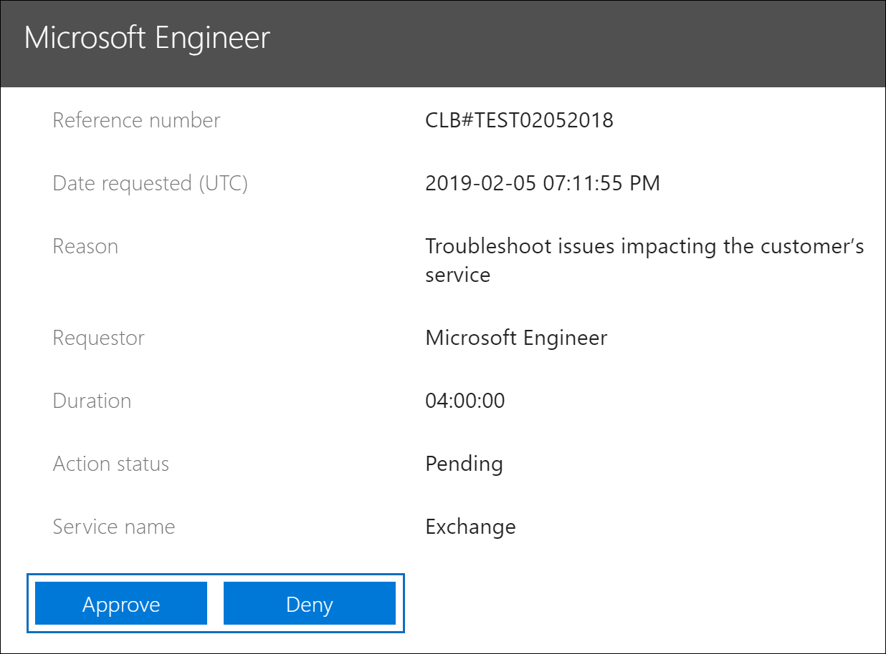
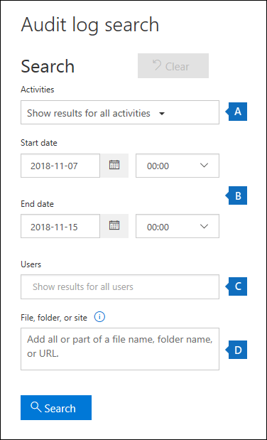

# Office 365 中的客户密码箱

> [!NOTE]
> 本文提供当前仅适用于具有 Microsoft 365 E5、Office 365 E5、信息保护和合规性或高级合规性加载项订阅的组织的功能的部署和配置指南。

客户密码箱可确保 Microsoft 在未经您明确批准的情况下无法访问您的内容以执行服务操作。 客户密码箱将您带入审批工作流，以便请求访问您的内容。

有时，Microsoft 工程师会帮助排除故障并修复支持过程中的客户报告的问题。 通常，问题通过 Microsoft 为其服务准备的大量遥测和调试工具得到解决。 但是，在某些情况下，需要 Microsoft 工程师访问客户内容以确定根本原因并解决问题。 客户密码箱要求工程师请求客户访问，作为审批工作流的最后一步。 这为组织提供了批准或拒绝这些请求的选项，并为客户提供直接访问控制。

### 客户密码箱概述视频

> [!VIDEO https://www.microsoft.com/videoplayer/embed/8fecf10b-1f03-4849-8b67-76d3d2a43f26?autoplay=false]

> [!NOTE]
> 客户密码箱支持访问 Exchange 在线、共享点联机和 OneDrive 中的数据的请求。 要推荐对其他 Office 365 服务的支持，请在[Office 365 用户语音](https://office365.uservoice.com/)中提交请求。

## 客户密码箱工作流

以下步骤概述了由 Microsoft 工程师启动客户密码箱请求时的典型工作流：

1. 组织中的某个人对其 Office 365 邮箱有问题。

2. 用户解决问题但无法修复后，他们将使用 Microsoft 支持打开支持请求。

3. 支持工程师审核服务请求并确定需要访问客户的 Exchange 在线内容来修复问题。

4. 支持工程师登录到客户密码箱请求工具，并通过指定客户的租户名称、服务请求编号以及需要访问数据的估计持续时间来发出数据访问请求。

5. 在 Microsoft 支持经理批准请求后，客户密码箱会向客户组织的指定审批人发送有关 Microsoft 挂起的访问请求的电子邮件通知。

    

   > [!NOTE]
   > 在 Microsoft 365 管理中心中分配了[客户密码箱访问审批者管理员](https://docs.microsoft.com/office365/admin/add-users/about-admin-roles)角色的任何人都可以批准客户密码箱请求。

7. 审批者登录到 Microsoft 365 管理中心并批准该请求。 此步骤通过搜索 Office 365 审核日志触发可用的审核记录的创建。 有关详细信息，请参阅[审核客户密码箱请求](#auditing-customer-lockbox-requests)部分。

   如果客户拒绝该请求或在 12 小时内未批准请求，则请求将过期，并且不授予 Microsoft 工程师访问权限。

   > [!IMPORTANT]
   > Microsoft 在要求您登录到 Office 365 的客户密码箱电子邮件通知中不包含任何链接。

8. 客户批准请求后，Microsoft 工程师会收到批准消息，登录到 Exchange Online 并修复客户的问题。 Microsoft 工程师具有请求的持续时间来修复问题，之后将自动撤消访问权限。

> [!NOTE]
> Microsoft 工程师执行的所有操作都记录在 Office 365 审核日志中。 您可以搜索和查看这些审核记录，并可以搜索和查看。

## 打开或关闭客户密码箱请求

Office 365 管理员可以在 Microsoft 365 管理中心打开客户密码箱控件。 启用客户锁定盒后，Microsoft 需要获得组织的批准，然后才能访问其任何内容。

> [!NOTE]
> 要执行以下过程，您必须是 Microsoft 365 或 Office 365 组织的全局管理员，或者被分配客户**密码箱访问审批者**管理员角色。

1. 转到[https://admin.microsoft.com](https://admin.microsoft.com)并登录您的工作或学校帐户。

2. **单击"设置>&隐私。**

    

3. 在"**客户锁定箱"** 磁贴上，**单击"编辑"，** 然后将切换**移动到"打开"** 或"**关闭"** 以打开或关闭要素。

    

## 批准或拒绝客户密码箱请求

> [!NOTE]
> 要执行以下过程，您必须是 Microsoft 365 或 Office 365 组织的全局管理员，或者被分配客户**密码箱访问审批者**管理员角色。

1. 转到[https://admin.microsoft.com](https://admin.microsoft.com)并登录您的工作或学校帐户。

2. **单击"支持>客户密码箱请求**。

    

    将显示客户密码箱请求的列表。

    

3. 选择客户锁定箱请求，然后单击"**批准"** 或"**拒绝"。**

    

    将显示有关客户密码箱请求的审批确认消息。

    

## 审核客户密码箱请求 

与客户密码箱请求对应的审核记录记录记录在 Office 365 审核日志中，可以使用 Office 365 安全&合规性中心的[审核日志搜索工具](https://docs.microsoft.com/office365/securitycompliance/search-the-audit-log-in-security-and-compliance)进行访问。 与客户接受或拒绝客户密码箱请求相关的操作以及 Microsoft 工程师执行的操作（当访问请求获得批准时）将记录在 Office 365 审核日志中。 您可以搜索和查看这些审核记录。

> [!NOTE]
> 您必须在 Exchange Online 中分配"仅查看审核日志"角色才能搜索 Office 365 审核日志。 有关详细信息，请参阅在[Office 365 安全&合规性中心中搜索审核日志](https://docs.microsoft.com/en-us/office365/securitycompliance/search-the-audit-log-in-security-and-compliance#before-you-begin)。

### 搜索审核日志，查找与客户密码箱请求相关的活动

下面有关如何创建审核日志搜索查询以返回与客户密码箱相关的审核记录：

1. 移至 [https://protection.office.com](https://protection.office.com)。
  
2. 使用公司或學校帳戶登入 Office 365。

3. 在"安全&合规中心"的左侧窗格中，单击"**搜索&调查** > **审核日志搜索**。

    将显示**审核日志搜索**页。

    
  
4. 配置以下搜索条件：

    a. **活动**- 将此字段留空，以便搜索返回所有活动的审核记录。 这是返回与客户密码箱请求和 Microsoft 工程师执行的相应活动相关的任何审核记录所必需的。

    b. **开始日期**和**结束日期**- 选择日期和时间范围以显示该时间段内发生的事件。

    c. **用户**- 将此字段留空。

    d. **文件、文件夹或站点**- 将此字段留空。

5. **单击"搜索"** 以使用搜索条件运行搜索。 

    搜索结果将加载，几分钟后，它们**将显示在"审核日志搜索"** 页上**的"结果"** 下。

6. 单击搜索结果页上**的"筛选结果"，** 然后执行以下操作之一：

   - 要显示与组织中批准或拒绝客户密码箱请求的审批人相关的审核记录：**在"活动"** 列下的框中，**键入"设置访问到客户数据请求**"。

   - 要显示与 Microsoft 工程师执行响应已批准的客户密码箱请求的操作相关的审核记录：**在"用户"** 列下的框中，键入**Microsoft 操作员**。 请注意，工程师执行的操作**显示在"活动"** 列中。

      

7. 在结果列表中，单击审核记录以显示它。

### 客户密码箱访问请求的审核记录

当组织中的人员批准或拒绝客户密码箱请求时，审核记录将记录在 Office 365 审核日志中。 此记录包含以下信息。 

| 审核记录属性| 描述|
|:---------- |:----------|
| 日期       | 批准或拒绝客户密码箱请求的日期和时间。
| IP 位址 | 批准者用于批准或拒绝请求的计算机的 IP 地址。 |
| 使用者       | 服务帐户 BOXServiceAccount_\[客户\]林 .prod.outlook.com。            |
| 活動   | 设置访问到客户数据请求;这是批准或拒绝客户密码箱请求时记录的审核活动。                                |
| 項目       | 客户密码箱请求的 Guid                             |

以下屏幕截图显示了与已批准的客户密码箱请求对应的审核日志记录的示例。 如果客户密码箱请求被拒绝，则**批准决策**参数的值**将为"拒绝"。**

> [!TIP]
> 要在审核记录中显示更多详细信息，请单击"**更多信息"。**

### 微软工程师执行的操作的审核记录

如前所述，Microsoft 工程师在客户密码箱请求获得批准后执行的操作（并可能导致访问客户内容）将记录在审核日志中。 这些记录包含以下信息。

| 审核记录属性| 描述|
|:---------- |:----------|
| 日期       | 执行操作的日期时间。 请注意，执行此操作的时间将在客户密码箱请求获得批准后的 4 小时内执行。              |
| IP 位址 | 微软工程师使用的机器的 IP 地址。 |
| 使用者       | 微软运营商;此值指示此记录与客户密码箱请求相关。                                  |
| 活動   | 由 Microsoft 工程师执行的活动的名称。|
| 項目       | \<空\>                                             |

## 常見問題集

#### 客户密码箱适用于哪些 Office 365 服务？

客户锁定盒当前受"Exchange 联机"""共享点联机"和"企业一个驱动器"支持。

#### 客户密码箱是否对所有 Office 365 客户可用？

客户锁定盒包含在 Microsoft 365 或 Office 365 E5 订阅中，并可添加到具有信息保护和合规性或高级合规性加载项订阅的其他计划中。 有关详细信息，请参阅 [计划和定价。](https://products.office.com/business/office-365-enterprise-e5-business-software) 

#### 什么是客户内容？

客户内容是 Office 365 服务和应用程序的用户创建的数据。 客户内容的示例包括：

- 电子邮件正文或电子邮件附件

- SharePoint 网站内容

- SharePoint 文件正文中的信息

- Skype 业务演示文稿文件正文

- 即时消息 （IM） 或语音对话

- 客户生成的 Blob 或结构化存储数据（例如，SQL 容器）

- 客户拥有的安全信息（例如，证书、加密密钥和密码）

- 如果客户内容仍然存在，则推断和所有后续推断

有关 Office 365 中客户内容的其他信息，请参阅[Office 365 信任中心](https://products.office.com/en-US/business/office-365-trust-center-privacy/)。

#### 当有访问我的内容的请求时，会通知谁？

将通知全局管理员和分配客户密码箱访问审批人管理员角色的任何人。 这些用户也可以批准客户密码箱请求。

#### 谁可以在我的组织中批准或拒绝这些请求？

全局管理员和分配客户密码箱访问审批者管理员角色的任何人都可以批准客户密码箱请求。 客户在其组织中控制这些角色分配。

#### 如何选择加入客户密码箱？

全局管理员可以在 Microsoft 365 或 Microsoft 365 管理中心启用和配置客户锁定盒。

#### 如果我批准客户密码箱请求，工程师可以做什么，我如何知道 Microsoft 工程师做了什么？

批准客户密码箱请求后，Microsoft 工程师授予这些必要的权限，以便使用预先批准的 cmdlet 访问客户内容。 Microsoft 工程师针对客户密码箱请求执行的操作将记录在 Office 365 安全&合规性中心的审核日志中。

#### 我如何知道 Microsoft 遵循审批流程？

您可以使用 Microsoft 365 管理中心中的客户密码箱请求历史记录对发送给组织中管理员和审批者的电子邮件审批通知进行交叉引用。

客户密码箱包含在最新的[SOC 1 SSAE 16 审核报告中。](https://servicetrust.microsoft.com/ViewPage/MSComplianceGuide?command=Download&downloadType=Document&downloadId=91592749-e86a-43ac-801e-121382614681&docTab=4ce99610-c9c0-11e7-8c2c-f908a777fa4d_SOC%20%2F%20SSAE%2016%20Reports) 有关详细信息，可以在[Microsoft 服务信任门户](https://servicetrust.microsoft.com/ViewPage/MSComplianceGuide?command=Download&downloadType=Document&downloadId=91592749-e86a-43ac-801e-121382614681&docTab=4ce99610-c9c0-11e7-8c2c-f908a777fa4d_SOC%20%2F%20SSAE%2016%20Reports)中找到最新的报告。

#### Microsoft 是否可以修改租户的审批人列表？ 如果没有，它是如何防止的？

只有组织中的全球管理员才能指定谁可以批准客户密码箱请求。 这意味着只有 Azure 活动目录中的全局管理员组的成员才能指定谁可以批准请求。 Azure 活动目录中全局管理员组的成员身份仅由组织管理。

#### 如果我需要有关内容访问请求的更多信息来批准它，该怎么办？

每个客户密码箱请求都包含 Office 365 服务请求编号。 您可以联系 Microsoft 支持并参考此服务号码以获取有关请求的详细信息。

#### 批准客户密码箱请求后，权限有效多长时间？

目前，授予 Microsoft 工程师的访问权限的最长期限为 4 小时。 微软工程师也可以请求较短的周期。

#### 如何获取所有客户密码箱请求的历史记录？

所有客户密码箱请求都在 Microsoft 365 管理中心查看。

#### 如何将内容访问请求与相关的审核日志相关联？

合规中心活动源包含客户密码箱的日志活动。 客户可以根据收到的电子邮件请求从活动源中交叉引用客户密码箱日志活动。

#### 如果客户未响应客户密码箱请求，会发生什么情况？

客户密码箱请求的默认持续时间为 12 小时。 如果您在 12 小时内未回复请求，则该请求将过期。

#### 当客户拒绝客户密码箱请求时，Microsoft 会执行什么操作？

如果客户拒绝客户密码箱请求，则无法访问客户内容。 如果组织中的用户继续遇到需要 Microsoft 访问客户内容以解决此问题的服务问题，则服务问题可能会仍然存在，Microsoft 将通知用户。

#### 客户密码箱是否可防止执法机构或其他第三方的数据请求？

否。 微软认真对待第三方对客户数据的请求。 作为云服务提供商，Microsoft 始终倡导客户数据的隐私。 如果我们收到传票，Microsoft 总是尝试将第三方重定向到客户以获取信息。 （阅读布拉德·史密斯的博客：[保护客户数据免受政府窥探）。](https://blogs.microsoft.com/blog/2013/12/04/protecting-customer-data-from-government-snooping/) 我们会定期发布有关 Microsoft 收到的执法请求[的详细信息。](https://www.microsoft.com/en-us/corporate-responsibility/lerr)

有关详细信息，请参阅[Microsoft 信任中心（](https://www.microsoft.com/en-us/trustcenter/default.aspx)有关第三方数据请求）和[在线服务条款](https://www.microsoft.com/Licensing/product-licensing/products.aspx)中的"披露客户数据"部分。

#### Microsoft 如何确保其员工在 Office 365 应用程序中没有长期访问客户内容的访问权限？

Microsoft 通过访问控制系统和检测措施实施广泛的预防措施，以识别和解决规避这些访问控制系统的企图。 Office 365 使用最小特权和实时访问的原则运行。 因此，任何 Microsoft 人员都无权持续访问客户内容。 如果授予权限，则其持续时间有限。 

Office 365 使用名为*Lockbox*的访问控制系统来处理权限请求，这些请求授予在服务中执行操作和管理功能的能力。 操作员必须使用 Lockbox 请求访问客户内容，然后要求第二个人对请求执行操作（例如，批准该请求），然后才能授予访问权限。 该第二个人不能是请求者，必须指定该人员来批准对客户内容的访问。 仅当请求获得批准时，操作员才会获得对客户内容的临时访问权限。 提升期到期后，锁箱将撤消访问权限。

有关 Microsoft 常规安全实践的更多详细信息，请参阅[在线服务条款。](https://www.microsoft.com/licensing/product-licensing/products)

#### 在什么情况下，Microsoft 工程师需要访问我的内容？

Microsoft 工程师需要访问客户内容的最常见情况是，客户发出需要访问以进行故障排除的支持请求。 Office 365 的一项基本原则是，该服务在不使用 Microsoft 访问客户内容的情况下运行。 Microsoft 执行的几乎所有服务操作都是完全自动化的，人工参与受到高度控制，并且从客户内容中抽象出来。 Office 365 的目标是在客户批准 Microsoft 访问的特定请求之前，不需要访问客户内容来支持服务。

#### 我已经认为我的数据在 Microsoft 云中是安全的，那么为什么我需要客户密码箱？

客户密码箱通过为客户提供为服务操作提供显式访问授权的能力，提供了额外的控制层。 通过证明是明确的数据访问授权程序已经到位，客户密码箱还帮助客户履行某些合规义务，如 HIPAA 和 FEDRAMP。
