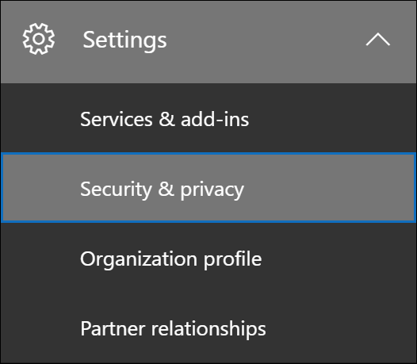

# Office 365 中的客戶加密箱

本文提供客戶加密箱的部署和設定指導。 客戶加密箱支援存取 Exchange Online 中的資料、SharePoint 線上和商務 OneDrive 的要求。 若要建議支援其他服務，請提交[Office 365 UserVoice](https://office365.uservoice.com/)的要求。

若要查看授權您的使用者受益于 Microsoft 365 規範服務（包含這項服務）2020的選項，請參閱 [microsoft 365 授權指南以取得安全性 & 合規性](https://aka.ms/ComplianceSD)。

客戶加密箱可確保 Microsoft 無法存取您的內容，即可在未明確核准的情況下執行服務作業。 客戶加密箱會將您帶入核准工作流程，以取得存取內容的要求。

在某些情況下，Microsoft 工程師會協助疑難排解並修正支援流程中的客戶報告問題。 通常，您可以透過 Microsoft 已針對其服務所具備的大量遙測和調試工具，修正問題。 不過，某些案例需要 Microsoft 工程師存取客戶內容，以判斷根本原因並修正問題。 客戶加密箱會要求工程師在核准工作流程的最後一個步驟向客戶要求存取。 這可讓組織選擇核准或拒絕這些要求，並為客戶提供直接存取控制。

### 客戶加密箱概述影片

> [!VIDEO https://www.microsoft.com/videoplayer/embed/8fecf10b-1f03-4849-8b67-76d3d2a43f26?autoplay=false]

## 客戶加密箱工作流程

當 Microsoft 工程師初始化客戶加密箱要求時，下列步驟會概括一般的工作流程：

1. 組織中的某人遇到 Microsoft 365 信箱的問題。

2. 在使用者診斷問題，但無法修正時，他們會以 Microsoft 支援服務開啟支援要求。

3. Microsoft 支援工程師會檢查服務要求，並決定是否需要存取組織的承租人，以在 Exchange Online 中修復問題。

4. Microsoft 支援工程師會登入客戶加密箱要求工具，並進行資料存取要求，其中包含組織的租使用者名稱、服務要求號碼，以及工程師需要存取資料的預估時間。

5. Microsoft 支援管理員核准要求後，客戶加密箱會傳送組織中指定的核准者的電子郵件通知，告知 Microsoft 的未決存取要求。

    

   在 Microsoft 365 系統管理中心中指派[客戶密碼箱存取核准者](https://docs.microsoft.com/office365/admin/add-users/about-admin-roles)系統管理員角色的任何人，都可以核准客戶加密箱要求。

6. 核准者會登入 Microsoft 365 系統管理中心，並核准要求。 此步驟會觸發搜尋審核記錄檔，以建立可使用的審計記錄。 如需詳細資訊，請參閱[審核客戶密碼箱要求](#auditing-customer-lockbox-requests)。

   如果客戶拒絕要求，或未在12小時內核准要求，要求就會到期，而且不會授與 Microsoft 工程師的存取權。

   > [!IMPORTANT]
   > Microsoft 不會在客戶密碼箱的電子郵件通知中包含任何需要您登入 Office 365 的連結。

7. 組織中的核准者核准要求之後，Microsoft 工程師會收到核准訊息，登入 Exchange Online 中的租使用者，並修正客戶的問題。 Microsoft 工程師已要求期間修正問題，之後將自動撤銷存取權。

> [!NOTE]
> Microsoft 工程師所執行的所有動作都會記錄在審計記錄檔中。 您可以搜尋並複查這些審計記錄。

## 開啟或關閉客戶加密箱要求

您可以在 Microsoft 365 系統管理中心中開啟客戶密碼箱控制項。 當您開啟客戶密碼箱時，Microsoft 必須先取得您的組織核准，才能存取任何租使用者的內容。

1. 使用指派有全域管理員或**客戶密碼箱存取核准者**角色的工作或學校帳戶，移至[https://admin.microsoft.com](https://admin.microsoft.com)並登入。

2. 選擇 [**設定] > 安全性 & 隱私權**。

    

3. 在**客戶加密箱**磚上，選擇 [**編輯**]，然後將開關移至 [**開啟**] 或 [**關閉**]，以開啟或關閉該功能。

    

## 核准或拒絕客戶加密箱要求

1. 使用指派有全域管理員或**客戶密碼箱存取核准者**角色的工作或學校帳戶，移至[https://admin.microsoft.com](https://admin.microsoft.com)並登入。

2. 選擇 [**支援 > 客戶加密箱要求**。

    ![按一下 [支援]，然後按一下 [客戶密碼箱要求]](../media/CustomerLockbox5.png)

    客戶加密箱要求的清單隨即顯示。

    

3. 選取客戶加密箱要求，然後選擇 [**核准**] 或 [**拒絕**]。

    

    會顯示客戶加密箱要求之核准的確認訊息。

    

## 審核客戶加密箱要求

對應至客戶密碼箱要求的審計記錄會記錄在審計記錄檔中。 您可以使用安全性 & 規範中心中的「[審核記錄搜尋」工具](search-the-audit-log-in-security-and-compliance.md)，存取這些記錄檔。 有關接受或拒絕客戶加密箱要求的動作，以及 Microsoft 工程師所執行的動作（當存取要求得到核准時）也會記錄在審計記錄檔中。 您可以搜尋並複查這些審計記錄。

### 在審計記錄檔中搜尋與客戶加密箱要求相關的活動

在您可以使用「審核」記錄檔追蹤客戶的要求之後，您必須採取一些步驟來設定審核記錄。 如需詳細資訊，請參閱在[安全性 & 規範中心搜尋審核記錄](https://docs.microsoft.com/office365/securitycompliance/search-the-audit-log-in-security-and-compliance#before-you-begin)檔。 完成安裝後，請使用下列步驟來建立審核記錄搜尋查詢，以傳回與客戶密碼箱相關的審計記錄：

1. 請移至 [https://protection.office.com](https://protection.office.com)。
  
2. 使用您的公司或學校帳戶登入。

3. 在安全性 & 規範中心的左窗格中，選擇 [**搜尋 & 調查** > **審核記錄搜尋**]。

    [**審計記錄檔搜尋**] 頁面隨即顯示。

    
  
4. 設定下列搜尋準則：

    a. **活動**-將此欄位保留空白，讓搜尋傳回所有活動的審計記錄。 若要傳回與 Microsoft 工程師所執行之客戶加密箱要求和對應活動相關的任何審計記錄，必須這麼做。

    b. **開始日期**和**結束日期**-選取日期和時間範圍，以顯示在該期間內發生的事件。

    c. **使用者**-將此欄位保留空白。

    d. **檔、資料夾或網站**-將此欄位保留空白。

5. 按一下 [搜尋]**** 以使用您的搜尋準則執行搜尋。

    搜尋結果會經過載入，然後在 [**審計記錄檔搜尋**] 頁面的 [**結果**] 底下出現一段時間。

6. 按一下搜尋結果頁面上的 [**篩選結果**]，然後執行下列其中一項動作：

   - 若要顯示與組織中核准或拒絕客戶加密箱要求相關之核准的審計記錄：在 [**活動**] 欄下方的方塊中，輸入**AccessToCustomerDataRequest**。

   - 顯示與 Microsoft 工程師相關的審計記錄，以回應核准的客戶加密箱要求：在 [**使用者**] 欄下方的方塊中，輸入**Microsoft 接線員**。 [**活動**] 欄會顯示工程師所執行的動作。

      

7. 在結果清單中，按一下要顯示的審計記錄。

### 客戶加密箱存取要求的審計記錄

當您組織中的人員核准或拒絕客戶加密箱要求時，會在審計記錄檔中記錄審計記錄。 此記錄包含下列資訊。

| Audit record 屬性| 描述|
|:---------- |:----------|
| 日期       | 客戶加密箱要求核准或拒絕的日期和時間。
| IP 位址 | 核准者用來核准或拒絕要求之電腦的 IP 位址。 |
| 使用者       | 服務帳戶 BOXServiceAccount@\[customerforest\]。 prod.outlook.com。            |
| 活動   | Set-AccessToCustomerDataRequest;這是當您核准或拒絕客戶加密箱要求時所記錄的審計活動。                                |
| 項目       | 客戶加密箱要求的 Guid                             |

下列螢幕擷取畫面顯示對應至已核准客戶加密箱要求的審計記錄檔範例。 如果客戶加密箱要求遭到拒絕，則**ApprovalDecision**參數的值將會是**Deny**。

> [!TIP]
> 若要在審計記錄中顯示更詳細的資訊，請按一下 [**詳細資訊**]。

### Microsoft 工程師所執行動作的審計記錄

客戶加密箱要求經過核准（而且可能會導致存取客戶內容）之後，Microsoft 工程師所執行的動作會記錄在審核記錄中。 這些記錄包含下列資訊。

| Audit record 屬性| 描述|
|:---------- |:----------|
| 日期       | 執行動作的日期時間。 請注意，此動作執行的時間會在客戶加密箱要求核准的4小時內。              |
| IP 位址 | Microsoft 工程師使用的電腦 IP 位址。 |
| 使用者       | Microsoft 操作員;此值表示此記錄與客戶加密箱要求相關。                                  |
| 活動   | Microsoft 工程師所執行的活動名稱。|
| 項目       | \<空\>                                             |

## 常見問題集

#### 客戶加密箱適用于哪些 Microsoft 365 服務？

客戶加密箱目前在 Exchange Online 中支援，SharePoint 線上，且 OneDrive 商務。

#### 客戶加密箱是否可供所有客戶使用？

客戶加密箱隨附于 Microsoft 365 或 Office 365 E5 訂閱中，而且可以新增至具有資訊保護和合規性的其他計畫，也可以新增至其他計畫。 如需詳細資訊，請參閱 [方案和價格](https://products.office.com/business/office-365-enterprise-e5-business-software) 。

#### 何謂客戶內容？

客戶內容是由 Microsoft 365 服務和應用程式的使用者所建立的資料。 客戶內容的範例包括：

- 電子郵件內文或電子郵件附件

- SharePoint 網站內容

- SharePoint 檔本文中的資訊

- 商務用 Skype 簡報檔內文

- 立即訊息（IM）或語音交談

- 客戶產生的 blob 或結構化儲存資料（例如 SQL 容器）

- 客戶擁有的安全性資訊（例如憑證、加密金鑰和密碼）

- 推斷及所有後續的推斷，如果客戶內容仍然存在

如需 Office 365 中客戶內容的詳細資訊，請參閱[Office 365 信任中心](https://products.office.com/business/office-365-trust-center-privacy/)。

#### 要求存取我的內容時，誰會收到通知？

全域管理員及已指派客戶密碼箱存取核准者系統管理員角色的任何人都會收到通知。 這些使用者也是可核准客戶加密箱要求的使用者。

#### 誰可以核准或拒絕組織中的這些要求？

全域系統管理員和任何獲指派客戶密碼箱存取權管理員角色的人員，都可以核准客戶加密箱要求。 客戶在其組織中控制這些角色指派。

#### 如何加入宣告客戶密碼箱？

全域管理員可以在 Microsoft 365 或 Microsoft 365 系統管理中心內啟用和設定客戶加密箱。

#### 如果我核准客戶加密箱要求，工程師可以做什麼，如何知道我的 Microsoft 工程師會怎麼做？

核准客戶加密箱要求之後，Microsoft 工程師會授與這些必要的許可權，以使用預先核准的 Cmdlet 存取客戶內容。 Microsoft 工程師在回應客戶加密箱要求時所採取的動作會在安全性 & 合規性中心的審計記錄檔中記錄和存取。

#### 如何知道 Microsoft 遵循核准程式？

您可以使用 Microsoft 365 系統管理中心內的客戶加密箱要求記錄，在組織中相互參照傳送給系統管理員和核准者的電子郵件核准通知。

客戶加密箱包含在最新的[SOC 1 SSAE 16 審核報告](https://servicetrust.microsoft.com/ViewPage/MSComplianceGuide?command=Download&downloadType=Document&downloadId=91592749-e86a-43ac-801e-121382614681&docTab=4ce99610-c9c0-11e7-8c2c-f908a777fa4d_SOC%20%2F%20SSAE%2016%20Reports)中。 如需詳細資訊，您可以在[Microsoft 服務信任入口網站](https://servicetrust.microsoft.com/ViewPage/MSComplianceGuide?command=Download&downloadType=Document&downloadId=91592749-e86a-43ac-801e-121382614681&docTab=4ce99610-c9c0-11e7-8c2c-f908a777fa4d_SOC%20%2F%20SSAE%2016%20Reports)中尋找最新的報告。

#### Microsoft 是否可以修改我租使用者的核准者清單？ 如果不是，它會如何避免？

只有組織中的全域管理員可以指定誰可以核准客戶加密箱要求。 這表示只有 Azure Active Directory 中全域管理員群組的成員可以指定誰可以核准要求。 Azure Active Directory 中全域管理員群組的成員資格只由您的組織管理。

#### 如果我需要內容存取要求的詳細資訊來核准它，該怎麼辦？

每個客戶加密箱要求都包含 Microsoft 365 服務要求號碼。 您可以聯繫 Microsoft 支援部門並參考此服務號碼，以取得有關要求的詳細資訊。

#### 客戶加密箱要求獲批准時，許可權的有效期是多久？

目前，授與 Microsoft 工程師之存取權限的最長期限是4小時。 Microsoft 工程師也可以要求較短的期間。

#### 如何取得所有客戶加密箱要求的歷史記錄？

所有客戶加密箱要求都是在 Microsoft 365 系統管理中心中查看。

#### 如何將內容存取要求與相關的審計記錄檔關聯？

「規範中心」活動摘要包含客戶密碼箱的記錄活動。 客戶可以對照接收的電子郵件要求，從活動摘要中，對客戶加密箱記錄活動進行互交。

#### 當客戶未回應客戶加密箱要求時，會發生什麼情況？

客戶加密箱要求的預設工期為12小時。 如果您未在12小時內回應要求，要求就會到期。

#### 當客戶拒絕客戶加密箱要求時，Microsoft 會執行什麼動作？

如果客戶拒絕客戶加密箱要求，就不會發生客戶內容的存取權。 如果您組織中的使用者繼續遇到服務問題，而要求 Microsoft 存取客戶內容以解決問題，則服務問題可能會繼續，而 Microsoft 會通知使用者這一點。

#### 客戶加密箱是否要防範法律強制執行機構或其他協力廠商的資料要求？

否。 Microsoft 會認真對待客戶資料的協力廠商要求。 身為雲端服務提供者，Microsoft 總支援客戶資料的隱私權。 在我們取得傳票的情況下，Microsoft 一定會嘗試將協力廠商重新導向至客戶以取得資訊。 （閱讀 Brad Smith 的博客：[保護客戶資料免受政府窺探](https://blogs.microsoft.com/blog/2013/12/04/protecting-customer-data-from-government-snooping/)）。 我們會定期發佈 Microsoft 所收到之法律強制要求的[詳細資訊](https://www.microsoft.com/corporate-responsibility/lerr)。

如需詳細資訊，請參閱有關協力廠商資料要求和[線上服務條款](https://www.microsoft.com/Licensing/product-licensing/products.aspx)中「客戶資料的洩漏」一節的[Microsoft 信任中心](https://www.microsoft.com/trustcenter/default.aspx)。

#### Microsoft 如何確保其員工的成員無法存取 Office 365 應用程式中的客戶內容？

Microsoft 透過存取控制系統來執行大量的預防措施，以及偵探措施來識別並處理繞過這些存取控制系統的企圖。 Microsoft 365 的運作方式是最低許可權和即時存取的原則。 因此，任何 Microsoft 人員都沒有任何可讓您不斷存取客戶內容的許可權。 如果授與許可權，它會在有限期限內。 

Microsoft 365 使用稱為「*密碼箱*」的存取控制系統，處理授與服務中執行作業和系統管理功能之許可權的許可權要求。 操作員必須使用密碼箱要求存取客戶內容，然後再要求第二個人採取要求的動作（例如，核准它），再授與存取權。 第二個人不能是要求者，必須指定以核准客戶內容的存取權。 只有在核准要求時，操作員才能取得客戶內容的暫時存取權。 提升期限到期後，密碼箱會撤銷存取權。

請參閱[線上服務條款](https://www.microsoft.com/licensing/product-licensing/products)，以取得 Microsoft 一般安全性作法的詳細資料。

#### 在哪些情況下，Microsoft 工程師需要存取我的內容？

最常見的情形是 Microsoft 工程師需要存取客戶內容的情形是，當客戶進行支援的支援要求時，需要存取權。 Microsoft 365 的基礎原則是服務的運作方式，不需要 Microsoft 存取客戶內容。 Microsoft 所執行的所有服務作業幾乎都是完全自動化的，人工干預是高度控制的，而且會從客戶內容中進一步抽象出來。 Microsoft 365 的目標是存取客戶內容以支援服務，直到客戶核准特定的 Microsoft access 要求為止。

#### 我已將我的資料設為與 Microsoft 雲端的安全性，所以我為何需要客戶密碼箱？

客戶加密箱為客戶提供服務作業的明確存取授權功能，提供額外的控制層級。 透過示範明確資料存取授權的程式，客戶加密箱也可協助客戶符合特定合規性義務，例如 HIPAA 和 FEDRAMP。
