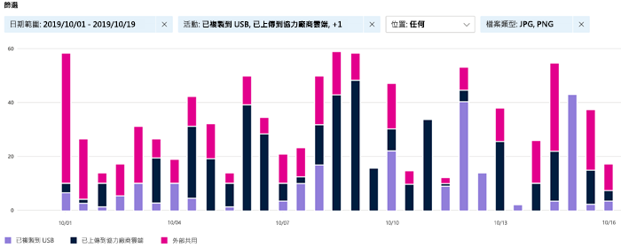

# 開始使用活動總管

資料分類概觀和內容總管索引標籤可讓您查看已探索和套用標籤的內容，以及內容的位置。 活動總管透過讓您監視對已套用標籤的內容執行的工作，從而完善此功能套件。 活動總管提供歷程記錄的檢視。

有超過 30 個不同的篩選可使用，其中包括：

- 日期範圍
- 活動類型
- 位置
- 使用者
- 敏感度標籤
- 保留標籤
- 檔案路徑
- DLP 原則

## 必要條件

每個存取並使用資料分類的帳戶，都必須有從下列其中一個訂閱中指派的授權：

- Microsoft 365 (E5)
- Office 365 (E5)
- 進階合規性 (E5) 附加元件
- 進階威脅情報 (E5) 附加元件

### 權限

 若要存取活動總管索引標籤，帳戶必須在其中任一角色或角色群組中獲派成員資格。

**Microsoft 365 角色群組**

- 全域管理員
- 合規性系統管理員
- 安全性系統管理員
- 合規性資料管理員

## 活動類型

Microsoft 365 會監視和報告 SharePoint Online 和 OneDrive 中的下列活動類型：

- 已套用標籤
- 已變更標籤 (升級、降級或移除)
- 自動加上標籤模擬

了解對套用標籤的敏感性內容執行動作的價值在於，您可以看到已實施的[資料外洩防護原則](data-loss-prevention-policies.md)等控制措施是否有效。 如果無效，或者如果您發現一些意外情況 (例如大量加上`highly confidential`標籤並降級為`general`的項目)，則可以管理各種原則並採取新動作來限制不需要的行為。

> [!NOTE]
> 活動總管目前未監視 Exchange Online 的保留活動。

## 另請參閱
- [了解敏感度標籤](sensitivity-labels.md)
- [瞭解保留原則和保留標籤](retention.md)
- [敏感資訊類型實體定義](sensitive-information-type-entity-definitions.md)

