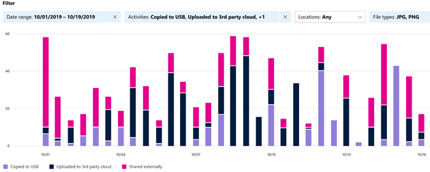
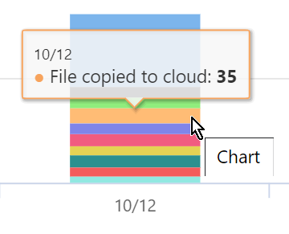
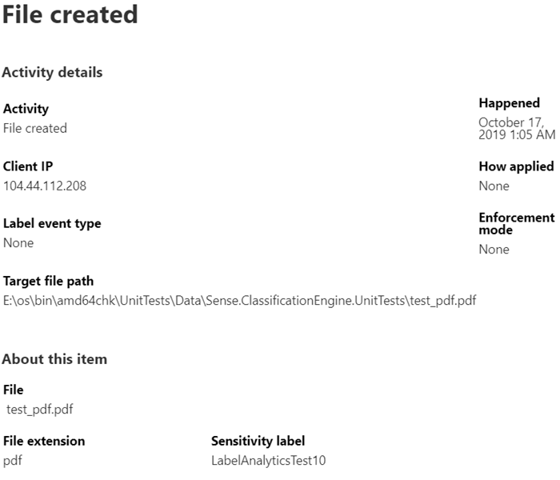

# 檢視套用標籤的內容上的活動 (預覽)

資料分類概觀和內容總管索引標籤可讓您查看已探索和套用標籤的內容，以及內容的位置。 活動總管透過讓您監視對已套用標籤的內容執行的工作，從而完善此功能套件。 活動總管提供歷程記錄的檢視。

您可以依照下列方式篩選資料：

- 日期範圍
- 活動類型
- 位置
- 使用者
- 敏感度標籤
- 保留標籤

您可以以清單或橫條圖的形式檢視資料。

## 必要條件

每個存取並使用活動總管的帳戶，都必須有從下列其中一個訂閱中指派的授權：

- Microsoft 365 (E5)
- Office 365 (E5)
- 進階合規性 (E5) 附加元件
- 進階威脅情報 (E5) 附加元件
- 進階威脅防護 (E5) 附加元件

## 活動類型

Microsoft 365 會監視和報告 SharePoint Online、OneDrive 和端點中的 12 種活動類型。 端點是執行 Windows 10 的使用者裝置。

- 已建立檔案
- 已修改檔案
- 已重新命名檔案
- 檔案已複製到雲端
- 檔案已遭不允許的應用程式存取
- 已列印檔案
- 檔案已複製到抽取式媒體
- 檔案已複製到網路共用
- 已讀取檔案
- 檔案已複製到剪貼簿
- 已套用標籤
- 已變更標籤 (升級、降級或移除)

了解對套用標籤的敏感性內容執行動作的價值在於，您可以看到已實施的[資料外洩防護原則](data-loss-prevention-policies.md)等控制措施是否有效。 如果無效，或者如果您發現一些意外情況 (例如大量加上`highly confidential`標籤並降級為`general`的項目)，則可以管理各種原則並採取新動作來限制不需要的行為。

設定篩選條件後，您可以：

- 將游標暫留在橫條圖的某一段上方，以查看該類別中的項目數量 
- 匯出資料
- 從清單中選取任何指定的項目，並在飛出中檢視動作的詳細資料

## 另請參閱
- [敏感性標籤](sensitivity-labels.md)
- [保留標籤](labels.md)
- [敏感性資訊類型在找什麼](what-the-sensitive-information-types-look-for.md)
- [保留原則概觀](retention-policies.md)