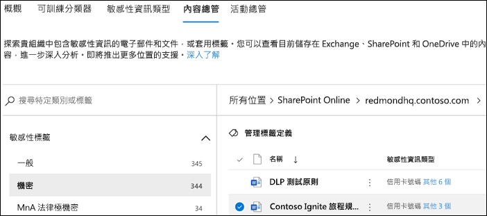
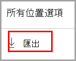
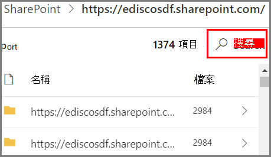

# 開始使用內容總管

資料分類內容總管可讓您本機檢視概觀頁面中摘要的項目。

## 必要條件

每個存取並使用資料分類的帳戶，都必須有從下列其中一個訂閱中指派的授權：

- Microsoft 365 (E5)
- Office 365 (E5)
- 進階合規性 (E5) 附加元件
- 進階威脅情報 (E5) 附加元件
- Microsoft 365 E5/A5 資訊保護和控管
- Microsoft 365 E5/A5 合規性

### 權限

若要存取內容總管索引標籤，帳戶必須在其中任一角色或角色群組中獲派成員資格。 

**Microsoft 365 角色群組**

- 全域管理員
- 合規性系統管理員
- 安全性系統管理員
- 合規性資料管理員

> [!IMPORTANT]
> 這些角色群組中的成員資格不允許您檢視內容總管中的項目清單，或檢視內容總管中的項目內容。

### 需要內容總管權限以存取項目

內容總管的存取權限受到高度限制，因為該權限可讓您讀取掃描檔案的內容。

> [!IMPORTANT]
> 這些權限取代本機指派之允許查看內容的項目權限。 

有兩個角色使用 [Microsoft 安全性與合規性中心](https://protection.office.com/permissions)授與對內容總管的存取權：

- **內容總管清單檢視器**：這個角色群組的成員資格可讓您在 [清單檢視] 中查看每個項目及其位置。 `data classification list viewer` 角色已預先指派給此角色群組。

- **內容瀏覽器內容檢視器**：這個角色群組的成員資格可讓您檢視清單中每個項目的內容。 `data classification content viewer` 角色已預先指派給此角色群組。

您用來存取內容瀏覽器的帳戶必須屬於其中一個或兩個角色群組。 這些是獨立的角色群組，不會累計。 例如，如果您想要授與某個帳戶只能檢視項目及其位置的權限，請授與「內容瀏覽器清單檢視器」權限。 如果您想要讓該相同帳戶也能夠檢視清單中項目的內容，也請授與「內容瀏覽器內容檢視器」權限。

您也可以將一個或兩個角色指派給自訂角色群組，以量身打造內容瀏覽器的存取權。

全域系統管理員、合規性系統管理員或資料系統管理員可以指派必要的內容總管清單檢視器和內容總管內容檢視器角色群組成員資格。

## 內容總管

內容總管會顯示具有敏感度標籤、保留標籤或已分類為貴組織敏感性資訊類型之項目的目前快照。

### 敏感性資訊類型

[DLP 原則](dlp-learn-about-dlp.md)有助於保護敏感性資訊 (已定義為 **敏感性資訊類型**)。 Microsoft 365 包括涵蓋許多不同區域的[許多常見敏感性資訊類型的定義](sensitive-information-type-entity-definitions.md)，可供您使用。 例如，信用卡號碼、銀行帳戶號碼、國家/地區識別碼和 Windows Live ID 服務號碼。

> [!NOTE]
> 內容總管目前不掃描 Exchange Online 中的敏感性資訊類型。

### 敏感度標籤

[敏感度標籤](sensitivity-labels.md)只是一個標記，指出您組織的項目值。 可手動或自動套用。 一旦套用，即會將它內嵌在文件中，並在所有的位置追蹤。 敏感性標籤會啟用各種防護行為，例如強制浮水印或加密。

SharePoint 和 OneDrive 中的檔案必須啟用敏感度標籤，以便在資料分類頁面中顯示對應資料。 如需詳細資訊，請參閱[對 SharePoint 和 OneDrive 中的 Office 檔案啟用敏感度標籤](sensitivity-labels-sharepoint-onedrive-files.md)。

### 保留標籤

[保留標籤](retention.md)可讓您定義保留標記的項目的時間長度，以及刪除它之前要採取的步驟。 它們會透過原則來手動或自動套用。 它們可以在協助您組織保持遵守法律和法規需求方面扮演一個角色。

### 如何使用內容總管

1. 開啟 **Microsoft 365 合規性中心**  > **資料分類** > **內容總管**。
2. 如果您知道標籤的名稱或敏感性資訊類型，便可在篩選方塊中輸入。
3. 您也可以展開標籤類型，然後從清單選取標籤來瀏覽項目。
4. 在 **[所有位置]** 底下選取位置，並向下切入資料夾結構至項目。
5. 按兩下以在內容總管中於機開啟項目。

### 匯出
**匯出** 控制項將建立包含任何列出顯示於 **[所有位置]** 窗格中項目的 .csv 檔案。

### 搜尋

當您向下切入例如 Exchange 資料夾或 SharePoint 或 OneDrive 網站等位置時，就會顯示 **[搜尋]** 工具。

搜尋工具的範圍是 **[所有位置]** 窗格中顯示的內容，並且您可以搜尋的內容依照所選位置而有所不同。 

當 **[Exchange]** 為選取的位置時，您可以搜尋信箱的完整電子郵件地址，例如 `user@domainname.com`。

當選取位置為 **[SharePoint]** 或 **[OneDrive]** 時，系統會在您向下切入至網站名稱、資料夾和檔案時顯示搜尋工具。 

> [!NOTE]
> **OneDrive** 我們收到了您在預覽計劃期間對 OneDrive 整合的寶貴意見反應。 根據該意見反應，OneDrive 功能將在所有修正程式都準備好之前保持為預覽。 視您的租用戶而定，有些客戶可能不會看到 OneDrive 作為位置。 非常感謝您的持續支持。

您可搜尋：

|數值|範例  |
|---------|---------|
|完整網站名稱    |`https://contoso.onmicrosoft.com/sites/sitename`    |
|根資料夾名稱 - 取得所有子資料夾    | `/sites`        |
|檔案名稱    |    `RES_Resume_1234.txt`     |
|檔案名稱開頭的文字| `RES`|
|檔案名稱中以底線字元 ( _ ) 之後的文字|`Resume` 或 `1234`| 
|檔案副檔名|`txt`|

## 另請參閱

- [了解敏感度標籤](sensitivity-labels.md)
- [瞭解保留原則和保留標籤](retention.md)
- [敏感性資訊類型實體定義.md](sensitive-information-type-entity-definitions.md)
- [深入了解資料外洩防護](dlp-learn-about-dlp.md)