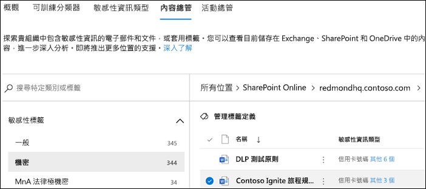

# 使用資料分類內容總管 (預覽)Using data classification content explorer (preview)

資料分類內容總管可讓您本機檢視概觀頁面中摘要的項目。The data classification content explorer allows you to natively view the items that were summarized on the overview page.

## 內容總管Content explorer

內容總管會顯示具有敏感度標籤、保留標籤或已分類為貴組織敏感性資訊類型之項目的目前快照。Content explorer shows a current snapshot of the items that have a sensitivity label, a retention label or have been classified as a sensitive information type in your organization.

### 敏感性資訊類型Sensitive information types

[DLP 原則](data-loss-prevention-policies.md)有助於保護敏感性資訊 (已定義為**敏感性資訊類型**)。A [DLP policy](data-loss-prevention-policies.md) can help protect sensitive information, which is defined as a **sensitive information type**. Microsoft 365 包括涵蓋許多不同區域的[許多常見敏感性資訊類型的定義](what-the-sensitive-information-types-look-for.md)，可供您使用。Microsoft 365 includes [definitions for many common sensitive information types](what-the-sensitive-information-types-look-for.md) across many different regions that are ready for you to use. 例如，信用卡號碼、銀行帳戶號碼、國家/地區識別碼和 Windows Live ID 服務號碼。For example, a credit card number, bank account numbers, national ID numbers, and Windows Live ID service numbers.

### 敏感度標籤Sensitivity labels

[敏感度標籤](sensitivity-labels.md)只是一個標記，指出您組織的項目值。A [sensitivity label](sensitivity-labels.md) is simply a tag that indicates the value of the item to your organization. 可手動或自動套用。It can be applied manually, or automatically. 一旦套用，即會將它內嵌在文件中，並在所有的位置追蹤。Once applied it gets embedded in the document and will follow it everywhere it goes. 敏感性標籤會啟用各種防護行為，例如強制浮水印或加密。A sensitivity label enables various protective behaviors, such as mandatory watermarking or encryption. 啟用端點保護後，您甚至可以防止項目離開組織控制。With end point protection enabled you can even prevent an item from leaving your organizational control.

SharePoint 和 OneDrive 中的檔案必須啟用敏感度標籤，以便在資料分類頁面中顯示對應資料。Sensitivity labels must be enabled for files that are in SharePoint and OneDrive in order for the corresponding data to surface in the data classification page. 如需詳細資訊，請參閱[對 SharePoint 和 OneDrive 中的 Office 檔案啟用敏感度標籤 (公開預覽)](sensitivity-labels-sharepoint-onedrive-files.md) (英文版)。For more information, see [Enable sensitivity labels for Office files in SharePoint and OneDrive (public preview)](sensitivity-labels-sharepoint-onedrive-files.md).

### 保留標籤Retention labels

[保留標籤](labels.md)可讓您定義保留標記的項目的時間長度，以及刪除它之前要採取的步驟。A [retention label](labels.md) allows you to define how long a labeled item is kept and the steps to be taken prior to deleting it. 它們會透過原則來手動或自動套用。They are applied manually or automatically via policies. 它們可以在協助您組織保持遵守法律和法規需求方面扮演一個角色。They can play a role in helping your organization stay in compliance with legal and regulatory requirements.

### 權限Permissions

有兩個角色可以將存取權授與內容瀏覽器：There are two roles that grant access to content explorer:

- **內容瀏覽器清單檢視器**：這個角色群組的成員資格可讓您查看每個項目及其位置。**Content Explorer List viewer**: Membership in this role group allows you to see each item and its location. `data classification list viewer` 角色已預先指派給此角色群組。The `data classification list viewer` role has been pre-assigned to this role group.

- **內容瀏覽器內容檢視器**：這個角色群組的成員資格可讓您檢視清單中每個項目的內容。**Content Explorer Content viewer**: Membership in this role group allows you to view the contents of each item in the list. `data classification content viewer` 角色已預先指派給此角色群組。The `data classification content viewer` role has been pre-assigned to this role group.

您用來存取內容瀏覽器的帳戶必須屬於其中一個或兩個角色群組。The account you use to access content explorer must be in one or both of the role groups. 這些是獨立的角色群組，不會累計。These are independent role groups and are not cumulative. 例如，如果您想要授與某個帳戶只能檢視項目及其位置的權限，請授與「內容瀏覽器清單檢視器」權限。For example, if you want to grant an account the ability to view the items and their locations only, grant Content Explorer List viewer rights. 如果您想要讓該相同帳戶也能夠檢視清單中項目的內容，也請授與「內容瀏覽器內容檢視器」權限。If you want that same account to also be able to view the contents of the items in the list, grant Content Explorer Content viewer rights as well.

您也可以將一個或兩個角色指派給自訂角色群組，以量身打造內容瀏覽器的存取權。You can also assign either or both of the roles to a custom role group to tailor access to content explorer.

### 如何使用內容總管How to use content explorer

1. 開啟 **Microsoft 365 合規性中心**  > **資料分類** > **內容總管**。Open **Microsoft 365 compliance center**  > **Data classification** > **Content explorer**.
2. 如果您知道標籤的名稱或敏感性資訊類型，便可在搜尋方塊中輸入。If you know the name of the label, or the sensitive information type, you can type that into the search box.
3. 您也可以展開標籤類型，然後從清單選取標籤來瀏覽項目，以下顯示的是清單保留標籤部分中的項目。Alternately, you can browse for the item by expanding the label type and selecting the label from the list, an item from the retention label portion of the list is show below.
4. 在 **[所有位置]** 底下選取位置，並向下切入資料夾結構至項目。Select a location under **All locations** and drill down the folder structure to the item.
5. 按兩下以在內容總管中於機開啟項目。Double-click to open the item natively in content explorer.

## 另請參閱See also

- [敏感性標籤Sensitivity labels](sensitivity-labels.md)
- [保留標籤Retention labels](labels.md)
- [敏感性資訊類型在找什麼What the sensitive information types look for](what-the-sensitive-information-types-look-for.md)
- [保留原則概觀Overview of retention policies](retention-policies.md)
- [資料外洩防護概觀Overview of data loss prevention](data-loss-prevention-policies.md)
