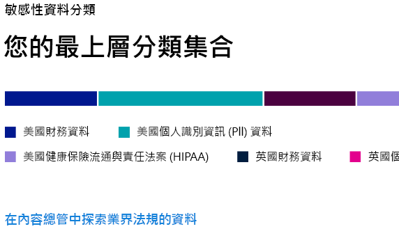
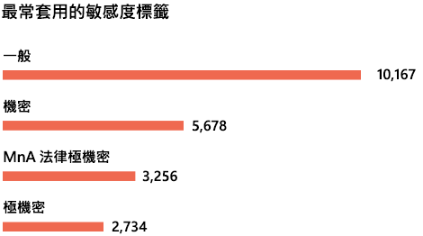
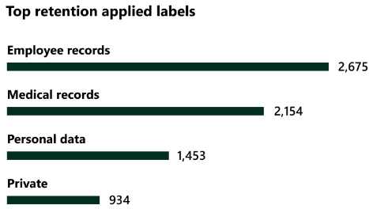

# 了解您的資料 - 資料分類概觀 (預覽)Know your data - data classification overview (preview)

身為 Microsoft 365 系統管理員或合規性系統管理員，您可以評估並標記貴組織的內容，以控制其目標位置、隨時隨地加以保護，並確保根據貴組織的需求來保存及刪除內容。As a Microsoft 365 administrator or compliance administrator, you can evaluate and then tag content in your organization in order to control where it goes, protect it no matter where it is and to ensure that it is preserved and deleted according your your organizations needs. 您可以透過[敏感度標籤](sensitivity-labels.md)、[保留標籤](labels.md)和敏感性資訊類型分類來執行此動作。You do this through the application of [sensitivity labels](sensitivity-labels.md), [retention labels](labels.md), and sensitive information type classification. 執行探索、評估和標記有多種方法，但最後您可能會有大量以其中一個或兩個標籤標記及分類的文件和電子郵件。There are various ways to do the discovery, evaluation and tagging, but the end result is that you may have very large numbers of documents and emails that are tagged and classified with one or both of these labels. 套用保留標籤和敏感度標籤後，您會想要查看租用戶使用標籤的情況，以及對這些項目進行的動作。After you apply  your retention labels and sensitivity labels, you'll want to see how the labels are being used across your tenant and what is being done with those items. 資料分類頁面可讓您了解此內容，具體如下：The data classification page provides visibility into that body of content, specifically:

- 已分類為敏感性資訊類型的項目數量，以及分類的名稱the number items that have been classified as a sensitive information type and what those classifications are
- Microsoft 365 和 Azure 資訊保護中已套用最高層級的敏感度標籤the top applied sensitivity labels in both Microsoft 365 and Azure Information Protection
- 已套用最高層級的保留標籤the top applied retention labels
- 使用者對敏感性內容所採取之活動的摘要a summary of activities that users are taking on your sensitive content
- 敏感性資料和保留資料的位置the locations of your sensitive and retained data

您可以在 **Microsoft 365 合規性中心**或 **Microsoft 365 安全性中心** > **[分類]** > **[資料分析]** 中找到資料分析。You can find data classification in the **Microsoft 365 compliance center** or **Microsoft 365 security center** > **Classification** > **Data Classification**.

## 內容中最常使用的敏感性資訊類型Sensitive information types used most in your content

Microsoft 365 隨附許多敏感性資訊類型的定義，例如包含社會安全號碼或信用卡號的項目。Microsoft 365 comes with many definitions of sensitive information types, such as an item containing a social security number or a credit card number. 如需有關敏感性資訊類型的詳細資訊，請參閱[敏感性資訊類型在找什麼](what-the-sensitive-information-types-look-for.md)。For more information on sensitive information types, see [What the sensitive information types look for](what-the-sensitive-information-types-look-for.md).

敏感性資訊類型卡片會顯示貴組織中找到及套用標籤的最高敏感性資訊類型。The sensitive information type card shows the top sensitive information types that have been found and labeled across your organization.

若要找出任何指定分類類別中的項目數量，請將游標暫留在該類別的列上方。To find out how many items are in any given classification category, hover over the bar for the category.

> [!NOTE]
> 如果卡片顯示「包含敏感性資訊的資料」訊息，If the card displays the message "No data found with sensitive information". 這表示貴組織沒有分類為敏感性資訊類型的項目，或沒有已編目的項目。It means that there are no items in your organization that have been classified as being a sensitive information type or no items that have been crawled. 若要開始使用標籤，請參閱：To get started with labels, see:
>- [敏感性標籤Sensitivity labels](sensitivity-labels.md)
>- [保留標籤Retention labels](labels.md)
>- [敏感性資訊類型在找什麼What the sensitive information types look for](what-the-sensitive-information-types-look-for.md)

## 套用至內容的最高敏感度標籤Top sensitivity labels applied to content

當您將敏感度標籤套用至 Microsoft 365 或 Azure 資訊保護 (AIP) 項目時，會發生兩件事：When you apply a sensitivity label to an item either through Microsoft 365 or Azure Information Protection (AIP), two things happen:

- 指示貴組織項目值的標籤會嵌入至文件，並將隨文件移動a tag that indicates the value of the item to your org is embedded in the document and will follow it everywhere it goes
- 標籤的存在會啟用各種防護行為，例如強制浮水印或加密。the presence of the tag enables various protective behaviors, such as mandatory watermarking or encryption. 啟用端點保護後，您甚至可以防止項目離開組織控制。With end point protection enabled you can even prevent an item from leaving your organizational control.

如需敏感度標籤的詳細資訊，請參閱[了解敏感度標籤](sensitivity-labels.md)。For more information on sensitivity labels, see: [Learn about sensitivity labels](sensitivity-labels.md)

SharePoint 和 OneDrive 中的檔案必須啟用敏感度標籤，以便在資料分類頁面中顯示對應資料。Sensitivity labels must be enabled for files that are in SharePoint and OneDrive in order for the corresponding data to surface in the data classification page. 如需詳細資訊，請參閱[對 SharePoint 和 OneDrive 中的 Office 檔案啟用敏感度標籤](sensitivity-labels-sharepoint-onedrive-files.md)。For more information, see [Enable sensitivity labels for Office files in SharePoint and OneDrive](sensitivity-labels-sharepoint-onedrive-files.md).

敏感度標籤卡片會依敏感度等級顯示項目數量 (電子郵件或文件)。The sensitivity label card shows the number of items (email or document) by sensitivity level.

> [!NOTE]
> 如果您未建立或發佈任何敏感度標籤，或沒有套用敏感度標籤的內容，則此卡片會顯示「未偵測到敏感度標籤」訊息。If you haven't created or published any sensitivity labels or no content has had a sensitivity label applied, this card will display the message "No sensitivity labels detected". 若要開始使用標籤，請參閱：To get started with labels, see:
>- [敏感度標籤](sensitivity-labels.md)或針對 AIP [設定 Azure 資訊保護原則](https://docs.microsoft.com/azure/information-protection/configure-policy)[sensitivity labels](sensitivity-labels.md) or for AIP [Configure the Azure information protection policy](https://docs.microsoft.com/azure/information-protection/configure-policy)

## 套用至內容的最高保留標籤Top retention labels applied to content

保留標籤是用於管理貴組織內容的處置。Retention labels are used to manage the disposition of content in your organization. 套用時，可用於控制文件在刪除前保留的時間、是否在刪除前檢閱、保留期間到期的時間，或是否應將文件標示為永遠不能刪除的記錄。When applied, they can be used to control how long a document will be kept before deletion, whether it should be reviewed prior to deletion, when it's retention period expires, or whether it should be marked as a record which can never be deleted. 如需詳細資訊，請參閱[保留標籤概觀](labels.md)。For more information see, [Overview of retention labels](labels.md).

套用最高保留標籤的卡片會顯示具有指定保留標籤的項目數量。The top applied retention labels card shows you how many items have a given retention label.

> [!NOTE]
> 如果此卡片顯示「未偵測到保留標籤」訊息，則表示您未建立或發佈任何保留標籤，或沒有套用保留標籤的內容。If this card displays the message, "No retention labels detected, it means you haven't created or published any retention  labels or no content has had a retention label applied. 若要開始使用保留標籤，請參閱：To get started with retention labels, see:
>- [保留標籤概觀Overview of retention labels](labels.md)

## 偵測到的常見活動Top activities detected

此卡片可快速摘要顯示使用者對套用敏感性標籤的項目所採取的常見動作。This card provides a quick summary of the most common actions that users are taking on the sensitivity labeled items. 您可以使用[活動總管](data-classification-activity-explorer.md)，向下深入切入 Microsoft 365 在標籤內容和 Windows 10 端點內容上追蹤的八個不同活動。You can use the [Activity explorer](data-classification-activity-explorer.md) to drill deep down on eight different activities that Microsoft 365 tracks on labeled content and content that is located on Windows 10 endpoints.

> [!NOTE]
> 若此卡片顯示「未偵測到活動」訊息，表示檔案沒有任何活動，或未開啟使用者與系統管理員稽核。If this card displays the message, "No activity detected" it means that there's been no activity on the files or that user and admin auditing isn't turned on. 若要開啟稽核記錄，請參閱：To turn the audit logs on , see:
>- [在安全性與合規性中心搜尋稽核記錄Search the audit log in security & compliance center](search-the-audit-log-in-security-and-compliance.md)

## 依位置套用敏感性標籤和保留標籤的資料Sensitivity and retention labeled data by location

資料分類報告的重點是讓您了解具有標籤的項目數量、標籤類型和位置。The point of the data classification reporting is to provide visibility into the number of items that have which label as well as their location. 這些卡片可讓您了解 Exchange、SharePoint 和 OneDrive 等具有標籤的項目數量。These cards let you know how many labeled items the are in Exchange, SharePoint, and OneDrive etc.

> [!NOTE]
> 如果此卡片顯示「未偵測到位置」訊息，則表示您未建立或發佈任何敏感性標籤，或沒有套用保留標籤的內容。If this card displays the message, "No locations detected, it means you haven't created or published any sensitivity labels or no content has had a retention label applied. 若要開始使用敏感度標籤，請參閱：To get started with sensitivity labels, see:
>- [敏感性標籤Sensitivity labels](sensitivity-labels.md)

## 另請參閱See also

- [查看標籤活動 (預覽)View label activity (preview)](data-classification-activity-explorer.md)
- [檢視已套用標籤的內容 (預覽)View labeled content (preview)](data-classification-content-explorer.md)
- [敏感性標籤Sensitivity labels](sensitivity-labels.md)
- [保留標籤Retention labels](labels.md)
- [敏感性資訊類型在找什麼What the sensitive information types look for](what-the-sensitive-information-types-look-for.md)
- [保留原則概觀Overview of retention policies](retention-policies.md)
