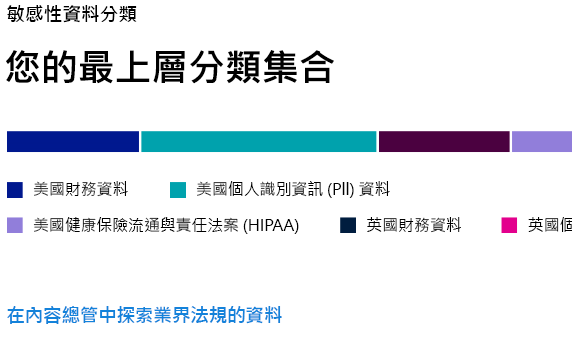
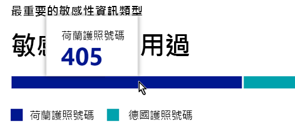
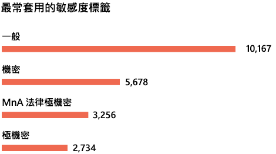
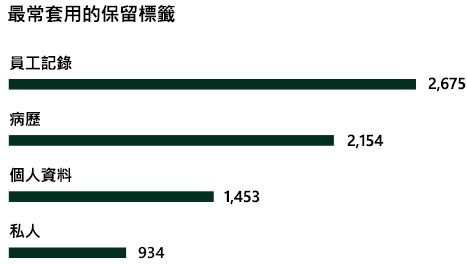

# 資料分類概觀 (預覽)

身為 Microsoft 365 系統管理員或合規性系統管理員，您可以評估並標記貴組織的內容，以控制其目標位置、隨時隨地加以保護，並確保根據貴組織的需求來保存及刪除內容。 您可以透過[敏感度標籤](sensitivity-labels.md)、[保留標籤](labels.md)和敏感性資訊類型分類來執行此動作。 執行探索、評估和標記有多種方法，但最後您可能會有大量以其中一個或兩個標籤標記及分類的文件和電子郵件。 套用保留標籤和敏感度標籤後，您會想要查看租用戶使用標籤的情況，以及對這些項目進行的動作。 資料分類頁面可讓您了解此內容，具體如下：

- 已分類為敏感性資訊類型的項目數量，以及分類的名稱
- Microsoft 365 和 Azure 資訊保護中已套用最高層級的敏感度標籤
- 已套用最高層級的保留標籤
- 使用者對敏感性內容所採取之活動的摘要
- 敏感性資料和保留資料的位置

您可以在 **Microsoft 365 合規性中心**或 **Microsoft 365 安全性中心** > **[分類]** > **[資料分析]** 中找到資料分析。

## 內容中最常使用的敏感性資訊類型

Microsoft 365 隨附許多敏感性資訊類型的定義，例如包含社會安全號碼或信用卡號的項目。 如需有關敏感性資訊類型的詳細資訊，請參閱[敏感性資訊類型在找什麼](what-the-sensitive-information-types-look-for.md)。

敏感性資訊類型卡片會顯示貴組織中找到及套用標籤的最高敏感性資訊類型。

若要找出任何指定分類類別中的項目數量，請將游標暫留在該類別的列上方。

> [!NOTE]
> 如果卡片顯示「包含敏感性資訊的資料」訊息， 這表示貴組織沒有分類為敏感性資訊類型的項目，或沒有已編目的項目。 若要開始使用標籤，請參閱：
>- [敏感性標籤](sensitivity-labels.md)
>- [保留標籤](labels.md)
>- [敏感性資訊類型在找什麼](what-the-sensitive-information-types-look-for.md)

## 套用至內容的最高敏感度標籤

當您將敏感度標籤套用至 Microsoft 365 或 Azure 資訊保護 (AIP) 項目時，會發生兩件事：

- 指示貴組織項目值的標籤會嵌入至文件，並將隨文件移動
- 標籤的存在會啟用各種防護行為，例如強制浮水印或加密。 啟用端點保護後，您甚至可以防止項目離開組織控制。

如需敏感度標籤的詳細資訊，請參閱[敏感度標籤概觀](sensitivity-labels.md)。

SharePoint 和 OneDrive 中的檔案必須啟用敏感度標籤，以便在資料分類頁面中顯示對應資料。 如需詳細資訊，請參閱[對 SharePoint 和 OneDrive 中的 Office 檔案啟用敏感度標籤 (公開預覽)](sensitivity-labels-sharepoint-onedrive-files.md) (英文版)。

敏感度標籤卡片會依敏感度等級顯示項目數量 (電子郵件或文件)。

> [!NOTE]
> 如果您未建立或發佈任何敏感度標籤，或沒有套用敏感度標籤的內容，則此卡片會顯示「未偵測到敏感度標籤」訊息。 若要開始使用標籤，請參閱：
>- [敏感度標籤](sensitivity-labels.md)或針對 AIP [設定 Azure 資訊保護原則](https://docs.microsoft.com/azure/information-protection/configure-policy)

## 套用至內容的最高保留標籤

保留標籤是用於管理貴組織內容的處置。 套用時，可用於控制文件在刪除前保留的時間、是否在刪除前檢閱、保留期間到期的時間，或是否應將文件標示為永遠不能刪除的記錄。 如需詳細資訊，請參閱[保留標籤概觀](labels.md)。

套用最高保留標籤的卡片會顯示具有指定保留標籤的項目數量。

> [!NOTE]
> 如果此卡片顯示「未偵測到保留標籤」訊息，則表示您未建立或發佈任何保留標籤，或沒有套用保留標籤的內容。 若要開始使用保留標籤，請參閱：
>- [保留標籤概觀](labels.md)

## 偵測到的常見活動

此卡片可快速摘要顯示使用者對套用敏感性標籤的項目所採取的常見動作。 您可以使用[活動總管](data-classification-activity-explorer.md)，向下深入切入 Microsoft 365 在標籤內容和 Windows 10 端點內容上追蹤的八個不同活動。

> [!NOTE]
> 若此卡片顯示「未偵測到活動」訊息，表示檔案沒有任何活動，或未開啟使用者與系統管理員稽核。 若要開啟稽核記錄，請參閱：
>- [在安全性與合規性中心搜尋稽核記錄](search-the-audit-log-in-security-and-compliance.md)

## 依位置套用敏感性標籤和保留標籤的資料

資料分類報告的重點是讓您了解具有標籤的項目數量、標籤類型和位置。 這些卡片可讓您了解 Exchange、SharePoint 和 OneDrive 等具有標籤的項目數量。

> [!NOTE]
> 如果此卡片顯示「未偵測到位置」訊息，則表示您未建立或發佈任何敏感性標籤，或沒有套用保留標籤的內容。 若要開始使用敏感度標籤，請參閱：
>- [敏感性標籤](sensitivity-labels.md)

## 另請參閱

- [查看標籤活動 (預覽)](data-classification-activity-explorer.md)
- [檢視已套用標籤的內容 (預覽)](data-classification-content-explorer.md)
- [敏感性標籤](sensitivity-labels.md)
- [保留標籤](labels.md)
- [敏感性資訊類型在找什麼](what-the-sensitive-information-types-look-for.md)
- [保留原則概觀](retention-policies.md)
