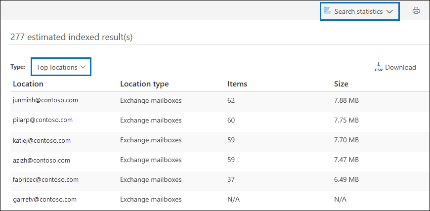

# <a name="ediscovery-solution-series-data-spillage-scenario---search-and-purge"></a>电子数据展示解决方案系列：数据溢出方案 - 搜索和清除

 **什么是数据溢出，为什么要关心？** 数据溢出是将机密文档释放到不受信任的环境中。 检测到数据溢出事件时，必须快速评估溢出的大小和位置，检查泄漏周围的用户活动，然后从系统中永久清除溢出的数据。 
  
## <a name="data-spillage-scenario"></a>数据溢出方案

你是康托索的首席信息安全官 您会获悉数据溢出情况，即员工在不知情的情况下通过电子邮件与多人共享高度机密的文档。 您希望快速评估谁在内部和外部收到此文档。 一旦确定，您希望与其他调查人员共享案例调查结果以进行审查，然后永久删除 Office 365 中的数据。 调查完成后，您希望生成一份报告，其中附有永久删除的证据和其他案例详细信息，以便将来参考。
  
### <a name="scope-of-this-article"></a>本文的范围

本文档提供了有关如何从 Office 365 永久删除邮件以便无法访问或恢复邮件的说明列表。 要删除邮件并使其在已删除的项目保留期到期之前可恢复，请参阅在[Office 365 组织中搜索和删除电子邮件。](search-for-and-delete-messages-in-your-organization.md)
  
## <a name="workflow-for-managing-data-spillage-incidents"></a>用于管理数据溢出事件的工作流

以下是如何管理数据溢出事件：


  
[（可选）第 1 步：管理可以访问案例的人员并设置合规性边界](#optional-step-1-manage-who-can-access-the-case-and-set-compliance-boundaries)<br/>
[第 2 步：创建电子数据展示案例](#step-2-create-an-ediscovery-case)<br/>
[第 3 步：搜索溢出的数据](#step-3-search-for-the-spilled-data)<br/>
[第 4 步：审核和验证案例发现](#step-4-review-and-validate-case-findings)<br/>
[步骤 5：使用消息跟踪日志检查溢出数据的共享方式](#step-5-use-message-trace-log-to-check-how-spilled-data-was-shared)<br/>
[步骤 6：准备邮箱](#step-6-prepare-the-mailboxes)<br/>
[步骤 7：永久删除溢出的数据](#step-7-permanently-delete-the-spilled-data)<br/>
[第 8 步：验证、提供删除证明和审核](#step-8-verify-provide-a-proof-of-deletion-and-audit)<br/>

## <a name="things-to-know-before-you-start"></a>开始之前需要了解的事项

- 当邮箱处于保留状态时，已删除的邮件将保留在"可恢复项目"文件夹中，直到保留期到期或保留释放。 [步骤 6](#step-6-prepare-the-mailboxes)介绍了如何从邮箱中删除保留。 在删除保留之前，请咨询您的记录管理或法律部门。 您的组织可能具有一个策略，用于定义邮箱处于保留状态还是数据溢出事件是否具有优先级。 
    
- 要控制数据溢出调查员可以搜索和管理谁可以访问案例的用户邮箱，您可以设置合规性边界并创建自定义角色组，步骤[1](#optional-step-1-manage-who-can-access-the-case-and-set-compliance-boundaries)中对此进行了说明。 为此，您必须是组织管理角色组的成员，或者被分配角色管理角色。 如果您或组织中的管理员已设置合规性边界，则可以跳过步骤 1。
    
- 要创建案例，您必须是电子数据展示管理器角色组的成员，或者必须是分配了案例管理角色的自定义角色组的成员。 如果您不是成员，请让 Office 365 管理员[将您添加到电子数据展示管理器角色组](assign-ediscovery-permissions.md)。
    
- 要删除溢出到组织的数据，您需要在 Exchange 在线 PowerShell 中使用[搜索邮箱 - 删除内容](https://docs.microsoft.com/powershell/module/exchange/mailboxes/Search-Mailbox?view=exchange-ps)命令。 此外，要*使用"删除内容"* 参数，还必须是已分配邮箱导入导出角色的 Exchange Online 中的角色组的成员。 [请参阅"管理角色组"](https://technet.microsoft.com/library/jj657480%28v=exchg.150%29.aspx)中的"将角色添加到角色组"部分。
    
- 要在步骤 8 中搜索 Office 365 审核日志电子数据展示活动，必须为您的组织打开审核。 您可以搜索在过去 90 天内执行的活动。 要了解有关如何启用和使用审核的更多详细信息，请参阅步骤 8[中的"审核数据溢出调查过程"](#auditing-the-data-spillage-investigation-process)部分。 
    
## <a name="optional-step-1-manage-who-can-access-the-case-and-set-compliance-boundaries"></a>（可选）第 1 步：管理可以访问案例的人员并设置合规性边界

根据您的组织实践，您需要控制谁可以访问用于调查数据溢出事件并设置合规性边界的电子数据展示案例。 最简单的方法是将调查员添加为安全&合规中心的现有角色组的成员，然后将角色组添加为电子数据展示案例的成员。 有关内置电子数据展示角色组以及如何将成员添加到电子数据展示案例的信息，请参阅[分配电子数据展示权限](assign-ediscovery-permissions.md)。
  
您还可以创建一个符合组织需求的新角色组。 例如，您可能希望组织中的一组数据溢出调查员访问所有数据溢出案例并进行协作。 为此，可以通过创建"数据溢出调查者"角色组、分配适当的角色（导出、RMS 解密、审阅、预览、合规性搜索和案例管理）、将数据溢出调查员添加到角色组，然后添加角色组作为数据溢出电子数据展示案例的成员。 有关如何执行此操作的[详细说明，请参阅在 Office 365 中为电子数据展示调查设置合规性边界。](tagging-and-assessment-in-advanced-ediscovery.md) 
  
## <a name="step-2-create-an-ediscovery-case"></a>第 2 步：创建电子数据展示案例

电子数据展示案例提供了管理数据溢出调查的有效方法。 您可以将成员添加到在步骤 1 中创建的角色组，将角色组添加为新电子数据展示案例的成员，执行迭代搜索以查找溢出的数据，导出要共享的报表，跟踪案例的状态，然后引用 c 的详细信息如果需要，可以。 请考虑为用于数据溢出事件的第一个发现案例建立命名约定，并在案例名称和说明方面提供尽可能多的信息，以便将来在必要时查找和参考。
  
要创建新案例，您可以在安全和合规性中心使用电子数据展示。 请参阅[在电子数据展示案例](ediscovery-cases.md#step-2-create-a-new-case)中"创建新案例"。
  
## <a name="step-3-search-for-the-spilled-data"></a>第 3 步：搜索溢出的数据

现在，您已经创建了案例和托管访问，可以使用该案例进行迭代搜索，以查找溢出的数据并标识包含溢出数据的邮箱。 您将使用用于查找电子邮件的相同搜索查询来删除[步骤 7](#step-7-permanently-delete-the-spilled-data)中的这些相同的邮件。
  
要创建与电子数据展示案例关联的内容搜索，请参阅[电子数据展示案例](ediscovery-cases.md#step-5-create-and-run-a-content-search-associated-with-a-case)中的"创建并运行与案例关联的内容搜索"。
  
 **重要提示：** 您在搜索查询中使用关键字可能包含要搜索的实际溢出数据。 例如，如果搜索包含社会安全号码的文档并将其用作搜索关键字，则必须在以后删除查询以避免进一步溢出。 请参阅删除步骤 8 中的[搜索查询。](#deleting-the-search-query) 
  
## <a name="step-4-review-and-validate-case-findings"></a>第 4 步：审核和验证案例发现

创建内容搜索后，需要查看并验证搜索结果，并验证它们是否仅包含必须删除的电子邮件。 在内容搜索中，您可以预览 1，000 封电子邮件的随机采样，而无需导出搜索结果，以避免进一步的数据溢出。 [您可以在"内容搜索限制"](limits-for-content-search.md)中了解有关预览限制的更多内容。
  
如果您有超过 1，000 个邮箱或 100 多封电子邮件，则可以使用其他关键字或条件（如日期范围或发件人/收件人）将初始搜索划分为多个搜索，并查看每个搜索的结果单独。 请确保记下在[步骤 7](#step-7-permanently-delete-the-spilled-data)中删除邮件时要使用的所有搜索查询。

如果为保管人或最终用户分配了 Office 36 E5 许可证，则可以使用 Office 365 高级电子数据展示一次检查多达 10，000 个搜索结果。 如果有 10，000 多封电子邮件要审阅，您可以按日期范围划分搜索查询，并根据需要按日期对搜索结果逐次查看每个结果。 在高级电子数据展示中，您可以使用预览面板**中的"标签"功能**标记搜索结果，并按标记标记筛选搜索结果。 当您与辅助审阅者协作时，这非常有用。 通过使用高级电子数据展示中的其他分析工具（如光学字符识别、电子邮件线程和预测编码），您可以快速处理和查看数千条消息，并标记它们以进行进一步审查。 请参阅[Office 365 高级电子数据展示的快速设置](quick-setup-for-advanced-ediscovery.md)。

找到包含溢出数据的电子邮件时，请检查邮件的收件人以确定邮件是否在外部共享。 要进一步跟踪邮件，可以收集发件人信息和日期范围，以便可以使用邮件跟踪日志，步骤[5](#step-5-use-message-trace-log-to-check-how-spilled-data-was-shared)中对此进行了说明。

您已验证搜索结果，您可能需要与其他人共享您的调查结果进行二次审核。 您在步骤 1 中分配给案例的人员可以查看电子数据展示和高级电子数据展示中的案例内容，并批准案例调查结果。 您还可以生成报表，而无需导出实际内容。 您也可以将同一报表用作删除证明，步骤[8](#step-8-verify-provide-a-proof-of-deletion-and-audit)中对此进行了说明。
  
 **要生成统计报告：**
  
1. 转到"电子数据展示"案例**中的"搜索"** 页面，然后单击要为其生成报告的搜索。 
    
2. 在"弹出窗口"页上，**单击"更多>导出报告**。
 
      将显示"导出报告"页。

    
    
3. 选择**所有项目，包括那些具有无法识别的格式、已加密或由于其他原因未编制索引的项目，** 然后单击"**生成报告"。**

4. 在电子数据展示情况下，**单击"导出"** 以显示导出作业的列表。 您可能需要**单击"刷新"** 以更新列表以显示刚刚创建的导出作业。

5. 单击导出作业，然后单击"在弹出窗口"页上**下载**报告。
 
    

"**导出摘要"** 报表包含找到具有结果的位置数和搜索结果的大小。 您可以使用它来比较删除后生成的报表，并提供作为删除证明。 **"结果"** 报告包含搜索结果的更详细摘要，包括主题、发件人、收件人（如果已阅读电子邮件）以及每封邮件的日期和大小。 如果此报告中的任何详细信息包含实际溢出的数据，请确保在调查完成后永久删除 Results.csv 文件。

有关导出报表的详细信息，请参阅[导出内容搜索报表](export-a-content-search-report.md)。
    
## <a name="step-5-use-message-trace-log-to-check-how-spilled-data-was-shared"></a>步骤 5：使用消息跟踪日志检查溢出数据的共享方式

要进一步调查是否共享了包含溢出数据的电子邮件，您可以选择使用发件人信息和您在步骤 4 中收集的日期范围信息查询邮件跟踪日志。 请注意，实时数据的消息跟踪保留期为 30 天，历史数据的保留期为 90 天。
  
您可以在安全和合规性中心中使用消息跟踪，也可以在 Exchange 在线 PowerShell 中使用相应的 cmdlet。 请务必注意，消息跟踪不能完全保证返回的数据的真实性。 有关使用消息跟踪的详细信息，请参阅： 
  
- [安全性與合規性中心內的訊息追蹤](https://support.office.com/article/3e64f99d-ac33-4aba-91c5-9cb4ca476803.aspx)
    
- [安全&合规性中心的新消息跟踪](https://blogs.technet.microsoft.com/exchange/2018/05/02/new-message-trace-in-office-365-security-compliance-center/)
    
## <a name="step-6-prepare-the-mailboxes"></a>步骤 6：准备邮箱

查看并验证搜索结果是否仅包含必须删除的邮件后，需要收集在运行**搜索邮箱 - 删除内容**命令时在步骤 7 中使用的影响邮箱的电子邮件地址列表。 您可能还必须准备邮箱，然后才能永久删除电子邮件，具体取决于在包含溢出数据的邮箱上是否启用了单个项目恢复，或者这些邮箱中是否有任何处于保留状态。
  
### <a name="get-a-list-of-addresses-of-mailboxes-with-spilled-data"></a>获取包含溢出数据的邮箱地址列表

有两种方法可以收集包含溢出数据的邮箱的电子邮件地址列表。

**选项 1：获取包含溢出数据的邮箱地址列表**

1. 打开电子数据展示案例，**转到"搜索"** 页面并选择相应的内容搜索。 
    
2. 在"弹出窗口"页上，单击"**查看结果"。**
    
3. 在"**单个结果**下拉列表"中，**单击"搜索统计信息"。**
    
4. 在"**键入**下拉列表"中，**单击"热门位置"。**
    
    

    将显示包含搜索结果的邮箱列表。 还会显示每个邮箱中与搜索查询匹配的项目数。
    
5. 复制列表中的信息并将其保存到文件中，或**单击"下载"** 将信息下载到 CSV 文件。 
    
**选项 2：从导出报告获取邮箱位置**

打开[您在步骤 4](#step-4-review-and-validate-case-findings)中下载的导出摘要报告。 在报表的第一列中，每个邮箱的电子邮件地址列**在"位置"** 下。
  
### <a name="prepare-the-mailboxes-so-you-can-delete-the-spilled-data"></a>准备邮箱，以便删除溢出的数据

如果启用了单个项目恢复，或者邮箱被置于保留状态，则永久删除（清除）邮件将保留在可恢复项目文件夹中。 因此，在清除溢出的数据之前，需要检查现有邮箱配置并禁用单个项目恢复并删除任何保留或 Office 365 保留策略。 请记住，您可以一次准备一个邮箱，然后在不同的邮箱上运行相同的命令，或者创建 PowerShell 脚本以同时准备多个邮箱。

- 请参阅"步骤 1：收集有关邮箱的信息"，请参阅[保留的基于云的邮箱的"可恢复项目"文件夹中的"删除项目"](delete-items-in-the-recoverable-items-folder-of-mailboxes-on-hold.md#step-1-collect-information-about-the-mailbox)中的信息，了解如何检查是否启用了单个项目恢复，或者邮箱是否置于保留状态或分配给保留策略。 
    
- 有关禁用单个项目恢复的说明，请参阅[保留的基于云的邮箱的可恢复项目文件夹中](delete-items-in-the-recoverable-items-folder-of-mailboxes-on-hold.md#step-2-prepare-the-mailbox)的"步骤 2：准备邮箱"。 
    
- 有关如何从邮箱中删除保留或保留策略的说明，请参阅"步骤 3：从邮箱中删除所有保留"，[请参阅"删除基于云的邮箱的可恢复项目"文件夹中](delete-items-in-the-recoverable-items-folder-of-mailboxes-on-hold.md#step-3-remove-all-holds-from-the-mailbox)的项目。 

- 请参阅"步骤 4：从邮箱中删除延迟保留"，[请参阅"删除基于云的邮箱的可恢复项目"文件夹中的"保留"项目中的"项目"，](delete-items-in-the-recoverable-items-folder-of-mailboxes-on-hold.md#step-4-remove-the-delay-hold-from-the-mailbox)了解有关删除任何类型的保留后放置在邮箱上的延迟保留的说明。
    
 **重要提示：** 在删除保留或保留策略之前，请咨询您的记录管理或法律部门。 您的组织可能具有一个策略，用于定义邮箱处于保留状态还是数据溢出事件是否具有优先级。 
  
在验证溢出的数据是否已永久删除后，请确保将邮箱还原到以前的配置。 请参阅[步骤 7](#step-7-permanently-delete-the-spilled-data)中的详细信息。

## <a name="step-7-permanently-delete-the-spilled-data"></a>步骤 7：永久删除溢出的数据

使用您在步骤 6 中收集和准备的邮箱位置以及步骤 3 中创建和优化的搜索查询来查找包含溢出数据的电子邮件，现在可以永久删除溢出的数据。 如前所述，您必须在 Exchange Online 中分配邮箱导入导出角色，以便使用以下过程删除邮件。
  
1. [連線至 Exchange Online PowerShell](https://go.microsoft.com/fwlink/?linkid=396554)。
    
2. 執行下列命令：
    
    ```
    Search-Mailbox -Identity <mailbox identity> -SearchDumpster -DeleteContent $true -SearchQuery <search query>
    ```
  
3. 通过替换 Identity 参数的值，重新运行包含溢出数据的每个邮箱的上一个命令;例如：

    ```
    Search-Mailbox -Identity sarad@contoso.onmicrosoft.com -SearchQuery <search query> -DeleteContent
    ```

    ```
    Search-Mailbox -Identity janets@contoso.onmicrosoft.com -SearchQuery <search query> -DeleteContent
    ```

   ```
   Search-Mailbox -Identity pilarp@contoso.onmicrosoft.com -SearchQuery <search query> -DeleteContent
   ```
  
如前所述，您还可以创建一个[powershell 脚本，](https://docs.microsoft.com/powershell/scripting/powershell-scripting?view=powershell-6)并针对邮箱列表运行它，以便该脚本删除每个邮箱中溢出的数据。
  
## <a name="step-8-verify-provide-a-proof-of-deletion-and-audit"></a>第 8 步：验证、提供删除证明和审核

工作流中管理数据溢出事件的最后一步是，通过访问电子数据展示案例并重新运行用于删除该数据以确认没有结果的搜索查询，验证溢出的数据是否已从邮箱永久删除。e 返回。 确认溢出的数据已被永久删除后，可以导出报表并将其（连同原始报表）作为删除证明。 然后，您可以[关闭案例，](ediscovery-cases.md#optional-step-9-close-a-case)这将允许您重新打开它，如果你在将来提到它。 此外，您还可以将邮箱还原到以前的状态，删除用于查找溢出数据的搜索查询，以及搜索管理数据溢出事件时执行的任务的审核记录。 
  
### <a name="reverting-the-mailboxes-to-their-previous-state"></a>将邮箱还原到以前的状态

如果在步骤 6 中更改了任何邮箱配置，以在删除溢出的数据之前准备邮箱，则需要将它们还原到以前的状态。 请参阅[保留的基于云的邮箱的"可恢复项目"文件夹中的"删除项目"](delete-items-in-the-recoverable-items-folder-of-mailboxes-on-hold.md#step-6-revert-the-mailbox-to-its-previous-state)中的"步骤 6：将邮箱还原到其以前的状态"。
  
### <a name="deleting-the-search-query"></a>删除搜索查询

如果在步骤 3 中创建和使用搜索查询中的关键字包含所有实际溢出的数据，则应删除搜索查询以防止进一步的数据溢出。
  
1. 在安全和合规性中心，打开电子数据展示案例，**转到"搜索"** 页面，然后选择相应的内容搜索。
    
2. 在弹出窗口页上，单击"**删除"。**

    
    
### <a name="auditing-the-data-spillage-investigation-process"></a>审核数据溢出调查流程

您可以搜索 Office 365 审核日志，查找调查期间执行的电子数据展示活动。 您还可以搜索审核日志以返回在运行**搜索邮箱 -删除内容**命令以删除溢出数据时创建的审核记录。 如需詳細資訊，請參閱：

- [搜尋稽核記錄](search-the-audit-log-in-security-and-compliance.md)

- [在稽核記錄中搜尋電子文件探索活動](search-for-ediscovery-activities-in-the-audit-log.md)

- 有关如何在 Exchange 在线中运行 cmdlet 相关的审核记录的指导，请参阅[搜索审核日志](search-the-audit-log-in-security-and-compliance.md#audited-activities)中的"已审核活动 - Exchange 管理员审核日志"部分。
  

