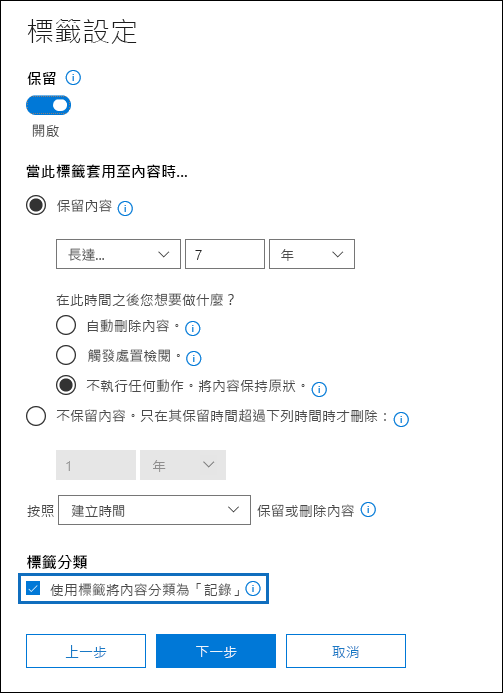

# <a name="declare-records-by-using-retention-labels"></a>使用 [保留標籤] 宣告記錄

>*[Microsoft 365 安全性與合規性的授權指引](/office365/servicedescriptions/microsoft-365-service-descriptions/microsoft-365-tenantlevel-services-licensing-guidance/microsoft-365-security-compliance-licensing-guidance)。*

若要將文件和電子郵件宣告為 [[紀錄]](records-management.md#records)，您可使用 [[保留標籤]](retention.md#retention-labels) 將内容標記為 **[紀錄]** 或 **[監管記錄]**。

如果您不確定要使用記錄還是監管記錄，請參閱 [比較允許或封鎖哪些動作的限制](records-management.md#compare-restrictions-for-what-actions-are-allowed-or-blocked)。 如果您需要使用監管記錄，您必須先執行 PowerShell 命令（如下個章節所述）。

您可以在保留標籤原則中發佈這些標籤，讓使用者和系統管理員將這些標籤套用至內容，或針對可將項目標示為記錄 (而非監管記錄) 的標籤，您還可以自動將這些標籤套用到您想要宣告為記錄的內容。

## <a name="how-to-display-the-option-to-mark-content-as-a-regulatory-record"></a>如何顯示將內容標示為監管記錄的選項

>[!NOTE] 
> 下列程序是可審核的動作，在審核記錄的 [[保留原則和保留標籤活動]](search-the-audit-log-in-security-and-compliance.md#retention-policy-and-retention-label-activities) 章節中記錄 **[為保留標籤啟動的監管記錄選項]**。

根據預設，用以將內容標示為監管記錄的保留標籤選項，不會在保留標籤精靈中顯示。 若要顯示此選項，您必須先執行 PowerShell 命令：

1. [連接到 Office 365 安全性與合規性中心 PowerShell](/powershell/exchange/office-365-scc/connect-to-scc-powershell/connect-to-scc-powershell)。

2. 執行下列 Cmdlet：
    
    ```powershell
    Set-RegulatoryComplianceUI -Enabled $true
    ````
    系統不會提示您確認，且設定會立即生效。

如果您改變主意，想在保留標籤精靈中變更這個選項，要將它再次隱藏您可以執行相同的 Cmdlet 並使用 **[false]** 值：`Set-RegulatoryComplianceUI -Enabled $false` 

## <a name="configuring-retention-labels-to-declare-records"></a>設定 [保留標籤] 以宣告記錄

當您在 Microsoft 365 合規性中心的 **[記錄管理]** 解決方案中建立保留標籤時，您可以選擇將項目標示為記錄。 如果您執行上一章節的 PowerShell 命令，則可將項目標示為監管記錄。

例如：



您可視需要將保留標籤套用至 SharePoint 或 OneDrive 文件和 Exchange 電子郵件。 

如需完整指示：

- [建立保留標籤，並在應用程式中套用這些標籤](create-apply-retention-labels.md)

- [自動將保留標籤套用至內容](apply-retention-labels-automatically.md) (不支援監管記錄)


## <a name="applying-the-configured-retention-label-to-content"></a>將已設定的保留標籤套用至內容

將內容標示為記錄或監管記錄的保留標籤，可供使用者在應用程式中套用：

- 針對 Exchange，任何信箱存取權的使用者都可以套用這些標籤。 
- 對於 SharePoint 和 OneDrive，預設 [成員] 群組 ([參與] 權限等級) 中的任何使用者都能套用這些標籤。

使用保留標籤將文件標示為記錄的範例：


## <a name="searching-the-audit-log-for-labeled-items-that-were-declared-records"></a>搜尋已宣告記錄的具標籤項目的稽核記錄

將項目標示為記錄的動作會記錄在稽核記錄中。

對於 SharePoint 項目： 
- 於 **[檔案和頁面活動]**，選取 **[已變更檔案的保留標籤]**。 此稽核事件適用於將項目標記為記錄、法規記錄或標準保留標記的保留標記。

對於 Exchange 項目：
- 於 **[Exchange 信箱活動]**，選取 **[已將訊息標記成一筆記錄]**。 此稽核事件適用於將項目標記為記錄或法規記錄的保留標記。

如需搜尋這些事件的詳細資訊，請參閱[在安全性與合規性中心搜尋稽核記錄](search-the-audit-log-in-security-and-compliance.md#file-and-page-activities)。

## <a name="next-steps"></a>後續步驟

若需記錄管理支援的案例清單，請參閱 [[記錄管理的常見案例]](get-started-with-records-management.md#common-scenarios-for-records-management)。
