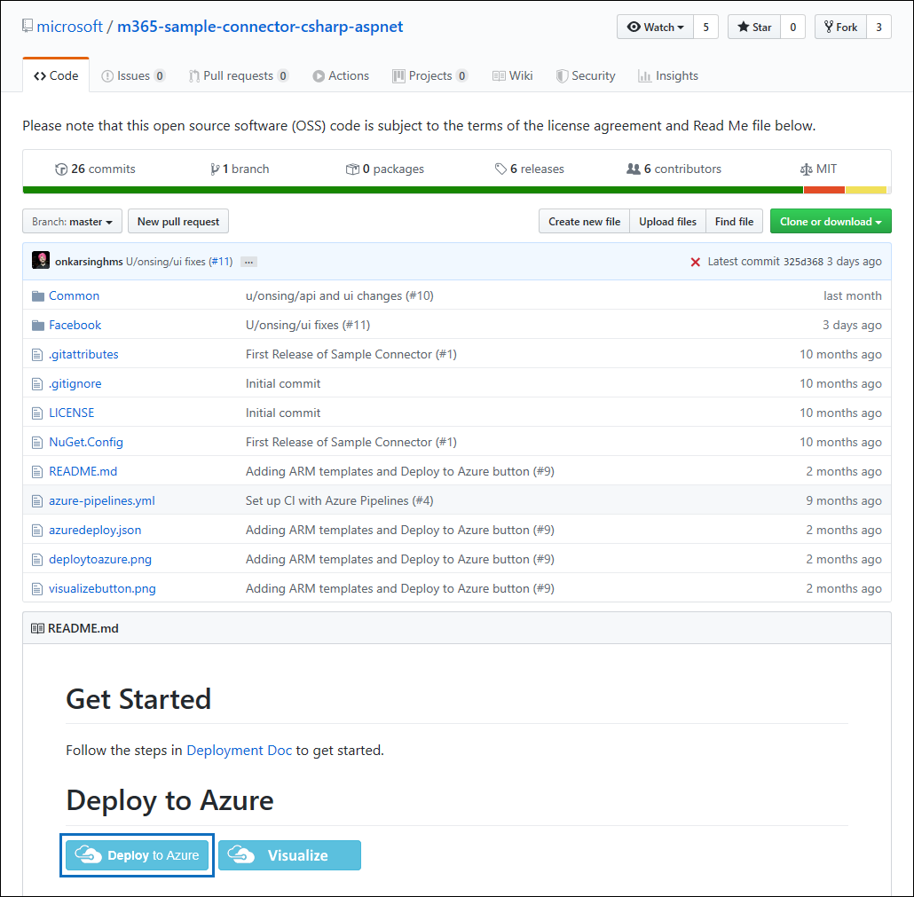
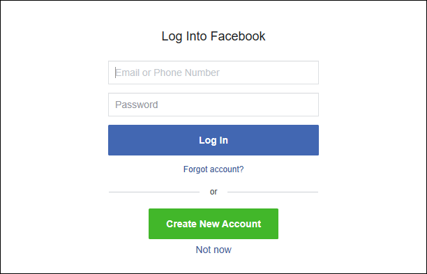

# 部署封存的頁面 Facebook 商務資料的連接器

本文包含部署 Facebook 商務頁面的資料匯入至 Microsoft 365 使用 Microsoft 365 匯入服務的連接器的逐步程序。 此程序的高階概觀與部署的 Facebook 連接器所需的必要條件清單，請參閱[設定連接器，以封存 Facebook 資料](archive-facebook-data-with-sample-connector.md)。 

## 步驟 1: Azure Active Directory 中建立的應用程式

1. 移至 [<https://portal.azure.com>並使用 Office 365 全域系統管理員帳戶的認證登入。

    

2. 在左側的導覽窗格中，按一下 [ **Azure Active Directory**]。

    

3. 在左側的導覽窗格中，按一下 [**應用程式註冊 （預覽）** ，然後按一下 [**新增註冊**。

    

4. 註冊應用程式。 [重新導向 URI，選取 Web 應用程式類型] 下拉式清單中，然後輸入<https://portal.azure.com>URI] 方塊中。

   

5. 複製 **（用戶端） 的應用程式識別碼**] 及 [**目錄 （承租人） 識別碼**，並將它們儲存到文字檔或其他安全的位置。 您在稍後步驟使用這些識別碼。

   ![複製應用程式識別碼] 及 [目錄識別碼，並將其儲存](media/FBCimage5.png)

6. 移至**新的應用程式的憑證 & 機密資料**

   

7. 按一下 [**新的用戶端密碼**

   

8. 建立新的密碼。 在 [描述] 方塊中，輸入密碼，然後選擇的到期時間。 

    

9. 複製密碼的值，並將它儲存到文字檔或其他儲存位置。 這是您在稍後步驟使用的 AAD 應用程式密碼。

   

## 步驟 2： 部署至您的 Azure 帳戶從 GitHub 連接器 」 的 web 服務

1. 移至[這個 GitHub 網站](https://github.com/microsoft/m365-sample-connector-csharp-aspnet)，然後按一下 [**部署至 Azure**。

    

2. 按一下 [**部署至 Azure**之後，您將會重新導向至自訂的範本] 頁面上使用 Azure 入口網站。 填入的**基本概念**和**設定**詳細資料，然後按一下 [**購買**。

    - **訂閱：** 選取您想要部署 Facebook 商務頁面連接器 web 服務，以您 Azure 訂用帳戶。
    
    - **資源群組：** 選擇或建立新的資源群組。 資源群組是保留 Azure 解決方案的相關的資源的容器。

    - **位置：** 選擇的位置。

    - **Web 應用程式名稱：** Web 應用程式提供連接器的唯一名稱。 對名稱必須是長度為 3 並 18 個字元之間。 此名稱用來建立 Azure 應用程式服務的 URL;例如，如果您提供**fbconnector**的 Web 應用程式名稱然後 Azure 應用程式服務的 URL 將會是**fbconnector.azurewebsites.net**。
    
    - **tenantId:** 您在步驟 1 中的 Azure Active Directory 中建立 Facebook 連接器應用程式之後複製您 Microsoft 365 組織租用戶識別碼。
    
   - **APISecretKey:** 您可以為密碼輸入任何值。 這用來存取在步驟 5 中的連接器 web 應用程式。
   
     ![按一下 [建立資源] 和 [類型儲存體帳戶](media/FBCimage12.png)

3. 部署成功後，看起來類似下列的螢幕擷取畫面] 頁面上：

     

## 步驟 3： 註冊 Facebook 應用程式

1. 移至 [ <https://developers.facebook.com>，登入之帳戶的組織的 Facebook 商務頁面、 使用的認證，然後按一下 [**新增新的應用程式**。

   

2. 建立新的應用程式識別碼。

   

3. 在左側的導覽窗格中，按一下 [**新增產品**]，然後按一下**Set Up**中 [ **Facebook 登入**] 磚。

   

4. 在整合 Facebook 登入頁面上，按一下 [ **Web**]。

   ![按一下 [Web] 上的整合 Facebook 登入頁面](media/FBCimage28.png)

5. 新增 Azure 應用程式服務的 URL;例如`https://fbconnector.azurewebsites.net`。

   

6. 完成 [快速入門] 區段中的 Facebook 登入安裝程式。

   ![完成 [快速入門] 區段](media/FBCimage30.png)

7. 在左側的導覽窗格的 [ **Facebook 登入**，按一下 [**設定**]，並在**有效的 OAuth 重新導向 Uri** ] 方塊中新增的 OAuth 重新導向 URI。 使用格式**\<connectorserviceuri>/檢視/FacebookOAuth**、 其中 connectorserviceuri 的值是為您的組織; Azure 應用程式服務 URL例如， `https://fbconnector.azurewebsites.net`。

   

8. 在左側的導覽窗格中，按一下 [**新增產品**，然後按一下 [ **Webhooks。** **頁面**下拉功能表中，按一下 [**頁面]**。 

   

9. 新增 Webhooks 回呼 URL，並將確認語彙基元。 回呼的 URL，格式使用格式**<connectorserviceuri>/api/FbPageWebhook**、 其中 connectorserviceuri 的值是為您的組織; Azure 應用程式服務 URL例如`https://fbconnector.azurewebsites.net`。 

    驗證權杖應該類似強式密碼。 將驗證權杖複製到文字檔或其他儲存位置。

        

10. 測試和訂閱的端點摘要。

    

11. 新增隱私權 URL、 應用程式圖示和商業用途。 此外，將應用程式識別碼和應用程式密碼複製到文字檔或其他儲存位置。

    

12. 將應用程式公開。

    

13. 將使用者新增至系統管理員或測試人員角色。

    

14. 新增 [**網頁公用的內容存取**權限。

    ![dd] 頁面上的公用內容存取權限](media/FBCimage38.png)

15. 新增管理頁面的權限。

    

16. 取得由 Facebook 檢閱應用程式。

    

## 步驟 4： 設定連接器的 web 應用程式

1. 移至 https://\<AzureAppResourceName>.azurewebsites.net （其中 AzureAppResourceName 是您在步驟 4 中名為您 Azure 應用程式資源的名稱），例如，如果名稱為**fbconnector**，請移至`https://fbconnector.azurewebsites.net`。 應用程式的 [首頁] 頁面上看起來像下列螢幕擷取畫面中：

   

2. 按一下 [**設定**] 頁面中，會顯示號。
 
   ![按一下 [設定] 頁面中，會顯示號](media/FBCimage42.png)

3. 在租用戶識別碼] 方塊中，輸入或貼上您的租用戶識別碼 （您在步驟 2 中所取得）。 在 [密碼] 方塊中，輸入或貼上 APISecretKey （，您在步驟 2 中所取得），，然後按一下要顯示 [組態詳細資料] 頁面上**設定的組態設定**。

    

4. 輸入下列組態設定 

   - **Facebook 應用程式識別碼：** 您在步驟 3 中所取得的 Facebook 應用程式的應用程式識別碼。
   
   - **Facebook 應用程式密碼：** 您在步驟 3 中所取得的 Facebook 應用程式之應用程式密碼。
   
   - **Facebook webhooks 驗證權杖：** 您在步驟 3 中建立驗證權杖。
   
   - **AAD 應用程式識別碼：** 您在步驟 1 建立的 Azure Active Directory 應用程式的應用程式識別碼。
   
   - **AAD 應用程式密碼：** 您在步驟 1 建立的 APISecretKey 密碼值。

5. 按一下 [**儲存**] 以儲存連接器設定。

## 步驟 5： 設定 Microsoft 365 合規性中心中的 Facebook 連接器

1. 移至 [ [https://compliance.microsoft.com](https://compliance.microsoft.com) ，然後按一下 [從左側的 [**資料連接器**

2. 在 [**資料連接器 （預覽）** 頁面的 [ **Facebook 商務頁面**，按一下 [**檢視**]。

3. 在**Facebook 商務頁面**] 頁面上，按一下 [**新增連接器**]。

4. 在**服務中的條款**] 頁面上，按一下 [**接受**]。

5.  在**您的連接器應用程式新增認證**] 頁面中，輸入下列資訊，然後按一下 [**驗證連線**。

    

    - 在 [**名稱**] 方塊中，輸入連接器，例如**Facebook 新聞] 頁面**的名稱。
    
    - 在 [**連線 URL** ] 方塊中，輸入或貼上的 Azure 應用程式服務 URL;例如`https://fbconnector.azurewebsites.net`。
    
    - 在 [**密碼**] 方塊中，輸入或貼上您在步驟 2 中新增 APISecretKey 的值。
    
    - 在**Azure 應用程式識別碼**] 方塊中，輸入或貼上也稱為為您在步驟 1 建立的 AAD 應用程式 ID （用戶端） 的應用程式識別碼的值。
 
6. 連線成功驗證之後，按一下 [**下一步**]。

7. 在 [**授權 Microsoft 365，以匯入資料**] 頁面上，輸入或貼上 APISecretKey 再次並再按一下 [**登入 web 應用程式**。

8. 在**設定 Facebook 連接器應用程式**] 頁面上，按一下 [**登入與 Facebook**和登入之帳戶的組織的 Facebook 商務頁面使用的認證。 請確定您指派給貴組織的 Facebook 商務頁面的管理員角色登入 Facebook 帳戶。

   

9. 受管理的 Facebook 帳戶，登入商務頁面清單隨即顯示。 選取 [頁面以封存，然後按一下 [**下一步**]。

    

10. 按一下 [**繼續**] 以結束連接器服務應用程式的設定。

11. 在 [**設定篩選器**] 頁面上，您可以套用篩選器，一開始匯入特定天數的項目。 選取 [保留天數，，然後按一下 [**下一步**。

12. 在 [**選擇儲存位置**] 頁面上，輸入 Facebook 項目會被匯入，並再按 [**下一步**，Microsoft 365 信箱的電子郵件地址。

13. 在**提供系統管理員同意**，按一下**提供同意**，然後遵循的步驟。 您必須是全域系統管理員提供 Office 365 匯入服務來存取您的組織中資料的同意。

14. 按 [**下一步**檢閱連接器設定，然後按一下 [**完成**] 以完成連接器設定。

15. 在合規性中心] 中，移至**資料連接器**] 頁面上，然後按一下 [**連接器**] 索引標籤，若要查看匯入程序的進度。
