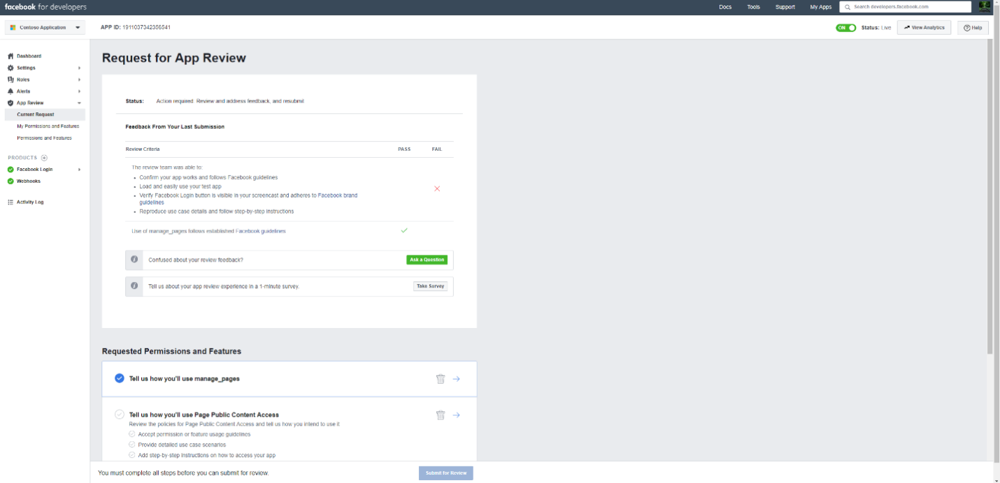

# 部署連接器以封存 Facebook 商務頁面資料

本文包含的逐步程式可讓您部署使用 Microsoft 365 匯入服務的連接器，將資料從 Facebook 商務版頁面匯入至 Microsoft 365。 如需此程式的高層次概述，以及部署 Facebook 連接器所需的必要條件清單，請參閱[Set up a connector to Archive facebook data](archive-facebook-data-with-sample-connector.md)。 

## 步驟1：在 Azure Active Directory 中建立應用程式

1. 移至<https://portal.azure.com>並使用 Office 365 全域管理員帳戶的認證登入。

    

2. 在左功能窗格中，按一下 [ **Azure Active Directory**]。

    ![按一下 [Azure Active Directory]](../media/FBCimage2.png)

3. 在左功能窗格中，按一下 [**應用程式註冊（預覽）** ]，然後按一下 [**新增註冊**]。

    ![按一下 [* * 應用程式註冊（預覽）] * *，然後按一下 [新增註冊 * *]。](../media/FBCimage3.png)

4. 註冊應用程式。 在 [重新導向 URI] 底下，選取 [應用程式類型] 下拉式<https://portal.azure.com>清單中的 [Web]，然後輸入 URI 的方塊。

   

5. 複製**應用程式（用戶端）識別碼**及**目錄（租**使用者）識別碼，並將其儲存至文字檔或其他安全的位置。 您可以在稍後的步驟中使用這些 IDs。

   

6. 移至**憑證 & 新應用程式的機密。**

   

7. 按一下 [**新增用戶端密碼**]

   ![按一下 [新增用戶端密碼]](../media/FBCimage7.png)

8. 建立新的機密。 在 [描述] 方塊中，輸入密碼，然後選擇到期期限。 

    

9. 複製密碼的值，並將其儲存至文字檔或其他儲存位置。 這是您在後續步驟中使用的 AAD 應用程式密碼。

   

## 步驟2：將連接器 web 服務從 GitHub 部署至您的 Azure 帳戶

1. 移[至此 GitHub 網站](https://github.com/microsoft/m365-sample-connector-csharp-aspnet)，然後按一下 [**部署至 Azure**]。

    ![按一下 [部署至 Azure]](../media/FBCGithubApp.png)

2. 按一下 [**部署至 Azure**] 後，系統會以自訂範本頁面重新導向至 azure 入口網站。 填入**基本概念**和**設定**詳細資料，然後按一下 [**購買**]。

    - **訂閱：** 選取您要部署 Facebook 商務頁面連接器 web 服務的 Azure 訂閱。
    
    - **資源群組：** 選擇或建立新的資源群組。 資源群組是一個容器，可容納 Azure 解決方案的相關資源。

    - **位置：** 選擇位置。

    - **Web 應用程式名稱：** 提供連接器 web 應用程式的唯一名稱。 Th 名稱的長度必須介於3到18個字元之間。 這個名稱是用來建立 Azure app service URL;例如，如果您提供**fbconnector**的 Web 應用程式名稱，Azure 應用程式服務 URL 會是**fbconnector.azurewebsites.net**。
    
    - **tenantId：** 您在步驟1中建立 Azure Active Directory 中的 Facebook 連接器應用程式之後所複製之 Microsoft 365 組織的租使用者識別碼。
    
   - **APISecretKey：** 您可以輸入任何值做為密碼。 這是用來存取步驟5中的連接器 web 應用程式。
   
     ![按一下 [建立資源並輸入儲存體帳戶]](../media/FBCimage12.png)

3. 部署成功之後，頁面看起來會類似下列螢幕擷取畫面：

     ![按一下 [儲存]，然後按一下 [儲存帳戶]](../media/FBCimage13.png)

## 步驟3：註冊 Facebook 應用程式

1. 移至<https://developers.facebook.com>，使用組織的 Facebook 商務版頁面的帳戶登入，然後按一下 [新增**應用程式**]。

   

2. 建立新的應用程式識別碼。

   

3. 在左功能窗格中，按一下 [**新增產品**]，然後按一下**Facebook 登**入磚中的 [**設定**]。

   ![按一下 [新增產品]](../media/FBCimage27.png)

4. 在 [整合 Facebook 登入] 頁面上，按一下 [ **Web**]。

   ![按一下 [整合 Facebook 登入] 頁面上的 [Web]。](../media/FBCimage28.png)

5. 新增 Azure app service URL;例如`https://fbconnector.azurewebsites.net`。

   

6. 完成 Facebook 登入設定的快速入門區段。

   

7. 在 [ **Facebook 登**入] 底下的左導覽窗格中，按一下 [**設定**]，然後在 [**有效的 OAuth 重新 URIs 導向**] 方塊中新增 OAuth 重新導向 URI。 使用 format ** \<connectorserviceuri>/views/facebookoauth**，其中 connectorserviceuri 的值是您組織的 Azure 應用程式服務 URL;例如， `https://fbconnector.azurewebsites.net`。

   

8. 在左功能窗格中，按一下 [**新增產品**]，然後按一下 [ **Webhooks]。** 在 [**頁面**] 下拉式功能表中，按一下 [**頁面**]。 

   ![按一下 [新增產品]，然後按一下 [* * Webhooks]。](../media/FBCimage32.png)

9. 新增 Webhooks 回呼 URL，並新增驗證權杖。 回呼 URL 的格式，使用格式** <connectorserviceuri>/api/FbPageWebhook**，其中 connectorserviceuri 的值是您的組織的 Azure 應用程式服務 URL;例如`https://fbconnector.azurewebsites.net`。 

    驗證權杖應類似強式密碼。 將驗證權杖複製到文字檔或其他儲存位置。

        

10. 測試並訂閱資料摘要的端點。

    

11. 新增隱私權 URL、應用程式圖示和商務用。 此外，將應用程式識別碼和應用程式密碼複製到文字檔或其他儲存位置。

    

12. 讓應用程式成為公開的。

    

13. 將使用者新增至系統管理員或測試人員角色。

    

14. 新增**頁面公開內容訪問**許可權。

    

15. [新增管理頁面] 許可權。

    

16. 取得由 Facebook 檢查的應用程式。

    

## 步驟4：設定連接器 web 應用程式

1. 移至 HTTPs://\<AzureAppResourceName>。 azurewebsites.net （其中 AzureAppResourceName 是您在步驟4中命名的 Azure 應用程式資源名稱）例如，如果名稱是**fbconnector**，請移至`https://fbconnector.azurewebsites.net`。 應用程式的首頁看起來就像下列螢幕擷取畫面：

   

2. 按一下 [**設定**] 以顯示登入頁面。
 
   ![按一下 [設定] 以顯示登入頁面](../media/FBCimage42.png)

3. 在 [租使用者識別碼] 方塊中，輸入或貼上您在步驟2中取得的租使用者識別碼。 在 [密碼] 方塊中，輸入或貼上 APISecretKey （您在步驟2中取得的），然後按一下 [**設定配置設定**] 以顯示 [設定詳細資料] 頁面。

    ![使用您的租使用者識別碼和密碼登入，然後移至 [設定詳細資料] 頁面。](../media/FBCimage43.png)

4. 輸入下列設定設定 

   - **Facebook 應用程式 ID:** 您在步驟3中取得之 Facebook 應用程式的應用程式識別碼。
   
   - **Facebook 應用程式密碼：** 您在步驟3中取得之 Facebook 應用程式的應用程式密碼。
   
   - **Facebook webhooks verify token：** 您在步驟3中建立的驗證權杖。
   
   - **AAD 應用程式 ID:** 您在步驟1中建立之 Azure Active Directory 應用程式的應用程式識別碼。
   
   - **AAD 應用程式密碼：** 您在步驟1中建立的 APISecretKey 密碼值。

5. 按一下 [**儲存**] 以儲存連接器設定。

## 步驟5：在 Microsoft 365 規範中心設定 Facebook 連接器

1. 移至[https://compliance.microsoft.com](https://compliance.microsoft.com) ，然後按一下左側導覽中的 [**資料連線器**]。

2. 在 [ **Facebook 商務頁面**] 底下的 [**資料連線線（預覽）** ] 頁面上，按一下 [ **View**]。

3. 在 [ **Facebook 商務用頁面**] 頁面上，按一下 [**新增連接器**]。

4. 在 [**服務條款**] 頁面上，按一下 [**接受**]。

5.  在 [**新增連接器應用程式的認證**] 頁面上，輸入下列資訊，然後按一下 [**驗證連接**]。

    

    - 在 [**名稱**] 方塊中，輸入連接器的名稱，例如 [ **Facebook news] 頁面**。
    
    - 在 [**連接 URL** ] 方塊中，輸入或貼上 Azure app service URL;例如`https://fbconnector.azurewebsites.net`。
    
    - 在 [**密碼**] 方塊中，輸入或貼上您在步驟2中所加入之 APISecretKey 的值。
    
    - 在 [ **Azure 應用程式識別碼**] 方塊中，輸入或貼上應用程式（用戶端）識別碼的值，也稱為您在步驟1中建立的 AAD 應用程式識別碼。
 
6. 成功驗證成功後，請按 **[下一步]**。

7. 在 [**授權 Microsoft 365 匯入資料**] 頁面上，再次輸入或貼上 APISecretKey，然後按一下 **[登入 web app**]。

8. 在 [**設定 Facebook 連接器應用程式**] 頁面上，按一下 **[使用 facebook 登**入]，並使用組織的 Facebook 商務版頁面帳戶的認證登入。 確定您登入的 Facebook 帳戶已獲指派組織的 Facebook 商務頁面的系統管理員角色。

   

9. 隨即會顯示由您登入之 Facebook 帳戶所管理的商務頁面清單。 選取要封存的頁面，然後按 **[下一步]**。

    

10. 按一下 [**繼續**] 結束連接器服務應用程式的設定。

11. 在 [**設定篩選**] 頁面上，您可以將篩選器最初匯入特定時期的專案。 選取 [年齡]，然後按 **[下一步]**。

12. 在 [**選擇儲存位置**] 頁面上，輸入 Facebook 專案將匯入的 Microsoft 365 信箱的電子郵件地址，然後按 **[下一步]**。

13. 在 [**提供管理員同意**] 中，按一下 [**提供同意**]，然後依照步驟進行。 您必須是全域系統管理員，才可對您組織中的資料提供 Office 365 匯入服務的同意。

14. 按 **[下一步]** 以查看連接器設定，然後按一下 **[完成]** 以完成連接器設定。

15. 在 [規範中心] 中，移至 [**資料連線器**] 頁面，然後按一下 [**連接器**] 索引標籤，以查看匯入程式的進度。
