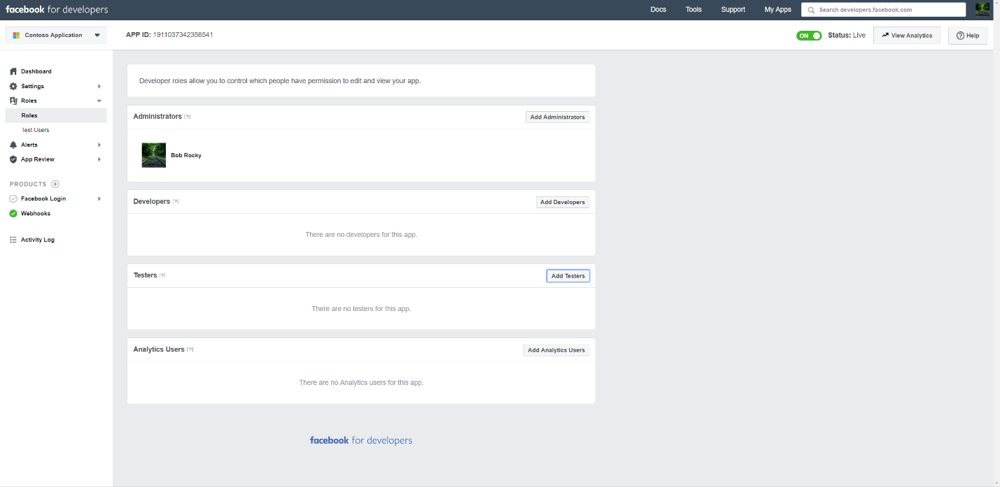

# 部署連接器以封存 Facebook 商務頁面資料Deploy a connector to archive Facebook Business pages data

本文包含的逐步程式可讓您部署使用 Office 365 Import 服務的連接器，將資料從 Facebook 商務版頁面匯入 Microsoft 365。This article contains the step-by-step process to deploy a connector that uses the Office 365 Import service to import data from Facebook Business pages to Microsoft 365. 如需此程式的高層次概述，以及部署 Facebook 連接器所需的必要條件清單，請參閱[Set up a connector to Archive facebook data](archive-facebook-data-with-sample-connector.md)。For a high-level overview of this process and a list of prerequisites required to deploy a Facebook connector, see [Set up a connector to archive Facebook data](archive-facebook-data-with-sample-connector.md). 

## 步驟1：在 Azure Active Directory 中建立應用程式Step 1: Create an app in Azure Active Directory

1. 移至<https://portal.azure.com>並使用全域系統管理員帳戶的認證登入。Go to <https://portal.azure.com> and sign in using the credentials of a global admin account.

    

2. 在左功能窗格中，按一下 [ **Azure Active Directory**]。In the left navigation pane, click **Azure Active Directory**.

    ![按一下 [Azure Active Directory]](../media/FBCimage2.png)

3. 在左功能窗格中，按一下 [**應用程式註冊（預覽）** ]，然後按一下 [**新增註冊**]。In the left navigation pane, click **App registrations (Preview)** and then click **New registration**.

    ![按一下 [\* \* 應用程式註冊（預覽）] \* \*，然後按一下 [新增註冊 \* \*]。](../media/FBCimage3.png)

4. 註冊應用程式。Register the application. 在 [重新導向 URI] 底下，選取 [應用程式類型] 下拉式<https://portal.azure.com>清單中的 [Web]，然後輸入 URI 的方塊。Under Redirect URI, select Web in the application type dropdown list and then type <https://portal.azure.com> in the box for the URI.

   

5. 複製**應用程式（用戶端）識別碼**及**目錄（租**使用者）識別碼，並將其儲存至文字檔或其他安全的位置。Copy the **Application (client) ID** and **Directory (tenant) ID** and save them to a text file or other safe location. 您可以在稍後的步驟中使用這些 IDs。You use these IDs in later steps.

   

6. 移至**憑證 & 新應用程式的機密。**Go to **Certificates & secrets for the new app.**

   

7. 按一下 [**新增用戶端密碼**]Click **New client secret**

   ![按一下 [新增用戶端密碼]](../media/FBCimage7.png)

8. 建立新的機密。Create a new secret. 在 [描述] 方塊中，輸入密碼，然後選擇到期期限。In the description box, type the secret and then choose an expiration period. 

    

9. 複製密碼的值，並將其儲存至文字檔或其他儲存位置。Copy the value of the secret and save it to a text file or other storage location. 這是您在後續步驟中使用的 AAD 應用程式密碼。This is the AAD application secret that you use in later steps.

   

## 步驟2：將連接器 web 服務從 GitHub 部署至您的 Azure 帳戶Step 2: Deploy the connector web service from GitHub to your Azure account

1. 移[至此 GitHub 網站](https://github.com/microsoft/m365-sample-connector-csharp-aspnet)，然後按一下 [**部署至 Azure**]。Go to [this GitHub site](https://github.com/microsoft/m365-sample-connector-csharp-aspnet) and click **Deploy to Azure**.

    ![按一下 [部署至 Azure]](../media/FBCGithubApp.png)

2. 按一下 [**部署至 Azure**] 後，系統會以自訂範本頁面重新導向至 azure 入口網站。After you click **Deploy to Azure**, you will be redirected to an Azure portal with a custom template page. 填入**基本概念**和**設定**詳細資料，然後按一下 [**購買**]。Fill in the **Basics** and **Settings** details and then click **Purchase**.

    - **訂閱：** 選取您要部署 Facebook 商務頁面連接器 web 服務的 Azure 訂閱。**Subscription:** Select your Azure subscription that you want to deploy the Facebook Business pages connector web service to.
    
    - **資源群組：** 選擇或建立新的資源群組。**Resource group:** Choose or create a new resource group. 資源群組是一個容器，可容納 Azure 解決方案的相關資源。A resource group is a container that holds related resources for an Azure solution.

    - **位置：** 選擇位置。**Location:** Choose a location.

    - **Web 應用程式名稱：** 提供連接器 web 應用程式的唯一名稱。**Web App Name:** Provide a unique name for the connector web app. Th 名稱的長度必須介於3到18個字元之間。Th name must be between 3 and 18 characters in length. 這個名稱是用來建立 Azure app service URL;例如，如果您提供**fbconnector**的 Web 應用程式名稱，Azure 應用程式服務 URL 會是**fbconnector.azurewebsites.net**。This name is used to create the Azure app service URL; for example, if you provide the Web app name of **fbconnector** then the Azure app service URL  will be **fbconnector.azurewebsites.net**.
    
    - **tenantId：** 您在步驟1中建立 Azure Active Directory 中的 Facebook 連接器應用程式之後所複製之 Microsoft 365 組織的租使用者識別碼。**tenantId:** The tenant ID of your Microsoft 365 organization that you copied after creating the Facebook connector app in Azure Active Directory in Step 1.
    
   - **APISecretKey：** 您可以輸入任何值做為密碼。**APISecretKey:** You can type any value as the secret. 這是用來存取步驟5中的連接器 web 應用程式。This is used to access the connector web app in Step 5.
   
     ![按一下 [建立資源並輸入儲存體帳戶]](../media/FBCimage12.png)

3. 部署成功之後，頁面看起來會類似下列螢幕擷取畫面：After the deployment is successful, the page will look similar to the following screenshot:

     ![按一下 [儲存]，然後按一下 [儲存帳戶]](../media/FBCimage13.png)

## 步驟3：註冊 Facebook 應用程式Step 3: Register the Facebook app

1. 移至<https://developers.facebook.com>，使用組織的 Facebook 商務版頁面的帳戶登入，然後按一下 [新增**應用程式**]。Go to <https://developers.facebook.com>, log in using the credentials for the account for your organization's Facebook Business pages, and then click **Add New App**.

   

2. 建立新的應用程式識別碼。Create a new app ID.

   

3. 在左功能窗格中，按一下 [**新增產品**]，然後按一下**Facebook 登**入磚中的 [**設定**]。In the left navigation pane, click **Add Products** and then click **Set Up** in the **Facebook Login** tile.

   ![按一下 [新增產品]](../media/FBCimage27.png)

4. 在 [整合 Facebook 登入] 頁面上，按一下 [ **Web**]。On the Integrate Facebook Login page, click **Web**.

   ![按一下 [整合 Facebook 登入] 頁面上的 [Web]。](../media/FBCimage28.png)

5. 新增 Azure app service URL;例如`https://fbconnector.azurewebsites.net`。Add the Azure app service URL; for example `https://fbconnector.azurewebsites.net`.

   

6. 完成 Facebook 登入設定的快速入門區段。Complete the QuickStart section of the Facebook Login setup.

   

7. 在 [ **Facebook 登**入] 底下的左導覽窗格中，按一下 [**設定**]，然後在 [**有效的 OAuth 重新 URIs 導向**] 方塊中新增 OAuth 重新導向 URI。In the left navigation pane under **Facebook Login**, click **Settings**, and add the OAuth redirect URI in the **Valid OAuth Redirect URIs** box. 使用 format \*\* \<connectorserviceuri>/views/facebookoauth\*\*，其中 connectorserviceuri 的值是您組織的 Azure 應用程式服務 URL;例如， `https://fbconnector.azurewebsites.net`。Use the format **\<connectorserviceuri>/Views/FacebookOAuth**, where the value for connectorserviceuri is the Azure app service URL for your organization; for example, `https://fbconnector.azurewebsites.net`.

   

8. 在左功能窗格中，按一下 [**新增產品**]，然後按一下 [ **Webhooks]。**In the left navigation pane, click **Add Products** and then click **Webhooks.** 在 [**頁面**] 下拉式功能表中，按一下 [**頁面**]。In the **Page** pull-down menu, click **Page**. 

   ![按一下 [新增產品]，然後按一下 [\* \* Webhooks]。](../media/FBCimage32.png)

9. 新增 Webhooks 回呼 URL，並新增驗證權杖。Add Webhooks Callback URL and add a verify token. 回呼 URL 的格式，使用格式\*\* <connectorserviceuri>/api/FbPageWebhook\*\*，其中 connectorserviceuri 的值是您的組織的 Azure 應用程式服務 URL;例如`https://fbconnector.azurewebsites.net`。The format of the callback URL, use the format **<connectorserviceuri>/api/FbPageWebhook**, where the value for connectorserviceuri is the Azure app service URL for your organization; for example `https://fbconnector.azurewebsites.net`. 

    驗證權杖應類似強式密碼。The verify token should similar to a strong password. 將驗證權杖複製到文字檔或其他儲存位置。Copy the verify token to a text file or other storage location.

        

10. 測試並訂閱資料摘要的端點。Test and subscribe to the endpoint for feed.

    

11. 新增隱私權 URL、應用程式圖示和商務用。Add a privacy URL, app icon, and business use. 此外，將應用程式識別碼和應用程式密碼複製到文字檔或其他儲存位置。Also, copy the app ID and app secret to a text file or other storage location.

    

12. 讓應用程式成為公開的。Make the app public.

    

13. 將使用者新增至系統管理員或測試人員角色。Add user to the admin or tester role.

    

14. 新增**頁面公開內容訪問**許可權。Add the **Page Public Content Access** permission.

    

15. [新增管理頁面] 許可權。Add Manage Pages permission.

    

16. 取得由 Facebook 檢查的應用程式。Get the application reviewed by Facebook.

    

## 步驟4：設定連接器 web 應用程式Step 4: Configure the connector web app

1. 移至 HTTPs://\<AzureAppResourceName>。 azurewebsites.net （其中 AzureAppResourceName 是您在步驟4中命名的 Azure 應用程式資源名稱）例如，如果名稱是**fbconnector**，請移至`https://fbconnector.azurewebsites.net`。Go to https://\<AzureAppResourceName>.azurewebsites.net (where AzureAppResourceName is the name of your Azure app resource that you named in Step 4) For example, if the name is **fbconnector**, go to `https://fbconnector.azurewebsites.net`. 應用程式的首頁看起來就像下列螢幕擷取畫面：The home page of the app will look like the following screenshot:

   

2. 按一下 [**設定**] 以顯示登入頁面。Click **Configure** to display a sign in page.
 
   ![按一下 [設定] 以顯示登入頁面](../media/FBCimage42.png)

3. 在 [租使用者識別碼] 方塊中，輸入或貼上您在步驟2中取得的租使用者識別碼。In the Tenant Id box, type or paste your tenant Id (that you obtained in Step 2). 在 [密碼] 方塊中，輸入或貼上 APISecretKey （您在步驟2中取得的），然後按一下 [**設定配置設定**] 以顯示 [設定詳細資料] 頁面。In the password box, type or paste the APISecretKey (that you obtained in Step 2), and then click **Set Configuration Settings** to display the configuration details page.

    ![使用您的租使用者識別碼和密碼登入，然後移至 [設定詳細資料] 頁面。](../media/FBCimage43.png)

4. 輸入下列設定設定Enter the following configuration settings 

   - **Facebook 應用程式 ID:** 您在步驟3中取得之 Facebook 應用程式的應用程式識別碼。**Facebook application ID:** The app ID for the Facebook application that you obtained in Step 3.
   
   - **Facebook 應用程式密碼：** 您在步驟3中取得之 Facebook 應用程式的應用程式密碼。**Facebook application secret:** The app secret for the Facebook application that you obtained in Step 3.
   
   - **Facebook webhooks verify token：** 您在步驟3中建立的驗證權杖。**Facebook webhooks verify token:** The verify token that you created in Step 3.
   
   - **AAD 應用程式 ID:** 您在步驟1中建立之 Azure Active Directory 應用程式的應用程式識別碼。**AAD application ID:** The application ID for the Azure Active Directory app that you created in Step 1.
   
   - **AAD 應用程式密碼：** 您在步驟1中建立的 APISecretKey 密碼值。**AAD application secret:** The value for the APISecretKey secret that you created in Step 1.

5. 按一下 [**儲存**] 以儲存連接器設定。Click **Save** to save the connector settings.

## 步驟5：在 Microsoft 365 規範中心設定 Facebook 連接器Step 5: Set up a Facebook connector in the Microsoft 365 compliance center

1. 移至[https://compliance.microsoft.com](https://compliance.microsoft.com) ，然後按一下左側導覽中的 [**資料連線器**]。Go to [https://compliance.microsoft.com](https://compliance.microsoft.com) and then click **Data connectors** in the left nav.

2. 在 [ **Facebook 商務頁面**] 底下的 [**資料連線線（預覽）** ] 頁面上，按一下 [ **View**]。On the **Data connectors (preview)** page under **Facebook Business pages**, click **View**.

3. 在 [ **Facebook 商務用頁面**] 頁面上，按一下 [**新增連接器**]。On the **Facebook business pages** page, click **Add connector**.

4. 在 [**服務條款**] 頁面上，按一下 [**接受**]。On the **Terms of service** page, click **Accept**.

5.  在 [**新增連接器應用程式的認證**] 頁面上，輸入下列資訊，然後按一下 [**驗證連接**]。On the **Add credentials for your connector app** page, enter the following information and then click **Validate connection**.

    

    - 在 [**名稱**] 方塊中，輸入連接器的名稱，例如 [ **Facebook news] 頁面**。In the **Name** box, type a name for the connector, such as **Facebook news page**.
    
    - 在 [**連接 URL** ] 方塊中，輸入或貼上 Azure app service URL;例如`https://fbconnector.azurewebsites.net`。In the **Connection URL** box, type or paste the Azure app service URL; for example `https://fbconnector.azurewebsites.net`.
    
    - 在 [**密碼**] 方塊中，輸入或貼上您在步驟2中所加入之 APISecretKey 的值。In the **Password** box, type or paste the value of the APISecretKey that you added in Step 2.
    
    - 在 [ **Azure 應用程式識別碼**] 方塊中，輸入或貼上應用程式（用戶端）識別碼的值，也稱為您在步驟1中建立的 AAD 應用程式識別碼。In the **Azure App ID** box, type or paste the value of the Application (client) ID also called as AAD Application ID that you created in Step 1.
 
6. 成功驗證成功後，請按 **[下一步]**。After the connection is successfully validated, click **Next**.

7. 在 [**授權 Microsoft 365 匯入資料**] 頁面上，再次輸入或貼上 APISecretKey，然後按一下 **[登入 web app**]。On the **Authorize Microsoft 365 to import data** page, type or paste the APISecretKey again and then click **Login web app**.

8. 在 [**設定 Facebook 連接器應用程式**] 頁面上，按一下 **[使用 facebook 登**入]，並使用組織的 Facebook 商務版頁面帳戶的認證登入。On the **Configure Facebook connector app** page, click **Login with Facebook** and log in using the credentials for the account for your organization's Facebook Business pages. 確定您登入的 Facebook 帳戶已獲指派組織的 Facebook 商務頁面的系統管理員角色。Make sure the Facebook account that you logged in to is assigned the admin role for your organization's Facebook Business pages.

   

9. 隨即會顯示由您登入之 Facebook 帳戶所管理的商務頁面清單。A list of the business pages managed by the Facebook account that you logged in to is displayed. 選取要封存的頁面，然後按 **[下一步]**。Select the page to archive and then click **Next**.

    

10. 按一下 [**繼續**] 結束連接器服務應用程式的設定。Click **Continue** to exit the setup of the connector service app.

11. 在 [**設定篩選**] 頁面上，您可以將篩選器最初匯入特定時期的專案。On the **Set filters** page, you can apply a filter to initially import items that are a certain age. 選取 [年齡]，然後按 **[下一步]**。Select an age, and then click **Next**.

12. 在 [**選擇儲存位置**] 頁面上，輸入 Facebook 專案將匯入的 Microsoft 365 信箱的電子郵件地址，然後按 **[下一步]**。On the **Choose storage location** page, type the email address of Microsoft 365 mailbox that the Facebook items will be imported to, and then click **Next**.

13. 在 [**提供管理員同意**] 中，按一下 [**提供同意**]，然後依照步驟進行。On the **Provide admin consent**, click **Provide consent** and then follow the steps. 您必須是全域系統管理員，才可對您組織中的資料提供 Office 365 匯入服務的同意。You must be a global admin to provide consent for the Office 365 Import service to access data in your organization.

14. 按 **[下一步]** 以查看連接器設定，然後按一下 **[完成]** 以完成連接器設定。Click **Next** to review the connector settings and then click **Finish** to complete the connector setup.

15. 在 [規範中心] 中，移至 [**資料連線器**] 頁面，然後按一下 [**連接器**] 索引標籤，以查看匯入程式的進度。In the compliance center, go to the **Data connectors** page, and click the **Connectors** tab to see the progress of the import process.
