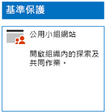
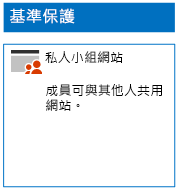
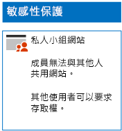
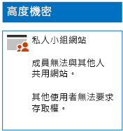

# 部署三種保護層級的 SharePoint Online 網站

您可以使用本文中的步驟，來設計及部署基準、機密和高度機密 SharePoint Online 小組網站。 如需這三種保護層級的詳細資訊，請參閱[保護 SharePoint Online 網站與檔案](../security/office-365-security/secure-sharepoint-online-sites-and-files.md)。
  
## 基準 SharePoint Online 小組網站

基準保護包含公用和私人小組網站。 公用小組網站可供組織中的任何人探索及存取。 私人網站只能供與小組網站關聯的 Office 365 群組成員探索及存取。 這兩種小組網站類型都可讓成員與其他人共用網站。
  
### 公用

若要建立具有公用存取和權限的基準 SharePoint Online 小組網站，遵循[這些指示](https://support.office.com/article/create-a-team-site-in-sharepoint-ef10c1e7-15f3-42a3-98aa-b5972711777d)。

以下是產生的組態。
  

  
### 私人

若要建立具有私人存取和權限的基準 SharePoint Online 小組網站，遵循[這些指示](https://support.office.com/article/create-a-team-site-in-sharepoint-ef10c1e7-15f3-42a3-98aa-b5972711777d)。
  
以下是產生的組態。
  

  
## 機密 SharePoint Online 小組網站

敏感性的 SharePoint Online 小組網站始於私人小組網站。
  
首先，使用[這些指示](https://support.office.com/article/create-a-team-site-in-sharepoint-ef10c1e7-15f3-42a3-98aa-b5972711777d)建立私人 SharePoint Online 小組網站。

接下來，從新的 SharePoint Online 小組網站，使用下列步驟設定額外使用權限設定。

1.  在 SharePoint 小組網站的工具列中，按一下設定圖示，然後按一下 [網站權限]****。
2.  在 [網站權限]**** 窗格的 [共用設定]**** 之下，按一下 [變更共用設定]****。
3.  在 [共用權限]**** 之下，選擇 [只有網站擁有者可以共用檔案、資料夾及網站]****，然後按一下 [儲存]****。

這些使用權限設定的結果是：

- 成員分享給其他成員的功能已停用。
- 非成員要求存取的功能已啟用。

以下是您產生的組態。
  

  
網站成員現在可以透過其中一個存取群組的群組成員資格，安全地在網站的資源上共同作業。
  
## 高度機密 SharePoint Online 小組網站

高度機密的 SharePoint Online 小組網站是含有額外使用權設定的私人小組網站。

首先，使用[這些指示](https://support.office.com/article/create-a-team-site-in-sharepoint-ef10c1e7-15f3-42a3-98aa-b5972711777d)建立私人 SharePoint Online 小組網站。

接下來，從新的 SharePoint Online 小組網站，使用下列步驟設定額外使用權限設定。

1.  在 SharePoint 小組網站的工具列中，按一下設定圖示，然後按一下 [網站權限]****。
2.  在 [網站權限]**** 窗格的 [共用設定]**** 之下，按一下 [變更共用設定]****。
3.  在 [共用權限]**** 之下，選擇 [只有網站擁有者可以共用檔案、資料夾及網站]****。
4. 關閉 [允許存取要求]****，然後按一下 [儲存]****。

這些使用權限設定的結果是：

- 成員分享給其他成員的功能已停用。
- 非成員要求存取的功能已停用。

以下是您產生的組態。
  

  
網站成員現在可以透過其中一個存取群組的群組成員資格，安全地在網站的資源上共同作業。
  
## 下一步

[使用 Office 365 標籤與 DLP 來保護 SharePoint Online 檔案](protect-sharepoint-online-files-with-office-365-labels-and-dlp.md)

## 另請參閱

[適用於政治活動、非營利組織和其他彈性組織的 Microsoft 安全性指南](../security/office-365-security/microsoft-security-guidance-for-political-campaigns-nonprofits-and-other-agile-o.md)
  
[雲端採用和混合式解決方案](https://docs.microsoft.com/office365/enterprise/cloud-adoption-and-hybrid-solutions)
