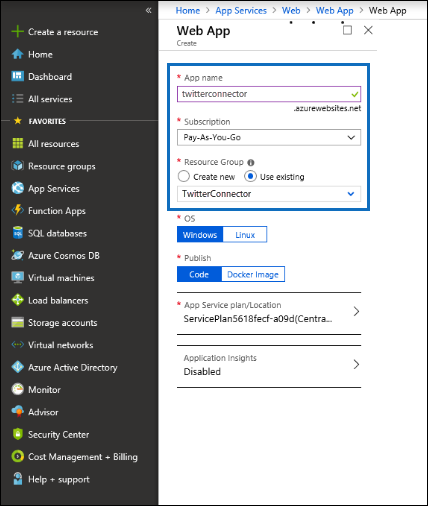
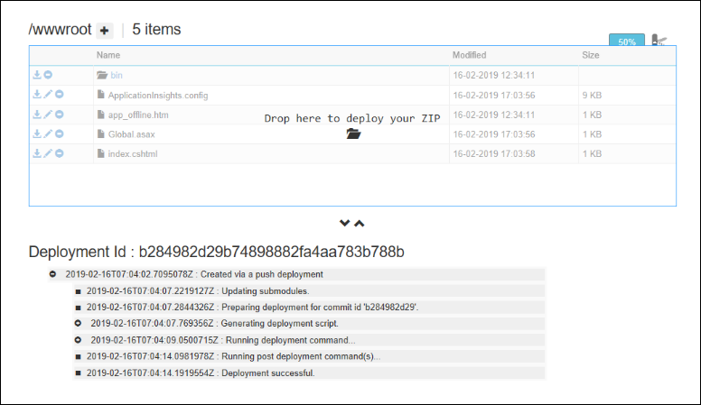
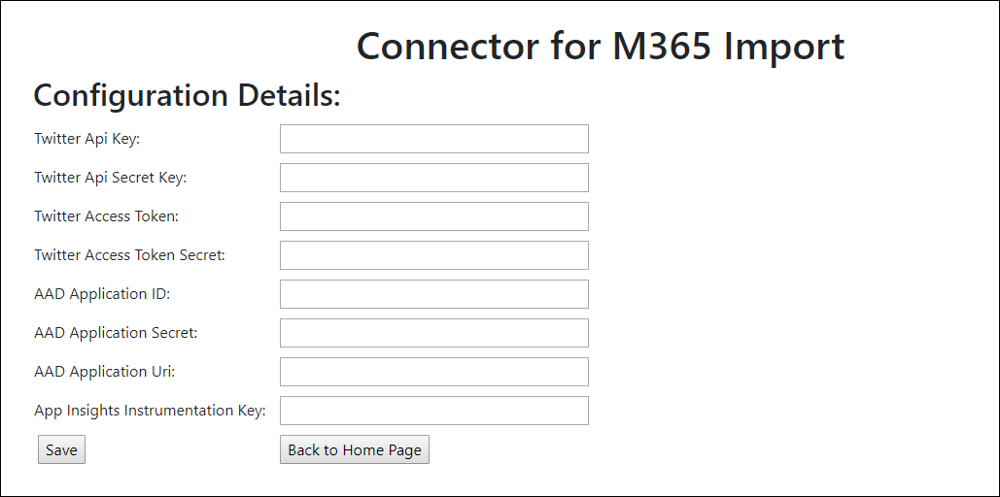
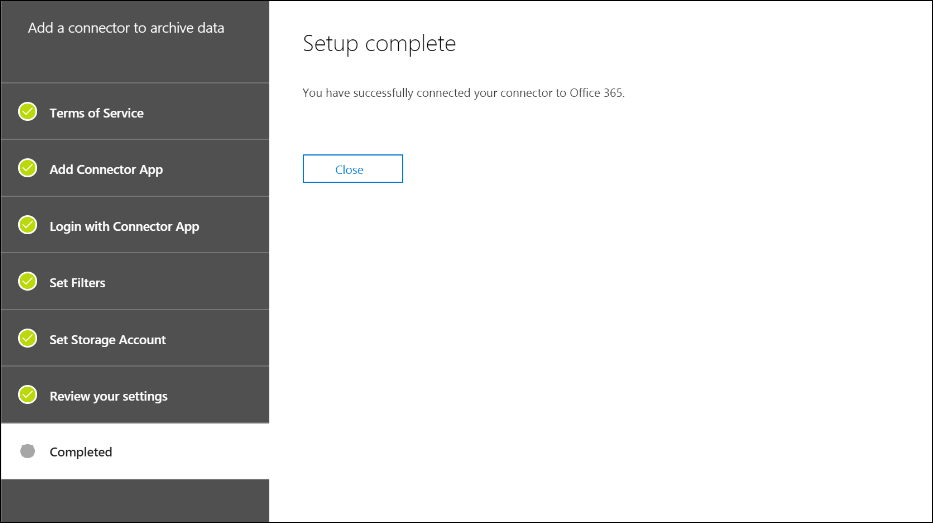

# 部署封存 Twitter 資料的連接器Deploy a connector to archive Twitter data

本文包含的逐步程序來部署您的組織 Twitter 帳戶的資料匯入至 Office 365 會使用 Office 365 匯入服務的連接器。This article contains the step-by-step process to deploy a connector that uses the Office 365 Import service to import data from your organization's Twitter account to Office 365. 此程序的高階概觀與部署 Twitter 連接器所需的必要條件清單，請參閱[使用封存 Twitter 資料 Office 365 （預覽） 中的範例連接器](archive-twitter-data-with-sample-connector.md)。For a high-level overview of this process and a list of prerequisites required to deploy a Twitter connector, see [Use a sample connector to archive Twitter data in Office 365 (Preview)](archive-twitter-data-with-sample-connector.md). 

## 步驟 1： 下載套件Step 1: Download the package

從 [版本] 區段中，GitHub 儲存機制中下載預先建立的套件[https://github.com/microsoft/m365-sample-twitter-connector-csharp-aspnet/releases](https://github.com/microsoft/m365-sample-twitter-connector-csharp-aspnet/releases)。Download the prebuilt package from the Release section in the GitHub repository at [https://github.com/microsoft/m365-sample-twitter-connector-csharp-aspnet/releases](https://github.com/microsoft/m365-sample-twitter-connector-csharp-aspnet/releases). 在 [最新版本中，下載 zip 檔名為**SampleConnector.zip**。Under the latest release, download the zip file named **SampleConnector.zip**. 您將此 zip 檔案上傳到步驟 4 中的 Azure。You upload this zip file to Azure in Step 4.

## 步驟 2： 在 Azure Active Directory 中建立的應用程式Step 2: Create an app in Azure Active Directory

1. 移至 [<https://portal.azure.com>並使用 Office 365 全域系統管理員帳戶的認證登入。Go to <https://portal.azure.com> and sign in using the credentials of an Office 365 global admin account.

   

2. 在左側的導覽窗格中，按一下 [ **Azure Active Directory**]。In the left navigation pane, click **Azure Active Directory**.

   

3. 在左側的導覽窗格中，按一下 [**應用程式註冊 （預覽）** ，然後按一下 [**新增註冊**。In the left navigation pane, click **App registrations (Preview)** and then click **New registration**.

   

4. 註冊應用程式。Register the application. **（選用） 的 [重新導向 URI**，選取**Web**應用程式類型] 下拉式清單中，然後輸入`https://portal.azure.com`URI] 方塊中。Under **Redirect URI (optional)**, select **Web** in the application type dropdown list and then type `https://portal.azure.com` in the box for the URI.

   

5. 複製 **（用戶端） 的應用程式識別碼**] 及 [**目錄 （承租人） 識別碼**，並將它們儲存到文字檔或其他安全的位置。Copy the **Application (client) ID** and **Directory (tenant) ID** and save them to a text file or other safe location. 您在稍後步驟使用這些識別碼。You use these IDs in later steps.

    ![複製並儲存應用程式識別碼] 及 [目錄識別碼](media/TCimage05.png)

6. 移至**新的應用程式的憑證 & 機密資料**，並在 [**用戶端密碼**] 下按一下 [**新的用戶端密碼**。Go to **Certificates & secrets for the new app** and under **Client secrets** click **New client secret**.

   

7. 建立新的密碼。Create a new secret. 在 [描述] 方塊中，輸入密碼，然後選擇的到期時間。In the description box, type the secret and then choose an expiration period. 

   

8. 複製密碼的值，並將它儲存到文字檔或其他儲存位置。Copy the value of the secret and save it to a text file or other storage location. 這是您在稍後步驟使用的 AAD 應用程式密碼。This is the AAD application secret that you use in later steps.

   

9. 移至**資訊清單**，然後複製 identifierUris （這也稱為 AAD 應用程式的 Uri） 以反白顯示下列螢幕擷取畫面。Go to **Manifest** and copy the identifierUris (which is also called the AAD application Uri) as highlighted in the following screenshot. 複製到文字檔或其他儲存位置的 AAD 應用程式的 Uri。Copy the AAD application Uri to a text file or other storage location. 您在步驟 6 中使用。You use it in Step 6.

    

## 步驟 3： 建立 Azure 儲存體帳戶Step 3: Create an Azure storage account

1.  移至 Azure 的首頁上，為您的組織。Go to the Azure home page for your organization.

    

2. 按一下 [**建立資源**及它們在 [搜尋] 方塊中輸入**儲存體帳戶**。Click **Create a resource** and they type **storage account** in the search box.

   

3. 按一下 [**儲存**]，然後按一下 [**儲存體帳戶**。Click **Storage**, and then click **Storage account**.

   

4. 在 [**建立儲存體帳戶**] 頁面上，在 [訂閱] 方塊中，選取**Pay-As-You-Go**或取決於哪些類型的 Azure 訂用帳戶必須**免費試用版**。On the **Create storage account** page, in the Subscription box, select **Pay-As-You-Go** or **Free Trial** depending on which type of Azure subscription you have. 

   

5. 選取或建立資源群組。Select or create a resource group.

   

6. 輸入儲存體帳戶的名稱。Type a name for the storage account.

   

7. 檢閱，然後按一下 [**建立**]，以建立儲存體帳戶。Review and then click **Create** to create the storage account.

   

8. 在一段時間後按一下 [**重新整理**，然後按一下 [瀏覽至儲存體帳戶的 [**移至資源**。After a few moments, click **Refresh** and then click **Go to resource** to navigate to the storage account.

   

9. 在左側的導覽窗格中，按一下 [**便捷鍵**。Click **Access keys** in the left navigation pane.

   

10. 複製**連接字串**，並將它儲存到文字檔或其他儲存位置。Copy a **Connection string** and save it to a text file or other storage location. 您使用此步驟 4 中建立 web 應用程式資源時。You use this when creating a web app resource in Step 4.

    

## 步驟 4： 在 Azure 中建立新的 web 應用程式資源Step 4: Create a new web app resource in Azure

1. 在 [**首頁**] 頁面在 Azure 入口網站中，按一下 [**建立資源\>每個項目\>Web 應用程式**。On the **Home** page in the Azure portal, click **Create a resource \> Everything \> Web app**. 在 [ **Web 應用程式**] 頁面上，按一下 [**建立**]。On the **Web app** page, click **Create**.

   

2. 填入詳細資料 （如下所示），然後再建立 Web 應用程式。Fill in the details (as shown below) and then create the Web app. 您在 [**應用程式名稱**] 方塊中輸入的名稱用來建立 Azure 應用程式服務的 URL;例如，twitterconnector.azurewebsites.net。The name that you enter in the **App name** box is used to create the Azure app service URL; for example, twitterconnector.azurewebsites.net.

   

3. 移至新建立的 web 應用程式資源並按一下 [**應用程式設定**]，請在左側的導覽窗格中。Go to the newly created web app resource and click **Application Settings** in the left navigation pane. **應用程式設定**] 下按一下 [**新增新的設定**，並新增下列三項設定。Under **Application settings**, click **Add new setting** and add the following three settings. 使用複製的值 （您到文字檔先前的步驟）：Use the values (that you copied to the text file from the previous steps): 

    - **APISecretKey** – 您可以為密碼輸入任何值。**APISecretKey** – You can type any value as the secret. 這用來存取在步驟 7 中的連接器 web 應用程式。This is used to access the connector web app in Step 7.

    - **StorageAccountConnectionString** – 您在步驟 3 中建立 Azure 儲存體帳戶之後所複製的 Uri 的連接字串。**StorageAccountConnectionString** – The connection string Uri that you copied after creating the Azure storage account in Step 3.

    - **tenantId** – 您在步驟 2 中的 Azure Active Directory 中建立 Twitter 連接器應用程式之後複製您 Office 365 組織租用戶識別碼。**tenantId** – The tenant ID of your Office 365 organization that you copied after creating the Twitter connector app in Azure Active Directory in Step 2.

    

4. **一般設定**] 下按一下 [**上**旁**Always On**。Under **General settings**, click **On** next to the **Always On**. 按一下 [**儲存**] 頁面的頂端儲存應用程式的設定。Click **Save** at the top of the page to save the application settings.

   

5. 最後一個步驟是將連接器 app 原始程式碼上傳至 Azure 中您在步驟 1 中下載。The final step is to upload the connector app source code to Azure that you downloaded in Step 1. 在網頁瀏覽器中，移至 https://<AzureAppResourceName>.scm.azurewebsites.net/ZipDeployUi。In a web browser, go to https://<AzureAppResourceName>.scm.azurewebsites.net/ZipDeployUi. 例如，如果您的 Azure 應用程式資源 （這在本節中的步驟 2 中所命名） 的名稱是**twitterconnector**，然後您會移至https://twitterconnector.scm.azurewebsites.net/ZipDeployUi。For example, if the name of your Azure app resource (which you named in step 2 in this section) is **twitterconnector**, then you would go to https://twitterconnector.scm.azurewebsites.net/ZipDeployUi.

6. 拖放到此頁面 SampleConnector.zip （，您在步驟 1 中下載）。Drag and drop the SampleConnector.zip (that you downloaded in Step 1) to this page. 將檔案上傳並部署成功後，看起來類似下列的螢幕擷取畫面] 頁面上：After the files are uploaded and the deployment is successful, the page will look similar to the following screenshot:

   

## 步驟 5： 建立 Twitter 應用程式Step 5: Create the Twitter app

1. 移至 [ https://developer.twitter.com，登入您的組織，開發人員帳戶使用的認證，然後按一下 [**應用程式**。Go to https://developer.twitter.com, log in using the credentials for the developer account for your organization, and then click **Apps**.

   
2. 按一下 [**建立應用程式**]。Click **Create an app**.
   
   ![移至應用程式] 頁面上，若要建立的應用程式](media/TCimage26.png)

3. 在 [**應用程式詳細資料**，新增應用程式的相關資訊。Under **App details**, add information about the application.

   

4. Twitter 開發人員儀表板上選取您剛建立的應用程式複製應用程式 ID 會顯示，並將它儲存到文字檔或其他儲存位置。On the Twitter developer dashboard, select the app that you just created and copy the App ID that's displayed  and save it to a text file or other storage location. 然後按一下 [**詳細資料**。Then click **Details**.
   
   

5. **索引鍵和權杖**索引標籤上，在**消費者 API 機碼**下複製 API 祕密金鑰並將它儲存到文字檔或其他儲存位置。On the **Keys and tokens** tab, under **Consumer API keys** copy the API secret key and save it to a text file or other storage location. 然後按一下 [**建立**]，以產生的存取權杖及存取權杖的密碼，並複製這些文字檔案或其他儲存位置。Then click **Create** to generate an access token and an access token secret, and copy these to a text file or other storage location.
   
   

   然後按一下 [**建立**]，以產生的存取權杖及存取權杖的密碼，並複製這些文字檔案或其他儲存位置。Then click **Create** to generate an access token and an access token secret, and copy these to a text file or other storage location.

6. 按一下 [**權限**] 索引標籤，並設定權限，如下列螢幕擷取畫面所示：Click the **Permissions** tab and configure the permissions as shown in the following screenshot:

   

7. 儲存的權限設定之後，按一下 [**應用程式詳細資料**] 索引標籤，然後按一下 [**編輯 > 編輯詳細資料]**。After you save the permission settings, click the **App details** tab, and then click **Edit > Edit details**.

   

8. 執行下列工作：Do the following tasks:

   - 選取核取方塊可允許登入 Twitter 連接器應用程式。Select the checkbox to allow the connector app to sign in to Twitter.
   
   - 新增的 OAuth 重新導向 Uri 使用下列格式： \*\* \<connectorserviceuri>/檢視/TwitterOAuth\**、 其中*connectorserviceuri\*的值是為您的組織; Azure 應用程式服務 URL例如， https://twitterconnector.azurewebsites.net/Views/TwitterOAuth。Add the OAuth redirect Uri using the following format: **\<connectorserviceuri>/Views/TwitterOAuth**, where the value of *connectorserviceuri* is the Azure app service URL for your organization; for example, https://twitterconnector.azurewebsites.net/Views/TwitterOAuth.

    

在 Twitter 開發人員 app 現已可使用。The Twitter developer app is now ready to use.

## 步驟 6： 設定連接器的 web 應用程式Step 6: Configure the connector web app 

1. 移至 https://\<AzureAppResourceName>.azurewebsites.net （其中**AzureAppResourceName**是您在步驟 4 中名為您 Azure 應用程式資源的名稱）。Go to https://\<AzureAppResourceName>.azurewebsites.net (where **AzureAppResourceName** is the name of your Azure app resource that you named in Step 4). 例如，如果名稱為**twitterconnector**，請移至https://twitterconnector.azurewebsites.net。For example, if the name is **twitterconnector**, go to https://twitterconnector.azurewebsites.net. 應用程式的 [首頁] 頁面上看起來像下列螢幕擷取畫面中：The home page of the app looks like the following screenshot:

   

2. 按一下 [**設定**] 頁面中，會顯示號。Click **Configure** to display a sign in page.

   ![按一下 [設定] 頁面中，會顯示號](media/FBCimage42.png)

3. 在租用戶識別碼] 方塊中，輸入或貼上您的租用戶識別碼 （您在步驟 2 中所取得）。In the Tenant Id box, type or paste your tenant Id (that you obtained in Step 2). 在 [密碼] 方塊中，輸入或貼上 APISecretKey （，您在步驟 2 中所取得），，然後按一下要顯示 [**設定詳細資料**] 頁面上**設定的組態設定**。In the password box, type or paste the APISecretKey (that you obtained in Step 2), and then click **Set Configuration Settings** to display the **Configuration Details** page.

   

4. [**設定的詳細資訊**，請輸入下列組態設定Under **Configuration Details**, enter the following configuration settings 

   - **Twitter Api 金鑰**– 您在步驟 5 中建立的 Twitter 應用程式的應用程式識別碼。**Twitter Api Key** – The app ID for the Twitter application that you created in Step 5.
   - **Twitter Api 密碼金鑰**– 您在步驟 5 中建立的 Twitter 應用程式的 API 祕密金鑰。**Twitter Api Secret Key** – The API secret key for the Twitter application that you created in Step 5.
   - **Twitter 存取 Token** – 您在步驟 5 中建立的存取權杖。**Twitter Access Token** – The access token that you created in Step 5.
   - **Twitter 存取 Token 密碼**– 您在步驟 5 中建立的存取權杖密碼。**Twitter Access Token Secret** – The access token secret that you created in Step 5.
   - **AAD 應用程式識別碼**– 您在步驟 2 中建立的 Azure Active Directory 應用程式的應用程式識別碼**AAD Application ID** – The application ID for the Azure Active Directory app that you created in Step 2
   - **AAD 應用程式密碼**– 您在步驟 4 中建立的 APISecretKey 密碼的值。**AAD Application Secret** – The value for the APISecretKey secret that you created in Step 4.
   - **AAD 應用程式的 Uri** – AAD 應用程式在步驟 2; 中所取得的 Uri例如， `https://microsoft.onmicrosoft.com/2688yu6n-12q3-23we-e3ee-121111123213`。**AAD Application Uri** – The AAD application Uri obtained in Step 2; for example, `https://microsoft.onmicrosoft.com/2688yu6n-12q3-23we-e3ee-121111123213`.
   - **App 觀點檢測機碼**– 保留此方塊空白。**App Insights Instrumentation Key** – Leave this box blank.

5. 按一下 [**儲存**] 以儲存連接器設定。Click **Save** to save the connector settings.

## 步驟 7： 設立安全性與合規性中心中的自訂連接器Step 7: Set up a custom connector in the security and compliance center

1.  移至 [ <https://protection.office.com> ，然後按一下 [**資訊控管\>匯入\>封存協力廠商資料**。Go to <https://protection.office.com> and then click **Information governance \> Import \> Archive third-party data**.

    

2. 按一下 [**新增連接器**]，然後按一下 [ **Twitter**。Click **Add a connector** and then click **Twitter**.

   ![按一下 [新增連接器]，以新增 Twitter 連接器](media/TCimage37.png)

3. 在 [**新增連接器應用程式**] 頁面中，輸入下列資訊，然後按一下 [**驗證連接器**。On the **Add Connector App** page, enter the following information and then click **Validate connector**.

    - 在第一個方塊中，輸入連接器名稱，例如**Twitter**。In the first box, type a name for the connector, such as **Twitter**.
    - 在第二個方塊中，輸入或貼上您在步驟 4 中新增 APISecretKey 的值。In the second box, type or paste the value of the APISecretKey that you added in Step 4.
    - 在第三個方塊中，輸入或貼上的 Azure 應用程式服務 URL;例如， **https://twitterconnector.azurewebsites.net**。In the third box, type or paste the Azure app service URL; for example, **https://twitterconnector.azurewebsites.net**.

   成功驗證連接器之後，按一下 [**下一步**]。After the connector is successfully validated, click **Next**.

   

4. 按一下 [**登入與連接器應用程式**。Click **Login with Connector App**.

   

5. 輸入或貼上 APISecretKey 一次，然後按一下 [**連接器服務的登入**。Type or paste the APISecretKey again and then click  **Login to Connector Service**.

   

6. 按一下 [**繼續 Twitter**。Click **Continue with Twitter**.

7. 在 Twitter 登入] 頁面上，登入您的組織 Twitter 帳戶的帳戶使用的認證。On the Twitter sign in page, sign in using the credentials for the account for your organization’s Twitter account.

   

   登入後，[Twitter] 頁面上會顯示下列訊息、 「 Twitter 連接器工作成功設定。 」After you sign in, the Twitter page will display the following message, "Twitter Connector Job Successfully set up."

8. 按一下 [**完成**] 以完成 Twitter 連接器設定。Click **Finish** to complete setting up the Twitter connector.

9. 在 [**設定篩選器**] 頁面中，您可以套用篩選器來匯入 （和封存） 特定天數的項目。On the **Set Filters** page, you can apply a filter to import (and archive) items that are a certain age. 按 [下一步]\*\*\*\*。Click **Next**.

   

10. 在 [**設定儲存體帳戶**] 頁面上，輸入 Twitter 項目將會匯入至 Office 365 信箱的電子郵件地址。On the **Set Storage Account** page, type the email address of an Office 365 mailbox that the Twitter items will be imported to.

    

11. 檢閱您的設定，然後按一下 [**完成**] 以完成安全性 & 規範中心的連接器設定。Review your settings and then click **Finish** to complete the connector setup in the Security & Compliance Center.

    ![檢閱設定，然後再按一下 [完成]](media/TCimage46.png)

    

12. 移至**封存協力廠商資料**頁面才能看見匯入程序的進度。Go to the **Archive third-party data** page to see the progress of the import process.

    
