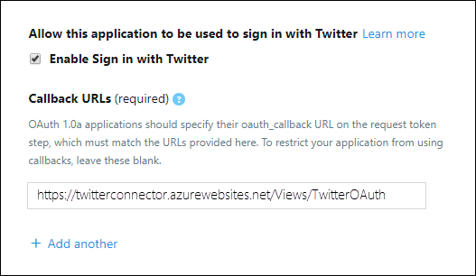

# 部署連接器以封存 Twitter 資料

本文包含逐步程式，用以部署使用 Office 365 匯入服務的連接器，將資料從組織的 Twitter 帳戶匯入 Microsoft 365。 如需此程式的高層次概述，以及部署 Twitter 連接器所需的必要條件清單，請參閱 [Set up a connector to Archive Twitter data ](archive-twitter-data-with-sample-connector.md)。 

## 步驟1：在 Azure Active Directory 中建立應用程式

1. 移至 <https://portal.azure.com> 並使用全域系統管理員帳戶的認證登入。

   

2. 在左側瀏覽窗格中，按一下 **Azure Active Directory**。

   

3. 在左功能窗格中，按一下 [ **應用程式註冊] (預覽)** 然後按一下 [ **新增註冊**]。

   

4. 註冊應用程式。 在 [重新 **導向 URI (選用)**] 底下，選取 [應用程式類型] 下拉式清單中的 [ **網站** ]，然後在 [URI] 方塊 `https://portal.azure.com` 中輸入 uri。

   

5. 複製 **Application (client) id** 及 **目錄 (承租人) 識別碼** ，並將其儲存至文字檔或其他安全的位置。 您可以在稍後的步驟中使用這些 IDs。

    

6. 移至 **憑證 & 新應用程式的機密** 及 **用戶端機密** 底下，按一下 [ **新增用戶端密碼**]。

   

7. 建立新的機密。 在 [描述] 方塊中，輸入密碼，然後選擇到期期限。 

   ![輸入密碼，然後選擇 [到期期限]](../media/TCimage08.png)

8. 複製密碼的值，並將其儲存至文字檔或其他儲存位置。 這是您在後續步驟中使用的 AAD 應用程式密碼。

   

## 步驟2：將連接器 web 服務從 GitHub 部署至您的 Azure 帳戶

1. 移 [至此 GitHub 網站](https://github.com/microsoft/m365-sample-twitter-connector-csharp-aspnet)，然後按一下 [**部署至 Azure**]。

    

2. 按一下 [ **部署至 Azure**] 後，系統會以自訂範本頁面重新導向至 azure 入口網站。 填入 **基礎** 和 **設定** 詳細資料，然後按一下 [**購買**]。

   ![按一下 [建立資源並輸入儲存體帳戶]](../media/FBCimage12.png)

    - **訂閱：** 選取您要部署 Twitter 連接器 web 服務的 Azure 訂閱。
    
    - **資源群組：** 選擇或建立新的資源群組。 資源群組是一個容器，可容納 Azure 解決方案的相關資源。

    - **位置：** 選擇位置。

    - **Web 應用程式名稱：** 提供連接器 web 應用程式的唯一名稱。 Th 名稱的長度必須介於3到18個字元之間。 這個名稱是用來建立 Azure app service URL;例如，如果您提供 **twitterconnector** 的 Web 應用程式名稱，Azure 應用程式服務 URL 會是 **twitterconnector.azurewebsites.net**。
    
    - **tenantId：** 在步驟1中，您在 Azure Active Directory 中建立 Facebook 連接器應用程式之後所複製之 Microsoft 365 組織的租使用者識別碼。
    
   - **APISecretKey：** 您可以輸入任何值做為密碼。 這是用來存取步驟5中的連接器 web 應用程式。

3. 部署成功之後，頁面看起來會類似下列螢幕擷取畫面：

    ![按一下 [儲存體然後按一下 [儲存體帳戶]](../media/FBCimage13.png)

## 步驟3：建立 Twitter 應用程式

1. 移至 https://developer.twitter.com ，使用組織的開發人員帳戶登入，然後按一下 [ **應用程式**]。

   
2. 按一下 [ **建立應用程式**]。
   
   ![移至 [應用程式] 頁面，以建立應用程式](../media/TCimage26.png)

3. 在 [ **應用程式詳細資料**] 下，新增應用程式的相關資訊。

   

4. 在 [Twitter 開發人員儀表板] 上，選取您剛建立的應用程式，然後按一下 [ **詳細資料**]。
   
   

5. 在 [ **金鑰與標記** ] 索引標籤的 [ **使用者 api 金鑰** ] 下，複製 api 金鑰和 api 金鑰，並將其儲存至文字檔或其他儲存位置。 然後按一下 [ **建立** ] 以產生存取權杖和存取權杖密碼，並將其複製到文字檔或其他儲存位置。
   
   

   然後按一下 [ **建立** ] 以產生存取權杖和存取權杖密碼，並將這些機密複製到文字檔或其他存放位置。

6. 按一下 [ **許可權** ] 索引標籤，並設定許可權，如下列螢幕擷取畫面所示：

   

7. 儲存許可權設定後，按一下 [ **應用程式詳細資料** ] 索引標籤，然後按一下 [ **編輯 > 編輯詳細資料**]。

   

8. 請執行下列工作：

   - 選取核取方塊可允許連接器應用程式登入 Twitter。
   
   - 使用下列格式新增 OAuth 重新導向 Uri： **\<connectorserviceuri> /Views/TwitterOAuth**，其中 *connectorserviceuri* 的值是您組織的 Azure 應用程式服務 URL; 例如， https://twitterconnector.azurewebsites.net/Views/TwitterOAuth 。

    

Twitter 開發人員應用程式現在已可供使用。

## 步驟4：設定連接器 web 應用程式 

1. 移至 HTTPs:// \<AzureAppResourceName> (其中 **AzureAppResourceName** 是您在步驟 4) 中命名之 Azure 應用程式資源的名稱。 例如，如果名稱是 **twitterconnector**，請移至 https://twitterconnector.azurewebsites.net 。 應用程式的首頁看起來像下列螢幕擷取畫面：

   

2. 按一下 [ **設定** ] 以顯示登入頁面。

   ![按一下 [設定] 以顯示登入頁面](../media/FBCimage42.png)

3. 在 [租使用者識別碼] 方塊中，輸入或貼上您在步驟 2) 中取得的租使用者識別碼 (。 在 [密碼] 方塊中，輸入或貼上您在步驟 2) 中取得的 APISecretKey (，然後按一下 [**設定設定] 設定** 以顯示 [設定詳細資料] 頁面。

   

4. 輸入下列設定設定 

   - **Twitter Api 金鑰：** 您在步驟3中建立之 Twitter 應用程式的 API 金鑰。
   
   - **Twitter Api 秘機碼：** 您在步驟3中建立之 Twitter 應用程式的 API 金鑰。
   
   - **Twitter 存取權杖：** 您在步驟3中建立的存取權杖。
   
   - **Twitter 存取權杖密碼：** 您在步驟3中建立的存取權杖機密。
   
   - **AAD 應用程式 ID:** 您在步驟1中建立的 Azure Active Directory 應用程式的應用程式識別碼
   
   - **AAD 應用程式密碼：** 您在步驟1中建立的 APISecretKey 密碼值。

5. 按一下 [ **儲存** ] 以儲存連接器設定。

## 步驟5：在 Microsoft 365 規範中心內設定 Twitter 連接器

1. 移至 [https://compliance.microsoft.com](https://compliance.microsoft.com) ，然後按一下左側導覽中的 [ **資料連線器** ]。

2. 在 [ **Twitter**] 底下的 [**資料連線器**] 頁面上，按一下 [ **View**]。

3. 在 [ **Twitter** ] 頁面上，按一下 [ **新增連接器**]。

4. 在 [ **服務條款** ] 頁面上，按一下 [ **接受**]。

5. 在 [ **新增連接器應用程式的認證** ] 頁面上，輸入下列資訊，然後按一下 [ **驗證連接**]。

   

    - 在 [ **名稱** ] 方塊中，輸入連接器的名稱，例如 **Twitter help handle**。
    
    - 在 [ **連接器 URL** ] 方塊中，輸入或貼上 Azure app service URL;例如 `https://twitterconnector.azurewebsites.net` 。
    
    - 在 [ **密碼** ] 方塊中，輸入或貼上您在步驟2中建立的 APISecretKey 值。
    
    - 在 [ **Azure 應用程式識別碼** ] 方塊中，輸入或貼上 Azure 應用程式應用程式識別碼的值 (也稱為您在步驟1中取得的 *用戶端識別碼*) 。

6. 成功驗證成功後，請按 **[下一步]**。

7. 在 [**授權 Microsoft 365 以匯入資料**] 頁面上，再次輸入或貼上 APISecretKey，然後按一下 **[登入 web app**]。

8. 按一下 **[以 Twitter 登** 入]。

9. 在 [Twitter 登入] 頁面上，使用您組織的 Twitter 帳戶的認證登入。

   

   登入後，Twitter 頁面會顯示下列訊息：「Twitter Connector Job 已成功設定」。

10. 按一下 [ **繼續** ]，以完成 Twitter 連接器的設定。

11. 在 [ **設定篩選** ] 頁面上，您可以將篩選器最初匯入特定時期的專案。 選取 [年齡]，然後按 **[下一步]**。

12. 在 [**選擇儲存位置**] 頁面上，輸入要匯入 Twitter 專案的 Microsoft 365 信箱的電子郵件地址，然後按 **[下一步]**。

13. 按 **[下一步]** 以查看連接器設定，然後按一下 **[完成]** 以完成連接器設定。

14. 在 [規範中心] 中，移至 [ **資料連線器** ] 頁面，然後按一下 [ **連接器** ] 索引標籤，以查看匯入程式的進度。
