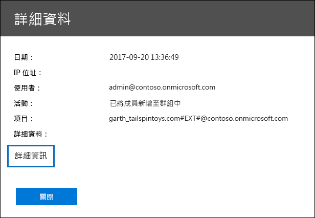

# Office 365 稽核記錄中的詳細內容

当您从安全&合规性中心导出审核日志搜索的结果时，您可以选择下载符合搜索条件的所有结果。 为此，请**选择"导出结果"**\>下载**审核日志搜索**页面上**的所有结果。** 有关详细信息，请参阅在[Office 365 中搜索审核日志。](search-the-audit-log-in-security-and-compliance.md)
  
 导出审核日志搜索的所有结果时，Office 365 统一审核日志的原始数据将复制到一个逗号分隔值 （CSV） 文件中，该文件将下载到本地计算机。 此文件包含来自名为**AuditData**的列中每个审核记录的其他信息。 此列包含来自审核日志记录的多个属性的多值属性。 每个**属性：** 此多值属性中的值对用逗号分隔。 
  
下表描述了多属性**AuditData**列中包括的属性（取决于发生事件的 Office 365 服务）。 具有此属性列的**Office 365 服务**指示包含该属性的活动的服务和类型（用户或管理员）。 有关这些属性或本主题中可能未列出的属性的更多详细信息，请参阅[Office 365 管理活动 API 架构](https://go.microsoft.com/fwlink/p/?LinkId=717993)。
  
> [!TIP]
> 您可以使用 Excel 中的 Power 查询将此列拆分为多个列，以便每个属性都有自己的列。 这将允许您对这些属性的一个或多个属性进行排序和筛选。 要了解如何执行此操作，请参阅[拆分文本列（Power Query）](https://support.office.com/article/5282d425-6dd0-46ca-95bf-8e0da9539662)中的"按分隔符拆分列"部分。 
  
|**屬性**|**描述**|**具有此属性的 Office 365 服务**|
|:-----|:-----|:-----|
|演员|执行操作的用户或服务帐户。|Azure Active Directory|
|AddOnName|在团队中添加、删除或更新的加载项的名称。 Microsoft Teams 中的加载项类型是自动程序、连接器或选项卡。|Microsoft Teams|
|加载项类型|在团队中添加、删除或更新的加载项的类型。 以下值指示加载项的类型。    **1** - 指示机器人。  **2** - 指示连接器。  **3** - 指示选项卡。|Microsoft Teams|
|Azure 活动目录事件类型|Azure 活动目录事件的类型。 以下值指示事件的类型。    **0** - 指示帐户登录事件。  **1** - 指示 Azure 应用程序安全事件。|Azure Active Directory|
|通道|微软团队通道的 ID。 通道所在的团队由**TeamName**和**TeamGuid**属性标识。|Microsoft Teams|
|通道名称|微软团队通道的名称。 通道所在的团队由**TeamName**和**TeamGuid**属性标识。|Microsoft Teams|
|用戶端|用于登录事件的客户端设备、设备操作系统和设备浏览器（例如，诺基亚 Lumia 920;视窗电话 8;IE 移动 11）。|Azure Active Directory|
|客户端信息字符串|有关用于执行操作的电子邮件客户端的信息，例如浏览器版本、Outlook 版本和移动设备信息|交换（邮箱活动）|
|客户端 IP|记录活动时使用的设备的 IP 地址。 IP 地址以 IPv4 或 IPv6 地址格式显示。|交换和 Azure 活动目录|
|客户端IP地址|与客户端 IP 相同。|SharePoint|
|CreationTime|用户执行活动时的日期和时间（UTC）。|全部|
|目标文件扩展|复制或移动的文件的文件扩展名。 此属性仅针对文件复制和文件移动用户活动显示。|SharePoint|
|目标文件名|复制或移动文件的名称。 此属性仅针对文件复制和文件移动操作显示。|SharePoint|
|目标相关Url|复制或移动文件的目标文件夹的 URL。 **SiteURL、****目标相对URL****和"目标文件名"** 属性的值的组合与**ObjectID**属性的值相同，该值是复制的文件的完整路径名称。 此属性仅针对文件复制和文件移动用户活动显示。|SharePoint|
|事件源|标识在 SharePoint 中发生的事件。 可能的值是**SharePoint**和**对象模型。**|SharePoint|
|外部访问|对于 Exchange 管理活动，指定 cmdlet 是由组织中的用户、Microsoft 数据中心人员还是数据中心服务帐户或委派的管理员运行。 值**False**表示 cmdlet 是由组织中的某个人运行的。 值**True**表示 cmdlet 由数据中心人员、数据中心服务帐户或委派的管理员运行。    对于 Exchange 邮箱活动，指定邮箱是否由组织外部的用户访问。|Exchange|
|扩展属性|Azure 活动目录事件的扩展属性。|Azure Active Directory|
|ID|报表条目的 ID。 ID 唯一标识报表条目。|全部|
|内部日志类型|保留給內部使用。|交换（邮箱活动）|
|项目类型|访问或修改的对象的类型。 可能的值包括**文件、****文件夹、****网站、****网站、****租户**和**文档库。**|SharePoint|
|登录状态|标识可能发生的登录失败。|Azure Active Directory|
|登录类型|邮箱访问的类型。 以下值指示访问邮箱的用户类型。     **0** - 指示邮箱所有者。  **1** - 指示管理员。  **2** - 指示委托。  **3** - 指示 Microsoft 数据中心中的传输服务。  **4** - 指示 Microsoft 数据中心中的服务帐户。  **6** - 指示委派的管理员。|交换（邮箱活动）|
|邮箱Guid|已访问的邮箱的交换 GUID。|交换（邮箱活动）|
|邮箱所有者UPN|拥有被访问的邮箱的人员的电子邮件地址。|交换（邮箱活动）|
|成員|列出已从团队中添加或删除的用户。 以下值指示分配给用户的角色类型。     **1** - 指示所有者角色。  **2** - 指示成员角色。  **3** - 指示来宾角色。   "成员"属性还包括组织的名称和成员的电子邮件地址。|Microsoft Teams|
|修改的属性（名称、新值、旧值）|该属性包含在管理事件中，例如将用户添加为网站或网站集管理组的成员。 属性包括已修改的属性的名称（例如，站点管理组）已修改属性的新值（例如作为网站管理员添加的用户）和已修改对象的上一个值。|所有（管理活动）|
|对象ID|对于 Exchange 管理员审核日志记录，由 cmdlet 修改的对象的名称。    对于 SharePoint 活动，用户访问的文件或文件夹的完整 URL 路径名称。    对于 Azure AD 活动，已修改的用户帐户的名称。|全部|
|作業|用户或管理员活动的名称。 此属性的值对应于**在"活动"** 下拉列表中选择的值。 如果选择了**显示所有活动的结果，** 则报表将包含所有服务的所有用户和管理员活动的条目。 有关在 Office 365 审核日志中记录的操作/活动的说明，请参阅[在 Office 365 中搜索审核日志中的"](search-the-audit-log-in-security-and-compliance.md)**已审核活动"** 选项卡。    对于 Exchange 管理活动，此属性标识运行的 cmdlet 的名称。|全部|
|组织ID|Office 365 组织的 GUID。|全部|
|路徑|所访问邮件所在的邮箱文件夹的名称。 此属性还标识在其中创建或复制/移动到邮件的文件夹。|交换（邮箱活动）|
|參數|对于 Exchange 管理活动，与在 操作属性中标识的 cmdlet 一起使用的所有参数的名称和值。|交换（管理活动）|
|记录类型|记录指示的操作类型。 以下值指示记录类型。     **1** - 指示 Exchange 管理员审核日志中的记录。  **2** - 指示 Exchange 邮箱审核日志中针对单个邮箱项目执行的操作的记录。  **3** - 还指示 Exchange 邮箱审核日志中的记录。 此记录类型指示对源邮箱中的多个项目执行操作（例如将多个项目移动到"已删除项目"文件夹或永久删除多个项目）。  **4** - 指示 SharePoint 中的站点管理操作，例如管理员或用户为网站分配权限。  **6** - 指示 SharePoint 中的文件或文件夹相关操作，例如用户查看或修改文件。  **8** - 指示在 Azure 活动目录中执行的管理操作。  **9** - 在 Azure 活动目录中指示 OrgId 登录事件。 此记录类型正在弃用。  **10** - 指示由 Microsoft 人员在数据中心执行的安全 cmdlet 事件。  **11** - 在 SharePoint 中指示数据丢失防护 （DLP） 事件。  **12** - 指示 Sway 事件。  **13** - 在使用统一的 DLP 策略配置时，指示 Exchange 中的 DLP 事件。 不支持基于 Exchange 邮件流规则（也称为传输规则）的 DLP 事件。 **14** - 指示共享点中的共享事件。  **15** - 在 Azure 活动目录中指示安全令牌服务 （STS） 登录事件。  **18** - 指示安全&合规性中心事件。  **20** - 指示电源 BI 事件。  **21**- 指示动态 365 事件。 **22** - 指示 Yammer 事件。  **23** - 指示业务事件的 Skype。  **24** - 指示电子数据展示事件。 此记录类型指示通过在安全和合规性中心运行内容搜索和管理电子数据展示案例执行的活动。 有关详细信息，请参阅在[Office 365 审核日志中搜索电子数据展示活动](search-for-ediscovery-activities-in-the-audit-log.md)。 **25、26 或 27** - 指示 Microsoft 团队事件。  **28** - 指示来自 Exchange 在线保护和 Office 365 高级威胁防护事件的网络钓鱼和恶意软件事件。  **30** - 指示微软流事件。  **31** - 指示高级电子数据展示事件。  **32** - 指示微软流事件。  **35** - 指示 Microsoft 项目事件。   **36** - 指示 SharePoint 列表事件。  **38** - 指示与安全和合规性中心中的保留策略和保留标签相关的事件。   **40** - 指示由安全和合规性警报信号产生的事件。  **41** - 在 Office 365 高级威胁保护中指示安全链接块时间和块覆盖事件。 **44** - 指示工作场所分析事件。  **45** - 指示 PowerApps 应用事件。   **47** - 指示 Office 365 高级威胁防护中的针对 SharePoint、OneDrive 和 Microsoft Teams 中文件的网络钓鱼和恶意软件事件。   **52** - 指示与数据见解 REST API 相关的事件。 **54** - 指示 SharePoint 列表项事件。 **55** - 指示 SharePoint 内容类型事件。
|结果状态|指示操作（在**操作**属性中指定）是否成功。    对于 Exchange 管理活动，该值为**True（** 成功）或**False（** 失败）。|全部   |
|安全合规性中心事件类型|指示活动是安全&合规性中心事件。 所有安全&合规中心活动的值都将为此属性**0。**|安全規範中心|
|共享类型|分配给与资源共享资源的用户的共享权限的类型。 此用户**在"用户共享与"** 属性中标识。|SharePoint|
|網站|用户访问的文件或文件夹所在的站点的 GUID。|SharePoint|
|网站Url|用户访问的文件或文件夹所在的站点的 URL。|SharePoint|
|源文件扩展|用户访问的文件的文件扩展名。 如果访问的对象是文件夹，则此属性为空。|SharePoint|
|源文件名称|用户访问的文件或文件夹的名称。|SharePoint|
|源相对 Url|包含用户访问的文件的文件夹的 URL。 **SiteURL、Source****相对URL**和**SourceFileName**属性的值的组合与**ObjectID**属性的值相同，该值是用户访问的文件的完整路径名称。|SharePoint|
|主旨|已访问的消息的主题行。|交换（邮箱活动）|
|选项卡类型| 团队中添加、删除或更新的选项卡类型。 此属性的可能值是：     **Excel 引脚**- Excel 选项卡。    **扩展**- 所有第一方和第三方应用程序;如类计划、VSTS 和窗体。    **注释**- 一个注意选项卡。    **Pdfpin** - PDF 选项卡。    **Powerbi** - 一个 PowerBI 选项卡。    **电源点 -** 电源点选项卡。    **共享点文件**- 共享点选项卡。    **网页**- 固定网站选项卡。    **维基标签**- 维基选项卡。    **字钉**- 单词选项卡。|Microsoft Teams|
|Target|执行操作（在**操作**属性中标识）的用户。 例如，如果将来宾用户添加到 SharePoint 或 Microsoft 团队，则该用户将列在此属性中。|Azure Active Directory|
|团队|微软团队中团队的 ID。|Microsoft Teams|
|团队名称|微软团队中的团队的名称。|Microsoft Teams|
|用户代理|有关用户浏览器的信息。 此信息由浏览器提供。|SharePoint|
|用户域|有关执行操作的用户（参与者）的租户组织的标识信息。|Azure Active Directory|
|UserID|执行导致记录记录的操作（在**Action**属性中指定）的用户。 请注意，系统帐户（如 SHAREPOINT_系统或 NT AUTHORITY_SYSTEM）执行的活动的记录也包含在审核日志中。|全部|
|用户密钥|UserID 属性中标识的用户的替代**** ID。 例如，此属性填充了 SharePoint 中用户执行的事件的护照唯一 ID （PUID）。 此属性还可以为在其他服务和系统帐户执行的事件中发生的事件指定与**UserID**属性相同的值。|全部|
|用户共享|与资源共享的资源的用户。 如果**操作**属性的值**为"共享设置"，** 则包含此属性。 此用户也列在报表**中的"共享"** 列中。|SharePoint|
|用户类型|执行操作的用户类型。 以下值指示用户类型。     **0** - 常规用户。  **2** - Office 365 组织的管理员。 1  **3** - 微软数据中心管理员或数据中心系统帐户。  **4** - 系统帐户。  **5** - 应用程序。  **6** - 服务主体。 **7** - 自定义策略。 **8** - 系统策略。|全部|
|版本|指示已记录的活动的版本号（由**操作**属性标识）。|全部|
|工作量|发生活动的 Office 365 服务。 此属性的可能值是：     **SharePoint  OneDrive 交换 Azure 活动 目录 数据中心安全 合规性 Sway Skype 业务  安全合规中心 PowerBI CRM Yammer 微软 团队威胁 智能微软 流微软 流 DlpSharePoint  分类数据 项目 PowerApps 工作场所分析**|全部|
||||

> [!NOTE]
> 1对于与 Azure 活动目录相关的事件，在审核记录中不使用管理员的值。 管理员执行的活动的审核记录将指示常规用户（例如**UserType： 0**） 执行该活动。 **UserID**属性将标识执行活动的人员（常规用户或管理员）。

当您在查看特定事件的详细信息时**单击"更多信息"** 时，也会显示上述属性。 
  

  
