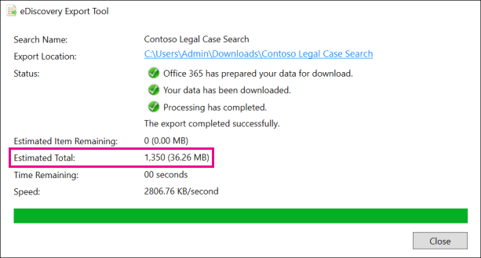

# Office 365 中預估和實際 eDiscovery 搜尋結果之間的差異

本主題適用于您可以使用下列其中一個 Microsoft eDiscovery 工具執行的搜尋： 

- 安全性 & 規範中心的內容搜尋     
- 在 Exchange 系統管理中心（EAC）中 In-Place eDiscovery     
- SharePoint Online 中的 eDiscovery 中心    
   
當您執行 eDiscovery 搜尋時，您所使用的工具會傳回符合搜尋準則的專案數目（及其總大小）的預估。 例如，當您在安全性 & 合規性中心執行搜尋時，預估的搜尋結果會顯示在所選搜尋的 [詳細資料] 窗格中。
  

  
當您將結果匯出至本機電腦及隨搜尋結果下載的 [匯出摘要] 報告中時，這是與 eDiscovery 匯出工具中所顯示之總大小和專案數目相同的估計。
  
**EDiscovery 匯出工具中的預估結果**

  
**匯出摘要報告中的預估結果**

  
不過，當您在先前的「匯出摘要」螢幕擷取畫面中，您會看到實際下載之實際的搜尋結果大小和數目，與預計搜尋結果的大小和數目相同。 
  

  
以下是這些差異的一些原因：
  
- 評估**結果的方式**，估計搜尋結果的結果就是符合搜尋查詢準則之專案的預估（而非實際計數）。 若要編譯 Exchange 專案的預估，您所使用的 eDiscovery 工具會從 Exchange 資料庫要求符合搜尋準則的郵件 IDs 清單。 但是當您匯出搜尋結果時，會重新執行搜尋，並從 Exchange 資料庫中檢索實際郵件。 因此，這些差異可能是由於預估專案數目和實際專案數目的決定而造成的。 
    
- **評估與匯出搜尋結果之間所發生的變更**-當您匯出搜尋結果時，會重新開機搜尋，以收集符合搜尋準則之搜尋索引中的最近專案。 在收集估計的搜尋結果與匯出搜尋結果之間的時間之間，有可能會建立、傳送或接收符合搜尋準則的其他專案。 評估搜尋結果時，在搜尋結果中的專案已經不再存在，可能是因為在匯出搜尋結果之前已經從內容位置中清除。 緩解此問題的一種方法是指定 eDiscovery 搜尋的日期範圍。 另一種方式是保留內容位置，讓專案得以保留且無法清除。 雖然很少發生，即使在套用保留時，內建的行事曆專案（不是使用者可編輯，也包含在許多搜尋結果中），也可能會隨時移除。 這種定期移除行事曆專案會導致較少的專案匯出。
    
- 未**編制索引的專案**-針對搜尋未編制索引的專案可能會造成預估和實際搜尋結果之間的差異。 例如，當您執行搜尋以估計搜尋結果時，Exchange 中 In-Place eDiscovery，以及 SharePoint 中的 eDiscovery 中心不會包含未編制索引的專案（不符合搜尋準則）。 不過，您可以在匯出搜尋結果時包含未編制索引的專案。 如果您在匯出搜尋結果時包含未編制索引的專案，則可能會有更多匯出的專案。 這會造成預估和匯出的搜尋結果之間的差異。 
    
    在安全性 & 規範中心使用內容搜尋工具時，您可以選擇在搜尋評估中包含未編制索引的專案。 搜尋傳回的未編制索引項目目數目會列在詳細資料窗格中，以及其他估計的搜尋結果。 所有未編制索引的專案也會包含在預估搜尋結果的總大小。 當您匯出搜尋結果時，可以選擇包含或不包含未編制索引的專案。 設定這些選項的方式可能會導致估計的和實際下載之搜尋結果之間的差異。 
    
- **匯出包含所有內容位置之內容搜尋的結果**-如果您要從中匯出結果的搜尋是對組織中的所有內容位置進行搜尋，則只會匯出包含符合搜尋準則之專案的內容位置中未編制索引的專案。 In other words, if no search results are found in a mailbox or site, then any unindexed items in that mailbox or site won't be exported. 不過，所有內容位置的未編制索引項目目（甚至不含符合搜尋查詢的專案）都會包含在預估的搜尋結果中。 
    
    或者，如果您要從包含特定內容位置匯出的搜尋，則會匯出搜尋中所指定之所有內容位置的未編制索引項目目（未從搜尋準則排除）。 在此情況下，估計未編制索引的專案數目及實際匯出的未編制索引項目目數目應該都相同。
    
    未從組織中的每個位置匯出未編制索引的專案的原因，是因為這可能會增加匯出錯誤的可能性，並增加匯出及下載搜尋結果所需的時間。
    
- **Raw 檔案格式**，也就是匯出的檔案格式-針對 Exchange 專案，搜尋結果的預估大小是使用原始 Exchange 郵件大小來計算。 不過，電子郵件會匯出為 PST 檔案或個別郵件（格式化成 .EML 檔案）。 這兩個匯出選項使用的是原始 Exchange 郵件的不同檔案格式，這會導致匯出的檔案大小總計與估計的檔案大小不同。 
    
- **檔版本**-針對 SharePoint 檔，在預估的搜尋結果中不會包含檔的多個版本。 不過，您可以選擇在匯出搜尋結果時包含所有檔版本，這會增加匯出之檔的實際數目（及總大小）。 
    
- **重復資料**刪除-針對 Exchange 專案，重復資料刪除可減少匯出的專案數。 您可以選擇在匯出搜尋結果時將其取消重複。 若為 Exchange 郵件，這表示只會匯出郵件的單一實例，即使該郵件可能會在多個信箱中找到。 預估搜尋結果包含每個郵件的實例。 因此，如果您在匯出搜尋結果時選擇 [重復資料刪除] 選項，則匯出的實際專案數目可能會遠遠小於估計的專案數。 
    
    如果您選擇 [重復資料刪除] 選項，另一件要記住的一點是，所有 Exchange 專案都會匯出成單一 PST 檔案，而且不會保留來源信箱中的資料夾結構。 匯出的 PST 檔案只包含電子郵件專案。 不過，「搜尋結果報告」會包含每個匯出郵件的專案，用以識別郵件所在的來源信箱。 這可協助您識別所有包含重複郵件的信箱。 如果未啟用重複資料刪除，則會為每個包含在搜尋中的信箱匯出個別的 PST 檔案。 
    
## 從 SharePoint Online 中的 eDiscovery 中心匯出未編制索引的專案

在 SharePoint Online 的 eDiscovery Center 中，您可以選擇在匯出 eDiscovery 搜尋的結果時包含未編制索引的內容（從 Exchange 及 SharePoint）。 若要執行此動作，請選取 [**包含已加密或具有無法辨識格式的專案**] 選項。 未編制索引的專案（SharePoint 中也稱為「uncrawlable」）是 Exchange 中的專案，也就是由於某些原因 SharePoint 而未編制索引以進行搜尋。 在您匯出搜尋結果時所包含的**Exchange 索引錯誤**報告中，會列出未編制索引的 exchange 專案。 同樣地，未編制索引的 SharePoint 專案會列在**SharePoint 索引錯誤**報告中。 當您匯出未編制索引的專案時，他們會下載至名為**Uncrawlable**的資料夾。 未編制索引的 Exchange 專案包含在 PST 檔案中;每個來自 SharePoint 的未編制索引的檔也會下載。 每個索引錯誤報表中會列出未編制索引的專案數（如果有的話）。 報告中未編制索引的專案數目應符合所下載之未編制索引的專案數目。 
  
 **如果匯出未編制索引的專案數不符合索引錯誤報表中的專案數，有何原因呢？** 如先前所述，可能已在執行搜尋預估和匯出搜尋結果的時間之間，從 Office 365 清除專案。 未編制索引的專案可能會發生類似的差異。 例如，在匯出搜尋結果時，搜尋索引可能會是下班時間。 這表示使用搜尋結果匯出的未編制索引的專案可能未列在 [索引錯誤報表] 中，因為該專案在匯出搜尋結果時未編制索引。 這會導致匯出的索引項目目數目超過索引錯誤報表中列出的數目。 同樣地，索引錯誤報表中所列的未編制索引的專案，在更新搜尋索引之前，可能已經從 Office 365 清除。 這會導致匯出的未編制索引項目目數目少於索引錯誤報表中列出的數目。 
  
> [!NOTE]
> 如果您未選取 [**包括已加密的專案] 或 [未辨識的格式**] 選項，當您匯出搜尋結果或只下載報告時，就會下載索引錯誤報表，但沒有任何專案。 這並不表示沒有任何索引錯誤。 這只表示匯出中不包含未編制索引的專案。 
  

