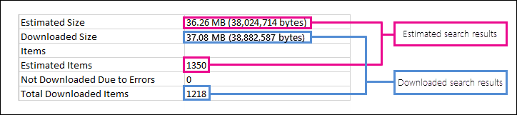

# Office 365 中預估和實際 eDiscovery 搜尋結果之間的差異Differences between estimated and actual eDiscovery search results in Office 365

本主題適用于您可以使用下列其中一個 Microsoft eDiscovery 工具執行的搜尋：This topic applies to searches that you can run using one of the following Microsoft eDiscovery tools: 

- 安全性 & 規範中心的內容搜尋Content Search in the Security & Compliance Center     
- 在 Exchange 系統管理中心（EAC）中 In-Place eDiscoveryIn-Place eDiscovery in the Exchange admin center (EAC)     
- SharePoint Online 中的 eDiscovery 中心The eDiscovery Center in SharePoint Online    
   
當您執行 eDiscovery 搜尋時，您所使用的工具會傳回符合搜尋準則的專案數目（及其總大小）的預估。When you run an eDiscovery search, the tool you're using will return an estimate of the number of items (and their total size) that meet the search criteria. 例如，當您在安全性 & 合規性中心執行搜尋時，預估的搜尋結果會顯示在所選搜尋的 [詳細資料] 窗格中。For example, when you run a search in the Security & Compliance Center, the estimated search results are displayed in the details pane for the selected search.
  

  
當您將結果匯出至本機電腦及隨搜尋結果下載的 [匯出摘要] 報告中時，這是與 eDiscovery 匯出工具中所顯示之總大小和專案數目相同的估計。This is the same estimate of total size and number of items that is displayed in the eDiscovery Export Tool when you export results to a local computer and in the Export Summary report that's downloaded with the search results.
  
**EDiscovery 匯出工具中的預估結果****Estimated results in the eDiscovery Export Tool**

  
**匯出摘要報告中的預估結果****Estimated results in Export Summary report**

  
不過，當您在先前的「匯出摘要」螢幕擷取畫面中，您會看到實際下載之實際的搜尋結果大小和數目，與預計搜尋結果的大小和數目相同。However, as you'll notice in the previous screenshot of the Export Summary report, the size and number of actual search results that are actually downloaded are different than the size and number of estimated search results. 
  

  
以下是這些差異的一些原因：Here are some reasons for these differences:
  
- 評估**結果的方式**，估計搜尋結果的結果就是符合搜尋查詢準則之專案的預估（而非實際計數）。**The way results are estimated** - An estimate of the search results are just that, an estimate (and not an actual count) of the items that meet the search query criteria. 若要編譯 Exchange 專案的預估，您所使用的 eDiscovery 工具會從 Exchange 資料庫要求符合搜尋準則的郵件 IDs 清單。To compile the estimate of Exchange items, a list of the message IDs that meet the search criteria is requested from the Exchange database by the eDiscovery tool you're using. 但是當您匯出搜尋結果時，會重新執行搜尋，並從 Exchange 資料庫中檢索實際郵件。But when you export the search results, the search is re-run and the actual messages are retrieved from the Exchange database. 因此，這些差異可能是由於預估專案數目和實際專案數目的決定而造成的。So these differences might result because of how the estimated number of items and the actual number of items are determined. 
    
- **評估與匯出搜尋結果之間所發生的變更**-當您匯出搜尋結果時，會重新開機搜尋，以收集符合搜尋準則之搜尋索引中的最近專案。**Changes that happen between the time when estimating and exporting search results** - When you export search results, the search is re-started to collect that most recent items in the search index that meet the search criteria. 在收集估計的搜尋結果與匯出搜尋結果之間的時間之間，有可能會建立、傳送或接收符合搜尋準則的其他專案。It's possible there are additional items were created, sent, or received that meet the search criteria in the time between when the estimated search results were collected and when the search results were exported. 評估搜尋結果時，在搜尋結果中的專案已經不再存在，可能是因為在匯出搜尋結果之前已經從內容位置中清除。It's also possible that items that were in the search index when the search results were estimated are no longer there because they were purged from the content location before the search results are exported. 緩解此問題的一種方法是指定 eDiscovery 搜尋的日期範圍。One way to mitigate this issue is to specify a date range for an eDiscovery search. 另一種方式是保留內容位置，讓專案得以保留且無法清除。Another way is to place a hold on content locations so that items are preserved and can't be purged. 雖然很少發生，即使在套用保留時，內建的行事曆專案（不是使用者可編輯，也包含在許多搜尋結果中），也可能會隨時移除。Although very rare, even in the case when a hold is applied, maintenance of built-in calendar items (which are not editable by the user, but are included in many search results) may be removed from time to time. 這種定期移除行事曆專案會導致較少的專案匯出。This periodic removal of calendar items will result in fewer items that are exported.
    
- 未**編制索引的專案**-針對搜尋未編制索引的專案可能會造成預估和實際搜尋結果之間的差異。**Unindexed items** - Items that are unindexed for search can cause differences between estimated and actual search results. 例如，當您執行搜尋以估計搜尋結果時，Exchange 中 In-Place eDiscovery，以及 SharePoint 中的 eDiscovery 中心不會包含未編制索引的專案（不符合搜尋準則）。For example, In-Place eDiscovery in Exchange and the eDiscovery Center in SharePoint don't include unindexed items (that don't meet the search criteria) when you run a search to estimate the search results. 不過，您可以在匯出搜尋結果時包含未編制索引的專案。But you can include unindexed items when you export the search results. 如果您在匯出搜尋結果時包含未編制索引的專案，則可能會有更多匯出的專案。If you include unindexed items when exporting search results, there might be more items that are exported. 這會造成預估和匯出的搜尋結果之間的差異。This will cause a difference between the estimated and exported search results. 
    
    在安全性 & 規範中心使用內容搜尋工具時，您可以選擇在搜尋評估中包含未編制索引的專案。When using the Content Search tool in the Security & Compliance Center, you have the option to include unindexed items in the search estimate. 搜尋傳回的未編制索引項目目數目會列在詳細資料窗格中，以及其他估計的搜尋結果。The number of unindexed items returned by the search is listed in the details pane together with the other estimated search results. 所有未編制索引的專案也會包含在預估搜尋結果的總大小。Any unindexed items would also be included in the total size of the estimated search results. 當您匯出搜尋結果時，可以選擇包含或不包含未編制索引的專案。When you export search results, you have the option to include or not include unindexed items. 設定這些選項的方式可能會導致估計的和實際下載之搜尋結果之間的差異。How you configure these options might result in differences between estimated and the actual search results that are downloaded. 
    
- **匯出包含所有內容位置之內容搜尋的結果**-如果您要從中匯出結果的搜尋是對組織中的所有內容位置進行搜尋，則只會匯出包含符合搜尋準則之專案的內容位置中未編制索引的專案。**Exporting the results of a Content Search that includes all content locations** - If the search that you're exporting results from was a search of all content locations in your organization, then only the unindexed items from content locations that contain items that match the search criteria will be exported. In other words, if no search results are found in a mailbox or site, then any unindexed items in that mailbox or site won't be exported.In other words, if no search results are found in a mailbox or site, then any unindexed items in that mailbox or site won't be exported. 不過，所有內容位置的未編制索引項目目（甚至不含符合搜尋查詢的專案）都會包含在預估的搜尋結果中。However, unindexed items from all content locations (even those that don't contain items that match the search query) will be included in the estimated search results. 
    
    或者，如果您要從包含特定內容位置匯出的搜尋，則會匯出搜尋中所指定之所有內容位置的未編制索引項目目（未從搜尋準則排除）。Alternatively, if the search that you're exporting results from included specific content locations, then unindexed items (that aren't excluded by the search criteria) from all the content locations specified in the search will be exported. 在此情況下，估計未編制索引的專案數目及實際匯出的未編制索引項目目數目應該都相同。In this case, the estimated number of unindexed items and the number of unindexed items actually exported should be the same.
    
    未從組織中的每個位置匯出未編制索引的專案的原因，是因為這可能會增加匯出錯誤的可能性，並增加匯出及下載搜尋結果所需的時間。The reason for not exporting unindexed items from every location in the organization is because it might increase the likelihood of export errors and increase the time it takes to export and download the search results.
    
- **Raw 檔案格式**，也就是匯出的檔案格式-針對 Exchange 專案，搜尋結果的預估大小是使用原始 Exchange 郵件大小來計算。**Raw file formats versus exported file formats** - For Exchange items, the estimated size of the search results is calculated by using the raw Exchange message sizes. 不過，電子郵件會匯出為 PST 檔案或個別郵件（格式化成 .EML 檔案）。However, email messages are exported in a PST file or as individual messages (which are formatted as EML files). 這兩個匯出選項使用的是原始 Exchange 郵件的不同檔案格式，這會導致匯出的檔案大小總計與估計的檔案大小不同。Both of these export options use a different file format that raw Exchange messages, which results in the total exported file size being different than the estimated file size. 
    
- **檔版本**-針對 SharePoint 檔，在預估的搜尋結果中不會包含檔的多個版本。**Document versions** - For SharePoint documents, multiple versions of a document aren't included in the estimated search results. 不過，您可以選擇在匯出搜尋結果時包含所有檔版本，這會增加匯出之檔的實際數目（及總大小）。But you have the option to include all document versions when you export the search results, which will increase the actual number (and total size) of the exported documents. 
    
- **重復資料**刪除-針對 Exchange 專案，重復資料刪除可減少匯出的專案數。**De-duplication** - For Exchange items, de-duplication reduces the number of items that are exported. 您可以選擇在匯出搜尋結果時將其取消重複。You have the option to de-duplicate the search results when you export them. 若為 Exchange 郵件，這表示只會匯出郵件的單一實例，即使該郵件可能會在多個信箱中找到。For Exchange messages, this means that only a single instance of a message is exported, even though that message might be found in multiple mailboxes. 預估搜尋結果包含每個郵件的實例。The estimated search results include every instance of a message. 因此，如果您在匯出搜尋結果時選擇 [重復資料刪除] 選項，則匯出的實際專案數目可能會遠遠小於估計的專案數。So if you choose the de-duplication option when exporting search results, the actual number of items that are exported might be considerably less than the estimated number of items. 
    
    如果您選擇 [重復資料刪除] 選項，另一件要記住的一點是，所有 Exchange 專案都會匯出成單一 PST 檔案，而且不會保留來源信箱中的資料夾結構。Another thing to keep in mind if you choose the de-duplication option is that all Exchange items are exported in a single PST file and the folder structure from the source mailboxes isn't preserved. 匯出的 PST 檔案只包含電子郵件專案。The exported PST file just contains the email items. 不過，「搜尋結果報告」會包含每個匯出郵件的專案，用以識別郵件所在的來源信箱。However, a search results report contains an entry for each exported message that identifies the source mailbox where the message is located. 這可協助您識別所有包含重複郵件的信箱。This helps you identify all mailboxes that contain a duplicate message. 如果未啟用重複資料刪除，則會為每個包含在搜尋中的信箱匯出個別的 PST 檔案。If you don't enable de-duplication, a separate PST file is exported for each mailbox included in the search. 
    
## 從 SharePoint Online 中的 eDiscovery 中心匯出未編制索引的專案Exporting unindexed items from the eDiscovery Center in SharePoint Online

在 SharePoint Online 的 eDiscovery Center 中，您可以選擇在匯出 eDiscovery 搜尋的結果時包含未編制索引的內容（從 Exchange 及 SharePoint）。In the eDiscovery Center in SharePoint Online, you have the option to include unindexed content (from Exchange and SharePoint) when you export the results of an eDiscovery search. 若要執行此動作，請選取 [**包含已加密或具有無法辨識格式的專案**] 選項。You do this by selecting the **Include items that are encrypted or have an unrecognized format** option. 未編制索引的專案（SharePoint 中也稱為「uncrawlable」）是 Exchange 中的專案，也就是由於某些原因 SharePoint 而未編制索引以進行搜尋。Unindexed items (also called uncrawlable in SharePoint) are items in Exchange and SharePoint that for some reason weren't indexed for search. 在您匯出搜尋結果時所包含的**Exchange 索引錯誤**報告中，會列出未編制索引的 exchange 專案。Unindexed Exchange items are listed in the **Exchange Index Errors** report that's included when you export search results. 同樣地，未編制索引的 SharePoint 專案會列在**SharePoint 索引錯誤**報告中。Similarly, unindexed SharePoint items are listed in **SharePoint Index Errors** report. 當您匯出未編制索引的專案時，他們會下載至名為**Uncrawlable**的資料夾。When you export unindexed items, they're downloaded to a folder named **Uncrawlable**. 未編制索引的 Exchange 專案包含在 PST 檔案中;每個來自 SharePoint 的未編制索引的檔也會下載。Unindexed Exchange items are included in a PST file; each unindexed document from SharePoint is downloaded too. 每個索引錯誤報表中會列出未編制索引的專案數（如果有的話）。The number of unindexed items (if there are any) are listed in each index errors report. 報告中未編制索引的專案數目應符合所下載之未編制索引的專案數目。The number of unindexed items in the reports should match the number of unindexed items that are downloaded. 
  
 **如果匯出未編制索引的專案數不符合索引錯誤報表中的專案數，有何原因呢？****What are some reasons if the number of exported unindexed items don't match the number of items in the index error report?** 如先前所述，可能已在執行搜尋預估和匯出搜尋結果的時間之間，從 Office 365 清除專案。As previously explained, it's possible that items have been purged from Office 365 between the time the search estimate was run and the time the search results were exported. 未編制索引的專案可能會發生類似的差異。A similar discrepancy can occur for unindexed items. 例如，在匯出搜尋結果時，搜尋索引可能會是下班時間。For example, the search index might be out date when search results are exported. 這表示使用搜尋結果匯出的未編制索引的專案可能未列在 [索引錯誤報表] 中，因為該專案在匯出搜尋結果時未編制索引。This would mean that an unindexed item that was exported with the search results might not be listed in the index errors report because the item wasn't indexed at the time the search results were exported. 這會導致匯出的索引項目目數目超過索引錯誤報表中列出的數目。This would result in more unindexed items being export than are listed in the index error report. 同樣地，索引錯誤報表中所列的未編制索引的專案，在更新搜尋索引之前，可能已經從 Office 365 清除。Similarly, an unindexed item listed in the index error report could have been purged from Office 365 before the search index was updated. 這會導致匯出的未編制索引項目目數目少於索引錯誤報表中列出的數目。This would result in fewer unindexed items being export than are listed in the index error report. 
  
> [!NOTE]
> 如果您未選取 [**包括已加密的專案] 或 [未辨識的格式**] 選項，當您匯出搜尋結果或只下載報告時，就會下載索引錯誤報表，但沒有任何專案。If you don't select the **Include items that are encrypted or have an unrecognized format** option when you export search results or just download the reports, the index error reports are downloaded but they don't have any entries. 這並不表示沒有任何索引錯誤。This doesn't mean there aren't any indexing errors. 這只表示匯出中不包含未編制索引的專案。It just means that unindexed items weren't included in the export. 
  

