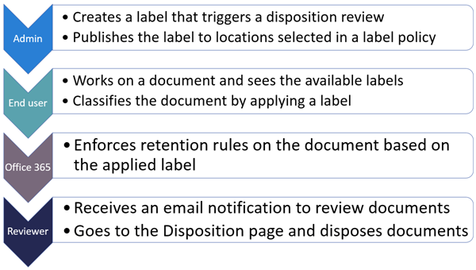
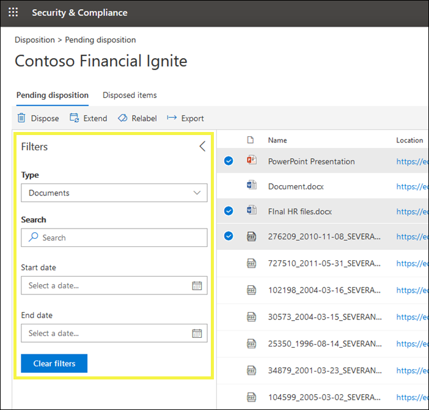

# 处置审查概述Overview of disposition reviews

当内容达到其保留期结束时，您可能需要查看该内容以决定是否可以安全地删除（"已释放"）的原因有多种。When content reaches the end of its retention period, there are several reasons why you might want to review that content to decide whether it can be safely deleted ("disposed"). 例如，您可能需要：For example, you might need to:
  
- 在发生诉讼或审计时，暂停删除（"处置"）相关内容。Suspend the deletion ("disposition") of relevant content in the event of litigation or an audit.
    
- 如果内容具有研究或历史价值，请从处置列表中删除以将其存储在存档中的内容。Remove content from the disposition list to store in an archive, if that content has research or historical value.
    
- 如果原始策略是临时或临时解决方案，则为内容分配不同的保留期。Assign a different retention period to the content, if the original policy was a temporary or provisional solution.
    
- 将内容返回给客户端或将其传输到其他组织。Return the content to clients or transfer it to another organization.
    
当您在 Microsoft 365 合规性中心、Microsoft 365 安全中心或 Office 365 安全&合规性中心创建保留标签时，可以选择在保留期结束时触发处置审核。When you create a retention label in the Microsoft 365 compliance center, Microsoft 365 security center, or Office 365 Security & Compliance Center, you can choose to trigger a disposition review at the end of the retention period. 在处置审查中：In a disposition review:
  
- 您选择的人员会收到一封电子邮件通知，告知他们具有要查看的内容。The people you choose receive an email notification that they have content to review. 这些审阅者可以是单个用户、分发或安全组，也可以是 Office 365 组。These reviewers can be individual users, distribution or security groups, or Office 365 groups. 请注意，通知每周发送一次。Note that notifications are sent on a weekly basis.
    
- 审阅者转到安全&amp;合规性**中心的"处置"** 页以审阅内容。The reviewers go to the **Disposition** page in the Security &amp; Compliance Center to review the content. 审阅者可以看到每个保留标签等待处置的项目数，然后选择保留标签以查看带有该标签的所有内容。The reviewers can see how many items for each retention label are awaiting disposition, and then select a retention label to see all content with that label.
    
- 对于每份文档或电子邮件，审阅者可以：For each document or email, the reviewer can:
    
  - 应用其他保留标签。Apply a different retention label.
    
  - 延长其保留期。Extend its retention period.
    
  - 永久删除它。Permanently delete it.
    
- 审阅者可以查看挂起或已完成的处置，并将该列表导出为 .csv 文件。Reviewers can view either pending or completed dispositions, and export that list as a .csv file.

> [!NOTE]
> 处置审核需要 Office 365 企业版 E5 订阅。Disposition reviews require an Office 365 Enterprise E5 subscription.
  
处置审核可以包括 Exchange 邮箱、SharePoint 网站、OneDrive 帐户和 Office 365 组中的内容。A disposition review can include content in Exchange mailboxes, SharePoint sites, OneDrive accounts, and Office 365 groups. 只有在审阅者选择永久删除内容后，才会删除这些位置等待处置审核的内容。Content awaiting a disposition review in those locations is deleted only after a reviewer chooses to permanently delete the content.
  

## 通过创建保留标签设置处置审核Setting up the disposition review by creating a retention label

这是设置处置审核的基本工作流。This is the basic workflow for setting up a disposition review. 请注意，此流显示正在发布并由用户手动应用的保留标签;因此，将发布保留标签。或者，可以自动将触发处置审核的保留标签应用于内容。Note that this flow shows a retention label being published and then manually applied by a user; alternatively, a retention label that triggers a disposition review can be auto-applied to content.
  

  
在 Office 365 中创建保留标签时，处置审核是一个选项。A disposition review is an option when you create a retention label in Office 365. 请注意，此选项在保留策略中不可用，但仅在配置为保留内容的保留标签中可用。Note that this option is not available in a retention policy but only in a retention label that's configured to retain content.
  
有关保留标签的详细信息，请参阅[保留标签概述](labels.md)。For more information about retention labels, see [Overview of retention labels](labels.md).
  

  
## 释放内容Disposing content

当审阅者通过电子邮件收到内容已准备好审阅的通知时，他们可以转到安全&amp;合规性**中心的"处置"** 页。When a reviewer is notified by email that content is ready to review, they can go to the **Disposition** page in the Security &amp; Compliance Center. 审阅者可以看到每个保留标签等待处置的项目数，然后选择保留标签以查看带有该标签的所有内容。The reviewers can see how many items for each retention label are awaiting disposition, and then select a retention label to see all content with that label.

选择保留标签后，下一页将显示该标签的所有待处理项。After you select a retention label, the next page shows all pending dispositions for that label.

然后，审阅者可以：The reviewer can then: 
  
- 应用其他保留标签。Apply a different retention label.
    
- 延长保留期。Extend the retention period.
    
- 永久删除该项目。Permanently delete the item.

请注意，审阅者可以选择多个项目并同时释放它们。Note that a reviewer can select multiple items and dispose them at the same time.
    
如果审阅者具有该位置的权限，则审阅者还可以使用该链接在其原始位置查看文档。A reviewer can also use the link to view the document in its original location, if the reviewer has permissions for that location. 在处置审核期间，内容永远不会从其原始位置移动，并且直到审阅者选择这样做才会删除。During a disposition review, the content never moves from its original location, and it's never deleted until the reviewer chooses to do so.
  
请注意，电子邮件通知每周自动发送给审阅者。Note that the email notifications are sent automatically to reviewers on a weekly basis. 因此，当内容达到其保留期结束时，审阅者最多可能需要 7 天才能收到内容正在等待处置的电子邮件通知。Therefore, when content reaches the end of its retention period, it may take up to seven days for reviewers to receive the email notification that content is awaiting disposition.
  
另请注意，所有处置操作都经过审核。Also note that all disposition actions are audited. 为了确保这一点，您必须在第一次处置操作之前至少一天打开审核 - 有关详细信息，请参阅[在 Office 365&amp;安全合规性中心中搜索审核日志](search-the-audit-log-in-security-and-compliance.md)。To ensure this, you must turn on auditing at least one day prior to the first disposition action - for more information, see [Search the audit log in the Office 365 Security &amp; Compliance Center](search-the-audit-log-in-security-and-compliance.md). 
  
## 处置权限Permissions for disposition

要**访问"处置"** 页，审阅者**必须是"处置管理"** 角色**和"仅查看审核日志"** 角色的成员。To get access to the **Disposition** page, reviewers must be members of the **Disposition Management** role and the **View-Only Audit Logs** role. 我们建议创建一个名为"处置审阅者"的新角色组，将这两个角色添加到该角色组，然后将成员添加到角色组。We recommend creating a new role group called Disposition Reviewers, adding these two roles to that role group, and then adding members to the role group. 
  
有关详细信息，请参阅[向用户授予对 Office 365 安全&amp;合规性中心的访问权限](../security/office-365-security/grant-access-to-the-security-and-compliance-center.md)For more information, see [Give users access to the Office 365 Security &amp; Compliance Center](../security/office-365-security/grant-access-to-the-security-and-compliance-center.md)
  
## 永久删除已释放内容的时间How long until disposed content is permanently deleted

只有在审阅者选择永久删除内容后，才会删除等待处置审核的内容。Content awaiting a disposition review is deleted only after a reviewer chooses to permanently delete the content. 当审阅者选择此选项时，SharePoint 网站或 OneDrive 帐户中的内容将有资格享受本节中描述的标准清理过程：[保留策略如何处理内容。](retention-policies.md#how-a-retention-policy-works-with-content-in-place)When the reviewer chooses this option, the content in the SharePoint site or OneDrive account becomes eligible for the standard cleanup process described in this section: [How a retention policy works with content in place](retention-policies.md#how-a-retention-policy-works-with-content-in-place).
  
这意味着：This means that:
  
- 文档库中的内容将在处置后的**7 天内**移动到第一阶段回收站，然后在**93 天后**永久删除。Content in a document library will be moved to the first-stage Recycle Bin **within 7 days** of disposition, and then permanently deleted **93 days** after that. 回收站不按搜索编制索引，因此其内容不适用于电子数据展示保留。The Recycle Bin is not indexed by search and therefore its contents are not available to an eDiscovery hold.

- 保留保留库中的内容将在处置后的**7 天内**永久删除。Content in the Preservation Hold library will be permanently deleted **within 7 days** of disposition.

- 交换邮箱中的项目将在处置后的**14 天内**永久删除。Items in an Exchange mailbox will be permanently deleted **within 14 days** of disposition. （请注意，14 天是默认设置，但最多可配置 30 天。(Note that 14 days is the default setting but it can be configured up to 30 days.)
    
## 查看待处理处置和已处置项目View pending dispositions and disposed items

在"**待处理处置"** 页上，您可以查看特定保留标签的待处理和已完成处置：On the **Pending disposition** page, you can view both pending and completed dispositions for a specific retention label: 
  
- **待处理显示**已达到其保留期末尾且需要处置审核的项目。The **Pending disposition** shows items that have reached the end of their retention period and require a disposition review. 查看每个项目后，决定是否要对其应用不同的保留标签、延长其保留期或永久删除它。After reviewing each item, decide if you want to apply a different retention label to it, extend its retention period, or permanently delete it. 您可以选择多个项目。You can select multiple items.
    
- "**已处置项目"** 选项卡显示处置在处置审核期间已批准删除，目前正在永久删除的过程中。The **Disposed items** tab shows dispositions were approved for deletion during a disposition review and are now in the process of being permanently deleted. 应用了不同的保留标签或延长其保留期作为审核的一部分的项目不会在此处显示。Items that had a different retention label applied or their retention period extended as part of a review won't appear here.

    
### 筛选处置视图Filter the disposition views

您可以按保留标签或时间范围筛选这些视图。You can filter these views by retention label or time range. 对于待处理，时间范围基于到期日期。For pending dispositions, the time range is based on the expiration date. 对于已处置的项目，时间范围基于删除日期。For disposed items, the time range is based on the deletion date.
  

### 导出处置项目Export the disposition items

此外，您可以将任一视图中的项目导出为可在 Excel 中打开的 .csv 文件。In addition, you can export the items in either view as a .csv file that you can open in Excel.
  

  

