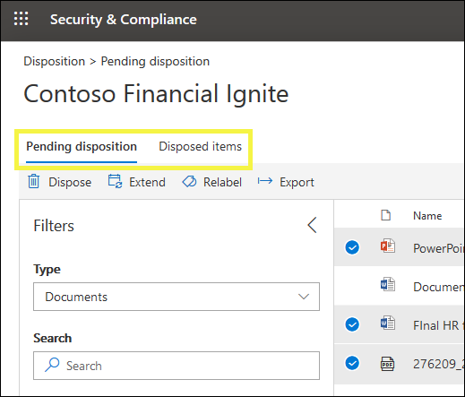

# 進行處置檢查的概覽Overview of disposition reviews

當內容到達保留期間結束時，可能會有幾個原因會讓您複查內容，以決定是否可以安全地刪除（「已處置」）。When content reaches the end of its retention period, there are several reasons why you might want to review that content to decide whether it can be safely deleted ("disposed"). 例如，您可能需要：For example, you might need to:
  
- 在訴訟或審計事件中，封存相關內容的刪除（「處置」）。Suspend the deletion ("disposition") of relevant content in the event of litigation or an audit.
    
- 若內容有調研或歷史值，請將內容從處置清單中移除儲存在封存中。Remove content from the disposition list to store in an archive, if that content has research or historical value.
    
- 若原始原則為暫存檔或臨時方案，請為內容指派不同的保留期間。Assign a different retention period to the content, if the original policy was a temporary or provisional solution.
    
- 將內容傳回給用戶端或轉接至另一個組織。Return the content to clients or transfer it to another organization.
    
當您在 Microsoft 365 規範中心、Microsoft 365 安全性中心或 Office 365 安全性 & 合規性中心建立保留標籤時，您可以選擇在保留期間結束時觸發處置檢查。When you create a retention label in the Microsoft 365 compliance center, Microsoft 365 security center, or Office 365 Security & Compliance Center, you can choose to trigger a disposition review at the end of the retention period. 在處置評審中：In a disposition review:
  
- 您選擇的人員會收到電子郵件通知，告知他們具有要審閱的內容。The people you choose receive an email notification that they have content to review. 請注意，每週會傳送通知。Note that notifications are sent on a weekly basis.
    
- 檢閱者會移至**Disposition**安全性&amp;與合規性中心的「處置」頁面，以查看內容。The reviewers go to the **Disposition** page in the Security &amp; Compliance Center to review the content. 檢閱者可以查看每個保留標籤的專案數目等候處理，然後選取保留標籤以查看具有該標籤的所有內容。The reviewers can see how many items for each retention label are awaiting disposition, and then select a retention label to see all content with that label.
    
- 對於每個檔或電子郵件，檢閱者可以：For each document or email, the reviewer can:
    
  - 套用其他保留標籤。Apply a different retention label.
    
  - 延長保留期間。Extend its retention period.
    
  - 永久刪除它。Permanently delete it.
    
- 檢閱者可以查看擱置中或已完成的處理，並將該清單匯出為 .csv 檔案。Reviewers can view either pending or completed dispositions, and export that list as a .csv file.

> [!NOTE]
> 處置評審需要 Office 365 企業版 E5 訂閱。Disposition reviews require an Office 365 Enterprise E5 subscription.
  
處置評審可將內容包含在 Exchange 信箱、SharePoint 網站、OneDrive 帳戶和 Office 365 群組中。A disposition review can include content in Exchange mailboxes, SharePoint sites, OneDrive accounts, and Office 365 groups. 只有在檢閱者選擇永久刪除內容之後，才會刪除等候在這些位置中進行處置檢查的內容。Content awaiting a disposition review in those locations is deleted only after a reviewer chooses to permanently delete the content.
  

## 建立保留標籤來設定處置評審Setting up the disposition review by creating a retention label

這是設定處置評審的基本工作流程。This is the basic workflow for setting up a disposition review. 請注意，此流程會顯示已發佈的保留標籤，然後由使用者手動套用;另外，也可以將觸發處置檢查的保留標籤自動套用至內容。Note that this flow shows a retention label being published and then manually applied by a user; alternatively, a retention label that triggers a disposition review can be auto-applied to content.
  

  
當您在 Office 365 中建立保留標籤時，會有一個選項可供進行處置檢查。A disposition review is an option when you create a retention label in Office 365. 在保留原則中無法使用此選項，只是設定為保留內容的保留標籤。This option is not available in a retention policy but only in a retention label that's configured to retain content.
  
如需保留標籤的詳細資訊，請參閱[保留標籤](labels.md)。For more information about retention labels, see [Overview of retention labels](labels.md).
  

 
> [!NOTE]
> 當您指定選項時，**當專案準備好可供複查時通知人員**，請指定使用者。When you specify the option **Notify these people when there are items ready to review**, specify a user. 此選項不支援 Office 365 群組。Office 365 groups are not supported for this option.

## 處置內容Disposing content

當檢閱者透過電子郵件通知出內容可供審閱時，他們可以前往安全性&amp;與合規性中心的「**處置**」頁面。When a reviewer is notified by email that content is ready to review, they can go to the **Disposition** page in the Security &amp; Compliance Center. 檢閱者可以查看每個保留標籤的專案數目等候處理，然後選取保留標籤以查看具有該標籤的所有內容。The reviewers can see how many items for each retention label are awaiting disposition, and then select a retention label to see all content with that label.

在您選取保留標籤之後，下一個頁面會顯示該標籤的所有擱置的可處置。After you select a retention label, the next page shows all pending dispositions for that label.

然後，檢閱者可以：The reviewer can then: 
  
- 套用其他保留標籤。Apply a different retention label.
    
- 擴充保留期間。Extend the retention period.
    
- 永久刪除專案。Permanently delete the item.

請注意，檢閱者可以選取多個專案並同時加以處置。Note that a reviewer can select multiple items and dispose them at the same time.
    
如果檢閱者具有該位置的許可權，則檢閱者也可以使用連結來查看其原始位置的檔。A reviewer can also use the link to view the document in its original location, if the reviewer has permissions for that location. 在處置檢查期間，內容永遠不會從其原始位置移動，永遠不會刪除，除非檢閱者選擇這麼做。During a disposition review, the content never moves from its original location, and it's never deleted until the reviewer chooses to do so.
  
請注意，電子郵件通知會以每週為單位自動傳送給檢閱者。Note that the email notifications are sent automatically to reviewers on a weekly basis. 因此，當內容到達保留期間結束時，最多可能需要7天的時間，檢閱者收到內容正等待處置的電子郵件通知。Therefore, when content reaches the end of its retention period, it may take up to seven days for reviewers to receive the email notification that content is awaiting disposition.
  
另外請注意，所有的處理動作都會經過審核。Also note that all disposition actions are audited. 為了確保這一點，您必須在第一次處理動作之前至少開啟一天的審計-如需詳細資訊，請參閱[Search the audit log In Office &amp; 365 Security 規章遵循中心](search-the-audit-log-in-security-and-compliance.md)。To ensure this, you must turn on auditing at least one day prior to the first disposition action - for more information, see [Search the audit log in the Office 365 Security &amp; Compliance Center](search-the-audit-log-in-security-and-compliance.md). 
  
## 進行處置的許可權Permissions for disposition

若要存取「**部署**」頁面，必須將「**處置管理**」角色和「 **View-Only 審計記錄**」角色指派給檢閱者。To access the **Disposition** page, reviewers must be assigned the **Disposition Management** role and the **View-Only Audit Logs** role. [查看](../security/office-365-security/grant-access-to-the-security-and-compliance-center.md)指派角色的指示。[View instructions](../security/office-365-security/grant-access-to-the-security-and-compliance-center.md) for assigning roles.

特定于**View-Only 的審計記錄**角色：Specific to the **View-Only Audit Logs** role:

- 因為用於搜尋審核記錄的基準指令程式是 Exchange Online Cmdlet，所以您必須使用[Exchange online 中的 exchange 系統管理中心](https://docs.microsoft.com/Exchange/exchange-admin-center)，而不是使用安全性 & 規範中心中的 [**許可權**] 頁面，指派此角色的使用者。Because the underlying cmdlet used to search the audit log is an Exchange Online cmdlet, you must assign users this role by using the [Exchange admin center in Exchange Online](https://docs.microsoft.com/Exchange/exchange-admin-center), rather than by using the **Permissions** page in the Security & Compliance Center. 如需相關指示，請參閱[Manage role groups In Exchange Online](https://docs.microsoft.com/Exchange/permissions-exo/role-groups)。For instructions, see [Manage role groups in Exchange Online](https://docs.microsoft.com/Exchange/permissions-exo/role-groups).

- 此角色不支援 Office 365 群組。Office 365 Groups aren't supported for this role. 請改為指派使用者信箱或郵件使用者。Instead, assign user mailboxes or mail users.
  
## 永久刪除處置內容之前的時間How long until disposed content is permanently deleted

只有在檢閱者選擇永久刪除內容之後，才會刪除等候進行處置檢查的內容。Content awaiting a disposition review is deleted only after a reviewer chooses to permanently delete the content. 當檢閱者選擇此選項時，SharePoint 網站或 OneDrive 帳戶中的內容會符合本節所述的標準清理程式：[保留原則如何使用內容就地運作](retention-policies.md#how-a-retention-policy-works-with-content-in-place)。When the reviewer chooses this option, the content in the SharePoint site or OneDrive account becomes eligible for the standard cleanup process described in this section: [How a retention policy works with content in place](retention-policies.md#how-a-retention-policy-works-with-content-in-place).
  
這表示：This means that:
  
- 文件庫中的內容將會移到第一階段回收站中的**7 天內**，然後在該範圍後永久刪除**93 天**。Content in a document library will be moved to the first-stage Recycle Bin **within 7 days** of disposition, and then permanently deleted **93 days** after that. 回收站不是由搜尋編制索引，因此其內容無法用於 eDiscovery 暫止保留。The Recycle Bin is not indexed by search and therefore its contents are not available to an eDiscovery hold.

- 在處理的**7 天內**，將會永久刪除保留的保留文件庫中的內容。Content in the Preservation Hold library will be permanently deleted **within 7 days** of disposition.

- Exchange 信箱中的專案會在處理的**14 天內**永久刪除。Items in an Exchange mailbox will be permanently deleted **within 14 days** of disposition. （請注意，預設設定為14天，但可以設定為30天。）(Note that 14 days is the default setting but it can be configured up to 30 days.)
    
## 查看暫止的處理及已釋放的專案View pending dispositions and disposed items

在 [**暫**止的處理] 頁面上，您可以查看特定保留標籤的擱置和完成的處理方式：On the **Pending disposition** page, you can view both pending and completed dispositions for a specific retention label: 
  
- **擱置的處理**會顯示已到達保留期間結束並需要進行處置評審的專案。The **Pending disposition** shows items that have reached the end of their retention period and require a disposition review. 檢查每個專案之後，決定是否要將不同的保留標籤套用至該專案、擴充保留期間或永久刪除。After reviewing each item, decide if you want to apply a different retention label to it, extend its retention period, or permanently delete it. 您可以選取多個專案。You can select multiple items.
    
- [已**釋放的專案**] 索引標籤會顯示已透過處置檢查的永久刪除專案。The **Disposed items** tab shows permanently-deleted items that have already been through a disposition review. 它們會顯示在這裡，因為永久刪除程式可能需要數天的時間，如上一節所述。They show here because the permanent deletion process can take several days, as noted in the section above. 套用不同保留標籤的專案，或將其保留期間擴充為審閱的一部分，不會出現在這裡。Items that had a different retention label applied, or had their retention period extended as part of a review, won't appear here.

    
### 篩選處置視圖Filter the disposition views

您可以依保留標籤或時間範圍來篩選這些視圖。You can filter these views by retention label or time range. 針對暫止的處理，時間範圍是以到期日為基礎。For pending dispositions, the time range is based on the expiration date. 若為已處置的專案，時間範圍會根據刪除日期。For disposed items, the time range is based on the deletion date.
  

### 匯出處置專案Export the disposition items

此外，您可以將其中一個視圖中的專案匯出為您可以在 Excel 中開啟的 .csv 檔案。In addition, you can export the items in either view as a .csv file that you can open in Excel.
  

  

