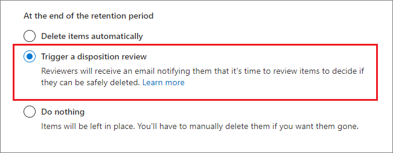
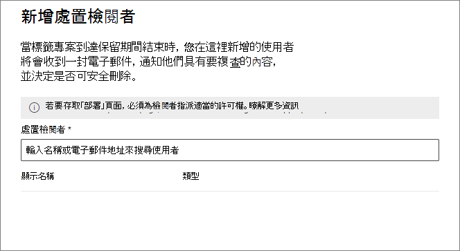
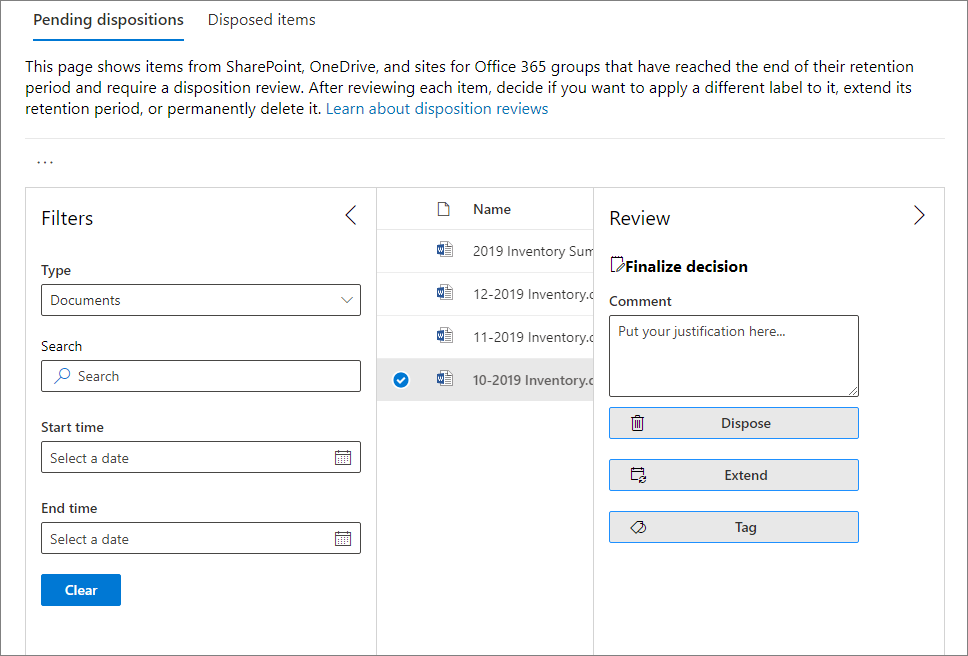
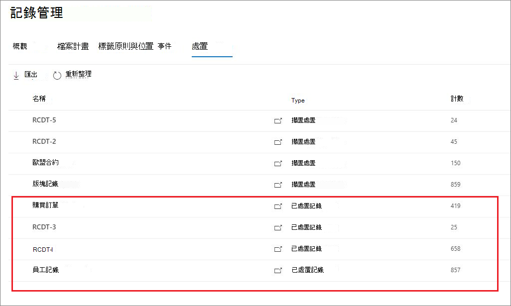
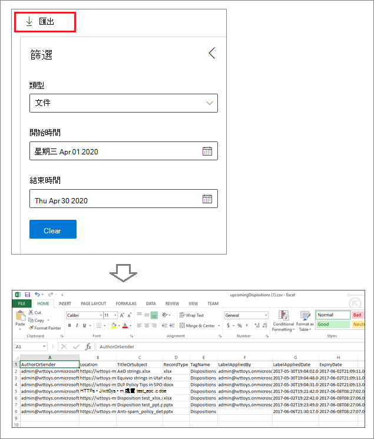

# 內容處置

>*[Microsoft 365 安全性與合規性的授權指引](https://aka.ms/ComplianceSD)。*

使用 Microsoft 365 合規性中心 **[記錄管理]** 中的 **[處置]** 索引標籤來管理處置檢閱，並檢視在其保留期間結束時自動刪除的 [記錄](records-management.md#records)。 

## 檢視內容處置的先決條件

若要管理處置檢閱並確認記錄已刪除，您必須具備足夠的權限，而且必須啟用審核。

### 處置的權限

若要在 Microsoft 365 合規性中心中成功存取 **[處置]** 索引標籤，使用者必須具備 **[處置管理]** 系統管理員角色。 從 2020 年 12 月起，此角色現在包含在 **[記錄管理]** 預設系統管理員角色群組中。

> [!NOTE]
> 預設情况下，全域系統管理員不被授與 **[處置管理]** 角色。 

若要僅授與使用者進行處置檢閲所需的權限，而不授與其檢視和設定其他保留和記錄管理功能的權限，請建立一個自訂角色群組 (例如，名為 [處置檢閲者]) 並向該組授與 [處置管理角色]。

此外，要在處置程序中檢視項目的內容，請將使用者新增到以下兩個角色群組：**[內容總管內容檢視器]** 和 **[內容總管清單檢視器]**。 如果使用者沒有這些角色群組的存取權限，他們仍然可以選取處置檢閱動作來完成處置檢閲，但不能從合規性中心檢視項目的內容。

如需設定這些權限的相關指示，請參閱[讓使用者能夠存取 Office 365 安全規範中心](../security/office-365-security/grant-access-to-the-security-and-compliance-center.md)。

### 啟用稽核

請確認至少在第一個處置動作進行的前一天啟用稽核。 如需詳細資訊，請參閱[在 Office 365 安全性與合規性中心搜尋稽核記錄](search-the-audit-log-in-security-and-compliance.md)。 

## 處置檢閱

當內容的保留期間結束時，基於多種原因，您可能會想要檢閱該內容以決定是否可以安全刪除 (亦即「處置」)。 例如，您可能會需要：
  
- 如果發生訴訟或稽核，則暫停相關內容的刪除。
    
- 如果內容具有研究或歷史價值，將內容從處置清單中移除，以儲存在封存中。
    
- 為內容指派不同的保留期間，可能是因為原始保留設定是暫時或臨時解決方案。
    
- 將內容送交回客戶或轉移至其他組織。

在保留期間結束後觸發處置檢閱時：
  
- 您選擇的人員會收到一封電子郵件，通知他們有內容需檢閱。 這些檢閱者可以是個別使用者，或擁有郵件功能的安全性群組。 請注意，通知是每週發送一次。
    
- 檢閱者移至 Microsoft 365 合規性中心的 **[處置]** 索引標籤，以檢閱內容並決定是否要永久刪除內容、延長其保留期間或套用其他保留標籤。

處置檢閱可以包括 Exchange 信箱、SharePoint 網站、OneDrive 帳戶和 Microsoft 365 群組中的內容。 只有在檢閱者選擇永久刪除內容之後，才會刪除在這些位置等待處置檢閱的內容。

> [!NOTE]
> 信箱必須至少具有 10 MB 的資料才能支援處置檢閱。

您可以在 **[概觀]** 索引標籤中檢閱所有擱置中的處置概觀。例如：

![[記錄管理] 概觀中擱置中的處置](../media/dispositions-overview.png)

當您選取 **[檢視所有擱置中的處置]**，您將移至 **[處置]** 頁面。 例如：

![Microsoft 365 合規性中心的 [處置] 頁面](../media/disposition-tab.png)

### 處置檢閱的工作流程

下圖顯示使用者在發佈保留標籤並手動套用之後，處置檢閱的基本工作流程。 或者，可以將設定用於處置檢閱的保留標籤自動套用到內容。
  

  
在保留期間結束時觸發處置檢閱是一個設定選項，僅搭配保留標籤使用。 保留原則無法使用此選項。 如需有關這兩個保留解決方案的詳細資訊，請參閱[瞭解保留原則和保留標籤](retention.md)。

保留標籤的 **[定義保留設定]** 頁面：

 
選取此 **[觸發處置檢閱]** 選項後，您可以在精靈的下一頁指定處置檢閱者：

針對檢閱者，請指定使用者或擁有郵件功能的安全性群組。 此選項不支援 Microsoft 365 群組 ([之前稱為 Office 365 群組](https://techcommunity.microsoft.com/t5/microsoft-365-blog/office-365-groups-will-become-microsoft-365-groups/ba-p/1303601))。

### 檢視和處置內容

當檢閱者收到電子郵件通知內容可供檢閱時，他們會前往 Microsoft 365 合規性中心內，**[記錄管理]** 中的 **[處置]** 索引標籤。 檢閱者可以看到每個保留標籤有多少項目正在等待處置，然後選取某個保留標籤可查看帶有該標籤的所有內容。

選取保留標籤後，您可以從 **[擱置中的處置]** 索引標籤中查看該標籤的所有擱置中的處置。選取一個或多個項目，然後可以選擇一個動作並輸入理由註解：

如圖所見，支援的動作如下： 
  
- 永久刪除項目
- 延長保留期間
- 套用不同的保留標籤

如果您具有位置和內容的權限，則可以使用 **[位置]** 欄中的連結在文件的原始位置檢視文件。 在處置檢閱期間，內容永遠不會從其原始位置移動，且除非檢閱者選擇刪除內容，否則內容絕不會被刪除。

每週一次自動傳送電子郵件通知給檢閱者。 此排程程序表示，當內容的保留期間結束時，檢閱者最多可能需要 7 天才能收到內容正等待處置的電子郵件通知。
  
可以稽核所有處置動作，而檢閱者輸入的理由文字也將儲存並顯示於 **[已處置項目]** 頁面上的 **[註解]** 欄中。
  
### 多久會永久刪除處置的內容

只有在檢閱者選擇永久刪除內容之後，才會刪除等待處置檢閱的內容。 當檢閱者選擇此選項時，SharePoint 網站或 OneDrive 帳戶中的內容就會符合[保留設定如何與就地內容搭配使用](retention.md#how-retention-settings-work-with-content-in-place)所述的標準清理程序。

## 記錄處置

使用 **[記錄管理]** 頁面中的 **[處置]** 索引標籤，以找出現在已自動刪除，或在處置檢閱之後刪除的記錄。 這些項目會在 **[類型]** 欄中顯示 **[記錄已處置]**。 例如：

記錄標籤的 **[已處置項目]** 索引標籤中顯示的項目在處置後最多可保存七年，在此期間，每個記錄限制保存一百萬個項目。 如果您看到 **[計數]** 數字接近上限一百萬，而且您需要記錄的處置證明，請與 [Microsoft 支援服務](https://docs.microsoft.com/office365/admin/contact-support-for-business-products)聯繫。

> [!NOTE]
> 此功能基於來自[整合稽核記錄](search-the-audit-log-in-security-and-compliance.md)的資訊，因此需要[啟用並搜尋](turn-audit-log-search-on-or-off.md)稽核，以便擷取相應的事件。

若要進行稽核，請在 **[檔案和頁面活動]** 類別中搜尋 **[標示為記錄的已刪除檔案]**。 此稽核事件適用於文件和電子郵件。

## 篩選及匯出檢視

當您從 **[處置]** 頁面選取保留標籤時，**[擱置中的處置]** 索引標籤 (如果適用) 和 **[已處置的項目]** 索引標籤可讓您篩選檢視，以協助您更輕鬆地找到項目。 

針對擱置中的處置，時間範圍根據到期日而定。 針對已處置的項目，時間範圍根據刪除日而定。
  
您可以將其中一個檢視的項目資訊匯出為 .csv 檔案，然後使用 Excel 排序和管理：

