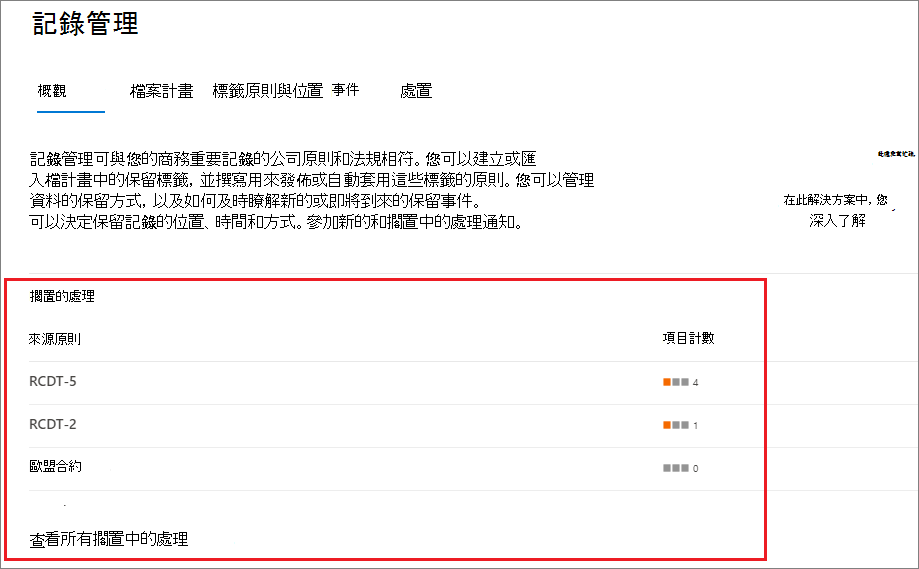

# 內容處置Disposition of content

>*[Microsoft 365 安全性與合規性的授權指引](https://aka.ms/ComplianceSD)。**[Microsoft 365 licensing guidance for security & compliance](https://aka.ms/ComplianceSD).*

使用 Microsoft 365 規範中心內的**記錄管理**中的 [**部署**] 索引標籤，管理處置檢查，並查看在保留期間結束時自動刪除的[記錄](records-management.md#records)。Use the **Disposition** tab from **Records Management** in the Microsoft 365 compliance center to manage disposition reviews and view [records](records-management.md#records) that have been automatically deleted at the end of their retention period. 

## 查看內容處置的必要條件Prerequisites for viewing content dispositions

若要管理處置檢查，並確認已刪除記錄，您必須啟用足夠的許可權和審核。To manage disposition reviews and confirm that records have been deleted, you must have sufficient permissions and auditing must be enabled.

### 進行處置的許可權Permissions for disposition

若要在 Microsoft 365 規範中心中成功存取「 **處置** 」索引標籤，使用者必須具有「處理 **管理** 」管理角色。To successfully access the **Disposition** tab in the Microsoft 365 compliance center, users must have the **Disposition Management** admin role. 此角色包含在預設的系統管理員角色群組中（ **合規性管理員** 和 **合規性資料管理員**）。This role is included in the default admin role groups, **Compliance Administrator** and **Compliance Data Administrator**.

若要授與使用者這項必要的處理管理角色，請將其新增至其中一個預設角色群組，或建立自訂角色群組 (例如，名稱為「處置檢閱者」 ) 並授與此群組為「處置管理」角色。To grant users this required Disposition Management role, either add them to one of these default role groups, or create a custom role group (for example, named "Disposition Reviewers") and grant this group the Disposition Management role.  

> [!NOTE]
> 即使全域管理員也必須授與 **處置管理** 角色。Even a global admin needs to be granted the **Disposition Management** role. 

如需相關指示，請參閱[讓使用者能夠存取 Office 365 安全規範中心](../security/office-365-security/grant-access-to-the-security-and-compliance-center.md)。For instructions, see [Give users access to the Office 365 Security & Compliance Center](../security/office-365-security/grant-access-to-the-security-and-compliance-center.md).

### 啟用審核Enable auditing

請確定已在第一次處理動作之前，至少啟用一天的審計。Make sure that auditing is enabled at least one day before the first disposition action. 如需詳細資訊，請參閱在 [Office 365 安全性與 &amp; 合規性中心搜尋審核記錄](search-the-audit-log-in-security-and-compliance.md)檔。For more information, see [Search the audit log in the Office 365 Security &amp; Compliance Center](search-the-audit-log-in-security-and-compliance.md). 

## 處置檢閱Disposition reviews

當內容到達保留期間結束時，可能會有幾個原因會讓您檢查內容，以決定是否可以安全地刪除 ( 「已處置」 ) 。When content reaches the end of its retention period, there are several reasons why you might want to review that content to decide whether it can be safely deleted ("disposed"). 例如，您可能需要：For example, you might need to:
  
- 在訴訟或審計事件中，封存相關內容的刪除。Suspend the deletion of relevant content in the event of litigation or an audit.
    
- 若內容有調研或歷史值，請將內容從處置清單中移除儲存在封存中。Remove content from the disposition list to store in an archive, if that content has research or historical value.
    
- 將不同的保留期間指派給內容，這可能是因為原始保留設定為暫時或臨時的解決方案。Assign a different retention period to the content, perhaps because the original retention settings were a temporary or provisional solution.
    
- 將內容傳回給用戶端或轉接至另一個組織。Return the content to clients or transfer it to another organization.

在保留期間結束時，會觸發處置檢查：When a disposition review is triggered at the end of the retention period:
  
- 您選擇的人員會收到電子郵件通知，告知他們具有要審閱的內容。The people you choose receive an email notification that they have content to review. 這些檢閱者可以是個別的使用者或擁有郵件功能的安全性群組。These reviewers can be individual users or mail-enabled security groups. 請注意，每週會傳送通知。Note that notifications are sent on a weekly basis.
    
- 檢閱者會移至 Microsoft 365 合規性中心的「 **處置** 」索引標籤，以查看內容，並決定是否要永久刪除、擴充保留期間或套用其他保留標籤。The reviewers go to the **Disposition** tab in the Microsoft 365 compliance center to review the content and decide whether to permanently delete it, extend its retention period, or apply a different retention label.

處置評審可將內容包含在 Exchange 信箱、SharePoint 網站、OneDrive 帳戶和 Microsoft 365 群組中。A disposition review can include content in Exchange mailboxes, SharePoint sites, OneDrive accounts, and Microsoft 365 groups. 只有在檢閱者選擇永久刪除內容之後，才會刪除等候在這些位置中進行處置檢查的內容。Content awaiting a disposition review in those locations is deleted only after a reviewer chooses to permanently delete the content.

> [!NOTE]
> 信箱至少必須有 10 MB 的資料，才可支援處理審閱。A mailbox must have at least 10 MB data to support disposition reviews.

您可以在 [ **概覽** ] 索引標籤中看到所有擱置的處理的概覽。例如：You can see an overview of all pending dispositions in the **Overview** tab. For example:

當您選取 [ **查看所有擱置**中的處理] 時，就會移至 [ **部署** ] 頁面。When you select the **View all pending dispositions**, you're taken to the **Disposition** page. 例如：For example:

### 用於處置評審的工作流程Workflow for a disposition review

下圖顯示保留標籤發佈後，使用者手動套用的處理審閱基本工作流程。The following diagram shows the basic workflow for a disposition review when a retention label is published and then manually applied by a user. 或者，設定用於處置檢查的保留標籤，會自動套用至內容。Alternatively, a retention label configured for a disposition review can be auto-applied to content.
  

  
在保留期間結束處置檢查時，只會有保留標籤的設定選項。Triggering a disposition review at the end of the retention period is a configuration option that's available only with a retention label. 保留原則無法使用此選項。This option is not available for a retention policy. 如需這兩個保留解決方案的詳細資訊，請參閱 [瞭解保留原則和保留標籤](retention.md)。For more information about these two retention solutions, see [Learn about retention policies and retention labels](retention.md).
  

 
> [!NOTE]
> 當您選取 [選項] 時，當 **有可供查看的專案時通知**使用者，請指定使用者或擁有郵件功能的安全性群組。When you select the option **Notify these people when there are items ready to review**, specify a user or mail-enabled security group. 此選項不支援 Microsoft 365 群組 ([先前的 Office 365 群組](https://techcommunity.microsoft.com/t5/microsoft-365-blog/office-365-groups-will-become-microsoft-365-groups/ba-p/1303601)) 。Microsoft 365 groups ([formerly Office 365 groups](https://techcommunity.microsoft.com/t5/microsoft-365-blog/office-365-groups-will-become-microsoft-365-groups/ba-p/1303601)) are not supported for this option.

### 內容的查看與處置Viewing and disposing of content

當檢閱者透過電子郵件通知出內容可供審閱時，他們會從 Microsoft 365 規範中心的**記錄管理**移至 [**處置**] 索引標籤。When a reviewer is notified by email that content is ready to review, they go to the **Disposition** tab from **Records Management** in the Microsoft 365 compliance center. 檢閱者可以查看每個保留標籤的專案數目等候處理，然後選取保留標籤以查看具有該標籤的所有內容。The reviewers can see how many items for each retention label are awaiting disposition, and then select a retention label to see all content with that label.

選取保留標籤之後，您就會看到 [ **擱置的部署** ] 索引標籤中該標籤的所有擱置中的處理。選取一個或多個專案，您可以在其中選擇動作並輸入對齊批註：After you select a retention label, you then see all pending dispositions for that label from the **Pending disposition** tab. Select one or more items where you can then choose an action and enter a justification comment:

您可以從圖片看到，支援的動作如下：As you can see from the picture, the actions supported are: 
  
- 永久刪除專案Permanently delete the item
- 延長保留期間Extend the retention period
- 套用其他保留標籤Apply a different retention label

提供您具有位置和內容的許可權，您可以使用 [ **位置** ] 欄中的連結，以查看其原始位置中的檔。Providing you have permissions to the location and the content, you can use the link in the **Location** column to view documents in their original location. 在處置檢查期間，內容永遠不會從其原始位置移動，永遠不會刪除，除非檢閱者選擇這麼做。During a disposition review, the content never moves from its original location, and it's never deleted until the reviewer chooses to do so.

電子郵件通知會以每週為單位自動傳送給檢閱者。The email notifications are sent automatically to reviewers on a weekly basis. 此排定的程式表示當內容到達其保留期間結束時，最多可能需要7天的時間，檢閱者收到內容正等待處置的電子郵件通知。This scheduled process means that when content reaches the end of its retention period, it might take up to seven days for reviewers to receive the email notification that content is awaiting disposition.
  
所有的處理動作都可以經過審核，而且檢閱者所輸入的調整文字會儲存並顯示在 [已**釋放的專案**] 頁面上的 [**批註**] 欄中。All disposition actions can be audited and the justification text entered by the reviewer is saved and displayed in the **Comment** column on the **Disposed items** page.
  
### 永久刪除處置內容之前的時間How long until disposed content is permanently deleted

只有在檢閱者選擇永久刪除內容之後，才會刪除等候進行處置檢查的內容。Content awaiting a disposition review is deleted only after a reviewer chooses to permanently delete the content. 當檢閱者選擇此選項時，SharePoint 網站或 OneDrive 帳戶中的內容，就會符合 [保留設定如何使用內容就地運作](retention.md#how-retention-settings-work-with-content-in-place)所述的標準清理程式。When the reviewer chooses this option, the content in the SharePoint site or OneDrive account becomes eligible for the standard cleanup process described in [How retention settings work with content in place](retention.md#how-retention-settings-work-with-content-in-place).

## 記錄處置Disposition of records

使用 [**記錄管理**] 頁面中的 [**部署**] 索引標籤，識別現在已刪除的記錄（自動或在處置檢查之後）。Use the **Disposition** tab from the **Records Management** page to identify records that are now deleted, either automatically or after a disposition review. 這些專案會在 [**類型**] 欄中顯示已**處置的記錄**。These items display **Records Disposed** in the **Type** column. 例如：For example:

已釋放的 [ **專案** ] 索引標籤中的記錄標籤所顯示的專案，在專案被處置後，最多可保留7年，每筆記錄的每一筆記錄的限制為1000000個專案。Items that are shown in the **Disposed Items** tab for record labels are kept for up to seven years after the item was disposed, with a limit of one million items per record for that period. 如果您看到的 **計數** 值接近此限制1000000，而您需要為記錄進行處置，請與 [Microsoft 支援](https://docs.microsoft.com/office365/admin/contact-support-for-business-products)人員聯繫。If you see the **Count** number nearing this limit of one million, and you need proof of disposition for your records, contact [Microsoft Support](https://docs.microsoft.com/office365/admin/contact-support-for-business-products).

> [!NOTE]
> 這種功能是以 [整合的審計記錄](search-the-audit-log-in-security-and-compliance.md) 資訊為基礎，因此需要 [啟用並](turn-audit-log-search-on-or-off.md) 可搜尋審計，以便捕獲對應的事件。This functionality is based on information from the [unified audit log](search-the-audit-log-in-security-and-compliance.md) and therefore requires auditing to be [enabled and searchable](turn-audit-log-search-on-or-off.md) so the corresponding events are captured.
    
## 篩選和匯出視圖Filter and export the views

當您從 [ **處置** ] 頁面中選取保留標籤時，[ **擱置的處理** ] 索引標籤 (（如果適用）) 和 [已 **釋放的專案** ] 索引標籤可讓您篩選視圖，以協助您更輕鬆找到When you select a retention label from the **Disposition** page, the **Pending disposition** tab (if applicable) and the **Disposed items** tab let you filter the views to help you more easily find items. 

針對暫止的處理，時間範圍是以到期日為基礎。For pending dispositions, the time range is based on the expiration date. 若為已處置的專案，時間範圍會根據刪除日期。For disposed items, the time range is based on the deletion date.
  
您可以將上述專案的相關資訊匯出為 .csv 檔案，然後您就可以使用 Excel 進行排序和管理：You can export information about the items in either view as a .csv file that you can then sort and manage using Excel:

  

