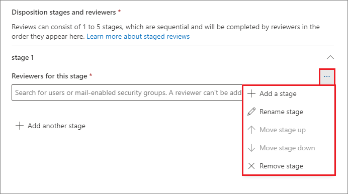

# <a name="disposition-of-content"></a><span data-ttu-id="f59b8-103">內容處置</span><span class="sxs-lookup"><span data-stu-id="f59b8-103">Disposition of content</span></span>

><span data-ttu-id="f59b8-104">*[Microsoft 365 安全性與合規性的授權指引](/office365/servicedescriptions/microsoft-365-service-descriptions/microsoft-365-tenantlevel-services-licensing-guidance/microsoft-365-security-compliance-licensing-guidance)。*</span><span class="sxs-lookup"><span data-stu-id="f59b8-104">*[Microsoft 365 licensing guidance for security & compliance](/office365/servicedescriptions/microsoft-365-service-descriptions/microsoft-365-tenantlevel-services-licensing-guidance/microsoft-365-security-compliance-licensing-guidance).*</span></span>

<span data-ttu-id="f59b8-105">使用 Microsoft 365 合規性中心 [記錄管理]\*\*\*\* 中的 [處置]\*\*\*\* 頁面來管理處置檢閱，並檢視在其保留期間結束時自動刪除的[記錄](records-management.md#records)中繼資料。</span><span class="sxs-lookup"><span data-stu-id="f59b8-105">Use the **Disposition** page from **Records Management** in the Microsoft 365 compliance center to manage disposition reviews and view the metadata of [records](records-management.md#records) that have been automatically deleted at the end of their retention period.</span></span>

> [!NOTE]
> <span data-ttu-id="f59b8-106">在預覽中推出: **多階段處置檢閱**</span><span class="sxs-lookup"><span data-stu-id="f59b8-106">Rolling out in preview: **multi-stage disposition review**</span></span>
> 
> <span data-ttu-id="f59b8-107">系統管理員現在可以在保留標籤中新增最多五個連續的處置檢閱階段，且檢閱者可將其他使用者新增到他們的處置檢閱階段。</span><span class="sxs-lookup"><span data-stu-id="f59b8-107">An administrator can now add up to five consecutive stages of disposition review in a retention label, and reviewers can add others users to their disposition review stage.</span></span> <span data-ttu-id="f59b8-108">您也可以自訂電子郵件通知和提醒。</span><span class="sxs-lookup"><span data-stu-id="f59b8-108">You can also customize the email notifications and reminders.</span></span> <span data-ttu-id="f59b8-109">下列各節提供有關此預覽中變更的詳細資訊。</span><span class="sxs-lookup"><span data-stu-id="f59b8-109">The following sections have more information about the changes in this preview.</span></span>

## <a name="prerequisites-for-viewing-content-dispositions"></a><span data-ttu-id="f59b8-110">檢視內容處置的先決條件</span><span class="sxs-lookup"><span data-stu-id="f59b8-110">Prerequisites for viewing content dispositions</span></span>

<span data-ttu-id="f59b8-111">若要管理處置檢閱並確認記錄已刪除，您必須具備足夠的權限，而且必須啟用審核。</span><span class="sxs-lookup"><span data-stu-id="f59b8-111">To manage disposition reviews and confirm that records have been deleted, you must have sufficient permissions and auditing must be enabled.</span></span>

### <a name="permissions-for-disposition"></a><span data-ttu-id="f59b8-112">處置的權限</span><span class="sxs-lookup"><span data-stu-id="f59b8-112">Permissions for disposition</span></span>

<span data-ttu-id="f59b8-113">若要在 Microsoft 365 合規性中心中成功存取 [處置 **]** 索引標籤，使用者必須具備 [處置管理 **]** 的角色。</span><span class="sxs-lookup"><span data-stu-id="f59b8-113">To successfully access the **Disposition** tab in the Microsoft 365 compliance center, users must have the **Disposition Management** role.</span></span> <span data-ttu-id="f59b8-114">從 2020 年 12 月起，此角色現在包含在 [記錄管理 **]** 預設角色群組中。</span><span class="sxs-lookup"><span data-stu-id="f59b8-114">From December 2020, this role is now included in the **Records Management** default role group.</span></span>

> [!NOTE]
> <span data-ttu-id="f59b8-115">預設情况下，並不會授與全域系統管理員 [處置管理 **]** 角色。</span><span class="sxs-lookup"><span data-stu-id="f59b8-115">By default, a global admin isn't granted the **Disposition Management** role.</span></span> 

<span data-ttu-id="f59b8-116">若要僅授與使用者進行處置檢閲所需的權限，而不授與其檢視和設定其他保留和記錄管理功能的權限，請建立一個自訂角色群組 (例如，名為 [處置檢閲者]) 並向該組授與 [處置管理 **]** 角色。</span><span class="sxs-lookup"><span data-stu-id="f59b8-116">To grant users just the permissions they need for disposition reviews without granting them permissions to view and configure other features for retention and records management, create a custom role group (for example, named "Disposition Reviewers") and grant this group the **Disposition Management** role.</span></span>

<span data-ttu-id="f59b8-117">如需設定這些權限的相關指示，請參閱[讓使用者能夠存取 Office 365 安全性與合規性中心](../security/office-365-security/grant-access-to-the-security-and-compliance-center.md) (部分機器翻譯)。</span><span class="sxs-lookup"><span data-stu-id="f59b8-117">For instructions to configure these permissions, see [Give users access to the Office 365 Security & Compliance Center](../security/office-365-security/grant-access-to-the-security-and-compliance-center.md).</span></span>

<span data-ttu-id="f59b8-118">此外：</span><span class="sxs-lookup"><span data-stu-id="f59b8-118">Additionally:</span></span>

- <span data-ttu-id="f59b8-119">若要在處置流程期間檢視項目的內容，請將使用者新增到 [內容總管內容檢視器 **]** 角色群組。</span><span class="sxs-lookup"><span data-stu-id="f59b8-119">To view the contents of items during the disposition process, add users to the **Content Explorer Content Viewer** role group.</span></span> <span data-ttu-id="f59b8-120">如果使用者沒有這角色群組的權限，他們仍然可以選取處置檢閱動作來完成處置檢閲，但不能從合規性中心的迷你預覽窗格檢視項目的內容。</span><span class="sxs-lookup"><span data-stu-id="f59b8-120">If users don't have the permissions from this role group, they can still select a disposition review action to complete the disposition review, but must do so without being able to view the item's contents from the mini-preview pane in the compliance center.</span></span>

- <span data-ttu-id="f59b8-121">預覽階段：根據預設，每個存取 [處置 **]** 頁面的人員只會看到指派給他們檢閱的項目。</span><span class="sxs-lookup"><span data-stu-id="f59b8-121">In preview: By default, each person that accesses the **Disposition** page sees only items that they are assigned to review.</span></span> <span data-ttu-id="f59b8-122">如需讓記錄管理系統管理員查看指派給所有使用者的所有項目，以及查看設定用於處置檢閱的所有保留標籤：請瀏覽 [記錄管理設定 **]** > **[一般]** > **[記錄管理員安全性群組]** 加以選取，然後啟用包含系統管理員帳戶之擁有郵件功能的安全性群組。</span><span class="sxs-lookup"><span data-stu-id="f59b8-122">For a records management administrator to see all items assigned to all users, and all retention labels that are configured for disposition review: Navigate to **Records management settings** > **General** > **Record Manager Security Group** to select and then enable a mail-enabled security group that contains the administrator accounts.</span></span>
    
    <span data-ttu-id="f59b8-123">未擁有郵件功能的 Microsoft 365 群組和安全性群組不支援此功能，且無法顯示在要選取的清單中。</span><span class="sxs-lookup"><span data-stu-id="f59b8-123">Microsoft 365 groups and security groups that aren't mail-enabled doesn't support this feature and wouldn't be displayed in the list to select.</span></span> <span data-ttu-id="f59b8-124">如果需要建立全新擁有郵件功能的安全性群組，請使用前往 Microsoft 365 系統管理中心的連結來建立新群組。</span><span class="sxs-lookup"><span data-stu-id="f59b8-124">If you need to create a new mail-enabled security group, use the link to the Microsoft 365 admin center to create the new group.</span></span> 
    
    > [!IMPORTANT]
    > <span data-ttu-id="f59b8-125">您無法停用此權限，或取代已從合規性中心啟用的群組。</span><span class="sxs-lookup"><span data-stu-id="f59b8-125">You can't disable this permission or replace the group that you enabled from the compliance center.</span></span> <span data-ttu-id="f59b8-126">不過，您可以使用 [Enable-ComplianceTagStorage](/powershell/module/exchange/enable-compliancetagstorage) Cmdlet 啟用另一個擁有郵件功能的安全性群組。</span><span class="sxs-lookup"><span data-stu-id="f59b8-126">However, you can enable another mail-enabled security group by using the [Enable-ComplianceTagStorage](/powershell/module/exchange/enable-compliancetagstorage) cmdlet.</span></span>
    > 
    > <span data-ttu-id="f59b8-127">例如：`Enable-ComplianceTagStorage -RecordsManagementSecurityGroupEmail dispositionreviewers@contosoi.com`</span><span class="sxs-lookup"><span data-stu-id="f59b8-127">For example: `Enable-ComplianceTagStorage -RecordsManagementSecurityGroupEmail dispositionreviewers@contosoi.com`</span></span>

- <span data-ttu-id="f59b8-128">預覽階段：只有記錄管理系統管理員可看到 [記錄管理設定 **]** 選項。</span><span class="sxs-lookup"><span data-stu-id="f59b8-128">In preview: The **Records management settings** option is visible only to record management administrators.</span></span> 

### <a name="enable-auditing"></a><span data-ttu-id="f59b8-129">啟用稽核</span><span class="sxs-lookup"><span data-stu-id="f59b8-129">Enable auditing</span></span>

<span data-ttu-id="f59b8-130">請確認至少在第一個處置動作進行的前一天啟用稽核。</span><span class="sxs-lookup"><span data-stu-id="f59b8-130">Make sure that auditing is enabled at least one day before the first disposition action.</span></span> <span data-ttu-id="f59b8-131">如需詳細資訊，請參閱[在 Office 365 安全性與合規性中心搜尋稽核記錄](search-the-audit-log-in-security-and-compliance.md)。</span><span class="sxs-lookup"><span data-stu-id="f59b8-131">For more information, see [Search the audit log in the Office 365 Security &amp; Compliance Center](search-the-audit-log-in-security-and-compliance.md).</span></span> 

## <a name="disposition-reviews"></a><span data-ttu-id="f59b8-132">處置檢閱</span><span class="sxs-lookup"><span data-stu-id="f59b8-132">Disposition reviews</span></span>

<span data-ttu-id="f59b8-p108">當內容的保留期間結束時，基於多種原因，您可能會想要檢閱該內容，以確認是否可以永久刪除 (亦即「處置」)。例如，如果不刪除內容，您可以能需要：</span><span class="sxs-lookup"><span data-stu-id="f59b8-p108">When content reaches the end of its retention period, there are several reasons why you might want to review that content and confirm whether it can be permanently deleted ("disposed"). For example, instead of deleting the content, you might need to:</span></span>
  
- <span data-ttu-id="f59b8-135">由於訴訟或稽核而暫止相關內容的刪除。</span><span class="sxs-lookup"><span data-stu-id="f59b8-135">Suspend the deletion of relevant content for litigation or an audit.</span></span>

- <span data-ttu-id="f59b8-136">為內容指派不同的保留期間，可能是因為原始保留設定是暫時或臨時解決方案。</span><span class="sxs-lookup"><span data-stu-id="f59b8-136">Assign a different retention period to the content, perhaps because the original retention settings were a temporary or provisional solution.</span></span>

- <span data-ttu-id="f59b8-137">例如，如果內容具有研究或歷史價值，則從內容的現有位置移至封存位置。</span><span class="sxs-lookup"><span data-stu-id="f59b8-137">Move the content from its existing location to an archive location, for example, if that content has research or historical value.</span></span>

<span data-ttu-id="f59b8-138">在保留期間結束後觸發處置檢閱時：</span><span class="sxs-lookup"><span data-stu-id="f59b8-138">When a disposition review is triggered at the end of the retention period:</span></span>
  
- <span data-ttu-id="f59b8-139">您選擇的檢閱者會收到一封電子郵件，通知他們有內容需檢閱。</span><span class="sxs-lookup"><span data-stu-id="f59b8-139">The reviewers you choose receive an email notification that they have content to review.</span></span> <span data-ttu-id="f59b8-140">這些檢閱者可以是個別使用者，或擁有郵件功能的安全性群組。</span><span class="sxs-lookup"><span data-stu-id="f59b8-140">These reviewers can be individual users or mail-enabled security groups.</span></span> <span data-ttu-id="f59b8-141">預覽階段的新功能：</span><span class="sxs-lookup"><span data-stu-id="f59b8-141">New in preview:</span></span>
   - <span data-ttu-id="f59b8-142">您可以自訂他們收到的電子郵件，包括不同語言的指示。</span><span class="sxs-lookup"><span data-stu-id="f59b8-142">You can customize the email that they receive, including instructions in different languages.</span></span> <span data-ttu-id="f59b8-143">適用於多語言支援，您必須自己指定翻譯，且此自訂文字會顯示給所有檢閱者，無論其所在地區設定為何。</span><span class="sxs-lookup"><span data-stu-id="f59b8-143">For multi-language support, you must specify the translations yourself and this custom text is displayed to all reviewers irrespective of their locale.</span></span>
   - <span data-ttu-id="f59b8-144">使用者會於項目的保留期間結束時，收到每個標籤的初始電子郵件通知，且使用者會收到所有獲指派處置檢閱之每個標籤的每週一次提醒。</span><span class="sxs-lookup"><span data-stu-id="f59b8-144">Users receive an initial email notification per label at the end of the item's retention period, with a reminder per label once a week of all disposition reviews that they are assigned.</span></span> <span data-ttu-id="f59b8-145">他們可以按一下通知和提醒電子郵件中的連結，以前往 Microsoft 365 合規性中心的 [處置 **]** 頁面，以檢閱內容並採取行動。</span><span class="sxs-lookup"><span data-stu-id="f59b8-145">They can click the link in the notification and reminder emails to go to the **Disposition** page in the Microsoft 365 compliance center to review the content and take an action.</span></span> <span data-ttu-id="f59b8-146">檢閱者或也可以直接前往合規性中心的 [處置 **]** 頁面。</span><span class="sxs-lookup"><span data-stu-id="f59b8-146">Alternately, the reviewers can go directly to the **Disposition** page in the compliance center.</span></span>
   - <span data-ttu-id="f59b8-147">檢閱者只會看到指派給他們的處置檢閱，然而新加入選取 [記錄管理員安全性群組] 的系統管理員則會看到所有的處置檢閱。</span><span class="sxs-lookup"><span data-stu-id="f59b8-147">Reviewers see only the disposition reviews that are assigned to them, whereas administrators who are added to the selected Record Manager Security Group see all disposition reviews.</span></span>
   - <span data-ttu-id="f59b8-148">檢閱者可將新使用者新增到相同的處置檢閱。</span><span class="sxs-lookup"><span data-stu-id="f59b8-148">Reviewers can add new users to the same disposition review.</span></span> <span data-ttu-id="f59b8-149">目前，此動作不會自動為這些新增的使用者授與 [所需權限](#permissions-for-disposition)。</span><span class="sxs-lookup"><span data-stu-id="f59b8-149">Currently, this action doesn't automatically grant these added users the [required permissions](#permissions-for-disposition).</span></span>
   - <span data-ttu-id="f59b8-150">而在處置檢閱流程中，每個項目的迷你檢閱窗格會顯示內容預覽 (如果他們有查看該內容的權限)。</span><span class="sxs-lookup"><span data-stu-id="f59b8-150">For the disposition review process, a mini-review pane for each item shows a preview of the content if they have permissions to see it.</span></span> <span data-ttu-id="f59b8-151">如果他們沒有權限，則可選取內容連結並要求權限。</span><span class="sxs-lookup"><span data-stu-id="f59b8-151">If they don't have permissions, they can select the content link and request permissions.</span></span> <span data-ttu-id="f59b8-152">此迷你檢閱窗格也有內容相關之其他資訊的索引標籤：</span><span class="sxs-lookup"><span data-stu-id="f59b8-152">This mini-review pane also has tabs for additional information about the content:</span></span>
       - <span data-ttu-id="f59b8-153">[詳細資料 **]** 用來顯示具索引的內容、其位置地點、建立者及時間，以及上次修改者及修改時間。</span><span class="sxs-lookup"><span data-stu-id="f59b8-153">**Details** to display indexed properties, where it's located, who created it and when, and who last modified it and when.</span></span>
       - <span data-ttu-id="f59b8-154">[歷程記錄 **]** 用來顯示到目前為止任何處置檢閱動作的歷程記錄，以及檢閱者註解 (如果有)。</span><span class="sxs-lookup"><span data-stu-id="f59b8-154">**History** that shows the history of any disposition review actions to date, with reviewer comments if available.</span></span>

<span data-ttu-id="f59b8-155">處置檢閱可包括 Exchange 信箱、SharePoint 網站以及 OneDrive 帳戶中的內容。</span><span class="sxs-lookup"><span data-stu-id="f59b8-155">A disposition review can include content in Exchange mailboxes, SharePoint sites, and OneDrive accounts.</span></span> <span data-ttu-id="f59b8-156">只有在位於處置最後階段的檢閱者選擇永久刪除內容之後，才會永久刪除在這些位置等待處置檢閱的內容。</span><span class="sxs-lookup"><span data-stu-id="f59b8-156">Content pending a disposition review in those locations is permanently deleted only after a reviewer for the final stage of disposition chooses to permanently delete the content.</span></span>

> [!NOTE]
> <span data-ttu-id="f59b8-157">信箱必須至少具有 10 MB 的資料才能支援處置檢閱。</span><span class="sxs-lookup"><span data-stu-id="f59b8-157">A mailbox must have at least 10 MB data to support disposition reviews.</span></span>

<span data-ttu-id="f59b8-158">系統管理員可以在 [概觀 **]** 索引標籤中查看所有擱置處置的概觀。檢閱者只會看到他們的項目擱置處置。</span><span class="sxs-lookup"><span data-stu-id="f59b8-158">Administrators can see an overview of all pending dispositions in the **Overview** tab. Reviewers see only their items pending disposition.</span></span> <span data-ttu-id="f59b8-159">例如：</span><span class="sxs-lookup"><span data-stu-id="f59b8-159">For example:</span></span>

![[記錄管理] 概觀中擱置中的處置](../media/dispositions-overview.png)

<span data-ttu-id="f59b8-161">當您選取 **[檢視所有擱置中的處置]**，您將移至 **[處置]** 頁面。</span><span class="sxs-lookup"><span data-stu-id="f59b8-161">When you select the **View all pending dispositions**, you're taken to the **Disposition** page.</span></span> <span data-ttu-id="f59b8-162">例如：</span><span class="sxs-lookup"><span data-stu-id="f59b8-162">For example:</span></span>

![Microsoft 365 合規性中心的 [處置] 頁面](../media/disposition-tab.png)


### <a name="workflow-for-a-disposition-review"></a><span data-ttu-id="f59b8-164">處置檢閱的工作流程</span><span class="sxs-lookup"><span data-stu-id="f59b8-164">Workflow for a disposition review</span></span>

<span data-ttu-id="f59b8-165">下圖顯示使用者在發佈保留標籤並手動套用之後，處置檢閱的基本工作流程。</span><span class="sxs-lookup"><span data-stu-id="f59b8-165">The following diagram shows the basic workflow for a disposition review when a retention label is published and then manually applied by a user.</span></span> <span data-ttu-id="f59b8-166">或者，可以將設定用於處置檢閱的保留標籤自動套用到內容。</span><span class="sxs-lookup"><span data-stu-id="f59b8-166">Alternatively, a retention label configured for a disposition review can be automatically applied to content.</span></span>
  


### <a name="how-to-configure-a-retention-label-for-disposition-review"></a><span data-ttu-id="f59b8-168">如何設定處置檢閱的保留標籤</span><span class="sxs-lookup"><span data-stu-id="f59b8-168">How to configure a retention label for disposition review</span></span>

<span data-ttu-id="f59b8-169">在保留期間結束時觸發處置檢閱是僅能搭配保留標籤使用的設定選項。</span><span class="sxs-lookup"><span data-stu-id="f59b8-169">Triggering a disposition review at the end of the retention period is a configuration option that's available only with a retention label.</span></span> <span data-ttu-id="f59b8-170">保留原則無法使用處置檢閱。</span><span class="sxs-lookup"><span data-stu-id="f59b8-170">Disposition review is not available for a retention policy.</span></span> <span data-ttu-id="f59b8-171">如需有關這兩個保留解決方案的詳細資訊，請參閱[瞭解保留原則和保留標籤](retention.md)。</span><span class="sxs-lookup"><span data-stu-id="f59b8-171">For more information about these two retention solutions, see [Learn about retention policies and retention labels](retention.md).</span></span>

<span data-ttu-id="f59b8-172">保留標籤的 **[定義保留設定]** 頁面：</span><span class="sxs-lookup"><span data-stu-id="f59b8-172">From the **Define retention settings** page for a retention label:</span></span>


 
<span data-ttu-id="f59b8-174">選取此 [觸發處置檢閱 **]** 選項之後，您可以在精靈的下一頁指定想要的處置連續階段數目，以及每個階段的處置檢閱者：</span><span class="sxs-lookup"><span data-stu-id="f59b8-174">After you select this **Trigger a disposition review** option, on the next page of the wizard, you specify how many consecutive stages of disposition you want and the disposition reviewers for each stage:</span></span>

 

<span data-ttu-id="f59b8-176">選取 [新增階段 **]**，並為您的階段命名以識別用途。</span><span class="sxs-lookup"><span data-stu-id="f59b8-176">Select **Add a stage**, and name your stage for identification purposes.</span></span> <span data-ttu-id="f59b8-177">然後指定該階段的檢閱者。</span><span class="sxs-lookup"><span data-stu-id="f59b8-177">Then specify the reviewers for that stage.</span></span>

<span data-ttu-id="f59b8-178">為檢閱者指定使用者或擁有郵件功能的安全性群組。</span><span class="sxs-lookup"><span data-stu-id="f59b8-178">For the reviewers, specify a user or a mail-enabled security group.</span></span> <span data-ttu-id="f59b8-179">此選項目前不支援 Microsoft 365 群組 ([之前稱為 Office 365 群組](https://techcommunity.microsoft.com/t5/microsoft-365-blog/office-365-groups-will-become-microsoft-365-groups/ba-p/1303601))。</span><span class="sxs-lookup"><span data-stu-id="f59b8-179">Microsoft 365 groups ([formerly Office 365 groups](https://techcommunity.microsoft.com/t5/microsoft-365-blog/office-365-groups-will-become-microsoft-365-groups/ba-p/1303601)) are currently not supported for this option.</span></span>

<span data-ttu-id="f59b8-180">如果您需要一位以上人員在項目的保留期間結束時檢閱該項目，請再次選取 [新增階段 **]**，然後重複您需要的階段數目設定流程，但最多五個階段。</span><span class="sxs-lookup"><span data-stu-id="f59b8-180">If you need more than one person to review an item at the end of its retention period, select **Add a stage** again and repeat the configuration process for the number of stages that you need, with a maximum of five stages.</span></span> 

<span data-ttu-id="f59b8-181">在每個個別處置階段內，您為該階段指定的任何使用者都獲得授權，可在項目保留期間結束時對該項目採取下一個動作。</span><span class="sxs-lookup"><span data-stu-id="f59b8-181">Within each individual stage of disposition, any of the users you specify for that stage are authorized to take the next action for the item at the end of its retention period.</span></span> <span data-ttu-id="f59b8-182">這些使用者也可以將其他使用者新增到他們的處置檢閱階段。</span><span class="sxs-lookup"><span data-stu-id="f59b8-182">These users can also add other users to their disposition review stage.</span></span>

> [!NOTE]
> <span data-ttu-id="f59b8-183">可將已設定為要處置檢閱的的現有保留標籤，透過設定該標籤的方式升級為使用多階段處置檢閱。</span><span class="sxs-lookup"><span data-stu-id="f59b8-183">Existing retention labels that are configured for disposition review can be upgraded to use multi-staged disposition review by configuring the label.</span></span> <span data-ttu-id="f59b8-184">在標籤精靈中，選取 [新增階段 **]**，或編輯現有檢閱者或新增檢閱者。</span><span class="sxs-lookup"><span data-stu-id="f59b8-184">In the label wizard, select **Add a stage**, or edit the existing reviewers or add new reviewers.</span></span>

<span data-ttu-id="f59b8-185">在設定階段期間，您可以選取 [階段動作] 選項 (**...**)，針對指定的每個階段加以重新命名、重新排序或移除：</span><span class="sxs-lookup"><span data-stu-id="f59b8-185">During the configuration phase, for each stage specified, you can rename it, reorder it, or remove it by selecting the Stage actions option (**...**):</span></span> 



<span data-ttu-id="f59b8-187">不過，建立保留標籤之後便無法重新排序或移除階段。</span><span class="sxs-lookup"><span data-stu-id="f59b8-187">However, you can't reorder or remove a stage after you have created the retention label.</span></span>

<span data-ttu-id="f59b8-188">指定檢閱者之後，請記得將 [處置管理 **]** 角色權限授與他們。</span><span class="sxs-lookup"><span data-stu-id="f59b8-188">After you have specified your reviewers, remember to grant them the **Disposition Management** role permission.</span></span> <span data-ttu-id="f59b8-189">如需詳細資訊，請參閱本頁的[處置的權限](#permissions-for-disposition)章節。</span><span class="sxs-lookup"><span data-stu-id="f59b8-189">For more information, see the [Permissions for disposition](#permissions-for-disposition) section on this page.</span></span>

### <a name="how-to-customize-email-messages-for-disposition-review"></a><span data-ttu-id="f59b8-190">如何自訂處置檢閱的自訂電子郵件訊息</span><span class="sxs-lookup"><span data-stu-id="f59b8-190">How to customize email messages for disposition review</span></span>

<span data-ttu-id="f59b8-191">此外在預覽階段，您可以自訂寄送給處置檢閱者之初始通知以及接下來提醒的電子郵件訊息。</span><span class="sxs-lookup"><span data-stu-id="f59b8-191">Also in preview, you can customize the email messages that are sent to disposition reviewers for the initial notification and then reminders.</span></span>

<span data-ttu-id="f59b8-192">從合規性中心的任何處置頁面，選取 [記錄管理設定 **]**：</span><span class="sxs-lookup"><span data-stu-id="f59b8-192">From any of the Disposition pages in the compliance center, select **Record management settings**:</span></span>  


<span data-ttu-id="f59b8-194">然後選取 [電子郵件範本 **]** 索引標籤，指定是否只想使用預設電子郵件範本，或將您自己的文字新增到預設範本。</span><span class="sxs-lookup"><span data-stu-id="f59b8-194">Then select the **Email templates** tab, and specify whether you want to use just the default email templates, or add your own text to the default template.</span></span> <span data-ttu-id="f59b8-195">您的自訂文字會新增至保留標籤相關資訊之後與接下步驟指示之前的電子郵件指示中。</span><span class="sxs-lookup"><span data-stu-id="f59b8-195">Your custom text is added to the email instructions after the information about the retention label and before the next steps instructions.</span></span>

<span data-ttu-id="f59b8-196">您可以新增所有語言的文字，但目前不支援格式和影像。</span><span class="sxs-lookup"><span data-stu-id="f59b8-196">Text for all languages can be added, but formatting and images are currently unsupported.</span></span> <span data-ttu-id="f59b8-197">您可以將 URL 和電子郵件地址以文字的方式輸入，並且視電子郵件用戶端而定，在自訂的電子郵件中顯示為超連結或未格式化文字。</span><span class="sxs-lookup"><span data-stu-id="f59b8-197">URLs and email addresses can be entered as text and depending on the email client, display as hyperlinks or unformatted text in the customized email.</span></span>

<span data-ttu-id="f59b8-198">要附加的範例文字：</span><span class="sxs-lookup"><span data-stu-id="f59b8-198">Example text to append:</span></span>

```console
If you need additional information, visit the helpdesk website (https://support.contoso.com) or send them an email (helpdesk@contoso.com).
```

<span data-ttu-id="f59b8-199">選擇 [儲存 **]** 以儲存所有變更。</span><span class="sxs-lookup"><span data-stu-id="f59b8-199">Select **Save** to save any changes.</span></span>

### <a name="viewing-and-disposing-of-content"></a><span data-ttu-id="f59b8-200">檢視和處置內容</span><span class="sxs-lookup"><span data-stu-id="f59b8-200">Viewing and disposing of content</span></span>

<span data-ttu-id="f59b8-201">當檢閱者收到電子郵件通知內容可供檢閱時，他們會前往 Microsoft 365 合規性中心內，**[記錄管理]** 中的 **[處置]** 索引標籤。</span><span class="sxs-lookup"><span data-stu-id="f59b8-201">When a reviewer is notified by email that content is ready to review, they go to the **Disposition** tab from **Records Management** in the Microsoft 365 compliance center.</span></span> <span data-ttu-id="f59b8-202">檢閱者可在顯示 [擱置處置 **]** 的 [類型 **]** 中看到每個保留標籤正在等待處置的項目數目。</span><span class="sxs-lookup"><span data-stu-id="f59b8-202">The reviewers can see how many items for each retention label are awaiting disposition with the **Type** displaying **Pending disposition**.</span></span> <span data-ttu-id="f59b8-203">然後，他們選取保留標籤，並 [在新視窗中開啟 **]** 以查看具有該標籤的所有內容：</span><span class="sxs-lookup"><span data-stu-id="f59b8-203">They then select a retention label, and **Open in new window** to see all content with that label:</span></span>


<span data-ttu-id="f59b8-205">從 **擱置處置** 頁面上，他們會看到該標籤的所有擱置處置。</span><span class="sxs-lookup"><span data-stu-id="f59b8-205">From the **Pending dispositions** page, they see all pending dispositions for that label.</span></span> <span data-ttu-id="f59b8-206">選取一或多個項目後，他們可以使用迷你預覽窗格和 [來源 **]**、[詳細資料 **]** 以及 [歷程記錄 **]** 索引標籤來檢查內容，然後再對內容採取動作：</span><span class="sxs-lookup"><span data-stu-id="f59b8-206">When one or more items are selected, they can use the mini-preview pane and the **Source**, **Details**, and **History** tab to inspect the content before taking action on it:</span></span>


<span data-ttu-id="f59b8-208">如果您使用水平捲軸或關閉迷你檢閱窗格，則會看到包含到期日和處置檢閱階段名稱的更多資料行。</span><span class="sxs-lookup"><span data-stu-id="f59b8-208">If you use the horizontal scroll bar, or close the min-review pane, you see more columns that include the expiry date and the name of the disposition review stage.</span></span>

<span data-ttu-id="f59b8-209">如範例所見，支援的動作如下：</span><span class="sxs-lookup"><span data-stu-id="f59b8-209">As you can see from the example shown, the actions supported are:</span></span> 
  
- <span data-ttu-id="f59b8-210">**核准處置**：</span><span class="sxs-lookup"><span data-stu-id="f59b8-210">**Approve disposal**:</span></span>
    - <span data-ttu-id="f59b8-211">當選取此動作以做為進行處置檢閱的中期階段時 (已設定多個階段)：此項目會移至下一個處置階段。</span><span class="sxs-lookup"><span data-stu-id="f59b8-211">When this action is selected for an interim stage of disposition review (you have configured multiple stages): The item moves to the next disposition stage.</span></span>
    - <span data-ttu-id="f59b8-212">當選取此動作以做為進行處置檢閱的最後階段，或只有一個處置階段時：此項目會標記為符合永久刪除的資格。</span><span class="sxs-lookup"><span data-stu-id="f59b8-212">When this action is selected for the final stage of disposition review, or there is only one stage of disposition: The item is marked as eligible for permanent deletion.</span></span> <span data-ttu-id="f59b8-213">該刪除的確切時間取決於工作負載。</span><span class="sxs-lookup"><span data-stu-id="f59b8-213">The exact timing for that deletion depends on the workload.</span></span> <span data-ttu-id="f59b8-214">如需詳細資料，請參閱[保留設定如何與就地內容搭配使用](retention.md#how-retention-settings-work-with-content-in-place)。</span><span class="sxs-lookup"><span data-stu-id="f59b8-214">For more information, see [How retention settings work with content in place](retention.md#how-retention-settings-work-with-content-in-place).</span></span>
- <span data-ttu-id="f59b8-215">**重新指派標籤**：</span><span class="sxs-lookup"><span data-stu-id="f59b8-215">**Relabel**:</span></span>
    - <span data-ttu-id="f59b8-216">選取此動作時，項目會離開原始標籤的處置檢閱流程。</span><span class="sxs-lookup"><span data-stu-id="f59b8-216">When this action is selected, the item exits the disposition review process for the original label.</span></span> <span data-ttu-id="f59b8-217">該項目接下來會受新選取保留標籤的保留設定所規範。</span><span class="sxs-lookup"><span data-stu-id="f59b8-217">The item is then subject to the retention settings of the newly selected retention label.</span></span>
- <span data-ttu-id="f59b8-218">**延長**：</span><span class="sxs-lookup"><span data-stu-id="f59b8-218">**Extend**:</span></span>
    - <span data-ttu-id="f59b8-219">選取此動作時，處置檢閱會有效地暫止，直到延長期間結束，然後系統會再次從第一階段觸發處置檢閱。</span><span class="sxs-lookup"><span data-stu-id="f59b8-219">When this action is selected, disposition review is effectively suspended until the end of the extended period and then disposition review is triggered again from the first stage.</span></span>
- <span data-ttu-id="f59b8-220">**新增檢閱者**：</span><span class="sxs-lookup"><span data-stu-id="f59b8-220">**Add reviewers**:</span></span>
    - <span data-ttu-id="f59b8-221">選取此動作時，系統會提示使用者指定並新增其他使用者進行檢閱。</span><span class="sxs-lookup"><span data-stu-id="f59b8-221">When this action is selected, the user is prompted to specify and add other users for review.</span></span>
    
    > [!NOTE]
    > <span data-ttu-id="f59b8-222">此動作不會自動為新增的使用者授與 [所需權限](#permissions-for-disposition)。</span><span class="sxs-lookup"><span data-stu-id="f59b8-222">This action doesn't automatically grant the [required permissions](#permissions-for-disposition) to the users who are added.</span></span> <span data-ttu-id="f59b8-223">如果他們沒有這些權限，則無法參與處置檢閱。</span><span class="sxs-lookup"><span data-stu-id="f59b8-223">If they don't have these permissions, they won't be able to participate in the disposition review.</span></span>

<span data-ttu-id="f59b8-224">雖然您尚無法搜尋稽核記錄中的動作，但系統會儲存每個採取的動作。</span><span class="sxs-lookup"><span data-stu-id="f59b8-224">Each action taken is saved and stored although you can't yet search for them in the audit log.</span></span>

<span data-ttu-id="f59b8-225">在處置檢閱期間，內容永遠不會從原始位置移動，且系統不會將此內容標記為永久刪除，直到檢閱者於最終或唯一處置階段中選取此動作。</span><span class="sxs-lookup"><span data-stu-id="f59b8-225">During a disposition review, the content never moves from its original location, and it's not marked for permanent deletion until this action is selected by a reviewer for the final or only disposition stage.</span></span>

## <a name="disposition-of-records"></a><span data-ttu-id="f59b8-226">記錄處置</span><span class="sxs-lookup"><span data-stu-id="f59b8-226">Disposition of records</span></span>

<span data-ttu-id="f59b8-227">使用 **[記錄管理]** 頁面中的 **[處置]** 索引標籤來識別：</span><span class="sxs-lookup"><span data-stu-id="f59b8-227">Use the **Disposition** tab from the **Records Management** page to identify:</span></span>

- <span data-ttu-id="f59b8-228">因處置檢閱而刪除的項目。</span><span class="sxs-lookup"><span data-stu-id="f59b8-228">Items deleted as a result of a disposition review.</span></span>
- <span data-ttu-id="f59b8-229">標示為記錄或法規記錄的項目，會在保留期間結束時自動刪除。</span><span class="sxs-lookup"><span data-stu-id="f59b8-229">Items marked as a record or regulatory record that were automatically deleted at the end of their retention period.</span></span>

<span data-ttu-id="f59b8-230">這些項目會在 **[類型]** 欄中顯示 **[記錄已處置]**。</span><span class="sxs-lookup"><span data-stu-id="f59b8-230">These items display **Records Disposed** in the **Type** column.</span></span> <span data-ttu-id="f59b8-231">例如：</span><span class="sxs-lookup"><span data-stu-id="f59b8-231">For example:</span></span>


<span data-ttu-id="f59b8-233">**[已處置項目]** 索引標籤中顯示的項目在處置後最多可保存七年，在此期間，每個記錄限制保存一百萬個項目。</span><span class="sxs-lookup"><span data-stu-id="f59b8-233">Items that are shown in the **Disposed Items** tab are kept for up to seven years after the item was disposed, with a limit of one million items per record for that period.</span></span> <span data-ttu-id="f59b8-234">如果您看到 **[計數]** 數字接近上限一百萬，而且您需要記錄的處置證明，請與 [Microsoft 支援服務](../business-video/get-help-support.md)聯繫。</span><span class="sxs-lookup"><span data-stu-id="f59b8-234">If you see the **Count** number nearing this limit of one million, and you need proof of disposition for your records, contact [Microsoft Support](../business-video/get-help-support.md).</span></span>

> [!NOTE]
> <span data-ttu-id="f59b8-235">此功能使用來自[整合稽核記錄](search-the-audit-log-in-security-and-compliance.md)的資訊，因此需要[啟用並搜尋](turn-audit-log-search-on-or-off.md)稽核，以便擷取相應的事件。</span><span class="sxs-lookup"><span data-stu-id="f59b8-235">This functionality uses information from the [unified audit log](search-the-audit-log-in-security-and-compliance.md) and therefore requires auditing to be [enabled and searchable](turn-audit-log-search-on-or-off.md) so the corresponding events are captured.</span></span>

<span data-ttu-id="f59b8-236">針對標示為記錄或法規記錄的已刪除項目稽核，請搜尋 **[檔案和頁面活動]** 類別中的 **[標示為記錄的已刪除檔案]**。</span><span class="sxs-lookup"><span data-stu-id="f59b8-236">For auditing of deleted items that were marked as records or regulatory records, search for **Deleted file marked as a record** in the **File and page activities** category.</span></span> <span data-ttu-id="f59b8-237">此稽核事件適用於文件和電子郵件。</span><span class="sxs-lookup"><span data-stu-id="f59b8-237">This audit event is applicable to documents and emails.</span></span>

## <a name="filter-and-export-the-views"></a><span data-ttu-id="f59b8-238">篩選及匯出檢視</span><span class="sxs-lookup"><span data-stu-id="f59b8-238">Filter and export the views</span></span>

<span data-ttu-id="f59b8-239">當您從 **[處置]** 頁面選取保留標籤時，**[擱置中的處置]** 索引標籤 (如果適用) 和 **[已處置的項目]** 索引標籤可讓您篩選檢視，以協助您更輕鬆地找到項目。</span><span class="sxs-lookup"><span data-stu-id="f59b8-239">When you select a retention label from the **Disposition** page, the **Pending disposition** tab (if applicable) and the **Disposed items** tab let you filter the views to help you more easily find items.</span></span>

<span data-ttu-id="f59b8-240">針對擱置中的處置，時間範圍根據到期日而定。</span><span class="sxs-lookup"><span data-stu-id="f59b8-240">For pending dispositions, the time range is based on the expiration date.</span></span> <span data-ttu-id="f59b8-241">針對已處置的項目，時間範圍根據刪除日而定。</span><span class="sxs-lookup"><span data-stu-id="f59b8-241">For disposed items, the time range is based on the deletion date.</span></span>
  
<span data-ttu-id="f59b8-242">您可以將其中一個檢視的項目資訊匯出為 .csv 檔案，然後使用 Excel 排序和管理。</span><span class="sxs-lookup"><span data-stu-id="f59b8-242">You can export information about the items in either view as a .csv file that you can then sort and manage using Excel.</span></span>
