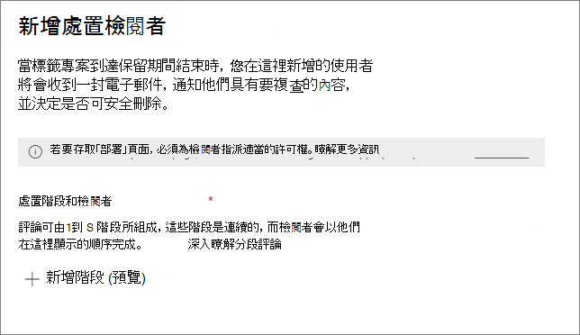

# <a name="disposition-of-content"></a>內容處置

>*[Microsoft 365 安全性與合規性的授權指引](/office365/servicedescriptions/microsoft-365-service-descriptions/microsoft-365-tenantlevel-services-licensing-guidance/microsoft-365-security-compliance-licensing-guidance)。*

使用 Microsoft 365 合規性中心 [記錄管理]**** 中的 [處置]**** 頁面來管理處置檢閱，並檢視在其保留期間結束時自動刪除的 [記錄](records-management.md#records)中繼資料。

> [!NOTE]
> 預覽中: **多階段處置檢閱**
> 
> 系統管理員現在可以在保留標籤中新增最多五個連續的處置檢閱階段，且檢閱者可將其他使用者新增到他們的處置檢閱階段。 您也可以自訂電子郵件通知和提醒。 下列各節提供有關此預覽中變更的詳細資訊。
>
> 若要詳讀發行公告，請參閱部落格文章 [宣佈 Microsoft 記錄管理中的多階段處置檢閱](https://techcommunity.microsoft.com/t5/security-compliance-and-identity/announcing-multi-stage-disposition-in-microsoft-records/ba-p/2361849)。

## <a name="prerequisites-for-viewing-content-dispositions"></a>檢視內容處置的先決條件

若要管理處置檢閱並確認記錄已刪除，您必須具備足夠的權限，而且必須啟用審核。

### <a name="permissions-for-disposition"></a>處置的權限

若要在 Microsoft 365 合規性中心中成功存取 [處置 **]** 索引標籤，使用者必須具備 [處置管理 **]** 的角色。 從 2020 年 12 月起，此角色現在包含在 [記錄管理 **]** 預設角色群組中。

> [!NOTE]
> 預設情况下，並不會授與全域系統管理員 [處置管理 **]** 角色。 

若要僅授與使用者進行處置檢閲所需的權限，而不授與其檢視和設定其他保留和記錄管理功能的權限，請建立一個自訂角色群組 (例如，名為 [處置檢閲者]) 並向該組授與 [處置管理 **]** 角色。

如需設定這些權限的相關指示，請參閱[讓使用者能夠存取 Office 365 安全性與合規性中心](../security/office-365-security/grant-access-to-the-security-and-compliance-center.md) (部分機器翻譯)。

此外：

- 若要在處置流程期間檢視項目的內容，請將使用者新增到 [內容總管內容檢視器 **]** 角色群組。 如果使用者沒有這角色群組的權限，他們仍然可以選取處置檢閱動作來完成處置檢閲，但不能從合規性中心的迷你預覽窗格檢視項目的內容。

- 預覽階段：根據預設，每個存取 [處置 **]** 頁面的人員只會看到指派給他們檢閱的項目。 如需讓記錄管理系統管理員查看指派給所有使用者的所有項目，以及查看設定用於處置檢閱的所有保留標籤：請瀏覽 [記錄管理設定 **]** > [一般 **]** > [記錄管理員的安全性群組 **]** 加以選取，然後啟用包含系統管理員帳戶之具備郵件功能的安全性群組。
    
    未擁有郵件功能的 Microsoft 365 群組和安全性群組不支援此功能，且無法顯示在要選取的清單中。 如果需要建立全新擁有郵件功能的安全性群組，請使用前往 Microsoft 365 系統管理中心的連結來建立新群組。 
    
    > [!IMPORTANT]
    > 啟用群組之後，您即無法在合規性中心進行變更。 請參閱下一節，了解如何使用 PowerShell 啟用不同的群組。

- 預覽階段：只有記錄管理系統管理員可看到 [記錄管理設定 **]** 選項。 

#### <a name="enabling-another-security-group-for-disposition"></a>用於處置且已啟用其他安全性群組

從 Microsoft 365 合規性中心的 [記錄管理設定 **]** 啟用安全性群組進行處置之後，您即無法停用群組的此權限，或取代合規性中心中選取的群組。 不過，您可以使用 [Enable-ComplianceTagStorage](/powershell/module/exchange/enable-compliancetagstorage) Cmdlet 啟用另一個具備郵件功能的安全性群組。

例如： 

```PowerShell
Enable-ComplianceTagStorage -RecordsManagementSecurityGroupEmail dispositionreviewers@contosoi.com
````

### <a name="enable-auditing"></a>啟用稽核

請確認至少在第一個處置動作進行的前一天啟用稽核。 如需詳細資訊，請參閱[在 Office 365 安全性與合規性中心搜尋稽核記錄](search-the-audit-log-in-security-and-compliance.md)。 

## <a name="disposition-reviews"></a>處置檢閱

當內容的保留期間結束時，基於多種原因，您可能會想要檢閱該內容，以確認是否可以永久刪除 (亦即「處置」)。例如，如果不刪除內容，您可以能需要：
  
- 由於訴訟或稽核而暫止相關內容的刪除。

- 為內容指派不同的保留期間，可能是因為原始保留設定是暫時或臨時解決方案。

- 例如，如果內容具有研究或歷史價值，則從內容的現有位置移至封存位置。

在保留期間結束後觸發處置檢閱時：
  
- 您選擇的檢閱者會收到一封電子郵件，通知他們有內容需檢閱。 這些檢閱者可以是個別使用者，或擁有郵件功能的安全性群組。 預覽階段的新功能：
   - 您可以自訂他們收到的電子郵件，包括不同語言的指示。 適用於多語言支援，您必須自己指定翻譯，且此自訂文字會顯示給所有檢閱者，無論其所在地區設定為何。
   - 使用者會於項目的保留期間結束時，收到每個標籤的初始電子郵件通知，且使用者會收到所有獲指派處置檢閱之每個標籤的每週一次提醒。 他們可以按一下通知和提醒電子郵件中的連結，以前往 Microsoft 365 合規性中心的 [處置 **]** 頁面，以檢閱內容並採取行動。 檢閱者或也可以直接前往合規性中心的 [處置 **]** 頁面。
   - 檢閱者只會看到指派給他們的處置檢閱，然而新加入選取 [記錄管理員的安全性群組] 的系統管理員則會看到所有的處置檢閱。
   - 檢閱者可將新使用者新增到相同的處置檢閱。 目前，此動作不會自動為這些新增的使用者授與 [所需權限](#permissions-for-disposition)。
   - 而在處置檢閱流程中，每個項目的迷你檢閱窗格會顯示內容預覽 (如果他們有查看該內容的權限)。 如果他們沒有權限，則可選取內容連結並要求權限。 此迷你檢閱窗格也有內容相關之其他資訊的索引標籤：
       - [詳細資料 **]** 用來顯示具索引的內容、其位置地點、建立者及時間，以及上次修改者及修改時間。
       - [歷程記錄 **]** 用來顯示到目前為止任何處置檢閱動作的歷程記錄，以及檢閱者註解 (如果有)。

處置檢閱可包括 Exchange 信箱、SharePoint 網站以及 OneDrive 帳戶中的內容。 只有在位於處置最後階段的檢閱者選擇永久刪除內容之後，才會永久刪除在這些位置等待處置檢閱的內容。

> [!NOTE]
> 信箱必須至少具有 10 MB 的資料才能支援處置檢閱。

系統管理員可以在 [概觀 **]** 索引標籤中查看所有擱置處置的概觀。檢閱者只會看到他們的項目擱置處置。 例如：

![[記錄管理] 概觀中擱置中的處置](../media/dispositions-overview.png)

當您選取 **[檢視所有擱置中的處置]**，您將移至 **[處置]** 頁面。 例如：

![Microsoft 365 合規性中心的 [處置] 頁面](../media/disposition-tab.png)


### <a name="workflow-for-a-disposition-review"></a>處置檢閱的工作流程

下圖顯示使用者在發佈保留標籤並手動套用之後，處置檢閱的基本工作流程。 或者，可以將設定用於處置檢閱的保留標籤自動套用到內容。
  


### <a name="how-to-configure-a-retention-label-for-disposition-review"></a>如何設定處置檢閱的保留標籤

在保留期間結束時觸發處置檢閱是僅能搭配保留標籤使用的設定選項。 保留原則無法使用處置檢閱。 如需有關這兩個保留解決方案的詳細資訊，請參閱[瞭解保留原則和保留標籤](retention.md)。

保留標籤的 **[定義保留設定]** 頁面：


 
選取此 [觸發處置檢閱 **]** 選項之後，您可以在精靈的下一頁指定想要的處置連續階段數目，以及每個階段的處置檢閱者：

 

選取 [新增階段 **]**，並為您的階段命名以識別用途。 然後指定該階段的檢閱者。

為檢閱者指定使用者或擁有郵件功能的安全性群組。 此選項目前不支援 Microsoft 365 群組 ([之前稱為 Office 365 群組](https://techcommunity.microsoft.com/t5/microsoft-365-blog/office-365-groups-will-become-microsoft-365-groups/ba-p/1303601))。

如果您需要一位以上人員在項目的保留期間結束時檢閱該項目，請再次選取 [新增階段 **]**，然後重複您需要的階段數目設定流程，但最多五個階段。 

在每個個別處置階段內，您為該階段指定的任何使用者都獲得授權，可在項目保留期間結束時對該項目採取下一個動作。這些使用者也可以將其他使用者新增到他們的處置檢閱階段。

> [!NOTE]
> 可將已設定為要處置檢閱的的現有保留標籤，透過設定該標籤的方式升級為使用多階段處置檢閱。 在標籤精靈中，選取 [新增階段 **]**，或編輯現有檢閱者或新增檢閱者。

在設定階段期間，您可以選取 [階段動作] 選項 (**...**)，針對指定的每個階段加以重新命名、重新排序或移除： 


不過，建立保留標籤之後便無法重新排序或移除階段。

指定檢閱者之後，請記得將 [處置管理 **]** 角色權限授與他們。 如需詳細資訊，請參閱本頁的[處置的權限](#permissions-for-disposition)章節。

### <a name="how-to-customize-email-messages-for-disposition-review"></a>如何自訂處置檢閱的自訂電子郵件訊息

將預設電子郵件通知範例傳送給檢閱者：


此外在預覽階段，您可以自訂寄送給處置檢閱者之初始通知以及接下來提醒的電子郵件訊息。

從合規性中心的任何處置頁面，選取 [記錄管理設定 **]**：  


然後選取 [處置通知 **]** 索引標籤，指定是否只想使用預設電子郵件訊息，或將您自己的文字新增到預設電子郵件。 您的自訂文字會新增至保留標籤相關資訊之後與接下步驟指示之前的電子郵件指示中。

您可以新增所有語言的文字，但目前不支援格式和影像。 您可以將 URL 和電子郵件地址以文字的方式輸入，並且視電子郵件用戶端而定，在自訂的電子郵件中顯示為超連結或未格式化文字。

要新增的範例文字：

```console
If you need additional information, visit the helpdesk website (https://support.contoso.com) or send them an email (helpdesk@contoso.com).
```

選擇 [儲存 **]** 以儲存所有變更。

### <a name="viewing-and-disposing-of-content"></a>檢視和處置內容

當檢閱者收到電子郵件通知內容可供檢閱時，他們可以按一下電子郵件中的連結，直接前往 Microsoft 365 合規性中心 [記錄管理 **]** 中的 [處置 **]** 頁面。 檢閱者可在顯示 [擱置中的處置 **]** 的 [類型 **]** 中看到每個保留標籤正在等待處置的項目數目。 然後，他們選取保留標籤，並 [在新視窗中開啟 **]** 以查看具有該標籤的所有內容：


從 **擱置處置** 頁面上，他們會看到該標籤的所有擱置處置。 選取一或多個項目後，他們可以使用迷你預覽窗格和 [來源 **]**、[詳細資料 **]** 以及 [歷程記錄 **]** 索引標籤來檢查內容，然後再對內容採取動作：


如果您使用水平捲軸或關閉迷你檢閱窗格，則會看到包含到期日和處置檢閱階段名稱的更多資料行。

如範例所見，支援的動作如下： 
  
- **核准處置**：
    - 當選取此動作以做為進行處置檢閱的中期階段時 (已設定多個階段)：此項目會移至下一個處置階段。
    - 當選取此動作以做為進行處置檢閱的最後階段，或只有一個處置階段時：此項目會標記為符合永久刪除的資格。 該刪除的確切時間取決於工作負載。 如需詳細資料，請參閱[保留設定如何與就地內容搭配使用](retention.md#how-retention-settings-work-with-content-in-place)。
- **重新指派標籤**：
    - 選取此動作時，項目會離開原始標籤的處置檢閱流程。 該項目接下來會受新選取保留標籤的保留設定所規範。
- **延長**：
    - 選取此動作時，處置檢閱會有效地暫止，直到延長期間結束，然後系統會再次從第一階段觸發處置檢閱。
- **新增檢閱者**：
    - 選取此動作時，系統會提示使用者指定並新增其他使用者進行檢閱。
    
    > [!NOTE]
    > 此動作不會自動為新增的使用者授與 [所需權限](#permissions-for-disposition)。 如果他們沒有這些權限，則無法參與處置檢閱。

雖然您尚無法搜尋稽核記錄中的動作，但系統會儲存每個採取的動作。

在處置檢閱期間，內容永遠不會從原始位置移動，且系統不會將此內容標記為永久刪除，直到檢閱者於最終或唯一處置階段中選取此動作。

## <a name="disposition-of-records"></a>記錄處置

使用 [記錄管理 **]** 頁面中的 [處置 **]** 索引標籤來識別：

- 因處置檢閱而刪除的項目。
- 標示為記錄或法規記錄的項目，會在保留期間結束時自動刪除。

這些項目會在 **[類型]** 欄中顯示 **[記錄已處置]**。 例如：


**[已處置項目]** 索引標籤中顯示的項目在處置後最多可保存七年，在此期間，每個記錄限制保存一百萬個項目。 如果您看到 **[計數]** 數字接近上限一百萬，而且您需要記錄的處置證明，請與 [Microsoft 支援服務](../business-video/get-help-support.md)聯繫。

> [!NOTE]
> 此功能使用來自[整合稽核記錄](search-the-audit-log-in-security-and-compliance.md)的資訊，因此需要[啟用並搜尋](turn-audit-log-search-on-or-off.md)稽核，以便擷取相應的事件。

針對標示為記錄或法規記錄的已刪除項目稽核，請搜尋 **[檔案和頁面活動]** 類別中的 **[標示為記錄的已刪除檔案]**。 此稽核事件適用於文件和電子郵件。

## <a name="filter-and-export-the-views"></a>篩選及匯出檢視

當您從 **[處置]** 頁面選取保留標籤時，**[擱置中的處置]** 索引標籤 (如果適用) 和 **[已處置的項目]** 索引標籤可讓您篩選檢視，以協助您更輕鬆地找到項目。

針對擱置中的處置，時間範圍根據到期日而定。 針對已處置的項目，時間範圍根據刪除日而定。
  
您可以將其中一個檢視的項目資訊匯出為 .csv 檔案，然後使用 Excel 排序和管理。
