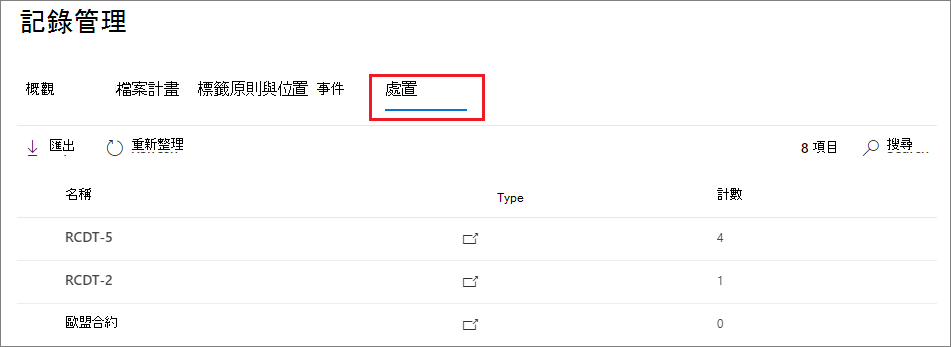

# 內容處置

>*[Microsoft 365 安全性與合規性的授權指引](https://aka.ms/ComplianceSD)。*

使用 Microsoft 365 規範中心內的**記錄管理**中的 [**部署**] 索引標籤，管理處置檢查，並查看在保留期間結束時自動刪除的[記錄](records-management.md#records)。 

## 查看內容處置的必要條件

若要管理處置檢查，並確認已刪除記錄，您必須啟用足夠的許可權和審核。

### 進行處置的許可權

若要在 Microsoft 365 規範中心中成功存取「 **處置** 」索引標籤，使用者必須具有「處理 **管理** 」管理角色。 此角色包含在預設的系統管理員角色群組中（ **合規性管理員** 和 **合規性資料管理員**）。

若要授與使用者這項必要的處理管理角色，請將其新增至其中一個預設角色群組，或建立自訂角色群組 (例如，名稱為「處置檢閱者」 ) 並授與此群組為「處置管理」角色。  

> [!NOTE]
> 即使全域管理員也必須授與 **處置管理** 角色。 

如需相關指示，請參閱[讓使用者能夠存取 Office 365 安全規範中心](../security/office-365-security/grant-access-to-the-security-and-compliance-center.md)。

### 啟用審核

請確定已在第一次處理動作之前，至少啟用一天的審計。 如需詳細資訊，請參閱在 [Office 365 安全性與 &amp; 合規性中心搜尋審核記錄](search-the-audit-log-in-security-and-compliance.md)檔。 

## 處置檢閱

當內容到達保留期間結束時，可能會有幾個原因會讓您檢查內容，以決定是否可以安全地刪除 ( 「已處置」 ) 。 例如，您可能需要：
  
- 在訴訟或審計事件中，封存相關內容的刪除。
    
- 若內容有調研或歷史值，請將內容從處置清單中移除儲存在封存中。
    
- 將不同的保留期間指派給內容，這可能是因為原始保留設定為暫時或臨時的解決方案。
    
- 將內容傳回給用戶端或轉接至另一個組織。

在保留期間結束時，會觸發處置檢查：
  
- 您選擇的人員會收到電子郵件通知，告知他們具有要審閱的內容。 這些檢閱者可以是個別的使用者、發佈或安全性群組，或 Microsoft 365 群組 ([先前的 Office 365 群組](https://techcommunity.microsoft.com/t5/microsoft-365-blog/office-365-groups-will-become-microsoft-365-groups/ba-p/1303601)) 。 請注意，每週會傳送通知。
    
- 檢閱者會移至 Microsoft 365 合規性中心的「 **處置** 」索引標籤，以查看內容，並決定是否要永久刪除、擴充保留期間或套用其他保留標籤。

處置評審可將內容包含在 Exchange 信箱、SharePoint 網站、OneDrive 帳戶和 Microsoft 365 群組中。 只有在檢閱者選擇永久刪除內容之後，才會刪除等候在這些位置中進行處置檢查的內容。

> [!NOTE]
> 信箱至少必須有 10 MB 的資料，才可支援處理審閱。

您可以在 [ **概覽** ] 索引標籤中看到所有擱置的處理的概覽。例如：

當您選取 [ **查看所有擱置**中的處理] 時，就會移至 [ **部署** ] 頁面。 例如：

### 用於處置評審的工作流程

下圖顯示保留標籤發佈後，使用者手動套用的處理審閱基本工作流程。 或者，設定用於處置檢查的保留標籤，會自動套用至內容。
  

  
在保留期間結束處置檢查時，只會有保留標籤的設定選項。 保留原則無法使用此選項。 如需這兩個保留解決方案的詳細資訊，請參閱 [瞭解保留原則和保留標籤](retention.md)。
  

 
> [!NOTE]
> 當您選取 [選項] 時，當 **有可供查看的專案時通知**使用者，請指定使用者或擁有郵件功能的安全性群組。 此選項不支援 Microsoft 365 群組 ([先前的 Office 365 群組](https://techcommunity.microsoft.com/t5/microsoft-365-blog/office-365-groups-will-become-microsoft-365-groups/ba-p/1303601)) 。

### 內容的查看與處置

當檢閱者透過電子郵件通知出內容可供審閱時，他們會從 Microsoft 365 規範中心的**記錄管理**移至 [**處置**] 索引標籤。 檢閱者可以查看每個保留標籤的專案數目等候處理，然後選取保留標籤以查看具有該標籤的所有內容。

選取保留標籤之後，您就會看到 [ **擱置的部署** ] 索引標籤中該標籤的所有擱置的處理。選取一個或多個專案，您可以在其中選擇動作並輸入對齊批註：

您可以從圖片看到，支援的動作如下： 
  
- 永久刪除專案
- 延長保留期間
- 套用其他保留標籤

提供您具有位置和內容的許可權，您可以使用 [ **位置** ] 欄中的連結，以查看其原始位置中的檔。 在處置檢查期間，內容永遠不會從其原始位置移動，永遠不會刪除，除非檢閱者選擇這麼做。

電子郵件通知會以每週為單位自動傳送給檢閱者。 此排定的程式表示當內容到達其保留期間結束時，最多可能需要7天的時間，檢閱者收到內容正等待處置的電子郵件通知。
  
所有的處理動作都可以經過審核，而且檢閱者所輸入的調整文字會儲存並顯示在 [已**釋放的專案**] 頁面上的 [**批註**] 欄中。
  
### 永久刪除處置內容之前的時間

只有在檢閱者選擇永久刪除內容之後，才會刪除等候進行處置檢查的內容。 當檢閱者選擇此選項時，SharePoint 網站或 OneDrive 帳戶中的內容，就會符合 [保留設定如何使用內容就地運作](retention.md#how-retention-settings-work-with-content-in-place)所述的標準清理程式。

## 記錄處置

> [!NOTE]
> 用於 SharePoint 和 OneDrive 中的記錄的處理證明已完成的展示。 您會在 Microsoft 365 規範中心的 [記錄管理] 頁面上，看到 [已標記內容] 做為 SharePoint 和 OneDrive 的保留標籤清單。 在 [這些標籤] 底下，您可以在 SharePoint 和 OneDrive 中看到專案的清單，該專案會自動處置或在進行處置檢查之後。
>
> Exchange 中的記錄處置憑證尚未使用中。 當此首展開始和完成時，我們將會更新此附注。

使用 [**記錄管理**] 頁面中的 [**部署**] 索引標籤來識別自動刪除的記錄。 這些專案會在 [**類型**] 欄中顯示已**處置的記錄**。 例如：

已釋放的 [ **專案** ] 索引標籤中的記錄標籤所顯示的專案，在專案被處置後，最多可保留7年，每筆記錄的每一筆記錄的限制為1000000個專案。 如果您看到的 **計數** 值接近此限制1000000，而您需要為記錄進行處置，請與 [Microsoft 支援](https://docs.microsoft.com/office365/admin/contact-support-for-business-products)人員聯繫。

> [!NOTE]
> 這種功能是以 [整合的審計記錄](search-the-audit-log-in-security-and-compliance.md) 資訊為基礎，因此需要 [啟用並](turn-audit-log-search-on-or-off.md) 可搜尋審計，以便捕獲對應的事件。
    
## 篩選和匯出視圖

當您從 [ **處置** ] 頁面中選取保留標籤時，[ **擱置的處理** ] 索引標籤 (（如果適用）) 和 [已 **釋放的專案** ] 索引標籤可讓您篩選視圖，以協助您更輕鬆找到 

針對暫止的處理，時間範圍是以到期日為基礎。 若為已處置的專案，時間範圍會根據刪除日期。
  
您可以將上述專案的相關資訊匯出為 .csv 檔案，然後您就可以使用 Excel 進行排序和管理：

  

