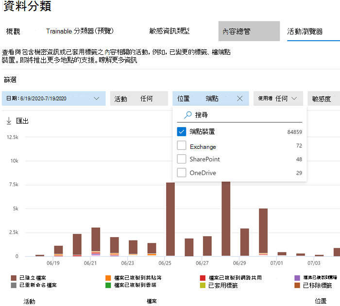

# <a name="get-started-with-microsoft-compliance-extension"></a><span data-ttu-id="68d32-103">開始使用 Microsoft 合規性延伸模組</span><span class="sxs-lookup"><span data-stu-id="68d32-103">Get started with Microsoft Compliance Extension</span></span>

<span data-ttu-id="68d32-104">使用這些程序以推出 Microsoft 合規性延伸模組。</span><span class="sxs-lookup"><span data-stu-id="68d32-104">Use these procedures to roll out the Microsoft Compliance Extension.</span></span>

## <a name="before-you-begin"></a><span data-ttu-id="68d32-105">開始之前</span><span class="sxs-lookup"><span data-stu-id="68d32-105">Before you begin</span></span>

<span data-ttu-id="68d32-106">若要使用 Microsoft 合規性延伸模組，必須將裝置上線至端點 DLP。</span><span class="sxs-lookup"><span data-stu-id="68d32-106">To use Microsoft Compliance Extension, the device must be onboarded into endpoint DLP.</span></span> <span data-ttu-id="68d32-107">如果您是 DLP 或端點 DLP 新使用者，請檢閱這些文章</span><span class="sxs-lookup"><span data-stu-id="68d32-107">Review these articles if you are new to DLP or endpoint DLP</span></span>

- [<span data-ttu-id="68d32-108">深入了解 Microsoft 合規性延伸模組</span><span class="sxs-lookup"><span data-stu-id="68d32-108">Learn about Microsoft Compliance Extension</span></span>](dlp-chrome-learn-about.md)
- [<span data-ttu-id="68d32-109">深入了解資料外洩防護</span><span class="sxs-lookup"><span data-stu-id="68d32-109">Learn about data loss prevention</span></span>](dlp-learn-about-dlp.md)
- [<span data-ttu-id="68d32-110">建立、測試及調整 DLP 原則</span><span class="sxs-lookup"><span data-stu-id="68d32-110">Create, test, and tune a DLP policy</span></span>](create-test-tune-dlp-policy.md)
- [<span data-ttu-id="68d32-111">從範本建立 DLP 原則</span><span class="sxs-lookup"><span data-stu-id="68d32-111">Create a DLP policy from a template</span></span>](create-a-dlp-policy-from-a-template.md)
- [<span data-ttu-id="68d32-112">深入了解端點資料外洩防護</span><span class="sxs-lookup"><span data-stu-id="68d32-112">Learn about endpoint data loss prevention</span></span>](endpoint-dlp-learn-about.md)
- [<span data-ttu-id="68d32-113">開始使用端點資料外洩防護</span><span class="sxs-lookup"><span data-stu-id="68d32-113">Get started with Endpoint data loss prevention</span></span>](endpoint-dlp-getting-started.md)
- [<span data-ttu-id="68d32-114">Windows 10 裝置的上線工具及方法</span><span class="sxs-lookup"><span data-stu-id="68d32-114">Onboarding tools and methods for Windows 10 devices</span></span>](dlp-configure-endpoints.md)
- [<span data-ttu-id="68d32-115">為端點 DLP 設定裝置 Proxy 和網際網路連線設定</span><span class="sxs-lookup"><span data-stu-id="68d32-115">Configure device proxy and internet connection settings for Endpoint DLP</span></span>](endpoint-dlp-configure-proxy.md)
- [<span data-ttu-id="68d32-116">使用端點資料外洩防護</span><span class="sxs-lookup"><span data-stu-id="68d32-116">Using Endpoint data loss prevention</span></span>](endpoint-dlp-using.md)

### <a name="skusubscriptions-licensing"></a><span data-ttu-id="68d32-117">SKU/訂閱授權</span><span class="sxs-lookup"><span data-stu-id="68d32-117">SKU/subscriptions licensing</span></span>

<span data-ttu-id="68d32-118">在您開始之前，應先確認您的 [Microsoft 365 訂閱](https://www.microsoft.com/microsoft-365/compare-microsoft-365-enterprise-plans?rtc=1) 以及任何附加元件。</span><span class="sxs-lookup"><span data-stu-id="68d32-118">Before you get started, you should confirm your [Microsoft 365 subscription](https://www.microsoft.com/microsoft-365/compare-microsoft-365-enterprise-plans?rtc=1) and any add-ons.</span></span> <span data-ttu-id="68d32-119">若要存取和使用端點 DLP 的功能，您必須擁有下列其中一個訂閱或附加元件。</span><span class="sxs-lookup"><span data-stu-id="68d32-119">To access and use Endpoint DLP functionality, you must have one of these subscriptions or add-ons.</span></span>

- <span data-ttu-id="68d32-120">Microsoft 365 E5</span><span class="sxs-lookup"><span data-stu-id="68d32-120">Microsoft 365 E5</span></span>
- <span data-ttu-id="68d32-121">Microsoft 365 A5 (教育版)</span><span class="sxs-lookup"><span data-stu-id="68d32-121">Microsoft 365 A5 (EDU)</span></span>
- <span data-ttu-id="68d32-122">Microsoft 365 E5 合規性</span><span class="sxs-lookup"><span data-stu-id="68d32-122">Microsoft 365 E5 compliance</span></span>
- <span data-ttu-id="68d32-123">Microsoft 365 A5 合規性</span><span class="sxs-lookup"><span data-stu-id="68d32-123">Microsoft 365 A5 compliance</span></span>
- <span data-ttu-id="68d32-124">Microsoft 365 E5 資訊保護和控管</span><span class="sxs-lookup"><span data-stu-id="68d32-124">Microsoft 365 E5 information protection and governance</span></span>
- <span data-ttu-id="68d32-125">Microsoft 365 A5 資訊保護和控管</span><span class="sxs-lookup"><span data-stu-id="68d32-125">Microsoft 365 A5 information protection and governance</span></span>

<span data-ttu-id="68d32-126">如需授權指南的詳細資料，請參閱：[Microsoft 365 安全性與合規性的授權指南](/office365/servicedescriptions/microsoft-365-service-descriptions/microsoft-365-tenantlevel-services-licensing-guidance/microsoft-365-security-compliance-licensing-guidance#information-protection)。</span><span class="sxs-lookup"><span data-stu-id="68d32-126">For detailed licensing guidance, see [Microsoft 365 licensing guidance for security & compliance](/office365/servicedescriptions/microsoft-365-service-descriptions/microsoft-365-tenantlevel-services-licensing-guidance/microsoft-365-security-compliance-licensing-guidance#information-protection).</span></span>

- <span data-ttu-id="68d32-127">您的組織必須獲得端點 DLP 授權</span><span class="sxs-lookup"><span data-stu-id="68d32-127">Your org must be licensed for Endpoint DLP</span></span>
- <span data-ttu-id="68d32-128">您的裝置必須是可以執行 Windows 10 x64 組建 1809 或更新版本。</span><span class="sxs-lookup"><span data-stu-id="68d32-128">Your devices must be running Windows 10 x64 build 1809 or later.</span></span>
- <span data-ttu-id="68d32-129">該裝置必須具有反惡意程式碼用戶端版本為 4.18.2101.9 或更新版本。</span><span class="sxs-lookup"><span data-stu-id="68d32-129">The device must have Antimalware Client Version is 4.18.2101.9 or later.</span></span> <span data-ttu-id="68d32-130">開啟 **Windows 安全性** 應用程式，選取 **設定** 圖示，然後選取 **關於**，以查看您目前的版本。</span><span class="sxs-lookup"><span data-stu-id="68d32-130">Check your current version by opening **Windows Security** app, select the **Settings** icon, and then select **About**.</span></span>


### <a name="permissions"></a><span data-ttu-id="68d32-131">權限</span><span class="sxs-lookup"><span data-stu-id="68d32-131">Permissions</span></span>

<span data-ttu-id="68d32-132">可在 [活動總管](data-classification-activity-explorer.md) 中檢視來自端點 DLP 的資料。</span><span class="sxs-lookup"><span data-stu-id="68d32-132">Data from Endpoint DLP can be viewed in [Activity explorer](data-classification-activity-explorer.md).</span></span> <span data-ttu-id="68d32-133">有七個角色可以將權限授與活動總管，您用來存取資料的帳戶必須屬於其中任何一個角色的成員。</span><span class="sxs-lookup"><span data-stu-id="68d32-133">There are seven roles that grant permission to activity explorer, the account you use for accessing the data must be a member of any one of them.</span></span>

- <span data-ttu-id="68d32-134">全域系統管理員</span><span class="sxs-lookup"><span data-stu-id="68d32-134">Global admin</span></span>
- <span data-ttu-id="68d32-135">合規性系統管理員</span><span class="sxs-lookup"><span data-stu-id="68d32-135">Compliance admin</span></span>
- <span data-ttu-id="68d32-136">安全性系統管理員</span><span class="sxs-lookup"><span data-stu-id="68d32-136">Security admin</span></span>
- <span data-ttu-id="68d32-137">合規性資料系統管理員</span><span class="sxs-lookup"><span data-stu-id="68d32-137">Compliance data admin</span></span>
- <span data-ttu-id="68d32-138">全域讀取者</span><span class="sxs-lookup"><span data-stu-id="68d32-138">Global reader</span></span>
- <span data-ttu-id="68d32-139">安全性讀取者</span><span class="sxs-lookup"><span data-stu-id="68d32-139">Security reader</span></span>
- <span data-ttu-id="68d32-140">報告讀取者</span><span class="sxs-lookup"><span data-stu-id="68d32-140">Reports reader</span></span>

### <a name="overall-installation-workflow"></a><span data-ttu-id="68d32-141">整體安裝工作流程</span><span class="sxs-lookup"><span data-stu-id="68d32-141">Overall installation workflow</span></span>

<span data-ttu-id="68d32-p105">部署 Microsoft 合規性延伸模組是多重階段的流程。您可以選擇一次安裝一部裝置，或使用 Microsoft 端點管理員或群組原則進行全組織部署。</span><span class="sxs-lookup"><span data-stu-id="68d32-p105">Deploying Microsoft Compliance Extension is a multi-phase process. You can choose to install on one machine at a time, or use Microsoft Endpoint Manager or Group Policy for organization-wide deployments.</span></span>

1. <span data-ttu-id="68d32-144">[準備您的裝置](#prepare-your-devices)。</span><span class="sxs-lookup"><span data-stu-id="68d32-144">[Prepare your devices](#prepare-your-devices).</span></span>
2. [<span data-ttu-id="68d32-145">基本設定單一裝置自我主控</span><span class="sxs-lookup"><span data-stu-id="68d32-145">Basic Setup Single Machine Selfhost</span></span>](#basic-setup-single-machine-selfhost)
3. [<span data-ttu-id="68d32-146">使用 Microsoft 端點管理員進行部署</span><span class="sxs-lookup"><span data-stu-id="68d32-146">Deploy using Microsoft Endpoint Manager</span></span>](#deploy-using-microsoft-endpoint-manager)
4. [<span data-ttu-id="68d32-147">使用群組原則進行部署</span><span class="sxs-lookup"><span data-stu-id="68d32-147">Deploy using Group Policy</span></span>](#deploy-using-group-policy)
5. [<span data-ttu-id="68d32-148">測試擴充功能</span><span class="sxs-lookup"><span data-stu-id="68d32-148">Test the Extension</span></span>](#test-the-extension)
6. [<span data-ttu-id="68d32-149">使用警示管理儀表板檢視 Chrome DLP 警示</span><span class="sxs-lookup"><span data-stu-id="68d32-149">Use the Alerts Management Dashboard to viewing Chrome DLP alerts</span></span>](#use-the-alerts-management-dashboard-to-viewing-chrome-dlp-alerts)
7. [<span data-ttu-id="68d32-150">檢視活動總管中的 Chrome DLP 資料</span><span class="sxs-lookup"><span data-stu-id="68d32-150">Viewing Chrome DLP data in activity explorer</span></span>](#viewing-chrome-dlp-data-in-activity-explorer) 

### <a name="prepare-infrastructure"></a><span data-ttu-id="68d32-151">準備基礎結構</span><span class="sxs-lookup"><span data-stu-id="68d32-151">Prepare infrastructure</span></span>

<span data-ttu-id="68d32-152">如果您要在所有受監視的 Windows 10 裝置上推出 Microsoft 合規性延伸模組，您應該將 Google Chrome 從不受允許的應用程式和瀏覽器清單中移除。</span><span class="sxs-lookup"><span data-stu-id="68d32-152">If you are rolling out the Microsoft Compliance Extension to all your monitored Windows 10 devices, you should remove Google Chrome from the unallowed app and unallowed browser lists.</span></span> <span data-ttu-id="68d32-153">有關詳細資訊，請參閱 [不受允許的瀏覽器](endpoint-dlp-using.md#unallowed-browsers)。</span><span class="sxs-lookup"><span data-stu-id="68d32-153">For more information, see [Unallowed browsers](endpoint-dlp-using.md#unallowed-browsers).</span></span> <span data-ttu-id="68d32-154">如果您只將 Chrome 推出至少數裝置，您可以將 Chrome 留在不受允許的瀏覽器和應用程式清單上。</span><span class="sxs-lookup"><span data-stu-id="68d32-154">If you are only rolling it out to a few devices, you can leave Chrome on the unallowed browser or unallowed app lists.</span></span> <span data-ttu-id="68d32-155">Microsoft 合規性延伸模組會在已安裝模組的電腦上略過兩種清單的限制。</span><span class="sxs-lookup"><span data-stu-id="68d32-155">The Microsoft Compliance Extension will bypass the restrictions of both lists for those computers where it is installed.</span></span>  

### <a name="prepare-your-devices"></a><span data-ttu-id="68d32-156">準備您的裝置</span><span class="sxs-lookup"><span data-stu-id="68d32-156">Prepare your devices</span></span>

1. <span data-ttu-id="68d32-157">使用這些主題中的程序以上線您的裝置：</span><span class="sxs-lookup"><span data-stu-id="68d32-157">Use the procedures in these topics to onboard your devices:</span></span>
    1. [<span data-ttu-id="68d32-158">開始使用端點資料外洩防護</span><span class="sxs-lookup"><span data-stu-id="68d32-158">Get started with Endpoint data loss prevention</span></span>](endpoint-dlp-getting-started.md)
    1. [<span data-ttu-id="68d32-159">Windows 10 裝置的上線工具及方法</span><span class="sxs-lookup"><span data-stu-id="68d32-159">Onboarding tools and methods for Windows 10 devices</span></span>](dlp-configure-endpoints.md)
    1. [<span data-ttu-id="68d32-160">為端點 DLP 設定裝置 Proxy 和網際網路連線設定</span><span class="sxs-lookup"><span data-stu-id="68d32-160">Configure device proxy and internet connection settings for Endpoint DLP</span></span>](endpoint-dlp-configure-proxy.md)

### <a name="basic-setup-single-machine-selfhost"></a><span data-ttu-id="68d32-161">基本設定單一裝置自我主控</span><span class="sxs-lookup"><span data-stu-id="68d32-161">Basic Setup Single Machine Selfhost</span></span>

<span data-ttu-id="68d32-162">這是建議的方法。</span><span class="sxs-lookup"><span data-stu-id="68d32-162">This is the recommended method.</span></span> 

1. <span data-ttu-id="68d32-163">請登入您要在其上安裝 Microsoft 合規性延伸模組的 Windows 10 電腦，然後以系統管理員的身分執行此 PowerShell 指令碼。</span><span class="sxs-lookup"><span data-stu-id="68d32-163">Sign in to the Windows 10 computer on which you want to install the Microsoft Compliance Extension on, and run this PowerShell script as an administrator.</span></span> 

   ```powershell
   Get-Item -path "HKLM:\SOFTWARE\Microsoft\Windows Defender\Miscellaneous Configuration" | New-ItemProperty -Name DlpDisableBrowserCache -Value 0 -Force
   ``` 

2.  <span data-ttu-id="68d32-164">瀏覽至 [Microsoft Compliance Extension - Chrome Web Store (google.com)](https://chrome.google.com/webstore/detail/microsoft-compliance-exte/echcggldkblhodogklpincgchnpgcdco)。</span><span class="sxs-lookup"><span data-stu-id="68d32-164">Navigate to [Microsoft Compliance Extension - Chrome Web Store (google.com)](https://chrome.google.com/webstore/detail/microsoft-compliance-exte/echcggldkblhodogklpincgchnpgcdco).</span></span>

3.  <span data-ttu-id="68d32-165">使用 Chrome Web Store 頁面上的指示安裝延伸模組。</span><span class="sxs-lookup"><span data-stu-id="68d32-165">Install the extension using the instructions on the Chrome Web Store page.</span></span>

### <a name="deploy-using-microsoft-endpoint-manager"></a><span data-ttu-id="68d32-166">使用 Microsoft 端點管理員進行部署</span><span class="sxs-lookup"><span data-stu-id="68d32-166">Deploy using Microsoft Endpoint Manager</span></span>

<span data-ttu-id="68d32-167">使用此設定方法以進行全組織部署。</span><span class="sxs-lookup"><span data-stu-id="68d32-167">Use this setup method for organization-wide deployments.</span></span>


##### <a name="enabling-required-registry-key-via-microsoft-endpoint-manager"></a><span data-ttu-id="68d32-168">透過 Microsoft 端點管理員啟用必要的註冊金鑰</span><span class="sxs-lookup"><span data-stu-id="68d32-168">Enabling Required Registry Key via Microsoft Endpoint Manager</span></span>

1.  <span data-ttu-id="68d32-169">使用下列內容建立 PowerShell 指令碼：</span><span class="sxs-lookup"><span data-stu-id="68d32-169">Create a PowerShell script with the following contents:</span></span>

    ```powershell
    Get-Item -path "HKLM:\SOFTWARE\Microsoft\Windows Defender\Miscellaneous Configuration" | New-ItemProperty -Name DlpDisableBrowserCache -Value 0 -Force
    ```

2.  <span data-ttu-id="68d32-170">登入 [Microsoft 端點管理員系統管理中心](https://endpoint.microsoft.com)。</span><span class="sxs-lookup"><span data-stu-id="68d32-170">Sign in to the [Microsoft Endpoint Manager Admin Center](https://endpoint.microsoft.com).</span></span>

3.  <span data-ttu-id="68d32-171">瀏覽至 **裝置** > **指令碼** 並選取 **新增**。</span><span class="sxs-lookup"><span data-stu-id="68d32-171">Navigate to **Devices** > **Scripts** and select **Add**.</span></span>

4.  <span data-ttu-id="68d32-172">在收到系統提示時，瀏覽至已建立的指令碼位置。</span><span class="sxs-lookup"><span data-stu-id="68d32-172">Browse to the location of the script created when prompted.</span></span>

5.  <span data-ttu-id="68d32-173">選取下列設定：</span><span class="sxs-lookup"><span data-stu-id="68d32-173">Select the following settings:</span></span>
    1. <span data-ttu-id="68d32-174">使用登入認證執行此指令碼：是</span><span class="sxs-lookup"><span data-stu-id="68d32-174">Run this script using the logged-on credentials: YES</span></span>
    1. <span data-ttu-id="68d32-175">強制執行指令碼簽章檢查： 否</span><span class="sxs-lookup"><span data-stu-id="68d32-175">Enforce script signature check: NO</span></span>
    1. <span data-ttu-id="68d32-176">在 64 位元 PowerShell 主機中執行指令碼：是</span><span class="sxs-lookup"><span data-stu-id="68d32-176">Run script in 64-bit PowerShell Host: YES</span></span>

6.  <span data-ttu-id="68d32-177">選取適當的裝置群組並應用原則。</span><span class="sxs-lookup"><span data-stu-id="68d32-177">Select the proper device groups and apply the policy.</span></span>

#### <a name="microsoft-endpoint-manager-force-install-steps"></a><span data-ttu-id="68d32-178">Microsoft 端點管理員強制安裝步驟</span><span class="sxs-lookup"><span data-stu-id="68d32-178">Microsoft Endpoint Manager Force Install Steps</span></span>

<span data-ttu-id="68d32-179">將 Microsoft 合規性延伸模組新增到強制安裝的延伸模組清單之前，務必要擷取 Chrome ADMX。</span><span class="sxs-lookup"><span data-stu-id="68d32-179">Before adding the Microsoft Compliance Extension to the list of force-installed extensions, it is important to ingest the Chrome ADMX.</span></span> <span data-ttu-id="68d32-180">Google 會記錄 Microsoft 端點管理員中此程序的步驟：[使用 Microsoft Intune - Google Chrome Enterprise Help 管理 Chrome 瀏覽器](https://support.google.com/chrome/a/answer/9102677?hl=en#zippy=%2Cstep-ingest-the-chrome-admx-file-into-intune)。</span><span class="sxs-lookup"><span data-stu-id="68d32-180">Steps for this process in Microsoft Endpoint Manager are documented by Google: [Manage Chrome Browser with Microsoft Intune - Google Chrome Enterprise Help](https://support.google.com/chrome/a/answer/9102677?hl=en#zippy=%2Cstep-ingest-the-chrome-admx-file-into-intune).</span></span>

 <span data-ttu-id="68d32-181">在擷取 ADMX 之後，可以依照下列步驟依序建立此延伸模組的組態設定檔。</span><span class="sxs-lookup"><span data-stu-id="68d32-181">After ingesting the ADMX, the steps below can be followed to create a configuration profile for this extension.</span></span>

1.  <span data-ttu-id="68d32-182">登入 Microsoft 端點管理員系統管理中心 (https://endpoint.microsoft.com)。</span><span class="sxs-lookup"><span data-stu-id="68d32-182">Sign in to the Microsoft Endpoint Manager Admin Center (https://endpoint.microsoft.com).</span></span>

2.  <span data-ttu-id="68d32-183">瀏覽至組態設定檔。</span><span class="sxs-lookup"><span data-stu-id="68d32-183">Navigate to Configuration Profiles.</span></span>

3.  <span data-ttu-id="68d32-184">選取 **建立設定檔**。</span><span class="sxs-lookup"><span data-stu-id="68d32-184">Select **Create Profile**.</span></span>

4.  <span data-ttu-id="68d32-185">選取 **Windows 10** 做為平台。</span><span class="sxs-lookup"><span data-stu-id="68d32-185">Select **Windows 10** as the platform.</span></span>

5.  <span data-ttu-id="68d32-186">選取 **自訂** 作為設定檔類型。</span><span class="sxs-lookup"><span data-stu-id="68d32-186">Select **Custom** as profile type.</span></span>

6.  <span data-ttu-id="68d32-187">選取 **設定** 索引標籤。</span><span class="sxs-lookup"><span data-stu-id="68d32-187">Select the **Settings** tab.</span></span>

7.  <span data-ttu-id="68d32-188">選取 **新增**。</span><span class="sxs-lookup"><span data-stu-id="68d32-188">Select **Add**.</span></span>

8.  <span data-ttu-id="68d32-189">輸入下列原則資訊。</span><span class="sxs-lookup"><span data-stu-id="68d32-189">Enter the following policy information.</span></span>
    
    <span data-ttu-id="68d32-190">OMA-URI：`./Device/Vendor/MSFT/Policy/Config/Chrome~Policy~googlechrome~Extensions/ExtensionInstallForcelist`</span><span class="sxs-lookup"><span data-stu-id="68d32-190">OMA-URI: `./Device/Vendor/MSFT/Policy/Config/Chrome~Policy~googlechrome~Extensions/ExtensionInstallForcelist`</span></span><br/>
    <span data-ttu-id="68d32-191">資料類型：`String`</span><span class="sxs-lookup"><span data-stu-id="68d32-191">Data type: `String`</span></span><br/>
    <span data-ttu-id="68d32-192">值：`<enabled/><data id="ExtensionInstallForcelistDesc" value="1&#xF000; echcggldkblhodogklpincgchnpgcdco;https://clients2.google.com/service/update2/crx"/>`</span><span class="sxs-lookup"><span data-stu-id="68d32-192">Value: `<enabled/><data id="ExtensionInstallForcelistDesc" value="1&#xF000; echcggldkblhodogklpincgchnpgcdco;https://clients2.google.com/service/update2/crx"/>`</span></span>

9.  <span data-ttu-id="68d32-193">按一下 [建立]。</span><span class="sxs-lookup"><span data-stu-id="68d32-193">Click create.</span></span>

### <a name="deploy-using-group-policy"></a><span data-ttu-id="68d32-194">使用群組原則部署</span><span class="sxs-lookup"><span data-stu-id="68d32-194">Deploy using Group Policy</span></span>

<span data-ttu-id="68d32-195">如果您不想使用 Microsoft 端點管理員，您可以使用群組原則以在組織中部署 Microsoft 合規性延伸模組</span><span class="sxs-lookup"><span data-stu-id="68d32-195">If you don't want to use Microsoft Endpoint Manager, you can use group policies to deploy the Microsoft Compliance Extension across your organization</span></span>

1. <span data-ttu-id="68d32-196">您的裝置必須可透過群組原則管理，而且您必須將所有的 Chrome ADMX 都匯入群組原則集中存放區。</span><span class="sxs-lookup"><span data-stu-id="68d32-196">Your devices must be manageable via Group Policy, and you need to import all Chrome ADMXs into the Group Policy Central Store.</span></span> <span data-ttu-id="68d32-197">如需詳細資訊，請參閱 [如何在 Windows 中建立和管理群組原則系統管理範本的集中存放區](/troubleshoot/windows-client/group-policy/create-and-manage-central-store)。</span><span class="sxs-lookup"><span data-stu-id="68d32-197">For more information, see [How to create and manage the Central Store for Group Policy Administrative Templates in Windows](/troubleshoot/windows-client/group-policy/create-and-manage-central-store).</span></span>

2.  <span data-ttu-id="68d32-198">使用此 PowerShell 命令以建立 PowerShell 指令碼：</span><span class="sxs-lookup"><span data-stu-id="68d32-198">Create a PowerShell script using this PowerShell command:</span></span>

    ```powershell
    Get-Item -path "HKLM:\SOFTWARE\Microsoft\Windows Defender\Miscellaneous Configuration" | New-ItemProperty -Name DlpDisableBrowserCache -Value 0 -Force
    ```

3.  <span data-ttu-id="68d32-199">開啟 **群組原則管理主控台** 並瀏覽至您的組織單位 (OU)。</span><span class="sxs-lookup"><span data-stu-id="68d32-199">Open the **Group Policy Management Console** and navigate to your organizational unit (OU).</span></span>

4.  <span data-ttu-id="68d32-200">按右鍵並選取 **在此網域中建立 GPO 並於此處建立連結**。</span><span class="sxs-lookup"><span data-stu-id="68d32-200">Right-click and select **Create a GPO in this domain and Link it here**.</span></span> <span data-ttu-id="68d32-201">當收到系統提示時，請指派一個描述性名稱至此群組原則物件 (GPO) 然後完成建立。</span><span class="sxs-lookup"><span data-stu-id="68d32-201">When prompted, assign a descriptive name to this group policy object (GPO) and finish creating it.</span></span>

5.  <span data-ttu-id="68d32-202">以滑鼠右鍵按一下 GPO，然後 **編輯**。</span><span class="sxs-lookup"><span data-stu-id="68d32-202">Right-click the GPO and select **Edit**.</span></span>

6.  <span data-ttu-id="68d32-203">請前往 **電腦組態** > **喜好設定** > **控制台設定** > **排程工作**。</span><span class="sxs-lookup"><span data-stu-id="68d32-203">Go to **Computer Configuration** > **Preferences** > **Control Panel Settings** > **Scheduled Tasks**.</span></span>

7.  <span data-ttu-id="68d32-204">選取按右鍵並選擇 **新增** > **立即性工作 (至少 Windows 7)** 以建立新的即時性工作。</span><span class="sxs-lookup"><span data-stu-id="68d32-204">Create a new immediate task by selecting right-clicking and selecting **New** > **Immediate Task (At least Windows 7)**.</span></span>

8.  <span data-ttu-id="68d32-205">為工作命名與描述。</span><span class="sxs-lookup"><span data-stu-id="68d32-205">Give the task a name & description.</span></span>

9.  <span data-ttu-id="68d32-206">選擇對應的帳戶以執行立即工作，例如 NT 授權</span><span class="sxs-lookup"><span data-stu-id="68d32-206">Choose the corresponding account to run the immediate task, for example NT Authority</span></span>

10. <span data-ttu-id="68d32-207">選取 **以最高權限執行**。</span><span class="sxs-lookup"><span data-stu-id="68d32-207">Select **Run with highest privileges**.</span></span>

11. <span data-ttu-id="68d32-208">設定 Windows 10 原則。</span><span class="sxs-lookup"><span data-stu-id="68d32-208">Configure the policy for Windows 10.</span></span>

12. <span data-ttu-id="68d32-209">在 **動作** 索引標籤中，選取動作 **啟動程式**。</span><span class="sxs-lookup"><span data-stu-id="68d32-209">In the **Actions** tab, select the action **Start a program**.</span></span>

13. <span data-ttu-id="68d32-210">輸入步驟 1 中建立的程式/指令碼路徑。</span><span class="sxs-lookup"><span data-stu-id="68d32-210">Enter the path to the Program/Script created in Step 1.</span></span>

14. <span data-ttu-id="68d32-211">選取 **套用**。</span><span class="sxs-lookup"><span data-stu-id="68d32-211">Select **Apply**.</span></span>

#### <a name="adding-the-chrome-extension-to-the-forceinstall-list"></a><span data-ttu-id="68d32-212">將 Chrome 擴充功能新增到 ForceInstall 清單</span><span class="sxs-lookup"><span data-stu-id="68d32-212">Adding the Chrome Extension to the ForceInstall List</span></span>

1.  <span data-ttu-id="68d32-213">在群組原則管理編輯器中，瀏覽至您的 OU。</span><span class="sxs-lookup"><span data-stu-id="68d32-213">In the Group Policy Management Editor, navigate to your OU.</span></span>

2.  <span data-ttu-id="68d32-214">展開下列路徑 **電腦/使用者設定** > **原則** > **系統管理範本** > **傳統系統管理範本** > **Google** > **Google Chrome** > **擴充功能**。</span><span class="sxs-lookup"><span data-stu-id="68d32-214">Expand the following path **Computer/User configuration** > **Policies** > **Administrative templates** > **Classic administrative templates** > **Google** > **Google Chrome** > **Extensions**.</span></span> <span data-ttu-id="68d32-215">此路徑可能會根據您的設定而不同。</span><span class="sxs-lookup"><span data-stu-id="68d32-215">This path may vary depending on your configuration.</span></span>

3.  <span data-ttu-id="68d32-216">選取 **設定強制安裝擴充功能清單**。</span><span class="sxs-lookup"><span data-stu-id="68d32-216">Select **Configure the list of force-installed extensions**.</span></span>

4.  <span data-ttu-id="68d32-217">以滑鼠右鍵按一下以滑鼠右鍵按一下，選取 **編輯**。</span><span class="sxs-lookup"><span data-stu-id="68d32-217">Right click and select **Edit**.</span></span>

5.  <span data-ttu-id="68d32-218">選取 **已啟用**。</span><span class="sxs-lookup"><span data-stu-id="68d32-218">Select **Enabled**.</span></span>

6.  <span data-ttu-id="68d32-219">選取 **顯示**。 </span><span class="sxs-lookup"><span data-stu-id="68d32-219">Select **Show**.</span></span>

7.  <span data-ttu-id="68d32-220">在 **值** 下方，新增下列項目：`echcggldkblhodogklpincgchnpgcdco;https://clients2.google.com/service/update2/crx`</span><span class="sxs-lookup"><span data-stu-id="68d32-220">Under **Value**, add the following entry: `echcggldkblhodogklpincgchnpgcdco;https://clients2.google.com/service/update2/crx`</span></span>

8.  <span data-ttu-id="68d32-221">選取 **OK** 然後選取 **套用**。</span><span class="sxs-lookup"><span data-stu-id="68d32-221">Select **OK** and then **Apply**.</span></span>

### <a name="test-the-extension"></a><span data-ttu-id="68d32-222">測試擴充功能</span><span class="sxs-lookup"><span data-stu-id="68d32-222">Test the Extension</span></span>

#### <a name="upload-to-cloud-service-or-access-by-unallowed-browsers-cloud-egress"></a><span data-ttu-id="68d32-223">上傳到雲端服務，或透過不受允許的 Cloud Egress 存取</span><span class="sxs-lookup"><span data-stu-id="68d32-223">Upload to cloud service, or access by unallowed browsers Cloud Egress</span></span>  

1. <span data-ttu-id="68d32-224">建立或取得敏感性項目，並嘗試將檔案上傳到貴組織的限制服務網域之一。</span><span class="sxs-lookup"><span data-stu-id="68d32-224">Create or get a sensitive item and, try to upload a file to one of your organization’s restricted service domains.</span></span> <span data-ttu-id="68d32-225">敏感性資料必須與我們其中一個內建的 [敏感性資訊類型](sensitive-information-type-entity-definitions.md)或貴組織的其中一個敏感性資訊類型相符。</span><span class="sxs-lookup"><span data-stu-id="68d32-225">The sensitive data must match one of our built-in [Sensitive Info Types](sensitive-information-type-entity-definitions.md), or one of your organization’s sensitive information types.</span></span> <span data-ttu-id="68d32-226">您應該會在您正在測試的裝置上收到來自該裝置的 DLP 快顯通知，其中顯示檔案開啟時不允許此動作。</span><span class="sxs-lookup"><span data-stu-id="68d32-226">You should get a DLP toast notification on the device you are testing from that shows that this action is not allowed when the file is open.</span></span>

#### <a name="testing-other-dlp-scenarios-in-chrome"></a><span data-ttu-id="68d32-227">在 Chrome 中測試其他 DLP 案例</span><span class="sxs-lookup"><span data-stu-id="68d32-227">Testing other DLP scenarios in Chrome</span></span> 

<span data-ttu-id="68d32-228">現在，您已將 Chrome 從不受允許的瀏覽器/應用程式清單中移除，您可以測試下列案例以確認此行為符合貴組織的需求：</span><span class="sxs-lookup"><span data-stu-id="68d32-228">Now that you’ve removed Chrome from the disallowed browsers/apps list, you can test the scenarios below to confirm the behavior meets your organization’s requirements:</span></span>

- <span data-ttu-id="68d32-229">使用 [剪貼簿] 將資料從敏感性項目複製到另一份文件</span><span class="sxs-lookup"><span data-stu-id="68d32-229">Copy data from a sensitive item to another document using the Clipboard</span></span>
    - <span data-ttu-id="68d32-230">若要測試，請開啟受到保護且防止在 Chrome 瀏覽器中複製到剪貼簿動作的檔案，並嘗試從檔案複製資料。</span><span class="sxs-lookup"><span data-stu-id="68d32-230">To test, open a file that is protected against copy to clipboard actions in the Chrome browser and attempt to copy data from the file.</span></span>
    - <span data-ttu-id="68d32-231">預期的結果：DLP 快顯通知顯示出當檔案開啟時此動作是不受允許的。</span><span class="sxs-lookup"><span data-stu-id="68d32-231">Expected Result: A DLP toast notification showing that this action is not allowed when the file is open.</span></span>
- <span data-ttu-id="68d32-232">列印文件</span><span class="sxs-lookup"><span data-stu-id="68d32-232">Print a document</span></span>
    - <span data-ttu-id="68d32-233">若要測試，請開啟受到保護且防止在 Chrome 瀏覽器中列印的檔案，並嘗試從檔案列印資料。</span><span class="sxs-lookup"><span data-stu-id="68d32-233">To test, open a file that is protected against print actions in the Chrome browser and attempt to print the file.</span></span>
    - <span data-ttu-id="68d32-234">預期的結果：DLP 快顯通知顯示出當檔案開啟時此動作是不受允許的。</span><span class="sxs-lookup"><span data-stu-id="68d32-234">Expected Result: A DLP toast notification showing that this action is not allowed when the file is open.</span></span>
- <span data-ttu-id="68d32-235">複製到 USB 卸除式媒體</span><span class="sxs-lookup"><span data-stu-id="68d32-235">Copy to USB Removeable Media</span></span>
    - <span data-ttu-id="68d32-236">若要測試，請嘗試將檔案儲存到可移除的媒體儲存空間。</span><span class="sxs-lookup"><span data-stu-id="68d32-236">To test, try to save the file to a removeable media storage.</span></span>
    - <span data-ttu-id="68d32-237">預期的結果：DLP 快顯通知顯示出當檔案開啟時此動作是不受允許的。</span><span class="sxs-lookup"><span data-stu-id="68d32-237">Expected Result: A DLP toast notification showing that this action is not allowed when the file is open.</span></span>
- <span data-ttu-id="68d32-238">複製到網路共用</span><span class="sxs-lookup"><span data-stu-id="68d32-238">Copy to Network Share</span></span>
    - <span data-ttu-id="68d32-239">若要測試，請嘗試將檔案儲存到網路共用。</span><span class="sxs-lookup"><span data-stu-id="68d32-239">To test, try to save the file to a network share.</span></span>
    - <span data-ttu-id="68d32-240">預期的結果：DLP 快顯通知顯示出當檔案開啟時此動作是不受允許的。</span><span class="sxs-lookup"><span data-stu-id="68d32-240">Expected Result: A DLP toast notification showing that this action is not allowed when the file is open.</span></span>


### <a name="use-the-alerts-management-dashboard-to-viewing-chrome-dlp-alerts"></a><span data-ttu-id="68d32-241">使用警示管理儀表板檢視 Chrome DLP 警示</span><span class="sxs-lookup"><span data-stu-id="68d32-241">Use the Alerts Management Dashboard to viewing Chrome DLP alerts</span></span>

1. <span data-ttu-id="68d32-242">在 [Microsoft 365 合規性中心](https://compliance.microsoft.com) 開啟 **資料外洩防護** 頁面，然後選取 **警示**。</span><span class="sxs-lookup"><span data-stu-id="68d32-242">Open the **Data loss prevention** page in the [Microsoft 365 Compliance center](https://compliance.microsoft.com) and select **Alerts**.</span></span>

2. <span data-ttu-id="68d32-243">請參閱[如何設定和檢視 DLP 原則的警示](dlp-configure-view-alerts-policies.md)中的程序，以檢視您端點 DLP 原則的警示。</span><span class="sxs-lookup"><span data-stu-id="68d32-243">Refer to the procedures in [How to configure and view alerts for your DLP policies](dlp-configure-view-alerts-policies.md) to view alerts for your Endpoint DLP policies.</span></span>


### <a name="viewing-chrome-dlp-data-in-activity-explorer"></a><span data-ttu-id="68d32-244">檢視 [活動總管] 中的端點 DLP 資料</span><span class="sxs-lookup"><span data-stu-id="68d32-244">Viewing Chrome DLP data in activity explorer</span></span>

1. <span data-ttu-id="68d32-245">在 Microsoft 365 合規性中心開啟您網域的 [資料分類](https://compliance.microsoft.com/dataclassification?viewid=overview) 頁面，然後選擇 **活動總管**。</span><span class="sxs-lookup"><span data-stu-id="68d32-245">Open the [Data classification page](https://compliance.microsoft.com/dataclassification?viewid=overview) for your domain in the Microsoft 365 Compliance center and choose **Activity explorer**.</span></span>

2. <span data-ttu-id="68d32-246">請參閱 [開始使用活動總管](data-classification-activity-explorer.md) 中的程序，以存取及篩選您端裝置的所有資料。</span><span class="sxs-lookup"><span data-stu-id="68d32-246">Refer to the procedures in [Get started with Activity explorer](data-classification-activity-explorer.md) to access and filter all the data for your Endpoint devices.</span></span>

   > [!div class="mx-imgBorder"]
   > <span data-ttu-id="68d32-247"></span><span class="sxs-lookup"><span data-stu-id="68d32-247"></span></span>

### <a name="known-issues-and-limitations"></a><span data-ttu-id="68d32-248">已知問題與限制</span><span class="sxs-lookup"><span data-stu-id="68d32-248">Known Issues and Limitations</span></span>

1. <span data-ttu-id="68d32-249">不支援雲端出口的封鎖覆寫強制。</span><span class="sxs-lookup"><span data-stu-id="68d32-249">Block Override enforcement for cloud egress is not supported.</span></span>
2. <span data-ttu-id="68d32-250">不支援無痕模式且必須停用。</span><span class="sxs-lookup"><span data-stu-id="68d32-250">Incognito mode is not supported and must be disabled.</span></span>

## <a name="next-steps"></a><span data-ttu-id="68d32-251">後續步驟</span><span class="sxs-lookup"><span data-stu-id="68d32-251">Next steps</span></span>
<span data-ttu-id="68d32-252">現在您擁有已上線的裝置，且可以在 [活動總管] 中檢視活動資料，您已準備好開始建立可保護您敏感性項目之 DLP 原則的下一個步驟。</span><span class="sxs-lookup"><span data-stu-id="68d32-252">Now that you have onboarded devices and can view the activity data in Activity explorer, you are ready to move on to your next step where you create DLP policies that protect your sensitive items.</span></span>

- [<span data-ttu-id="68d32-253">使用端點資料外洩防護</span><span class="sxs-lookup"><span data-stu-id="68d32-253">Using Endpoint data loss prevention</span></span>](endpoint-dlp-using.md)

## <a name="see-also"></a><span data-ttu-id="68d32-254">另請參閱</span><span class="sxs-lookup"><span data-stu-id="68d32-254">See also</span></span>

- [<span data-ttu-id="68d32-255">深入了解端點資料外洩防護</span><span class="sxs-lookup"><span data-stu-id="68d32-255">Learn about Endpoint data loss prevention </span></span>](endpoint-dlp-learn-about.md)
- [<span data-ttu-id="68d32-256">使用端點資料外洩防護</span><span class="sxs-lookup"><span data-stu-id="68d32-256">Using Endpoint data loss prevention </span></span>](endpoint-dlp-using.md)
- [<span data-ttu-id="68d32-257">深入了解資料外洩防護</span><span class="sxs-lookup"><span data-stu-id="68d32-257">Learn about data loss prevention</span></span>](dlp-learn-about-dlp.md)
- [<span data-ttu-id="68d32-258">建立、測試及調整 DLP 原則</span><span class="sxs-lookup"><span data-stu-id="68d32-258">Create, test, and tune a DLP policy</span></span>](create-test-tune-dlp-policy.md)
- [<span data-ttu-id="68d32-259">開始使用活動總管</span><span class="sxs-lookup"><span data-stu-id="68d32-259">Get started with Activity explorer</span></span>](data-classification-activity-explorer.md)
- [<span data-ttu-id="68d32-260">適用於端點的 Microsoft Defender</span><span class="sxs-lookup"><span data-stu-id="68d32-260">Microsoft Defender for Endpoint</span></span>](/windows/security/threat-protection/)
- <span data-ttu-id="68d32-261">[Windows 10 電腦上線的工具及方法 ](/windows/security/threat-protection/microsoft-defender-atp/configure-endpoints)。</span><span class="sxs-lookup"><span data-stu-id="68d32-261">[Onboarding tools and methods for Windows 10 machines](/windows/security/threat-protection/microsoft-defender-atp/configure-endpoints)</span></span>
- [<span data-ttu-id="68d32-262">Microsoft 365 訂閱</span><span class="sxs-lookup"><span data-stu-id="68d32-262">Microsoft 365 subscription</span></span>](https://www.microsoft.com/microsoft-365/compare-microsoft-365-enterprise-plans?rtc=1)
- [<span data-ttu-id="68d32-263">加入 Azure AD 的裝置</span><span class="sxs-lookup"><span data-stu-id="68d32-263">Azure AD joined devices</span></span>](/azure/active-directory/devices/concept-azure-ad-join)
- <span data-ttu-id="68d32-264">[下載以 Chromium 為基礎的新 Microsoft Edge](https://support.microsoft.com/help/4501095/download-the-new-microsoft-edge-based-on-chromium)。</span><span class="sxs-lookup"><span data-stu-id="68d32-264">[Download the new Microsoft Edge based on Chromium](https://support.microsoft.com/help/4501095/download-the-new-microsoft-edge-based-on-chromium)</span></span>
