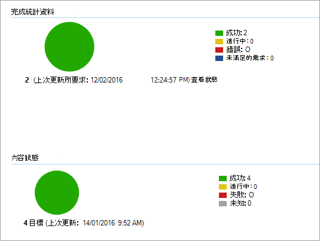

# <a name="onboard-windows-10-devices-using-configuration-manager"></a><span data-ttu-id="5f091-103">使用 Configuration Manager 上線 Windows 10 裝置</span><span class="sxs-lookup"><span data-stu-id="5f091-103">Onboard Windows 10 devices using Configuration Manager</span></span>

<span data-ttu-id="5f091-104">**適用於：**</span><span class="sxs-lookup"><span data-stu-id="5f091-104">**Applies to:**</span></span>

- [<span data-ttu-id="5f091-105">Microsoft 365端點資料遺失防護 (DLP) </span><span class="sxs-lookup"><span data-stu-id="5f091-105">Microsoft 365 Endpoint data loss prevention (DLP)</span></span>](./endpoint-dlp-learn-about.md)
- <span data-ttu-id="5f091-106">System Center 2012 R2 Configuration Manager</span><span class="sxs-lookup"><span data-stu-id="5f091-106">System Center 2012 R2 Configuration Manager</span></span>

### <a name="onboard-devices-using-system-center-configuration-manager"></a><span data-ttu-id="5f091-107">使用 System Center Configuration Manager 的板載裝置</span><span class="sxs-lookup"><span data-stu-id="5f091-107">Onboard devices using System Center Configuration Manager</span></span>

1. <span data-ttu-id="5f091-108">從服務上架嚮導，開啟 Configuration Manager configuration package .zip file (*DeviceComplianceOnboardingPackage.zip*) 。</span><span class="sxs-lookup"><span data-stu-id="5f091-108">Open the Configuration Manager configuration package .zip file (*DeviceComplianceOnboardingPackage.zip*) that you downloaded from the service onboarding wizard.</span></span> <span data-ttu-id="5f091-109">您也可以從 [Microsoft 規範中心](https://compliance.microsoft.com/)取得套件。</span><span class="sxs-lookup"><span data-stu-id="5f091-109">You can also get the package from [Microsoft Compliance center](https://compliance.microsoft.com/).</span></span>

2. <span data-ttu-id="5f091-110">在功能窗格中，選取 [**設定** 裝置上架] 上  >    >  **架**。</span><span class="sxs-lookup"><span data-stu-id="5f091-110">In the navigation pane, select **Settings** > **Device Onboarding** > **Onboarding**.</span></span>

3. <span data-ttu-id="5f091-111">在 [**部署方法**] 欄位中，選取 [ **Microsoft Endpoint Configuration Manager 2012/2012 R2/1511/1602**]。</span><span class="sxs-lookup"><span data-stu-id="5f091-111">In the **Deployment method** field, select **Microsoft Endpoint Configuration Manager 2012/2012 R2/1511/1602**.</span></span>

4. <span data-ttu-id="5f091-112">選取 [ **下載套件**]，然後儲存 .zip 檔。</span><span class="sxs-lookup"><span data-stu-id="5f091-112">Select **Download package**, and save the .zip file.</span></span>

5. <span data-ttu-id="5f091-113">將 .zip 檔案的內容解壓至共用的唯讀位置，該位置可供將要部署此套件的網路系統管理員存取。</span><span class="sxs-lookup"><span data-stu-id="5f091-113">Extract the contents of the .zip file to a shared, read-only location that can be accessed by the network administrators who will deploy the package.</span></span> <span data-ttu-id="5f091-114">您應該會有一個名為 *DeviceComplianceOnboardingScript* 的檔案。</span><span class="sxs-lookup"><span data-stu-id="5f091-114">You should have a file named *DeviceComplianceOnboardingScript.cmd*.</span></span>

6. <span data-ttu-id="5f091-115">遵循[System Center 2012 R2 Configuration Manager 文章中的套件和程式](/previous-versions/system-center/system-center-2012-R2/gg699369(v=technet.10))中的步驟，部署套件。</span><span class="sxs-lookup"><span data-stu-id="5f091-115">Deploy the package by following the steps in the [Packages and Programs in System Center 2012 R2 Configuration Manager](/previous-versions/system-center/system-center-2012-R2/gg699369(v=technet.10)) article.</span></span>

7. <span data-ttu-id="5f091-116">選擇要將套件部署至其中的預先定義的裝置集合。</span><span class="sxs-lookup"><span data-stu-id="5f091-116">Choose a predefined device collection to deploy the package to.</span></span>

> [!NOTE]
> <span data-ttu-id="5f091-117">Microsoft 365在[ (OOBE) ](https://answers.microsoft.com/en-us/windows/wiki/windows_10/how-to-complete-the-windows-10-out-of-box/47e3f943-f000-45e3-8c5c-9d85a1a0cf87)階段時，端點資料遺失防護不支援上架。</span><span class="sxs-lookup"><span data-stu-id="5f091-117">Microsoft 365 Endpoint data loss prevention doesn't support onboarding during the [Out-Of-Box Experience (OOBE)](https://answers.microsoft.com/en-us/windows/wiki/windows_10/how-to-complete-the-windows-10-out-of-box/47e3f943-f000-45e3-8c5c-9d85a1a0cf87) phase.</span></span> <span data-ttu-id="5f091-118">請確定使用者在執行 Windows 安裝或升級後，已完成 OOBE。</span><span class="sxs-lookup"><span data-stu-id="5f091-118">Make sure users complete OOBE after running Windows installation or upgrading.</span></span>

> [!TIP]
> <span data-ttu-id="5f091-119">在裝置上架後，您可以選擇執行偵測測試，以確認裝置已正確架至服務。</span><span class="sxs-lookup"><span data-stu-id="5f091-119">After onboarding the device, you can choose to run a detection test to verify that an device is properly onboarded to the service.</span></span> <span data-ttu-id="5f091-120">如需詳細資訊，請參閱 [在新架的 Microsoft Defender For Endpoint 裝置上執行偵測測試](/windows/security/threat-protection/microsoft-defender-atp/run-detection-test)。</span><span class="sxs-lookup"><span data-stu-id="5f091-120">For more information, see [Run a detection test on a newly onboarded Microsoft Defender for Endpoint device](/windows/security/threat-protection/microsoft-defender-atp/run-detection-test).</span></span>
>
> <span data-ttu-id="5f091-121">請注意，您可以在 Configuration Manager 應用程式上建立偵測規則，以持續檢查裝置是否已架。</span><span class="sxs-lookup"><span data-stu-id="5f091-121">Note that it is possible to create a detection rule on a Configuration Manager application to continuously check if a device has been onboarded.</span></span> <span data-ttu-id="5f091-122">應用程式是不同于套件和程式的物件類型。</span><span class="sxs-lookup"><span data-stu-id="5f091-122">An application is a different type of object than a package and program.</span></span>
> <span data-ttu-id="5f091-123">如果裝置尚未架 (由於是未決的 OOBE 完成或任何其他原因) ，Configuration Manager 會重試裝置上架裝置，直到規則偵測到狀態變更為止。</span><span class="sxs-lookup"><span data-stu-id="5f091-123">If a device is not yet onboarded (due to pending OOBE completion or any other reason), Configuration Manager will retry to onboard the device until the rule detects the status change.</span></span>
>
> <span data-ttu-id="5f091-124">如果 "OnboardingState" 登錄值 (類型 REG_DWORD) = 1，則可以建立偵測規則檢查，以完成此行為。</span><span class="sxs-lookup"><span data-stu-id="5f091-124">This behavior can be accomplished by creating a detection rule checking if the "OnboardingState" registry value (of type REG_DWORD) = 1.</span></span>
> <span data-ttu-id="5f091-125">此登錄值位於 "HKLM\SOFTWARE\Microsoft\ Windows Advanced 威脅 Protection\Status" 底下。</span><span class="sxs-lookup"><span data-stu-id="5f091-125">This registry value is located under "HKLM\SOFTWARE\Microsoft\Windows Advanced Threat Protection\Status".</span></span>
<span data-ttu-id="5f091-126">如需詳細資訊，請參閱[Configure in System Center 2012 R2 Configuration Manager 中的偵測方法](/previous-versions/system-center/system-center-2012-R2/gg682159(v=technet.10)#step-4-configure-detection-methods-to-indicate-the-presence-of-the-deployment-type)。</span><span class="sxs-lookup"><span data-stu-id="5f091-126">For more information, see [Configure Detection Methods in System Center 2012 R2 Configuration Manager](/previous-versions/system-center/system-center-2012-R2/gg682159(v=technet.10)#step-4-configure-detection-methods-to-indicate-the-presence-of-the-deployment-type).</span></span>

### <a name="configure-sample-collection-settings"></a><span data-ttu-id="5f091-127">設定範例集合設定</span><span class="sxs-lookup"><span data-stu-id="5f091-127">Configure sample collection settings</span></span>

<span data-ttu-id="5f091-128">針對每個裝置，您可以設定設定值，以指出是否可以在要求透過 Microsoft Defender 資訊安全中心提交檔案進行深層分析時，從裝置收集範例。</span><span class="sxs-lookup"><span data-stu-id="5f091-128">For each device, you can set a configuration value to state whether samples can be collected from the device when a request is made through Microsoft Defender Security Center to submit a file for deep analysis.</span></span>

> [!NOTE]
> <span data-ttu-id="5f091-129">這些設定設定通常是透過 Configuration Manager 進行。</span><span class="sxs-lookup"><span data-stu-id="5f091-129">These configuration settings are typically done through Configuration Manager.</span></span>

<span data-ttu-id="5f091-130">您可以為 Configuration Manager 中的設定專案設定符合性規則，以變更裝置上的範例共用設定。</span><span class="sxs-lookup"><span data-stu-id="5f091-130">You can set a compliance rule for configuration item in Configuration Manager to change the sample share setting on a device.</span></span>

<span data-ttu-id="5f091-131">此規則應該是 *修正* 相容性規則設定專案，它會在目標裝置上設定登錄機碼的值，以確定他們的投訴。</span><span class="sxs-lookup"><span data-stu-id="5f091-131">This rule should be a *remediating* compliance rule configuration item that sets the value of a registry key on targeted devices to make sure they’re complaint.</span></span>

<span data-ttu-id="5f091-132">設定是透過下列登錄機碼專案設定的：</span><span class="sxs-lookup"><span data-stu-id="5f091-132">The configuration is set through the following registry key entry:</span></span>

```
Path: “HKLM\SOFTWARE\Policies\Microsoft\Windows Advanced Threat Protection”
Name: "AllowSampleCollection"
Value: 0 or 1
```
<span data-ttu-id="5f091-133">其中：</span><span class="sxs-lookup"><span data-stu-id="5f091-133">Where:</span></span><br>
<span data-ttu-id="5f091-134">金鑰類型是 WORD。</span><span class="sxs-lookup"><span data-stu-id="5f091-134">Key type is a D-WORD.</span></span> <br>
<span data-ttu-id="5f091-135">可能的值為：</span><span class="sxs-lookup"><span data-stu-id="5f091-135">Possible values are:</span></span>
- <span data-ttu-id="5f091-136">0-不允許從此裝置共用範例</span><span class="sxs-lookup"><span data-stu-id="5f091-136">0 - doesn't allow sample sharing  from this device</span></span>
- <span data-ttu-id="5f091-137">1-允許共用此裝置的所有檔案類型</span><span class="sxs-lookup"><span data-stu-id="5f091-137">1 - allows sharing of all file types from this device</span></span>

<span data-ttu-id="5f091-138">當登錄機碼不存在時的預設值為1。</span><span class="sxs-lookup"><span data-stu-id="5f091-138">The default value in case the registry key doesn’t exist is 1.</span></span>

<span data-ttu-id="5f091-139">如需 System Center Configuration Manager 規範的詳細資訊，請參閱[System Center 2012 R2 Configuration Manager 中的規範設定簡介](/previous-versions/system-center/system-center-2012-R2/gg682139(v=technet.10))。</span><span class="sxs-lookup"><span data-stu-id="5f091-139">For more information about System Center Configuration Manager Compliance, see [Introduction to compliance settings in System Center 2012 R2 Configuration Manager](/previous-versions/system-center/system-center-2012-R2/gg682139(v=technet.10)).</span></span>


## <a name="other-recommended-configuration-settings"></a><span data-ttu-id="5f091-140">其他建議的設定</span><span class="sxs-lookup"><span data-stu-id="5f091-140">Other recommended configuration settings</span></span>
<span data-ttu-id="5f091-141">將裝置上架至服務後，請務必使用下列建議的設定設定，以充分運用包含的威脅防護功能。</span><span class="sxs-lookup"><span data-stu-id="5f091-141">After onboarding devices to the service, it's important to take advantage of the included threat protection capabilities by enabling them with the following recommended configuration settings.</span></span>

### <a name="device-collection-configuration"></a><span data-ttu-id="5f091-142">裝置集合設定</span><span class="sxs-lookup"><span data-stu-id="5f091-142">Device collection configuration</span></span>
<span data-ttu-id="5f091-143">如果您使用端點設定管理員（版本2002或更新版本），您可以選擇拓寬部署以包含伺服器或低層次的用戶端。</span><span class="sxs-lookup"><span data-stu-id="5f091-143">If you're using Endpoint Configuration Manager, version 2002 or later, you can choose to broaden the deployment to include servers or down-level clients.</span></span>


### <a name="next-generation-protection-configuration"></a><span data-ttu-id="5f091-144">下一代保護設定</span><span class="sxs-lookup"><span data-stu-id="5f091-144">Next generation protection configuration</span></span>

<span data-ttu-id="5f091-145">建議使用下列設定：</span><span class="sxs-lookup"><span data-stu-id="5f091-145">The following configuration settings are recommended:</span></span>

<span data-ttu-id="5f091-146">**掃描**</span><span class="sxs-lookup"><span data-stu-id="5f091-146">**Scan**</span></span>

- <span data-ttu-id="5f091-147">掃描可移動儲存裝置（例如 USB 磁片磁碟機）：是</span><span class="sxs-lookup"><span data-stu-id="5f091-147">Scan removable storage devices such as USB drives: Yes</span></span>

<span data-ttu-id="5f091-148">**即時保護**</span><span class="sxs-lookup"><span data-stu-id="5f091-148">**Real-time Protection**</span></span>

- <span data-ttu-id="5f091-149">啟用行為監視：是</span><span class="sxs-lookup"><span data-stu-id="5f091-149">Enable Behavioral Monitoring: Yes</span></span>
- <span data-ttu-id="5f091-150">在下載時和安裝之前，針對可能不需要的應用程式啟用防護：是</span><span class="sxs-lookup"><span data-stu-id="5f091-150">Enable protection against Potentially Unwanted Applications at download and prior to installation: Yes</span></span>

<span data-ttu-id="5f091-151">**Cloud Protection Service**</span><span class="sxs-lookup"><span data-stu-id="5f091-151">**Cloud Protection Service**</span></span>

- <span data-ttu-id="5f091-152">Cloud Protection Service 成員資格類型：高級成員資格</span><span class="sxs-lookup"><span data-stu-id="5f091-152">Cloud Protection Service membership type: Advanced membership</span></span>

<span data-ttu-id="5f091-153">**攻擊面減少** 設定所有可用的規則以進行審核。</span><span class="sxs-lookup"><span data-stu-id="5f091-153">**Attack surface reduction** Configure all available rules to Audit.</span></span>

> [!NOTE]
> <span data-ttu-id="5f091-154">封鎖這些活動可能會中斷合法的商務程式。</span><span class="sxs-lookup"><span data-stu-id="5f091-154">Blocking these activities may interrupt legitimate business processes.</span></span> <span data-ttu-id="5f091-155">最佳方法是設定要審核的內容，識別哪些專案可以安全地開啟，然後在沒有誤報的端點上啟用這些設定。</span><span class="sxs-lookup"><span data-stu-id="5f091-155">The best approach is setting everything to audit, identifying which ones are safe to turn on, and then enabling those settings on endpoints which do not have false positive detections.</span></span>

<span data-ttu-id="5f091-156">**網路保護**</span><span class="sxs-lookup"><span data-stu-id="5f091-156">**Network protection**</span></span>

<span data-ttu-id="5f091-157">在啟用網路保護的「審核」或「封鎖模式」之前，請確定您已安裝反惡意軟體平臺更新，可從 [ [支援] 頁面](https://support.microsoft.com/en-us/help/4560203/windows-defender-anti-malware-platform-binaries-are-missing)取得。</span><span class="sxs-lookup"><span data-stu-id="5f091-157">Prior to enabling network protection in audit or block mode, ensure that you've installed the antimalware platform update, which can be obtained from the [support page](https://support.microsoft.com/en-us/help/4560203/windows-defender-anti-malware-platform-binaries-are-missing).</span></span>


<span data-ttu-id="5f091-158">**受控資料夾存取權**</span><span class="sxs-lookup"><span data-stu-id="5f091-158">**Controlled folder access**</span></span>

<span data-ttu-id="5f091-159">至少30天內啟用 [稽核模式] 中的功能。</span><span class="sxs-lookup"><span data-stu-id="5f091-159">Enable the feature in audit mode for at least 30 days.</span></span> <span data-ttu-id="5f091-160">在此期間之後，請複查偵測，並建立允許寫入受保護目錄的應用程式清單。</span><span class="sxs-lookup"><span data-stu-id="5f091-160">After this period, review detections and create a list of applications that are allowed to write to protected directories.</span></span>

<span data-ttu-id="5f091-161">如需詳細資訊，請參閱 [評估受控資料夾存取權](/windows/security/threat-protection/microsoft-defender-atp/evaluate-controlled-folder-access)。</span><span class="sxs-lookup"><span data-stu-id="5f091-161">For more information, see [Evaluate controlled folder access](/windows/security/threat-protection/microsoft-defender-atp/evaluate-controlled-folder-access).</span></span>


## <a name="offboard-devices-using-configuration-manager"></a><span data-ttu-id="5f091-162">使用 Configuration Manager 的下架裝置</span><span class="sxs-lookup"><span data-stu-id="5f091-162">Offboard devices using Configuration Manager</span></span>

<span data-ttu-id="5f091-163">基於安全性的考慮，用來下架裝置的套件會在下載之日期之後的30天后到期。</span><span class="sxs-lookup"><span data-stu-id="5f091-163">For security reasons, the package used to Offboard devices will expire 30 days after the date it was downloaded.</span></span> <span data-ttu-id="5f091-164">傳送給裝置的已到期的脫離套件會遭到拒絕。</span><span class="sxs-lookup"><span data-stu-id="5f091-164">Expired offboarding packages sent to a device will be rejected.</span></span> <span data-ttu-id="5f091-165">下載脫離套件時，系統會通知您套件到期日，也會包含在套件名稱中。</span><span class="sxs-lookup"><span data-stu-id="5f091-165">When downloading an offboarding package, you will be notified of the packages expiry date and it will also be included in the package name.</span></span>

> [!NOTE]
> <span data-ttu-id="5f091-166">上架和脫離的原則不得同時部署在相同的裝置上，否則會造成無法預期的衝突。</span><span class="sxs-lookup"><span data-stu-id="5f091-166">Onboarding and offboarding policies must not be deployed on the same device at the same time, otherwise this will cause unpredictable collisions.</span></span>

### <a name="offboard-devices-using-microsoft-endpoint-configuration-manager-current-branch"></a><span data-ttu-id="5f091-167">使用 Microsoft Endpoint Configuration Manager 目前分支的裝置下架裝置</span><span class="sxs-lookup"><span data-stu-id="5f091-167">Offboard devices using Microsoft Endpoint Configuration Manager current branch</span></span>

<span data-ttu-id="5f091-168">如果您使用 Microsoft Endpoint Configuration Manager 目前的分支，請參閱[Create a 脫離 Configuration file](/configmgr/protect/deploy-use/windows-defender-advanced-threat-protection#create-an-offboarding-configuration-file)。</span><span class="sxs-lookup"><span data-stu-id="5f091-168">If you use Microsoft Endpoint Configuration Manager current branch, see [Create an offboarding configuration file](/configmgr/protect/deploy-use/windows-defender-advanced-threat-protection#create-an-offboarding-configuration-file).</span></span>

### <a name="offboard-devices-using-system-center-2012-r2-configuration-manager"></a><span data-ttu-id="5f091-169">使用 System Center 2012 R2 Configuration Manager 下架裝置</span><span class="sxs-lookup"><span data-stu-id="5f091-169">Offboard devices using System Center 2012 R2 Configuration Manager</span></span>

1. <span data-ttu-id="5f091-170">從 [Microsoft 規範中心](https://compliance.microsoft.com/)取得脫離套件：</span><span class="sxs-lookup"><span data-stu-id="5f091-170">Get the offboarding package from [Microsoft Compliance center](https://compliance.microsoft.com/):</span></span>

2. <span data-ttu-id="5f091-171">在功能窗格中，選取 [**設定**  >   **裝置上架**] >  **脫離**。</span><span class="sxs-lookup"><span data-stu-id="5f091-171">In the navigation pane, select **Settings** >  **Device onboarding**> **Offboarding**.</span></span>

3. <span data-ttu-id="5f091-172">選取 [Windows 10] 做為作業系統。</span><span class="sxs-lookup"><span data-stu-id="5f091-172">Select Windows 10 as the operating system.</span></span>

4. <span data-ttu-id="5f091-173">在 [**部署方法**] 欄位中，選取 [ **Microsoft Endpoint Configuration Manager 2012/2012 R2/1511/1602**]。</span><span class="sxs-lookup"><span data-stu-id="5f091-173">In the **Deployment method** field, select **Microsoft Endpoint Configuration Manager 2012/2012 R2/1511/1602**.</span></span>

5. <span data-ttu-id="5f091-174">選取 [ **下載套件**]，然後儲存 .zip 檔。</span><span class="sxs-lookup"><span data-stu-id="5f091-174">Select **Download package**, and save the .zip file.</span></span>

6. <span data-ttu-id="5f091-175">將 .zip 檔案的內容解壓至共用的唯讀位置，該位置可供將要部署此套件的網路系統管理員存取。</span><span class="sxs-lookup"><span data-stu-id="5f091-175">Extract the contents of the .zip file to a shared, read-only location that can be accessed by the network administrators who will deploy the package.</span></span> <span data-ttu-id="5f091-176">您應該有一個名為 *DeviceComplianceOffboardingScript_valid_until_YYYY-mm-dd* 的檔案。</span><span class="sxs-lookup"><span data-stu-id="5f091-176">You should have a file named *DeviceComplianceOffboardingScript_valid_until_YYYY-MM-DD.cmd*.</span></span>

7. <span data-ttu-id="5f091-177">遵循[System Center 2012 R2 Configuration Manager 文章中的套件和程式](/previous-versions/system-center/system-center-2012-R2/gg699369(v=technet.10))中的步驟，部署套件。</span><span class="sxs-lookup"><span data-stu-id="5f091-177">Deploy the package by following the steps in the [Packages and Programs in System Center 2012 R2 Configuration Manager](/previous-versions/system-center/system-center-2012-R2/gg699369(v=technet.10)) article.</span></span>

8. <span data-ttu-id="5f091-178">選擇要將套件部署至其中的預先定義的裝置集合。</span><span class="sxs-lookup"><span data-stu-id="5f091-178">Choose a predefined device collection to deploy the package to.</span></span>

> [!IMPORTANT]
> <span data-ttu-id="5f091-179">脫離會導致裝置停止將感應器資料傳送至入口網站，但是來自裝置的資料（包括對它所做的任何警示參考）將保留最多6個月。</span><span class="sxs-lookup"><span data-stu-id="5f091-179">Offboarding causes the device to stop sending sensor data to the portal but data from the device, including reference to any alerts it has had will be retained for up to 6 months.</span></span>


## <a name="monitor-device-configuration"></a><span data-ttu-id="5f091-180">監視裝置設定</span><span class="sxs-lookup"><span data-stu-id="5f091-180">Monitor device configuration</span></span>

<span data-ttu-id="5f091-181">如果您正在使用 Microsoft Endpoint Configuration Manager 目前的分支，請在 Configuration Manager 主控台中使用內建的 Microsoft Defender for Endpoint 儀表板。</span><span class="sxs-lookup"><span data-stu-id="5f091-181">If you're using Microsoft Endpoint Configuration Manager current branch, use the built-in Microsoft Defender for Endpoint dashboard in the Configuration Manager console.</span></span> <span data-ttu-id="5f091-182">如需詳細資訊，請參閱 [Microsoft Defender 高級威脅防護-監視](/configmgr/protect/deploy-use/windows-defender-advanced-threat-protection#monitor)。</span><span class="sxs-lookup"><span data-stu-id="5f091-182">For more information, see [Microsoft Defender Advanced Threat Protection - Monitor](/configmgr/protect/deploy-use/windows-defender-advanced-threat-protection#monitor).</span></span>

<span data-ttu-id="5f091-183">如果您正在使用 System Center 2012 R2 Configuration Manager，監控會包含兩個部分：</span><span class="sxs-lookup"><span data-stu-id="5f091-183">If you're using System Center 2012 R2 Configuration Manager, monitoring consists of two parts:</span></span>

1. <span data-ttu-id="5f091-184">確認設定套件已正確部署，且正在執行 (或已在您的網路上的裝置上成功執行) 。</span><span class="sxs-lookup"><span data-stu-id="5f091-184">Confirming the configuration package has been correctly deployed and is running (or has successfully run) on the devices in your network.</span></span>

2. <span data-ttu-id="5f091-185">檢查裝置是否符合 Microsoft 365 端點資料遺失防護服務 (這可確保裝置能夠完成上架程式，並且可以繼續向服務) 報告資料。</span><span class="sxs-lookup"><span data-stu-id="5f091-185">Checking that the devices are compliant with the Microsoft 365 Endpoint data loss prevention service (this ensures the device can complete the onboarding process and can continue to report data to the service).</span></span>

### <a name="confirm-the-configuration-package-has-been-correctly-deployed"></a><span data-ttu-id="5f091-186">確認已正確部署設定套件</span><span class="sxs-lookup"><span data-stu-id="5f091-186">Confirm the configuration package has been correctly deployed</span></span>

1. <span data-ttu-id="5f091-187">在 Configuration Manager 主控台中，按一下功能窗格底部的 [ **監視** ]。</span><span class="sxs-lookup"><span data-stu-id="5f091-187">In the Configuration Manager console, click **Monitoring** at the bottom of the navigation pane.</span></span>

2. <span data-ttu-id="5f091-188">選取 **[概述** ]，然後選取 [ **部署**]。</span><span class="sxs-lookup"><span data-stu-id="5f091-188">Select **Overview** and then **Deployments**.</span></span>

3. <span data-ttu-id="5f091-189">使用套件名稱，選取 [部署]。</span><span class="sxs-lookup"><span data-stu-id="5f091-189">Select on the deployment with the package name.</span></span>

4. <span data-ttu-id="5f091-190">檢查 [ **完成統計資料]** 和 [ **內容狀態**] 底下的狀態指示器。</span><span class="sxs-lookup"><span data-stu-id="5f091-190">Review the status indicators under **Completion Statistics** and **Content Status**.</span></span>

    <span data-ttu-id="5f091-191">如果部署失敗 (裝置 **發生錯誤**、 **未滿足需求**，或「 **失敗的狀態** 」) ，您可能需要對裝置進行疑難排解。</span><span class="sxs-lookup"><span data-stu-id="5f091-191">If there are failed deployments (devices with **Error**, **Requirements Not Met**, or **Failed statuses**), you may need to  troubleshoot the devices.</span></span> <span data-ttu-id="5f091-192">如需詳細資訊，請參閱 [疑難排解 Microsoft Defender Advanced 威脅防護上架問題](/windows/security/threat-protection/microsoft-defender-atp/troubleshoot-onboarding)。</span><span class="sxs-lookup"><span data-stu-id="5f091-192">For more information, see, [Troubleshoot Microsoft Defender Advanced Threat Protection onboarding issues](/windows/security/threat-protection/microsoft-defender-atp/troubleshoot-onboarding).</span></span>

    

### <a name="check-that-the-devices-are-compliant-with-the-microsoft-365-endpoint-data-loss-prevention-service"></a><span data-ttu-id="5f091-194">檢查裝置是否符合 Microsoft 365 端點資料遺失防護服務</span><span class="sxs-lookup"><span data-stu-id="5f091-194">Check that the devices are compliant with the Microsoft 365 Endpoint data loss prevention service</span></span>

<span data-ttu-id="5f091-195">您可以在 System Center 2012 R2 configuration Manager 中設定設定專案的符合性規則，以監視您的部署。</span><span class="sxs-lookup"><span data-stu-id="5f091-195">You can set a compliance rule for configuration item in System Center 2012 R2 Configuration Manager to monitor your deployment.</span></span>

> [!NOTE]
> <span data-ttu-id="5f091-196">此程式和登錄專案適用于 Endpoint DLP 及高級威脅防護。</span><span class="sxs-lookup"><span data-stu-id="5f091-196">This procedure and registry entry applies to Endpoint DLP as well as Advanced Threat Protection.</span></span>

<span data-ttu-id="5f091-197">此規則應該 *是非補救* 性規則設定專案，可監視目標裝置上之登錄機碼的值。</span><span class="sxs-lookup"><span data-stu-id="5f091-197">This rule should be a *non-remediating* compliance rule configuration item that monitors the value of a registry key on targeted devices.</span></span>

<span data-ttu-id="5f091-198">監視下列登錄機碼專案：</span><span class="sxs-lookup"><span data-stu-id="5f091-198">Monitor the following registry key entry:</span></span>
```
Path: “HKLM\SOFTWARE\Microsoft\Windows Advanced Threat Protection\Status”
Name: “OnboardingState”
Value: “1”
```
<span data-ttu-id="5f091-199">如需詳細資訊，請參閱[System Center 2012 R2 Configuration Manager 中的規範設定簡介](/previous-versions/system-center/system-center-2012-R2/gg682139(v=technet.10))。</span><span class="sxs-lookup"><span data-stu-id="5f091-199">For more information, see [Introduction to compliance settings in System Center 2012 R2 Configuration Manager](/previous-versions/system-center/system-center-2012-R2/gg682139(v=technet.10)).</span></span>

## <a name="related-topics"></a><span data-ttu-id="5f091-200">相關主題</span><span class="sxs-lookup"><span data-stu-id="5f091-200">Related topics</span></span>
- [<span data-ttu-id="5f091-201">使用群組原則的板載 Windows 10 裝置</span><span class="sxs-lookup"><span data-stu-id="5f091-201">Onboard Windows 10 devices using Group Policy</span></span>](dlp-configure-endpoints-gp.md)
- [<span data-ttu-id="5f091-202">使用行動裝置管理工具上線 Windows 10 電腦</span><span class="sxs-lookup"><span data-stu-id="5f091-202">Onboard Windows 10 devices using Mobile Device Management tools</span></span>](dlp-configure-endpoints-mdm.md)
- [<span data-ttu-id="5f091-203">使用本機指令碼上線 Windows 10 裝置</span><span class="sxs-lookup"><span data-stu-id="5f091-203">Onboard Windows 10 devices using a local script</span></span>](dlp-configure-endpoints-script.md)
- [<span data-ttu-id="5f091-204">上線非持續 Virtual Desktop Infrastructure (VDI) 裝置</span><span class="sxs-lookup"><span data-stu-id="5f091-204">Onboard non-persistent virtual desktop infrastructure (VDI) devices</span></span>](dlp-configure-endpoints-vdi.md)
- [<span data-ttu-id="5f091-205">在新架的 Microsoft Defender for Endpoint 裝置上執行偵測測試</span><span class="sxs-lookup"><span data-stu-id="5f091-205">Run a detection test on a newly onboarded Microsoft Defender for Endpoint device</span></span>](/windows/security/threat-protection/microsoft-defender-atp/run-detection-test)
- [<span data-ttu-id="5f091-206">疑難排解 Microsoft Defender 高級威脅防護上架問題</span><span class="sxs-lookup"><span data-stu-id="5f091-206">Troubleshoot Microsoft Defender Advanced Threat Protection onboarding issues</span></span>](/windows/security/threat-protection/microsoft-defender-atp/troubleshoot-onboarding)