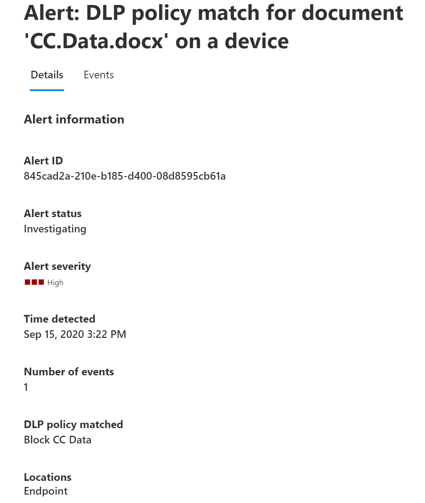

# 深入了解資料外洩防護Learn about data loss prevention

組織在其控制之下的敏感資訊，例如財務資料、專有資料、信用卡號碼、健康記錄或社會保險號碼。Organizations have sensitive information under their control such as financial data, proprietary data, credit card numbers, health records, or social security numbers. 為了協助保護這種敏感性資料，並降低風險，他們需要一種方式，以防止使用者不適當地與未安裝的人員共用。To help protect this sensitive data and reduce risk, they need a way to prevent their users from inappropriately sharing it with people who shouldn't have it. 這種作法稱為資料遺失防護 (DLP) 。This practice is called data loss prevention (DLP).

在 Microsoft 365 中，您可以定義及套用 DLP 原則，以執行資料遺失防護。In Microsoft 365, you implement data loss prevention by defining and applying DLP policies. 使用 DLP 原則，您可以識別、監視和自動保護不同的敏感專案：With a DLP policy, you can identify, monitor, and automatically protect sensitive items across:

- Microsoft 365 服務（如 Teams、Exchange、SharePoint 及 OneDrive）Microsoft 365 services such as Teams, Exchange, SharePoint, and OneDrive
- Office 的應用程式，例如 Word、Excel 及 PowerPointOffice applications such as Word, Excel, and PowerPoint
- Windows 10 端點Windows 10 endpoints
- 非 Microsoft cloud appnon-Microsoft cloud apps
- 內部部署檔案共用和內部部署 SharePoint。on-premises file shares and on-premises SharePoint.

Microsoft 365 使用深入的內容分析來偵測敏感專案，而不只是簡單的文字掃描。Microsoft 365 detects sensitive items by using deep content analysis, not by just a simple text scan. 會透過評估正則運算式、內建函式驗證，以及與主要資料比對接近的次要資料比對，來分析主要資料符合關鍵字的內容。Content is analyzed for primary data matches to keywords, by the evaluation of regular expressions, by internal function validation, and by secondary data matches that are in proximity to the primary data match. 除了該 DLP 之外，還會使用電腦學習演算法和其他方法，偵測符合您 DLP 原則的內容。Beyond that DLP also uses machine learning algorithms and other methods to detect content that matches your DLP policies.
  
## DLP 是較大 Microsoft 365 規範服務的一部分DLP is part of the larger Microsoft 365 Compliance offering

Microsoft 365DLP 只是其中一個 Microsoft 365 規範工具，可讓您在任何居住或旅行時，協助保護您的敏感專案。Microsoft 365 DLP is just one of the Microsoft 365 Compliance tools that you will use to help protect your sensitive items wherever they live or travel. 您應該瞭解 Microsoft 365 規範工具集合中的其他工具，如何 interrelate，以及如何搭配一起運作。You should understand the other tools in the Microsoft 365 Compliance tools set, how they interrelate, and work better together.  請參閱， [Microsoft 365 規範工具](protect-information.md)以深入瞭解資訊保護程式。See, [Microsoft 365 compliance tools](protect-information.md) to learn more about the information protection process.

## DLP 原則的保護性動作Protective actions of DLP policies

Microsoft 365DLP 原則是指如何監控使用者對靜止專案所採取的活動、傳輸中的敏感專案，或使用中的敏感專案，以及採取保護動作。Microsoft 365 DLP policies are how you monitor the activities that users take on sensitive items at rest, sensitive items in transit, or sensitive items in use and take protective actions. 例如，當使用者嘗試採取禁止的動作時（例如，將敏感專案複製到未核准的位置，或是在原則中所佈置的其他情況下）共用醫學資訊時，DLP 便可：For example, when a user attempts to take a prohibited action, like copying a sensitive item to an unapproved location or sharing medical information in an email or other conditions laid out in a policy, DLP can:

- 向使用者顯示彈出的原則提示，告知他們可能嘗試以不當的方式共用敏感專案show a pop-up policy tip to the user that warns them that they may be trying to share a sensitive item inappropriately
- 封鎖共用，並透過原則提示讓使用者覆寫封鎖，並捕獲使用者的合理性論證block the sharing and, via a policy tip, allow the user to override the block and capture the users' justification
- 封鎖不含覆寫選項的共用block the sharing without the override option
- 針對靜態的資料，可鎖定敏感專案並將其移至安全的隔離位置for data at rest, sensitive items can be locked and moved to a secure quarantine location
- 若為 Teams 聊天室，將不會顯示機密資訊。for Teams chat, the sensitive information will not be displayed

所有 DLP 監控的活動預設都會記錄到[Microsoft 365 的審計記錄](search-the-audit-log-in-security-and-compliance.md)，並路由傳送至[活動瀏覽器](data-classification-activity-explorer.md)。All DLP monitored activities are recorded to the [Microsoft 365 Audit log](search-the-audit-log-in-security-and-compliance.md) by default and routed to [Activity explorer](data-classification-activity-explorer.md). 當使用者執行符合 DLP 原則條件的動作，並已設定警示時，DLP 會在 [dlp 警示管理儀表板](dlp-configure-view-alerts-policies.md)中提供警示。When a user performs an action that meets the criteria of a DLP policy, and you have alerts configured, DLP provides alerts in the [DLP alert management dashboard](dlp-configure-view-alerts-policies.md).

## DLP 生命週期DLP lifecycle

DLP 實施通常會遵循這些主要階段。A DLP implementation typically follows these major phases.

- [規劃 DLPPlan for DLP](#plan-for-dlp)
- [準備 DLPPrepare for DLP](#prepare-for-dlp)
- [在生產環境中部署原則Deploy your policies in production](#deploy-your-policies-in-production)

<!--ADD DIAGRAM OF THE DLP LIFECYCLE WORK ON WITH MAS-->

### 規劃 DLPPlan for DLP

Microsoft 365DLP 監控和保護是使用者每天使用之應用程式的原生。Microsoft 365 DLP monitoring and protection are native to the applications that users use every day. 這有助於保護組織的敏感專案免受危險的活動，即使您的使用者 unaccustomed 到資料遺失防護思考和作法也是一樣。This helps to protect your organizations' sensitive items from risky activities even if your users are unaccustomed to data loss prevention thinking and practices. 如果您的組織和使用者是資料遺失防護做法的新資料，則 DLP 採用可能需要變更您的商務程式，而且將為您的使用者提供文化的轉變。If your organization and your users are new to data loss prevention practices, the adoption of DLP may require a change to your business processes and there will be a culture shift for your users. 不過，使用適當的規劃、測試及調整，您的 DLP 原則會保護您的機密專案，同時將任何潛在的業務程式中斷降到最低。But, with proper planning, testing and tuning, your DLP policies will protect your sensitive items while minimizing any potential business process disruptions.

**DLP 的技術規劃****Technology planning for DLP**

請記住，DLP 為技術可以監視和保護靜態資料、使用中的資料，以及在 Microsoft 365 服務、Windows 10 裝置、內部部署檔案共用和內部部署 SharePoint 中的動作中的資料。Keep in mind that DLP as a technology can monitor and protect your data at rest, data in use and data in motion across Microsoft 365 services, Windows 10 devices, on-premises file shares, and on-premises SharePoint. 針對不同的位置、您想要監視和保護的資料類型，以及當原則相符時所採取的動作，都有一定的計畫含義。There are planning implications for the different locations, the type of data you want to monitor and protect, and the actions to be taken when a policy match occurs.  

**規劃 DLP 的商務程式****Business processes planning for DLP**

DLP 原則可以封鎖禁止的活動，例如透過電子郵件不適當的敏感資訊共用。DLP policies can block prohibited activities, like inappropriate sharing of sensitive information via email. 當您規劃 DLP 原則時，您必須識別觸及機密專案的商務程式。As you plan your DLP policies, you must identify the business processes that touch your sensitive items. 業務程式擁有人可協助您識別應允許的適當使用者行為，以及應保護的使用者行為不當。The business process owners can help you identify appropriate user behaviors that should be allowed and inappropriate user behaviors that should be protected against. 您應該規劃您的原則，並以測試模式進行部署，並先評估其對 [活動瀏覽器](data-classification-activity-explorer.md) 的影響，再將其套用至更嚴格的模式。You should plan your policies and deploy them in test mode, and evaluate their impact via [activity explorer](data-classification-activity-explorer.md) first, before applying them in more restrictive modes.

**DLP 的組織文化環境規劃****Organizational culture planning for DLP**

成功的 DLP 執行相當於讓您的使用者訓練有素並 acclimated 資料遺失防護做法，因為這是一項完善的規劃和調整原則。A successful DLP implementation is as much dependent on getting your users trained and acclimated to data loss prevention practices as it is on well planned and tuned policies. 由於您的使用者非常介入，因此請務必規劃訓練。Since your users are heavily involved, be sure to plan for training for them too. 您可以在將原則強制從測試模式變更為限制性更高的模式之前，以策略性方式使用原則提示來提升使用者的知名度。You can strategically use policy tips to raise awareness with your users before changing the policy enforcement from test mode to more restrictive modes.

<!--For more information on planning for DLP, including suggestions for deployment based on your needs and resources, see [Planning for Microsoft 365 data loss prevention](dlp-plan-for-dlp.md).-->

### 準備 DLPPrepare for DLP

您可以將 DLP 原則套用到靜態資料、使用中的資料，以及位置中的動作資料，例如：You can apply DLP policies to data at rest, data in use, and data in motion in locations, such as:

- Exchange Online 電子郵件Exchange Online email
- SharePoint Online 網站SharePoint Online sites
- OneDrive 帳戶OneDrive accounts
- Teams 聊天和頻道訊息Teams chat and channel messages
- Microsoft 雲端 App 安全性Microsoft Cloud App Security
- Windows 10 裝置Windows 10 devices
- 內部部署存放庫On-premises repositories

每個必備項都有不同的必要條件。Each one has different pre-requisites. 某些位置的機密專案（例如 Exchange 線上）可以透過在 DLP 傘底下進行，只需設定套用至這些專案的原則。Sensitive items in some locations, like Exchange online, can be brought under the DLP umbrella by just configuring a policy that applies to them. 其他如內部部署檔案存放庫需要部署 Azure 資訊保護 (AIP) 掃描器。Others, such as on-premises file repositories require a deployment of Azure Information Protection (AIP) scanner. 在啟動任何封鎖動作之前，您需要準備您的環境、程式碼草稿原則，並加以徹底測試。You'll need to prepare your environment, code draft policies, and test them thoroughly before activating any blocking actions.

### 在生產環境中部署原則Deploy your policies in production

#### 設計您的原則Design your policies

請先定義您的控制目標，以及它們如何套用各個不同的工作負載。Start by defining your control objectives, and how they apply across each respective workload. 起草包含您目標的原則。Draft a policy that embodies your objectives. 您可以隨時從一個工作負載開始，也可以跨所有工作負載開始-尚無影響。Feel free to start with one workload at a time, or across all workloads - there's no impact yet.

#### 在測試模式中實施原則Implement policy in test mode

在測試模式中以 DLP 原則實施，以評估控制措施的影響。Evaluate the impact of the controls by implementing them with a DLP policy in test mode. [！注意事項] 您可以將原則套用至測試模式中的所有工作負載，這樣您就可以取得完整的結果，但是您可以在需要時從一個工作負載開始。It's ok to apply the policy to all workloads in test mode, so that you can get the full breadth of results, but you can start with one workload if you need to.

#### 監視結果和微調原則Monitor outcomes and fine-tune the policy

在測試模式中，監控原則的結果並微調它，使其符合您的控制目標，同時確保您不會對有效的使用者工作流程和生產力造成不良或不慎影響。While in test mode, monitor the outcomes of the policy and fine-tune it so that it meets your control objectives while ensuring you aren't adversely or inadvertently impacting valid user workflows and productivity. 以下是一些需要微調的範例：Here are some examples of things to fine-tune:

- 調整範圍內或範圍之外的位置和人員/位置adjusting the locations and people/places that are in or out of scope
- 調整用於判斷專案及其執行專案與原則相符時所用的條件和例外狀況tune the conditions and exceptions that are used to determine if an item and what is being done with it matches the policy
- 敏感資訊定義/秒the sensitive information definition/s
- 的動作the actions
- 限制層級the level of restrictions
- 新增控制項add new controls
- 新增人員add new people
- 新增受限制的應用程式add new restricted apps
- 新增受限制的網站add new restricted sites

#### 啟用控制項並調整原則Enable the control and tune your policies

一旦原則符合您的所有目標，請將其開啟。Once the policy meets all your objectives, turn it on. 繼續監視原則應用程式的結果，並視需要調整。Continue to monitor the outcomes of the policy application and tune as needed. 一般來說，原則會在開啟後的一小時內生效。In general, policies take effect about an hour after being turned on. <!--請參閱，連結至位置特定詳細資料的 Sla 相關主題--><!--See, LINK TO topic for SLAs for location specific  details-- >

## DLP 原則設定概述DLP policy configuration overview

您在建立和設定 DLP 原則方面具有彈性。You have flexibility in how you create and configure your DLP policies. 您可以從預先定義的範本開始，只需稍按幾下即可建立原則，或自行設計。You can start from a predefined template and create a policy in just a few clicks or you can design your own from the ground up. 不論選擇哪一個，所有 DLP 原則都需要您所需的資訊。No matter which you choose, all DLP policies require the same information from you.

1. **選擇您要監視** 的專案 Microsoft 365 隨附許多預先定義的原則範本，以協助您開始使用，也可以建立自訂原則。**Choose what you want to monitor** - Microsoft 365 comes with many predefined policy templates to help you get started or you can create a custom policy.
    - 預先定義的原則範本：金融資料、醫療和健康情況資料、各種國家和地區的隱私權資料。A predefined policy template: Financial data, Medical and health data, Privacy data all for various countries and regions.
    - 使用可用的敏感資訊類型、保留標籤和敏感度標籤的自訂原則。A custom policy that uses the available sensitive information types, retention labels, and sensitivity labels.
2. **選擇您要監視的位置** -您可以選擇一個或多個您想要 DLP 監控機密資訊的位置。**Choose where you want to monitor** - You pick one or more locations that you want DLP to monitor for sensitive information. 您可以監視：You can monitor:
    
位置location | 包含/排除依據include/exclude by|
|---------|---------|
|Exchange 電子郵件Exchange email| 通訊群組distribution groups|
|SharePoint 網站SharePoint sites |網站sites |
|OneDrive 帳戶OneDrive accounts |帳戶或通訊群組accounts or distribution groups |
|Teams 聊天和頻道訊息Teams chat and channel messages |帳戶accounts |
|Windows 10 裝置Windows 10 devices |使用者或群組user or group |
|Microsoft Cloud App SecurityMicrosoft Cloud App Security |執行個體instance |
|內部部署存放庫On-premises repositories| 存放庫檔路徑repository file path|

3. **選擇要套用至專案的原則必須符合的條件** -您可以接受預先設定的條件或定義自訂條件。**Choose the conditions that must be matched for a policy to be applied to an item** - you can accept pre-configured conditions or define custom conditions. 部分範例如下：Some examples are:

- 專案包含在特定內容中所使用的機密資訊的指定類型。item contains a specified kind of sensitive information that is being used in a certain context. 例如，95社會保險號碼會以電子郵件傳送給組織外部的收件者。For example, 95 social security numbers being emailed to recipient outside your org.
- 專案具有指定的敏感度標籤item has a specified sensitivity label
- 具有敏感資訊的專案會在內部或外部共用item with sensitive information is shared either internally or externally

4. **選擇符合原則條件時要採取的動作** -動作取決於發生活動的位置。**Choose the action to take when the policy conditions are met** - The actions depend on the location where the activity is happening.  部分範例如下：Some examples are:

- SharePoint/Exchange/OneDrive：封鎖位於組織表單以外存取內容的人員。SharePoint/Exchange/OneDrive: Block people who are outside your organization form accessing the content. 向使用者顯示提示，並傳送電子郵件通知，告知他們採取的是 DLP 原則所禁止的動作。Show the user a tip and send them an email notification that they are taking an action that is prohibited by the DLP policy.
- Teams聊天室及通道：封鎖在聊天或頻道中共用的敏感資訊Teams Chat and Channel: Block sensitive information from being shared in the chat or channel
- Windows 10裝置：審核或限制將敏感專案複製到可拆卸的 USB 裝置Windows 10 Devices: Audit or restrict copying a sensitive item to a removeable USB device 
- Office應用程式：顯示快顯視窗，通知使用者他們正在進入危險的行為和封鎖或封鎖，但允許覆寫。Office Apps: Show a popup notifying the user that they are engaging in a risky behavior and block or block but allow override.
- 內部部署檔案共用：將檔案從儲存位置移至隔離資料夾On-premises file shares: move the file from where it is stored to a quarantine folder

> [!NOTE]
> 條件和要採取的動作是定義在稱為規則的物件中。The conditions and the actions to take are defined in an object called a Rule.

<!--## Create a DLP policy

All DLP policies are created and maintained in the Microsoft 365 Compliance center. See, INSERT LINK TO ARTICLE THAT WILL START WALKING THEM THROUGH THE POLICY CREATION PROCEDURES for more information.-->

在規範中心建立 DLP 原則之後，它會儲存在中央原則存放區中，然後再同步處理至各種內容來源，包括：After you create a DLP policy in the Compliance Center, it's stored in a central policy store, and then synced to the various content sources, including:
  
- Exchange Online，再從這裡到 Outlook 網頁版和 Outlook。Exchange Online, and from there to Outlook on the web and Outlook.
- 商務用 OneDrive 網站。OneDrive for Business sites.
- SharePoint Online 網站。SharePoint Online sites.
- Office 桌上型電腦程式 (Excel、PowerPoint 及 Word)。Office desktop programs (Excel, PowerPoint, and Word).
- Microsoft Teams 頻道和聊天訊息。Microsoft Teams channels and chat messages.
    
原則同步處理至正確的位置之後，會開始評估內容並強制執行動作。After the policy's synced to the right locations, it starts to evaluate content and enforce actions.

## 查看原則應用程式結果Viewing policy application results

DLP 會將大量資訊從監控、原則比對和動作和使用者活動報告 Microsoft 365。DLP reports a vast amount of information into Microsoft 365 from monitoring, policy matches and actions, and user activities. 您必須使用該資訊並採取行動，以調整對機密專案所採取的原則及會審動作。You'll need to consume and act on that information to tune your policies and triage actions taken on sensitive items. 遙測會先處理[Microsoft 365 規範中心審核記錄](search-the-audit-log-in-security-and-compliance.md#search-the-audit-log-in-the-compliance-center)檔，並將其方式用於不同的報表工具。The telemetry goes into the [Microsoft 365 Compliance center Audit Logs](search-the-audit-log-in-security-and-compliance.md#search-the-audit-log-in-the-compliance-center) first, is processed, and makes its way to different reporting tools. 每個報告工具都有不同的用途。Each reporting tool has a different purpose.  

### DLP 警示儀表板DLP Alerts Dashboard

當 DLP 對機密專案採取動作時，您可以透過可設定的警示通知該動作。When DLP takes an action on a sensitive item, you can be notified of that action via a configurable alert. 「規範中心」可讓 [您在信箱](dlp-configure-view-alerts-policies.md)中進行鎖定，而不是讓您在信箱中進行這些警示。Rather than having these alerts pile up in a mailbox for you to sift through, the Compliance center makes them available in the [DLP Alerts Management Dashboard](dlp-configure-view-alerts-policies.md). 使用 [DLP 警示] 儀表板來設定警示、進行審閱、會審及追蹤 DLP 警示的解決方法。Use the DLP Alerts dashboard to configure alerts, review them, triage them and track resolution of DLP Alerts. 以下是從 Windows 10 裝置中的原則相符和活動所產生之警示的範例。Here's an example of alerts generated by policy matches and activities from Windows 10 devices.

> [!div class="mx-imgBorder"]
> 

您還可以在同一個儀表板中檢視具有豐富中繼資料的關聯事件的詳細資訊You can also view details of the associated event with rich metadata in the same dashboard

> [!div class="mx-imgBorder"]
> 

### 報告Reports

[DLP 報告](view-the-dlp-reports.md#view-the-reports-for-data-loss-prevention)會顯示隨時間的廣泛趨勢，並提供下列專案的特定見解：The [DLP reports](view-the-dlp-reports.md#view-the-reports-for-data-loss-prevention) show broad trends over time and give specific insights into:

- **DLP 原則符合** 時間，並依日期範圍、位置、原則或動作進行篩選**DLP Policy Matches** over time and filter by date range, location, policy, or action
- **DLP 事件** 比對會隨著時間而顯示相符專案，但會在專案上轉動，而不是原則規則。**DLP incident matches** also shows matches over time, but pivots on the items rather than the policy rules.
- **DLP false 正值和 overrides** 會顯示誤報計數，以及設定後的使用者覆寫（如果已設定）和使用者的理由。**DLP false positives and overrides** shows the count of false positives and, if configured, user-overrides along with the user justification.

### DLP 活動瀏覽器DLP Activity Explorer

DLP 頁面上的 [活動流覽] 索引標籤會將 *活動* 篩選器預先設定為 *DLPRuleMatch*。The Activity explorer tab on the DLP page has the *Activity* filter preset to *DLPRuleMatch*. 使用此工具可查看與包含機密資訊或已套用標籤之內容相關的活動，例如變更的標籤、檔已修改，以及符合規則。Use this tool to review activity related to content that contains sensitive info or has labels applied, such as what labels were changed, files were modified, and matched a rule.

如需詳細資訊，請參閱 [活動瀏覽器快速入門](data-classification-activity-explorer.md)For more information, see [Get started with activity explorer](data-classification-activity-explorer.md)

若要深入瞭解 Microsoft 365 DLP，請參閱：To learn more about Microsoft 365 DLP, see:

- [深入瞭解 Microsoft 365 端點資料外洩防護Learn about Microsoft 365 Endpoint data loss prevention](endpoint-dlp-learn-about.md)
- [了解 Microsoft Teams 中的預設資料外洩防護原則 (預覽)Learn about the default data loss prevention policy in Microsoft Teams (preview)](dlp-teams-default-policy.md)
- [深入了解 Microsoft 365 資料外洩防護內部部署掃描器 (預覽)Learn about the Microsoft 365 data loss prevention on-premises scanner (preview)](dlp-on-premises-scanner-learn.md)
- [了解 Microsoft 合規性擴充功能 (預覽)Learn about the Microsoft Compliance Extension (preview)](dlp-chrome-learn-about.md)
- [了解資料外洩防護警示儀表板Learn about the data loss prevention Alerts dashboard](dlp-alerts-dashboard-learn.md)

若要瞭解如何使用資料遺失防護來遵守資料隱私權規定，請參閱使用 Microsoft 365 (aka.ms/m365dataprivacy) [部署資料隱私權法規的資訊保護](../solutions/information-protection-deploy.md)。To learn how to use data loss prevention to comply with data privacy regulations, see [Deploy information protection for data privacy regulations with Microsoft 365](../solutions/information-protection-deploy.md)  (aka.ms/m365dataprivacy).