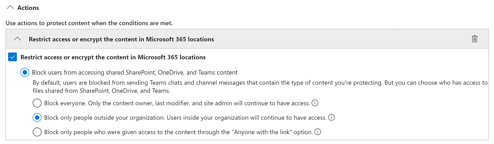
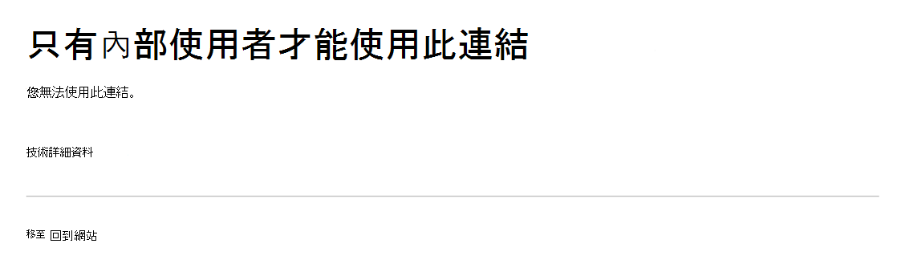

# 資料外洩防護和 Microsoft Teams

如果您的組織有資料遺失防護 (DLP) ，您可以定義原則，以防止人員在 Microsoft Teams 通道或聊天會話中共用機密資訊。 以下是此保護運作方式的一些範例：

- **範例1：保護郵件中的機密資訊**。 假設有人嘗試在 Teams 聊天室或頻道中共用機密資訊， (外部使用者) 的來賓。 如果您已定義 DLP 原則以避免發生這種情況，就會刪除郵件，其中包含傳送給外部使用者的敏感資訊。 這會根據您設定 DLP 原則的方式，自動進行，並在幾秒內進行。

    > [!NOTE]
    > 當與擁有下列專案的 Microsoft Teams 使用者共用時，Microsoft Teams 會封鎖機密內容的 DLP。 - 小組和頻道中的[來賓存取權](/MicrosoftTeams/guest-access);或 - 會議和聊天會話中的[外部存取](/MicrosoftTeams/manage-external-access)。 
只有當寄件者和收件者都在僅 Teams 模式中，且使用[Microsoft Teams 原生同盟](/microsoftteams/manage-external-access)時，才能使用 DLP。 DLP for Teams 不會封鎖使用商務用 Skype 或非原生同盟聊天會話之[interop](/microsoftteams/teams-and-skypeforbusiness-coexistence-and-interoperability#interoperability-of-teams-and-skype-for-business)的郵件。

- **範例2：保護檔中的機密資訊**。 假設有人嘗試與 Microsoft Teams 通道或聊天中的客人共用檔，而且檔中包含機密資訊。 如果您定義了 DLP 原則以避免發生這種情況，則不會對這些使用者開啟檔。 DLP 原則必須包括 SharePoint 和 OneDrive，才能隨時提供保護。 這是 SharePoint 的 DLP 範例，會顯示在 Microsoft Teams 中，因此要求使用者已取得 Office 365 的 dlp (的授權，包含在 Office 365 E3) 中，但不需要使用者授權 Office 365 進階合規性。 ) 

## Microsoft Teams 的 DLP 授權

[資料遺失防護](dlp-learn-about-dlp.md)功能已擴充，可納入 Microsoft Teams 聊天及通道訊息，包括下列專案的 **私人通道訊息**：

- Office 365E5/A5
- Microsoft 365 E5/A5
- Microsoft 365資訊保護和控管
- Office 365 進階合規性

Office 365 和 Microsoft 365 E3 包含 SharePoint 線上、OneDrive 及 Exchange Online 的 DLP 保護。 這也包括透過 Teams 共用的檔案，因為 Teams 使用 SharePoint 線上及 OneDrive 來共用檔案。

支援 Teams 聊天中的 DLP 保護需要 E5。

若要深入了解授權需求，請參閱 [Microsoft 365 租用戶層級服務授權指導方針](https://docs.microsoft.com/office365/servicedescriptions/microsoft-365-service-descriptions/microsoft-365-tenantlevel-services-licensing-guidance/microsoft-365-security-compliance-licensing-guidance)

> [!IMPORTANT]
> DLP 只適用于聊天或通道執行緒中的實際郵件。 活動通知--其中包括簡短的訊息預覽，而且會根據使用者的通知設定出現--**不** 會包含在 Teams DLP 中。 預覽中出現的郵件部分中的任何敏感資訊，即使已套用 DLP 原則並移除郵件本身的機密資訊之後，也會在通知中看到。

## DLP 保護的範圍

DLP 保護的套用方式不同于 Teams 的實體。

|使用者帳戶/群組/清單  |Teams實體 |DLP 保護可用|
|---------|---------|---------|
|個別使用者帳戶     |1： 1/n 聊天         |是         |
|     |一般聊天         |否         |
|     |共用通道         |否         |
|     |專用通道         |是         |
|安全性群組/通訊群組清單  | 1： 1/n 聊天         |是         |
|     |一般聊天         |否         |
|     |共用通道         |否      |
|     |專用通道         |是        |
|Microsoft 365 群組    |1： 1/n 聊天          |否         |
|     |一般聊天          |是        |
|     |共用通道|是 |
|     |專用通道|否| 

## 原則提示有助於教育使用者

與 dlp 在[Exchange、Outlook、Outlook 網頁](data-loss-prevention-policies.md#policy-evaluation-in-exchange-online-outlook-and-outlook-on-the-web)、 [SharePoint 線上、商務用 OneDrive 網站](data-loss-prevention-policies.md#policy-evaluation-in-onedrive-for-business-and-sharepoint-online-sites)及[Office 桌面用戶端](data-loss-prevention-policies.md#policy-evaluation-in-the-office-desktop-programs)的運作方式類似，當使用 DLP 原則來觸發動作時，就會出現原則提示。 以下是原則提示的範例：

在此，寄件者嘗試在 Microsoft Teams 通道中共用社會安全號碼。 **我可以做什麼？** link 開啟對話方塊，為寄件者提供選項，以解決問題。 請注意，寄件者可以選擇覆寫原則，或通知系統管理員複查和解決該原則。

在您的組織中，您可以選擇允許使用者覆寫 DLP 原則。 當您設定 DLP 原則時，您可以使用預設原則提示，或 [自訂群組織的原則提示](#to-customize-policy-tips) 。

傳回我們的範例，其中寄件者在 Teams 通道中共用社會保險號碼，以下是收件者看到的功能：

> [!div class="mx-imgBorder"]
> 

### 自訂原則提示

若要執行這項工作，您必須被指派為具有編輯 DLP 原則權限的角色。 若要深入瞭解，請參閱 [許可權](data-loss-prevention-policies.md#permissions)。

1. 移至 [規範中心] ([https://compliance.microsoft.com](https://compliance.microsoft.com)) 並登入]。

2. 按一下 ****[資料外洩防護]  > ****[原則]。

3. 選取原則，然後按一下 [ **原則設定**] 旁的 [ **編輯**]。

4. 請建立新的規則，或編輯原則的現有規則。

    > [!div class="mx-imgBorder"]
    > 

5. 在 [ **使用者通知** ] 索引標籤上，選取 [ **自訂電子郵件文字** 和/或 **自訂原則提示文字** 選項]。

    > [!div class="mx-imgBorder"]
    >    

6. 指定您要用於電子郵件通知和/或原則提示的文字，然後選擇 [ **儲存**]。

7. 在 [ **原則設定** ] 索引標籤上，選擇 [ **儲存**]。

針對您的變更，允許大約一小時以透過您的資料中心進行，並同步處理至使用者帳戶。
 <!-- why are these syncing to user accounts? -->

## 將 Microsoft Teams 新增為現有 DLP 政策的位置

若要執行這項工作，您必須被指派為具有編輯 DLP 原則權限的角色。 若要深入瞭解，請參閱 [許可權](data-loss-prevention-policies.md#permissions)。

1. 移至 [規範中心] ([https://compliance.microsoft.com](https://compliance.microsoft.com)) 並登入]。

2. 按一下 ****[資料外洩防護]  > ****[原則]。

3. 選取原則，並查看 [ **位置**] 底下的值。 如果您看到 **Teams 聊天及通道郵件**，就會全部設定。 如果不是，請按一下 [ **編輯**]。

    > [!div class="mx-imgBorder"]
    > 

4. 在 [**狀態**] 欄中，為 **Teams 聊天及通道郵件** 開啟原則。

    > [!div class="mx-imgBorder"]
    > 

5. 在 [ **選擇位置** ] 索引標籤上，保留 [所有帳戶] 的預設設定，或選取 **[讓我選擇特定位置**]。 您可以指定：

    1. 包含或排除的個別帳戶最多1000個
    1. 要包含或排除的通訊群組清單和安全性群組。 
    <!-- 1. the shared mailbox of a shared channel. **This is a public preview feature.**--> 
    
6. 接著選擇 [下一步]。

7. 按一下 **[儲存]**。

針對您的變更，允許大約一小時以透過您的資料中心進行，並同步處理至使用者帳戶。
<!-- again, why user accounts? -->

## 定義 Microsoft Teams 的新 DLP 原則

若要執行這項工作，您必須被指派為具有編輯 DLP 原則權限的角色。 若要深入瞭解，請參閱 [許可權](data-loss-prevention-policies.md#permissions)。

1. 移至 [規範中心] ([https://compliance.microsoft.com](https://compliance.microsoft.com)) 並登入]。

2. 選擇 ****[資料外洩防護]  > ****[原則]  > ****[+ 建立原則]。

3. 選擇 [範本](data-loss-prevention-policies.md#dlp-policy-templates)，然後選擇 **[下一步]**。

    在我們的範例中，我們選擇美國個人身分識別資訊資料範本。

    > [!div class="mx-imgBorder"]
    >  

4. 在 [ **命名您的原則** ] 索引標籤上，指定原則的名稱和描述，然後選擇 **[下一步]**。

5. 在 [ **選擇位置** ] 索引標籤上，保留 [所有帳戶] 的預設設定，或選取 **[讓我選擇特定位置**]。 您可以指定：

    1. 包含或排除的個別帳戶最多1000個
    1. 要包含或排除的通訊群組清單和安全性群組。 **這是公開預覽功能。**
    <!-- 1. the shared mailbox of a shared channel. **This is a public preview feature.**-->  

    

    > [!NOTE]
    > 如果您想要確定包含機密資訊的檔不會在 Teams 中不當共用，請確定已開啟 **SharePoint 網站** 和 **OneDrive 帳戶**，以及 **Teams 聊天及通道訊息**。

6. 在 [ **原則設定** ] 索引標籤的 **[自訂您要保護的內容類型**] 底下，保留預設的簡單設定，或選擇 [ **使用高級設定**]，然後選擇 [ **下一步]**。 如果您選擇 [高級設定]，您可以建立或編輯原則的規則。 若要取得此相關協助，請參閱 [簡易設定與高級設定](data-loss-prevention-policies.md#simple-settings-vs-advanced-settings)。

7.  在 [ **原則設定** ] 索引標籤的 [ **如果偵測到機密資訊，您要做什麼？**] 中，複查設定。 您可以在這裡選擇保留預設 [原則提示和電子郵件通知](use-notifications-and-policy-tips.md)，或加以自訂。

    > [!div class="mx-imgBorder"]
    > 

    完成複查或編輯設定後，請選擇 **[下一步]**。

8. 在 [ **原則設定** ] 索引標籤上的 [ **您要先開啟原則或測試內容嗎？**] 中，選擇是否要開啟原則、 [先進行測試](dlp-overview-plan-for-dlp.md#policy-deployment)，或是現在保持關閉狀態，然後選擇 **[下一步]**。

    > [!div class="mx-imgBorder"]
    > 

9. 在 [ **複查您的設定** ] 索引標籤上，複查新原則的設定。 選擇 [ **編輯** ] 進行變更。 完成作業後，請選擇 [ **建立**]。

針對您的新原則，允許大約一小時以透過您的資料中心進行，並同步處理至使用者帳戶。

## 防止外部存取敏感性文件

若要確保外部來賓無法存取包含機密資訊的 SharePoint 檔，請從 SharePoint 或 Teams 預設，選取下列各項：

- 您可以在 DLP 掃描時，確保檔受到保護，並將新的檔案標示 [為機密](/sharepoint/sensitive-by-default)，將其標記為安全可供共用。

- 建議的 DLP 原則結構

    - **Conditions**
        - 內容包含下列任何敏感資訊類型： [選取所有適用專案]
        
        - 內容共用自 Microsoft 365 與組織外部的人員
        
          > [!div class="mx-imgBorder"]
          > 

    - **Actions**
        - 限制外部使用者對內容的存取
        
        - 透過電子郵件和原則提示通知使用者
        
        - 傳送事件報告給系統管理員
        
        > [!div class="mx-imgBorder"]
        > 

當嘗試在包含外部來賓的敏感資訊 SharePoint 中共用檔時，執行中的 DLP 原則：

> [!div class="mx-imgBorder"]
> 

DLP 原則的動作當來賓嘗試在具有封鎖外部的 Teams 中開啟檔時：

> [!div class="mx-imgBorder"]
> 

## 相關文章

- [建立、測試及調整 DLP 原則](create-test-tune-dlp-policy.md)
- [針對 DLP 原則傳送電子郵件通知並顯示原則提示](use-notifications-and-policy-tips.md)
