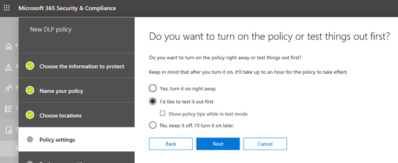

# 数据丢失防护与微软团队

> [!NOTE]
> 最近，Microsoft Teams 聊天和频道消息中添加了数据丢失防护功能，这些功能适用于获得 Office 365 高级合规性许可的用户，该功能可作为独立选项提供，并包含在 Office 365 E5 和 Microsoft 365 E5 合规性中。 Office 365 和 Microsoft 365 E3 包括针对共享点联机、OneDrive 和联机交换的 DLP 保护。 这还包括通过 Teams 共享的文件，因为团队使用 SharePoint Online 和 OneDrive 来共享文件。
支持团队聊天中的 DLP 保护需要 E5。
要了解有关许可要求详细信息，请参阅[Microsoft 365 租户级服务许可指南](https://docs.microsoft.com/office365/servicedescriptions/microsoft-365-service-descriptions/microsoft-365-tenantlevel-services-licensing-guidance)。

## 微软团队的 DLP 概述

最近，[数据丢失防护](data-loss-prevention-policies.md)（DLP） 功能已扩展为包括 Microsoft Teams 聊天和频道消息。 如果您的组织具有 DLP，您现在可以定义阻止人们在 Microsoft Teams 频道或聊天会话中共享敏感信息的策略。 以下是此保护的工作原理的一些示例：

- **示例 1：保护消息中的敏感信息。** 假设有人试图在 Teams 与来宾（外部用户）的聊天或频道中共享敏感信息。 如果定义了 DLP 策略以防止这种情况，则将删除包含发送给外部用户的敏感信息的邮件。 根据 DLP 策略的配置方式，这会自动发生，并在几秒钟内发生。

    > [!NOTE]
    > 微软团队的 DLP 在与具有以下内容的 Microsoft Teams 用户共享时阻止敏感内容： - [团队和渠道中的访客访问;](https://docs.microsoft.com/MicrosoftTeams/guest-access)或 - 会议和聊天会话中的[外部访问。](https://docs.microsoft.com/MicrosoftTeams/manage-external-access) 
仅当发送方和接收方处于"仅组"模式并使用[Microsoft Teams 本机联合](https://docs.microsoft.com/microsoftteams/manage-external-access)时，外部聊天会话的 DLP 才起作用。 团队的 DLP[不会阻止与](https://docs.microsoft.com/microsoftteams/teams-and-skypeforbusiness-coexistence-and-interoperability#interoperability-of-teams-and-skype-for-business)Skype 交互的消息，也不会阻止 Skype 进行业务或非本机联合聊天会话。

- **示例 2：保护文档中的敏感信息。** 假设有人尝试与 Microsoft Teams 频道或聊天中的来宾共享文档，并且该文档包含敏感信息。 如果定义了 DLP 策略以防止这种情况，则不会为这些用户打开文档。 请注意，在这种情况下，您的 DLP 策略必须包括 SharePoint 和 OneDrive，才能提供保护。 （这是 Microsoft Teams 中显示的 SharePoint 的 DLP 示例，因此要求用户获得 Office 365 DLP（包含在 Office 365 E3 中）的许可，但不需要用户获得 Office 365 高级合规性的许可。

## 策略提示有助于教育用户

与 DLP 在[Exchange、Outlook、Web 上 Outlook、](data-loss-prevention-policies.md#policy-evaluation-in-exchange-online-outlook-and-outlook-on-the-web)[共享点联机、企业网站的 OneDrive](data-loss-prevention-policies.md#policy-evaluation-in-onedrive-for-business-and-sharepoint-online-sites)和[Office 桌面客户端](data-loss-prevention-policies.md#policy-evaluation-in-the-office-desktop-programs)中的工作方式类似，当操作与 DLP 策略冲突时，会出现策略提示。 下面是策略提示的示例：

在这种情况下，发件人试图在 Microsoft Teams 频道中共享一个社会安全号码。 "**我能做什么？"** 链接将打开一个对话框，该对话框为发件人提供解决问题的选项。 请注意，在这种情况下，发件人可以选择重写策略，或通知管理员查看和解决策略。

在组织中，您可以选择允许用户覆盖 DLP 策略。 而且，在配置 DLP 策略时，可以使用默认策略提示，或为组织[自定义策略提示。](#to-customize-policy-tips) 

回到我们的示例，发件人在 Teams 频道中共享了一个社会保险号，以下是收件人看到的内容：

**"这是什么？"** 链接将打开一篇关于 DLP 策略[的文章，](data-loss-prevention-policies.md)这有助于解释邮件被阻止的原因。

### 自定义策略提示

要执行此任务，必须为您分配一个具有编辑 DLP 策略的权限的角色。 要了解更多信息，请参阅[权限](data-loss-prevention-policies.md#permissions)。

1. 转到 Office 365 安全&合规性中心[https://protection.office.com](https://protection.office.com)（ ） 并登录。

2. 选择**数据丢失防护** > **策略**。 

3. 选择策略，**在"策略设置"** 旁边选择"**编辑"。**

4. 创建新规则或编辑策略的现有规则。  

5. 在"**用户通知"** 选项卡上，**选择"自定义电子邮件文本"** 和/**或"自定义策略提示文本**选项"。    

6. 指定要用于电子邮件通知和/或策略提示的文本，然后**选择"保存"。** 

7. 在"**策略设置"** 选项卡上，**选择"保存"。**

等待大约一个小时，让您的更改通过数据中心工作并同步到用户帐户。
 <!-- why are these syncing to user accounts? -->
## 将 Microsoft 团队作为位置添加到现有 DLP 策略

要执行此任务，必须为您分配一个具有编辑 DLP 策略的权限的角色。 要了解更多信息，请参阅[权限](data-loss-prevention-policies.md#permissions)。

1. 转到 Office 365 安全&合规性中心[https://protection.office.com](https://protection.office.com)（ ） 并登录。

2. 选择**数据丢失防护** > **策略**。 

3. 选择策略，并**查看"位置"** 下的值。 如果您看到**团队聊天和频道消息，** 您都已设置。 如果没有，请单击"**编辑"。**  

4. 在"**状态"** 列中，**打开"团队聊天"和"频道消息"** 的策略。  

5. 保留所有帐户的默认设置，或指定要包括或排除哪些帐户。

6. 按一下 [儲存]****。

等待大约一个小时，让您的更改通过数据中心工作并同步到用户帐户。
<!-- again, why user accounts? -->
## 为微软团队定义新的 DLP 策略

要执行此任务，必须为您分配一个具有编辑 DLP 策略的权限的角色。 要了解更多信息，请参阅[权限](data-loss-prevention-policies.md#permissions)。

1. 转到 Office 365 安全&合规性中心[https://protection.office.com](https://protection.office.com)（ ） 并登录。

2. 选择**数据丢失防护** > **策略** > **+ 创建策略**。 

3. 选择一个[模板，](data-loss-prevention-policies.md#dlp-policy-templates)然后选择"**下一步"。** 在我们的示例中，我们选择了美国个人身份信息数据模板。  

4. 在"**为策略命名"** 选项卡上，为策略指定名称和说明，然后选择"**下一步"。** 

5. 在"**选择位置"** 选项卡上，保留所有位置的默认设置，或**选择"让我选择特定位置"，** 然后选择"**下一步"。** 如果选择了特定位置，请为 DLP 策略选择这些位置，然后选择"**下一步"。**  
    > [!NOTE]
    > 如果要确保包含敏感信息的文档不会不适当地共享，请确保**SharePoint 站点**和**OneDrive 帐户**以及**Teams 聊天和频道消息**处于打开状态。
 

6. 在"**策略设置"** 选项卡上，在"**自定义要保护的内容类型""** 中保留默认简单设置，或**选择"使用高级设置"，** 然后选择"**下一步"。** 如果选择高级设置，则可以为策略创建或编辑规则。 （要获取有关此的帮助，请参阅[简单设置与高级设置。](data-loss-prevention-policies.md#simple-settings-vs-advanced-settings)

7.  在"**策略设置"** 选项卡上，**在"如果我们检测到敏感信息时，您希望做什么？"**，查看设置。 （您可以在此处选择保留默认[策略提示和电子邮件通知，](use-notifications-and-policy-tips.md)或对其进行自定义。  完成审阅或编辑设置后，选择"**下一步"。**

8. 在"**策略设置"** 选项卡上，在"**是否要打开策略或先测试内容？"，** 选择是打开策略，[先测试它，](data-loss-prevention-policies.md#roll-out-dlp-policies-gradually-with-test-mode)还是立即将其关闭，然后选择"**下一步"。**  

9. 在"**查看设置"** 选项卡上，查看新策略的设置。 **选择"编辑"** 进行更改。 完成后，**选择"创建"。** 

等待大约一个小时，让新策略通过数据中心并同步到用户帐户。

## 相關文章

[建立、測試及調整 DLP 原則](create-test-tune-dlp-policy.md)

[針對 DLP 原則傳送電子郵件通知並顯示原則提示](use-notifications-and-policy-tips.md)
