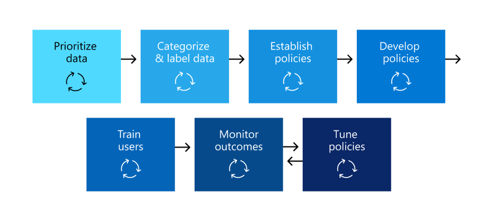
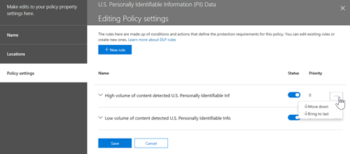

# 規劃資料遺失防護 (DLP) 

每個組織會以不同的方式規劃及實施資料遺失防護 (DLP) ，因為每個組織的業務需求、目標、資源及情況都是唯一的。 不過，所有成功的 DLP 實現都有通用的元素。 本文提供在其 DLP 規劃中組織所使用的最佳作法。

## 多個起始點

許多組織會選擇實施 DLP，以遵守各種政府或工業規定。 例如，歐盟的一般資料保護法規 (GDPR) ，或是健康保險業便攜性和責任法案 (HIPAA) 或加州消費者隱私權法案 (CCPA) 。 他們也會執行資料遺失防護，以保護其智慧財產權。 但 DLP 旅程中的開始位置和終極目的地各不相同。 

組織可以開始其 DLP 旅程：

- 從平臺焦點，像是在 Teams 聊天和通道郵件或 Windows 10 裝置上保護資訊的需要
- 瞭解他們想要設定保護的敏感資訊，例如衛生護理記錄，並直接定義原則以加以保護
- 不知道其機密資訊的所在位置，以及誰在什麼地方執行什麼，如此一來，他們就能發現和分類，並採取一種更具系統手段的方法。
- 不知道其機密資訊的來源或所在位置，或誰在做什麼，但他們會直接移動以定義原則，並使用這些結果作為開始地點，然後從那裡精煉其原則。
- 知道他們必須實施完整的 Microsoft 365 資訊保護堆疊，所以想要花更長的字詞，系統方式

以下是一些客戶如何使用 dlp 的範例，以及您從何處開始，Microsoft 365 DLP 都有足夠的彈性，可容納各種類型的資訊保護 journeys，從開始到完全意識的資料遺失防護策略。 

## 規劃程式的概覽

[深入瞭解資料遺失防護](dlp-learn-about-dlp.md#learn-about-data-loss-prevention)引進了[DLP 規劃](dlp-learn-about-dlp.md#plan-for-dlp)程式的三個不同方面。 我們將深入瞭解所有 DLP 計畫共有的元素。

### 識別專案關係人

實施時，DLP 原則可以套用到組織的大型部分。 它無法自行開發各種各樣的計畫，也不會產生負面影響。 您必須識別可以進行下列作業的利益關係人：

- 描述您的組織受制于的規章、法律和工業標準
- 要保護的敏感專案類別
- 在其中使用的商務程式
- 應該限制的危險行為
- 根據相關專案和風險的敏感度，以優先處理應該先保護的資料
- 概述 DLP 原則比對事件複查和修正程式 
 
一般來說，這些需求通常是85% 的規章和合規性保護，以及15% 的智慧財產權防護。 以下是有關在規劃程式中包含之角色的一些建議：

- 規範和合規性監察官
- 主要風險監察官
- 法律監察官
- 安全性與合規性監察官
- 資料項目的企業擁有者
- 商務使用者
- IT

### 描述要保護的敏感資訊類別

然後，干係人會描述要保護的敏感資訊類別，以及其所用的商務程式。 例如，Microsoft 365 DLP 會定義下列類別：

- 金融業 
- 醫療和健康情況資訊
- 隱私權
- 自訂

因為「我們是資料處理器，所以相關者可能會識別敏感資訊，因此我們必須對資料主體資訊和財務資訊執行隱私權保護」。

 
  <!-- The business process is important as it informs the ‘data at rest’, ‘data in transit’, ‘data in use’ aspect of DLP planning and who should be sharing the items and who should not.-->

### 設定目標與策略

一旦您識別出您的利益關係人，而且知道哪些機密資訊需要保護，以及其使用的位置，專案關係人就能設定其保護目標，而且可以制定實施計畫。 

 <!--
### Discovery
 for the locations (DLP workloads) of these types of items.  (mapping DLP locations and data at rest, data in transit, data in use)

### IT can start coding test policies
start small and always in test mode. Note that DLP policies can feed into insider risk.

### Business process owners help with tuning
 false positive/false negative results and fitting DLP into their business processes.

-->

### 設定實施方案

您的實施計畫應包括：

- 對應您的起始狀態和期望的結束狀態，以及從一到另一個中取得的步驟。
- 如何處理機密專案的探索
- 原則規劃，以及其所要執行的順序
- 您將如何處理任何必要條件
- 在移動至強制執行之前，先規劃如何測試原則
- 如何訓練您的使用者
- 測試及調整原則的方式
- 如何根據變更法規、法律、行業標準或智慧財產權保護和業務需求，檢查和更新資料遺失防護策略

#### 從開始到想要的結束狀態對應出路徑

記錄您的組織從其開始狀態到所需結束狀態的方式，對與您的專案關係人進行通訊和設定專案範圍而言是必要的。 以下是一組一般用於部署 DLP 的步驟。 您將需要更詳細的資訊，但您可以使用此程式來圖文 DLP 採用路徑。

#### 敏感專案探索

有多種方式可以發現個別機密專案的所在位置和位置。 您可能已經部署了靈敏度標籤，或已決定將非常廣泛的 DLP 原則部署到只探索及審核專案的所有位置。 若要深入瞭解，請參閱 [瞭解您的資料](information-protection.md#know-your-data)。

#### 原則規劃

當您開始 DLP 採用時，您可以使用這些問題，將您的原則設計與實施工作重點放在一起。

##### 您的組織必須遵守哪些法律、法規和行業標準？

由於許多組織會隨著法規遵從性目標進入 DLP，所以回答此問題是規劃 DLP 實現的自然起點。 不過，隨著 IT 的實施，您可能不會進行解答。 您必須由法律小組和商務主管人員解答。 
 
**範例** 您的組織受制于英國 金融規章。

##### 您的組織必須保護哪些敏感專案，使其不會洩漏？

當您的組織知道其在法規遵從性需求方面的含義時，您將會瞭解哪些敏感專案需要保護以避免洩漏，以及您要如何設定原則實施的優先順序，以加以保護。 這可協助您選擇最適當的 DLP 原則範本。 Microsoft 365 隨附的是針對財務、醫療和健康情況、隱私權的預先設定 DLP 範本，您可以使用自訂範本自行建立。 在您設計及建立實際的 DLP 原則時，知道問題的答案也會協助您選擇正確的 [敏感資訊類型](sensitive-information-type-learn-about.md#learn-about-sensitive-information-types)。

**範例** 若要快速開始，請選取 `U.K. Financial Data` 原則範本，包含 `Credit Card Number` 、 `EU Debit Card Number` 和 `SWIFT Code` 敏感資訊類型。 

##### 機密專案及其相關的商務程式在哪裡？

包含組織機密資訊的專案每天都會在經營過程中使用。 您必須知道敏感資訊的實例可能發生的位置，以及其所使用的商務程式。 這可協助您選擇要將 DLP 原則套用至哪個適當位置。 Microsoft 365DLP 原則會套用至下列位置：

- Exchange 電子郵件
- SharePoint 網站
- OneDrive 帳戶
- Teams 聊天和頻道訊息
- Windows 10設備
- Microsoft 雲端 App 安全性
- 內部部署存放庫

**範例** 您組織的內部稽核員正在追蹤一組信用卡號碼。 它們會在安全的 SharePoint 網站中保存它們的試算表。 有些員工會製作副本，並將其儲存到與其 Windows 10 裝置同步處理商務用 OneDrive 網站。 其中一個會在電子郵件中貼上其中的14個清單，並嘗試將其傳送至外部審計員進行審閱。 您想要將原則套用至安全 SharePoint 網站，所有內部稽核員商務用 OneDrive 帳戶、其 Windows 10 裝置及 Exchange 電子郵件。

##### 您的組織的洩漏容限程度為何？

您組織中的不同群組可能會有不同的觀點，也就是可接受的敏感專案洩漏層級和不是什麼。 取得零次洩漏的完美，可能會導致公司成本過高。

**範例** 組織的安全性群組和法律小組都會感覺，您應該不會與組織外的任何人共用信用卡號碼，而且堅持使用零的洩漏。 不過，當您定期複查信用卡號碼活動時，內部稽核員必須與協力廠商審計員共用某些信用卡號碼。 如果您的 DLP 原則禁止所有共用該組織外部的信用卡號碼，則可能會有重要的業務流程中斷，增加成本以降低內部稽核員完成其追蹤的中斷順序。 這種額外的成本對執行能力的領導作用不可接受。 若要解決此問題，您必須要有內部交談才能決定可接受的洩漏層級。 一旦決定原則，便可為特定個人提供例外狀況，以共用資訊，或以「僅供審核」模式套用。

#### 規劃必要條件

在您可以監視某些 DLP 位置之前，必須符合必要的必要條件。 **開始之前**，請參閱下列各節：

- [開始使用資料外洩防護內部部署掃描器 (預覽)](dlp-on-premises-scanner-get-started.md#before-you-begin)
- [開始使用端點資料外洩防護](endpoint-dlp-getting-started.md#before-you-begin)
- [開始使用 Microsoft 規範擴充 (預覽) ](dlp-chrome-get-started.md#before-you-begin)
- [使用非 Microsoft cloud app 的資料遺失防護原則 (預覽) ](dlp-use-policies-non-microsoft-cloud-apps.md#before-you-begin)

#### 原則部署

建立 DLP 原則時，您應考慮逐漸推出這些原則，以便在完全強制執行之前評估其影響及測試其效果。 例如，您不想讓新的 DLP 原則無意間封鎖存取數千份檔，或中斷現有的商務程式。
  
如果您正在建立的 DLP 原則可能有重大影響，建議依照下列順序進行：
  
1. **以測試模式啟動但不顯示原則提示**，然後使用 DLP 報告和任何事件報告來評估影響。 您可以使用 DLP 報告來檢視原則相符項目的號碼、位置、類型和嚴重性。 根據結果，您可以視需要微調原則。 在測試模式中，DLP 原則不會影響您的組織中工作人員的生產力。 此外，您也可以使用此階段測試工作流程，以進行 DLP 事件評審及問題修復。
    
2. **移至具有通知和原則提示的測試模式**，讓您可以開始向使用者講授您的規範原則，並為將要套用的原則做好準備。 其可提供組織原則頁面的連結，以提供原則提示中原則的其他詳細資料。 在此階段中，您也可以要求使用者報告誤報，以便進一步精煉原則。 一旦您確信原則應用程式的結果符合他們的利益關係人的觀點，請移至此階段。 
    
3. **開始完整強制執行原則**，以便套用規則中的動作，並保護內容。 繼續監視 DLP 報告以及任何事件報告或通知，確保得到您想要的結果。 

    

    您可以隨時關閉 DLP 原則，關閉會影響原則中的所有規則。 不過，也可以藉由在規則編輯器中切換每個規則的狀態來個別關閉規則。

    

    您也可以變更原則中多個規則的優先順序。 若要這樣做，請開啟原則進行編輯。 在規則列中，選擇省略符號 (**...**)，然後選擇一個選項，例如 **[下移]** 或 **[移至最後]**。

    

#### 使用者訓練

當您觸發 DLP 原則時，您可以設定您的原則，以 [傳送電子郵件通知，並向系統管理員和使用者顯示 DLP 原則的原則秘訣](use-notifications-and-policy-tips.md#send-email-notifications-and-show-policy-tips-for-dlp-policies) 。 雖然您的原則仍在測試模式中，而且在設定為強制執行封鎖動作之前，原則提示是有效的方式，可以進一步瞭解敏感專案的危險行為，並訓練使用者避免未來的行為。  

#### 檢查 DLP 需求和更新策略

您的組織可能會隨著時間而變更的規章、法律和行業標準，DLP 的商務目標也會隨之變更。 請務必定期查看所有這些區域，使您的組織維持在法規遵從性之外，而且 DLP 實施仍可滿足您的業務需求。

## 部署方法

|客戶業務需求說明  | 方法  |
|---------|---------|
|**Contoso Bank** 位於高度管制的行業，在許多不同的位置有許多不同類型的敏感專案。   -瞭解哪些類型的敏感資訊是最重要的。   -當原則向外展開時，必須將業務中斷降至最低。   -有 IT 資源，而且可以聘用專家協助規劃、設計部署   -與 Microsoft 有 premier 支援合同| -請花些時間瞭解他們必須遵守哪些規章，以及這些法規的遵守方式。   -請花時間深入瞭解 Microsoft 365 資訊保護堆疊的整體價值   -針對已設定優先順序的專案，開發敏感度標籤配置，並套用   -包含業務程式擁有者  -設計/程式碼原則，在測試模式中部署，以訓練使用者  -重複|
|**TailSpin 玩具** 不知道其所在的位置或位置，且幾乎不會有任何資源深度。 它們會大量使用 Teams、ODB 及 Exchange。     |-從優先位置的簡單原則開始。  -監視識別的專案  -據此套用敏感度標籤  -調整原則，訓練使用者       |
|**Fabrikam** 是一小的啟動，想要保護其智慧財產權，而且必須快速移動。 他們願意專用一些資源，但無法承受聘用在專家之外的人員。  -敏感專案全都位於商務用 Microsoft 365 OneDdrive 中/SharePoint  -商務用 OneDrive 和 SharePoint 的採用速度緩慢、員工/陰影使用 DropBox 和 Google 磁片磁碟機來共用/儲存專案  -員工在資料保護訓練科目上的工作速度  -客戶 splurged 並購買所有18位員工新 Windows 10 裝置     |-利用 Teams 中的預設 DLP 原則  -使用 SharePoint 專案的預設限制設定  -部署防止外部共用的原則  -部署設定優先順序的位置的原則  -部署 Windows 10 裝置的原則  -封鎖上載至非商務用 OneDrive 雲端儲存      |

<!--

## Planning for workloads

### Exchange

### SharePoint

### OneDrive for Business

### Teams

### Windows 10 Devices

### Microsoft Cloud App Security (MCAS)

### On-premises Scanner
-->

## 請參閱
- [深入了解資料外洩防護](dlp-learn-about-dlp.md#learn-about-data-loss-prevention)
