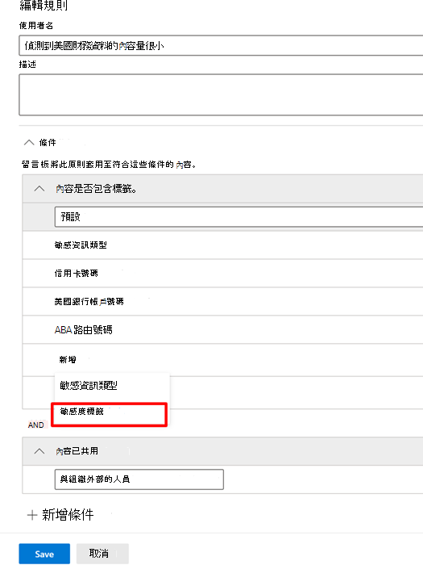

# 使用敏感度標籤作為 DLP 原則中的條件 (預覽)

針對這些位置，您可以在 DLP 原則中使用[敏感度標籤](sensitivity-labels.md)做為條件：

- Exchange Online 電子郵件
- SharePoint Online
- 商務用 OneDrive 網站
- Windows 10 裝置

敏感度標籤會顯示為**內容包含**清單的選項。

> [!div class="mx-imgBorder"]
> 

> [!IMPORTANT]
> 若您選取 **Teams 聊天和頻道訊息** 為套用 DLP 原則的位置，將無法以 **敏感度標籤** 做為條件。

## 支援的項目、案例和原則提示

您可以針對這些項目使用敏感度標籤做為條件，並在這些案例中使用。

### 不支援的項目

|服務  |項目類型  |可用於原則提示  |強制  |
|---------|---------|---------|---------|
|Exchange    |電子郵件         |是         |是         |
|Exchange    |電子郵件附件         |否 *         |否 *         |
|SharePoint Online     |SharePoint Online 中的項目         |是         |是         |
|商務用 OneDrive     |項目         |是         |是         |
|Teams     |Teams 和頻道訊息         |不適用         |不適用         |
|Teams     |附件         |是 **         |是 **         |
|Windows 10 裝置 (預覽)     |項目         |是         |是         |
|MCAS (預覽) |項目         |是         |是         |

\* 支援電子郵件上敏感度標籤的 DLP 偵測。 不支援標示敏感度電子郵件附件的 DLP 偵測。

\** 在 Teams 中透過 1 對 1 聊天或頻道傳送的附件，會自動上傳至 [商務用 OneDrive] 和 SharePoint。 因此，如果將 SharePoint Online 或 [商務用 OneDrive] 包含在您的 DLP 原則做為位置，則會在此條件的範圍中會自動包含於 Teams 中傳送的已標示附件。 您不需要在 DLP 原則中選取 Teams 做為位置。

### 支援的案例

- 選擇要將一或多個敏感度標籤做為條件時，DLP 系統管理員將看到租用戶中所有敏感度標籤的清單。

- 如上前述的支援矩陣中所指出，所有工作負載均支援使用敏感度標籤做為條件。

- 針對包含敏感度標籤做為條件的 DLP 原則，DLP 原則提示將持續針對各工作負載 (Outlook Win32 除外) 顯示。

- 如果比對到使用敏感度標籤做為條件的 DLP 原則，則敏感度標籤也會隨著事件報告電子郵件顯示。

- 也會在包含敏感度標籤做為條件的符合 DLP 原則比對的 DLP 規則稽核記錄中顯示敏感度標籤詳細資料。

### 支援原則提示

|工作負載  |支援/不支援的原則提示  |
|---------|---------|
|OWA |    支援     |
|Outlook Win 32    |  不支援       |
|SharePoint   |   支援      |
|商務用 OneDrive    |    支援     |
|端點裝置   |  不支援       |
