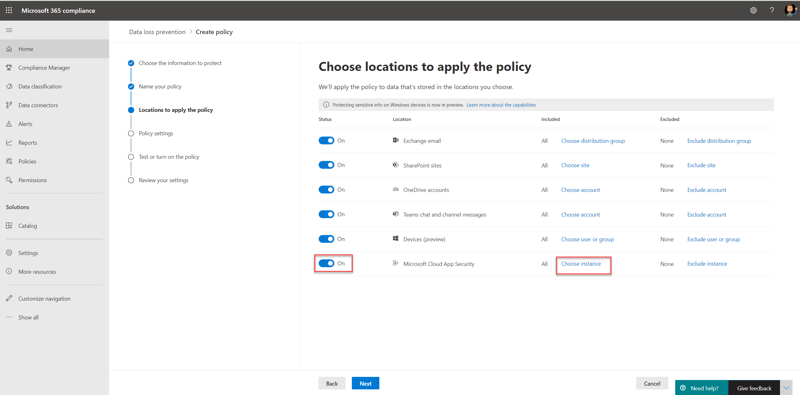

# 使用非 Microsoft cloud app 的資料遺失防護原則 (預覽) 

資料遺失防護 (DLP) 原則的非 Microsoft cloud 應用程式是 Microsoft 365 DLP 功能套件的一部分;使用這些功能，您可以在 Microsoft 365 服務中探索和保護機密專案。 如需所有 Microsoft DLP 產品的詳細資訊，請參閱 [資料遺失防護](./data-loss-prevention-policies.md?view=o365-worldwide)。

您可以使用 DLP 原則來監視和偵測敏感專案何時使用，並透過非 Microsoft cloud app 加以共用。 使用這些原則可提供您所需的可見度和控制，以確保它們已正確使用和受到保護，並可協助防範可能會損損的危險行為。

## 開始之前

### SKU/訂閱授權

開始使用 DLP 原則至非 Microsoft cloud app 之前，請先確認您的 [Microsoft 365 訂閱](https://www.microsoft.com/microsoft-365/compare-microsoft-365-enterprise-plans?rtc=1) 和任何附加元件。 若要存取及使用此功能，您必須具有下列其中一項訂閱或附加元件：

- Microsoft 365 E5
- Microsoft 365 E5 合規性
- Microsoft 365 E5 安全性

### 準備 Cloud App Security 環境

DLP 原則至非 Microsoft cloud App 使用雲端 App Security DLP 功能。 若要使用它，您應該準備 Cloud App Security 環境。 如需相關指示，請參閱為 [您的應用程式設定立即可視性、保護和](/cloud-app-security/getting-started-with-cloud-app-security#step-1-set-instant-visibility-protection-and-governance-actions-for-your-apps)控管動作。

### 連接非 Microsoft cloud app

若要使用 DLP 原則至特定的非 Microsoft cloud app，該應用程式必須連接至 Cloud App Security。 如需詳細資訊，請參閱：

- [連接框](/cloud-app-security/connect-box-to-microsoft-cloud-app-security)
- [連接 Dropbox](/cloud-app-security/connect-dropbox-to-microsoft-cloud-app-security)
- [Connect G 套件](/cloud-app-security/connect-google-apps-to-microsoft-cloud-app-security)
- [連接 Salesforce](/cloud-app-security/connect-salesforce-to-microsoft-cloud-app-security)
- [連接 Cisco Webex](/cloud-app-security/connect-webex-to-microsoft-cloud-app-security)

將雲端應用程式連線至 Cloud App Security 之後，您可以為其建立 Microsoft 365 DLP 原則。

>[!NOTE]
>您也可以使用 Microsoft Cloud App Security 來建立 DLP 原則至 Microsoft 雲端應用程式。 不過，建議使用 Microsoft 365 建立及管理 DLP 原則至 Microsoft 雲端應用程式。

## 建立非 Microsoft cloud app 的 DLP 原則

當您選取 DLP 原則的位置時，請開啟 **Microsoft Cloud App Security** location。

- 若要選取特定的應用程式或實例，請選取 **[選擇實例**]。
- 如果您未選取實例，則原則會使用 Microsoft Cloud App Security 承租人中所有連接的應用程式。

   

   

您可以針對每個支援的非 Microsoft cloud app 選擇各種動作。 每個應用程式都有不同的可能動作 (取決於雲端應用程式 API) 。

當您在 DLP 原則中建立規則時，您可以選取非 Microsoft cloud app 的動作。 若要限制協力廠商應用程式，請選取 [ **限制協力廠商應用程式**]。

如需建立及設定 DLP 原則的詳細資訊，請參閱 [Create test and 微調 dlp policy](./create-test-tune-dlp-policy.md?view=o365-worldwide)。

## 另請參閱

- [建立測試並調整 DLP 原則](./create-test-tune-dlp-policy.md?view=o365-worldwide)
- [預設的 DLP 原則快速入門](./get-started-with-the-default-dlp-policy.md?view=o365-worldwide)
- [從範本建立 DLP 原則](./create-a-dlp-policy-from-a-template.md?view=o365-worldwide)