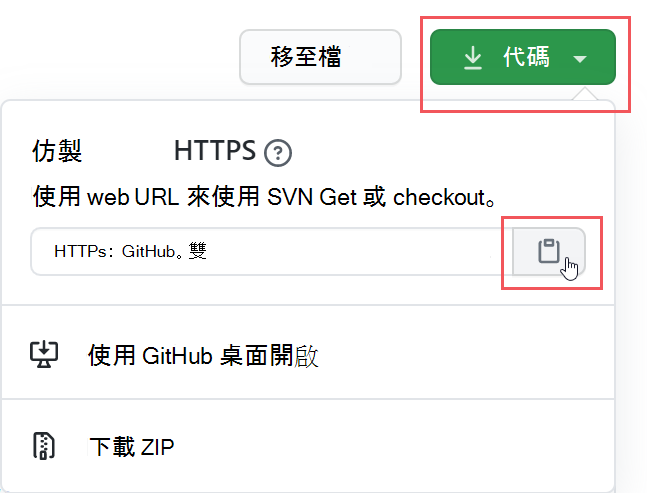
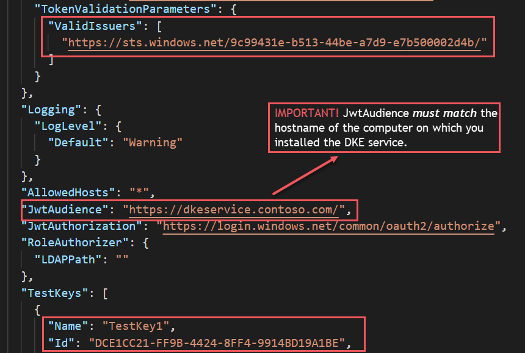
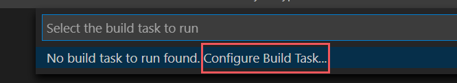
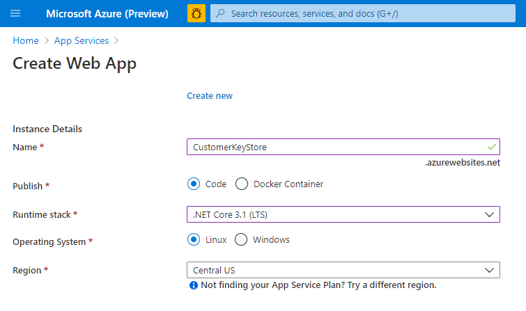
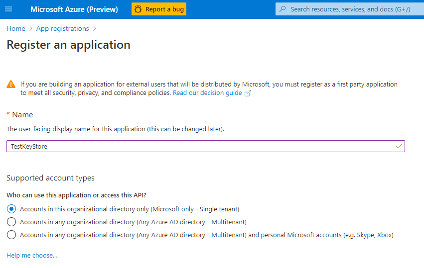

# <a name="double-key-encryption-for-microsoft-365"></a>Microsoft 365 的雙金鑰加密

> *適用于：針對 Microsoft 365 的雙金鑰加密， [microsoft 365 相容性](https://www.microsoft.com/microsoft-365/business/compliance-management)， [Azure 資訊保護](https://azure.microsoft.com/pricing/details/information-protection)*
>
> *相關指示： [Azure 資訊保護統一標籤用戶端 For Windows](/azure/information-protection/faqs#whats-the-difference-between-the-azure-information-protection-classic-and-unified-labeling-clients)*
>
> *服務說明： [Microsoft 365 合規性](/office365/servicedescriptions/microsoft-365-service-descriptions/microsoft-365-tenantlevel-services-licensing-guidance/microsoft-365-security-compliance-licensing-guidance)*

雙金鑰加密 (DKE) 會同時使用兩個按鍵來存取受保護的內容。 Microsoft 會在 Microsoft Azure 中儲存一個金鑰，並保留另一個金鑰。 您可以使用 Double 金鑰加密服務，保留其中一個按鍵的「完全控制」。 您可以使用 Azure 資訊保護整合標籤用戶端，套用至高度機密內容的保護。

雙金鑰加密可同時支援雲端和內部部署。 這些部署可協助確保在任何儲存受保護的資料時，加密的資料都保持不透明。

如需預設的雲端型租使用者超級機碼的詳細資訊，請參閱 [規劃及執行 Azure 資訊保護租使用者金鑰](/azure/information-protection/plan-implement-tenant-key)。

## <a name="when-your-organization-should-adopt-dke"></a>您的組織應採用 DKE

雙金鑰加密是針對最嚴格的保護需求所需的最敏感性資料。 DKE 並非適用于所有的資料。 一般來講，您會使用雙金鑰加密來保護您整體資料的少數部分。 您應在部署之前，依照此解決方案識別要涵蓋的適當資料，以進行一定的努力。 在某些情況下，您可能需要縮小您的範圍，並對大部分的資料使用其他解決方案，例如 Microsoft 使用 Microsoft 管理的金鑰或 BYOK 的資訊保護。 這些解決方案已足以滿足不受增強保護和法規需求的檔。 此外，這些解決方案可讓您使用最強大的 Office 365 服務;您無法與 DKE 加密內容搭配使用的服務。 例如：

- 傳輸規則包括需要附件查看的反惡意程式碼和垃圾郵件
- Microsoft Delve
- eDiscovery
- 內容搜尋和索引
- Office Web Apps （包括合著功能）

任何未透過 MIP SDK 與 DKE 整合的外部應用程式或服務，都無法在加密的資料上執行動作。

Microsoft 資訊保護 SDK 1.7 + 支援雙金鑰加密;與我們的 SDK 整合的應用程式，將能夠透過適當的許可權和整合，在此資料上造成原因。

我們建議組織使用 Microsoft 資訊保護功能 (分類及標籤) ，保護其大部分的機密資料，並只對其重要的資料使用 DKE。 雙金鑰加密適用于高度管制行業中的機密資料，例如金融服務和醫療保健。

如果您的組織有下列任何一個需求，您可以使用 DKE 來保護您的內容：

- 您想要確保 *只有您* 在所有情況下都能解密受保護的內容。
- 您不想讓 Microsoft 自行存取受保護的資料。
- 您有法規需求，可在地理界限內保留金鑰。 您在資料中心維護所有保留用於資料加密和解密的機碼。

## <a name="system-and-licensing-requirements-for-dke"></a>DKE 的系統和授權需求

**Microsoft 365 的雙金鑰加密** 與 Microsoft 365 E5 搭配使用。 如果您沒有 Microsoft 365 E5 授權，您可以註冊 [試用版](https://aka.ms/M365E5ComplianceTrial)。 如需這些授權的相關資訊，請參閱 [Microsoft 365 授權指南以取得安全性 & 合規性](/office365/servicedescriptions/microsoft-365-service-descriptions/microsoft-365-tenantlevel-services-licensing-guidance/microsoft-365-security-compliance-licensing-guidance)。

**Azure 資訊保護**。 DKE 與敏感度標籤搭配運作，需要 Azure 資訊保護。

DKE 敏感度標籤是透過 Office 桌面應用程式中的靈敏度功能區提供給使用者。 在您要保護和使用受保護檔的每一部用戶端電腦上安裝這些必要條件。

**適用于企業版的 Microsoft Office 應用程式** 版本2009或更新版本 (Word PowerPoint 的桌上出版本，以及 Windows 上的 Excel) 。

**Azure 資訊保護統一標籤用戶端** 版本2.7.93.0 或更新版本。 從 [Microsoft 下載中心](https://www.microsoft.com/download/details.aspx?id=53018)下載並安裝統一的標籤用戶端。

## <a name="supported-environments-for-storing-and-viewing-dke-protected-content"></a>支援儲存及查看 DKE 保護內容的環境

**支援的應用程式**。 Windows 上[的 Microsoft 365 應用程式](https://www.microsoft.com/microsoft-365/business/microsoft-365-apps-for-enterprise-product)（包括 Word、Excel 及 PowerPoint）。

**線上內容支援**。 您可以在 Microsoft SharePoint 和 OneDrive 商務版中，以線上方式，儲存以雙金鑰加密為保護的檔和檔案。 您必須在上傳至這些位置之前，以支援的應用程式來標記及保護 DKE 中的檔及檔案。 您可以透過電子郵件共用加密內容，但無法在線上查看加密的檔和檔案。 相反地，您必須使用本機電腦上支援的桌面應用程式和用戶端來查看受保護的內容。

## <a name="overview-of-deploying-dke"></a>部署 DKE 的概述

您將遵循下列一般步驟來設定 DKE。 當您完成這些步驟之後，您的使用者就可以使用雙金鑰加密來保護高度機密的資料。

1. 如本文所述，部署 DKE 服務。

2. 建立具有雙按鍵加密的標籤。 流覽至 [Microsoft 365 規範中心](https://compliance.microsoft.com) 底下的資訊保護，並建立具有雙金鑰加密的新標籤。 請參閱 [使用敏感度標籤限制存取內容以套用加密](./encryption-sensitivity-labels.md)。

3. 使用雙金鑰加密標籤。 從 Microsoft Office 中的 [敏感度] 功能區中，選取雙機碼加密標籤，以保護資料。

您可以透過幾種方式完成一些部署雙按鍵加密的步驟。 本文提供詳細指示，使系統管理員無法順利部署服務。 如果您很舒適，可以選擇使用您自己的方法。

## <a name="deploy-dke"></a>部署 DKE

本文和部署影片使用 Azure 作為 DKE 服務的部署目的地。 如果您要部署至其他位置，您必須提供您自己的值。

觀賞 [雙重金鑰加密部署影片](https://youtu.be/vDWfHN_kygg) ，以查看本文中概念的逐步綜述。 影片大約需要18分鐘才能完成。

您將遵循下列一般步驟為您的組織設定雙金鑰加密。

1. [安裝 DKE 服務的必備軟體必要條件](#install-software-prerequisites-for-the-dke-service)
1. [複製雙金鑰加密 GitHub 存放庫](#clone-the-dke-github-repository)
1. [修改應用程式設定](#modify-application-settings)
1. [產生測試機碼](#generate-test-keys)
1. [建立專案](#build-the-project)
1. [部署 DKE 服務併發布金鑰存放區](#deploy-the-dke-service-and-publish-the-key-store)
1. [驗證您的部署](#validate-your-deployment)
1. [註冊金鑰存放區](#register-your-key-store)
1. [使用 DKE 建立敏感度標籤](#create-sensitivity-labels-using-dke)
1. [在用戶端啟用 DKE](#enable-dke-in-your-client)
1. [將受保護的檔案從 HYOK 標籤遷移至 DKE 標籤](#migrate-protected-files-from-hyok-labels-to-dke-labels)

完成後，您可以使用 DKE 加密檔和檔案。 如需詳細資訊，請參閱 [將敏感度標籤套用至檔案和 Office 中的電子郵件](https://support.microsoft.com/office/2f96e7cd-d5a4-403b-8bd7-4cc636bae0f9)。

### <a name="install-software-prerequisites-for-the-dke-service"></a>安裝 DKE 服務的必備軟體必要條件

在您想要安裝 DKE 服務的電腦上安裝這些必要條件。

**.Net Core 3.1 SDK**。 從 [下載 .Net Core 3.1](https://dotnet.microsoft.com/download/dotnet-core/3.1)下載並安裝 SDK。

**Visual Studio 程式碼**。 從下載 Visual Studio 程式碼 [https://code.visualstudio.com/](https://code.visualstudio.com) 。 安裝之後，請執行 Visual Studio 程式碼並選取 [ **View** \> **extension**]。 安裝這些分機號碼。

- Visual Studio 程式碼的 c #

- NuGet 套件管理員

**Git 資源**。 下載並安裝下列其中一個。

- [Git](https://git-scm.com/downloads)

- [GitHub 桌面](https://desktop.github.com/)

- [GitHub 企業版](https://github.com/enterprise)

**OpenSSL** 您必須安裝 [OpenSSL](https://slproweb.com/products/Win32OpenSSL.html) ，才可在部署 DKE 之後 [產生測試機碼](#generate-test-keys) 。 請確認您已從環境變數路徑正確呼叫它。 例如，如需詳細資訊，請參閱「將安裝目錄新增至路徑」 [https://www.osradar.com/install-openssl-windows/](https://www.osradar.com/install-openssl-windows/) 。

### <a name="clone-the-dke-github-repository"></a>複製 DKE GitHub 存放庫

Microsoft 會在 GitHub 存放庫中提供 DKE 來源檔案。 您可以複製存放庫，以在本機為組織使用建立專案。 DKE GitHub 存放庫位於 [https://github.com/Azure-Samples/DoubleKeyEncryptionService](https://github.com/Azure-Samples/DoubleKeyEncryptionService) 。

下列指示適用于未經驗的 git 或 Visual Studio 程式碼使用者：

1. 在您的瀏覽器中，移至： [https://github.com/Azure-Samples/DoubleKeyEncryptionService](https://github.com/Azure-Samples/DoubleKeyEncryptionService) 。

2. 在螢幕右側，選取 [程式 **代碼**]。 您的 UI 版本可能會顯示 [ **複製] 或 [下載** ] 按鈕。 然後，在出現的下拉式清單中，選取複製圖示，將 URL 複製到您的剪貼簿。

    例如：

   > [!div class="mx-imgBorder"]
   > 

3. 在 Visual Studio 程式碼中，選取 [ **View** \> **Command 調板** ]，然後選取 [ **Git：複本**]。 若要跳到清單中的選項，請開始輸入 `git: clone` 以篩選項目，然後從下拉式清單中選取。 例如：

   > [!div class="mx-imgBorder"]
   > 

4. 在文字方塊中，粘貼您從 Git 複製的 URL，並 **從 GitHub** 選取 [複製]。

5. 在出現的 [ **選取資料夾** ] 對話方塊中，流覽至儲存存放庫的位置並加以選取。 在提示中，選取 [ **開啟**]。

    會在 Visual Studio 程式碼中開啟存放庫，並在左下方顯示目前的 Git 分支。 例如，分支應該是 **主程式**。 例如：

   

6. 如果您不是在主分支上，您必須加以選取。 在 Visual Studio 程式碼中，選取分支，然後從顯示的分支清單中選擇 [ **主** ]。

   > [!IMPORTANT]
   > 選取主要分支可確保您具有正確的檔案來建立專案。 如果您未選擇正確的分支，您的部署將會失敗。

您現在已設定本機的 DKE 來源存放庫。 接下來，修改組織的 [應用程式設定](#modify-application-settings) 。

### <a name="modify-application-settings"></a>修改應用程式設定

若要部署 DKE 服務，您必須修改下列類型的應用程式設定：

- [主要存取設定](#key-access-settings)
- [租使用者和主要設定](#tenant-and-key-settings)

您可以在 [檔案] 中的 [appsettings.js修改應用程式設定。 此檔案位於您在本機上複製的 DoubleKeyEncryptionService 存放庫中 DoubleKeyEncryptionService\src\customer-key-store。 例如，在 Visual Studio 程式碼中，您可以流覽至檔案，如下圖所示。


#### <a name="key-access-settings"></a>主要存取設定

選擇是否要使用電子郵件或角色授權。 DKE 一次只支援其中一種驗證方法。

- **電子郵件授權**。 可讓您的組織僅根據電子郵件地址來授權存取機碼。

- **角色授權**。 可讓您的組織授權以 Active Directory 群組為基礎的金鑰存取權，且要求 web 服務可以查詢 LDAP。

**使用電子郵件授權設定 DKE 的主要存取設定**

1. 開啟檔案 **上的appsettings.js** ，並找到 `AuthorizedEmailAddress` 設定。

2. 新增您要授權的電子郵件地址。 使用雙引號和逗號來分隔多個電子郵件地址。 例如：

   ```json
   "AuthorizedEmailAddress": ["email1@company.com", "email2@company.com ", "email3@company.com"]
   ```

3. 找到 `LDAPPath` 設定，然後 `If you use role authorization (AuthorizedRoles) then this is the LDAP path.` 在雙引號之間移除文字。 將雙引號保留在原處。 當您完成時，此設定應該如下所示。

   ```json
   "LDAPPath": ""
   ```

4. 找到 `AuthorizedRoles` 設定，並刪除整行。

此影像顯示檔的 **appsettings.js** 的電子郵件授權格式設定正確。

   

**使用角色授權設定 DKE 的主要存取設定**

1. 開啟檔案 **上的appsettings.js** ，並找到 `AuthorizedRoles` 設定。

2. 新增您要授權的 Active Directory 群組名稱。 使用雙引號和逗號來分隔多個組名。 例如：

   ```json
   "AuthorizedRoles": ["group1", "group2", "group3"]
   ```

3. 找到 `LDAPPath` 設定並新增 Active Directory 網域。 例如：

   ```json
   "LDAPPath": "contoso.com"
   ```

4. 找到 `AuthorizedEmailAddress` 設定，並刪除整行。

此影像顯示針對角色授權，正確設定檔案格式的 **appsettings.js** 。

   

#### <a name="tenant-and-key-settings"></a>租使用者和主要設定

DKE 租使用者和 key settings 位於檔案中的 **appsettings.js** 。

**設定 DKE 的承租人和主要設定**

1. 開啟檔 **上的appsettings.js** 。

2. 找到 `ValidIssuers` 設定，並 `<tenantid>` 將其取代為您的租使用者識別碼。 您可以移至 Azure 入口網站並查看 [租使用者屬性](https://aad.portal.azure.com/#blade/Microsoft_AAD_IAM/ActiveDirectoryMenuBlade/Properties)，以找出您的租使用者識別碼。 例如：

   ```json
   "ValidIssuers": [
     "https://sts.windows.net/9c99431e-b513-44be-a7d9-e7b500002d4b/"
   ]
   ```

找到 `JwtAudience` 。 取代 `<yourhostname>` DKE 服務將執行的機器的主機名稱。 例如：

  > [!IMPORTANT]
  > 的值 `JwtAudience` 必須與您的主機名稱稱 *完全* 相符。 您可以在調試時使用 **localhost： 5001** 。 不過，當您完成調試時，請務必將此值更新為伺服器的主機名稱。

- `TestKeys:Name`. 輸入機碼的名稱。 例如：`TestKey1`
- `TestKeys:Id`. 建立 GUID 並輸入為 `TestKeys:ID` 值。 例如，`DCE1CC21-FF9B-4424-8FF4-9914BD19A1BE`。 您可以使用像是 [線上 GUID 發生器](https://guidgenerator.com/) 的網站，以隨機產生 GUID。

這個圖像會顯示 **appsettings.js** 中的承租人和機碼設定的正確格式。 `LDAPPath` 設定角色授權。



### <a name="generate-test-keys"></a>產生測試機碼

定義應用程式設定之後，即可開始產生公用和私人測試金鑰。

若要產生機碼：

1. 在 Windows [開始] 功能表中，執行 OpenSSL 命令提示字元。

2. 變更至您要儲存測試機碼的資料夾。 您完成此工作中的步驟所建立的檔案會儲存在相同的資料夾中。

3. 產生新的測試機碼。

   ```console
   openssl req -x509 -newkey rsa:2048 -keyout key.pem -out cert.pem -days 365
   ```

4. 產生私密金鑰。

   ```console
   openssl rsa -in key.pem -out privkeynopass.pem
   ```

5. 產生公開金鑰。

   ```console
   openssl rsa -in key.pem -pubout > pubkeyonly.pem
   ```

6. 在文字編輯器中，開啟 **pubkeyonly**。 將 **pubkeyonly** 檔案中的所有內容（第一行及最後一列除外）複製到檔案中 `PublicPem` **appsettings.js** 區段。

7. 在文字編輯器中，開啟 **privkeynopass**。 將 **privkeynopass** 檔案中的所有內容（第一行及最後一列除外）複製到檔案中 `PrivatePem` **appsettings.js** 區段。

8. 移除及區段中的所有空格和分行符號 `PublicPem` `PrivatePem` 。

    > [!IMPORTANT]
    > 當您複製此內容時，請勿刪除任何 PEM 資料。

9. 在 Visual Studio 程式碼中，流覽至 [ **啟動 .cs** ] 檔案。 此檔案位於您在本機上複製的 DoubleKeyEncryptionService 存放庫中 DoubleKeyEncryptionService\src\customer-key-store\。

10. 找到下列行：

    ```csharp
        #if USE_TEST_KEYS
        #error !!!!!!!!!!!!!!!!!!!!!! Use of test keys is only supported for testing,
        DO NOT USE FOR PRODUCTION !!!!!!!!!!!!!!!!!!!!!!!!!!!!!
        services.AddSingleton<ippw.IKeyStore, ippw.TestKeyStore>();
        #endif
    ```

11. 請使用下列文字取代這些行：

    ```csharp
    services.AddSingleton<ippw.IKeyStore, ippw.TestKeyStore>();
    ```

    結束結果應如下所示。

    

現在您已經準備好 [建立 DKE 專案](#build-the-project)。

### <a name="build-the-project"></a>建立專案

使用下列指示在本機建立 DKE 專案：

1. 在 Visual Studio 程式碼的 DKE 服務存放庫中，選取 [ **View** \> **Command 調板** ]，然後在提示中輸入 **build** 。

2. 從清單中選擇 [ **任務：執行建立任務**]。

   如果找不到任何建立工作，請選取 [ **設定建立** 工作] 並為 .net core 建立一個工作，如下所示。

   

   1. 選擇 [ **從範本建立 tasks.js**]。

      

   2. 從範本類型清單中，選取 [ **.Net Core**]。

      

   3. 在 [建立] 區段中，找到 customerkeystore 之 **.csproj** 檔案的路徑。 如果沒有的話，請新增下列一行：

      ```json
      "${workspaceFolder}/src/customer-key-store/customerkeystore.csproj",
      ```

   4. 再次執行組建。

3. 確認 [輸出] 視窗中沒有紅色的錯誤。

   如果有紅色錯誤，請檢查主控台輸出。 確定您已正確完成上述所有步驟，且有正確的版本。

4. 選取 [ **執行** \> **開始調試** ] 以調試處理常式。 如果系統提示您選取環境，請選取 [ **.net core**]。

   .NET 核心偵錯工具通常會啟動至 `https://localhost:5001` 。 若要查看測試機碼，請移至 `https://localhost:5001` 並追加一個正斜線 (/) 和您的金鑰名稱。 例如：

   ```https
   https://localhost:5001/TestKey1
   ```

   該項應該會以 JSON 格式顯示。

您的設定現在已完成。 在您發佈金鑰庫之前 appsettings.js開啟] 中的 JwtAudience 設定，請確定主機名稱的值完全符合您的應用程式服務主機名稱。 您可能已將其變更為 localhost 以進行組建疑難排解。

### <a name="deploy-the-dke-service-and-publish-the-key-store"></a>部署 DKE 服務併發布金鑰存放區

若為生產部署，請在協力廠商雲端部署服務，或 [發佈至內部部署系統](/aspnet/core/tutorials/publish-to-iis?preserve-view=true&tabs=netcore-cli&view=aspnetcore-3.1)。

您可以選擇使用其他方法來部署金鑰。 選取最適合您組織的方法。

在試驗部署中，您可以在 Azure 中部署，並立即開始快速入門。

**建立 Azure Web 應用程式實例以主控您的 DKE 部署**

若要發佈機碼存放區，您將會建立 Azure 應用程式服務實例，以裝載您的 DKE 部署。 接下來，您會將所產生的金鑰發佈到 Azure。

1. 在您的瀏覽器中，登入 [Microsoft Azure 入口網站](https://ms.portal.azure.com)，然後移至 [**應用程式服務**] [  >  **新增**]。

2. 選取您的訂閱和資源群組，然後定義您的實例詳細資料。

   - 輸入您要安裝 DKE 服務之電腦的主機名稱。 請確定其名稱與 [**appsettings.json**](#tenant-and-key-settings) file 中的 JwtAudience 設定所定義的名稱相同。 您為此名稱提供的值也是 WebAppInstanceName。

   - 在 [ **發佈**]、[程式 **代碼**] 及 [ **執行時間堆疊**] 中，選取 [ **.net Core 3.1**]。

   例如：

   > [!div class="mx-imgBorder"]
   > 

3. 在頁面底部，選取 [ **複查 + 建立**]，然後選取 [ **新增**]。

4. 請執行下列其中一項動作來發佈您產生的機碼：

   - [透過 ZipDeployUI 發佈](#publish-via-zipdeployui)
   - [透過 FTP 發佈](#publish-via-ftp)
   - [透過 Visual Studio 2019 或更新版本發行](/aspnet/core/tutorials/)

#### <a name="publish-via-zipdeployui"></a>透過 ZipDeployUI 發佈

1. 移至`https://<WebAppInstanceName>.scm.azurewebsites.net/ZipDeployUI`。

   例如：https://dkeservice.scm.azurewebsites.net/ZipDeployUI

2. 在金鑰存放區的基本代碼中，移至 [ **customer-key-store\src\customer-key-store** ] 資料夾，然後確認此資料夾包含 **customerkeystore 的 .csproj** 檔案。

3. 執行： **dotnet 發佈**

   [輸出] 視窗會顯示部署發佈所在的目錄。

   例如：`customer-key-store\src\customer-key-store\bin\Debug\netcoreapp3.1\publish\`

4. 將發行目錄中的所有檔案傳送至 .zip 檔案。 建立 .zip 檔時，請確定目錄中的所有檔案都位於 .zip 檔案的根層級。

5. 將您建立的 .zip 檔案拖放至您在上面開啟的 ZipDeployUI 網站。 例如：https://dkeservice.scm.azurewebsites.net/ZipDeployUI

已部署 DKE，您可以流覽至您建立的測試機碼。 繼續 [驗證您的部署](#validate-your-deployment) 。

#### <a name="publish-via-ftp"></a>透過 FTP 發佈

1. 連線至您在 [上述](#deploy-the-dke-service-and-publish-the-key-store)建立的 App 服務。

   在您的瀏覽器中，移至： **Azure 入口** 網站  >  **應用程式服務**  >  **部署中心**  >  **手動部署**  >  **FTP**  >  **儀表板**。

2. 複製顯示至本機檔案的連接字串。 您將使用這些字串連線到 Web App 服務，並透過 FTP 上傳檔案。

   例如：

   

3. 在金鑰儲存的基本代碼中，移至 **customer-key-store\src\customer-key-store 目錄**。

4. 請確認此目錄包含 **customerkeystore （.csproj** ）檔案。

5. 執行： **dotnet 發佈**

   輸出包含部署發佈所在的目錄。

   例如：`customer-key-store\src\customer-key-store\bin\Debug\netcoreapp3.1\publish\`

6. 將發行目錄中的所有檔案傳送至 zip 檔案。 建立 .zip 檔時，請確定目錄中的所有檔案都位於 .zip 檔案的根層級。

7. 您可以從您的 FTP 用戶端，使用複製的連線資訊連線至應用程式服務。 將您在上一個步驟中建立的 .zip 檔案上傳至 Web 應用程式的根目錄。

已部署 DKE，您可以流覽至您所建立的測試機碼。 接下來， [驗證您的部署](#validate-your-deployment)。

### <a name="validate-your-deployment"></a>驗證您的部署

使用上述其中一種方法來部署 DKE 之後，請驗證部署及主要儲存區設定。

執行：

```powershell
src\customer-key-store\scripts\key_store_tester.ps1 dkeserviceurl/mykey
```

例如：

```powershell
key_store_tester.ps1 https://mydkeservice.com/mykey
```

確定輸出中未顯示任何錯誤。 當您準備好時，請 [註冊金鑰存放區](#register-your-key-store)。

索引鍵名稱區分大小寫。 輸入出現在檔案 appsettings.js中的索引鍵名稱。

## <a name="register-your-key-store"></a>註冊金鑰存放區

下列步驟可讓您註冊 DKE 服務。 註冊 DKE 服務是部署 DKE 的最後一個步驟，您才可以開始建立標籤。

若要註冊 DKE 服務：

1. 在您的瀏覽器中，開啟 [Microsoft Azure 入口網站](https://ms.portal.azure.com/)，然後移至 **所有服務** 身分 \> **識別** \> **應用程式註冊**。

2. 選取 [ **新增註冊**]，然後輸入有意義的名稱。

3. 從顯示的選項中選取帳戶類型。

   如果您使用的是非自訂網域（例如 **onmicrosoft.com**）的 Microsoft Azure，請選取 [ **此組織目錄中的帳戶]，只 (僅限 Microsoft 單一租使用者) 。**

   例如：

   > [!div class="mx-imgBorder"]
   > 

4. 在頁面底部，選取 [ **註冊** ] 以建立新的應用程式註冊。

5. 在新的應用程式註冊的左窗格中，按一下 [ **管理**] 下的 [ **驗證**]。

6. 選取 [ **新增平臺**]。

7. 在 [ **設定平臺** ] 快顯功能表上，選取 [ **Web**]。

8. 在 [重新 **導向 URIs**] 底下，輸入您的雙金鑰加密服務 URI。 輸入應用程式服務 URL，包括主機名稱和網域。

   例如：https://mydkeservicetest.com

   - 您輸入的 URL 必須符合部署 DKE 服務的主機名稱。
   - 如果您要在本機上使用 Visual Studio 進行測試，請使用 **https://localhost:5001** 。
   - 在所有情況下，此配置必須是 **HTTPs**。

   確定主機名稱完全符合您的應用程式服務主機名稱。 您可能已經將其變更為 `localhost` 疑難排解組建。 在 **appsettings.js開啟**] 中，這個值是您為設定的主機名稱 `JwtAudience` 。

9. 在 **[隱含授** 與] 底下，選取 [ **識別碼標記** ] 核取方塊。

10. 選取 [儲存 **]** 以儲存變更。

11. 在左窗格中，選取 [ **公開 API**]，然後選取 [應用程式識別碼 URI] 旁的 [ **設定**]。

12. 在 [ **公開 API** ] 頁面上，選取 [ **此 api** 區域所定義的範圍] 中的 [ **新增範圍**]。 在 [新增] 範圍中：

    1. 將範圍名稱定義為 **user_impersonation**。

    2. 選取可同意的系統管理員和使用者。

    3. 定義任何其他必要的值。

    4. 選取 [ **新增範圍**]。

    5. 選取頂端的 [ **儲存** ] 以儲存變更。

13. 仍在 **公開 API** 頁面上，選取 [ **授權用戶端應用程式** ] 區域中的 [ **新增用戶端應用程式**]。

    在新的用戶端應用程式中：

    1. 將用戶端識別碼定義為 `d3590ed6-52b3-4102-aeff-aad2292ab01c` 。 這個值是 Microsoft Office 用戶端識別碼，可讓 Office 取得金鑰存放區的存取權杖。

    2. 在 [ **授權範圍**] 底下，選取 [ **user_impersonation** ] 範圍。

    3. 選取 [ **新增應用程式**]。

    4. 選取頂端的 [ **儲存** ] 以儲存變更。

    5. 重複這些步驟，但這次將用戶端識別碼定義為 `c00e9d32-3c8d-4a7d-832b-029040e7db99` 。 此值是 Azure 資訊保護統一標籤用戶端識別碼。 

您的 DKE 服務現在已註冊。 [使用 DKE 建立標籤](#create-sensitivity-labels-using-dke)以繼續。

## <a name="create-sensitivity-labels-using-dke"></a>使用 DKE 建立敏感度標籤

在 Microsoft 365 規範中心中，建立新的靈敏度標籤，並依照您的需要套用加密。 選取 [ **使用雙重金鑰加密** ]，然後輸入機碼的端點 URL。

例如：

> [!div class="mx-imgBorder"]
> ![選取 [Microsoft 365 規範中心] 中的 [使用雙重金鑰加密]](../media/dke-use-dke.png)

在最新版本的 Microsoft 365 應用程式中，您新增的任何 DKE 標籤都會開始顯示給使用者。

> [!NOTE]
> 最多可能需要24小時的時間，讓用戶端重新整理新的標籤。

### <a name="enable-dke-in-your-client"></a>在用戶端啟用 DKE

如果您是 Office 有問必答，已為您啟用 DKE。 否則，請新增下列登錄機碼，為您的用戶端啟用 DKE：

```console
   [HKEY_LOCAL_MACHINE\SOFTWARE\WOW6432Node\Microsoft\MSIPC\flighting]
   "DoubleKeyProtection"=dword:00000001

   [HKEY_LOCAL_MACHINE\SOFTWARE\Microsoft\MSIPC\flighting]
   "DoubleKeyProtection"=dword:00000001
```

## <a name="migrate-protected-files-from-hyok-labels-to-dke-labels"></a>將受保護的檔案從 HYOK 標籤遷移至 DKE 標籤

當您完成 DKE 的設定之後，您可以使用 HYOK 標籤將已保護的內容遷移至 DKE 標籤。 若要進行遷移，您會使用 AIP 掃描器。 若要開始使用掃描器，請參閱 [Azure 資訊保護統一標記掃描器的功能？](/azure/information-protection/deploy-aip-scanner)。

如果您不遷移內容，您的 HYOK 受保護內容將保持不受影響。
