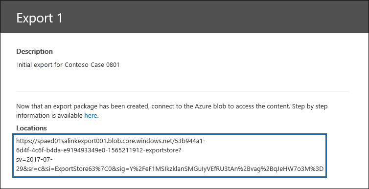
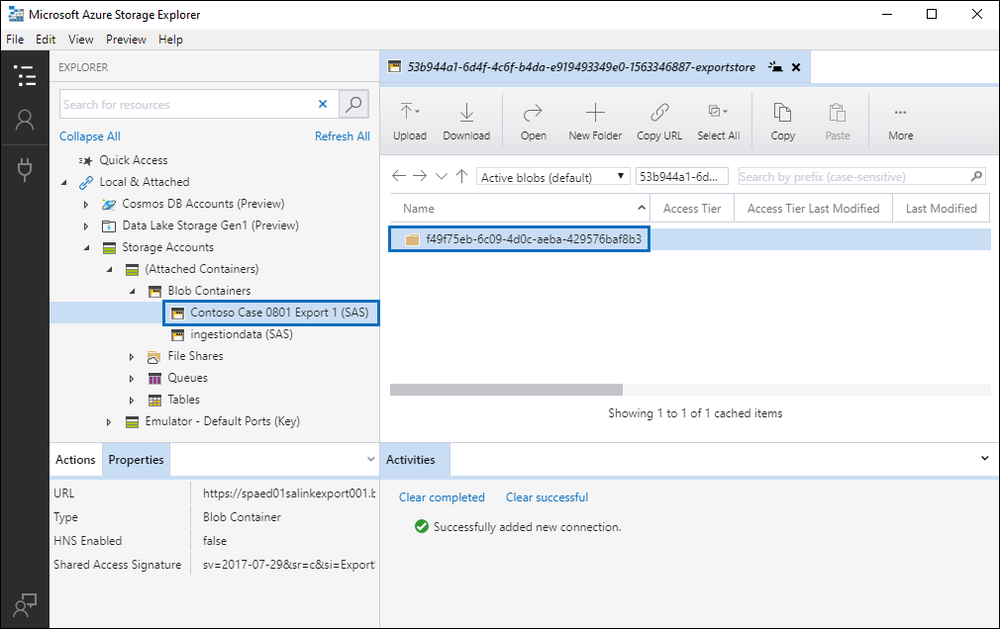
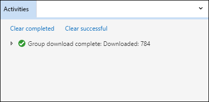

# 下載匯出工作

从高级电子数据展示案例中的审阅集导出文档时，文档将上载到 Microsoft 提供的 Azure 存储位置或组织管理的 Azure 存储位置。 使用的 Azure 存储位置的类型取决于导出文档时选择的选项。 

本文提供有关如何使用 Microsoft Azure 存储资源管理器连接到 Azure 存储位置以浏览和下载导出的文档的说明。 有关 Azure 存储资源管理器的详细信息，请参阅[快速入门：使用 Azure 存储资源管理器](https://docs.microsoft.com/en-us/azure/storage/blobs/storage-quickstart-blobs-storage-explorer)。

## 步骤 1：安装 Azure 存储资源管理器

第一步是下载并安装 Azure 存储资源管理器。 有关说明，请参阅[Azure 存储资源管理器工具](https://go.microsoft.com/fwlink/p/?LinkId=544842)。 使用此工具可以连接到步骤 3 中的导出文档并下载文档。

## 步骤 2：从导出作业获取 SAS URL

下一步是获取在创建导出作业以[从审阅集导出文档](export-documents-from-review-set.md)时生成的共享访问签名 （SAS） URL。 您可以复制上载到 Microsoft 提供的 Azure 存储位置或组织管理的 Azure 存储位置的文档的 SAS URL。 在这两种情况下，您都使用 SAS URL 连接到步骤 3 中的 Azure 存储位置。

1. 在"**高级电子数据展示"** 页上，转到案例，然后单击"**导出"** 选项卡。

2. 在"**导出"** 选项卡上，单击要下载的导出作业。

3. 在"弹出窗口"页上，在"**位置"** 下复制显示的 SAS URL。 如有必要，可以将其保存到文件中，以便在步骤 3 中访问该文件。
 
   

## 步骤 3：连接到 Azure 存储位置

最后一步是使用 Azure 存储资源管理器和 SAS URL 连接到 Azure 存储位置，并将导出到本地计算机的文档下载。

1.  打开步骤 1 中安装的 Azure 存储资源管理器。

2. 单击"**添加帐户"** 图标。 或者，您可以右键**单击"存储帐户"。**

   

3.  在"**连接到 Azure 存储"** 页上，**单击"使用共享访问签名 （SAS） URI"，** 然后单击"**下一步"。**

    

4.  在"**使用 SAS URI 附加"** 页上，单击 URI 框，然后粘贴在步骤 2 中获取的 SAS URL。 

    

    请注意，SAS URL 的一部分**显示在"显示名称"** 框中。 这将用作连接到存储位置后在**存储帐户**下创建的容器的显示名称。 此名称由高级电子数据展示案例的 ID 和唯一标识符组成。 您可以保留默认显示名称或更改它。 如果更改它，则显示名称必须是唯一的。

5.  按 [下一步]****。

    将显示"**连接摘要"** 页。
   
    

6. 在"**连接摘要"** 页上，查看连接信息，然后单击"**连接"。** 

    打开**Blob 容器**节点（**在存储帐户（** > **附加容器）**\>下。 

    

    它包含一个容器，该容器的名称来自步骤 4 中的显示名称。 此容器包含您创建的每个导出作业的文件夹。 这些文件夹的命名 ID 对应于导出作业的 ID。 您可以在"支持"页上的"**支持"** 页上找到这些导出操作码（以及导出名称），该"准备数据"**用于"作业"** 选项卡上列出的每个**导出作业的"准备数据"。**

7. 双击导出作业文件夹以将其打开。

   将显示文件夹和导出报告的列表。
   
    

   导出作业文件夹包含以下项目。 导出文件夹中的实际项由创建导出作业时配置的导出选项确定。 有关详细信息，请参阅[从审阅集导出文档。](export-documents-from-review-set.md)

    - 导出_load_file.csv：此 CSV 文件是包含有关每个导出文档的详细信息的详细信息导出报表。 该文件由文档的每个元数据属性的列组成。 有关此报表中包含的元数据的列表和说明，请参阅[高级电子数据展示 中"文档元数据"字段中](document-metadata-fields.md)的表中的"**导出字段名称"** 列。
    
    - 摘要.txt：包含导出摘要（包括导出统计信息）的文本文件。
    
    - 提取的_text_文件：此文件夹包含每个导出文档的文本文件版本。
     
    - 本机文件：此文件夹包含每个导出文档的本机文件版本。
    
    - 错误\文件：当导出作业包含任何错误文件时，此文件夹包含以下项目： 
        
      - 提取错误.csv：此 CSV 文件包含未从其父项正确提取的文件的可用元数据。
        
      - 处理错误：此文件夹包含处理错误的文档。 此内容处于项目级别，这意味着如果附件出现处理错误，则包含附件的文档也将包含在此文件夹中。
 
8. 要导出导出的所有内容，请选择导出文件夹，然后单击"**下载"。**

9. 指定要下载导出文件的位置，然后单击"选择文件夹"。

    Azure 存储资源管理器启动导出过程。 下载导出的项目的状态将显示在"**活动"** 窗格中。 下载完成后将显示一条消息。

    

> [!NOTE]
> 您可以选择要下载的特定项目，而不是下载整个导出作业。 您可以双击某个项目以查看项目，而不是下载项目。

