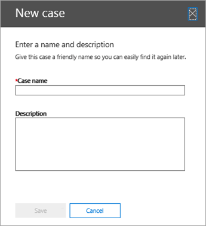
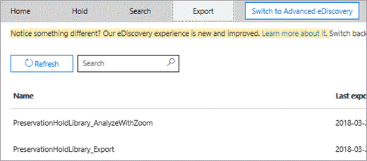

# <a name="ediscovery-cases-in-the-security--compliance-center"></a>安全&合规中心中的电子数据展示案例

您可以在 Office 365 和 Microsoft 365 中的合规性中心使用电子数据展示案例来控制谁可以在组织中创建、访问和管理电子数据展示案例。 如果您的组织具有 Office 365 E5 订阅，您还可以使用电子数据展示案例通过使用 Office 365 高级电子数据展示来分析搜索结果。
  
电子数据展示案例允许您向案例添加成员、控制特定案例成员可以执行的操作类型、对与法律案例相关的内容位置进行保留，以及将多个内容搜索与单个案例相关联。 您还可以导出与案例关联的任何内容搜索的结果，或在高级电子数据展示中准备用于分析的搜索结果。 电子数据展示案例是限制谁有权访问组织中特定法律案例的内容搜索和搜索结果的好方法。
  
使用以下工作流在安全&合规中心和高级电子数据展示中设置和使用电子数据展示案例。

[第 1 步：将电子数据展示权限分配给潜在案例成员](#step-1-assign-ediscovery-permissions-to-potential-case-members)

[第 2 步：创建新案例](#step-2-create-a-new-case)

[步骤 3：将成员添加到案例](#step-3-add-members-to-a-case)

[第 4 步：将内容位置置于保留状态](#step-4-place-content-locations-on-hold)

[第 5 步：创建并运行与案例关联的内容搜索](#step-5-create-and-run-a-content-search-associated-with-a-case)

[步骤 6：导出与案例关联的内容搜索结果](#step-6-export-the-results-of-a-content-search-associated-with-a-case)

[第 7 步：为高级电子数据展示准备搜索结果](#step-7-prepare-search-results-for-advanced-ediscovery)

[第 8 步：转到高级电子数据展示中的情况](#step-8-go-to-the-case-in-advanced-ediscovery)

[（可选）第 9 步：关闭案例](#optional-step-9-close-a-case)

[（可选）步骤 10：重新打开已关闭的案例](#optional-step-10-re-open-a-closed-case)

[詳細資訊](#more-information)
  
## <a name="step-1-assign-ediscovery-permissions-to-potential-case-members"></a>第 1 步：将电子数据展示权限分配给潜在案例成员

第一步是将适当的与电子数据展示相关的权限分配给用户，以便他们可以在步骤 2 中将其添加到电子数据展示案例中。 您必须是安全&合规性中心中的组织管理角色组（或分配角色管理角色）的成员，才能分配电子数据展示权限。 下面的列表描述了安全&合规中心中与电子数据展示相关的角色组。 
  
- **审阅者**- 此角色组具有最严格的电子数据展示相关权限。 此角色组的主要目的是允许成员在 Office 365 高级电子数据展示中查看和访问案例数据。 此组的成员只能查看和打开他们所安全&合规中心**中的电子数据展示**页面上的案件列表。 用户访问安全和合规性中心中的案例后，可以**单击"切换到高级电子数据展示"** 来访问和分析高级电子数据展示中的案例数据。 他们无法创建案例、向案例添加成员、创建保留、创建搜索、预览搜索结果、导出搜索结果或为高级电子数据展示准备结果。 
    
- **电子数据展示管理器**- 此角色组的成员可以创建和管理电子数据展示案例。 他们可以添加和删除成员、将内容位置置于保留状态、创建和编辑与案例关联的内容搜索、导出内容搜索的结果，以及准备搜索结果以在高级电子数据展示中进行分析。 此角色组中有两个子组。 这些子组之间的差异基于范围。
    
  - **电子数据展示管理器**- 可以查看和管理他们创建或成为成员的第一个电子数据展示案例。 如果另一个电子数据展示管理器创建案例，但没有添加第二个电子数据展示管理器作为该案例的成员，则第二个电子数据展示管理器将无法在安全&合规中心**中的电子数据展示**页面上查看或打开该案例。 电子数据展示经理还可以访问其在高级电子数据展示中的情况以执行分析任务。 
    
  - **电子数据展示管理员**- 可以执行电子数据展示管理器可以执行的所有案例管理任务。 此外，电子数据展示管理员可以：
    
    - 檢視 [eDiscovery]**** 頁面上列出的所有案例。 
    
    - 在将自己添加为案例成员后，管理组织中的任何案例。
    
    - 访问"高级电子数据展示"中的案例数据，以用于组织中的任何案例。
    
    有关组织中可能需要电子数据展示管理员的原因，[请参阅"详细信息"](#more-information)部分。 
    
> [!IMPORTANT]
> 如果某人不是这些与电子数据展示相关角色组之一的成员，或者不是分配了审阅者角色的角色组的成员，则不能将他们添加为电子数据展示案例的成员。 

有关电子数据展示权限的详细信息，请参阅[分配电子数据展示权限](assign-ediscovery-permissions.md)。
  
 **要分配电子数据展示权限：**
  
1. 移至 [https://protection.office.com](https://protection.office.com)。
    
2. 使用公司或學校帳戶登入 Office 365。
    
3. 在"安全&合规性中心中，单击"**权限"，** 然后根据要分配的"电子数据展示"权限执行以下操作之一。
    
    - 要分配审阅者权限，**请选择"审阅者**角色组"，**然后在"成员"** 旁边单击"**编辑"。** **单击"选择成员"，****单击"编辑"，****添加"，** 选择要添加到"审阅者角色组"的用户，然后单击"**添加"。**
    
    - 要分配电子数据展示管理器权限，**请选择"电子数据展示管理器"** 角色组，**然后在"电子数据展示管理器"** 旁边单击"**编辑"。** **单击"选择电子数据展示管理器"，****单击"编辑"，**添加"，选择要添加为电子数据展示管理器的用户，然后单击"**添加"。**
    
    - 要分配电子数据展示管理员权限，**请选择"电子数据展示管理器"** 角色组，**然后在"电子数据展示管理员"** 旁边单击"**编辑"。** **单击"选择电子数据展示管理员"，****单击"编辑"，****添加"，** 选择要添加为电子数据展示管理员的用户，然后单击"**添加"。**
    
4. 添加所有用户后，单击"**完成"，****单击"保存"** 以将更改保存到角色组，然后单击"**关闭"。**

## <a name="step-2-create-a-new-case"></a>第 2 步：创建新案例

下一步是创建新的"电子数据展示"案例。 您必须是电子数据展示管理器角色组的成员才能创建电子数据展示案例。 如前所述，在安全&合规中心创建新案例后，如果您的组织具有 Office 365 E5 订阅，则您（和其他案例成员）将能够访问高级电子数据展示中的同一案例。
  
1. 移至 [https://protection.office.com](https://protection.office.com)。
    
2. 使用公司或學校帳戶登入 Office 365。
    
3. 在安全&合规中心，**单击"电子数据**\>**展示"，****创建案例"。**
    
4. 在"**新建案例"** 页上，为案例指定名称，键入可选说明，然后单击"**保存"。** 请注意，案例名称在您的组织中必须是唯一的。
    
    
  
    新案例显示在**电子数据展示**页上的案例列表中。 请注意，您可以将光标悬停在案例名称上，以显示有关案例的信息，包括案例的状态（**活动**或**已关闭）、** 案例说明（在上一步中创建）以及上次更改案例时，以及何时更改案例。谁改变了它。
    
    > [!TIP]
    > 创建新案例后，您可以随时重命名它。 只需单击**电子数据展示**页面上的案例名称即可。 在"**管理此案例**弹出窗口"页上，更改"**名称"** 下框中显示的名称，然后保存更改。 
  
## <a name="step-3-add-members-to-a-case"></a>步骤 3：将成员添加到案例

创建新案例后，下一步是向案例添加成员。 如前所述，只有作为审阅者或电子数据展示管理器角色组成员的用户才能添加为案例的成员。 请注意，创建案例的电子数据展示管理器将自动添加为成员。
  
1. 在"安全&合规中心"中，**单击"电子数据**\>**展示"** 以显示组织中的案件列表。 
    
2. 单击要向其添加成员的案例的名称。
    
    将显示"**管理此案例**弹出窗口"页。 
    
    
  
3. **在"管理成员"**单击"添加图标**添加"** 以将成员添加到案例中。 
    
    您还可以选择将角色组添加到案例中。 **在"管理角色组"**单击"添加图标**添加"。**
    
    > [!NOTE]
    > 角色组控制谁可以将成员分配给电子数据展示案例。 这意味着您只能将您作为成员的角色组分配给案例。
    
4. 在可添加为案例成员的人或角色组列表中，单击要添加的人或角色组名称旁边的复选框。
    
    > [!TIP]
    > 如果您有一个大型可以添加为成员的人员列表，**请使用"搜索"** 框搜索列表中的特定人员。 
  
5. 选择要添加为组成员的人或角色组后，单击"**添加"。**
    
    **在"管理此案例"** 中，**单击"保存"** 以保存新的案例成员列表。 
    
6. **单击"保存"** 可保存案例成员的新列表。 
  
## <a name="step-4-place-content-locations-on-hold"></a>第 4 步：将内容位置置于保留状态

您可以使用电子数据展示案例创建保留，以保留可能与案例相关的内容。 您可以对案例中作为保管人的人员的邮箱和 OneDrive 业务站点进行保留。 您还可以在 Office 365 组的组邮箱、SharePoint 站点和 OneDrive 业务站点上放置保留。 同样，您可以在与 Microsoft Teams 关联的邮箱和站点上放置保留。 将内容位置置于保留状态时，内容将保留，直到从内容位置删除保留或删除保留。

> [!NOTE]
> 将内容位置置于保留状态后，最多需要 24 小时才能使保留生效。 
>   
创建保留时，您有以下选项来限定在指定内容位置中保留的内容的范围：
  
- 创建无限保留，其中所有内容都置于保留状态。 或者，您可以创建基于查询的保留，其中仅将与搜索查询匹配的内容置于保留状态。
    
- 您可以指定日期范围，以仅保存该日期范围内发送、接收或创建的内容。 或者，您可以保留所有内容，而不管内容是何时发送、接收或创建。
    
> [!NOTE]
> 在组织中的所有电子数据展示案例中，最多可以有 10，000 个保留策略。 
  
要为电子数据展示案例创建保留：
  
1. 在"安全&合规中心"中，**单击"电子数据**\>**展示"** 以显示组织中的案件列表。 
    
2. 单击要创建保留的案例**旁边的"打开"。** 
    
3. 在案例的**主页**上，**单击"保持"** 选项卡。 
    
    
  
4. 在"**保留"** 页上，添加图标**创建"。**
    
5. 在"**您的保留"** 页上，为保留提供名称。 保留的名称在您的组织中必须是唯一的。 
    
    
  
6. （可选）在"**说明"** 框中，添加保留的说明。 
    
7. 按 [下一步]****。
    
8. 选择要置于保留状态的内容位置。 您可以将邮箱、站点和公用文件夹置于保留状态。
    
    
  
   a. **交换电子邮件**-**单击"选择用户、组或团队"，** 然后再次**单击"选择用户、组或团队"。** 以指定要置于保留状态的邮箱。 使用搜索框查找用户邮箱和通讯组（对组成员的邮箱进行保留）以置于保留状态。 您还可以在 Office 365 组或 Microsoft 团队的关联邮箱上放置保留。 选择用户、组、团队复选框，**单击"选择"，** 然后单击"**完成"。**
    
    > [!NOTE]
    > 单击"**选择用户、组或团队**以指定要置于保留状态的邮箱"时，显示的邮箱选取器为空。 這項設計的目的是提升效能。 要将人员添加到此列表，在搜索框中键入名称（至少 3 个字符）。 
  
   b. **SharePoint 网站**-**单击"选择网站"，** 然后再次**单击"选择网站"** 以指定"共享点"和"一个业务网站"以置于保留状态。 键入要保留的每个网站的 URL。 您还可以为 Office 365 组或 Microsoft 团队添加 SharePoint 网站的 URL。 **单击"选择"，** 然后单击"**完成"。**
    
    有关将 Office 365 组和 Microsoft 团队置于保留状态的提示，请参阅[详细信息](#more-information)部分。 
    
    > [!NOTE]
    > 在极少数情况下，用户的用户名 （UPN） 被更改，其 OneDrive 帐户的 URL 也将更改以合并新的 UPN。 如果发生这种情况，您必须通过添加用户的新 OneDrive URL 并删除旧 URL 来修改保留。 
  
   c. **交换公用文件夹**- 将切换开关**移动到"全部"** 位置，以将 Exchange Online 组织中的所有公用文件夹置于保留状态。 请注意，您无法选择要置于保留状态的特定公用文件夹。 如果不想对公用文件夹进行保留，请将切换开关**设置为"无"。**
    
9. 将内容位置添加到保留状态后，单击"**下一步"。**
    
10. 要创建具有条件的基于查询的保留，请完成以下操作。 否则，只需**单击"下一步"**
    
    
  
    
       a. **在"关键字"** 下的框中键入搜索查询，以便仅将满足搜索条件的内容置于保留状态。 您可以指定关键字、消息属性或文档属性（如文件名）。 您还可以使用使用布尔运算符的更复杂的查询，如**AND、OR**或**NOT**。 **** 如果关键字框为空，则位于指定内容位置的所有内容都将置于保留状态。
    
    b. 单击"图标**添加条件"** 以添加一个或多个条件以缩小保留的搜索查询范围。 每个条件都会向创建保留时创建和运行的 KQL 搜索查询添加一个子句。 例如，您可以指定日期范围，以便在日期范围内创建的电子邮件或网站文档置于保留状态。 條件會以 **AND** 運算子的邏輯方式連接至關鍵字查詢 (在關鍵字方塊中指定)。 这意味着项必须满足关键字查询和要置于保留的条件。

    有关创建搜索查询和使用条件的详细信息，请参阅[关键字查询和内容搜索的搜索条件。](keyword-queries-and-search-conditions.md)
    
11. 配置基于查询的保留后，**单击"下一步"。**
    
12. 查看您的设置，**然后单击"创建此保留"。**
    
### <a name="hold-statistics"></a>保存统计信息

一段时间后，有关新保留的信息将显示在所选保留**的"保留"** 页上的详细信息窗格中。 此信息包括处于保留状态的邮箱和网站的数量以及有关置于保留中的内容的统计信息，例如置于保留状态的项目的总数和大小以及上次计算保留统计信息的时间。 这些保留统计信息可帮助您确定持有与电子数据展示案例相关的内容量。 
  

  
请记住以下有关保留统计信息的事项：
  
- 保留的项目总数指示置于保留状态的所有内容源中的项数。 如果已创建基于查询的保留，则此统计信息将指示与查询匹配的项数。
    
- 保留的项目数还包括在内容位置中找到的未编制索引的项目。 请注意，如果创建基于查询的保留，则内容位置中的所有未编制索引的项目都将置于保留状态。 这包括不符合基于查询的保留的搜索条件的未编制索引项，以及可能超出日期范围条件的未编制索引项。 这与运行内容搜索时的情况不同，在内容搜索中，搜索结果中不包含与搜索查询不匹配或被日期范围条件排除的未编制索引的项目。 有关未编制索引的项目的详细信息，请参阅[Office 365 中内容搜索中部分索引的项目。](partially-indexed-items-in-content-search.md)
    
- 您可以通过**单击"更新统计信息"** 来重新运行计算当前保留项目数的搜索估计值，从而获取最新的保留统计信息。 如有必要，单击工具栏**中的"刷新**以更新详细信息窗格中的保留统计信息。 
    
- 保留项目的数量随时间而增加是正常的，因为邮箱或站点处于保留状态的用户通常会发送或接收新的电子邮件，并创建新的 SharePoint 和 OneDrive 业务文档。
    
> [!NOTE]
> 如果将 SharePoint 站点或 OneDrive 帐户移动到多地理位置环境中的不同区域，则该站点的统计信息将不会包含在保留统计信息中。 但是，网站中的内容仍将处于保留状态。 此外，如果将网站移动到其他区域，则保留中显示的 URL 将不会更新。 您必须编辑保留并更新 URL。 
  
## <a name="step-5-create-and-run-a-content-search-associated-with-a-case"></a>第 5 步：创建并运行与案例关联的内容搜索

创建电子数据展示案例并将与案例相关的任何保管人置于保留状态后，您可以创建并运行与案例关联的一个或多个内容搜索。 与案例关联的内容搜索未列在"安全&合规性中心"**的"搜索"** 页上。 这意味着，与案例关联的内容搜索只能由也是电子数据展示管理器角色组成员的案例成员访问。 
  
1. 在"安全&合规中心"中，**单击"电子数据**\>**展示"** 以显示组织中的案件列表。 
    
2. 单击要在要在其中创建内容搜索的案例**旁边的"打开"。** 
    
3. 在案例的**主页**上，单击"**搜索"** 选项卡。 
    
    
  
4. 在"**搜索"** 页上，添加图标**新建搜索"。** 
    
5. 在 [新搜尋]**** 頁面上，您可以新增關鍵字和條件來建立搜尋查詢。 
    
    
  
6. 您可以指定关键字、消息属性（如发送和接收日期）或文档属性（如文件名或文档上次更改的日期）。 您可以使用使用布尔运算符的更复杂的**** 查询，例如**** AND、OR、NEAR 或******ONEAR**。 **** 您还可以在文档中搜索敏感信息（如社会保险号），或搜索外部共享的文档。 如果关键字框为空，则位于指定内容位置的所有内容都将包含在搜索结果中。 
    
7. 您可以**单击"显示关键字列表"** 复选框，并在每行中键入关键字。 如果这样做，则每行上的关键字由所创建的搜索查询中的**OR**运算符连接。 
    
    
  
    为什么要使用关键字列表？ 您可以获取显示每个关键字匹配的项目数的统计信息。 这可以帮助您快速确定哪些关键字最有效（也是最不有效）。 您还可以在一行中使用关键字短语（用括号括起来）。 有关搜索统计信息的详细信息，请参阅[查看内容搜索结果的关键字统计信息。](view-keyword-statistics-for-content-search.md)
    
    有关使用关键字列表的详细信息，请参阅[生成搜索查询](content-search.md#building-a-search-query)。
    
8. **在"条件"** 下，向搜索查询添加条件以缩小搜索范围并返回更精细的结果集。 每個條件會將一個子句新增至 KQL 搜尋查詢，當您啟動搜尋時便會建立並執行。 條件會以 **AND** 運算子的邏輯方式連接至關鍵字查詢 (在關鍵字方塊中指定)。 這表示結果中包含的項目必須同時滿足關鍵字查詢與條件。 這就是條件如何協助您縮小搜尋結果。 
    
    如需建立搜尋查詢和使用條件的相關資訊，請參閱 [Keyword queries for Content Search](keyword-queries-and-search-conditions.md)。
    
9. **在"位置：保留位置"** 下，选择要搜索的内容位置。 您可以在同一搜索中搜索邮箱、网站和公用文件夹。
    
    
  
    - **所有位置**- 选择此选项可搜索组织中的所有内容位置。 选择此选项时，可以选择搜索所有 Exchange 邮箱（包括所有 Office 365 组和 Microsoft 团队的邮箱）、所有 SharePoint 和一个业务站点的 OneDrive（包括所有 Office 365 组和 Microsoft 的网站团队）和所有公用文件夹。
    
    - **所有保留位置**- 选择此选项可搜索案例中已置于保留状态的所有内容位置。 如果案例包含多个保留，则当您选择此选项时，将搜索所有保留中的内容位置。 此外，如果将内容位置置于基于查询的保留状态，则在运行在此步骤中创建的内容搜索时，将仅搜索处于保留状态的项目。 例如，如果用户被置于基于查询的案例保留状态，以保留在特定日期之前发送或创建的项，则仅使用内容搜索的搜索条件搜索这些项目。 这是通过连接**AND**运算符的案例保留查询和内容搜索查询来实现的。 有关搜索案例内容的详细信息，请参阅本文末尾[的详细信息部分。](#more-information) 
    
    - **特定位置**- 选择此选项可选择要搜索的邮箱和网站。 当您选择此选项并单击"**修改"** 时，将显示位置列表。 您可以选择搜索任何或所有用户、组、团队或网站位置。
    
      
  
      您还可以选择搜索组织中的所有公用文件夹，但如果选择此选项并搜索保留的任何内容位置，则来自基于查询的案例保留的任何查询将不会应用于搜索查询。 换句话说，将搜索位置中的所有内容，而不仅仅是基于查询的案例保留保留保留的内容。
    
      您可以删除预先填充的案例内容位置或添加新的位置。 如果选择此选项，您还可以灵活地搜索特定服务的所有内容位置（例如搜索所有 Exchange 邮箱），或者可以搜索服务的特定内容位置。 您还可以选择是否搜索组织中的公用文件夹。
    
      在添加要搜索的内容位置时，请记住以下事项：
    
      - 单击"**选择用户、组或团队**以指定要搜索的邮箱"时，显示的邮箱选取器为空。 這項設計的目的是提升效能。 要将收件人添加到此列表，请单击"**选择用户、组或团队"，** 在搜索框中键入名称（至少 3 个字符），选中名称旁边的复选框，然后单击"**选择"。** 
    
      - 您可以将非活动邮箱、Office 365 组、Microsoft 团队和通讯组添加到要搜索的邮箱列表中。 不支持动态通讯组。 如果添加 Office 365 组或 Microsoft 团队，则搜索组或团队邮箱;如果添加 Office 365 组或 Microsoft 团队，则将搜索组或团队邮箱。不搜索组成员的邮箱。
    
      - 要添加网站，请单击"**选择网站"，** 再次**单击"选择网站"，** 然后键入要搜索的每个网站的 URL。 您还可以为 Office 365 组和 Microsoft 团队添加 SharePoint 站点的 URL。 
    
10. 选择要搜索的内容位置后，单击"**完成"，****然后单击"保存"。**
    
11. 在"**新建"搜索**页上，**单击"保存"，** 然后键入搜索的名称。 与案例关联的内容搜索必须具有 Office 365 组织内唯一的名称。 
    
12. **单击"&amp;保存运行"** 以保存搜索设置。 
    
13. 输入搜索的唯一名称，**然后单击"保存"** 以开始搜索。 
    
    搜索开始。 一段时间后，搜索结果的估计值将显示在详细信息窗格中。 估计包括与搜索条件匹配的项目的总大小和数量。 搜索估计还包括搜索的内容位置中未编制索引的项目数。 不符合搜尋準則的未建立索引的項目數會包含在詳細資料窗格中顯示的搜尋統計資料。 如果未编制索引的项目与搜索查询匹配（因为其他消息或文档属性满足搜索条件），则该项将不会包含在未编制索引的项目的估计数量中。 如果搜索条件排除了未编制索引的项目，则也不会将其包括在未编制索引的项目的估计值中。
    
  在搜尋完成之後，您可以預覽搜尋結果。 如有必要，**单击"刷新**图标以更新详细信息窗格中的信息。 
    
## <a name="step-6-export-the-results-of-a-content-search-associated-with-a-case"></a>步骤 6：导出与案例关联的内容搜索结果

成功运行搜索后，可以导出搜索结果。 导出搜索结果时，邮箱项目将下载在 PST 文件中或作为单个邮件。 当您从 SharePoint 和 OneDrive 导出业务网站的内容时，将导出本机 Office 文档和其他文档的副本。 还会导出包含每个搜索结果信息的清单文件（以 XML 格式）。
  
您可以导出[与案例关联的单个搜索](#export-the-results-of-a-single-search-associated-with-a-case)的结果，也可以导出[与案例关联的多个搜索](#export-the-results-of-multiple-searches-associated-with-a-case)的结果。
  
### <a name="export-the-results-of-a-single-search-associated-with-a-case"></a>导出与案例关联的单个搜索的结果

1. 在"安全&合规中心"中，**单击"电子数据**\>**展示"** 以显示组织中的案件列表。 
    
2. 单击要导出搜索的案例**旁边的"打开"。** 
    
3. 在案例的**主页**上，单击"**搜索"。**
    
4. 在案例搜索列表中，单击要导出搜索结果的搜索，**搜索结果"图标"更多"，** 然后从下拉列表中**选择"导出结果"。** 
    
    **将显示"导出结果"** 页。 
    
    
  
    导出与案例关联的内容搜索的结果的工作流与导出**内容搜索**页上的搜索结果相同。 有关分步说明，请参阅[导出内容搜索结果](export-search-results.md)。
    
    > [!NOTE]
    > 导出搜索结果时，您可以选择启用重复数据消除，以便仅导出电子邮件的一个副本，即使搜索的邮箱中可能有多个相同邮件的实例。 有关重复数据消除以及如何识别重复数据项目的详细信息，请参阅[电子数据展示搜索结果中的重复数据消除。](de-duplication-in-ediscovery-search-results.md) 
  
5. 单击"**导出"** 选项卡可显示该案例存在的导出作业的列表。 
    
    
  
    您可能需要**单击"刷新**来更新导出作业的列表，以便它显示刚刚创建的导出作业。 请注意，导出作业的名称与相应的内容搜索具有相同的名称，并附加了搜索名称末尾的 **#Export。** 
    
6. 单击您刚刚创建的导出作业，在详细信息窗格中显示状态信息。 此信息包括已传输到 Microsoft 云中的 Azure 存储区域的项目的百分比。
    
    传输所有项目后，**单击"下载结果"** 将搜索结果下载到本地计算机。 有关详细信息，请参阅[导出内容搜索结果](export-search-results.md)中的步骤 2
    
### <a name="export-the-results-of-multiple-searches-associated-with-a-case"></a>导出与案例关联的多个搜索的结果

作为导出与案例关联的单个内容搜索结果的替代方法，您可以在单个导出中导出来自同一案例的多个搜索结果。 导出多个搜索的结果比一次导出一个搜索更快、更容易。
  
> [!NOTE]
> 如果其中一个搜索配置为搜索所有案例内容，则无法导出多个搜索的结果。 仅导出多个搜索的结果，以便搜索与电子数据展示案例关联的搜索。 您无法导出安全&合规**中心"内容搜索**页上列出的多个搜索的结果。 
  
1. 在"安全&合规中心"中，**单击"电子数据**\>**展示"** 以显示组织中的案件列表。 
    
2. 单击要导出搜索结果的案例**旁边的"打开"。** 
    
3. 在案例的**主页**上，单击"**搜索"。**
    
4. 在案例的搜索列表中，选择要导出搜索结果的两个或多个搜索。
    
    > [!NOTE]
    > 要选择多个搜索，请在单击每个搜索时按 Ctrl。 或者，您可以通过单击第一个搜索、按住 Shift 键，然后单击最后一个搜索来选择多个相邻搜索。 
  
5. 选择搜索后，**将显示"批量操作"** 页。 
    
    
  
    
6. 单击"**图标"导出结果"。**

7. 在"**导出结果"** 页上，为导出指定唯一名称，选择输出选项，并选择如何导出内容。 按一下 **[匯出]**。
    
    导出与案例关联的多个内容搜索的结果的工作流与导出单个搜索的搜索结果相同。 有关分步说明，请参阅[导出内容搜索结果](export-search-results.md)。
    
    > [!NOTE]
    > 导出与案例关联的多个搜索的搜索结果时，您还可以选择启用重复数据消除，以便即使可能在同一邮件中找到多个实例，也只能导出电子邮件的一个副本。在一个或多个搜索中搜索的邮箱。 有关重复数据消除以及如何识别重复数据项目的详细信息，请参阅[电子数据展示搜索结果中的重复数据消除。](de-duplication-in-ediscovery-search-results.md) 
  
8. 启动导出后，单击"**导出"** 选项卡以显示该案例的导出作业列表。 
    
    
  
    您可能需要**单击"刷新**来更新导出作业的列表以显示刚刚创建的导出作业。 请注意，导出作业中包含的搜索列**在"搜索"** 列中。 
    
8. 单击您刚刚创建的导出作业，在详细信息窗格中显示状态信息。 此信息包括已传输到 Microsoft 云中的 Azure 存储区域的项目的百分比。
    
9. 传输所有项目后，**单击"下载结果"** 将搜索结果下载到本地计算机。 有关详细信息，请参阅[导出内容搜索结果](export-search-results.md)中的步骤 2。
    
#### <a name="more-information-about-exporting-the-results-of-multiple-searches"></a>有关导出多个搜索结果的详细信息

- 导出多个搜索的结果时，使用**OR**运算符组合来自所有搜索的搜索查询，然后启动组合搜索。 合并搜索的估计结果将显示在所选导出作业的详细信息窗格中。 然后，搜索结果将传输到 Microsoft 云中的 Azure 存储区域。 传输的状态也会显示在详细信息窗格中。 如前所述，在传输所有搜索结果后，您可以将它们下载到本地计算机。 
    
- 要导出的所有搜索的搜索查询中的最大关键字数为 500。 （这是单个内容搜索的相同限制）。 这是因为导出作业使用**OR**运算符合并所有搜索查询。 如果超过此限制，将返回错误。 在这种情况下，您必须导出来自较少搜索的结果，或简化要导出的搜索的搜索查询。 
    
- 导出的搜索结果按找到项目的内容源进行组织。 这意味着导出结果中的内容源可能具有由不同搜索返回的项目。 例如，如果您选择为每个邮箱导出一个 PST 文件中的电子邮件，则 PST 文件可能具有来自多个搜索的结果。
    
- 如果导出的多个搜索返回来自同一内容位置的同一电子邮件项目或文档，则只会导出该项目的一个副本。
    
- 创建多个搜索后，无法编辑导出。 例如，无法从导出中添加或删除搜索。 您必须创建新的导出作业才能更改导出的搜索结果。 创建导出作业后，您只能将结果下载到计算机、重新启动导出或删除导出作业。
    
- 如果重新启动导出，对构成导出作业的搜索查询的任何更改都不会影响将检索的搜索结果。 重新启动导出时，将再次运行创建导出作业时运行的相同联合搜索查询作业。
    
- 如果在电子数据展示案例中**从"导出"** 页重新启动导出，则传输到 Azure 存储区域的搜索结果将覆盖之前的结果;如果从"导出"一文中，则将覆盖之前的结果。之前有传输的结果将不能下载。 
    
- 准备高级电子数据展示中多个搜索分析的结果不可用。 您只能在高级电子数据展示中准备单个搜索分析的结果。

## <a name="step-7-prepare-search-results-for-advanced-ediscovery"></a>第 7 步：为高级电子数据展示准备搜索结果

如果您的组织具有 Office 365 E5 订阅，则可以准备与"高级电子数据展示"中分析案例关联的内容搜索结果。 准备搜索结果后，可以转到高级电子数据展示（请参阅[步骤 8：转到高级电子数据展示中的案例），](#step-8-go-to-the-case-in-advanced-ediscovery)并处理搜索结果数据，以便在高级电子数据展示中进行进一步分析。
  
当您为高级电子数据展示准备搜索结果时，光学字符识别 （OCR） 功能会自动从图像中提取文本。 OCR 支持松散文件、电子邮件附件和嵌入图像。 这允许您将高级电子数据展示的文本分析功能（近重复、电子邮件线程、主题和预测编码）应用于图像文件中的任何文本。
  
> [!NOTE]
> 要使用高级电子数据展示分析用户的数据，必须为该用户（数据的保管人）分配 Office 365 E5 许可证。 或者，可以为具有 Office 365 E1 或 E3 许可证的用户分配高级电子数据展示独立许可证。 分配给案例并使用高级电子数据展示分析数据的管理员和合规官不需要 E5 许可证。 
  
1. 在"安全&合规中心"中，**单击"电子数据**\>**展示"** 以显示组织中的案件列表。 
    
2. 单击**要**准备搜索结果以在高级电子数据展示中进行分析的案例旁边打开。 
    
3. 在案例的**主页**上，单击"**搜索"，** 然后选择搜索。
    
4. 在详细信息窗格中，**搜索结果"图标"更多"，** 然后单击"**准备高级电子数据展示"。**
    
    
  
5. 在"**准备高级电子数据展示"** 页上，选择准备以下内容之一： 
    
    - 所有项目（不包括那些具有无法识别格式的项目）都已加密，或者由于其他原因未编制索引。
    
    - 所有项目（包括那些具有无法识别的格式的项目）都已加密，或者由于其他原因未编制索引。
    
    - 只有格式无法识别、加密或由于其他原因未编制索引的项目。
    
6. （可选）单击"**包含 SharePoint 文件的版本"** 复选框。 
    
7. 按一下 [準備]****。
    
    搜索结果准备使用高级电子数据展示进行分析。
    
8. **单击"关闭"** 可关闭详细信息窗格。 
    
## <a name="step-8-go-to-the-case-in-advanced-ediscovery"></a>第 8 步：转到高级电子数据展示中的情况

在安全&合规中心创建案例后，可以转到高级电子数据展示中的同一案例。
  
若要移至進階電子文件探索中的案例：
  
1. 在"安全&合规中心"中，**单击"电子数据**\>**展示"** 以显示组织中的案件列表。 
    
2. 单击"在高级电子数据展示"中要转到的案例旁边**打开。** 
    
3. 在案例**的主页**上，单击"**切换到高级电子数据展示"。**
    
    
  
    将显示"**连接到高级电子数据展示**进度栏"。 当您连接到高级电子数据展示时，页面上将显示容器列表。 
    
    
  
    这些容器表示您在步骤 7 中的高级电子数据展示中为分析准备的搜索结果。 请注意，在安全&合规性中心的情况下，容器的名称与内容搜索具有相同的名称。 列表中的容器是您准备的容器。 如果其他用户为高级电子数据展示准备了搜索结果，则相应的容器将不会包含在列表中。
    
4. 要将搜索结果数据从容器加载到高级电子数据展示中的案例，请选择一个容器并单击"**处理"。**
    
    有关如何处理容器的信息，请参阅[在 Office 365 高级电子数据展示 中运行进程模块并加载数据。](run-the-process-module-and-load-data-in-advanced-ediscovery.md)
    
> [!TIP]
> **单击"切换到电子数据展示"** 以返回安全&合规中心中的同一案例。 
  
## <a name="optional-step-9-close-a-case"></a>（可选）第 9 步：关闭案例

电子数据展示案例支持的法律案例或调查完成后，您可以关闭该案例。 以下是关闭案例时发生的情况：
  
- 如果案例包含保留状态的任何内容位置，则这些保留将被关闭。 这可能会导致用户或自动过程（如删除策略）永久删除或清除内容。
    
- 关闭案例只会关闭与该案例关联的保留。 如果其他保留位于内容位置（如诉讼保留）。 a 保留策略或来自其他电子数据展示案例的保留）这些保留仍将保留。
    
- 该案例仍列在安全&合规中心中的电子数据展示页面上。 保留已关闭案例的详细信息、保留、搜索和成员。
    
- 您可以在案例关闭后对其进行编辑。 例如，您可以在高级电子数据展示中添加或删除成员、创建搜索、导出搜索结果并准备用于分析的搜索结果。 活动案例和已结束案例之间的主要区别是，当案例关闭时，保留将关闭。
    
要关闭案例：
  
1. 在"安全&合规中心"中，**单击"电子数据**\>**展示"** 以显示组织中的案件列表。 
    
2. 单击要关闭的案例的名称。
    
    将显示"**管理此案例**弹出窗口"页。 
    
3. **在"管理案例状态"**删除查看**按钮"关闭案例。**
    
    将显示一条警告，指出与案例关联的保留将被关闭。
    
4. **单击"是"** 以关闭案例。 
    
    "**管理此案例**弹出窗口"页上的状态**从"活动"****更改为"已关闭"。**
    
5. 关闭"**管理此案例"** 页。 
    
6. 在"**电子数据展示"****刷新"图标"刷新**以更新已关闭案例的状态。 完成关闭过程可能需要长达 60 分钟。 
    
    该过程完成后，案例的状态**更改为"电子数据展示"** 页上**的"已关闭"。** 再次单击案例的名称以显示"**管理此案例**弹出窗口"页，其中包含有关案例何时关闭以及何时关闭案例的信息。 
     
## <a name="optional-step-10-re-open-a-closed-case"></a>（可选）步骤 10：重新打开已关闭的案例

重新打开案例时，在结束案例时的任何保留都将自动恢复。 重新打开案例后，您必须**转到"保留"** 页并打开以前的保留。 要打开"保持"，请选择它，然后单击"在详细信息窗格中**打开它"。** 
  
1. 在"安全&合规中心"中，**单击"电子数据**\>**展示"** 以显示组织中的案件列表。 
    
2. 单击要重新打开的案例的名称。
    
    将显示"**管理此案例**弹出窗口"页。 
    
3. **在"管理案例状态"** 下，**单击"重新打开案例"。**
    
    将显示一条警告，指出关闭时与案例关联的保留不会自动打开。
    
4. **单击"是"** 以重新打开案例。 
    
    **"管理此案例**弹出窗口"页上的状态**从"已关闭"****更改为"活动"。**
    
5. 关闭"**管理此案例"** 页。 
    
6. 在"**电子数据展示"****刷新"图标"刷新**以更新重新打开的案例的状态。 可能需要 60 分钟才能完成重新打开过程。 
    
    该过程完成后，案例的状态在**电子数据展示**页面上**更改为"活动"。** 
  
## <a name="more-information"></a>詳細資訊

- **电子数据展示案例或与电子数据展示案例关联的保留是否有任何限制？** 下表列出了电子数据展示案例和案例保留的限制。
    
  |**限制说明**|**限制**|
  |:-----|:-----|
  |组织的最大案例数  <br/> |無限制  <br/> |
  |组织的最大案例保留数  <br/> |10,000  <br/> |
  |单个案例保留中的最大邮箱数  <br/> |1,000  <br/> |
  |单个案例保留中业务站点的最大 SharePoint 和 OneDrive 数量  <br/> |100  <br/> |
   
- **在高级电子数据展示的案例管理页面上创建的案例如何？** 您可以通过单击安全&合规中心**中电子数据展示**页面底部的链接来访问较旧的高级电子数据展示案例的列表。 但是，要在较旧的案例中执行任何工作，您必须联系 Office 365 支持，并要求将案例移至安全&合规中心的新电子数据展示案例。 
    
- **為什麼要建立 eDiscovery 管理員？** 如前所述，电子数据展示管理员是电子数据展示管理器角色组的成员，可以查看和访问组织中的所有电子数据展示案例。 这种访问所有电子数据展示案例的能力有两个重要目的：
    
  - 如果身為 eDiscovery 案例唯一成員的人員離開您的組織，沒有任何人 (包括「組織管理」角色群組的成員或「eDiscovery 管理員」角色群組的其他成員) 可以存取該 eDiscovery 案例，因為他們不是案例的成員。 在此情況下，完全無法存取案例的資料。 但是，由于电子数据展示管理员可以访问组织中的所有电子数据展示案例，因此他们可以在安全&合规中心查看案例，并将自己或其他电子数据展示管理器添加为案例的成员。
    
  - 由于电子数据展示管理员可以查看和访问所有电子数据展示案例，因此他们可以审核和监督所有案例和相关的内容搜索。 這有助於防止內容搜尋或 eDiscovery 案例的任何誤用。 由于电子数据展示管理员可以访问内容搜索结果中的潜在敏感信息，因此应限制电子数据展示管理员的人数。
    
    最后，如前所述，安全&合规性中心中的电子数据展示管理员将自动添加为高级电子数据展示中的管理员。 这意味着作为电子数据展示管理员的人员可以在高级电子数据展示中执行管理任务，例如设置用户、创建案例和向案例添加数据。
    
- **将内容位置置于保留状态的许可要求是什么？** 通常，组织需要 Office 365 E3 订阅或更高版本才能将内容位置置于保留状态。 要将邮箱置于保留状态，要将邮箱置于保留状态需要交换联机计划 2 许可证。
    
- **关于在步骤 5 中搜索所有案例内容，您还应了解哪些内容？** 如前所述，您可以搜索案例中已置于保留状态的内容位置。 执行此操作时，只有符合保留条件的内容是搜索。 如果没有保留条件，则搜索所有内容。 如果内容处于基于查询的保留状态，则仅返回与保留条件匹配的内容（从步骤 4 中放置的保留中）和搜索条件（来自步骤 5 中的搜索）与搜索结果一起返回。
    
    以下是搜索所有案例内容时需要记住的一些其他事项：
    
  - 如果内容位置是同一案例中多个保留的一部分，则当您使用"所有案例内容"选项搜索该内容位置**时，OR**运算符将合并保留查询。 同样，如果内容位置是两个不同的保留的一部分，其中一个是基于查询的，另一个是无限保留（所有内容都置于保留状态），则所有内容都将由于无限保留而进行搜索。 
    
  - 如果内容搜索针对案例，并且已将其配置为搜索所有案例内容，然后更改保留（通过添加或删除内容位置或更改保留查询），则搜索配置会随这些更改进行更新。 但是，您必须在更改保留以更新搜索结果后重新运行搜索。
    
  - 如果在电子数据展示案例中的内容位置放置了多个案例保留，并且您选择搜索所有案例内容，则该搜索查询的最大关键字数为 500。 这是因为内容搜索使用**OR**运算符合并了所有基于查询的保留。 如果组合保留查询和内容搜索查询中有超过 500 个关键字，则搜索邮箱中的所有内容，而不仅仅是与任何基于查询的案例保留的内容匹配的内容。 
    
  - 如果案例保留的状态**为"打开"，** 则在打开保留时仍可以搜索案例内容位置。
    
  - 如前所述，如果搜索配置为搜索所有案例内容，则如果要导出多个搜索的结果，则不能包含该搜索。 如果搜索配置为搜索所有案例内容，则必须导出该单个搜索的结果。
    
- **如果处于保留状态的邮箱、SharePoint 站点或 OneDrive 帐户移动到多地理位置环境中的不同区域，保留是否仍然适用？** 在所有情况下，邮箱、站点或 OneDrive 帐户中的内容仍将保留。 但是，保留统计信息将不再包括已移动到其他区域的内容位置的项目。 要包含已移动的内容位置的保留统计信息，您必须编辑保留并更新 URL（或邮箱的 SMTP 地址），以便内容位置再次包含在保留统计信息中。 
    
- **对 Office 365 组和微软团队进行保留怎么样？** 微软团队基于 Office 365 组构建。 因此，在电子数据展示案例中将其置于保留状态是非常类似的。 将 Office 365 组和 Microsoft 团队置于保留状态时，请记住以下事项。 
    
  - 要将位于 Office 365 组和 Microsoft Teams 中的内容置于保留状态，必须指定与组或团队关联的邮箱和 SharePoint 网站。
    
  - 在联机交换中运行**Get-Unified 组**cmdlet 以查看 Office 365 组或 Microsoft 团队的属性。 这是获取与 Office 365 组或 Microsoft 团队关联的网站的 URL 的好方法。 例如，以下命令显示名为高级领导团队的 Office 365 组选定的属性： 
    
     ```
    Get-UnifiedGroup "Senior Leadership Team" | FL DisplayName,Alias,PrimarySmtpAddress,SharePointSiteUrl

     DisplayName            : Senior Leadership Team
     Alias                  : seniorleadershipteam
     PrimarySmtpAddress     : seniorleadershipteam@contoso.onmicrosoft.com
     SharePointSiteUrl      : https://contoso.sharepoint.com/sites/seniorleadershipteam
    ```

    > [!NOTE]
    > 要运行**Get-UnifiedGroup** cmdlet，您必须在 Exchange 联机中分配仅查看收件人角色，或者成为分配了"仅查看收件人"角色的角色组的成员。 
  
  - 搜索用户的邮箱时，不会搜索用户是其成员的任何 Office 365 组或 Microsoft Team。 同样，当您放置 Office 365 组或 Microsoft Team 保留时，只有组邮箱和组站点处于保留状态;否则，将保留组邮箱和组网站。除非显式将其添加到保留中，否则组成员的业务网站的邮箱和 OneDrive 不会将其置于保留状态。 因此，如果出于法律原因需要将 Office 365 组或 Microsoft 团队置于保留状态，请考虑为组和团队成员添加相同保留的邮箱和针对业务网站的 OneDrive。
    
  - 要获取 Office 365 组或 Microsoft 团队成员的列表，可以在 Microsoft 365 管理中心**的"主页\>组"** 页上查看属性。 或者，您可以在 Exchange 在线电源外壳中运行以下命令： 
    
      ```
      Get-UnifiedGroupLinks <group or team name> -LinkType Members | FL DisplayName,PrimarySmtpAddress 
      ```

    > [!NOTE]
    > 要运行**Get-UnifiedGroupLinks** cmdlet，您必须在 Exchange 联机中分配仅查看收件人角色，或者成为分配了"仅查看收件人"角色的角色组的成员。 
  
  - 属于 Microsoft Teams 频道的对话存储在与 Microsoft 团队关联的邮箱中。 同样，团队成员在通道中共享的文件存储在团队的 SharePoint 网站上。 因此，您必须将 Microsoft Team 邮箱和 SharePoint 网站置于保留状态，才能在通道中保留对话和文件。
    
    或者，作为 Microsoft Teams 中聊天列表一部分的对话存储在参与聊天的用户的邮箱中。 用户在聊天对话中共享的文件存储在共享该文件的用户的 OneDrive 业务网站中。 因此，您必须将单个用户邮箱和一个业务网站的 OneDrive 置于保留状态，才能在"聊天"列表中保留对话和文件。 因此，除了将团队邮箱（和网站）置于保留状态之外，最好对 Microsoft 团队成员的邮箱进行保留。
    
    > [!IMPORTANT]
    > 参与 Microsoft Teams 中"聊天"列表中的对话的用户必须具有 Exchange Online（基于云的）邮箱，以便在将邮箱置于电子数据展示保留状态时保留聊天对话。 这是因为作为聊天列表一部分的对话存储在聊天参与者的基于云的邮箱中。 如果聊天参与者没有 Exchange Online 邮箱，您将无法保留聊天对话。 例如，在 Exchange 混合部署中，具有本地邮箱的用户可能能够参与 Microsoft Teams 中"聊天"列表的一部分的对话。 但是，在这种情况下，无法保留这些对话中的内容，因为用户没有基于云的邮箱。 
  
  - 每个 Microsoft 团队或团队渠道都包含一个用于记笔记和协作的 Wiki。 Wiki 内容会自动保存到具有 .mht 格式的文件。 此文件存储在团队 SharePoint 网站上的团队 Wiki 数据文档库中。 通过将团队的 SharePoint 网站置于保留状态，可以将 Wiki 中的内容置于保留状态。
    
    > [!NOTE]
    > 2017 年 6 月 22 日发布了为 Microsoft 团队或团队渠道保留 Wiki 内容的功能（当您将团队的 SharePoint 网站置于保留状态时）。 如果团队网站处于保留状态，则从该日期开始将保留 Wiki 内容。 但是，如果团队网站处于保留状态，并且 Wiki 内容在 2017 年 6 月 22 日之前被删除，则 Wiki 内容不会保留。 
  
- **如何查找企业网站的 OneDrive URL？** 要收集组织中 OneDrive 商业网站 URL 的列表，以便可以将其添加到与电子数据展示案例关联的保留或搜索[中，请参阅创建组织中所有 OneDrive 位置的列表。](https://support.office.com/article/8e200cb2-c768-49cb-88ec-53493e8ad80a) 本文中的此脚本将创建一个文本文件，其中包含所有 OneDrive 网站的列表。 要运行此脚本，您必须安装和使用 SharePoint 联机管理命令行程序。 请务必将组织的 MySite 域的 URL 追加到要搜索的每个 OneDrive 站点。 这是包含所有 OneDrive 的域;例如， `https://contoso-my.sharepoint.com`. 下面是用户 OneDrive 站点的 URL 示例： `https://contoso-my.sharepoint.com/personal/sarad_contoso_onmicrosoft.com`。
