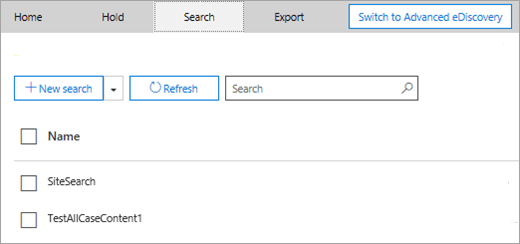
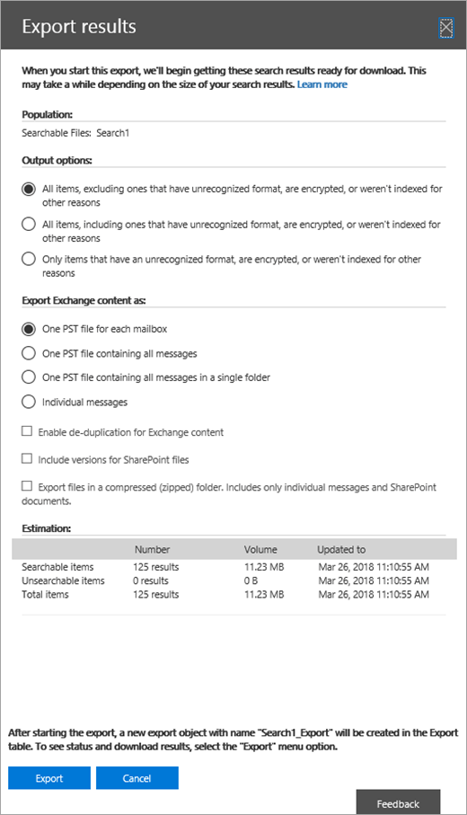

# <a name="manage-ediscovery-cases-in-the-security--compliance-center"></a><span data-ttu-id="f8ba3-105">在安全性 & 規範中心管理 eDiscovery 案例</span><span class="sxs-lookup"><span data-stu-id="f8ba3-105">Manage eDiscovery cases in the Security & Compliance Center</span></span>

<span data-ttu-id="f8ba3-106">您可以在 Office 365 和 Microsoft 365 的規範中心使用 eDiscovery 案例，以控制可在組織中建立、存取及管理 eDiscovery 案例的人員。</span><span class="sxs-lookup"><span data-stu-id="f8ba3-106">You can use eDiscovery cases in the compliance center in Office 365 and Microsoft 365 to control who can create, access, and manage eDiscovery cases in your organization.</span></span> <span data-ttu-id="f8ba3-107">如果您的組織有 Office 365 E5 訂閱，您也可以使用 eDiscovery 案例，使用 Office 365 Advanced eDiscovery 來分析搜尋結果。</span><span class="sxs-lookup"><span data-stu-id="f8ba3-107">If your organization has an Office 365 E5 subscription, you can also use eDiscovery cases to analyze search results by using Office 365 Advanced eDiscovery.</span></span>
  
<span data-ttu-id="f8ba3-108">EDiscovery 案例可讓您將成員新增至案例、控制特定案例成員可以執行的動作類型、保留與法律案例相關的內容位置，以及將多個內容搜尋與單一案例產生關聯。</span><span class="sxs-lookup"><span data-stu-id="f8ba3-108">An eDiscovery case allows you to add members to a case, control what types of actions that specific case members can perform, place a hold on content locations relevant to a legal case, and associate multiple Content Searches with a single case.</span></span> <span data-ttu-id="f8ba3-109">您也可以匯出與案例相關聯之任何內容搜尋的結果，或在高級 eDiscovery 中準備搜尋結果以進行分析。</span><span class="sxs-lookup"><span data-stu-id="f8ba3-109">You can also export the results of any Content Search that is associated with a case or prepare search results for analysis in Advanced eDiscovery.</span></span> <span data-ttu-id="f8ba3-110">eDiscovery 案例是一種很好的方法，可以限制哪些人員可以存取組織中特定法律案例的內容搜尋和搜尋結果。</span><span class="sxs-lookup"><span data-stu-id="f8ba3-110">eDiscovery cases are a good way to limit who has access to Content Searches and search results for a specific legal case in your organization.</span></span>
  
<span data-ttu-id="f8ba3-111">使用下列工作流程，在安全性 & 規範中心和高級 eDiscovery 中設定及使用 eDiscovery 案例。</span><span class="sxs-lookup"><span data-stu-id="f8ba3-111">Use the following workflow to set-up and use eDiscovery cases in the Security & Compliance Center and Advanced eDiscovery.</span></span>

[<span data-ttu-id="f8ba3-112">步驟1：將 eDiscovery 許可權指派給潛在的案例成員</span><span class="sxs-lookup"><span data-stu-id="f8ba3-112">Step 1: Assign eDiscovery permissions to potential case members</span></span>](#step-1-assign-ediscovery-permissions-to-potential-case-members)

[<span data-ttu-id="f8ba3-113">步驟2：建立新案例</span><span class="sxs-lookup"><span data-stu-id="f8ba3-113">Step 2: Create a new case</span></span>](#step-2-create-a-new-case)

[<span data-ttu-id="f8ba3-114">步驟3：新增成員至案例</span><span class="sxs-lookup"><span data-stu-id="f8ba3-114">Step 3: Add members to a case</span></span>](#step-3-add-members-to-a-case)

[<span data-ttu-id="f8ba3-115">步驟4：將內容位置置於保留狀態</span><span class="sxs-lookup"><span data-stu-id="f8ba3-115">Step 4: Place content locations on hold</span></span>](#step-4-place-content-locations-on-hold)

[<span data-ttu-id="f8ba3-116">步驟5：建立及執行與案例相關聯的內容搜尋</span><span class="sxs-lookup"><span data-stu-id="f8ba3-116">Step 5: Create and run a Content Search associated with a case</span></span>](#step-5-create-and-run-a-content-search-associated-with-a-case)

[<span data-ttu-id="f8ba3-117">步驟6：匯出與案例相關聯的內容搜尋結果</span><span class="sxs-lookup"><span data-stu-id="f8ba3-117">Step 6: Export the results of a Content Search associated with a case</span></span>](#step-6-export-the-results-of-a-content-search-associated-with-a-case)

[<span data-ttu-id="f8ba3-118">步驟7：準備高級 eDiscovery 的搜尋結果</span><span class="sxs-lookup"><span data-stu-id="f8ba3-118">Step 7: Prepare search results for Advanced eDiscovery</span></span>](#step-7-prepare-search-results-for-advanced-ediscovery)

[<span data-ttu-id="f8ba3-119">步驟8：在高級 eDiscovery 中移至案例</span><span class="sxs-lookup"><span data-stu-id="f8ba3-119">Step 8: Go to the case in Advanced eDiscovery</span></span>](#step-8-go-to-the-case-in-advanced-ediscovery)

[<span data-ttu-id="f8ba3-120">選步驟9：關閉案例</span><span class="sxs-lookup"><span data-stu-id="f8ba3-120">(Optional) Step 9: Close a case</span></span>](#optional-step-9-close-a-case)

[<span data-ttu-id="f8ba3-121">選步驟10：重新開啟已關閉的案例</span><span class="sxs-lookup"><span data-stu-id="f8ba3-121">(Optional) Step 10: Re-open a closed case</span></span>](#optional-step-10-re-open-a-closed-case)

[<span data-ttu-id="f8ba3-122">詳細資訊</span><span class="sxs-lookup"><span data-stu-id="f8ba3-122">More information</span></span>](#more-information)
  
## <a name="step-1-assign-ediscovery-permissions-to-potential-case-members"></a><span data-ttu-id="f8ba3-123">步驟1：將 eDiscovery 許可權指派給潛在的案例成員</span><span class="sxs-lookup"><span data-stu-id="f8ba3-123">Step 1: Assign eDiscovery permissions to potential case members</span></span>

<span data-ttu-id="f8ba3-124">第一步是將適當的 eDiscovery 相關許可權指派給人員，以便您可以將其新增至步驟2中的 eDiscovery 案例。</span><span class="sxs-lookup"><span data-stu-id="f8ba3-124">The first step is to assign the appropriate eDiscovery-related permissions to people so you can add them to an eDiscovery case in Step 2.</span></span> <span data-ttu-id="f8ba3-125">您必須是「安全性 & 規範中心」中「組織管理」角色群組（或「角色管理」角色）的成員，才能指派 eDiscovery 許可權。</span><span class="sxs-lookup"><span data-stu-id="f8ba3-125">You have to be a member of the Organization Management role group (or be assigned the Role Management role) in the Security & Compliance Center to assign eDiscovery permissions.</span></span> <span data-ttu-id="f8ba3-126">下列清單說明安全性 & 合規性中心內的 eDiscovery 相關角色群組。</span><span class="sxs-lookup"><span data-stu-id="f8ba3-126">The following list describes the eDiscovery-related role groups in the Security & Compliance Center.</span></span> 
  
- <span data-ttu-id="f8ba3-127">**評論家。**</span><span class="sxs-lookup"><span data-stu-id="f8ba3-127">**Reviewer.**</span></span> <span data-ttu-id="f8ba3-128">這個角色群組具有最嚴格的電子文件探索相關權限。</span><span class="sxs-lookup"><span data-stu-id="f8ba3-128">This role group has the most restrictive eDiscovery-related permissions.</span></span> <span data-ttu-id="f8ba3-129">這個角色群組的主要目的是讓成員能夠在[高級 ediscovery （古典）](office-365-advanced-ediscovery.md) （也稱為「*高級 ediscovery v1*」）中查看和存取案例資料。</span><span class="sxs-lookup"><span data-stu-id="f8ba3-129">The primary purpose of this role group is to allow members to view and access case data in [Advanced eDiscovery (classic)](office-365-advanced-ediscovery.md) (also known as *Advanced eDiscovery v1*).</span></span> <span data-ttu-id="f8ba3-130">此群組的成員只能查看及開啟其所屬安全性 & 規範中心中 [ **eDiscovery** ] 頁面上的案例清單。</span><span class="sxs-lookup"><span data-stu-id="f8ba3-130">Members of this group can only see and open the list of the cases on the **eDiscovery** page in the Security & Compliance Center that they are members of.</span></span> <span data-ttu-id="f8ba3-131">當使用者在安全性與合規性中心存取案例後，即可按一下 [**切換至高級 ediscovery** ]，以在高級 ediscovery 中存取及分析案例資料。</span><span class="sxs-lookup"><span data-stu-id="f8ba3-131">After the user accesses a case in the security and compliance center, they can click **Switch to Advanced eDiscovery** to access and analyze the case data in Advanced eDiscovery.</span></span> <span data-ttu-id="f8ba3-132">他們無法建立案例、新增成員至案例、建立保留、建立搜尋、預覽搜尋結果、匯出搜尋結果，或為高級 eDiscovery 的準備結果。</span><span class="sxs-lookup"><span data-stu-id="f8ba3-132">They can't create cases, add members to a case, create holds, create searches, preview search results, export search results, or prepare results for Advanced eDiscovery.</span></span> 

   > [!NOTE]
   > <span data-ttu-id="f8ba3-133">目前為止，「檢閱者」角色群組成員的使用者無法存取 Microsoft 365 （也稱為「*高級 ediscovery v2*」）中的 [[高級 ediscovery](overview-ediscovery-20.md) ] 中的資料。</span><span class="sxs-lookup"><span data-stu-id="f8ba3-133">At this time, users who are member of the Reviewer role group can't access data in [Advanced eDiscovery in Microsoft 365](overview-ediscovery-20.md) (also known as *Advanced eDiscovery v2*).</span></span> <span data-ttu-id="f8ba3-134">若要在高級 eDiscovery v2 中新增成員至案例，讓他們可以查看案例資料，使用者必須是 eDiscovery 管理員角色群組的成員。</span><span class="sxs-lookup"><span data-stu-id="f8ba3-134">To add members to a case in Advanced eDiscovery v2 so that they can review case data, a user must be a member of the eDiscovery Manager role group.</span></span>
    
- <span data-ttu-id="f8ba3-135">**eDiscovery 管理員。**</span><span class="sxs-lookup"><span data-stu-id="f8ba3-135">**eDiscovery Manager.**</span></span> <span data-ttu-id="f8ba3-136">這個角色群組的成員可以建立及管理 eDiscovery 案例。</span><span class="sxs-lookup"><span data-stu-id="f8ba3-136">Members of this role group can create and manage eDiscovery cases.</span></span> <span data-ttu-id="f8ba3-137">他們可以新增及移除成員、放置內容位置、建立及編輯與案例相關聯的內容搜尋、匯出內容搜尋的結果，以及在高級 eDiscovery 中準備用於分析的搜尋結果。</span><span class="sxs-lookup"><span data-stu-id="f8ba3-137">They can add and remove members, place content locations on hold, create and edit Content Searches associated with a case, export the results of a Content Search, and prepare search results for analysis in Advanced eDiscovery.</span></span> <span data-ttu-id="f8ba3-138">這個角色群組中有兩個子群組。</span><span class="sxs-lookup"><span data-stu-id="f8ba3-138">There are two subgroups in this role group.</span></span> <span data-ttu-id="f8ba3-139">這些子群組之間的差異是以範圍為基礎。</span><span class="sxs-lookup"><span data-stu-id="f8ba3-139">The difference between these subgroups is based on scope.</span></span>
    
  - <span data-ttu-id="f8ba3-140">**eDiscovery 管理員。**</span><span class="sxs-lookup"><span data-stu-id="f8ba3-140">**eDiscovery Manager.**</span></span> <span data-ttu-id="f8ba3-141">可以查看及管理他們建立的 eDiscovery 案例或其成員。</span><span class="sxs-lookup"><span data-stu-id="f8ba3-141">Can view and manage the eDiscovery cases they create or are a member of.</span></span> <span data-ttu-id="f8ba3-142">如果另一個 eDiscovery Manager 建立了案例，但沒有將第二個 eDiscovery 管理員新增為該案例的成員，則第二個 eDiscovery 管理員將無法在安全性 & 規範中心的「 **eDiscovery** 」頁面上，查看或開啟此案例。</span><span class="sxs-lookup"><span data-stu-id="f8ba3-142">If another eDiscovery Manager creates a case but doesn't add a second eDiscovery Manager as a member of that case, the second eDiscovery Manager won't be able to view or open the case on the **eDiscovery** page in the Security & Compliance Center.</span></span> <span data-ttu-id="f8ba3-143">eDiscovery 管理員也可以在高級 eDiscovery 中存取其案例，以執行分析任務。</span><span class="sxs-lookup"><span data-stu-id="f8ba3-143">eDiscovery Managers can also access their cases in Advanced eDiscovery to perform analysis tasks.</span></span> 
    
  - <span data-ttu-id="f8ba3-144">\**eDiscovery 管理員 *。**</span><span class="sxs-lookup"><span data-stu-id="f8ba3-144">**eDiscovery Administrator\*.**</span></span> <span data-ttu-id="f8ba3-145">可以執行 eDiscovery 管理員可以執行的所有案例管理工作。</span><span class="sxs-lookup"><span data-stu-id="f8ba3-145">Can perform all case management tasks that an eDiscovery Manager can do.</span></span> <span data-ttu-id="f8ba3-146">此外，電子檔探索管理員也可以：</span><span class="sxs-lookup"><span data-stu-id="f8ba3-146">Additionally, an eDiscovery Administrator can:</span></span>
    
    - <span data-ttu-id="f8ba3-147">檢視 [eDiscovery]\*\*\*\* 頁面上列出的所有案例。</span><span class="sxs-lookup"><span data-stu-id="f8ba3-147">View all cases that are listed on the **eDiscovery** page.</span></span> 
    
    - <span data-ttu-id="f8ba3-148">管理組織中的任何案例後，將自己新增為案例成員。</span><span class="sxs-lookup"><span data-stu-id="f8ba3-148">Manage any case in the organization after they add themself as a member of the case.</span></span>
    
    - <span data-ttu-id="f8ba3-149">針對組織中的任何案例，存取高級 eDiscovery 中的案例資料。</span><span class="sxs-lookup"><span data-stu-id="f8ba3-149">Access case data in Advanced eDiscovery for any case in the organization.</span></span>
    
    <span data-ttu-id="f8ba3-150">請參閱[詳細資訊](#more-information)一節，瞭解您可能想要組織中的 eDiscovery 管理員的原因。</span><span class="sxs-lookup"><span data-stu-id="f8ba3-150">See the [More information](#more-information) section for reasons why you may want an eDiscovery Administrator in your organization.</span></span> 

<span data-ttu-id="f8ba3-151">如需有關 eDiscovery 許可權的詳細資訊，請參閱[指派 eDiscovery 許可權](assign-ediscovery-permissions.md)。</span><span class="sxs-lookup"><span data-stu-id="f8ba3-151">For more information about eDiscovery permissions, see [Assign eDiscovery permissions](assign-ediscovery-permissions.md).</span></span>
  
 <span data-ttu-id="f8ba3-152">**若要指派 eDiscovery 許可權：**</span><span class="sxs-lookup"><span data-stu-id="f8ba3-152">**To assign eDiscovery permissions:**</span></span>
  
1. <span data-ttu-id="f8ba3-153">請移至 [https://protection.office.com](https://protection.office.com)。</span><span class="sxs-lookup"><span data-stu-id="f8ba3-153">Go to [https://protection.office.com](https://protection.office.com).</span></span>
    
2. <span data-ttu-id="f8ba3-154">使用公司或學校帳戶登入 Office 365。</span><span class="sxs-lookup"><span data-stu-id="f8ba3-154">Sign in to Office 365 using your work or school account.</span></span>
    
3. <span data-ttu-id="f8ba3-155">在 [安全性 & 規範中心] 中，按一下 [**許可權**]，然後根據您想要指派的 eDiscovery 許可權，執行下列其中一項作業。</span><span class="sxs-lookup"><span data-stu-id="f8ba3-155">In the Security & Compliance Center, click **Permissions**, and then do one of the following based on the eDiscovery permissions that you want to assign.</span></span>
    
    - <span data-ttu-id="f8ba3-156">若要指派「檢閱者」許可權，請選取 [**檢閱者**] 角色群組，然後按一下 [**成員**] 旁邊的 [**編輯**]。</span><span class="sxs-lookup"><span data-stu-id="f8ba3-156">To assign Reviewer permissions, select the **Reviewer** role group, and then next to **Members**, click **Edit**.</span></span> <span data-ttu-id="f8ba3-157">按一下 **[選擇成員**] \*\* **，按一下 [ ![編輯]](../media/ITPro-EAC-AddIcon.gif) ，按一下 [新增圖示] [**新增**]，選取您要新增至檢閱者角色群組的使用者，然後按一下 [**新增\*\*]。</span><span class="sxs-lookup"><span data-stu-id="f8ba3-157">Click **Choose members**, click **Edit**, click  **Add**, select the user that you want to add to the Reviewer role group, and then click **Add**.</span></span>
    
    - <span data-ttu-id="f8ba3-158">若要指派 eDiscovery 管理員許可權，請選取 [ **Ediscovery 管理員**] 角色群組，然後按一下 [ **ediscovery 管理員**] 旁邊的 [**編輯**]。</span><span class="sxs-lookup"><span data-stu-id="f8ba3-158">To assign eDiscovery Manager permissions, select the **eDiscovery Manager** role group, and then next to **eDiscovery Manager**, click **Edit**.</span></span> <span data-ttu-id="f8ba3-159">按一下 **[選擇 EDiscovery 管理員**] \*\* \*\*，按一下 [ ![編輯]](../media/ITPro-EAC-AddIcon.gif) ，按一下 [新增圖示 \* \* 新增] \* \*，選取您要新增為 EDiscovery 管理員的使用者，然後按一下 [**新增**]。</span><span class="sxs-lookup"><span data-stu-id="f8ba3-159">Click **Choose eDiscovery Manager**, click **Edit**, click  \*\* Add \*\*, select the user that you want to add as an eDiscovery Manager, and then click **Add**.</span></span>
    
    - <span data-ttu-id="f8ba3-160">若要指派 eDiscovery 系統管理員許可權，請選取 [ **ediscovery**管理員] 角色群組，然後按一下 [ **ediscovery 管理員**] 旁邊的 [**編輯**]。</span><span class="sxs-lookup"><span data-stu-id="f8ba3-160">To assign eDiscovery Administrator permissions, select the **eDiscovery Manager** role group, and then next to **eDiscovery Administrator**, click **Edit**.</span></span> <span data-ttu-id="f8ba3-161">按一下 **[選擇 eDiscovery 系統管理員**]，按一下![[**編輯**]，按一下 [新增圖示](../media/ITPro-EAC-AddIcon.gif) **] [新增]**，選取您要新增為 eDiscovery 管理員的使用者，然後按一下 [**新增**]。</span><span class="sxs-lookup"><span data-stu-id="f8ba3-161">Click **Choose eDiscovery Administrator**, click **Edit**, click  **Add**, select the user that you want to add as an eDiscovery Administrator, and then click **Add**.</span></span>
    
4. <span data-ttu-id="f8ba3-162">在您新增所有使用者之後，按一下 [**完成**]，按一下 [**儲存**]，將變更儲存到角色群組，然後按一下 [**關閉**]。</span><span class="sxs-lookup"><span data-stu-id="f8ba3-162">After you have added all the users, click **Done**, click **Save** to save the changes to the role group, and then click **Close**.</span></span>

## <a name="step-2-create-a-new-case"></a><span data-ttu-id="f8ba3-163">步驟2：建立新案例</span><span class="sxs-lookup"><span data-stu-id="f8ba3-163">Step 2: Create a new case</span></span>

<span data-ttu-id="f8ba3-164">下一步是建立 eDiscovery 案例。</span><span class="sxs-lookup"><span data-stu-id="f8ba3-164">The next step is to create a eDiscovery case.</span></span> <span data-ttu-id="f8ba3-165">您必須是 eDiscovery 管理員角色群組的成員，才可建立 eDiscovery 案例。</span><span class="sxs-lookup"><span data-stu-id="f8ba3-165">You must be a member of the eDiscovery Managers role group to create eDiscovery cases.</span></span> <span data-ttu-id="f8ba3-166">如先前所述，在安全性 & 合規性中心建立案例之後，如果您的組織有 Office 365 E5 訂閱，您（和其他案例成員）將能夠在高級 eDiscovery 中存取該相同案例。</span><span class="sxs-lookup"><span data-stu-id="f8ba3-166">As previously explained, after you create a case in the Security & Compliance Center, you (and other case members) will be able to access that same case in Advanced eDiscovery if your organization has an Office 365 E5 subscription.</span></span>
  
1. <span data-ttu-id="f8ba3-167">請移至 [https://protection.office.com](https://protection.office.com)。</span><span class="sxs-lookup"><span data-stu-id="f8ba3-167">Go to [https://protection.office.com](https://protection.office.com).</span></span>
    
2. <span data-ttu-id="f8ba3-168">使用公司或學校帳戶登入 Office 365。</span><span class="sxs-lookup"><span data-stu-id="f8ba3-168">Sign in to Office 365 using your work or school account.</span></span>
    
3. <span data-ttu-id="f8ba3-169">在 [安全性 & 規範中心] 中，按一下 [ **ediscovery** \> **ediscovery**] 按一下 [新增圖示]**建立案例**。</span><span class="sxs-lookup"><span data-stu-id="f8ba3-169">In the Security & Compliance Center, click **eDiscovery** \> **eDiscovery**, and then click  **Create a case**.</span></span>
    
4. <span data-ttu-id="f8ba3-170">在 [**新案例**] 頁面上，為案例輸入名稱，輸入選用的描述，然後按一下 [**儲存**]。</span><span class="sxs-lookup"><span data-stu-id="f8ba3-170">On the **New Case** page, give the case a name, type an optional description, and then click **Save**.</span></span> <span data-ttu-id="f8ba3-171">案例名稱在您的組織中必須是唯一的。</span><span class="sxs-lookup"><span data-stu-id="f8ba3-171">The case name must be unique in your organization.</span></span>
    
    
  
    <span data-ttu-id="f8ba3-173">新案例會顯示在 [ **eDiscovery** ] 頁面上的案例清單中。</span><span class="sxs-lookup"><span data-stu-id="f8ba3-173">The new case is displayed in the list of cases on the **eDiscovery** page.</span></span> <span data-ttu-id="f8ba3-174">您可以將游標懸停在案例名稱上方，以顯示案例的相關資訊，包括案例的狀態（使用中或**已關閉**）、案例的**描述（在**上一個步驟中建立），以及案例最後變更的時間和變更者。</span><span class="sxs-lookup"><span data-stu-id="f8ba3-174">You can hover the cursor over a case name to display information about the case, including the status of the case (**Active** or **Closed**), the description of the case (that was created in the previous step), and when the case was changed last and who changed it.</span></span>
    
    > [!TIP]
    > <span data-ttu-id="f8ba3-175">在您建立新的案例之後，您可以隨時重新命名。</span><span class="sxs-lookup"><span data-stu-id="f8ba3-175">After you create a new case, you can rename it anytime.</span></span> <span data-ttu-id="f8ba3-176">只要在 [ **eDiscovery** ] 頁面上按一下案例的名稱即可。</span><span class="sxs-lookup"><span data-stu-id="f8ba3-176">Just click the name of the case on the **eDiscovery** page.</span></span> <span data-ttu-id="f8ba3-177">在 [**管理此案例**飛入] 頁面上，變更顯示在 [**名稱**] 方塊中方塊的名稱，然後儲存變更。</span><span class="sxs-lookup"><span data-stu-id="f8ba3-177">On the **Manage this case** flyout page, change the name displayed in the box under **Name**, and then save the change.</span></span> 
## <a name="step-3-add-members-to-a-case"></a><span data-ttu-id="f8ba3-178">步驟3：新增成員至案例</span><span class="sxs-lookup"><span data-stu-id="f8ba3-178">Step 3: Add members to a case</span></span>

<span data-ttu-id="f8ba3-179">在您建立案例之後，下一步是將成員新增至案例。</span><span class="sxs-lookup"><span data-stu-id="f8ba3-179">After you create a case, the next step is to add members to the case.</span></span> <span data-ttu-id="f8ba3-180">建立案例的 eDiscovery 管理員會自動新增為成員。</span><span class="sxs-lookup"><span data-stu-id="f8ba3-180">The eDiscovery Manager who created the case is automatically added as a member.</span></span> <span data-ttu-id="f8ba3-181">如先前所述，成員必須指派適當的 eDiscovery 許可權，才能在新增時存取案例。</span><span class="sxs-lookup"><span data-stu-id="f8ba3-181">As previously explained, members have to assign the appropriate eDiscovery permissions so they can access the case after you add them.</span></span>
  
1. <span data-ttu-id="f8ba3-182">在 [安全性 & 規範中心] 中，按一下 [ **ediscovery** \> **ediscovery** ] 以顯示組織中案例的清單。</span><span class="sxs-lookup"><span data-stu-id="f8ba3-182">In the Security & Compliance Center, click **eDiscovery** \> **eDiscovery** to display the list of cases in your organization.</span></span> 

2. <span data-ttu-id="f8ba3-183">按一下您想要新增成員的案例名稱。</span><span class="sxs-lookup"><span data-stu-id="f8ba3-183">Click the name of the case that you want to add members to.</span></span>

    <span data-ttu-id="f8ba3-184">[**管理此案例**飛出] 頁面隨即顯示。</span><span class="sxs-lookup"><span data-stu-id="f8ba3-184">The **Manage this case** flyout page is displayed.</span></span> 

    
  
3. <span data-ttu-id="f8ba3-186">在 [**管理成員**] 按一下 [新增圖示**add** to add members to a case。</span><span class="sxs-lookup"><span data-stu-id="f8ba3-186">Under **Manage members**, click  **Add** to add members to the case.</span></span> 

    <span data-ttu-id="f8ba3-187">您也可以選擇將角色群組新增至案例。</span><span class="sxs-lookup"><span data-stu-id="f8ba3-187">You can also choose to add a role group to the case.</span></span> <span data-ttu-id="f8ba3-188">在 [**管理角色群組**] 按一下 [新增圖示] [**新增**]。</span><span class="sxs-lookup"><span data-stu-id="f8ba3-188">Under **Manage role groups**, click  **Add**.</span></span>

    > [!NOTE]
    > <span data-ttu-id="f8ba3-189">角色群組控制誰可以指派成員至 eDiscovery 案例。</span><span class="sxs-lookup"><span data-stu-id="f8ba3-189">Role groups control who can assign members to an eDiscovery case.</span></span> <span data-ttu-id="f8ba3-190">這表示您只可以將您所屬的角色群組指派給案例。</span><span class="sxs-lookup"><span data-stu-id="f8ba3-190">That means you can only assign the role groups that you are a member of to a case.</span></span>

4. <span data-ttu-id="f8ba3-191">在可以新增為案例成員之人員或角色群組的清單中，按一下您要新增之人員或角色群組名稱旁邊的核取方塊。</span><span class="sxs-lookup"><span data-stu-id="f8ba3-191">In the list of people or role groups that can be added as members of the case, click the check box next to the names of the people or role groups that you want to add.</span></span>

    > [!TIP]
    > <span data-ttu-id="f8ba3-192">如果您有很多可以新增為成員的人員清單，請使用**搜尋**方塊來搜尋清單中的特定人員。</span><span class="sxs-lookup"><span data-stu-id="f8ba3-192">If you have a large list of people who can added as members, use the **Search** box to search for a specific person in the list.</span></span> 
  
5. <span data-ttu-id="f8ba3-193">選取要新增為群組成員的人員或角色群組之後，按一下 [**新增**]。</span><span class="sxs-lookup"><span data-stu-id="f8ba3-193">After you select the people or role groups to add as members of the group, click **Add**.</span></span>
    
    <span data-ttu-id="f8ba3-194">在 [**管理此案例**] 中，按一下 [**儲存**] 儲存新的案例成員清單。</span><span class="sxs-lookup"><span data-stu-id="f8ba3-194">In **Manage this case**, click **Save** to save the new list of case members.</span></span> 
    
6. <span data-ttu-id="f8ba3-195">按一下 [**儲存**] 儲存新的案例成員清單。</span><span class="sxs-lookup"><span data-stu-id="f8ba3-195">Click **Save** to save the new list of case members.</span></span> 
  
## <a name="step-4-place-content-locations-on-hold"></a><span data-ttu-id="f8ba3-196">步驟4：將內容位置置於保留狀態</span><span class="sxs-lookup"><span data-stu-id="f8ba3-196">Step 4: Place content locations on hold</span></span>

<span data-ttu-id="f8ba3-197">您可以使用 eDiscovery 案例來建立保留，以保留可能與案例相關的內容。</span><span class="sxs-lookup"><span data-stu-id="f8ba3-197">You can use an eDiscovery case to create holds to preserve content that might be relevant to the case.</span></span> <span data-ttu-id="f8ba3-198">在案例中，您可以針對擁有保管人之人員的商務網站，保留信箱和 OneDrive。</span><span class="sxs-lookup"><span data-stu-id="f8ba3-198">You can place a hold on the mailboxes and OneDrive for Business sites of people who are custodians in the case.</span></span> <span data-ttu-id="f8ba3-199">您也可以在群組信箱、SharePoint 網站，以及 Office 365 群組的商務用網站 OneDrive 進行保留。</span><span class="sxs-lookup"><span data-stu-id="f8ba3-199">You can also place a hold on the group mailbox, SharePoint site, and OneDrive for Business site for an Office 365 Group.</span></span> <span data-ttu-id="f8ba3-200">同樣地，您可以在與 Microsoft 小組或 Yammer 群組相關聯的信箱和網站上進行保留。</span><span class="sxs-lookup"><span data-stu-id="f8ba3-200">Similarly, you can place a hold on the mailboxes and sites that are associated with Microsoft Teams or Yammer Groups.</span></span> <span data-ttu-id="f8ba3-201">當您將內容位置置於保留狀態時，會保留內容，直到您從內容位置移除保留，或刪除保留為止。</span><span class="sxs-lookup"><span data-stu-id="f8ba3-201">When you place content locations on hold, content is held until you remove the hold from the content location or until you delete the hold.</span></span>

> [!NOTE]
> <span data-ttu-id="f8ba3-202">保留內容的位置後，保留時間會長達24小時。</span><span class="sxs-lookup"><span data-stu-id="f8ba3-202">After you place a content location on hold, it takes up to 24 hours for the hold to take effect.</span></span> 

<span data-ttu-id="f8ba3-203">當您建立保留時，您可以使用下列選項來限定保留在指定內容位置的內容：</span><span class="sxs-lookup"><span data-stu-id="f8ba3-203">When you create a hold, you have the following options to scope the content that is held in the specified content locations:</span></span>
  
- <span data-ttu-id="f8ba3-204">您可以在保留所有內容的位置建立無限保留。</span><span class="sxs-lookup"><span data-stu-id="f8ba3-204">You create an infinite hold where all content is placed on hold.</span></span> <span data-ttu-id="f8ba3-205">或者，您也可以建立以查詢為基礎的保留，只保留符合搜尋查詢的內容。</span><span class="sxs-lookup"><span data-stu-id="f8ba3-205">Alternatively, you can create a query-based hold where only content that matches a search query is placed on hold.</span></span>
    
- <span data-ttu-id="f8ba3-206">您可以指定日期範圍，只保留在該日期範圍內傳送、接收或建立的內容。</span><span class="sxs-lookup"><span data-stu-id="f8ba3-206">You can specify a date range to hold only the content that was sent, received, or created within that date range.</span></span> <span data-ttu-id="f8ba3-207">或者，您可以保留所有內容，不論它是在何時傳送、接收或建立。</span><span class="sxs-lookup"><span data-stu-id="f8ba3-207">Alternatively, you can hold all content regardless of when it was sent, received, or created.</span></span>
    
> [!NOTE]
> <span data-ttu-id="f8ba3-208">您的組織中的所有 eDiscovery 案例，您最多可以有10000保留原則。</span><span class="sxs-lookup"><span data-stu-id="f8ba3-208">You can have a maximum of 10,000 hold policies across all eDiscovery cases in your organization.</span></span> 
  
<span data-ttu-id="f8ba3-209">若要建立 eDiscovery 案例的保留：</span><span class="sxs-lookup"><span data-stu-id="f8ba3-209">To create a hold for an eDiscovery case:</span></span>
  
1. <span data-ttu-id="f8ba3-210">在 [安全性 & 規範中心] 中，按一下 [ **ediscovery** \> **ediscovery** ] 以顯示組織中案例的清單。</span><span class="sxs-lookup"><span data-stu-id="f8ba3-210">In the Security & Compliance Center, click **eDiscovery** \> **eDiscovery** to display the list of cases in your organization.</span></span> 
    
2. <span data-ttu-id="f8ba3-211">按一下您要建立保留之案例旁邊的 [**開啟**]。</span><span class="sxs-lookup"><span data-stu-id="f8ba3-211">Click **Open** next to the case that you want to create the holds in.</span></span> 
    
3. <span data-ttu-id="f8ba3-212">在案例的**首頁**上，按一下 [**保留**] 索引標籤。</span><span class="sxs-lookup"><span data-stu-id="f8ba3-212">On the **Home** page for the case, click the **Hold** tab.</span></span> 
    
    ![按一下 [保留] 索引標籤](../media/3fef2db4-36de-4517-a34d-82f47b82d9bf.png)
  
4. <span data-ttu-id="f8ba3-214">在 [**保留**] 頁面上 [新增圖示**建立**]。</span><span class="sxs-lookup"><span data-stu-id="f8ba3-214">On the **Hold** page, click  **Create**.</span></span>
    
5. <span data-ttu-id="f8ba3-215">在 [**命名您的保留**] 頁面上，指定保留名稱。</span><span class="sxs-lookup"><span data-stu-id="f8ba3-215">On the **Name your hold** page, give the hold a name.</span></span> <span data-ttu-id="f8ba3-216">[保留] 的名稱在您的組織中必須是唯一的。</span><span class="sxs-lookup"><span data-stu-id="f8ba3-216">The name of the hold must be unique in your organization.</span></span> 
    
    
  
6. <span data-ttu-id="f8ba3-218">選在 [**描述**] 方塊中，新增保留的描述。</span><span class="sxs-lookup"><span data-stu-id="f8ba3-218">(Optional) In the **Description** box, add a description of the hold.</span></span> 
    
7. <span data-ttu-id="f8ba3-219">按 **[下一步]**。</span><span class="sxs-lookup"><span data-stu-id="f8ba3-219">Click **Next**.</span></span>
    
8. <span data-ttu-id="f8ba3-220">選擇您要保留的內容位置。</span><span class="sxs-lookup"><span data-stu-id="f8ba3-220">Choose the content locations that you want to place on hold.</span></span> <span data-ttu-id="f8ba3-221">您可以將信箱、網站和公用資料夾放入暫止狀態。</span><span class="sxs-lookup"><span data-stu-id="f8ba3-221">You can place mailboxes, sites, and public folders on hold.</span></span>
    
    
  
   <span data-ttu-id="f8ba3-223">a.</span><span class="sxs-lookup"><span data-stu-id="f8ba3-223">a.</span></span> <span data-ttu-id="f8ba3-224">**Exchange 電子郵件**-按一下 **[選擇使用者、群組或小組**]，然後再按一下 **[選擇使用者、群組或小組**]。</span><span class="sxs-lookup"><span data-stu-id="f8ba3-224">**Exchange email** - Click **Choose users, groups, or teams** and then click **Choose users, groups, or teams** again.</span></span> <span data-ttu-id="f8ba3-225">指定要置於保留狀態的信箱。</span><span class="sxs-lookup"><span data-stu-id="f8ba3-225">to specify mailboxes to place on hold.</span></span> <span data-ttu-id="f8ba3-226">使用搜尋方塊來尋找使用者信箱和通訊群組（保留信箱的群組成員）以保留。</span><span class="sxs-lookup"><span data-stu-id="f8ba3-226">Use the search box to find user mailboxes and distribution groups (to place a hold on the mailboxes of group members) to place on hold.</span></span> <span data-ttu-id="f8ba3-227">您也可以在 Microsoft 小組、Yammer 群組或 Office 365 群組的相關信箱上放置保留。</span><span class="sxs-lookup"><span data-stu-id="f8ba3-227">You can also place a hold on the associated mailbox for a Microsoft Team, a Yammer Group, or an Office 365 Group.</span></span> <span data-ttu-id="f8ba3-228">選取 [使用者、群組、小組] 核取方塊，按一下 **[選擇**]，然後按一下 [**完成**]。</span><span class="sxs-lookup"><span data-stu-id="f8ba3-228">Select the user, group, team check box, click **Choose**, and then click **Done**.</span></span>
    
    > [!NOTE]
    > <span data-ttu-id="f8ba3-229">當您按一下 **[選擇使用者、群組或小組**以指定要保留的信箱] 時，顯示的信箱選擇器會是空的。</span><span class="sxs-lookup"><span data-stu-id="f8ba3-229">When you click **Choose users, groups, or teams** to specify mailboxes to place on hold, the mailbox picker that's displayed is empty.</span></span> <span data-ttu-id="f8ba3-230">這項設計的目的是提升效能。</span><span class="sxs-lookup"><span data-stu-id="f8ba3-230">This is by design to enhance performance.</span></span> <span data-ttu-id="f8ba3-231">若要將人員新增至此清單，請在 [搜尋] 方塊中輸入名稱（至少3個字元）。</span><span class="sxs-lookup"><span data-stu-id="f8ba3-231">To add people to this list, type a name (a minimum of 3 characters) in the search box.</span></span> 

   <span data-ttu-id="f8ba3-232">b.</span><span class="sxs-lookup"><span data-stu-id="f8ba3-232">b.</span></span> <span data-ttu-id="f8ba3-233">**SharePoint 網站**-按一下 **[選擇網站**]，然後按一下 **[選擇網站**]，以指定要保留之商務網站的 SharePoint 和 OneDrive。</span><span class="sxs-lookup"><span data-stu-id="f8ba3-233">**SharePoint sites** - Click **Choose sites** and then click **Choose sites** again to specify SharePoint and OneDrive for Business sites to place on hold.</span></span> <span data-ttu-id="f8ba3-234">輸入您要保留之每個網站的 URL。</span><span class="sxs-lookup"><span data-stu-id="f8ba3-234">Type the URL for each site that you want to place on hold.</span></span> <span data-ttu-id="f8ba3-235">您也可以為 Microsoft 團隊、Yammer 群組或 Office 365 群組新增 SharePoint 網站的 URL。</span><span class="sxs-lookup"><span data-stu-id="f8ba3-235">You can also add the URL for the SharePoint site for a Microsoft Team, a Yammer Group, or a, Office 365 Group.</span></span> <span data-ttu-id="f8ba3-236">按一下 **[選擇**]，然後按一下 [**完成**]。</span><span class="sxs-lookup"><span data-stu-id="f8ba3-236">Click **Choose**, and then click **Done**.</span></span>
    
    <span data-ttu-id="f8ba3-237">請參閱[詳細資訊](#more-information)一節，以取得 Microsoft 團隊、Yammer 群組和 Office 365 群組暫止的秘訣。</span><span class="sxs-lookup"><span data-stu-id="f8ba3-237">See the [More information](#more-information) section for tips on putting Microsoft Teams, Yammer Groups, and Office 365 Groups on hold.</span></span> 
    
    > [!NOTE]
    > <span data-ttu-id="f8ba3-238">在極少的情況下，使用者的使用者主要名稱（UPN）變更時，其 OneDrive 帳戶的 URL 也會變更，以加入新的 UPN。</span><span class="sxs-lookup"><span data-stu-id="f8ba3-238">In the rare case that a person's user principal name (UPN) is changed, the URL for their OneDrive account will also be changed to incorporate the new UPN.</span></span> <span data-ttu-id="f8ba3-239">如果發生這種情況，您必須新增使用者的新 OneDrive URL 並移除舊的 URL 來修改保留。</span><span class="sxs-lookup"><span data-stu-id="f8ba3-239">If this happens, you'll have to modify the hold by adding the user's new OneDrive URL and removing the old one.</span></span> <span data-ttu-id="f8ba3-240">如需詳細資訊，請參閱[UPN 變更對 ONEDRIVE URL 的影響](https://docs.microsoft.com/onedrive/upn-changes)。</span><span class="sxs-lookup"><span data-stu-id="f8ba3-240">For more information, see [How UPN changes affect the OneDrive URL](https://docs.microsoft.com/onedrive/upn-changes).</span></span>
  
   <span data-ttu-id="f8ba3-241">c.</span><span class="sxs-lookup"><span data-stu-id="f8ba3-241">c.</span></span> <span data-ttu-id="f8ba3-242">**Exchange 公用資料夾。**</span><span class="sxs-lookup"><span data-stu-id="f8ba3-242">**Exchange public folders.**</span></span> <span data-ttu-id="f8ba3-243">將切換切換移至 [**全部**] 位置，將 Exchange Online 組織中的所有公用資料夾保留。</span><span class="sxs-lookup"><span data-stu-id="f8ba3-243">Move the toggle switch  to the **All** position to put all public folders in your Exchange Online organization on hold.</span></span> <span data-ttu-id="f8ba3-244">您無法選擇要保留的特定公用資料夾。</span><span class="sxs-lookup"><span data-stu-id="f8ba3-244">You can't choose specific public folders to put on hold.</span></span> <span data-ttu-id="f8ba3-245">如果您不想要保留公用資料夾，請將切換參數設為 [**無**]。</span><span class="sxs-lookup"><span data-stu-id="f8ba3-245">Leave the toggle switch set to **None** if you don't want to put a hold on public folders.</span></span>
    
9. <span data-ttu-id="f8ba3-246">當您完成將內容位置新增至保留狀態時，按 **[下一步]**。</span><span class="sxs-lookup"><span data-stu-id="f8ba3-246">When you're done adding content locations to the hold, click **Next**.</span></span>
    
10. <span data-ttu-id="f8ba3-247">若要建立查詢式保留與條件，請完成下列。</span><span class="sxs-lookup"><span data-stu-id="f8ba3-247">To create a query-based hold with conditions, complete the following.</span></span> <span data-ttu-id="f8ba3-248">否則，按 **[下一步]**</span><span class="sxs-lookup"><span data-stu-id="f8ba3-248">Otherwise, click **Next**</span></span>
    
    
  
    
       <span data-ttu-id="f8ba3-250">a.</span><span class="sxs-lookup"><span data-stu-id="f8ba3-250">a.</span></span> <span data-ttu-id="f8ba3-251">在 [**關鍵字**] 底下的方塊中輸入搜尋查詢，以便只保留符合搜尋準則的內容。</span><span class="sxs-lookup"><span data-stu-id="f8ba3-251">In the box under **Keywords**, type a search query in the box so that only the content that meets the search criteria is placed on hold.</span></span> <span data-ttu-id="f8ba3-252">您可以指定關鍵字、郵件屬性或檔案屬性，例如檔案名稱。</span><span class="sxs-lookup"><span data-stu-id="f8ba3-252">You can specify keywords, message properties, or document properties, such as file names.</span></span> <span data-ttu-id="f8ba3-253">您也可以使用更複雜的查詢，使用布林運算子，例如**AND**、 **or**或**NOT**。</span><span class="sxs-lookup"><span data-stu-id="f8ba3-253">You can also use more complex queries that use a Boolean operator, such as **AND**, **OR**, or **NOT**.</span></span> <span data-ttu-id="f8ba3-254">如果 [關鍵字] 方塊是空白的，則位於指定內容位置的所有內容都會處於保留狀態。</span><span class="sxs-lookup"><span data-stu-id="f8ba3-254">If you leave the keyword box empty, then all content located in the specified content locations will be placed on hold.</span></span>
    
    <span data-ttu-id="f8ba3-255">b.</span><span class="sxs-lookup"><span data-stu-id="f8ba3-255">b.</span></span> <span data-ttu-id="f8ba3-256">按一下圖示] [**新增條件**] 以加入一或多個條件，以縮小保留的搜尋查詢。</span><span class="sxs-lookup"><span data-stu-id="f8ba3-256">Click  **Add conditions** to add one or more conditions to narrow the search query for the hold.</span></span> <span data-ttu-id="f8ba3-257">每個條件都會將子句新增至您建立保留時所建立並執行的 KQL 搜尋查詢。</span><span class="sxs-lookup"><span data-stu-id="f8ba3-257">Each condition adds a clause to the KQL search query that is created and run when you create the hold.</span></span> <span data-ttu-id="f8ba3-258">例如，您可以指定日期範圍，讓在日期範圍內建立的電子郵件或網站檔處於暫止狀態。</span><span class="sxs-lookup"><span data-stu-id="f8ba3-258">For example, you can specify a date range so that email or site documents that were created within the date ranged are placed on hold.</span></span> <span data-ttu-id="f8ba3-259">條件會以 **AND** 運算子的邏輯方式連接至關鍵字查詢 (在關鍵字方塊中指定)。</span><span class="sxs-lookup"><span data-stu-id="f8ba3-259">A condition is logically connected to the keyword query (specified in the keyword box) by the **AND** operator.</span></span> <span data-ttu-id="f8ba3-260">這表示專案必須同時滿足關鍵字查詢和要置於保留狀態的條件。</span><span class="sxs-lookup"><span data-stu-id="f8ba3-260">That means that items have to satisfy both the keyword query and the condition to be placed on hold.</span></span>

    <span data-ttu-id="f8ba3-261">如需建立搜尋查詢和使用條件的詳細資訊，請參閱[內容搜尋的關鍵字查詢和搜尋條件](keyword-queries-and-search-conditions.md)。</span><span class="sxs-lookup"><span data-stu-id="f8ba3-261">For more information about creating a search query and using conditions, see [Keyword queries and search conditions for Content Search](keyword-queries-and-search-conditions.md).</span></span>
    
11. <span data-ttu-id="f8ba3-262">設定查詢型保留後，請按 **[下一步]**。</span><span class="sxs-lookup"><span data-stu-id="f8ba3-262">After configuring a query-based hold, click **Next**.</span></span>
    
12. <span data-ttu-id="f8ba3-263">請複查您的設定，然後按一下 [**建立此保留**]。</span><span class="sxs-lookup"><span data-stu-id="f8ba3-263">Review your settings, and then click **Create this hold**.</span></span>
    
### <a name="hold-statistics"></a><span data-ttu-id="f8ba3-264">保留統計資料</span><span class="sxs-lookup"><span data-stu-id="f8ba3-264">Hold statistics</span></span>

<span data-ttu-id="f8ba3-265">一段時間之後，有關新保留的資訊會顯示在所選保留的 [**保留**] 頁面上的 [詳細資料] 窗格中。</span><span class="sxs-lookup"><span data-stu-id="f8ba3-265">After a while, information about the new hold is displayed in the details pane on the **Holds** page for the selected hold.</span></span> <span data-ttu-id="f8ba3-266">此資訊包含保留的信箱和網站數量，以及有關保留之內容的統計資料，例如，保留的專案總數和大小，以及計算保留統計資料的最後時間。</span><span class="sxs-lookup"><span data-stu-id="f8ba3-266">This information includes the number of mailboxes and sites on hold and statistics about the content that was placed on hold, such as the total number and size of items placed on hold and the last time the hold statistics were calculated.</span></span> <span data-ttu-id="f8ba3-267">這些保留統計資料可協助您找出與 eDiscovery 案例相關的內容數量。</span><span class="sxs-lookup"><span data-stu-id="f8ba3-267">These hold statistics help you identify how much content that's related to the eDiscovery case is being held.</span></span> 
  

  
<span data-ttu-id="f8ba3-269">請記住保留統計資料的下列事項：</span><span class="sxs-lookup"><span data-stu-id="f8ba3-269">Keep the following things in mind about hold statistics:</span></span>
  
- <span data-ttu-id="f8ba3-270">[保留中的專案總數] 表示來自保留之所有內容來源的專案數目。</span><span class="sxs-lookup"><span data-stu-id="f8ba3-270">The total number of items on hold indicates the number of items from all content sources that are placed on hold.</span></span> <span data-ttu-id="f8ba3-271">如果您已建立以查詢為基礎的保留，則此統計資料會指出符合查詢的專案數。</span><span class="sxs-lookup"><span data-stu-id="f8ba3-271">If you've created a query-based hold, this statistic indicates the number of items that match the query.</span></span>
    
- <span data-ttu-id="f8ba3-272">保留專案數也包含在內容位置找到的未編制索引的專案。</span><span class="sxs-lookup"><span data-stu-id="f8ba3-272">The number of items on hold also includes unindexed items found in the content locations.</span></span> <span data-ttu-id="f8ba3-273">如果您建立以查詢為基礎的保留，則內容位置中的所有未編制索引的專案都會處於保留狀態。</span><span class="sxs-lookup"><span data-stu-id="f8ba3-273">If you create a query-based hold, all unindexed items in the content locations are placed on hold.</span></span> <span data-ttu-id="f8ba3-274">這包括未編制索引的專案，但不符合查詢型保留的搜尋準則，以及可能超出日期範圍條件的未編制索引項目目。</span><span class="sxs-lookup"><span data-stu-id="f8ba3-274">This includes unindexed items that don't match the search criteria of a query-based hold and unindexed items that might fall outside of a date range condition.</span></span> <span data-ttu-id="f8ba3-275">這與執行內容搜尋時所發生的情形不同，在這種情況下，在搜尋結果中不會包含未符合搜尋查詢的非索引項目目，或由日期範圍條件排除。</span><span class="sxs-lookup"><span data-stu-id="f8ba3-275">This is different than what happens when you run a Content Search, in which unindexed items that don't match the search query or are excluded by a date range condition aren't included in the search results.</span></span> <span data-ttu-id="f8ba3-276">如需有關未編制索引之專案的詳細資訊，請參閱[在 Office 365 的內容搜尋中部分索引的專案](partially-indexed-items-in-content-search.md)。</span><span class="sxs-lookup"><span data-stu-id="f8ba3-276">For more information about unindexed items, see [Partially indexed items in Content Search in Office 365](partially-indexed-items-in-content-search.md).</span></span>
    
- <span data-ttu-id="f8ba3-277">您可以按一下 [**更新統計資料]** 以重新執行搜尋評估，以計算目前保留的專案數，以取得最新的保留統計資料。</span><span class="sxs-lookup"><span data-stu-id="f8ba3-277">You can get the latest hold statistics by clicking **Update statistics** to re-run a search estimate that calculates the current number of items on hold.</span></span> <span data-ttu-id="f8ba3-278">如有必要，**請按一下**中的 [重新整理重新整理圖示]，以更新詳細資料窗格中的 [保留統計資料。</span><span class="sxs-lookup"><span data-stu-id="f8ba3-278">If necessary, click **Refresh** in the toolbar to update the hold statistics in the details pane.</span></span> 
    
- <span data-ttu-id="f8ba3-279">保留的專案數一般會隨著時間增加，因為信箱或網站處於保留狀態的使用者通常會傳送或接收新的電子郵件，並為商務檔建立新的 SharePoint 和 OneDrive。</span><span class="sxs-lookup"><span data-stu-id="f8ba3-279">It's normal for the number of items on hold to increase over time because users whose mailbox or site is on hold are typically sending or receiving new email message and creating new SharePoint and OneDrive for Business documents.</span></span>
    
> [!NOTE]
> <span data-ttu-id="f8ba3-280">如果 SharePoint 網站或 OneDrive 帳戶移至多地理位置環境中的其他區域，該網站的統計資料將不會包含在 [保留統計資料] 中。</span><span class="sxs-lookup"><span data-stu-id="f8ba3-280">If a SharePoint site or OneDrive account is moved to a different region in a multi-geo environment, the statistics for that site won't be included in the hold statistics.</span></span> <span data-ttu-id="f8ba3-281">不過，網站中的內容仍會保留。</span><span class="sxs-lookup"><span data-stu-id="f8ba3-281">However, the content in the site will still be on hold.</span></span> <span data-ttu-id="f8ba3-282">此外，如果網站移至不同的區域，保留中所顯示的 URL 將不會更新。</span><span class="sxs-lookup"><span data-stu-id="f8ba3-282">Also, if a site is moved to a different region the URL that's displayed in the hold will not be updated.</span></span> <span data-ttu-id="f8ba3-283">您必須編輯保留並更新 URL。</span><span class="sxs-lookup"><span data-stu-id="f8ba3-283">You'll have to edit the hold and update the URL.</span></span> 
  
## <a name="step-5-create-and-run-a-content-search-associated-with-a-case"></a><span data-ttu-id="f8ba3-284">步驟5：建立及執行與案例相關聯的內容搜尋</span><span class="sxs-lookup"><span data-stu-id="f8ba3-284">Step 5: Create and run a Content Search associated with a case</span></span>

<span data-ttu-id="f8ba3-285">在建立 eDiscovery 案例後，與案例相關的任何保管人都會保留，您可以建立及執行與案例相關聯的一或多個內容搜尋。</span><span class="sxs-lookup"><span data-stu-id="f8ba3-285">After an eDiscovery case is created and any custodians related to the case are placed on hold, you can create and run one or more Content Searches that are associated with the case.</span></span> <span data-ttu-id="f8ba3-286">與案例相關聯的內容搜尋並未列在安全性 & 合規性中心的「**搜尋**」頁面中。</span><span class="sxs-lookup"><span data-stu-id="f8ba3-286">Content Searches associated with a case aren't listed on the **Search** page in the Security & Compliance Center.</span></span> <span data-ttu-id="f8ba3-287">這表示與案例相關聯的內容搜尋只可由也是 eDiscovery 管理員角色群組成員的案例成員存取。</span><span class="sxs-lookup"><span data-stu-id="f8ba3-287">This means that Content Searches associated with a case can only be accessed by case members who are also members of the eDiscovery Manager role group.</span></span> 
  
1. <span data-ttu-id="f8ba3-288">在 [安全性 & 規範中心] 中，按一下 [ **ediscovery** \> **ediscovery** ] 以顯示組織中案例的清單。</span><span class="sxs-lookup"><span data-stu-id="f8ba3-288">In the Security & Compliance Center, click **eDiscovery** \> **eDiscovery** to display the list of cases in your organization.</span></span> 
    
2. <span data-ttu-id="f8ba3-289">按一下您要在其中建立內容搜尋之案例旁邊的 [**開啟**]。</span><span class="sxs-lookup"><span data-stu-id="f8ba3-289">Click **Open** next to the case that you want to create a Content Search in.</span></span> 
    
3. <span data-ttu-id="f8ba3-290">在案例的**首頁**上，按一下 [搜尋]**索引**標籤。</span><span class="sxs-lookup"><span data-stu-id="f8ba3-290">On the **Home** page for the case, click the **Search** tab.</span></span> 
    
    
  
4. <span data-ttu-id="f8ba3-292">在 [**搜尋**] 頁面上 [新增圖示] [新增] [**搜尋**]。</span><span class="sxs-lookup"><span data-stu-id="f8ba3-292">On the **Search** page, click  **New search**.</span></span> 
    
5. <span data-ttu-id="f8ba3-293">在 [新搜尋]\*\*\*\* 頁面上，您可以新增關鍵字和條件來建立搜尋查詢。</span><span class="sxs-lookup"><span data-stu-id="f8ba3-293">On the **New search** page, you can add keywords and conditions to create the search query.</span></span> 
    
    
  
6. <span data-ttu-id="f8ba3-295">您可以指定關鍵字、郵件內容（如已傳送和接收的日期）或檔案屬性（例如，檔案名或檔最後變更的日期）。</span><span class="sxs-lookup"><span data-stu-id="f8ba3-295">You can specify keywords, message properties, such as sent and received dates, or document properties, such as file names or the date that a document was last changed.</span></span> <span data-ttu-id="f8ba3-296">您可以使用更複雜的查詢，使用布林運算子，例如**AND**、 **or**、 **NOT**、 **NEAR**或**ONEAR**。</span><span class="sxs-lookup"><span data-stu-id="f8ba3-296">You can use more complex queries that use a Boolean operator, such as **AND**, **OR**, **NOT**, **NEAR**, or **ONEAR**.</span></span> <span data-ttu-id="f8ba3-297">您也可以搜尋文件中的機密資訊 (如身分證號碼) 或搜尋曾在外部共用的文件。</span><span class="sxs-lookup"><span data-stu-id="f8ba3-297">You can also search for sensitive information (such as social security numbers) in documents, or search for documents that have been shared externally.</span></span> <span data-ttu-id="f8ba3-298">如果 [關鍵字] 方塊保留空白，則搜尋結果中會包含位於指定內容位置的所有內容。</span><span class="sxs-lookup"><span data-stu-id="f8ba3-298">If you leave the keyword box empty, all content located in the specified content locations will be included in the search results.</span></span> 
    
7. <span data-ttu-id="f8ba3-299">您可以按一下 [**顯示關鍵字清單**] 核取方塊，然後在每一列中輸入關鍵字。</span><span class="sxs-lookup"><span data-stu-id="f8ba3-299">You can click the **Show keyword list** check box and the type a keyword in each row.</span></span> <span data-ttu-id="f8ba3-300">如果您這麼做，每列的關鍵字會在建立的搜尋查詢中由**OR**運算子連線。</span><span class="sxs-lookup"><span data-stu-id="f8ba3-300">If you do this, the keywords on each row are connected by the **OR** operator in the search query that's created.</span></span> 
    
    
  
    <span data-ttu-id="f8ba3-302">為什麼要使用關鍵字清單？</span><span class="sxs-lookup"><span data-stu-id="f8ba3-302">Why use the keyword list?</span></span> <span data-ttu-id="f8ba3-303">您可以取得會顯示有多少個項目符合每個關鍵字的統計資料。</span><span class="sxs-lookup"><span data-stu-id="f8ba3-303">You can get statistics that show how many items match each keyword.</span></span> <span data-ttu-id="f8ba3-304">這可協助您快速找出哪些關鍵字最有效(和最不有效)。</span><span class="sxs-lookup"><span data-stu-id="f8ba3-304">This can help you quickly identify which keywords are the most (and least) effective.</span></span> <span data-ttu-id="f8ba3-305">您也可以在一列中使用關鍵字片語 (以括號括住)。</span><span class="sxs-lookup"><span data-stu-id="f8ba3-305">You can also use a keyword phrase (surrounded by parentheses) in a row.</span></span> <span data-ttu-id="f8ba3-306">如需搜尋統計資料的詳細資訊，請參閱[檢視內容搜尋結果的關鍵字統計資料](view-keyword-statistics-for-content-search.md)。</span><span class="sxs-lookup"><span data-stu-id="f8ba3-306">For more information about search statistics, see [View keyword statistics for Content Search results](view-keyword-statistics-for-content-search.md).</span></span>
    
    <span data-ttu-id="f8ba3-307">如需使用關鍵字清單的詳細資訊，請參閱[建立搜尋查詢](content-search.md#building-a-search-query)。</span><span class="sxs-lookup"><span data-stu-id="f8ba3-307">For more information about using the keywords list, see [Building a search query](content-search.md#building-a-search-query).</span></span>
    
8. <span data-ttu-id="f8ba3-308">在 [**條件**] 底下，將條件新增至搜尋查詢以縮小搜尋範圍，並傳回更精緻的結果集。</span><span class="sxs-lookup"><span data-stu-id="f8ba3-308">Under **Conditions**, add conditions to a search query to narrow a search and return a more refined set of results.</span></span> <span data-ttu-id="f8ba3-309">每個條件會將一個子句新增至 KQL 搜尋查詢，當您啟動搜尋時便會建立並執行。</span><span class="sxs-lookup"><span data-stu-id="f8ba3-309">Each condition adds a clause to the KQL search query that is created and run when you start the search.</span></span> <span data-ttu-id="f8ba3-310">條件會以 **AND** 運算子的邏輯方式連接至關鍵字查詢 (在關鍵字方塊中指定)。</span><span class="sxs-lookup"><span data-stu-id="f8ba3-310">A condition is logically connected to the keyword query (specified in the keyword box) by the **AND** operator.</span></span> <span data-ttu-id="f8ba3-311">這表示結果中包含的項目必須同時滿足關鍵字查詢與條件。</span><span class="sxs-lookup"><span data-stu-id="f8ba3-311">That means that items have to satisfy both the keyword query and the condition to be included in the results.</span></span> <span data-ttu-id="f8ba3-312">這就是條件如何協助您縮小搜尋結果。</span><span class="sxs-lookup"><span data-stu-id="f8ba3-312">This is how conditions help to narrow your results.</span></span> 
    
    <span data-ttu-id="f8ba3-313">如需建立搜尋查詢和使用條件的相關資訊，請參閱 [Keyword queries for Content Search](keyword-queries-and-search-conditions.md)。</span><span class="sxs-lookup"><span data-stu-id="f8ba3-313">For more information about creating a search query and using conditions, see [Keyword queries for Content Search](keyword-queries-and-search-conditions.md).</span></span>
    
9. <span data-ttu-id="f8ba3-314">在 [**位置：保留位置**] 底下，選擇您要搜尋的內容位置。</span><span class="sxs-lookup"><span data-stu-id="f8ba3-314">Under **Locations: locations on hold**, choose the content locations that you want to search.</span></span> <span data-ttu-id="f8ba3-315">您可以在同一個搜尋中搜尋信箱、網站和公用資料夾。</span><span class="sxs-lookup"><span data-stu-id="f8ba3-315">You can search mailboxes, sites, and public folders in the same search.</span></span>
    
    
  
    - <span data-ttu-id="f8ba3-317">**所有位置**-選取此選項，可搜尋組織中的所有內容位置。</span><span class="sxs-lookup"><span data-stu-id="f8ba3-317">**All locations** - Select this option to search all content locations in your organization.</span></span> <span data-ttu-id="f8ba3-318">當您選取此選項時，您可以選擇搜尋所有的 Exchange 信箱（包括所有 Microsoft 小組、Yammer 群組和 Office 365 群組的信箱），所有的 SharePoint 和 OneDrive 商務網站（包括所有 Microsoft 團隊、Yammer 群組和 Office 365 群組的網站）和所有公用資料夾。</span><span class="sxs-lookup"><span data-stu-id="f8ba3-318">When you select this option, you can choose to search all Exchange mailboxes (which includes the mailboxes for all Microsoft Teams, Yammer Groups, and Office 365 Groups), all SharePoint and OneDrive for Business sites (which includes the sites for all Microsoft Teams, Yammer Groups, and Office 365 Groups), and all public folders.</span></span>
    
    - <span data-ttu-id="f8ba3-319">**保留所有位置。**</span><span class="sxs-lookup"><span data-stu-id="f8ba3-319">**All locations on hold.**</span></span> <span data-ttu-id="f8ba3-320">選取此選項，可搜尋案例中已設定保留的所有內容位置。</span><span class="sxs-lookup"><span data-stu-id="f8ba3-320">Select this option to search all the content locations that have been placed on hold in the case.</span></span> <span data-ttu-id="f8ba3-321">若案例中包含多個保留，當您選取此選項時，就會搜尋所有保留的內容位置。</span><span class="sxs-lookup"><span data-stu-id="f8ba3-321">If the case contains multiple holds, the content locations from all holds will be searched when you select this option.</span></span> <span data-ttu-id="f8ba3-322">此外，如果內容位置是放在查詢型保留中，當您執行您在此步驟中建立的內容搜尋時，只會搜尋保留的專案。</span><span class="sxs-lookup"><span data-stu-id="f8ba3-322">Additionally, if a content location was placed on a query-based hold, only the items that are on hold will be searched when you run the content search that you're creating in this step.</span></span> <span data-ttu-id="f8ba3-323">例如，如果使用者已設定為以查詢為基礎的案例保留，可保留在特定日期之前已傳送或建立的專案，則只會使用內容搜尋的搜尋準則來搜尋這些專案。</span><span class="sxs-lookup"><span data-stu-id="f8ba3-323">For example, if a user was placed on query-based case hold that preserves items that were sent or created before a specific date, only those items would be searched by using the search criteria of the content search.</span></span> <span data-ttu-id="f8ba3-324">這是透過以**and**運算子連接案例保留查詢和內容搜尋查詢來完成。</span><span class="sxs-lookup"><span data-stu-id="f8ba3-324">This is accomplished by connecting the case hold query and the content search query by an **AND** operator.</span></span> <span data-ttu-id="f8ba3-325">如需搜尋案例內容的詳細資訊，請參閱本文最後的[詳細資訊](#more-information)一節。</span><span class="sxs-lookup"><span data-stu-id="f8ba3-325">See the [More information](#more-information) section at the end of this article for more details about searching case content.</span></span> 
    
    - <span data-ttu-id="f8ba3-326">**特定位置。**</span><span class="sxs-lookup"><span data-stu-id="f8ba3-326">**Specific locations.**</span></span> <span data-ttu-id="f8ba3-327">選取這個選項，選取您要搜尋的信箱和網站。</span><span class="sxs-lookup"><span data-stu-id="f8ba3-327">Select this option to select the mailboxes and sites that you want to search.</span></span> <span data-ttu-id="f8ba3-328">當您選取此選項並按一下 [**修改**] 時，會顯示位置清單。</span><span class="sxs-lookup"><span data-stu-id="f8ba3-328">When you select this option and click **Modify**, a list of locations appears.</span></span> <span data-ttu-id="f8ba3-329">您可以選擇搜尋任何或所有使用者、群組、小組或網站位置。</span><span class="sxs-lookup"><span data-stu-id="f8ba3-329">You can choose to search any or all users, groups, teams, or site locations.</span></span>
    
      
  
      <span data-ttu-id="f8ba3-331">您也可以選擇搜尋組織中的所有公用資料夾，但是如果您選取此選項並搜尋保留的任何內容位置，則不會將查詢型案例保留中的任何查詢套用到搜尋查詢。</span><span class="sxs-lookup"><span data-stu-id="f8ba3-331">You can also choose to search all public folders in your organization, but if you select this option and search any content location that's on hold, any query from a query-based case hold won't be applied to the search query.</span></span> <span data-ttu-id="f8ba3-332">換句話說，會搜尋位置中的所有內容，而不只是取決於查詢型案例保留所保留的內容。</span><span class="sxs-lookup"><span data-stu-id="f8ba3-332">In other words, all content in a location is searched, not just the content that is preserved by a query-based case hold.</span></span>
    
      <span data-ttu-id="f8ba3-333">您可以移除預先填入的案例內容位置或新增新的案例內容位置。</span><span class="sxs-lookup"><span data-stu-id="f8ba3-333">You can remove the pre-populated case content locations or add new ones.</span></span> <span data-ttu-id="f8ba3-334">如果您選擇此選項，您也可以靈活搜尋特定服務的所有內容位置（例如搜尋所有 Exchange 信箱），也可以搜尋特定內容位置以取得服務。</span><span class="sxs-lookup"><span data-stu-id="f8ba3-334">If you choose this option, you also have flexibility to search all content locations for a specific service (such as searching all Exchange mailboxes) or you can search specific content locations for a service.</span></span> <span data-ttu-id="f8ba3-335">您也可以選擇是否要搜尋組織中的公用資料夾。</span><span class="sxs-lookup"><span data-stu-id="f8ba3-335">You can also choose whether to search the public folders in your organization.</span></span>
    
      <span data-ttu-id="f8ba3-336">將內容位置新增至搜尋時，請牢記下列事項：</span><span class="sxs-lookup"><span data-stu-id="f8ba3-336">Keep these things in mind when adding content locations to search:</span></span>
    
      - <span data-ttu-id="f8ba3-337">當您按一下 **[選擇使用者、群組或小組**以指定要搜尋的信箱] 時，顯示的信箱選擇器會是空的。</span><span class="sxs-lookup"><span data-stu-id="f8ba3-337">When you click **Choose users, groups, or teams** to specify mailboxes to search, the mailbox picker that's displayed is empty.</span></span> <span data-ttu-id="f8ba3-338">這項設計的目的是提升效能。</span><span class="sxs-lookup"><span data-stu-id="f8ba3-338">This is by design to enhance performance.</span></span> <span data-ttu-id="f8ba3-339">若要將收件者新增至此清單，請按一下 **[選擇使用者、群組或小組**]，然後在搜尋方塊中輸入名稱（至少3個字元），選取名稱旁邊的核取方塊，然後按一下 **[選擇**]。</span><span class="sxs-lookup"><span data-stu-id="f8ba3-339">To add recipients to this list, click **Choose users, groups, or teams**, type a name (a minimum of 3 characters) in the search box, select the check box next to the name, and then click **Choose**.</span></span> 
    
      - <span data-ttu-id="f8ba3-340">您可以將非使用中的信箱、Microsoft 團隊、Yammer 群組、Office 365 群組和通訊群組新增至要搜尋的信箱清單。</span><span class="sxs-lookup"><span data-stu-id="f8ba3-340">You can add inactive mailboxes, Microsoft Teams, Yammer Groups, Office 365 Groups, and distribution groups to the list of mailboxes to search.</span></span> <span data-ttu-id="f8ba3-341">不支援動態通訊群組。</span><span class="sxs-lookup"><span data-stu-id="f8ba3-341">Dynamic distribution groups aren't supported.</span></span> <span data-ttu-id="f8ba3-342">如果您新增 Microsoft 團隊、Yammer 群組或 Office 365 群組，則會搜尋群組或小組信箱;不會搜尋群組成員的信箱。</span><span class="sxs-lookup"><span data-stu-id="f8ba3-342">If you add Microsoft Teams, Yammer Groups, or Office 365 Groups, the group or team mailbox is searched; the mailboxes of the group members aren't searched.</span></span>
    
      - <span data-ttu-id="f8ba3-343">若要新增網站，請按一下 **[選擇網站**]，再按一下 **[選擇網站**]，然後輸入您要搜尋之每個網站的 URL。</span><span class="sxs-lookup"><span data-stu-id="f8ba3-343">To add sites click **Choose sites**, click **Choose sites** again, and then type the URL for each site that you want to search.</span></span> <span data-ttu-id="f8ba3-344">您也可以為 Microsoft 團隊、Yammer 群組或 Office 365 群組新增 SharePoint 網站的 URL。</span><span class="sxs-lookup"><span data-stu-id="f8ba3-344">You can also add the URL for the SharePoint site for a Microsoft Team, a Yammer Group, or an Office 365 Group.</span></span> 
    
10. <span data-ttu-id="f8ba3-345">選取要搜尋的內容位置之後，請按一下 [**完成**]，然後按一下 [**儲存**]。</span><span class="sxs-lookup"><span data-stu-id="f8ba3-345">After you select the content locations to search, click **Done** and then click **Save**.</span></span>
    
11. <span data-ttu-id="f8ba3-346">在 [**新增搜尋**] 頁面上，按一下 [**儲存**]，然後輸入搜尋的名稱。</span><span class="sxs-lookup"><span data-stu-id="f8ba3-346">On the **New search** page, click **Save** and then type a name for the search.</span></span> <span data-ttu-id="f8ba3-347">與案例相關聯的內容搜尋的名稱必須是 Office 365 組織內唯一的名稱。</span><span class="sxs-lookup"><span data-stu-id="f8ba3-347">Content Searches associated with a case must have names that are unique within your Office 365 organization.</span></span> 
    
12. <span data-ttu-id="f8ba3-348">按一下 **[ &amp;儲存執行**] 以儲存搜尋設定。</span><span class="sxs-lookup"><span data-stu-id="f8ba3-348">Click **Save &amp; run** to save the search settings.</span></span> 
    
13. <span data-ttu-id="f8ba3-349">輸入搜尋的唯一名稱，然後按一下 [**儲存**] 以開始搜尋。</span><span class="sxs-lookup"><span data-stu-id="f8ba3-349">Enter a unique name for the search, and click **Save** to start the search.</span></span> 
    
    <span data-ttu-id="f8ba3-350">搜尋開始。</span><span class="sxs-lookup"><span data-stu-id="f8ba3-350">The search begins.</span></span> <span data-ttu-id="f8ba3-351">經過一段時間之後，會在詳細資料窗格中顯示搜尋結果的預估。</span><span class="sxs-lookup"><span data-stu-id="f8ba3-351">After a while, an estimate of the search results is displayed in the details pane.</span></span> <span data-ttu-id="f8ba3-352">預估包含符合搜尋準則的總大小和專案數。</span><span class="sxs-lookup"><span data-stu-id="f8ba3-352">The estimate includes the total size and number of items that matched the search criteria.</span></span> <span data-ttu-id="f8ba3-353">搜尋估計也包含搜尋的內容位置中未編制索引的專案數目。</span><span class="sxs-lookup"><span data-stu-id="f8ba3-353">The search estimate also includes the number of unindexed items in the content locations that were searched.</span></span> <span data-ttu-id="f8ba3-354">不符合搜尋準則的未建立索引的項目數會包含在詳細資料窗格中顯示的搜尋統計資料。</span><span class="sxs-lookup"><span data-stu-id="f8ba3-354">The number of unindexed items that don't meet the search criteria will be included in the search statistics displayed in the details pane.</span></span> <span data-ttu-id="f8ba3-355">若未編制索引的專案符合搜尋查詢（因為其他郵件或檔案屬性符合搜尋準則），則不會包含在預估未編制索引的專案數目。</span><span class="sxs-lookup"><span data-stu-id="f8ba3-355">If an unindexed item matches the search query (because other message or document properties meet the search criteria), it won't be included in the estimated number of unindexed items.</span></span> <span data-ttu-id="f8ba3-356">如果搜尋準則排除未編制索引的專案，它也不會包含在未編制索引的專案估計中。</span><span class="sxs-lookup"><span data-stu-id="f8ba3-356">If an unindexed item is excluded by the search criteria, it also won't be included in the estimate of unindexed items.</span></span>
    
  <span data-ttu-id="f8ba3-357">在搜尋完成之後，您可以預覽搜尋結果。</span><span class="sxs-lookup"><span data-stu-id="f8ba3-357">After the search is completed, you can preview the search results.</span></span> <span data-ttu-id="f8ba3-358">如有必要，**請按一下**重新整理重新整理圖示] 以更新詳細資料窗格中的資訊。</span><span class="sxs-lookup"><span data-stu-id="f8ba3-358">If necessary, click **Refresh** to update the information in the details pane.</span></span> 
    
## <a name="step-6-export-the-results-of-a-content-search-associated-with-a-case"></a><span data-ttu-id="f8ba3-359">步驟6：匯出與案例相關聯的內容搜尋結果</span><span class="sxs-lookup"><span data-stu-id="f8ba3-359">Step 6: Export the results of a Content Search associated with a case</span></span>

<span data-ttu-id="f8ba3-360">成功執行搜尋之後，您可以匯出搜尋結果。</span><span class="sxs-lookup"><span data-stu-id="f8ba3-360">After a search is successfully run, you can export the search results.</span></span> <span data-ttu-id="f8ba3-361">當您匯出搜尋結果時，信箱專案會下載到 PST 檔案或個別郵件。</span><span class="sxs-lookup"><span data-stu-id="f8ba3-361">When you export search results, mailbox items are downloaded in PST files or as individual messages.</span></span> <span data-ttu-id="f8ba3-362">當您從商務網站的 SharePoint 和 OneDrive 匯出內容時，會匯出原生 Office 檔和其他檔的副本。</span><span class="sxs-lookup"><span data-stu-id="f8ba3-362">When you export content from SharePoint and OneDrive for Business sites, copies of native Office documents and other documents are exported.</span></span> <span data-ttu-id="f8ba3-363">也會匯出包含每個搜尋結果資訊的資訊清單檔案（XML 格式）。</span><span class="sxs-lookup"><span data-stu-id="f8ba3-363">A manifest file (in XML format) that contains information about every search result is also exported.</span></span>
  
<span data-ttu-id="f8ba3-364">您可以匯出[與案例相關聯之單一搜尋](#export-the-results-of-a-single-search-associated-with-a-case)的結果，也可以匯出[與案例相關聯之多個搜尋](#export-the-results-of-multiple-searches-associated-with-a-case)的結果。</span><span class="sxs-lookup"><span data-stu-id="f8ba3-364">You can export the results of a [single search associated with a case](#export-the-results-of-a-single-search-associated-with-a-case) or you can export the results of [multiple searches associated with a case](#export-the-results-of-multiple-searches-associated-with-a-case).</span></span>
  
### <a name="export-the-results-of-a-single-search-associated-with-a-case"></a><span data-ttu-id="f8ba3-365">匯出與案例相關聯之單一搜尋的結果</span><span class="sxs-lookup"><span data-stu-id="f8ba3-365">Export the results of a single search associated with a case</span></span>

1. <span data-ttu-id="f8ba3-366">在 [安全性 & 規範中心] 中，按一下 [ **ediscovery** \> **ediscovery** ] 以顯示組織中案例的清單。</span><span class="sxs-lookup"><span data-stu-id="f8ba3-366">In the Security & Compliance Center, click **eDiscovery** \> **eDiscovery** to display the list of cases in your organization.</span></span> 
    
2. <span data-ttu-id="f8ba3-367">按一下您想要從中匯出搜尋的案例旁邊的 [**開啟**]。</span><span class="sxs-lookup"><span data-stu-id="f8ba3-367">Click **Open** next to the case that you want to export search from.</span></span> 
    
3. <span data-ttu-id="f8ba3-368">在案例的**首頁**上，按一下 [**搜尋**]。</span><span class="sxs-lookup"><span data-stu-id="f8ba3-368">On the **Home** page for the case, click **Search**.</span></span>
    
4. <span data-ttu-id="f8ba3-369">在案例的搜尋清單中，按一下您想要從中匯出搜尋結果的搜尋，再 **更多**匯出搜尋結果圖示]，然後從下拉式清單中選取 [**匯出結果**]。</span><span class="sxs-lookup"><span data-stu-id="f8ba3-369">In the list of searches for the case, click the search that you want to export search results from, click  **More**, and then select **Export results** from the drop-down list.</span></span> 
    
    <span data-ttu-id="f8ba3-370">[**匯出結果**] 頁面隨即顯示。</span><span class="sxs-lookup"><span data-stu-id="f8ba3-370">The **Export results** page is displayed.</span></span> 
    
    
  
    <span data-ttu-id="f8ba3-372">匯出與案例相關聯之內容搜尋結果的工作流程，與匯出**內容搜尋**頁面上搜尋的搜尋結果相同。</span><span class="sxs-lookup"><span data-stu-id="f8ba3-372">The workflow to export the results from a Content Search associated with a case is that same as exporting the search results for a search on the **Content search** page.</span></span> <span data-ttu-id="f8ba3-373">如需逐步指示，請參閱[匯出內容搜尋結果](export-search-results.md)。</span><span class="sxs-lookup"><span data-stu-id="f8ba3-373">For step-by-step instructions, see [Export Content Search results](export-search-results.md).</span></span>
    
    > [!NOTE]
    > <span data-ttu-id="f8ba3-374">當您匯出搜尋結果時，您可以選擇啟用重復資料刪除，這樣一來，即使在搜尋的信箱中找到多個相同郵件的實例，也只會匯出電子郵件的一個副本。</span><span class="sxs-lookup"><span data-stu-id="f8ba3-374">When you export search results, you have the option to enable de-duplication so that only one copy of an email message is exported even though multiple instances of the same message might have been found in the mailboxes that were searched.</span></span> <span data-ttu-id="f8ba3-375">如需有關重復資料刪除以及如何識別重複專案的詳細資訊，請參閱[eDiscovery 搜尋結果中的重復資料](de-duplication-in-ediscovery-search-results.md)刪除。</span><span class="sxs-lookup"><span data-stu-id="f8ba3-375">For more information about de-duplication and how duplicate items are identified, see [De-duplication in eDiscovery search results](de-duplication-in-ediscovery-search-results.md).</span></span> 
  
5. <span data-ttu-id="f8ba3-376">按一下 [**匯出**] 索引標籤，顯示針對該案例的匯出工作清單。</span><span class="sxs-lookup"><span data-stu-id="f8ba3-376">Click the **Export** tab to display the list of export jobs that exist for that case.</span></span> 
    
    ![匯出] 索引標籤](../media/1b84c45e-4ec9-4ecd-9e07-eaf8fc4cc307.png)
  
    <span data-ttu-id="f8ba3-378">您可能**需要按一下**整理] 圖示，以更新匯出工作清單，使其顯示您建立的匯出工作。</span><span class="sxs-lookup"><span data-stu-id="f8ba3-378">You might have to click **Refresh** to update the list of export jobs so that it shows the export job that you created.</span></span> <span data-ttu-id="f8ba3-379">匯出工作與對應的內容搜尋同名，而且 **_Export**附加于搜尋名稱的結尾。</span><span class="sxs-lookup"><span data-stu-id="f8ba3-379">Export jobs have the same name as the corresponding Content Search with **_Export** appended to the end of search name.</span></span> 
    
6. <span data-ttu-id="f8ba3-380">按一下您剛才建立的匯出工作，以在詳細資料窗格中顯示狀態資訊。</span><span class="sxs-lookup"><span data-stu-id="f8ba3-380">Click the export job that you just created to display status information in the details pane.</span></span> <span data-ttu-id="f8ba3-381">此資訊包含已轉接至 Microsoft 雲端中的 Azure 儲存體區域的專案百分比。</span><span class="sxs-lookup"><span data-stu-id="f8ba3-381">This information includes the percentage of items that have been transferred to an Azure Storage area in the Microsoft cloud.</span></span>
    
    <span data-ttu-id="f8ba3-382">所有專案都已轉接後，按一下 [**下載結果**]，將搜尋結果下載至您的本機電腦。</span><span class="sxs-lookup"><span data-stu-id="f8ba3-382">After all items have been transferred, click **Download results** to download the search results to your local computer.</span></span> <span data-ttu-id="f8ba3-383">如需詳細資訊，請參閱[匯出內容搜尋結果](export-search-results.md)中的步驟2。</span><span class="sxs-lookup"><span data-stu-id="f8ba3-383">For more information, see Step 2 in [Export Content Search results](export-search-results.md)</span></span>
    
### <a name="export-the-results-of-multiple-searches-associated-with-a-case"></a><span data-ttu-id="f8ba3-384">匯出與案例相關聯之多個搜尋的結果</span><span class="sxs-lookup"><span data-stu-id="f8ba3-384">Export the results of multiple searches associated with a case</span></span>

<span data-ttu-id="f8ba3-385">除了匯出與案例相關聯之單一內容搜尋的結果之外，您還可以從單一匯出的相同案例中匯出多個搜尋的結果。</span><span class="sxs-lookup"><span data-stu-id="f8ba3-385">As an alternative to exporting the results of a single Content Search associated with a case, you can export the results of multiple searches from the same case in a single export.</span></span> <span data-ttu-id="f8ba3-386">匯出多個搜尋的結果比匯出一次搜尋的結果更快速且更容易。</span><span class="sxs-lookup"><span data-stu-id="f8ba3-386">Exporting the results of multiple searches is faster and easier than exporting the results one search at a time.</span></span>
  
> [!NOTE]
> <span data-ttu-id="f8ba3-387">如果其中一個搜尋已設定為搜尋所有案例內容，您就無法匯出多個搜尋的結果。</span><span class="sxs-lookup"><span data-stu-id="f8ba3-387">You can't export the results of multiple searches if one of those searches was configured to search all case content.</span></span> <span data-ttu-id="f8ba3-388">只匯出與 eDiscovery 案例相關聯之搜尋的多個搜尋結果。</span><span class="sxs-lookup"><span data-stu-id="f8ba3-388">only export the results of multiple searches for searches that are associated with an eDiscovery case.</span></span> <span data-ttu-id="f8ba3-389">您無法匯出 [安全性 & 規範中心] 的 [**內容搜尋**] 頁面上所列之多個搜尋的結果。</span><span class="sxs-lookup"><span data-stu-id="f8ba3-389">You can't export the results of multiple searches listed on the **Content search** page in the Security & Compliance Center.</span></span> 
  
1. <span data-ttu-id="f8ba3-390">在 [安全性 & 規範中心] 中，按一下 [ **ediscovery** \> **ediscovery** ] 以顯示組織中案例的清單。</span><span class="sxs-lookup"><span data-stu-id="f8ba3-390">In the Security & Compliance Center, click **eDiscovery** \> **eDiscovery** to display the list of cases in your organization.</span></span> 
    
2. <span data-ttu-id="f8ba3-391">按一下您想要從中匯出搜尋結果的案例旁邊的 [**開啟**]。</span><span class="sxs-lookup"><span data-stu-id="f8ba3-391">Click **Open** next to the case that you want to export search results from.</span></span> 
    
3. <span data-ttu-id="f8ba3-392">在案例的**首頁**上，按一下 [**搜尋**]。</span><span class="sxs-lookup"><span data-stu-id="f8ba3-392">On the **Home** page for the case, click **Search**.</span></span>
    
4. <span data-ttu-id="f8ba3-393">在案例的搜尋清單中，選取您想要從中匯出搜尋結果的兩個或多個搜尋。</span><span class="sxs-lookup"><span data-stu-id="f8ba3-393">In the list of searches for the case, select two or more searches that you want to export search results from.</span></span>
    
    > [!NOTE]
    > <span data-ttu-id="f8ba3-394">若要選取多個搜尋，請在按下 Ctrl 鍵時按一下每個搜尋。</span><span class="sxs-lookup"><span data-stu-id="f8ba3-394">To select multiple searches, press Ctrl as you click each search.</span></span> <span data-ttu-id="f8ba3-395">或者，您可以按一下第一個搜尋、按住 Shift 鍵，然後按一下最後一個搜尋，以選取多個連續的搜尋。</span><span class="sxs-lookup"><span data-stu-id="f8ba3-395">Or you can select multiple adjacent searches by clicking the first search, holding down the Shift key, and then clicking the last search.</span></span> 
  
5. <span data-ttu-id="f8ba3-396">選取搜尋後，會出現 [**大量動作**] 頁面。</span><span class="sxs-lookup"><span data-stu-id="f8ba3-396">After you select the searches, the **Bulk actions** page appears.</span></span> 
    
    ![在 [大量動作] 頁面上，按一下 [匯出結果]](../media/f34e3707-a9c1-494f-91a4-da1165aa730a.png)
  
    
6. <span data-ttu-id="f8ba3-398">按一下圖示**匯出結果**]。</span><span class="sxs-lookup"><span data-stu-id="f8ba3-398">Click  **Export results**.</span></span>

7. <span data-ttu-id="f8ba3-399">在 [**匯出結果**] 頁面上，授與匯出唯一的名稱，選取 [輸出選項]，然後選擇要匯出內容的方式。</span><span class="sxs-lookup"><span data-stu-id="f8ba3-399">On the **Export results** page, give the export a unique name, select output options, and choose how your content will be exported.</span></span> <span data-ttu-id="f8ba3-400">按一下 **[匯出]**。</span><span class="sxs-lookup"><span data-stu-id="f8ba3-400">Click **Export**.</span></span>
    
    <span data-ttu-id="f8ba3-401">匯出與案例相關聯之多個內容搜尋結果的工作流程，與匯出單一搜尋的搜尋結果相同。</span><span class="sxs-lookup"><span data-stu-id="f8ba3-401">The workflow to export the results from multiple content searches associated with a case is the same as exporting the search results for a single search.</span></span> <span data-ttu-id="f8ba3-402">如需逐步指示，請參閱[匯出內容搜尋結果](export-search-results.md)。</span><span class="sxs-lookup"><span data-stu-id="f8ba3-402">For step-by-step instructions, see [Export Content Search results](export-search-results.md).</span></span>
    
    > [!NOTE]
    > <span data-ttu-id="f8ba3-403">當您從多個與案例相關聯的搜尋中匯出搜尋結果時，您也可以選擇啟用重復資料刪除，這樣一來，即使在一或多個搜尋中所搜尋的信箱中找到多個相同郵件的實例，也只會匯出一個電子郵件的副本。</span><span class="sxs-lookup"><span data-stu-id="f8ba3-403">When you export search results from multiple searches associated with a case, you also have the option to enable de-duplication so that only one copy of an email message is exported even though multiple instances of the same message might have been found in the mailboxes that were searched in one or more of the searches.</span></span> <span data-ttu-id="f8ba3-404">如需有關重復資料刪除以及如何識別重複專案的詳細資訊，請參閱[eDiscovery 搜尋結果中的重復資料](de-duplication-in-ediscovery-search-results.md)刪除。</span><span class="sxs-lookup"><span data-stu-id="f8ba3-404">For more information about de-duplication and how duplicate items are identified, see [De-duplication in eDiscovery search results](de-duplication-in-ediscovery-search-results.md).</span></span> 
  
8. <span data-ttu-id="f8ba3-405">在您開始匯出後，按一下 [**匯出**] 索引標籤，以顯示該案例的匯出工作清單。</span><span class="sxs-lookup"><span data-stu-id="f8ba3-405">After you start the export, click the **Export** tab to display the list of export jobs for that case.</span></span> 
    
    ![[匯出] 索引標籤，多重搜尋](../media/b9505e1b-559f-4a8c-96b3-a3f734753926.png)
  
    <span data-ttu-id="f8ba3-407">您可能**需要按一下** 整理] 圖示，以更新匯出工作清單，以顯示您建立的匯出工作。</span><span class="sxs-lookup"><span data-stu-id="f8ba3-407">You might have to click **Refresh**  to update the list of export jobs to display the export job that you created.</span></span> <span data-ttu-id="f8ba3-408">匯出工作中包含的搜尋會列于 [**搜尋**] 欄中。</span><span class="sxs-lookup"><span data-stu-id="f8ba3-408">The searches that were included in the export job are listed in the **Searches** column.</span></span> 
    
8. <span data-ttu-id="f8ba3-409">按一下您剛才建立的匯出工作，以在詳細資料窗格中顯示狀態資訊。</span><span class="sxs-lookup"><span data-stu-id="f8ba3-409">Click the export job that you just created to display status information in the details pane.</span></span> <span data-ttu-id="f8ba3-410">此資訊包含已轉接至 Microsoft 雲端中的 Azure 儲存體區域的專案百分比。</span><span class="sxs-lookup"><span data-stu-id="f8ba3-410">This information includes the percentage of items that have been transferred to an Azure Storage area in the Microsoft cloud.</span></span>
    
9. <span data-ttu-id="f8ba3-411">所有專案都已轉接後，按一下 [**下載結果**]，將搜尋結果下載至您的本機電腦。</span><span class="sxs-lookup"><span data-stu-id="f8ba3-411">After all items have been transferred, click **Download results** to download the search results to your local computer.</span></span> <span data-ttu-id="f8ba3-412">如需詳細資訊，請參閱[匯出內容搜尋結果](export-search-results.md)中的步驟2。</span><span class="sxs-lookup"><span data-stu-id="f8ba3-412">For more information, see Step 2 in [Export Content Search results](export-search-results.md).</span></span>
    
#### <a name="more-information-about-exporting-the-results-of-multiple-searches"></a><span data-ttu-id="f8ba3-413">有關匯出多個搜尋結果的詳細資訊</span><span class="sxs-lookup"><span data-stu-id="f8ba3-413">More information about exporting the results of multiple searches</span></span>

- <span data-ttu-id="f8ba3-414">當您匯出多個搜尋的結果時，會使用**OR**運算子組合所有搜尋中的搜尋查詢，然後啟動合併後的搜尋。</span><span class="sxs-lookup"><span data-stu-id="f8ba3-414">When you export the results of multiple searches, the search queries from all the searches are combined by using **OR** operators, and then the combined search is started.</span></span> <span data-ttu-id="f8ba3-415">合併搜尋的預估結果會顯示在所選匯出工作的 [詳細資料] 窗格中。</span><span class="sxs-lookup"><span data-stu-id="f8ba3-415">The estimated results of the combined search are displayed in the details pane of the selected export job.</span></span> <span data-ttu-id="f8ba3-416">然後，搜尋結果會轉接至 Microsoft 雲端中的 Azure 儲存體區域。</span><span class="sxs-lookup"><span data-stu-id="f8ba3-416">The search results are then transferred to the Azure Storage area in the Microsoft cloud.</span></span> <span data-ttu-id="f8ba3-417">傳輸的狀態也會顯示在詳細資料窗格中。</span><span class="sxs-lookup"><span data-stu-id="f8ba3-417">The status of the transfer is also displayed in the details pane.</span></span> <span data-ttu-id="f8ba3-418">如先前所述，所有搜尋結果都已轉接後，您可以將其下載到您的本機電腦。</span><span class="sxs-lookup"><span data-stu-id="f8ba3-418">As previously stated, after all the search results have been transferred, you can download them to your local computer.</span></span> 
    
- <span data-ttu-id="f8ba3-419">所有要匯出之搜尋的搜尋查詢關鍵字數目上限為500。</span><span class="sxs-lookup"><span data-stu-id="f8ba3-419">The maximum number of keywords from the search queries for all searches that you want to export is 500.</span></span> <span data-ttu-id="f8ba3-420">（這對單一內容搜尋的限制相同）。</span><span class="sxs-lookup"><span data-stu-id="f8ba3-420">(this is the same limit for a single Content Search).</span></span> <span data-ttu-id="f8ba3-421">這是因為匯出工作會結合使用**OR**運算子的所有搜尋查詢。</span><span class="sxs-lookup"><span data-stu-id="f8ba3-421">That's because the export job combines all the search queries by using the **OR** operator.</span></span> <span data-ttu-id="f8ba3-422">如果您超過此限制，將會傳回錯誤。</span><span class="sxs-lookup"><span data-stu-id="f8ba3-422">If you exceed this limit, an error will be returned.</span></span> <span data-ttu-id="f8ba3-423">在此情況下，您必須從較少的搜尋中匯出結果，或是簡化您想要匯出之搜尋的搜尋查詢。</span><span class="sxs-lookup"><span data-stu-id="f8ba3-423">In this case, you have to export the results from fewer searches or simplify the search queries of the searches that you want to export.</span></span> 
    
- <span data-ttu-id="f8ba3-424">匯出的搜尋結果會依找到專案的內容來源進行組織。</span><span class="sxs-lookup"><span data-stu-id="f8ba3-424">The search results that are exported are organized by the content source the item was found in.</span></span> <span data-ttu-id="f8ba3-425">這表示匯出結果中的內容來源可能會有不同搜尋傳回的專案。</span><span class="sxs-lookup"><span data-stu-id="f8ba3-425">That means a content source in the export results might have items returned by different searches.</span></span> <span data-ttu-id="f8ba3-426">例如，如果您選擇在每個信箱的一個 PST 檔案中匯出電子郵件訊息，則 PST 檔案可能會有多個搜尋的結果。</span><span class="sxs-lookup"><span data-stu-id="f8ba3-426">For example, if you chose to export email messages in one PST file for each mailbox, the PST file might have results from multiple searches.</span></span>
    
- <span data-ttu-id="f8ba3-427">如果相同內容位置的相同電子郵件專案或檔是透過您匯出的一個搜尋傳回，則只會匯出該專案的一個複本。</span><span class="sxs-lookup"><span data-stu-id="f8ba3-427">If the same email item or document from the same content location is returned by more than one of the searches that you export, only one copy of the item will be exported.</span></span>
    
- <span data-ttu-id="f8ba3-428">您在建立多個搜尋後，就無法編輯該匯出。</span><span class="sxs-lookup"><span data-stu-id="f8ba3-428">You can't edit an export for multiple searches after you create it.</span></span> <span data-ttu-id="f8ba3-429">例如，您無法新增或移除匯出的搜尋。</span><span class="sxs-lookup"><span data-stu-id="f8ba3-429">For example, you can't add or remove searches from the export.</span></span> <span data-ttu-id="f8ba3-430">您必須建立匯出工作，以變更要匯出的搜尋結果。</span><span class="sxs-lookup"><span data-stu-id="f8ba3-430">You have to create an export job to change which search results are exported.</span></span> <span data-ttu-id="f8ba3-431">在建立匯出工作之後，您只可以將結果下載至電腦、重新開機匯出或刪除匯出工作。</span><span class="sxs-lookup"><span data-stu-id="f8ba3-431">After an export job is created, you only can download the results to a computer, restart the export, or delete the export job.</span></span>
    
- <span data-ttu-id="f8ba3-432">如果您重新開機匯出，對組成匯出工作的搜尋查詢所做的任何變更，都不會影響要檢索的搜尋結果。</span><span class="sxs-lookup"><span data-stu-id="f8ba3-432">If you restart the export, any changes to the queries of the searches that make up the export job won't affect the search results that will be retrieved.</span></span> <span data-ttu-id="f8ba3-433">當您重新開機匯出時，在建立匯出工作時所執行的相同組合搜尋查詢工作會再次執行。</span><span class="sxs-lookup"><span data-stu-id="f8ba3-433">When you restart an export, the same combined search query job that was run when the export job was created will be run again.</span></span>
    
- <span data-ttu-id="f8ba3-434">如果您在 eDiscovery 案例中重新開始從**匯出**頁面匯出，則傳送至 Azure 儲存體區域的搜尋結果會覆寫先前的結果。</span><span class="sxs-lookup"><span data-stu-id="f8ba3-434">If you restart an export from the **Exports** page in an eDiscovery case, the search results that are transferred to the Azure Storage area overwrites the previous results.</span></span> <span data-ttu-id="f8ba3-435">先前無法下載轉接的結果。</span><span class="sxs-lookup"><span data-stu-id="f8ba3-435">The previous results there were transferred won't be available to be downloaded.</span></span> 
    
- <span data-ttu-id="f8ba3-436">在 [Advanced eDiscovery] 中準備多個搜尋分析的結果無法使用。</span><span class="sxs-lookup"><span data-stu-id="f8ba3-436">Preparing the results of multiple searches for analysis in Advanced eDiscovery isn't available.</span></span> <span data-ttu-id="f8ba3-437">您只能在高級 eDiscovery 中準備單一搜尋分析的結果。</span><span class="sxs-lookup"><span data-stu-id="f8ba3-437">You can only prepare the results of a single search for analysis in Advanced eDiscovery.</span></span>

## <a name="step-7-prepare-search-results-for-advanced-ediscovery"></a><span data-ttu-id="f8ba3-438">步驟7：準備高級 eDiscovery 的搜尋結果</span><span class="sxs-lookup"><span data-stu-id="f8ba3-438">Step 7: Prepare search results for Advanced eDiscovery</span></span>

<span data-ttu-id="f8ba3-439">如果您的組織有 Office 365 E5 訂閱，您可以在高級 eDiscovery 中準備與案例相關聯的內容搜尋結果，以進行分析。</span><span class="sxs-lookup"><span data-stu-id="f8ba3-439">If your organization has an Office 365 E5 subscription, you can prepare the results of Content Searches associated with a case for analysis in Advanced eDiscovery.</span></span> <span data-ttu-id="f8ba3-440">準備好搜尋結果之後，您可以移至「高級 eDiscovery」（請參閱[步驟8：移至高級 ediscovery 的案例](#step-8-go-to-the-case-in-advanced-ediscovery)），並處理搜尋結果資料，以在高級 ediscovery 中進一步分析。</span><span class="sxs-lookup"><span data-stu-id="f8ba3-440">After you prepare search results, you can go to Advanced eDiscovery (see [Step 8: Go to the case in Advanced eDiscovery](#step-8-go-to-the-case-in-advanced-ediscovery)) and process the search result data for further analysis in Advanced eDiscovery.</span></span>
  
<span data-ttu-id="f8ba3-441">當您準備高級 eDiscovery 的搜尋結果時，光學字元辨識（OCR）功能會自動從影像析取文字。</span><span class="sxs-lookup"><span data-stu-id="f8ba3-441">When you prepare search results for Advanced eDiscovery, optical character recognition (OCR) functionality automatically extracts text from images.</span></span> <span data-ttu-id="f8ba3-442">疏鬆檔案、電子郵件附件和內嵌的圖像支援 OCR。</span><span class="sxs-lookup"><span data-stu-id="f8ba3-442">OCR is supported for loose files, email attachments, and embedded images.</span></span> <span data-ttu-id="f8ba3-443">這可讓您將 Advanced eDiscovery （近乎重複的電子郵件執行緒、主題及預測編碼）的文字分析功能套用至圖像檔案中的任何文字。</span><span class="sxs-lookup"><span data-stu-id="f8ba3-443">This allows you to apply the text analytic capabilities of Advanced eDiscovery (near-duplicates, email threading, themes, and predictive coding) to any text in image files.</span></span>
  
> [!NOTE]
> <span data-ttu-id="f8ba3-444">若要使用高級電子檔探索來分析使用者的資料，則必須將 Office 365 E5 授權指派給使用者（資料的保管人）。</span><span class="sxs-lookup"><span data-stu-id="f8ba3-444">To analyze a user's data using Advanced eDiscovery, the user (the custodian of the data) must be assigned an Office 365 E5 license.</span></span> <span data-ttu-id="f8ba3-445">或者，您可以將高級 eDiscovery 獨立授權指派給使用 Office 365 E1 或 E3 授權的使用者。</span><span class="sxs-lookup"><span data-stu-id="f8ba3-445">Alternatively, users with an Office 365 E1 or E3 license can be assigned an Advanced eDiscovery standalone license.</span></span> <span data-ttu-id="f8ba3-446">獲指派案例的系統管理員和合規性監察官，以及使用高級 eDiscovery 來分析資料，不需要 E5 授權。</span><span class="sxs-lookup"><span data-stu-id="f8ba3-446">Administrators and compliance officers who are assigned to cases and use Advanced eDiscovery to analyze data don't need an E5 license.</span></span> 
  
1. <span data-ttu-id="f8ba3-447">在 [安全性 & 規範中心] 中，按一下 [ **ediscovery** \> **ediscovery** ] 以顯示組織中案例的清單。</span><span class="sxs-lookup"><span data-stu-id="f8ba3-447">In the Security & Compliance Center, click **eDiscovery** \> **eDiscovery** to display the list of cases in your organization.</span></span> 
    
2. <span data-ttu-id="f8ba3-448">在 [高級 eDiscovery] 中，按一下您要準備搜尋結果以進行分析的案例旁邊的 [**開啟**]。</span><span class="sxs-lookup"><span data-stu-id="f8ba3-448">Click **Open** next to the case that you want to prepare search results for analysis in Advanced eDiscovery.</span></span> 
    
3. <span data-ttu-id="f8ba3-449">在案例的**首頁**上，按一下 [**搜尋**]，然後選取搜尋。</span><span class="sxs-lookup"><span data-stu-id="f8ba3-449">On the **Home** page for the case, click **Search**, and then select the search.</span></span>
    
4. <span data-ttu-id="f8ba3-450">在詳細資料窗格中，  **更多**匯出搜尋結果圖示]，然後按一下 [**準備用於高級 eDiscovery**]。</span><span class="sxs-lookup"><span data-stu-id="f8ba3-450">In the details pane, click  **More**, and then click **Prepare for Advanced eDiscovery**.</span></span>
    
    
  
5. <span data-ttu-id="f8ba3-452">在 [**準備高級電子**檔探索] 頁面上，選擇準備下列其中一項：</span><span class="sxs-lookup"><span data-stu-id="f8ba3-452">On the **Prepare for Advanced eDiscovery** page, choose to prepare one of the following:</span></span> 
    
    - <span data-ttu-id="f8ba3-453">所有專案（排除使用無法辨識格式的專案）都會經過加密，或未以其他原因為索引。</span><span class="sxs-lookup"><span data-stu-id="f8ba3-453">All items, excluding those with unrecognized format, are encrypted, or weren't indexed for other reasons.</span></span>
    
    - <span data-ttu-id="f8ba3-454">所有專案（包括具有未辨識格式的專案）都會加密，或未以其他原因為索引。</span><span class="sxs-lookup"><span data-stu-id="f8ba3-454">All items, including those that have unrecognized format, are encrypted, or weren't indexed for other reasons.</span></span>
    
    - <span data-ttu-id="f8ba3-455">只有以無法識別格式的專案進行加密，否則不會為其他原因編制索引。</span><span class="sxs-lookup"><span data-stu-id="f8ba3-455">Only items that have an unrecognizable format, are encrypted, or weren't indexed for other reasons.</span></span>
    
6. <span data-ttu-id="f8ba3-456">選按一下 [**包含版本的 SharePoint**檔案] 核取方塊。</span><span class="sxs-lookup"><span data-stu-id="f8ba3-456">(Optional) Click the **Include versions for SharePoint files** check box.</span></span> 
    
7. <span data-ttu-id="f8ba3-457">按一下 [準備]\*\*\*\*。</span><span class="sxs-lookup"><span data-stu-id="f8ba3-457">Click **Prepare**.</span></span>
    
    <span data-ttu-id="f8ba3-458">搜尋結果是準備好使用高級 eDiscovery 進行分析。</span><span class="sxs-lookup"><span data-stu-id="f8ba3-458">The search results are prepared for analysis with Advanced eDiscovery.</span></span>
    
8. <span data-ttu-id="f8ba3-459">按一下 [**關閉**]，關閉 [詳細資料] 窗格。</span><span class="sxs-lookup"><span data-stu-id="f8ba3-459">Click **Close** to close the details pane.</span></span> 
    
## <a name="step-8-go-to-the-case-in-advanced-ediscovery"></a><span data-ttu-id="f8ba3-460">步驟8：在高級 eDiscovery 中移至案例</span><span class="sxs-lookup"><span data-stu-id="f8ba3-460">Step 8: Go to the case in Advanced eDiscovery</span></span>

<span data-ttu-id="f8ba3-461">在安全性 & 規範中心建立案例之後，您可以在 [高級 eDiscovery] 中移至相同案例。</span><span class="sxs-lookup"><span data-stu-id="f8ba3-461">After you create a case in the Security & Compliance Center, you can go to the same case in Advanced eDiscovery.</span></span>
  
<span data-ttu-id="f8ba3-462">若要移至進階電子文件探索中的案例：</span><span class="sxs-lookup"><span data-stu-id="f8ba3-462">To go to a case in Advanced eDiscovery:</span></span>
  
1. <span data-ttu-id="f8ba3-463">在 [安全性 & 規範中心] 中，按一下 [ **ediscovery** \> **ediscovery** ] 以顯示組織中案例的清單。</span><span class="sxs-lookup"><span data-stu-id="f8ba3-463">In the Security & Compliance Center, click **eDiscovery** \> **eDiscovery** to display the list of cases in your organization.</span></span> 
    
2. <span data-ttu-id="f8ba3-464">在 [高級 eDiscovery] 中，按一下您想要移至之案例旁邊的 [**開啟**]。</span><span class="sxs-lookup"><span data-stu-id="f8ba3-464">Click **Open** next to the case that you want to go to in Advanced eDiscovery.</span></span> 
    
3. <span data-ttu-id="f8ba3-465">在案例的**首頁**上，按一下 [**切換至高級 eDiscovery**]。</span><span class="sxs-lookup"><span data-stu-id="f8ba3-465">On the **Home** page for the case, click **Switch to Advanced eDiscovery**.</span></span>
    
    ![選取 [切換至高級 eDiscovery]](../media/d7e31558-e79c-4782-b841-2b735568a576.png)
  
    <span data-ttu-id="f8ba3-467">隨即會顯示 [連線**至高級 eDiscovery** ] 進度列。</span><span class="sxs-lookup"><span data-stu-id="f8ba3-467">The **Connecting to Advanced eDiscovery** progress bar is displayed.</span></span> <span data-ttu-id="f8ba3-468">當您連線至「高級 eDiscovery」時，會在頁面上顯示容器清單。</span><span class="sxs-lookup"><span data-stu-id="f8ba3-468">When you're connected to Advanced eDiscovery, a list of containers is displayed on the page.</span></span> 
    
    ![[高級 eDiscorvery] 進度列](../media/4a84273d-765b-44b8-9006-c20e810ea393.png)
  
    <span data-ttu-id="f8ba3-470">這些容器代表您在步驟7的高級 eDiscovery 中準備分析的搜尋結果。</span><span class="sxs-lookup"><span data-stu-id="f8ba3-470">These containers represent the search results that you prepared for analysis in Advanced eDiscovery in Step 7.</span></span> <span data-ttu-id="f8ba3-471">在安全性 & 合規性中心的案例中，容器的名稱與內容搜尋相同。</span><span class="sxs-lookup"><span data-stu-id="f8ba3-471">The name of the container has the same name as Content Search in the case in the Security & Compliance Center.</span></span> <span data-ttu-id="f8ba3-472">清單中的容器是您準備的容器。</span><span class="sxs-lookup"><span data-stu-id="f8ba3-472">The containers in the list are the ones that you prepared.</span></span> <span data-ttu-id="f8ba3-473">如果不同的使用者已為高級 eDiscovery 準備好搜尋結果，對應的容器將不會包含在清單中。</span><span class="sxs-lookup"><span data-stu-id="f8ba3-473">If a different user prepared search results for Advanced eDiscovery, the corresponding containers won't be included in the list.</span></span>
    
4. <span data-ttu-id="f8ba3-474">若要在 [Advanced eDiscovery] 中將搜尋結果資料從容器載入到案例中，請選取容器，然後按一下 [**處理**]。</span><span class="sxs-lookup"><span data-stu-id="f8ba3-474">To load the search result data from a container to the case in Advanced eDiscovery, select a container and click **Process**.</span></span>
    
    <span data-ttu-id="f8ba3-475">如需如何處理容器的詳細資訊，請參閱在[Office 365 Advanced eDiscovery 中執行進程模組和載入資料](run-the-process-module-and-load-data-in-advanced-ediscovery.md)。</span><span class="sxs-lookup"><span data-stu-id="f8ba3-475">For information about how to process containers, see [Run the Process module and load data in Office 365 Advanced eDiscovery](run-the-process-module-and-load-data-in-advanced-ediscovery.md).</span></span>
    
> [!TIP]
> <span data-ttu-id="f8ba3-476">按一下 [**切換至 eDiscovery** ]，以回到安全性 & 合規性中心的相同案例。</span><span class="sxs-lookup"><span data-stu-id="f8ba3-476">Click **Switch to eDiscovery** to go back to the same case in the Security & Compliance Center.</span></span> 
  
## <a name="optional-step-9-close-a-case"></a><span data-ttu-id="f8ba3-477">選步驟9：關閉案例</span><span class="sxs-lookup"><span data-stu-id="f8ba3-477">(Optional) Step 9: Close a case</span></span>

<span data-ttu-id="f8ba3-478">當 eDiscovery 案例支援的法律案例或調查完成時，您可以關閉案例。</span><span class="sxs-lookup"><span data-stu-id="f8ba3-478">When the legal case or investigation supported by an eDiscovery case is completed, you can close the case.</span></span> <span data-ttu-id="f8ba3-479">以下是關閉案例時會發生的情況：</span><span class="sxs-lookup"><span data-stu-id="f8ba3-479">Here's what happens when you close a case:</span></span>
  
- <span data-ttu-id="f8ba3-480">如果案例包含保留的任何內容位置，將會關閉那些保留。</span><span class="sxs-lookup"><span data-stu-id="f8ba3-480">If the case contains any content locations on hold, those holds will be turned off.</span></span> <span data-ttu-id="f8ba3-481">這可能會導致內容被使用者或自動化程式（如刪除原則）永久刪除或清除。</span><span class="sxs-lookup"><span data-stu-id="f8ba3-481">This might result in content being permanently deleted or purged, either by the user or by an automated process, such as a deletion policy.</span></span>
    
- <span data-ttu-id="f8ba3-482">關閉案例只會關閉與該案例相關聯的保留。</span><span class="sxs-lookup"><span data-stu-id="f8ba3-482">Closing a case only turns off the holds that are associated with that case.</span></span> <span data-ttu-id="f8ba3-483">在內容位置（例如訴訟暫止）上放置其他保留。</span><span class="sxs-lookup"><span data-stu-id="f8ba3-483">If other holds are place on a content location (such as a Litigation Hold.</span></span> <span data-ttu-id="f8ba3-484">保留原則，或不同 eDiscovery 案例中的保留原則）仍會保留這些保留。</span><span class="sxs-lookup"><span data-stu-id="f8ba3-484">a Preservation Policy, or a hold from a different eDiscovery case) those holds will still be maintained.</span></span>
    
- <span data-ttu-id="f8ba3-485">此案例仍會列在安全性 & 合規性中心的 eDiscovery 頁面上。</span><span class="sxs-lookup"><span data-stu-id="f8ba3-485">The case is still listed on the eDiscovery page in the Security & Compliance Center.</span></span> <span data-ttu-id="f8ba3-486">已關閉案例的詳細資料、保留、搜尋及成員都會保留。</span><span class="sxs-lookup"><span data-stu-id="f8ba3-486">The details, holds, searches, and members of a closed case are retained.</span></span>
    
- <span data-ttu-id="f8ba3-487">您可以在關閉案例後進行編輯。</span><span class="sxs-lookup"><span data-stu-id="f8ba3-487">You can edit a case after it's closed.</span></span> <span data-ttu-id="f8ba3-488">例如，您可以在高級 eDiscovery 中新增或移除成員、建立搜尋、匯出搜尋結果，以及準備搜尋結果以進行分析。</span><span class="sxs-lookup"><span data-stu-id="f8ba3-488">For example, you can add or removing members, create searches, export search results, and prepare search result for analysis in Advanced eDiscovery.</span></span> <span data-ttu-id="f8ba3-489">使用中案例和關閉案例之間的主要差異是關閉案例時關閉保留狀態。</span><span class="sxs-lookup"><span data-stu-id="f8ba3-489">The primary difference between active and closed cases is that holds are turned off when a case is closed.</span></span>
    
<span data-ttu-id="f8ba3-490">若要關閉案例：</span><span class="sxs-lookup"><span data-stu-id="f8ba3-490">To close a case:</span></span>
  
1. <span data-ttu-id="f8ba3-491">在 [安全性 & 規範中心] 中，按一下 [ **ediscovery** \> **ediscovery** ] 以顯示組織中案例的清單。</span><span class="sxs-lookup"><span data-stu-id="f8ba3-491">In the Security & Compliance Center, click **eDiscovery** \> **eDiscovery** to display the list of cases in your organization.</span></span> 
    
2. <span data-ttu-id="f8ba3-492">按一下您要關閉之案例的名稱。</span><span class="sxs-lookup"><span data-stu-id="f8ba3-492">Click the name of the case that you want to close.</span></span>
    
    <span data-ttu-id="f8ba3-493">[**管理此案例**飛出] 頁面隨即顯示。</span><span class="sxs-lookup"><span data-stu-id="f8ba3-493">The **Manage this case** flyout page is displayed.</span></span> 
    
3. <span data-ttu-id="f8ba3-494">在 [**管理案例狀態**] 移除速覽按鈕**關閉案例**]。</span><span class="sxs-lookup"><span data-stu-id="f8ba3-494">Under **Manage case status**, click  **Close case**.</span></span>
    
    <span data-ttu-id="f8ba3-495">會顯示警告，指出與案例相關聯的保留會關閉。</span><span class="sxs-lookup"><span data-stu-id="f8ba3-495">A warning is displayed saying that the holds associated with the case will be turned off.</span></span>
    
4. <span data-ttu-id="f8ba3-496">按一下 **[是]** 以關閉案例。</span><span class="sxs-lookup"><span data-stu-id="f8ba3-496">Click **Yes** to close the case.</span></span> 
    
    <span data-ttu-id="f8ba3-497">[**管理此案例**] 飛入頁面上的狀態會**從 [** 使用中] 改為 [**關閉**]。</span><span class="sxs-lookup"><span data-stu-id="f8ba3-497">The status on the **Manage this case** flyout page is changed from **Active** to **Closing**.</span></span>
    
5. <span data-ttu-id="f8ba3-498">關閉 [**管理此案例**] 頁面。</span><span class="sxs-lookup"><span data-stu-id="f8ba3-498">Close the **Manage this case** page.</span></span> 
    
6. <span data-ttu-id="f8ba3-499">在 [**電子**檔探索]  ，按一下 [重新**整理圖示重新**整理] 以更新封閉式案例的狀態。</span><span class="sxs-lookup"><span data-stu-id="f8ba3-499">On the **eDiscovery** page, click  **Refresh** to update the status of the closed case.</span></span> <span data-ttu-id="f8ba3-500">完成關閉程式可能需要長達60分鐘的時間。</span><span class="sxs-lookup"><span data-stu-id="f8ba3-500">It might take up to 60 minutes for the closing process to complete.</span></span> 
    
    <span data-ttu-id="f8ba3-501">當程式完成時，[**電子**檔探索] 頁面上案例的狀態會變更為 [**已關閉**]。</span><span class="sxs-lookup"><span data-stu-id="f8ba3-501">When the process is complete, the status of the case is changed to **Closed** on the **eDiscovery** page.</span></span> <span data-ttu-id="f8ba3-502">再次按一下案例的名稱，以顯示 [**管理此案例**飛出] 頁面，該頁面包含案例已關閉及關閉者的相關資訊。</span><span class="sxs-lookup"><span data-stu-id="f8ba3-502">Click the name of the case again to display the **Manage this case** flyout page, which contains information about when the case was closed and who closed it.</span></span> 
     
## <a name="optional-step-10-re-open-a-closed-case"></a><span data-ttu-id="f8ba3-503">選步驟10：重新開啟已關閉的案例</span><span class="sxs-lookup"><span data-stu-id="f8ba3-503">(Optional) Step 10: Re-open a closed case</span></span>

<span data-ttu-id="f8ba3-504">當您重新開啟案例時，在關閉案例時，任何已就地保留都不會自動復原。</span><span class="sxs-lookup"><span data-stu-id="f8ba3-504">When you reopen a case, any holds that were in place when the case was closed won't be automatically reinstated.</span></span> <span data-ttu-id="f8ba3-505">在重新開啟案例之後，您必須移至 [**保留**] 頁面並開啟先前保留。</span><span class="sxs-lookup"><span data-stu-id="f8ba3-505">After the case is reopened, you'll have to go to the **Hold** page and turn on the previous holds.</span></span> <span data-ttu-id="f8ba3-506">若要開啟保留，請選取它，然後按一下 [詳細資料] 窗格中的 [**開啟**]。</span><span class="sxs-lookup"><span data-stu-id="f8ba3-506">To turn on a hold, select it and click **Turn it on** in the details pane.</span></span> 
  
1. <span data-ttu-id="f8ba3-507">在 [安全性 & 規範中心] 中，按一下 [ **ediscovery** \> **ediscovery** ] 以顯示組織中案例的清單。</span><span class="sxs-lookup"><span data-stu-id="f8ba3-507">In the Security & Compliance Center, click **eDiscovery** \> **eDiscovery** to display the list of cases in your organization.</span></span> 
    
2. <span data-ttu-id="f8ba3-508">按一下您要重新開啟之案例的名稱。</span><span class="sxs-lookup"><span data-stu-id="f8ba3-508">Click the name of the case that you want to reopen.</span></span>
    
    <span data-ttu-id="f8ba3-509">[**管理此案例**飛出] 頁面隨即顯示。</span><span class="sxs-lookup"><span data-stu-id="f8ba3-509">The **Manage this case** flyout page is displayed.</span></span> 
    
3. <span data-ttu-id="f8ba3-510">在 [**管理案例狀態**] 底下，按一下 [**重新開啟案例**]。</span><span class="sxs-lookup"><span data-stu-id="f8ba3-510">Under **Manage case status**, click **Reopen case**.</span></span>
    
    <span data-ttu-id="f8ba3-511">會顯示警告，指出在關閉此案例時，其所關聯的保留不會自動開啟。</span><span class="sxs-lookup"><span data-stu-id="f8ba3-511">A warning is displayed saying that the holds that were associated with the case when it was closed won't be turned on automatically.</span></span>
    
4. <span data-ttu-id="f8ba3-512">按一下 **[是]** 重新開啟案例。</span><span class="sxs-lookup"><span data-stu-id="f8ba3-512">Click **Yes** to reopen the case.</span></span> 
    
    <span data-ttu-id="f8ba3-513">「**管理此案例**」彈出頁面上的狀態會從 [**已關閉**] 變更為 [**使用中]。**</span><span class="sxs-lookup"><span data-stu-id="f8ba3-513">The status on the **Manage this case** flyout page is changed from **Closed** to **Active**.</span></span>
    
5. <span data-ttu-id="f8ba3-514">關閉 [**管理此案例**] 頁面。</span><span class="sxs-lookup"><span data-stu-id="f8ba3-514">Close the **Manage this case** page.</span></span> 
    
6. <span data-ttu-id="f8ba3-515">在 [**電子**檔探索]  ，按一下 [重新**整理圖示重新**整理] 以更新重新開啟之案例的狀態。</span><span class="sxs-lookup"><span data-stu-id="f8ba3-515">On the **eDiscovery** page, click  **Refresh** to update the status of the reopened case.</span></span> <span data-ttu-id="f8ba3-516">最多可能需要60分鐘的時間，重新開啟程式才會完成。</span><span class="sxs-lookup"><span data-stu-id="f8ba3-516">It might take up to 60 minutes for the reopening process to complete.</span></span> 
    
    <span data-ttu-id="f8ba3-517">當程式完成時，[ **eDiscovery** ] 頁面上案例的狀態會變更為 [**可用**]。</span><span class="sxs-lookup"><span data-stu-id="f8ba3-517">When the process is complete, the status of the case is changed to **Active** on the **eDiscovery** page.</span></span> 
  
## <a name="optional-step-11-delete-a-case"></a><span data-ttu-id="f8ba3-518">選步驟11：刪除案例</span><span class="sxs-lookup"><span data-stu-id="f8ba3-518">(Optional) Step 11: Delete a case</span></span>

<span data-ttu-id="f8ba3-519">您也可以刪除作用中和關閉的案例。</span><span class="sxs-lookup"><span data-stu-id="f8ba3-519">You can also delete active and closed cases.</span></span> <span data-ttu-id="f8ba3-520">當您刪除案例時，系統會刪除案例中的所有搜尋和匯出，並從安全性 & 合規性中心的 [ **eDiscovery** ] 頁面上的案例清單中移除。</span><span class="sxs-lookup"><span data-stu-id="f8ba3-520">When you delete a case all searches and exports in the case are deleted, and it's removed from the list of cases on the **eDiscovery** page in the Security & Compliance Center.</span></span> <span data-ttu-id="f8ba3-521">您無法重新開啟已刪除的案例。</span><span class="sxs-lookup"><span data-stu-id="f8ba3-521">You can't re-open a deleted case.</span></span> 

<span data-ttu-id="f8ba3-522">在您可以刪除案例之前（不論是作用中或已關閉），您必須先刪除與案例相關聯的*所有*保留。</span><span class="sxs-lookup"><span data-stu-id="f8ba3-522">Before you can delete a case (whether it's active or closed), you must first delete *all* holds associated with the case.</span></span> <span data-ttu-id="f8ba3-523">這包括刪除狀態為**Off**的保留。</span><span class="sxs-lookup"><span data-stu-id="f8ba3-523">That includes deleting holds with a status of **Off**.</span></span> 

<span data-ttu-id="f8ba3-524">若要刪除保留：</span><span class="sxs-lookup"><span data-stu-id="f8ba3-524">To delete a hold:</span></span>

1. <span data-ttu-id="f8ba3-525">如果您想要刪除，請移至 [**保留**] 索引標籤。</span><span class="sxs-lookup"><span data-stu-id="f8ba3-525">Go the **Holds** tab in case that you want to delete.</span></span>

2. <span data-ttu-id="f8ba3-526">按一下您要刪除的保留。</span><span class="sxs-lookup"><span data-stu-id="f8ba3-526">Click the hold that you want to delete.</span></span>

3. <span data-ttu-id="f8ba3-527">在飛入頁面上，按一下 [**刪除保留**]。</span><span class="sxs-lookup"><span data-stu-id="f8ba3-527">On the flyout page, click **Delete hold**.</span></span>

<span data-ttu-id="f8ba3-528">若要刪除案例：</span><span class="sxs-lookup"><span data-stu-id="f8ba3-528">To delete a case:</span></span>

1. <span data-ttu-id="f8ba3-529">在 [安全性 & 規範中心] 中，按一下 [ **ediscovery** \> **ediscovery** ] 以顯示組織中案例的清單。</span><span class="sxs-lookup"><span data-stu-id="f8ba3-529">In the Security & Compliance Center, click **eDiscovery** \> **eDiscovery** to display the list of cases in your organization.</span></span> 
    
2. <span data-ttu-id="f8ba3-530">按一下您要刪除之案例的名稱。</span><span class="sxs-lookup"><span data-stu-id="f8ba3-530">Click the name of the case that you want to delete.</span></span>

3. <span data-ttu-id="f8ba3-531">在 [飛入] 頁面上，按一下 [**管理案例狀態**] 底下的 [**刪除案例**]。</span><span class="sxs-lookup"><span data-stu-id="f8ba3-531">Under **Manage case status** on the flyout page, click **Delete case**.</span></span>

<span data-ttu-id="f8ba3-532">如果您嘗試刪除的案例仍有保留，您會收到錯誤訊息。</span><span class="sxs-lookup"><span data-stu-id="f8ba3-532">If the case you're trying to delete still contains holds, you'll receive an error message.</span></span> <span data-ttu-id="f8ba3-533">您必須刪除所有與案例相關聯的保留，然後再試一次，以刪除案例。</span><span class="sxs-lookup"><span data-stu-id="f8ba3-533">You'll have to delete all holds associated with the case and then try again to delete the case.</span></span>

## <a name="more-information"></a><span data-ttu-id="f8ba3-534">詳細資訊</span><span class="sxs-lookup"><span data-stu-id="f8ba3-534">More information</span></span>

- <span data-ttu-id="f8ba3-535">**Ediscovery 案例與 eDiscovery 案例相關聯的 eDiscovery 案例或保留是否有任何限制？**</span><span class="sxs-lookup"><span data-stu-id="f8ba3-535">**Are there any limits for eDiscovery cases or holds associated with an eDiscovery case?**</span></span> <span data-ttu-id="f8ba3-536">下表列出 eDiscovery 案例及案例保留的限制。</span><span class="sxs-lookup"><span data-stu-id="f8ba3-536">The following table lists the limits for eDiscovery cases and case holds.</span></span>
    
  |<span data-ttu-id="f8ba3-537">**限制的描述**</span><span class="sxs-lookup"><span data-stu-id="f8ba3-537">**Description of limit**</span></span>|<span data-ttu-id="f8ba3-538">**限制**</span><span class="sxs-lookup"><span data-stu-id="f8ba3-538">**Limit**</span></span>|
  |:-----|:-----|
  |<span data-ttu-id="f8ba3-539">組織的案例數目上限</span><span class="sxs-lookup"><span data-stu-id="f8ba3-539">Maximum number of cases for an organization</span></span>  <br/> |<span data-ttu-id="f8ba3-540">無限制</span><span class="sxs-lookup"><span data-stu-id="f8ba3-540">No limit</span></span>  <br/> |
  |<span data-ttu-id="f8ba3-541">組織的案例保留數目上限</span><span class="sxs-lookup"><span data-stu-id="f8ba3-541">Maximum number of case holds for an organization</span></span>  <br/> |<span data-ttu-id="f8ba3-542">10,000</span><span class="sxs-lookup"><span data-stu-id="f8ba3-542">10,000</span></span>  <br/> |
  |<span data-ttu-id="f8ba3-543">單一案例保留中的信箱數目上限</span><span class="sxs-lookup"><span data-stu-id="f8ba3-543">Maximum number of mailboxes in a single case hold</span></span>  <br/> |<span data-ttu-id="f8ba3-544">1,000</span><span class="sxs-lookup"><span data-stu-id="f8ba3-544">1,000</span></span>  <br/> |
  |<span data-ttu-id="f8ba3-545">單一案例保留中的商務網站 SharePoint 和 OneDrive 數目上限</span><span class="sxs-lookup"><span data-stu-id="f8ba3-545">Maximum number of SharePoint and OneDrive for Business sites in a single case hold</span></span>  <br/> |<span data-ttu-id="f8ba3-546">100</span><span class="sxs-lookup"><span data-stu-id="f8ba3-546">100</span></span>  <br/> |
  |<span data-ttu-id="f8ba3-547">在 eDiscovery 首頁顯示的案例數目上限，以及在案例中的 [保留]、[搜尋] 和 [匯出] 索引標籤上顯示的專案數上限。</span><span class="sxs-lookup"><span data-stu-id="f8ba3-547">Maximum number of cases displayed on the eDiscovery home page, and the maximum number of items displayed on the Holds, Searches, and Export tabs within a case.</span></span> <span data-ttu-id="f8ba3-548"><sup>1</sup></span><span class="sxs-lookup"><span data-stu-id="f8ba3-548"><sup>1</sup></span></span> |<span data-ttu-id="f8ba3-549">1,000</span><span class="sxs-lookup"><span data-stu-id="f8ba3-549">1,000</span></span>|
  |||

   > [!NOTE]
   > <span data-ttu-id="f8ba3-550"><sup>1</sup>若要查看超過1000案例、保留、搜尋或匯出的清單，您可以使用對應的 Office 365 安全性 & 合規性 PowerShell Cmdlet：</span><span class="sxs-lookup"><span data-stu-id="f8ba3-550"><sup>1</sup> To view a list of more than 1,000 cases, holds, searches, or exports, you can use the corresponding Office 365 Security & Compliance PowerShell cmdlet:</span></span><br/> [<span data-ttu-id="f8ba3-551">Get-ComplianceCase</span><span class="sxs-lookup"><span data-stu-id="f8ba3-551">Get-ComplianceCase</span></span>](https://docs.microsoft.com/powershell/module/exchange/policy-and-compliance-ediscovery/get-compliancecase) <br/> [<span data-ttu-id="f8ba3-552">Get-CaseHoldPolicy</span><span class="sxs-lookup"><span data-stu-id="f8ba3-552">Get-CaseHoldPolicy</span></span>](https://docs.microsoft.com/powershell/module/exchange/policy-and-compliance-ediscovery/get-caseholdpolicy)<br/> [<span data-ttu-id="f8ba3-553">Get-ComplianceSearch</span><span class="sxs-lookup"><span data-stu-id="f8ba3-553">Get-ComplianceSearch</span></span>](https://docs.microsoft.com/powershell/module/exchange/policy-and-compliance-content-search/get-compliancesearch)<br/> [<span data-ttu-id="f8ba3-554">Get-ComplianceSearchAction</span><span class="sxs-lookup"><span data-stu-id="f8ba3-554">Get-ComplianceSearchAction</span></span>](https://docs.microsoft.com/powershell/module/exchange/policy-and-compliance-content-search/get-compliancesearchaction)


- <span data-ttu-id="f8ba3-555">**在 [高級 eDiscovery] 的「案例管理」頁面上建立案例的情況為何？**</span><span class="sxs-lookup"><span data-stu-id="f8ba3-555">**What about cases that were created on the case management page in Advanced eDiscovery?**</span></span> <span data-ttu-id="f8ba3-556">您可以按一下 [安全性 & 規範中心] 中「 **eDiscovery** 」頁面底部的連結，存取舊版的高級 eDiscovery 案例清單。</span><span class="sxs-lookup"><span data-stu-id="f8ba3-556">You can access a list of older Advanced eDiscovery cases by clicking the link at the bottom on the **eDiscovery** page in the Security & Compliance Center.</span></span> <span data-ttu-id="f8ba3-557">不過，若要在舊版案例中執行任何工作，您必須聯繫 Office 365 支援，並要求將案例移至安全性 & 合規性中心的新 eDiscovery 案例。</span><span class="sxs-lookup"><span data-stu-id="f8ba3-557">However, to do any work in an older case, you have to contact Office 365 Support and request that the case be moved to a new eDiscovery case in the Security & Compliance Center.</span></span> 
    
- <span data-ttu-id="f8ba3-558">**為什麼要建立 eDiscovery 管理員？**</span><span class="sxs-lookup"><span data-stu-id="f8ba3-558">**Why create an eDiscovery Administrator?**</span></span> <span data-ttu-id="f8ba3-559">如先前所述，eDiscovery 系統管理員是 eDiscovery 管理員角色群組的成員，可在您的組織中查看和存取所有 eDiscovery 案例。</span><span class="sxs-lookup"><span data-stu-id="f8ba3-559">As previously explained, an eDiscovery Administrator is member of the eDiscovery Manager role group who can view and access all eDiscovery cases in your organization.</span></span> <span data-ttu-id="f8ba3-560">存取所有 eDiscovery 案例的能力有兩個重要的目的：</span><span class="sxs-lookup"><span data-stu-id="f8ba3-560">This ability to access all the eDiscovery cases has two important purposes:</span></span>
    
  - <span data-ttu-id="f8ba3-561">如果身為 eDiscovery 案例唯一成員的人員離開您的組織，沒有任何人 (包括「組織管理」角色群組的成員或「eDiscovery 管理員」角色群組的其他成員) 可以存取該 eDiscovery 案例，因為他們不是案例的成員。</span><span class="sxs-lookup"><span data-stu-id="f8ba3-561">If a person who is the only member of an eDiscovery case leaves your organization, no one (including members of the Organization Management role group or another member of the eDiscovery Manager role group) can access that eDiscovery case because they aren't a member of a case.</span></span> <span data-ttu-id="f8ba3-562">在此情況下，完全無法存取案例的資料。</span><span class="sxs-lookup"><span data-stu-id="f8ba3-562">In this situation, there would be no way to access the data in the case.</span></span> <span data-ttu-id="f8ba3-563">不過，因為 eDiscovery 管理員可以存取組織中的所有 eDiscovery 案例，所以他們可以在安全性 & 規範中心中查看案例，並將自己或其他 eDiscovery 管理員新增為案例的成員。</span><span class="sxs-lookup"><span data-stu-id="f8ba3-563">But because an eDiscovery Administrator can access all eDiscovery cases in the organization, they can view the case in the Security & Compliance Center and add themselves or another eDiscovery manager as a member of the case.</span></span>
    
  - <span data-ttu-id="f8ba3-564">因為 eDiscovery 管理員可以查看和存取所有的 eDiscovery 案例，所以他們可以審計及監督所有案例和相關聯的內容搜尋。</span><span class="sxs-lookup"><span data-stu-id="f8ba3-564">Because an eDiscovery Administrator can view and access all eDiscovery cases, they can audit and oversee all cases and associated Content Searches.</span></span> <span data-ttu-id="f8ba3-565">這有助於防止內容搜尋或 eDiscovery 案例的任何誤用。</span><span class="sxs-lookup"><span data-stu-id="f8ba3-565">This can help to prevent any misuse of Content Searches or eDiscovery cases.</span></span> <span data-ttu-id="f8ba3-566">而且，由於 eDiscovery 管理員可以存取內容搜尋結果中可能的敏感資訊，因此您應該限制 eDiscovery 系統管理員的人數。</span><span class="sxs-lookup"><span data-stu-id="f8ba3-566">And because eDiscovery Administrators can access potentially sensitive information in the results of a Content Search, you should limit the number of people who are eDiscovery Administrators.</span></span>
    
    <span data-ttu-id="f8ba3-567">最後，如先前所述，安全性 & 合規性中心的 eDiscovery 管理員會自動新增為高級 eDiscovery 中的系統管理員。</span><span class="sxs-lookup"><span data-stu-id="f8ba3-567">Finally, as previous explained, eDiscovery Administrators in the Security & Compliance Center are automatically added as administrators in Advanced eDiscovery.</span></span> <span data-ttu-id="f8ba3-568">這表示 eDiscovery 系統管理員可以在高級 eDiscovery 中執行系統管理工作，例如設定使用者、建立案例，以及將資料新增至案例。</span><span class="sxs-lookup"><span data-stu-id="f8ba3-568">That means a person who is an eDiscovery Administrator can perform administrative tasks in Advanced eDiscovery, such as setting up users, creating cases, and adding data to cases.</span></span>
    
- <span data-ttu-id="f8ba3-569">**內容位置保留的授權要求為何？**</span><span class="sxs-lookup"><span data-stu-id="f8ba3-569">**What are the licensing requirements to place content locations on hold?**</span></span> <span data-ttu-id="f8ba3-570">一般說來，組織需要 Office 365 E3 訂閱或更高版本，以放置內容位置。</span><span class="sxs-lookup"><span data-stu-id="f8ba3-570">In general, organizations require an Office 365 E3 subscription or higher to place content locations on hold.</span></span> <span data-ttu-id="f8ba3-571">若要將信箱設為暫止狀態，您要保留的信箱需要 Exchange Online Plan 2 授權。</span><span class="sxs-lookup"><span data-stu-id="f8ba3-571">To place mailboxes on hold, an Exchange Online Plan 2 license is required for the mailbox you want to place on hold.</span></span>
    
- <span data-ttu-id="f8ba3-572">**在步驟5中搜尋所有案例內容時，還應該知道哪些專案？**</span><span class="sxs-lookup"><span data-stu-id="f8ba3-572">**What else should you know about searching all case content in Step 5?**</span></span> <span data-ttu-id="f8ba3-573">如先前所述，您可以搜尋案例中已設定保留的內容位置。</span><span class="sxs-lookup"><span data-stu-id="f8ba3-573">As previously explained, you can search the content locations that have been placed on hold in the case.</span></span> <span data-ttu-id="f8ba3-574">當您執行此動作時，只有符合保留條件的內容是「搜尋」。</span><span class="sxs-lookup"><span data-stu-id="f8ba3-574">When you do this, only the content that matches the hold criteria is search.</span></span> <span data-ttu-id="f8ba3-575">如果沒有保留條件，則會搜尋所有內容。</span><span class="sxs-lookup"><span data-stu-id="f8ba3-575">If there is no hold criteria, all content is searched.</span></span> <span data-ttu-id="f8ba3-576">如果內容是以查詢為基礎的保留，則只有符合保留準則的內容（來自于步驟4中所做的保留）和搜尋準則（從步驟5中的搜尋）會傳回搜尋結果。</span><span class="sxs-lookup"><span data-stu-id="f8ba3-576">If contents are on a query-based hold, only the content that matches both hold criteria (from the hold placed in Step 4) and the search criteria (from the search in Step 5) is returned with the search results.</span></span>
    
    <span data-ttu-id="f8ba3-577">以下是搜尋所有案例內容時需要記住的一些其他事項：</span><span class="sxs-lookup"><span data-stu-id="f8ba3-577">Here are some other things to keep in mind when searching all case content:</span></span>
    
  - <span data-ttu-id="f8ba3-578">在相同的情況下，如果內容位置是多個保留的一部分，當您使用 [全部案例內容] 選項搜尋該內容位置時，保留查詢會由**OR**運算子組合。</span><span class="sxs-lookup"><span data-stu-id="f8ba3-578">If a content location is part of multiple holds within the same case, the hold queries are combined by an **OR** operator when you search that content location using the all case content option.</span></span> <span data-ttu-id="f8ba3-579">同樣地，如果內容位置是兩個不同保留的一部分，其中一個是以查詢為基礎，另一個是無限期保留（所有內容都處於保留狀態），則所有內容都會因無限期保留而進行搜尋。</span><span class="sxs-lookup"><span data-stu-id="f8ba3-579">Similarly, if a content location is part of two different holds, where one is query-based and the other is an infinite hold (where all content is placed on hold), then all content is search because of the infinite hold.</span></span> 
    
  - <span data-ttu-id="f8ba3-580">如果內容搜尋是針對案例，而且您已設定它搜尋所有案例內容，然後變更保留（透過新增或移除內容位置或變更保留查詢），則搜尋設定會以這些變更進行更新。</span><span class="sxs-lookup"><span data-stu-id="f8ba3-580">If a content search is for a case and you've configured it to search all case content and then you change a hold (by adding or removing a content location or changing the hold query), the search configuration is updated with those changes.</span></span> <span data-ttu-id="f8ba3-581">不過，在變更保留以更新搜尋結果之後，您必須重新執行搜尋。</span><span class="sxs-lookup"><span data-stu-id="f8ba3-581">However, you have to re-run the search after the hold is changed to update the search results.</span></span>
    
  - <span data-ttu-id="f8ba3-582">如果在 eDiscovery 案例中放入多個案例保留，並選取搜尋所有案例內容，該搜尋查詢的關鍵字數目上限為500。</span><span class="sxs-lookup"><span data-stu-id="f8ba3-582">If multiple case holds are placed on a content location in an eDiscovery case and you select to search all case content, the maximum number of keywords for that search query is 500.</span></span> <span data-ttu-id="f8ba3-583">這是因為內容搜尋會結合使用**OR**運算子的所有查詢型保留。</span><span class="sxs-lookup"><span data-stu-id="f8ba3-583">That's because the content search combines all the query-based holds by using the **OR** operator.</span></span> <span data-ttu-id="f8ba3-584">如果結合保留查詢和內容搜尋查詢中的關鍵字超過500個，則會搜尋信箱中的所有內容，而不只是符合任何查詢架構案例的內容。</span><span class="sxs-lookup"><span data-stu-id="f8ba3-584">If there are more than 500 keywords in the combined hold queries and the content search query, then all content in the mailbox is searched, not just that content that matches any query-based case holds.</span></span> 
    
  - <span data-ttu-id="f8ba3-585">如果案例保留狀態為 [**開啟**]，則您仍然可以在開啟保留時搜尋案例內容位置。</span><span class="sxs-lookup"><span data-stu-id="f8ba3-585">If a case hold has a status of **Turning on**, you can still search the case content locations while the hold is being turned on.</span></span>
    
  - <span data-ttu-id="f8ba3-586">如先前所述，如果搜尋設定為搜尋所有案例內容，當您想要匯出多個搜尋的結果時，就不能包含該搜尋。</span><span class="sxs-lookup"><span data-stu-id="f8ba3-586">As previously stated, if a search is configured to search all case content, then you can't include that search if you want to export the results of multiple searches.</span></span> <span data-ttu-id="f8ba3-587">如果搜尋設定為搜尋所有案例內容，則您必須匯出單一搜尋的結果。</span><span class="sxs-lookup"><span data-stu-id="f8ba3-587">If a search is configured to search all case content, then you have to export the results of that single search.</span></span>
    
- <span data-ttu-id="f8ba3-588">**如果信箱、SharePoint 網站或 OneDrive 帳戶在多地理位置環境中移至不同的地區，仍會套用保留嗎？**</span><span class="sxs-lookup"><span data-stu-id="f8ba3-588">**If a mailbox, SharePoint site, or OneDrive account that is on hold is moved to a different region in a multi-geo environment, will the hold still apply?**</span></span> <span data-ttu-id="f8ba3-589">在所有情況下，信箱、網站或 OneDrive 帳戶中的內容仍會保留。</span><span class="sxs-lookup"><span data-stu-id="f8ba3-589">In all cases, the content in a mailbox, site, or OneDrive account will still be retained.</span></span> <span data-ttu-id="f8ba3-590">不過，[保留統計資料] 將不再包含已移至其他地區之內容位置的專案。</span><span class="sxs-lookup"><span data-stu-id="f8ba3-590">However, the hold statistics will no longer include items from a content location that's been moved to a different region.</span></span> <span data-ttu-id="f8ba3-591">若要包括已移動的內容位置的保留統計資料，您必須編輯保留並更新 URL （或信箱的 SMTP 位址），這樣內容位置就會再次包含在 [保留統計資料] 中。</span><span class="sxs-lookup"><span data-stu-id="f8ba3-591">To include hold statistics for a content location that's been moved, you have to edit the hold and update the URL (or SMTP address of a mailbox) so that the content location is once again included in the hold statistics.</span></span> 
    
- <span data-ttu-id="f8ba3-592">**在 Office 365 群組和 Microsoft 團隊中放置保留的情況為何？**</span><span class="sxs-lookup"><span data-stu-id="f8ba3-592">**What about placing a hold on Office 365 Groups and Microsoft Teams?**</span></span> <span data-ttu-id="f8ba3-593">Microsoft 團隊是以 Office 365 群組為基礎。</span><span class="sxs-lookup"><span data-stu-id="f8ba3-593">Microsoft Teams is built on Office 365 Groups.</span></span> <span data-ttu-id="f8ba3-594">因此，將其保留在 eDiscovery 案例中是類似的。</span><span class="sxs-lookup"><span data-stu-id="f8ba3-594">Therefore, placing them on hold in an eDiscovery case is similar.</span></span> <span data-ttu-id="f8ba3-595">將 Office 365 群組和 Microsoft 小組置於暫止狀態時，請記住下列事項。</span><span class="sxs-lookup"><span data-stu-id="f8ba3-595">Keep the following things in mind when placing Office 365 Groups and Microsoft Teams on hold.</span></span> 
    
  - <span data-ttu-id="f8ba3-596">若要放置位於 Office 365 群組和 Microsoft 小組中的內容，您必須指定與群組或小組相關聯的信箱和 SharePoint 網站。</span><span class="sxs-lookup"><span data-stu-id="f8ba3-596">To place content located in Office 365 Groups and Microsoft Teams on hold, you have to specify the mailbox and SharePoint site that associated with a group or team.</span></span>
    
  - <span data-ttu-id="f8ba3-597">在 Exchange Online 中執行**set-unifiedgroup 指令程式**，以查看 Office 365 群組或 Microsoft 小組的屬性。</span><span class="sxs-lookup"><span data-stu-id="f8ba3-597">Run the **Get-UnifiedGroup** cmdlet in Exchange Online to view properties for an Office 365 Group or Microsoft Team.</span></span> <span data-ttu-id="f8ba3-598">若要取得與 Office 365 群組或 Microsoft 小組相關聯之網站的 URL，這是一種很好的方式。</span><span class="sxs-lookup"><span data-stu-id="f8ba3-598">This is a good way to get the URL for the site that's associated with an Office 365 Group or a Microsoft Team.</span></span> <span data-ttu-id="f8ba3-599">例如，下列命令會顯示名為「資深領導團隊」的 Office 365 群組的所選屬性：</span><span class="sxs-lookup"><span data-stu-id="f8ba3-599">For example, the following command displays selected properties for an Office 365 Group named Senior Leadership Team:</span></span> 
    
       ```text
       Get-UnifiedGroup "Senior Leadership Team" | FL DisplayName,Alias,PrimarySmtpAddress,SharePointSiteUrl

       DisplayName            : Senior Leadership Team
       Alias                  : seniorleadershipteam
       PrimarySmtpAddress     : seniorleadershipteam@contoso.onmicrosoft.com
       SharePointSiteUrl      : https://contoso.sharepoint.com/sites/seniorleadershipteam
       ```

    > [!NOTE]
    > <span data-ttu-id="f8ba3-600">若要執行 **Get-UnifiedGroup** Cmdlet，您必須獲指派 Exchange Online 中的「僅檢視收件者」角色或者為獲指派「僅檢視收件者」角色之角色群組的成員。</span><span class="sxs-lookup"><span data-stu-id="f8ba3-600">To run the **Get-UnifiedGroup** cmdlet, you have to be assigned the View-Only Recipients role in Exchange Online or be a member of a role group that's assigned the View-Only Recipients role.</span></span> 
  
  - <span data-ttu-id="f8ba3-601">搜尋使用者的信箱時，不會搜尋使用者所屬的任何 Office 365 群組或 Microsoft 團隊。</span><span class="sxs-lookup"><span data-stu-id="f8ba3-601">When a user's mailbox is searched, any Office 365 Group or Microsoft Team that the user is a member of won't be searched.</span></span> <span data-ttu-id="f8ba3-602">同樣地，當您放置 Office 365 群組或 Microsoft 小組功能時，只會將群組信箱和群組網站保留在暫止狀態。</span><span class="sxs-lookup"><span data-stu-id="f8ba3-602">Similarly, when you place an Office 365 Group or Microsoft Team hold, only the group mailbox and group site are placed on hold.</span></span> <span data-ttu-id="f8ba3-603">除非您明確地將其新增至保留狀態，否則不會保留群組成員之商務網站的信箱和 OneDrive。</span><span class="sxs-lookup"><span data-stu-id="f8ba3-603">The mailboxes and OneDrive for Business sites of group members aren't placed on hold unless you explicitly add them to the hold.</span></span> <span data-ttu-id="f8ba3-604">因此，如果您出於法律原因需要將 Office 365 群組或 Microsoft 小組保留，請考慮為群組和小組成員在相同的保留上新增商務網站的信箱和 OneDrive。</span><span class="sxs-lookup"><span data-stu-id="f8ba3-604">Therefore, if you the need to place an Office 365 Group or Microsoft Team on hold for a legal reason, consider adding the mailboxes and OneDrive for Business sites for group and team members on the same hold.</span></span>
    
  - <span data-ttu-id="f8ba3-605">若要取得 Office 365 群組或 Microsoft 小組之成員的清單，您可以在 Microsoft 365 系統管理中心的 [**家庭\>群組**] 頁面上，查看其屬性。</span><span class="sxs-lookup"><span data-stu-id="f8ba3-605">To get a list of the members of an Office 365 Group or Microsoft Team, you can view the properties on the **Home \> Groups** page in the Microsoft 365 admin center.</span></span> <span data-ttu-id="f8ba3-606">或者，您可以在 Exchange Online PowerShell 中執行下列命令：</span><span class="sxs-lookup"><span data-stu-id="f8ba3-606">Alternatively, you can run the following command in Exchange Online PowerShell:</span></span> 
    
    ```powershell
    Get-UnifiedGroupLinks <group or team name> -LinkType Members | FL DisplayName,PrimarySmtpAddress 
    ```

    > [!NOTE]
    > <span data-ttu-id="f8ba3-607">若要執行 **Get-UnifiedGroupLinks** Cmdlet，您必須獲指派 Exchange Online 中的「僅檢視收件者」角色或者為獲指派「僅檢視收件者」角色之角色群組的成員。</span><span class="sxs-lookup"><span data-stu-id="f8ba3-607">To run the **Get-UnifiedGroupLinks** cmdlet, you have to be assigned the View-Only Recipients role in Exchange Online or be a member of a role group that's assigned the View-Only Recipients role.</span></span> 
  
  - <span data-ttu-id="f8ba3-608">屬於 Microsoft 團隊通道一部分的對話會儲存在與 Microsoft 小組相關聯的信箱中。</span><span class="sxs-lookup"><span data-stu-id="f8ba3-608">Conversations that are part of a Microsoft Teams channel are stored in the mailbox that's associated with the Microsoft Team.</span></span> <span data-ttu-id="f8ba3-609">同樣地，團隊成員在頻道中共用的檔案會儲存在團隊的 SharePoint 網站上。</span><span class="sxs-lookup"><span data-stu-id="f8ba3-609">Similarly, files that team members share in a channel are stored on the team's SharePoint site.</span></span> <span data-ttu-id="f8ba3-610">因此，您必須將 Microsoft 小組信箱和 SharePoint 網站置於保留狀態，以在通道中保留交談和檔案。</span><span class="sxs-lookup"><span data-stu-id="f8ba3-610">Therefore, you have to place the Microsoft Team mailbox and SharePoint site on hold to retain conversations and files in a channel.</span></span>
    
    <span data-ttu-id="f8ba3-611">或者，在 Microsoft 小組中屬於聊天清單一部分的交談，會儲存在使用者參與聊天的信箱中。</span><span class="sxs-lookup"><span data-stu-id="f8ba3-611">Alternatively, conversations that are part of the Chat list in Microsoft Teams are stored in the mailbox of the user's who participate in the chat.</span></span> <span data-ttu-id="f8ba3-612">以及共用檔案之使用者的 OneDrive 商務網站中儲存的使用者在聊天交談中共用的檔案。</span><span class="sxs-lookup"><span data-stu-id="f8ba3-612">And files that a user shares in Chat conversations are stored in the OneDrive for Business site of the user who shares the file.</span></span> <span data-ttu-id="f8ba3-613">因此，您必須將個別的使用者信箱和 OneDrive 用於商務網站保留，以便在聊天清單中保留交談和檔案。</span><span class="sxs-lookup"><span data-stu-id="f8ba3-613">Therefore, you have to place the individual user mailboxes and OneDrive for Business sites on hold to retain conversations and files in the Chat list.</span></span> <span data-ttu-id="f8ba3-614">這就是為什麼除了將小組信箱（和網站）置於保留狀態的情況下，保留 Microsoft 小組成員信箱的原因是很好的做法。</span><span class="sxs-lookup"><span data-stu-id="f8ba3-614">That's why it's a good idea to place a hold on the mailboxes of members of a Microsoft Team in addition to placing the team mailbox (and site) on hold.</span></span>
    
    > [!IMPORTANT]
    > <span data-ttu-id="f8ba3-615">參與交談（屬於 Microsoft 小組中的聊天室清單）的使用者必須具有 Exchange Online （雲端架構）信箱，才能在信箱置於 eDiscovery 暫止時保留聊天交談。</span><span class="sxs-lookup"><span data-stu-id="f8ba3-615">Users who participate in conversations that are part of the Chat list in Microsoft Teams must have an Exchange Online (cloud-based) mailbox in order to retain chat conversations when the mailbox is placed on an eDiscovery hold.</span></span> <span data-ttu-id="f8ba3-616">這是因為 [聊天室] 清單中的交談是儲存在聊天參與者的雲端架構信箱中。</span><span class="sxs-lookup"><span data-stu-id="f8ba3-616">That's because conversations that are part of the Chat list are stored in the cloud-based mailboxes of the chat participants.</span></span> <span data-ttu-id="f8ba3-617">如果聊天參與者沒有 Exchange Online 信箱，您將無法保留聊天交談。</span><span class="sxs-lookup"><span data-stu-id="f8ba3-617">If a chat participant doesn't have an Exchange Online mailbox, you won't be able to retain chat conversations.</span></span> <span data-ttu-id="f8ba3-618">例如，在 Exchange 混合式部署中，具有內部部署信箱的使用者，可能能夠加入屬於 Microsoft 小組之聊天室清單一部分的交談。</span><span class="sxs-lookup"><span data-stu-id="f8ba3-618">For example, in an Exchange hybrid deployment, users with an on-premises mailbox might be able to participate in conversations that are part of the Chat list in Microsoft Teams.</span></span> <span data-ttu-id="f8ba3-619">不過，在此情況下，由於使用者沒有雲端架構信箱，因此無法保留這些交談中的內容。</span><span class="sxs-lookup"><span data-stu-id="f8ba3-619">However in this case, content from these conversation can't be retained because the users don't have cloud-based mailboxes.</span></span> 
  
  - <span data-ttu-id="f8ba3-620">每個 Microsoft 團隊或小組管道都包含一個 Wiki 進行記事與共同作業。</span><span class="sxs-lookup"><span data-stu-id="f8ba3-620">Every Microsoft Team or team channel contains a Wiki for note-taking and collaboration.</span></span> <span data-ttu-id="f8ba3-621">Wiki 的內容會自動儲存至 .mht 格式的檔案中。</span><span class="sxs-lookup"><span data-stu-id="f8ba3-621">The Wiki content is automatically saved to a file with a .mht format.</span></span> <span data-ttu-id="f8ba3-622">此檔案會儲存在團隊 SharePoint 網站上的 Teams Wiki 資料文件庫中。</span><span class="sxs-lookup"><span data-stu-id="f8ba3-622">This file is stored in the Teams Wiki Data document library on the team's SharePoint site.</span></span> <span data-ttu-id="f8ba3-623">您可以將內容放入 Wiki 的保留狀態，方法是將該小組的 SharePoint 網站保留。</span><span class="sxs-lookup"><span data-stu-id="f8ba3-623">You can place the content in the Wiki on hold by placing the team's SharePoint site on hold.</span></span>
    
    > [!NOTE]
    > <span data-ttu-id="f8ba3-624">可保留 Microsoft 小組或小組管道的 Wiki 內容（當您放置小組的 SharePoint 網站時）已于2017年6月22日發行。</span><span class="sxs-lookup"><span data-stu-id="f8ba3-624">The capability to retain Wiki content for a Microsoft Team or team channel (when you place the team's SharePoint site on hold) was released on June 22, 2017.</span></span> <span data-ttu-id="f8ba3-625">如果小組網站處於保留狀態，Wiki 內容將會從該日期開始保留。</span><span class="sxs-lookup"><span data-stu-id="f8ba3-625">If a team site is on hold, the Wiki content will be retained starting on that date.</span></span> <span data-ttu-id="f8ba3-626">不過，如果小組網站處於保留狀態，且 Wiki 內容已在2017年6月22日之前刪除，則 Wiki 內容尚未保留。</span><span class="sxs-lookup"><span data-stu-id="f8ba3-626">However, if a team site is on hold and the Wiki content was deleted before June 22, 2017, the Wiki content was not retained.</span></span> 

- <span data-ttu-id="f8ba3-627">**如何尋找商務用網站的 OneDrive URL？**</span><span class="sxs-lookup"><span data-stu-id="f8ba3-627">**How do I find the URL for OneDrive for Business sites?**</span></span> <span data-ttu-id="f8ba3-628">若要收集組織中商務網站 OneDrive 的 URLs 清單，以便將其新增至與 eDiscovery 案例相關聯的保留或搜尋，請參閱[建立組織中所有 OneDrive 位置的清單](https://support.office.com/article/8e200cb2-c768-49cb-88ec-53493e8ad80a)。</span><span class="sxs-lookup"><span data-stu-id="f8ba3-628">To collect a list of the URLs for the OneDrive for Business sites in your organization so you can add them to a hold or search associated with an eDiscovery case, see [Create a list of all OneDrive locations in your organization](https://support.office.com/article/8e200cb2-c768-49cb-88ec-53493e8ad80a).</span></span> <span data-ttu-id="f8ba3-629">本文章中的這個指令碼會建立文字檔案，其中包含所有 OneDrive 網站的清單。</span><span class="sxs-lookup"><span data-stu-id="f8ba3-629">This script in this article creates a text file that contains a list of all OneDrive sites.</span></span> <span data-ttu-id="f8ba3-630">若要執行此指令碼，您必須安裝並使用 SharePoint Online 管理命令介面。</span><span class="sxs-lookup"><span data-stu-id="f8ba3-630">To run this script, you have to install and use the SharePoint Online Management Shell.</span></span> <span data-ttu-id="f8ba3-631">請務必將您組織 MySite 網域的 URL 附加至您要搜尋的每個 OneDrive 網站。</span><span class="sxs-lookup"><span data-stu-id="f8ba3-631">Be sure to append the URL for your organization's MySite domain to each OneDrive site that you want to search.</span></span> <span data-ttu-id="f8ba3-632">這是包含您所有 OneDrive 的網域；例如，`https://contoso-my.sharepoint.com`。</span><span class="sxs-lookup"><span data-stu-id="f8ba3-632">This is the domain that contains all your OneDrive; for example,  `https://contoso-my.sharepoint.com`.</span></span> <span data-ttu-id="f8ba3-633">以下是使用者 OneDrive 網站的 URL 範例：`https://contoso-my.sharepoint.com/personal/sarad_contoso_onmicrosoft.com`。</span><span class="sxs-lookup"><span data-stu-id="f8ba3-633">Here's an example of a URL for a user's OneDrive site:  `https://contoso-my.sharepoint.com/personal/sarad_contoso_onmicrosoft.com`.</span></span>
