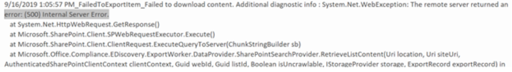

# <a name="investigate-troubleshoot-and-resolve-common-ediscovery-issues"></a><span data-ttu-id="e85c9-103">調查、疑難排解及解決常見的 eDiscovery 問題</span><span class="sxs-lookup"><span data-stu-id="e85c9-103">Investigate, troubleshoot, and resolve common eDiscovery issues</span></span>

<span data-ttu-id="e85c9-104">本主題涵蓋您可以採取的基本疑難排解步驟，用來識別及解決 ediscovery 搜尋期間或 eDiscovery 程式中其他位置可能會遇到的問題。</span><span class="sxs-lookup"><span data-stu-id="e85c9-104">This topic covers basic troubleshooting steps you can take to identify and resolve issues you may encounter during an eDiscovery search or elsewhere in the eDiscovery process.</span></span> <span data-ttu-id="e85c9-105">解決這些案例中的部分需要 Microsoft 支援人員的協助。</span><span class="sxs-lookup"><span data-stu-id="e85c9-105">Resolving some of these scenarios requires help from Microsoft Support.</span></span> <span data-ttu-id="e85c9-106">解決步驟中包含有關何時聯繫 Microsoft 支援的資訊。</span><span class="sxs-lookup"><span data-stu-id="e85c9-106">Information on when to contact Microsoft Support is included in the resolution steps.</span></span>

## <a name="errorissue-ambiguous-location"></a><span data-ttu-id="e85c9-107">錯誤/問題：不明確的位置</span><span class="sxs-lookup"><span data-stu-id="e85c9-107">Error/issue: Ambiguous location</span></span>

<span data-ttu-id="e85c9-108">如果您嘗試將使用者的信箱位置新增至 [搜尋]，而且在 Exchange Online Protection (EOP) 目錄中有相同的 userID 的重複或衝突物件，您會收到此錯誤： `The compliance search contains the following invalid location(s):useralias@contoso.com. The location "useralias@contoso.com" is ambiguous` 。</span><span class="sxs-lookup"><span data-stu-id="e85c9-108">If you try to add user's mailbox location to search and there are duplicate or conflicting objects with the same userID in the Exchange Online Protection (EOP) directory, you receive this error: `The compliance search contains the following invalid location(s):useralias@contoso.com. The location "useralias@contoso.com" is ambiguous`.</span></span>

### <a name="resolution"></a><span data-ttu-id="e85c9-109">解決方案</span><span class="sxs-lookup"><span data-stu-id="e85c9-109">Resolution</span></span>

<span data-ttu-id="e85c9-110">檢查是否有相同使用者識別碼的重複使用者或通訊群組清單。</span><span class="sxs-lookup"><span data-stu-id="e85c9-110">Check for duplicate users or distribution list with the same user ID.</span></span>

1. <span data-ttu-id="e85c9-111">連線[& 規範中心 PowerShell 的安全性](/powershell/exchange/connect-to-scc-powershell)。</span><span class="sxs-lookup"><span data-stu-id="e85c9-111">Connect to [Security & Compliance Center PowerShell](/powershell/exchange/connect-to-scc-powershell).</span></span>

2. <span data-ttu-id="e85c9-112">執行下列命令，以取回使用者名稱的所有實例：</span><span class="sxs-lookup"><span data-stu-id="e85c9-112">Run the following command to retrieve all instances of the username:</span></span>

    ```powershell
    Get-Recipient <username>
    ```

   <span data-ttu-id="e85c9-113">' Useralias@contoso.com ' 的輸出類似下列所示：</span><span class="sxs-lookup"><span data-stu-id="e85c9-113">The output for 'useralias@contoso.com' would be similar to the following:</span></span>

   > 
   > |<span data-ttu-id="e85c9-114">名稱</span><span class="sxs-lookup"><span data-stu-id="e85c9-114">Name</span></span>|<span data-ttu-id="e85c9-115">RecipientType</span><span class="sxs-lookup"><span data-stu-id="e85c9-115">RecipientType</span></span>|
   > |---|---|
   > |<span data-ttu-id="e85c9-116">Alias、User</span><span class="sxs-lookup"><span data-stu-id="e85c9-116">Alias, User</span></span>|<span data-ttu-id="e85c9-117">MailUser</span><span class="sxs-lookup"><span data-stu-id="e85c9-117">MailUser</span></span>|
   > |<span data-ttu-id="e85c9-118">Alias、User</span><span class="sxs-lookup"><span data-stu-id="e85c9-118">Alias, User</span></span>|<span data-ttu-id="e85c9-119">使用者</span><span class="sxs-lookup"><span data-stu-id="e85c9-119">User</span></span>|

3. <span data-ttu-id="e85c9-120">若傳回多個使用者，請找出並修正衝突的物件。</span><span class="sxs-lookup"><span data-stu-id="e85c9-120">If multiple users are returned, locate and fix the conflicting object.</span></span>

## <a name="errorissue-search-fails-on-specific-locations"></a><span data-ttu-id="e85c9-121">錯誤/問題：搜尋在特定位置失敗</span><span class="sxs-lookup"><span data-stu-id="e85c9-121">Error/issue: Search fails on specific locations</span></span>

<span data-ttu-id="e85c9-122">EDiscovery 或內容搜尋可能會產生下列錯誤： `This search completed with (#) errors.  Would you like to retry the search on the failed locations?`</span><span class="sxs-lookup"><span data-stu-id="e85c9-122">An eDiscovery or content search may yield the following error: `This search completed with (#) errors.  Would you like to retry the search on the failed locations?`</span></span>


### <a name="resolution"></a><span data-ttu-id="e85c9-124">解決方案</span><span class="sxs-lookup"><span data-stu-id="e85c9-124">Resolution</span></span>

<span data-ttu-id="e85c9-125">如果您收到此錯誤，建議您確認在搜尋中失敗的位置，然後在失敗的位置上只重新執行搜尋。</span><span class="sxs-lookup"><span data-stu-id="e85c9-125">If you receive this error, we recommend that you verify the locations that failed in the search  then rerun the search only on the failed locations.</span></span>

1. <span data-ttu-id="e85c9-126">連線至[安全性 & 規範中心 PowerShell](/powershell/exchange/connect-to-scc-powershell) ，然後執行下列命令：</span><span class="sxs-lookup"><span data-stu-id="e85c9-126">Connect to [Security & Compliance Center PowerShell](/powershell/exchange/connect-to-scc-powershell) and then run the following command:</span></span>

   ```powershell
   Get-ComplianceSearch <searchname> | FL
   ```

2. <span data-ttu-id="e85c9-127">從 PowerShell 輸出的錯誤欄位中，或從搜尋輸出錯誤中的狀態詳細資料中，查看失敗的位置。</span><span class="sxs-lookup"><span data-stu-id="e85c9-127">From the PowerShell output, view the failed locations in the errors field or from the status details in the error from the search output.</span></span>

3. <span data-ttu-id="e85c9-128">只重試失敗位置上的 eDiscovery 搜尋。</span><span class="sxs-lookup"><span data-stu-id="e85c9-128">Retry the eDiscovery search on the failed locations only.</span></span>

4. <span data-ttu-id="e85c9-129">如果您繼續收到這些錯誤，請參閱 [重試失敗位置](/Office365/SecurityCompliance/retry-failed-content-search) ，以取得更多疑難排解步驟。</span><span class="sxs-lookup"><span data-stu-id="e85c9-129">If you continue to receive these errors, see [Retry failed locations](/Office365/SecurityCompliance/retry-failed-content-search) for more troubleshooting steps.</span></span>

## <a name="errorissue-file-not-found"></a><span data-ttu-id="e85c9-130">錯誤/問題：找不到檔案</span><span class="sxs-lookup"><span data-stu-id="e85c9-130">Error/issue: File not found</span></span>

<span data-ttu-id="e85c9-131">當執行的 eDiscovery 搜尋包含 SharePoint 線上及一個用於商務位置的硬碟磁碟機時，您可能會收到錯誤， `File Not Found` 但檔案位於網站上。</span><span class="sxs-lookup"><span data-stu-id="e85c9-131">When running an eDiscovery search that includes SharePoint Online and One Drive For Business locations, you may receive the error `File Not Found` although the file is located on the site.</span></span> <span data-ttu-id="e85c9-132">此錯誤會出現在 [匯出警告] 和 [errors.csv 或略過 items.csv 中。</span><span class="sxs-lookup"><span data-stu-id="e85c9-132">This error will be in the export warnings and errors.csv or skipped items.csv.</span></span> <span data-ttu-id="e85c9-133">如果無法在網站上找到檔案，或索引已過期，就可能會發生這種情況。</span><span class="sxs-lookup"><span data-stu-id="e85c9-133">This may occur if the file can't be found on the site or if the index is out of date.</span></span> <span data-ttu-id="e85c9-134">以下是具有強調新增) 之實際錯誤 (的文字。</span><span class="sxs-lookup"><span data-stu-id="e85c9-134">Here's the text of an actual error (with emphasis added).</span></span>

> <span data-ttu-id="e85c9-135">28.06.2019 10：02：19_FailedToExportItem_Failed 下載內容。</span><span class="sxs-lookup"><span data-stu-id="e85c9-135">28.06.2019 10:02:19_FailedToExportItem_Failed to download content.</span></span> <span data-ttu-id="e85c9-136">其他診斷資訊： Microsoft。Office。ContentDownloadTemporaryFailure：無法從 content 6ea52149 ExportWorker-91cd-4965-b5bb-82ca6a3ec9be--類型的檔。</span><span class="sxs-lookup"><span data-stu-id="e85c9-136">Additional diagnostic info : Microsoft.Office.Compliance.EDiscovery.ExportWorker.Exceptions.ContentDownloadTemporaryFailure: Failed to download from content 6ea52149-91cd-4965-b5bb-82ca6a3ec9be of type Document.</span></span> <span data-ttu-id="e85c9-137">相關識別碼：3bd84722-937b-4c23-b61b-08d6fba9ec32。</span><span class="sxs-lookup"><span data-stu-id="e85c9-137">Correlation Id: 3bd84722-937b-4c23-b61b-08d6fba9ec32.</span></span> <span data-ttu-id="e85c9-138">ServerErrorCode：-2147024894---> Microsoft。SharePoint。***找不到*** ServerException： File。</span><span class="sxs-lookup"><span data-stu-id="e85c9-138">ServerErrorCode: -2147024894 ---> Microsoft.SharePoint.Client.ServerException: ***File Not Found***.</span></span> <span data-ttu-id="e85c9-139">在 Microsoft。SharePoint。Microsoft ClientRequest 中的 ProcessResponseStream (Stream responseStream) 。SharePoint。內部例外狀況堆疊追蹤的 ClientRequest () ---結束---</span><span class="sxs-lookup"><span data-stu-id="e85c9-139">at Microsoft.SharePoint.Client.ClientRequest.ProcessResponseStream(Stream responseStream) at Microsoft.SharePoint.Client.ClientRequest.ProcessResponse() --- End of inner exception stack trace ---</span></span>

### <a name="resolution"></a><span data-ttu-id="e85c9-140">解決方案</span><span class="sxs-lookup"><span data-stu-id="e85c9-140">Resolution</span></span>

1. <span data-ttu-id="e85c9-141">檢查搜尋中識別的位置，以確保檔案的位置正確，並新增至搜尋位置。</span><span class="sxs-lookup"><span data-stu-id="e85c9-141">Check location identified in the search to ensure that the location of the file is correct and added in the search locations.</span></span>

2. <span data-ttu-id="e85c9-142">您可以使用程式 [，以手動方式要求編目及重新建立網站、文件庫或清單的索引，以重新索引](/sharepoint/crawl-site-content) 網站。</span><span class="sxs-lookup"><span data-stu-id="e85c9-142">Use the procedures at [Manually request crawling and re-indexing of a site, a library, or a list](/sharepoint/crawl-site-content) to reindex the site.</span></span>

## <a name="errorissue-this-file-wasnt-exported-because-it-doesnt-exist-anymore-the-file-was-included-in-the-count-of-estimated-search-results-because-its-still-listed-in-the-index-the-file-will-eventually-be-removed-from-the-index-and-wont-cause-an-error-in-the-future"></a><span data-ttu-id="e85c9-143">錯誤/問題：不會匯出此檔案，因為它不再存在。</span><span class="sxs-lookup"><span data-stu-id="e85c9-143">Error/issue: This file wasn't exported because it doesn't exist anymore.</span></span> <span data-ttu-id="e85c9-144">檔案會包含在預估的搜尋結果計數中，因為它仍會列在索引中。</span><span class="sxs-lookup"><span data-stu-id="e85c9-144">The file was included in the count of estimated search results because it's still listed in the index.</span></span> <span data-ttu-id="e85c9-145">該檔案會最後從索引中移除，而不會在未來產生錯誤。</span><span class="sxs-lookup"><span data-stu-id="e85c9-145">The file will eventually be removed from the index, and won't cause an error in the future.</span></span>

<span data-ttu-id="e85c9-146">當您執行的 eDiscovery 搜尋包含 SharePoint 線上及一個位於商務位置的硬碟磁碟機時，您可能會看到此錯誤。</span><span class="sxs-lookup"><span data-stu-id="e85c9-146">You may see that error when running an eDiscovery search that includes SharePoint Online and One Drive For Business locations.</span></span> <span data-ttu-id="e85c9-147">eDiscovery 依賴 SPO 索引來識別檔案位置。</span><span class="sxs-lookup"><span data-stu-id="e85c9-147">eDiscovery relies on teh SPO index to identify the file locations.</span></span> <span data-ttu-id="e85c9-148">如果已刪除檔案，但 SPO 索引尚未更新，可能會發生此錯誤。</span><span class="sxs-lookup"><span data-stu-id="e85c9-148">If the file was deleted but the SPO index was not yet updated this error may occur.</span></span>

### <a name="resolution"></a><span data-ttu-id="e85c9-149">解決方案</span><span class="sxs-lookup"><span data-stu-id="e85c9-149">Resolution</span></span> 
<span data-ttu-id="e85c9-150">開啟 SPO 位置，並確認此檔案確實不存在。</span><span class="sxs-lookup"><span data-stu-id="e85c9-150">Open the SPO location and verify that this file indeed is not there.</span></span>
<span data-ttu-id="e85c9-151">建議的解決方法是手動重新索引網站，或等到自動背景程式 reindexes 網站為止。</span><span class="sxs-lookup"><span data-stu-id="e85c9-151">Suggested solution is to manually reindex the site, or wait till the site reindexes by the automatic background process.</span></span>


## <a name="errorissue-this-search-result-was-not-downloaded-as-it-is-a-folder-or-other-artefact-that-cant-be-downloaded-by-itself-any-items-inside-the-folder-or-library-will-be-downloaded"></a><span data-ttu-id="e85c9-152">錯誤/問題：此搜尋結果未下載，因為它是無法自行下載的資料夾或其他 artefact，將會下載資料夾或文件庫內的任何專案。</span><span class="sxs-lookup"><span data-stu-id="e85c9-152">Error/issue: This search result was not downloaded as it is a folder or other artefact that can't be downloaded by itself, any items inside the folder or library will be downloaded.</span></span>

<span data-ttu-id="e85c9-153">當您執行的 eDiscovery 搜尋包含 SharePoint 線上及一個位於商務位置的硬碟磁碟機時，您可能會看到此錯誤。</span><span class="sxs-lookup"><span data-stu-id="e85c9-153">You may see that error when running an eDiscovery search that includes SharePoint Online and One Drive For Business locations.</span></span> <span data-ttu-id="e85c9-154">這表示我們將要嘗試並匯出索引中所報告的專案，但是它會變成資料夾，因此我們並未將其匯出。</span><span class="sxs-lookup"><span data-stu-id="e85c9-154">It means that we were going to try and export the item reported in the index, but it turned out to be a folder so we did not export it.</span></span> <span data-ttu-id="e85c9-155">如錯誤中所述，我們不會匯出資料夾專案，但會匯出其內容。</span><span class="sxs-lookup"><span data-stu-id="e85c9-155">As mentioned in the error, we don't export folder items but we do export their contents.</span></span>


## <a name="errorissue-search-fails-because-recipient-is-not-found"></a><span data-ttu-id="e85c9-156">錯誤/問題：搜尋失敗，因為找不到收件者</span><span class="sxs-lookup"><span data-stu-id="e85c9-156">Error/issue: Search fails because recipient is not found</span></span>

<span data-ttu-id="e85c9-157">EDiscovery 搜尋失敗，錯誤為 `recipient not found` 。</span><span class="sxs-lookup"><span data-stu-id="e85c9-157">An eDiscovery search fails with error the `recipient not found`.</span></span> <span data-ttu-id="e85c9-158">如果無法在 Exchange Online Protection (EOP) 中找到 user 物件，則可能會發生此錯誤，因為物件尚未同步處理。</span><span class="sxs-lookup"><span data-stu-id="e85c9-158">This error may occur if the user object cannot be found in Exchange Online Protection (EOP) because the object has not synced.</span></span>

### <a name="resolution"></a><span data-ttu-id="e85c9-159">解決方案</span><span class="sxs-lookup"><span data-stu-id="e85c9-159">Resolution</span></span>

1. <span data-ttu-id="e85c9-160">連線[Exchange Online PowerShell](/powershell/exchange/connect-to-exchange-online-powershell)。</span><span class="sxs-lookup"><span data-stu-id="e85c9-160">Connect to [Exchange Online PowerShell](/powershell/exchange/connect-to-exchange-online-powershell).</span></span>

2. <span data-ttu-id="e85c9-161">執行下列命令，檢查使用者是否已同步處理至 Exchange Online Protection：</span><span class="sxs-lookup"><span data-stu-id="e85c9-161">Run the following command to check if the user is synced to Exchange Online Protection:</span></span>

   ```powershell
   Get-Recipient <userId> | FL
   ```

3. <span data-ttu-id="e85c9-162">使用者提出問題時，應該會有郵件使用者物件。</span><span class="sxs-lookup"><span data-stu-id="e85c9-162">There should be a mail user object for the user question.</span></span> <span data-ttu-id="e85c9-163">若未傳回任何專案，請調查 user 物件。</span><span class="sxs-lookup"><span data-stu-id="e85c9-163">If nothing is returned, investigate the user object.</span></span> <span data-ttu-id="e85c9-164">如果物件無法同步處理，請與 Microsoft 支援人員聯繫。</span><span class="sxs-lookup"><span data-stu-id="e85c9-164">Contact Microsoft Support if the object can't be synced.</span></span>

## <a name="errorissue-exporting-search-results-is-slow"></a><span data-ttu-id="e85c9-165">錯誤/問題：匯出搜尋結果的速度緩慢</span><span class="sxs-lookup"><span data-stu-id="e85c9-165">Error/issue: Exporting search results is slow</span></span>

<span data-ttu-id="e85c9-166">在安全性與合規性中心匯出搜尋結果從 eDiscovery 或內容搜尋時，下載時間會比預期更長。</span><span class="sxs-lookup"><span data-stu-id="e85c9-166">When exporting search results from eDiscovery or Content Search in the Security and Compliance center, the download takes longer than expected.</span></span>  <span data-ttu-id="e85c9-167">您可以查看要下載的資料量，並可能增加匯出速度。</span><span class="sxs-lookup"><span data-stu-id="e85c9-167">You can check to see the amount of data to be download and possibly increase the export speed.</span></span>

### <a name="resolution"></a><span data-ttu-id="e85c9-168">解決方案</span><span class="sxs-lookup"><span data-stu-id="e85c9-168">Resolution</span></span>

1. <span data-ttu-id="e85c9-169">連線至[安全性 & 規範中心 PowerShell](/powershell/exchange/connect-to-scc-powershell) ，然後執行下列命令：</span><span class="sxs-lookup"><span data-stu-id="e85c9-169">Connect to [Security & Compliance Center PowerShell](/powershell/exchange/connect-to-scc-powershell) and then run the following command:</span></span>

   ```powershell
   Get-ComplianceSearch <searchname> | FL
   ```

2. <span data-ttu-id="e85c9-170">在 SearchResults 和 SearchStatistics 參數中尋找要下載的資料量。</span><span class="sxs-lookup"><span data-stu-id="e85c9-170">Find the amount of data to be downloaded in the SearchResults and SearchStatistics parameters.</span></span>

3. <span data-ttu-id="e85c9-171">執行下列命令：</span><span class="sxs-lookup"><span data-stu-id="e85c9-171">Run the following command:</span></span>

   ```powershell
   Get-ComplianceSearchAction | FL
   ```

4. <span data-ttu-id="e85c9-172">在 [結果] 欄位中，尋找已匯出的資料，並查看任何發生的錯誤。</span><span class="sxs-lookup"><span data-stu-id="e85c9-172">In the results field, find the data that has been exported and view any errors encountered.</span></span>

5. <span data-ttu-id="e85c9-173">檢查您將內容匯出到的目錄中的追蹤 .log 檔案，以查看是否有任何錯誤。</span><span class="sxs-lookup"><span data-stu-id="e85c9-173">Check the trace.log file located in the directory that you exported the content to for any errors.</span></span>

6. <span data-ttu-id="e85c9-174">如果仍有問題，請考慮將傳回一組大型結果的搜尋分割成較小的搜尋。</span><span class="sxs-lookup"><span data-stu-id="e85c9-174">If you still have issues, consider dividing searches that return a large set of results into smaller searches.</span></span> <span data-ttu-id="e85c9-175">例如，您可以在搜尋查詢中使用日期範圍，以傳回較小的結果集，可更快速地下載。</span><span class="sxs-lookup"><span data-stu-id="e85c9-175">For example, you can use date ranges in search queries to return a smaller set of results that can be downloaded faster.</span></span>

## <a name="errorissue-internal-server-error-500-occurred"></a><span data-ttu-id="e85c9-176">錯誤/問題：「發生內部伺服器錯誤 (500) </span><span class="sxs-lookup"><span data-stu-id="e85c9-176">Error/issue: "Internal server error (500) occurred"</span></span>

<span data-ttu-id="e85c9-177">執行 eDiscovery 搜尋時，如果搜尋持續失敗，且發生錯誤類似「發生內部伺服器錯誤 (500) 」，您可能需要在特定信箱位置上只重新執行搜尋。</span><span class="sxs-lookup"><span data-stu-id="e85c9-177">When running an eDiscovery search, if the search continually fails with error similar to "Internal server error (500) occurred", you may need rerun the search only on specific mailbox locations.</span></span>



### <a name="resolution"></a><span data-ttu-id="e85c9-179">解決方案</span><span class="sxs-lookup"><span data-stu-id="e85c9-179">Resolution</span></span>

1. <span data-ttu-id="e85c9-180">將搜尋分割成較小的搜尋，然後再次執行搜尋。</span><span class="sxs-lookup"><span data-stu-id="e85c9-180">Break the search into smaller searches and run the search again.</span></span>  <span data-ttu-id="e85c9-181">請嘗試使用較小的日期範圍或限制要搜尋的位置數目。</span><span class="sxs-lookup"><span data-stu-id="e85c9-181">Try using a smaller date range or limit the number of locations being searched.</span></span>

2. <span data-ttu-id="e85c9-182">連線至[安全性 & 規範中心 PowerShell](/powershell/exchange/connect-to-scc-powershell) ，然後執行下列命令：</span><span class="sxs-lookup"><span data-stu-id="e85c9-182">Connect to [Security & Compliance Center PowerShell](/powershell/exchange/connect-to-scc-powershell) and then run the following command:</span></span>

   ```powershell Set-CaseHoldPolicy <policyname> -RetryDistribution
   Get-ComplianceSearch <searchname> | FL
   ```

3. <span data-ttu-id="e85c9-183">檢查結果和錯誤的輸出。</span><span class="sxs-lookup"><span data-stu-id="e85c9-183">Examine the output for results and errors.</span></span>

4. <span data-ttu-id="e85c9-184">檢查追蹤 .log 檔。</span><span class="sxs-lookup"><span data-stu-id="e85c9-184">Examine the trace.log file.</span></span> <span data-ttu-id="e85c9-185">它位於您匯出搜尋結果所在的相同資料夾中。</span><span class="sxs-lookup"><span data-stu-id="e85c9-185">It's located  in the same folder that you exported the search results to.</span></span>

5. <span data-ttu-id="e85c9-186">連絡 Microsoft 支援人員。</span><span class="sxs-lookup"><span data-stu-id="e85c9-186">Contact Microsoft Support.</span></span>

## <a name="errorissue-holds-dont-sync"></a><span data-ttu-id="e85c9-187">錯誤/問題：保留未同步處理</span><span class="sxs-lookup"><span data-stu-id="e85c9-187">Error/issue: Holds don't sync</span></span>

<span data-ttu-id="e85c9-188">電子檔探索案例保留原則同步發佈錯誤。</span><span class="sxs-lookup"><span data-stu-id="e85c9-188">eDiscovery Case Hold Policy Sync Distribution error.</span></span> <span data-ttu-id="e85c9-189">錯誤讀取：</span><span class="sxs-lookup"><span data-stu-id="e85c9-189">The error reads:</span></span>

> <span data-ttu-id="e85c9-190">「資源：部署原則所花費的時間超過預期。</span><span class="sxs-lookup"><span data-stu-id="e85c9-190">"Resources: It's taking longer than expected to deploy the policy.</span></span> <span data-ttu-id="e85c9-191">更新最終部署狀態可能需要另外2小時，所以請在幾小時內回來查看。」</span><span class="sxs-lookup"><span data-stu-id="e85c9-191">It might take an additional 2 hours to update the final deployment status, so check back in a couple hours."</span></span>

### <a name="resolution"></a><span data-ttu-id="e85c9-192">解決方案</span><span class="sxs-lookup"><span data-stu-id="e85c9-192">Resolution</span></span>

1. <span data-ttu-id="e85c9-193">連線至[安全性 & 規範中心 PowerShell](/powershell/exchange/connect-to-scc-powershell) ，然後針對 eDiscovery 案例保留執行下列命令：</span><span class="sxs-lookup"><span data-stu-id="e85c9-193">Connect to [Security & Compliance Center PowerShell](/powershell/exchange/connect-to-scc-powershell) and then run the following command for an eDiscovery case hold:</span></span>

   ```powershell
   Get-CaseHoldPolicy <policyname> - DistributionDetail | FL
   ```

    <span data-ttu-id="e85c9-194">若為保留原則，請執行下列命令：</span><span class="sxs-lookup"><span data-stu-id="e85c9-194">For a retention policy, run the following command:</span></span>

   ```powershell
   Get-RetentionCompliancePolicy <policyname> - DistributionDetail | FL
   ```

2. <span data-ttu-id="e85c9-195">檢查 DistributionDetail 參數中的值，以查看類似下列的錯誤：</span><span class="sxs-lookup"><span data-stu-id="e85c9-195">Examine the value in the DistributionDetail parameter for errors like the following:</span></span>

   > <span data-ttu-id="e85c9-196">錯誤：資源：部署原則所花費的時間超過預期。</span><span class="sxs-lookup"><span data-stu-id="e85c9-196">Error: Resources: It's taking longer than expected to deploy the policy.</span></span> <span data-ttu-id="e85c9-197">更新最終部署狀態可能需要另外2小時，所以請在幾小時內回來查看。」</span><span class="sxs-lookup"><span data-stu-id="e85c9-197">It might take an additional 2 hours to update the final deployment status, so check back in a couple hours."</span></span>

3. <span data-ttu-id="e85c9-198">嘗試在有問題的原則上執行 RetryDistribution 參數：</span><span class="sxs-lookup"><span data-stu-id="e85c9-198">Try running the RetryDistribution parameter on the policy in question:</span></span>

   <span data-ttu-id="e85c9-199">針對 eDiscovery 案例保留：</span><span class="sxs-lookup"><span data-stu-id="e85c9-199">For eDiscovery case holds:</span></span>

   ```powershell
   Set-CaseHoldPolicy <policyname> -RetryDistribution
   ```

   <span data-ttu-id="e85c9-200">對於保留原則：</span><span class="sxs-lookup"><span data-stu-id="e85c9-200">For retention policies:</span></span>

   ```powershell
   Set-RetentionCompliancePolicy <policyname> -RetryDistribution
   ```

4. <span data-ttu-id="e85c9-201">連絡 Microsoft 支援人員。</span><span class="sxs-lookup"><span data-stu-id="e85c9-201">Contact Microsoft Support.</span></span>

## <a name="error-the-condition-specified-using-http-conditional-headers-is-not-met"></a><span data-ttu-id="e85c9-202">錯誤：「使用 HTTP 條件標頭 (指定的條件不符合) </span><span class="sxs-lookup"><span data-stu-id="e85c9-202">Error: "The condition specified using HTTP conditional header(s) is not met"</span></span>

<span data-ttu-id="e85c9-203">使用 eDiscovery 匯出工具下載搜尋結果時，可能會收到下列錯誤： `System.Net.WebException: The remote server returned an error: (412) The condition specified using HTTP conditional header(s) is not met.` 這是暫時性的錯誤，通常會發生在 Azure 儲存體位置。</span><span class="sxs-lookup"><span data-stu-id="e85c9-203">When downloading search results using the eDiscovery Export Tool, it's possible you might receive the following error: `System.Net.WebException: The remote server returned an error: (412) The condition specified using HTTP conditional header(s) is not met.` This is transient error, which typically occurs in the Azure Storage location.</span></span>

### <a name="resolution"></a><span data-ttu-id="e85c9-204">解決方案</span><span class="sxs-lookup"><span data-stu-id="e85c9-204">Resolution</span></span>

<span data-ttu-id="e85c9-205">若要解決此問題，請重試 [下載搜尋結果](export-search-results.md#step-2-download-the-search-results)，這將會重新開機 EDiscovery 匯出工具。</span><span class="sxs-lookup"><span data-stu-id="e85c9-205">To resolve this issue, retry [downloading the search results](export-search-results.md#step-2-download-the-search-results), which will restart the eDiscovery Export Tool.</span></span>

## <a name="errorissue-downloaded-export-shows-no-results"></a><span data-ttu-id="e85c9-206">錯誤/問題：已下載的匯出未顯示任何結果</span><span class="sxs-lookup"><span data-stu-id="e85c9-206">Error/issue: Downloaded export shows no results</span></span>

<span data-ttu-id="e85c9-207">匯出成功後，透過匯出工具完成的下載會在結果中顯示零個檔案。</span><span class="sxs-lookup"><span data-stu-id="e85c9-207">After a successful export, the completed download via the export tool shows zero files in the results.</span></span>

### <a name="resolution"></a><span data-ttu-id="e85c9-208">解決方案</span><span class="sxs-lookup"><span data-stu-id="e85c9-208">Resolution</span></span>

<span data-ttu-id="e85c9-209">這是用戶端問題，為了進行修正，請嘗試下列步驟：</span><span class="sxs-lookup"><span data-stu-id="e85c9-209">This is a client-side issue and in order to remediate it, please attempt the following steps:</span></span>

1. <span data-ttu-id="e85c9-210">嘗試使用另一部用戶端/電腦來下載。</span><span class="sxs-lookup"><span data-stu-id="e85c9-210">Try using another client/machine to download.</span></span>

2. <span data-ttu-id="e85c9-211">移除已不再需要使用 [Remove-ComplianceSearch](/powershell/module/exchange/remove-compliancesearch) Cmdlet 的舊搜尋。</span><span class="sxs-lookup"><span data-stu-id="e85c9-211">Remove old searches that are no longer needed using [Remove-ComplianceSearch](/powershell/module/exchange/remove-compliancesearch) cmdlet.</span></span>

3. <span data-ttu-id="e85c9-212">請務必下載到本機磁片磁碟機。</span><span class="sxs-lookup"><span data-stu-id="e85c9-212">Make sure to download to a local drive.</span></span>

4. <span data-ttu-id="e85c9-213">請確定病毒掃描程式未執行。</span><span class="sxs-lookup"><span data-stu-id="e85c9-213">Make sure the virus scanner is not running.</span></span>

5. <span data-ttu-id="e85c9-214">請確定沒有任何其他匯出正在下載至相同的資料夾或任何上層資料夾。</span><span class="sxs-lookup"><span data-stu-id="e85c9-214">Make sure that no other export is downloading to the same folder or any parent folder.</span></span>

6. <span data-ttu-id="e85c9-215">如果上述步驟無法運作，請停用 [壓縮] 和 [重復資料刪除]。</span><span class="sxs-lookup"><span data-stu-id="e85c9-215">If the previous steps did not work, disable zipping and de-duplication.</span></span>

7. <span data-ttu-id="e85c9-216">如果這樣做正常，則問題是由於本機病毒掃描程式或磁片問題所造成。</span><span class="sxs-lookup"><span data-stu-id="e85c9-216">If this works then the issue is due to a local virus scanner or a disk issue.</span></span>
