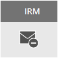

# 電子郵件加密Email encryption

本文件會比較 Microsoft 365 中的加密選項，包括 Office 郵件加密 (OME)、S/MIME、資訊版權管理 (IRM)，並介紹傳輸層安全性 (TLS)。This article compares encryption options in Microsoft 365 including Office Message Encryption (OME), S/MIME, Information Rights Management (IRM), and introduces Transport Layer Security (TLS).
  
Microsoft 365 delivers multiple encryption options to help you meet your business needs for email security. This article presents three ways to encrypt email in Office 365. If you want to learn more about all security features in Office 365, visit the [Office 365 Trust Center](https://go.microsoft.com/fwlink/p/?LinkID=282470). This article introduces the three types of encryption available for Microsoft 365 administrators to help secure email in Office 365:Microsoft 365 delivers multiple encryption options to help you meet your business needs for email security. This article presents three ways to encrypt email in Office 365. If you want to learn more about all security features in Office 365, visit the [Office 365 Trust Center](https://go.microsoft.com/fwlink/p/?LinkID=282470). This article introduces the three types of encryption available for Microsoft 365 administrators to help secure email in Office 365:
  
- Office 郵件加密 (OME)。Office Message Encryption (OME).

- 安全多用途網際網路郵件延伸 (S/MIME)。Secure/Multipurpose Internet Mail Extensions (S/MIME).

- 資訊版權管理 (IRM)。Information Rights Management (IRM).

## 電子郵件加密和 Microsoft 365 如何使用它Email encryption and how Microsoft 365 uses it

Encryption is the process by which information is encoded so that only an authorized recipient can decode and consume the information. Microsoft 365 uses encryption in two ways: in the service, and as a customer control. In the service, encryption is used in Microsoft 365 by default; you don't have to configure anything. For example, Microsoft 365 uses Transport Layer Security (TLS) to encrypt the connection, or session, between two servers.Encryption is the process by which information is encoded so that only an authorized recipient can decode and consume the information. Microsoft 365 uses encryption in two ways: in the service, and as a customer control. In the service, encryption is used in Microsoft 365 by default; you don't have to configure anything. For example, Microsoft 365 uses Transport Layer Security (TLS) to encrypt the connection, or session, between two servers. 
  
電子郵件加密一般的運作方式如下：Here's how email encryption typically works:
  
- 郵件在寄件者的電腦上或是於傳輸時在中央伺服器上進行加密，從純文字轉換成無法讀取的加密文字。A message is encrypted, or transformed from plain text into unreadable ciphertext, either on the sender's machine, or by a central server while the message is in transit.

- 郵件在傳輸過程中保持加密文字，萬一遭攔截可防止郵件被讀取。The message remains in ciphertext while it's in transit in order to protect it from being read in case the message is intercepted.

- 一旦收件者收到郵件時，會以下列兩種方式之一將郵件轉換回可閱讀的純文字：Once the message is received by the recipient, the message is transformed back into readable plain text in one of two ways:

  - 收件者的電腦使用金鑰將郵件解密，或The recipient's machine uses a key to decrypt the message, or

  - 中央伺服器在驗證收件者的身分後，會代替收件者將郵件解密。A central server decrypts the message on behalf of the recipient, after validating the recipient's identity.

如需詳細了解 Microsoft 365 如何保護伺服器之間的通訊，例如 Microsoft 365 內的組織之間，或 Microsoft 365 與 Microsoft 365 外部受信任商業夥伴之間，請參閱 [Exchange Online 如何使用 TLS 保護 Office 365 中的電子郵件連線安全性](exchange-online-uses-tls-to-secure-email-connections.md)。For more information on how Microsoft 365 secures communication between servers, such as between organizations within Microsoft 365 or between Microsoft 365 and a trusted business partner outside of Microsoft 365, see [How Exchange Online uses TLS to secure email connections in Office 365](exchange-online-uses-tls-to-secure-email-connections.md).
  
觀看此影片來取得 [Office 365 中的加密](https://www.youtube.com/watch?v=KmfxCd5ublI)簡介。Watch this video for an introduction to [Encryption in Office 365](https://www.youtube.com/watch?v=KmfxCd5ublI).
  
## 比較 Office 365 中提供的電子郵件加密選項Comparing email encryption options available in Office 365

|||||
|:-----|:-----|:-----|:-----|
|這是什麼？What is it?|Office 365 郵件加密 (OME) 是內建於 Azure 版權管理 (Azure RMS) 的服務，可讓您將加密的電子郵件傳送給組織內部或外部的人，無論目的地電子郵件地址為何 (Gmail、Yahoo! Mail、Outlook.com 等)。Office 365 Message Encryption (OME) is a service built on Azure Rights Management (Azure RMS) that lets you send encrypted email to people inside or outside your organization, regardless of the destination email address (Gmail, Yahoo! Mail, Outlook.com, etc.).   身為管理員，您可以設定用以定義加密條件的傳輸規則。當使用者傳送符合規則的郵件時，會自動套用加密。As an admin, you can set up transport rules that define the conditions for encryption. When a user sends a message that matches a rule, encryption is applied automatically.   To view encrypted messages, recipients can either get a one-time passcode, sign in with a Microsoft account, or sign in with a work or school account associated with Office 365. Recipients can also send encrypted replies. They don't need a Microsoft 365 subscription to view encrypted messages or send encrypted replies.To view encrypted messages, recipients can either get a one-time passcode, sign in with a Microsoft account, or sign in with a work or school account associated with Office 365. Recipients can also send encrypted replies. They don't need a Microsoft 365 subscription to view encrypted messages or send encrypted replies.|IRM 是加密解決方案，也可對電子郵件套用使用限制。這有助於防止敏感資訊被未經授權的人員列印、轉寄或複製。IRM is an encryption solution that also applies usage restrictions to email messages. It helps prevent sensitive information from being printed, forwarded, or copied by unauthorized people.   Microsoft 365 中的 IRM 功能使用 Azure 版權管理 (Azure RMS)。IRM capabilities in Microsoft 365 use Azure Rights Management (Azure RMS).|S/MIME is a certificate-based encryption solution that allows you to both encrypt and digitally sign a message. The message encryption helps ensure that only the intended recipient can open and read the message. A digital signature helps the recipient validate the identity of the sender.S/MIME is a certificate-based encryption solution that allows you to both encrypt and digitally sign a message. The message encryption helps ensure that only the intended recipient can open and read the message. A digital signature helps the recipient validate the identity of the sender.   數位簽章和郵件加密之所以可行，皆因為使用了唯一數位憑證，此憑證包含用於驗證數位簽章及加密或解密郵件的金鑰。Both digital signatures and message encryption are made possible through the use of unique digital certificates that contain the keys for verifying digital signatures and encrypting or decrypting messages.   To use S/MIME, you must have public keys on file for each recipient. Recipients have to maintain their own private keys, which must remain secure. If a recipient's private keys are compromised, the recipient needs to get a new private key and redistribute public keys to all potential senders.To use S/MIME, you must have public keys on file for each recipient. Recipients have to maintain their own private keys, which must remain secure. If a recipient's private keys are compromised, the recipient needs to get a new private key and redistribute public keys to all potential senders.|
|能做什麼？What does it do?|OME：OME:   將傳送給內部或外部收件者的郵件加密。Encrypts messages sent to internal or external recipients.    可讓使用者將加密的郵件傳送至任何電子郵件地址，包括 Outlook.com、Yahoo!Mail 和 Gmail。Allows users to send encrypted messages to any email address, including Outlook.com, Yahoo! Mail, and Gmail.    可讓身為系統管理員的您自訂電子郵件檢視入口網站，以反映您組織的品牌。Allows you, as an admin, to customize the email viewing portal to reflect your organization's brand.   Microsoft 安全地管理及儲存金鑰，因此您不需要勞心。Microsoft securely manages and stores the keys, so you don't have to.   只要加密的郵件可以在瀏覽器中開啟 (以 HTML 附件傳送)，就不需要任何特殊的用戶端軟體。No special client side software is needed as long as the encrypted message (sent as an HTML attachment) can be opened in a browser.|IRM：IRM:   利用加密和使用限制為電子郵件和附件提供線上和離線保護。Uses encryption and usage restrictions to provide online and offline protection for email messages and attachments.   可讓身為系統管理員的您能夠設定傳輸規則或 Outlook 保護規則，以自動將 IRM 套用至選取的郵件。Gives you, as an admin, the ability to set up transport rules or Outlook protection rules to automatically apply IRM to select messages.   可讓使用者以手動方式在 Outlook 或 Outlook 網頁版 (先前稱為 Outlook Web App) 中套用範本。Lets users manually apply templates in Outlook or Outlook on the web (formerly known as Outlook Web App).|S/MIME 以數位簽章解決寄件者驗證，以加密解決郵件機密性。S/MIME addresses sender authentication with digital signatures, and message confidentiality with encryption.|
|不能做什麼？What does it not do?|OME doesn't let you apply usage restrictions to messages. For example, you can't use it to stop a recipient from forwarding or printing an encrypted message.OME doesn't let you apply usage restrictions to messages. For example, you can't use it to stop a recipient from forwarding or printing an encrypted message.|Some applications may not support IRM emails on all devices. For more information about these and other products that support IRM email, see [Client device capabilities](https://technet.microsoft.com/library/dn655136.aspx#BKMK_ClientCapabilities).Some applications may not support IRM emails on all devices. For more information about these and other products that support IRM email, see [Client device capabilities](https://technet.microsoft.com/library/dn655136.aspx#BKMK_ClientCapabilities).|S/MIME 不允許對加密的郵件掃描惡意程式碼、垃圾郵件或原則。S/MIME doesn't allow encrypted messages to be scanned for malware, spam, or policies.|
|建議和範例案例Recommendations and example scenarios|We recommend using OME when you want to send sensitive business information to people outside your organization, whether they're consumers or other businesses. For example:We recommend using OME when you want to send sensitive business information to people outside your organization, whether they're consumers or other businesses. For example:     銀行員工將信用卡帳單傳送給客戶A bank employee sending credit card statements to customers     醫生的診所將醫療記錄傳送給病患A doctor's office sending medical records to a patient     律師將機密的法律資訊傳送給其他律師An attorney sending confidential legal information to another attorney|當您想要套用使用限制以及加密時，我們建議使用 IRM。例如：We recommend using IRM when you want to apply usage restrictions as well as encryption. For example:     經理將新產品的機密詳細資訊傳送給組員時套用「不要轉寄」選項。A manager sending confidential details to her team about a new product applies the "Do Not Forward" option.     行政人員需要與其他公司共用投標提案，其中一個附件是由使用 Office 365 的夥伴提供，並要求電子郵件和附件皆受到保護。An executive needs to share a bid proposal with another company, which includes an attachment from a partner who is using Office 365, and require both the email and the attachment to be protected.|當您的組織或收件者的組織需要真正的端對端加密時，我們建議使用 S/MIME。We recommend using S/MIME when either your organization or the recipient's organization requires true peer-to-peer encryption.     S/MIME 最常用於下列情況：S/MIME is most commonly used in the following scenarios:     政府機構與其他政府機關通訊Government agencies communicating with other government agencies     企業與政府機構通訊A business communicating with a government agency|
||

如果同時使用 [Azure 資訊保護](https://docs.microsoft.com/microsoft-365/compliance/protect-information)和電子郵件加密來保護資料，請考慮下列事項：In case of using both [Azure Information Protection](https://docs.microsoft.com/microsoft-365/compliance/protect-information) and email encryption to protect the data, consider following:
- 您可以搭配 OME 和 IRM 加密使用敏感度標籤。You can use sensitivity labels with OME and IRM encryption. 如需詳細資訊，請參閱[使用敏感度標籤來套用加密以限制存取內容](https://docs.microsoft.com/microsoft-365/compliance/encryption-sensitivity-labels?view=o365-worldwide#what-happens-to-existing-encryption-when-a-labels-applied)。For more details, see [Restrict access to content by using sensitivity labels to apply encryption](https://docs.microsoft.com/microsoft-365/compliance/encryption-sensitivity-labels?view=o365-worldwide#what-happens-to-existing-encryption-when-a-labels-applied).
- 您可以使用 S/MIME 將敏感度標籤套用至以數位方式簽署的電子郵件。You can apply sensitivity labels to emails digitally signed using S/MIME.
- 您無法將敏感度標籤套用至使用 S/MIME 加密的電子郵件，因為原則不會處理受端對端加密保護的郵件。You can't apply sensitivity labels to emails encrypted using S/MIME, because messages protected by end-to-end encryption are not processed by policies.

## 我的 Microsoft 365 訂閱可用的加密選項Encryption options available for my Microsoft 365 subscription

如需您的 Microsoft 365 訂閱的電子郵件加密選項的詳細資訊，請參閱 [Exchange Online 服務說明](https://technet.microsoft.com/library/exchange-online-service-description.aspx)。For information about email encryption options for your Microsoft 365 subscription see the [Exchange Online service description](https://technet.microsoft.com/library/exchange-online-service-description.aspx). 您可以在這裡找到下列加密功能的相關資訊：Here, you can find information about the following encryption features:

- Azure RMS，包括 IRM 功能和新的 OME 功能Azure RMS, including both IRM capabilities and the new OME capabilities

- S/MIMES/MIME

- TLSTLS

- 靜態資料的加密 (透過 BitLocker)Encryption of data at rest (through BitLocker)

您也可以使用協力廠商的加密工具來搭配 Microsoft 365，例如 PGP (Pretty Good Privacy)。You can also use third-party encryption tools with Microsoft 365, for example, PGP (Pretty Good Privacy). Microsoft 365 不支援 PGP/MIME，而且您只能使用 PGP/內嵌來傳送及接收經過 PGP 加密的電子郵件。Microsoft 365 does not support PGP/MIME and you can only use PGP/Inline to send and receive PGP-encrypted emails.

## 靜態資料的加密呢？What about encryption for data at rest?

「靜態資料」指的是在傳輸中非作用中的資料。"Data at rest" refers to data that isn't actively in transit. 在 Microsoft 365 中，電子郵件靜態資料的加密方式是 BitLocker 磁碟加密。In Microsoft 365, email data at rest is encrypted using BitLocker Drive Encryption. BitLocker 會加密 Microsoft 資料中心中的硬碟，以增強防護防止未經授權的存取。BitLocker encrypts the hard drives in Microsoft datacenters to provide enhanced protection against unauthorized access. 若要深入了解，請參閱 [BitLocker 概觀](https://go.microsoft.com/fwlink/p/?LinkId=394737)。To learn more, see [BitLocker Overview](https://go.microsoft.com/fwlink/p/?LinkId=394737).
  
## 電子郵件加密選項的相關資訊More information about email encryption options

如需本文中電子郵件加密選項以及 TLS 的詳細資訊，請參閱這些文件：For more information about the email encryption options in this article as well as TLS, see these articles:
  
**OME****OME**
  
[Office 365 郵件加密 (OME)Office 365 Message Encryption (OME)](ome.md)
  
**IRM****IRM**
  
[Exchange Online 中的資訊版權管理Information Rights Management in Exchange Online](https://technet.microsoft.com/library/jj983436%28v=exchg.150%29.aspx)
  
[什麼是 Azure 版權管理？What is Azure Rights Management?](https://technet.microsoft.com/library/jj585026)
  
**S/MIME****S/MIME**
  
[可用於訊息簽署和加密的 S/MIMES/MIME for message signing and encryption](https://technet.microsoft.com/library/dn626158)
  
[了解 S/MIMEUnderstanding S/MIME](https://technet.microsoft.com/library/aa995740%28v=exchg.65%29.aspx)
  
[了解公開金鑰加密Understanding Public Key Cryptography](https://technet.microsoft.com/library/aa998077%28v=exchg.65%29.aspx)
  
**TLS****TLS**
  
[使用連接器設定自訂郵件流程Configure custom mail flow by using connectors](https://technet.microsoft.com/library/jj723138%28v=exchg.150%29.aspx)
