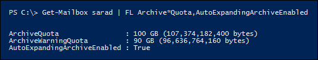

# <a name="enable-unlimited-archiving---admin-help"></a>啟用無限封存-系統管理協助

您可以使用 Exchange Online 自動展開的封存功能來啟用封存信箱的無限存放空間。 當自動展開的封存開啟時，會自動將額外的儲存空間新增至使用者的封存信箱，當其接近儲存量限制時。 結果為無限制的信箱儲存容量。 您可以為組織中的每個人或僅針對特定使用者開啟自動擴充封存。 如需有關自動展開封存的詳細資訊，請參閱 [Office 365 中的無限封存概述](unlimited-archiving.md)。

## <a name="before-you-enable-auto-expanding-archiving"></a>啟用自動擴充封存之前

- 您必須是組織中的全域系統管理員，或 Exchange Online 組織中組織管理角色群組的成員，才能啟用整個組織或特定使用者的自動擴充封存。 或者，您必須是指派「郵件收件者」角色的角色群組成員，才能為特定使用者啟用自動擴充封存。

- 必須啟用使用者的封存信箱，才能啟用自動擴充封存。 使用者必須被指派 Exchange Online Plan 2 授權，才能啟用封存信箱。 若使用者已獲指派 Exchange Online Plan 1 授權，您必須指派個別的 Exchange Online 封存授權，以啟用其封存信箱。 請參閱在 [安全性 & 規範中心啟用封存信箱](enable-archive-mailboxes.md)。

- 您也可以使用 PowerShell 來啟用封存信箱。 請參閱 [More information](#more-information) 一節，以取得 PowerShell 命令的範例，您可以用來為組織中的所有使用者啟用封存信箱。

- 自動展開封存也支援共用信箱。 若要啟用共用信箱的封存，則需要 exchange Online Plan 2 授權或 Exchange online Plan 1 授權與 Exchange Online 封存授權。

- 自動展開封存可防止您復原或還原非使用中的 [信箱](inactive-mailboxes-in-office-365.md#what-are-inactive-mailboxes)。 這表示如果您為信箱啟用自動展開的封存，而且信箱在日後變為非使用中，則您將無法透過將內容合併至現有的信箱) 來 [復原非使用中的信箱](recover-an-inactive-mailbox.md) () 或將 [其還原](restore-an-inactive-mailbox.md) (。 若在非使用中的信箱上啟用自動擴充封存，恢復資料的唯一方法是使用 Microsoft 365 規範中心的「內容搜尋」工具，從信箱中匯出資料，然後匯入至另一個信箱。 如需詳細資訊，請參閱非使用中 [信箱](inactive-mailboxes-in-office-365.md#inactive-mailboxes-and-auto-expanding-archives)的「非使用中信箱和自動展開的封存」一節。

- 您無法使用 Exchange 系統管理中心或安全性 & 規範中心來啟用自動擴充封存。 您必須使用 Exchange Online PowerShell。 若要使用遠端 PowerShell 連線到您的 Exchange Online 組織，請參閱 [connect To Exchange online PowerShell](https://go.microsoft.com/fwlink/p/?linkid=396554)。

## <a name="enable-auto-expanding-archiving-for-your-entire-organization"></a>啟用整個組織的自動擴充封存

您可以為整個組織啟用自動展開封存。 開啟之後，會針對現有的使用者信箱及建立的新使用者信箱啟用自動擴充封存。 當您建立使用者信箱時，請務必啟用使用者的主要封存信箱，這樣新使用者信箱的自動擴充封存功能才能運作。
  
1. [連線到 Exchange Online PowerShell](https://go.microsoft.com/fwlink/p/?linkid=396554)

2. 在 Exchange Online PowerShell 中執行下列命令，以啟用整個組織的自動擴充封存。

    ```powershell
    Set-OrganizationConfig -AutoExpandingArchive
    ```

## <a name="enable-auto-expanding-archiving-for-specific-users"></a>啟用特定使用者的自動擴充封存

除了為組織中的每位使用者啟用自動擴充封存，您只可對特定使用者啟用該封存。 您也可以這麼做，因為只有某些使用者可能需要大量的封存儲存容量。
  
當您為特定使用者啟用自動擴充封存，且使用者的信箱處於暫止狀態或指派給保留原則時，會進行下列兩項設定變更：
  
- 使用者主要封存信箱的儲存配額會從 100 GB (增加到 110 GB) 。 封存警告配額也會以 10 GB (增加，從 90 GB 到 100 GB) 。

- 使用者主要信箱中 [可復原的專案] 資料夾的儲存配額已增加 10 GB (，也會從 100 GB 增加至 110 GB) 。 可復原的專案警告配額也會從 90 GB (到 100 GB) ，增加 10 GB。 只有當信箱處於暫止狀態或指派給保留原則時，這些變更才適用。

新增此額外的空間，以避免在自動展開的封存布建之前可能發生的任何儲存問題。 當您為整個組織啟用自動擴充封存時，  *將不會*  新增額外的儲存空間，如前一節所述。
  
1. [連線到 Exchange Online PowerShell](https://go.microsoft.com/fwlink/p/?linkid=396554)

2. 在 Exchange Online PowerShell 中執行下列命令，以啟用特定使用者的自動擴充封存。 如先前所述，必須先啟用使用者的封存信箱 (主封存) ，才能為該使用者開啟自動展開的封存。

    ```powershell
    Enable-Mailbox <user mailbox> -AutoExpandingArchive
    ```

> [!IMPORTANT]
> 在 Exchange 混合式部署中，您無法使用 **Enable-Mailbox-AutoExpandingArchive** 命令來啟用自動擴充封存，該使用者的主要信箱為內部部署，而且其封存信箱為雲端架構。 若要在 Exchange 混合式部署中為雲端式封存信箱啟用自動擴充封存，您必須在 Exchange Online PowerShell 中執行 **Set-OrganizationConfig AutoExpandingArchive** 命令，以啟用整個組織的自動展開封存。 如果使用者的主要和封存信箱都是雲端架構，則可以使用 **Enable-Mailbox-AutoExpandingArchive** 命令來啟用該特定使用者的自動擴充封存。
  
## <a name="verify-that-auto-expanding-archiving-is-enabled"></a>確認已啟用自動展開封存

若要確認已為您的組織啟用自動展開封存，請在 Exchange Online PowerShell 中執行下列命令。

```powershell
Get-OrganizationConfig | FL AutoExpandingArchiveEnabled
```

值表示為  `True` 組織啟用自動展開封存。 
  
若要確認特定使用者已啟用自動展開封存，請在 Exchange Online PowerShell 中執行下列命令。
  
```powershell
Get-Mailbox <user mailbox> | FL AutoExpandingArchiveEnabled
```

值  `True` 表示已為使用者啟用自動展開封存。
  
若要判斷是否已啟用非使用中信箱的自動展開封存，請在 Exchange Online PowerShell 中執行下列命令。
  
```powershell
Get-Mailbox -InactiveMailboxOnly | FL UserPrincipalName,AutoExpandingArchiveEnabled
```

值，  `True` 表示已啟用非使用中信箱的自動展開封存。 值 `False` 表示未啟用自動展開封存。

啟用自動擴充封存後，請記住下列事項：
  
- 如果您執行 **Set-OrganizationConfig AutoExpandingArchive** 命令來啟用組織的自動擴充封存，您不需要在個別的信箱上執行 **Enable-Mailbox AutoExpandingArchive** 。 執行 **Set-OrganizationConfig** Cmdlet 以啟用組織的自動展開封存時，不會將使用者信箱上的  *AutoExpandingArchiveEnabled*  屬性變更為 `True` 。

- 同樣地，當您啟用自動擴充封存功能時，  *ArchiveQuota*  和  *ArchiveWarningQuota*  信箱屬性的值不會變更。 實際上，當您啟用使用者信箱的自動擴充封存，且  *AutoExpandingArchiveEnabled*  屬性設定為時  `True` ，會忽略  *ArchiveQuota*  和  *ArchiveWarningQuota*  屬性。 以下是針對使用者信箱啟用自動擴充封存後，這些信箱屬性的範例。 

    

## <a name="more-information"></a>其他相關資訊

- 您也可以使用 PowerShell 來啟用封存信箱。 例如，您可以在 Exchange Online PowerShell 中執行下列命令，以啟用尚未啟用封存信箱之所有使用者的封存信箱。

    ```powershell
    Get-Mailbox -Filter {ArchiveStatus -Eq "None" -AND RecipientTypeDetails -eq "UserMailbox"} | Enable-Mailbox -Archive
    ```

- 在您為組織或特定使用者開啟自動展開的封存後，封存信箱會在封存信箱 (包含 [可復原的專案] 資料夾時，轉換為自動展開封存) 達到 90 GB。 最多可能需要30天的時間，才能布建額外的儲存空間。

- 當您開啟自動展開的封存功能之後，就無法將其關閉。 此外，管理員無法調整自動擴充封存的儲存配額。

- 在 Exchange 混合式部署中，針對具有內部部署主要信箱的使用者，支援自動擴充封存。 不過，啟用雲端式封存信箱的自動展開封存後，您就無法將封存信箱的信箱移回內部部署 Exchange 組織。 在任何版本的 Exchange Server 中，都不支援自動展開封存的內部部署信箱。

- 如需使用者可用於存取其封存信箱中其他儲存區之專案的 Outlook 用戶端清單，請參閱 [無限制](unlimited-archiving.md#outlook-requirements-for-accessing-items-in-an-auto-expanded-archive)封存的「outlook 要求存取自動擴充的封存中的專案」一節。

- 如先前所述，當您執行 **Enable-Mailbox AutoExpandingArchive** 命令時，會將 10 GB 新增至使用者主要封存信箱的儲存配額 (及 [可復原的專案] 資料夾中) 。 這會提供額外的儲存空間，直到已布建自動擴充的儲存空間， (可能需要長達30天) 。 當您執行 **Set-OrganizationConfig AutoExpandingArchive** 以啟用組織中所有信箱的自動擴充封存功能時，並不會新增此額外的儲存空間。 如果您已對整個組織啟用自動展開的封存，但需要為特定使用者新增額外的 10 GB 儲存空間，您可以在該信箱上執行 **Enable-Mailbox AutoExpandingArchive** 命令。 您會收到錯誤訊息，指出已經啟用自動擴充封存，但額外的儲存空間會新增至信箱。

> [!IMPORTANT]
> [！注意] 只有針對個別使用者或共用信箱所用的信箱支援自動擴充封存，但其增長率並未超過每日 1 GB。 不允許使用日誌記錄、傳輸規則或自動轉寄規則，將郵件複製到封存信箱以進行封存。 使用者的封存信箱僅供該使用者使用。 Microsoft 保留在使用者的封存信箱用來儲存其他使用者的封存資料或其他不適當用途的情況下，拒絕無限封存的權利。
