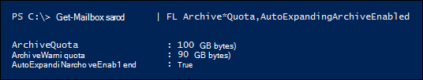

# <a name="enable-unlimited-archiving--admin-help"></a><span data-ttu-id="96105-104">啟用無限封存-系統管理說明</span><span class="sxs-lookup"><span data-stu-id="96105-104">Enable unlimited archiving — Admin Help</span></span>

<span data-ttu-id="96105-105">您可以使用 Exchange Online 自動展開的封存功能來啟用封存信箱的無限存放空間。</span><span class="sxs-lookup"><span data-stu-id="96105-105">You can use the Exchange Online auto-expanding archiving feature to enable unlimited storage space for archive mailboxes.</span></span> <span data-ttu-id="96105-106">當自動展開的封存開啟時，會自動將額外的儲存空間新增至使用者的封存信箱，當其接近儲存量限制時。</span><span class="sxs-lookup"><span data-stu-id="96105-106">When auto-expanding archiving is turned on, additional storage space is automatically added to a user's archive mailbox when it approaches the storage limit.</span></span> <span data-ttu-id="96105-107">結果為無限制的信箱儲存容量。</span><span class="sxs-lookup"><span data-stu-id="96105-107">The result is unlimited mailbox storage capacity.</span></span> <span data-ttu-id="96105-108">您可以為組織中的每個人或僅針對特定使用者開啟自動擴充封存。</span><span class="sxs-lookup"><span data-stu-id="96105-108">You can turn on auto-expanding archiving for everyone in your organization or just for specific users.</span></span> <span data-ttu-id="96105-109">如需有關自動展開封存的詳細資訊，請參閱[Office 365 中的無限封存概述](unlimited-archiving.md)。</span><span class="sxs-lookup"><span data-stu-id="96105-109">For more information about auto-expanding archiving, see [Overview of unlimited archiving in Office 365](unlimited-archiving.md).</span></span>

## <a name="before-you-begin"></a><span data-ttu-id="96105-110">開始之前</span><span class="sxs-lookup"><span data-stu-id="96105-110">Before you begin</span></span>

- <span data-ttu-id="96105-111">您必須是組織中的全域系統管理員，或 Exchange Online 組織中組織管理角色群組的成員，才能啟用整個組織或特定使用者的自動擴充封存。</span><span class="sxs-lookup"><span data-stu-id="96105-111">You have to be a global administrator in your organization or a member of the Organization Management role group in your Exchange Online organization to enable auto-expanding archiving for your entire organization or for specific users.</span></span> <span data-ttu-id="96105-112">或者，您必須是指派「郵件收件者」角色的角色群組成員，才能為特定使用者啟用自動擴充封存。</span><span class="sxs-lookup"><span data-stu-id="96105-112">Alternately, you have to be a member of a role group that's assigned the Mail Recipients role to enable auto-expanding archiving for specific users.</span></span>
    
- <span data-ttu-id="96105-113">必須啟用使用者的封存信箱，才能啟用自動擴充封存。</span><span class="sxs-lookup"><span data-stu-id="96105-113">A user's archive mailbox has to be enabled before you can enable auto-expanding archiving.</span></span> <span data-ttu-id="96105-114">使用者必須被指派 Exchange Online Plan 2 授權，才能啟用封存信箱。</span><span class="sxs-lookup"><span data-stu-id="96105-114">A user must be assigned an Exchange Online Plan 2 license to enable the archive mailbox.</span></span> <span data-ttu-id="96105-115">若使用者已獲指派 Exchange Online Plan 1 授權，您必須指派個別的 Exchange Online 封存授權，以啟用其封存信箱。</span><span class="sxs-lookup"><span data-stu-id="96105-115">If a user is assigned an Exchange Online Plan 1 license, you would have to assign them a separate Exchange Online Archiving license to enable their archive mailbox.</span></span> <span data-ttu-id="96105-116">請參閱在[安全性 & 規範中心啟用封存信箱](enable-archive-mailboxes.md)。</span><span class="sxs-lookup"><span data-stu-id="96105-116">See [Enable archive mailboxes in the Security & Compliance Center](enable-archive-mailboxes.md).</span></span>
    
- <span data-ttu-id="96105-117">您也可以使用 PowerShell 來啟用封存信箱。</span><span class="sxs-lookup"><span data-stu-id="96105-117">You can also use PowerShell to enable archive mailboxes.</span></span> <span data-ttu-id="96105-118">請參閱[More information](#more-information)一節，以取得 PowerShell 命令的範例，您可以用來為組織中的所有使用者啟用封存信箱。</span><span class="sxs-lookup"><span data-stu-id="96105-118">See the [More information](#more-information) section for an example of the PowerShell command that you can use to enable archive mailboxes for all users in your organization.</span></span> 
    
- <span data-ttu-id="96105-119">自動展開封存也支援共用信箱。</span><span class="sxs-lookup"><span data-stu-id="96105-119">Auto-expanding archiving also supports shared mailboxes.</span></span> <span data-ttu-id="96105-120">若要啟用共用信箱的封存，則需要 exchange Online Plan 2 授權或 Exchange online Plan 1 授權與 Exchange Online 封存授權。</span><span class="sxs-lookup"><span data-stu-id="96105-120">To enable the archive for a shared mailbox, an Exchange Online Plan 2 license or an Exchange Online Plan 1 license with an Exchange Online Archiving license is required.</span></span>
    
- <span data-ttu-id="96105-121">您無法使用 Exchange 系統管理中心或安全性 & 規範中心來啟用自動擴充封存。</span><span class="sxs-lookup"><span data-stu-id="96105-121">You can't use the Exchange admin center or the Security & Compliance Center to enable auto-expanding archiving.</span></span> <span data-ttu-id="96105-122">您必須使用 Exchange Online PowerShell。</span><span class="sxs-lookup"><span data-stu-id="96105-122">You have to use Exchange Online PowerShell.</span></span> <span data-ttu-id="96105-123">若要使用遠端 PowerShell 連線到您的 Exchange Online 組織，請參閱[connect To Exchange online PowerShell](https://go.microsoft.com/fwlink/p/?linkid=396554)。</span><span class="sxs-lookup"><span data-stu-id="96105-123">To connect to your Exchange Online organization using remote PowerShell, see [Connect to Exchange Online PowerShell](https://go.microsoft.com/fwlink/p/?linkid=396554).</span></span>
    
  
## <a name="enable-auto-expanding-archiving-for-your-entire-organization"></a><span data-ttu-id="96105-124">啟用整個組織的自動擴充封存</span><span class="sxs-lookup"><span data-stu-id="96105-124">Enable auto-expanding archiving for your entire organization</span></span>

<span data-ttu-id="96105-125">您可以為整個組織啟用自動展開封存。</span><span class="sxs-lookup"><span data-stu-id="96105-125">You can enable auto-expanding archiving for your entire organization.</span></span> <span data-ttu-id="96105-126">開啟之後，會針對現有的使用者信箱及建立的新使用者信箱啟用自動擴充封存。</span><span class="sxs-lookup"><span data-stu-id="96105-126">After you turn it on, auto-expanding archiving will be enabled for existing user mailboxes and for new user mailboxes that are created.</span></span> <span data-ttu-id="96105-127">當您建立使用者信箱時，請務必啟用使用者的主要封存信箱，這樣新使用者信箱的自動擴充封存功能才能運作。</span><span class="sxs-lookup"><span data-stu-id="96105-127">When you create user mailboxes, be sure to enable the user's main archive mailbox so the auto-expanding archiving feature works for the new user mailbox.</span></span>
  
1. [<span data-ttu-id="96105-128">連線到 Exchange Online PowerShell</span><span class="sxs-lookup"><span data-stu-id="96105-128">Connect to Exchange Online PowerShell</span></span>](https://go.microsoft.com/fwlink/p/?linkid=396554)
    
2. <span data-ttu-id="96105-129">在 Exchange Online PowerShell 中執行下列命令，以啟用整個組織的自動擴充封存。</span><span class="sxs-lookup"><span data-stu-id="96105-129">Run the following command in Exchange Online PowerShell to enable auto-expanding archiving for your entire organization.</span></span>

    ```powershell
    Set-OrganizationConfig -AutoExpandingArchive
    ```

## <a name="enable-auto-expanding-archiving-for-specific-users"></a><span data-ttu-id="96105-130">啟用特定使用者的自動擴充封存</span><span class="sxs-lookup"><span data-stu-id="96105-130">Enable auto-expanding archiving for specific users</span></span>

<span data-ttu-id="96105-131">除了為組織中的每位使用者啟用自動擴充封存，您只可對特定使用者啟用該封存。</span><span class="sxs-lookup"><span data-stu-id="96105-131">Instead of enabling auto-expanding archiving for every user in your organization, you can enable it only for specific users.</span></span> <span data-ttu-id="96105-132">您也可以這麼做，因為只有某些使用者可能需要大量的封存儲存容量。</span><span class="sxs-lookup"><span data-stu-id="96105-132">You might do this because only some users might have a need for a large archive storage capacity.</span></span>
  
<span data-ttu-id="96105-133">當您為特定使用者啟用自動擴充封存，且使用者的信箱處於暫止狀態或指派給保留原則時，會進行下列兩項設定變更：</span><span class="sxs-lookup"><span data-stu-id="96105-133">When you enable auto-expanding archiving for a specific user and the user's mailbox in on hold or assigned to a retention policy, the following two configurations changes are made:</span></span>
  
- <span data-ttu-id="96105-134">使用者主要封存信箱的儲存配額增加 10 GB （從 100 GB 到 110 GB）。</span><span class="sxs-lookup"><span data-stu-id="96105-134">The storage quota for the user's primary archive mailbox is increased by 10 GB (from 100 GB to 110 GB).</span></span> <span data-ttu-id="96105-135">封存警告配額也會以 10 GB 增加（從 90 GB 到 100 GB）。</span><span class="sxs-lookup"><span data-stu-id="96105-135">The archive warning quota is also increased by 10 GB (from 90 GB to 100 GB).</span></span>
    
- <span data-ttu-id="96105-136">使用者主要信箱中 [可復原的專案] 資料夾的儲存配額是以 10 GB （也從 100 GB 到 110 GB）增加。</span><span class="sxs-lookup"><span data-stu-id="96105-136">The storage quota for the Recoverable Items folder in the user's primary mailbox is increased by 10 GB (also from 100 GB to 110 GB).</span></span> <span data-ttu-id="96105-137">可復原的專案警告配額也會以 10 GB 增加（從 90 GB 到 100 GB）。</span><span class="sxs-lookup"><span data-stu-id="96105-137">The Recoverable Items warning quota is also increased by 10 GB (from 90 GB to 100 GB).</span></span> <span data-ttu-id="96105-138">只有當信箱處於暫止狀態或指派給保留原則時，這些變更才適用。</span><span class="sxs-lookup"><span data-stu-id="96105-138">These changes are applicable only if the mailbox in on hold or assigned to a retention policy.</span></span>
    
<span data-ttu-id="96105-139">新增此額外的空間，以避免在自動展開的封存布建之前可能發生的任何儲存問題。</span><span class="sxs-lookup"><span data-stu-id="96105-139">This additional space is added to prevent any storage issues that may occur before the auto-expanding archive is provisioned.</span></span> <span data-ttu-id="96105-140">當您為整個組織啟用自動擴充封存時，*將不會*新增額外的儲存空間，如前一節所述。</span><span class="sxs-lookup"><span data-stu-id="96105-140">Additional storage space  *is not*  added when you enable auto-expanding archiving for your entire organization, as described in the previous section.</span></span> 
  
1. [<span data-ttu-id="96105-141">連線到 Exchange Online PowerShell</span><span class="sxs-lookup"><span data-stu-id="96105-141">Connect to Exchange Online PowerShell</span></span>](https://go.microsoft.com/fwlink/p/?linkid=396554)
    
2. <span data-ttu-id="96105-142">在 Exchange Online PowerShell 中執行下列命令，以啟用特定使用者的自動擴充封存。</span><span class="sxs-lookup"><span data-stu-id="96105-142">Run the following command in Exchange Online PowerShell to enable auto-expanding archiving for a specific user.</span></span> <span data-ttu-id="96105-143">如先前所述，必須啟用使用者的封存信箱（主要封存）才能為該使用者開啟自動展開的封存。</span><span class="sxs-lookup"><span data-stu-id="96105-143">As previously explained, the user's archive mailbox (main archive) must be enabled before you can turn on auto-expanding archiving for that user.</span></span>
    
    ```powershell
    Enable-Mailbox <user mailbox> -AutoExpandingArchive
    ```


> [!IMPORTANT]
> <span data-ttu-id="96105-144">在 Exchange 混合式部署中，您無法使用**Enable-Mailbox-AutoExpandingArchive**命令來啟用自動擴充封存，以針對主要信箱位於內部部署的使用者，啟用自動擴充封存，而且其封存信箱為雲端架構。</span><span class="sxs-lookup"><span data-stu-id="96105-144">In an Exchange hybrid deployment, you can't use the **Enable-Mailbox -AutoExpandingArchive** command to enable auto-expanding archiving for specific a user whose primary mailbox is on premises and their archive mailbox is cloud-based.</span></span> <span data-ttu-id="96105-145">若要在 Exchange 混合式部署中為雲端式封存信箱啟用自動擴充封存，您必須在 Exchange Online PowerShell 中執行**Set-OrganizationConfig AutoExpandingArchive**命令，以啟用整個組織的自動展開封存。</span><span class="sxs-lookup"><span data-stu-id="96105-145">To enable auto-expanding archiving for cloud-based archive mailboxes in an Exchange hybrid deployment, you have to run the **Set-OrganizationConfig -AutoExpandingArchive** command in Exchange Online PowerShell to enable auto-expanding archiving for the entire organization.</span></span> <span data-ttu-id="96105-146">如果使用者的主要和封存信箱都是雲端架構，則可以使用**Enable-Mailbox-AutoExpandingArchive**命令來啟用該特定使用者的自動擴充封存。</span><span class="sxs-lookup"><span data-stu-id="96105-146">If a user's primary and archive mailboxes are both cloud-based, then you can use the **Enable-Mailbox -AutoExpandingArchive** command to enable auto-expanding archiving for that specific user.</span></span> 
  
## <a name="verify-that-auto-expanding-archiving-is-enabled"></a><span data-ttu-id="96105-147">確認已啟用自動展開封存</span><span class="sxs-lookup"><span data-stu-id="96105-147">Verify that auto-expanding archiving is enabled</span></span>

<span data-ttu-id="96105-148">若要確認已為您的組織啟用自動展開封存，請在 Exchange Online PowerShell 中執行下列命令。</span><span class="sxs-lookup"><span data-stu-id="96105-148">To verify that auto-expanding archiving is enabled for your organization, run the following command in Exchange Online PowerShell.</span></span>

```powershell
Get-OrganizationConfig | FL AutoExpandingArchiveEnabled
```

<span data-ttu-id="96105-149">值`True`表示為組織啟用自動展開封存。</span><span class="sxs-lookup"><span data-stu-id="96105-149">A value of  `True` indicates that auto-expanding archiving is enabled for the organization.</span></span> 
  
<span data-ttu-id="96105-150">若要確認特定使用者的自動展開封存是 enabledd 的，請在 Exchange Online PowerShell 中執行下列命令。</span><span class="sxs-lookup"><span data-stu-id="96105-150">To verify that auto-expanding archiving is enabledd for a specific user, run the following command in Exchange Online PowerShell.</span></span>
  
```powershell
Get-Mailbox <user mailbox> | FL AutoExpandingArchiveEnabled
```

<span data-ttu-id="96105-151">值`True`表示已為使用者啟用自動展開封存。</span><span class="sxs-lookup"><span data-stu-id="96105-151">A value of  `True` indicates that auto-expanding archiving is enabled for the user.</span></span> 
  
<span data-ttu-id="96105-152">啟用自動擴充封存後，請記住下列事項：</span><span class="sxs-lookup"><span data-stu-id="96105-152">Keep the following things in mind after you enable auto-expanding archiving:</span></span>
  
- <span data-ttu-id="96105-153">如果您執行**Set-OrganizationConfig AutoExpandingArchive**命令來啟用組織的自動擴充封存，您不需要在個別的信箱上執行**Enable-Mailbox AutoExpandingArchive** 。</span><span class="sxs-lookup"><span data-stu-id="96105-153">If you run the **Set-OrganizationConfig -AutoExpandingArchive** command to enable auto-expanding archiving for your organization, you don't have to run the **Enable-Mailbox -AutoExpandingArchive** on individual mailboxes.</span></span> <span data-ttu-id="96105-154">執行**Set-OrganizationConfig** Cmdlet 以啟用組織的自動展開封存時，不會將使用者信箱上的*AutoExpandingArchiveEnabled*屬性變更`True`為。</span><span class="sxs-lookup"><span data-stu-id="96105-154">Running the **Set-OrganizationConfig** cmdlet to enable auto-expanding archiving for your organization doesn't change the  *AutoExpandingArchiveEnabled*  property on user mailboxes to  `True`.</span></span>
    
- <span data-ttu-id="96105-155">同樣地，當您啟用自動擴充封存功能時， *ArchiveQuota*和*ArchiveWarningQuota*信箱屬性的值不會變更。</span><span class="sxs-lookup"><span data-stu-id="96105-155">Similarly, the values for the  *ArchiveQuota*  and  *ArchiveWarningQuota*  mailbox properties aren't changed when you enable auto-expanding archiving.</span></span> <span data-ttu-id="96105-156">實際上，當您啟用使用者信箱的自動擴充封存，且*AutoExpandingArchiveEnabled*屬性設定為`True`時，會忽略*ArchiveQuota*和*ArchiveWarningQuota*屬性。</span><span class="sxs-lookup"><span data-stu-id="96105-156">In fact, when you enable auto-expanding archiving for a user mailbox and the  *AutoExpandingArchiveEnabled*  property is set to  `True`, the  *ArchiveQuota*  and  *ArchiveWarningQuota*  properties are ignored.</span></span> <span data-ttu-id="96105-157">以下是針對使用者信箱啟用自動擴充封存後，這些信箱屬性的範例。</span><span class="sxs-lookup"><span data-stu-id="96105-157">Here's an example of these mailbox properties after auto-expanding archiving is enabled for a user's mailbox.</span></span> 
    
    

  
## <a name="more-information"></a><span data-ttu-id="96105-159">詳細資訊</span><span class="sxs-lookup"><span data-stu-id="96105-159">More information</span></span>

- <span data-ttu-id="96105-160">您也可以使用 PowerShell 來啟用封存信箱。</span><span class="sxs-lookup"><span data-stu-id="96105-160">You can also use PowerShell to enable archive mailboxes.</span></span> <span data-ttu-id="96105-161">例如，您可以在 Exchange Online PowerShell 中執行下列命令，以啟用尚未啟用封存信箱之所有使用者的封存信箱。</span><span class="sxs-lookup"><span data-stu-id="96105-161">For example, you can run the following command in Exchange Online PowerShell to enable archive mailboxes for all users whose archive mailbox isn't already enabled.</span></span>

    ```powershell
    Get-Mailbox -Filter {ArchiveStatus -Eq "None" -AND RecipientTypeDetails -eq "UserMailbox"} | Enable-Mailbox -Archive
    ```

- <span data-ttu-id="96105-162">當您為組織或特定使用者開啟自動展開的封存後，封存信箱（包括 [可復原的專案] 資料夾）達到 90 GB 時，就會轉換為自動展開的封存。</span><span class="sxs-lookup"><span data-stu-id="96105-162">After you turn on auto-expanding archiving for your organization or for a specific user, an archive mailbox is converted to an auto-expanding archive when the archive mailbox (including the Recoverable Items folder) reaches 90 GB.</span></span> <span data-ttu-id="96105-163">最多可能需要30天的時間，才能布建額外的儲存空間。</span><span class="sxs-lookup"><span data-stu-id="96105-163">It can take up to 30 days for the additional storage space to be provisioned.</span></span>
    
- <span data-ttu-id="96105-164">當您開啟自動展開的封存功能之後，就無法將其關閉。</span><span class="sxs-lookup"><span data-stu-id="96105-164">After you turn on auto-expanding archiving, it can't be turned off.</span></span>
    
- <span data-ttu-id="96105-165">在 Exchange 混合式部署中，針對具有內部部署主要信箱的使用者，支援自動擴充封存。</span><span class="sxs-lookup"><span data-stu-id="96105-165">Auto-expanding archiving is supported for cloud-based archive mailboxes in an Exchange hybrid deployment for users who have an on-premises primary mailbox.</span></span> <span data-ttu-id="96105-166">不過，啟用雲端式封存信箱的自動展開封存後，您就無法將封存信箱的信箱移回內部部署 Exchange 組織。</span><span class="sxs-lookup"><span data-stu-id="96105-166">However, after auto-expanding archiving is enabled for a cloud-based archive mailbox, you can't off-board that archive mailbox back to the on-premises Exchange organization.</span></span> <span data-ttu-id="96105-167">Exchange Server 2010 中的內部部署信箱不支援自動展開封存。</span><span class="sxs-lookup"><span data-stu-id="96105-167">Auto-expanding archiving isn't supported for on-premises mailboxes in Exchange Server 2010.</span></span>
    
- <span data-ttu-id="96105-168">如需使用者可用於存取其封存信箱中其他儲存區之專案的 Outlook 用戶端清單，請參閱[無限制](unlimited-archiving.md#outlook-requirements-for-accessing-items-in-an-auto-expanded-archive)封存的「outlook 要求存取自動擴充的封存中的專案」一節。</span><span class="sxs-lookup"><span data-stu-id="96105-168">For a list of Outlook clients that users can use to access items in the additional storage area in their archive mailbox, see the "Outlook requirements for accessing items in an auto-expanded archive" section in [Overview of unlimited archiving](unlimited-archiving.md#outlook-requirements-for-accessing-items-in-an-auto-expanded-archive).</span></span>
    
- <span data-ttu-id="96105-169">如先前所述，當您執行**Enable-Mailbox-AutoExpandingArchive**命令時，會將 10 GB 新增至使用者主要封存信箱的儲存配額（和 [可復原的專案] 資料夾（如果信箱處於保留狀態）。</span><span class="sxs-lookup"><span data-stu-id="96105-169">As previously explained, 10 GB is added to the storage quota of the user's primary archive mailbox (and to the Recoverable Items folder if the mailbox is on hold) when you run the **Enable-Mailbox -AutoExpandingArchive** command.</span></span> <span data-ttu-id="96105-170">在布建自動擴充的儲存空間之前（可能需要30天），這會提供額外的儲存空間。</span><span class="sxs-lookup"><span data-stu-id="96105-170">This provides additional storage until the auto-expanded storage space is provisioned (which can take up to 30 days).</span></span> <span data-ttu-id="96105-171">當您執行**Set-OrganizationConfig AutoExpandingArchive**以啟用組織中所有信箱的自動擴充封存功能時，並不會新增此額外的儲存空間。</span><span class="sxs-lookup"><span data-stu-id="96105-171">This additional storage space isn't added when you run the **Set-OrganizationConfig -AutoExpandingArchive** to enable auto-expanding archiving for all mailboxes in your organization.</span></span> <span data-ttu-id="96105-172">如果您已對整個組織啟用自動展開的封存，但需要為特定使用者新增額外的 10 GB 儲存空間，您可以在該信箱上執行**Enable-Mailbox AutoExpandingArchive**命令。</span><span class="sxs-lookup"><span data-stu-id="96105-172">If you enabled auto-expanding archiving for the entire organization, but need to add the additional 10 GB of storage space for a specific user, you can run the **Enable-Mailbox -AutoExpandingArchive** command on that mailbox.</span></span> <span data-ttu-id="96105-173">您會收到錯誤訊息，指出已經啟用自動擴充封存，但額外的儲存空間會新增至信箱。</span><span class="sxs-lookup"><span data-stu-id="96105-173">You will receive an error saying that auto-expanding archiving has already been enabled, but the additional storage space will be added to the mailbox.</span></span> 

- <span data-ttu-id="96105-174">系統管理員無法調整儲存空間配額。</span><span class="sxs-lookup"><span data-stu-id="96105-174">Administrators can't adjust the storage quota.</span></span>

> [!IMPORTANT]
> <span data-ttu-id="96105-175">[！注意] 只有針對個別使用者或共用信箱所用的信箱支援自動擴充封存，但其增長率並未超過每日 1 GB。</span><span class="sxs-lookup"><span data-stu-id="96105-175">Auto-expanding archiving is only supported for mailboxes used for individual users or shared mailboxes with a growth rate that doesn't exceed 1 GB per day.</span></span> <span data-ttu-id="96105-176">不允許使用日誌記錄、傳輸規則或自動轉寄規則，將郵件複製到封存信箱以進行封存。</span><span class="sxs-lookup"><span data-stu-id="96105-176">Using journaling, transport rules, or auto-forwarding rules to copy messages to an archive mailbox for the purposes of archiving is not permitted.</span></span> <span data-ttu-id="96105-177">使用者的封存信箱僅供該使用者使用。</span><span class="sxs-lookup"><span data-stu-id="96105-177">A user's archive mailbox is intended for just that user.</span></span> <span data-ttu-id="96105-178">Microsoft 保留在使用者的封存信箱用來儲存其他使用者的封存資料或其他不適當用途的情況下，拒絕無限封存的權利。</span><span class="sxs-lookup"><span data-stu-id="96105-178">Microsoft reserves the right to deny unlimited archiving in instances where a user's archive mailbox is used to store archive data for other users or in other cases of inappropriate use.</span></span>
