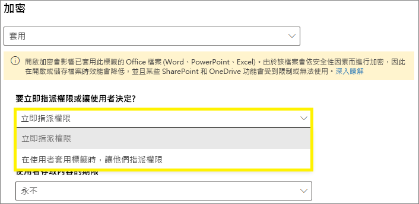
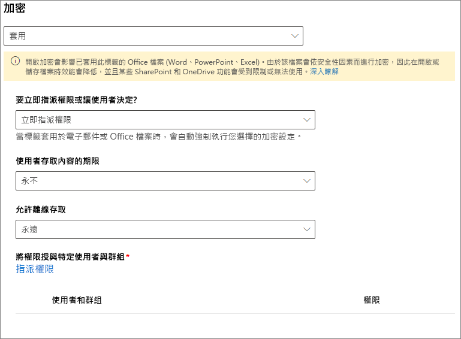
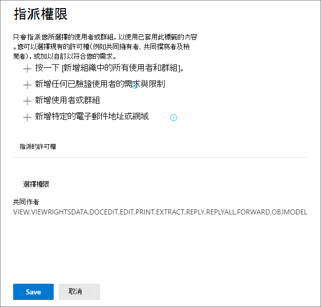
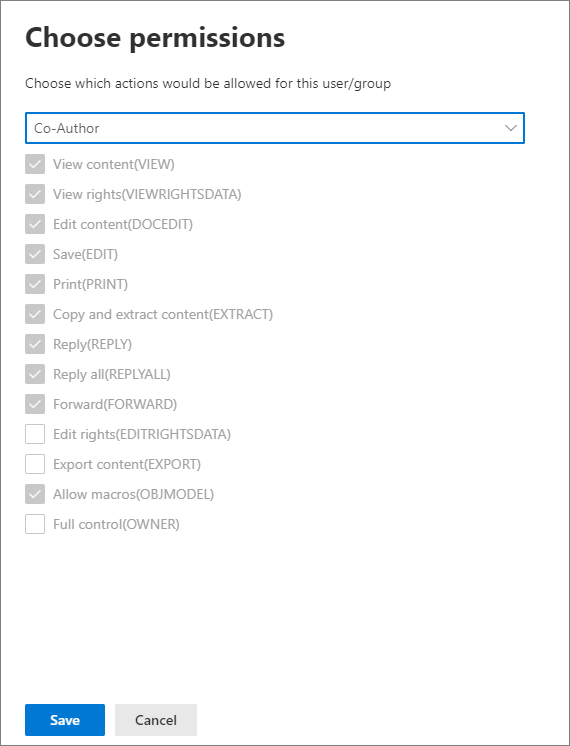
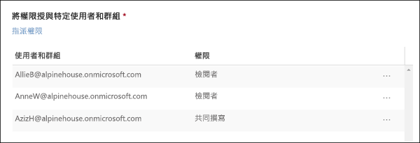
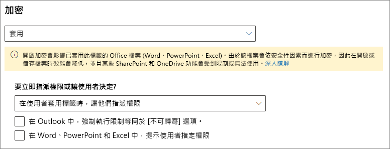
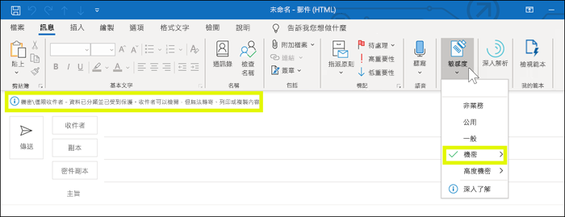
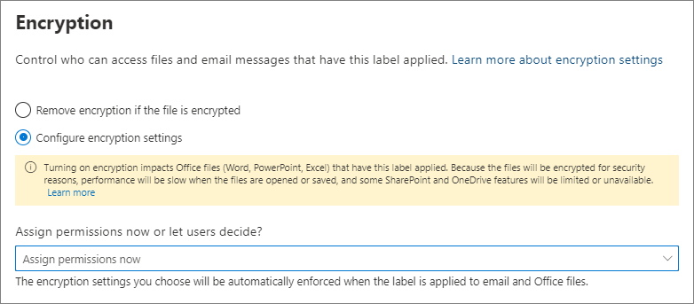

# 使用敏感度標籤來套用加密以限制存取內容 

當建立敏感度標籤時，您可以限制標籤將套用至其中之內容的存取。例如，使用敏感度標籤的加密設定，您可以保護內容，以便：

- 僅您組織內的使用者才能開啟機密文件或電子郵件。
- 僅行銷部門中的使用者才能編輯和列印促銷公告文件或電子郵件，而您組織中的所有其他使用者則只能讀取它。
- 使用者無法轉寄電子郵件，或從中複製包含內部組織相關消息的資訊。
- 在指定日期之後，無法開啟傳送給商業夥伴的目前價格清單。

加密文件或電子郵件時，內容的存取會受到限制，以便：

- 只有標籤加密設定授權的使用者才能將其解密。
- 即使檔案重新命名，無論其位於您組織內部或外部，仍保持加密狀態。
- 同時進行靜態加密 (例如，在 OneDrive 帳戶中) 及傳輸中加密 (例如，已傳送的電子郵件)。

最後，身為系統管理員的您，在設定一個敏感度標籤來套用加密時，可以選擇以下兩者之一：

- **立即指派權限**，這樣您就能確實決定哪個使用者能夠存取該標籤的內容。
- 當使用者將標籤套用到內容時，**讓使用者指派權限**。 如此一來，您就可以讓組織中的人員靈活地共同作業並完成工作。

當您在 Microsoft 365 合規性中心、Microsoft 365 安全性中心或是 Office 365 安全性與合規性中心中[建立敏感性標籤](create-sensitivity-labels.md)時，可以使用加密設定。

## 了解加密的運作方式

加密使用來自 Azure 資訊保護的 Azure 版權管理服務 (Azure RMS)。 此保護解決方案使用加密、身分識別及授權原則。 若要深入了解，請參閱 Azure 資訊保護文件中的[什麼是 Azure 版權管理？](https://docs.microsoft.com/azure/information-protection/what-is-azure-rms)。 

使用此加密解決方案時，**超級使用者**功能可確保獲授權的人員和服務一律可以讀取和檢查已為組織加密的資料。 如有需要，您可以接著將加密移除或變更。 如需詳細資訊，請參閱[為 Azure 資訊保護和探索服務或資料復原設定超級使用者](https://docs.microsoft.com/azure/information-protection/configure-super-users)。

## 如何設定用於加密的標籤

[建立或編輯敏感度標籤](create-sensitivity-labels.md#create-and-configure-sensitivity-labels)，並在精靈的 [加密]**** 頁面上選取下列其中一個選項：

- **無**：新標籤的預設設定。 不會套用新的加密。
- **套用**：開啟加密，然後指定加密設定。
- **移除**：如果文件或電子郵件已加密，則會移除加密。

> [!NOTE]
> 只有 Azure 資訊保護整合標籤用戶端才支援 [移除]**** 選項。 當您使用內建的標籤時，具有此選項的標籤會在 Office 應用程式中顯示，並且若已選取該選項，則加密行為會與 [無]**** 相同。

設定加密選項：

### 套用標籤時，現有的加密會發生什麼情況

如果您將敏感度標籤套用到未加密的內容，您可以選取的加密選項結果會一目了然。 例如，如果將加密設定為 [無]****，則內容會保持未加密。

不過，內容可能已加密。 例如，其他使用者可能已套用：

- 其自己的權限，其中包括標籤提示時的使用者定義權限、Azure 資訊保護用戶端的自訂權限，以及來自 Office 應用程式內的**限制存取**文件保護。
- Azure 版權管理保護範本可獨立於標籤將內容加密。 此類別包括使用版權保護來套用加密的郵件流程規則。
- 以系統管理員指派的權限套用加密的標籤。

下表說明對該內容套用敏感度標籤時，現有的加密會發生的情況：

| |**加密：無**|**加密：套用**|**加密：移除**|
|:-----|:-----|:-----|:-----|
|**使用者指定的權限**|原始加密已保留|新標籤加密已套用|原始加密已移除|
|**保護範本**|原始加密已保留|新標籤加密已套用|原始加密已移除|
|**具有系統管理員定義權限的標籤**|原始加密已移除|新標籤加密已套用|原始加密已移除|

請注意，在套用新標籤加密或移除原始加密的情況下，只有在套用標籤的使用者有支援此動作的使用權利或角色時，才會發生這種情況：
- [使用權限](https://docs.microsoft.com/azure/information-protection/configure-usage-rights#usage-rights-and-descriptions)匯出或完全控制。
- [版權管理簽發者或版權管理擁有者](https://docs.microsoft.com/azure/information-protection/configure-usage-rights#rights-management-issuer-and-rights-management-owner)的角色，或[超級使用者](https://docs.microsoft.com/azure/information-protection/configure-super-users)。

如果使用者沒有這些權限或角色中的一個，就無法套用標籤，因此會保留原始加密。 使用者會看到下列訊息：**您沒有對敏感度標籤進行變更所需的權限。請連絡內容的擁有者。**

例如，對電子郵件訊息套用 [不可轉寄] 的人員，可以將該對話重新標記，以取代加密或移除它，因為他們是該電子郵件的版權管理擁有者。 但除了超級使用者之外，此電子郵件的收件者無法重新標記它，因為他們沒有所需的使用權限。

#### 已加密電子郵件的電子郵件附件

當電子郵件以任何方法加密時，任何附加至電子郵件的未加密 Office 文件都會自動繼承相同的加密設定。

已加密然後新增為附件的文件，一律會保留其原始加密。 

## 設定加密設定

當您在精靈的 [加密]**** 頁面上選取 [套用]**** 來建立或編輯敏感度標籤時，請選擇是否要：

- **立即指派權限**，這樣您就能決定哪些使用者確切能取得已套用標籤內容的權限。 如需詳細資訊，請參閱下一節的[立即指派權限](#assign-permissions-now)。
- 當使用者將標籤套用到內容時，**讓使用者指派權限**。 利用此選項，您就可以讓組織中的人員靈活地共同作業並完成工作。 如需詳細資訊，請本頁的[讓使用者指派權限](#let-users-assign-permissions)章節。

例如，如果您有一個名為 [高度機密] **** 的敏感度標籤，該標籤將套用至最敏感的內容，則您可能會希望立即決定誰能取得該內容的何種權限。

或者，如果您有一個名為 [商業合約]**** 的敏感度標籤，並且貴組織的工作流程要求人員隨機與不同人員共同處理此內容，則您可能會希望讓使用者在指派標籤時決定可存取的人員。 這種靈活性既可以幫助您提高使用者的工作效率，又可以減少管理員更新或建立新敏感度標籤以滿足特定案例的要求。

選擇 [立即指派權限] 或 [讓使用者指派權限]： 

## 立即指派權限

使用下列選項來控制誰可以存取套用此標籤的電子郵件或文件。 您可以：

1. 在特定日期，或是在套用標籤之後的特定天數之後**允許具有標籤的內容的存取權到期**。在此時間後，使用者將無法開啟具有標籤的項目。如果指定日期，則會在目前時區中，該日期的午夜開始生效。(請注意，某些電子郵件用戶端可能因為其快取機制而無法強制執行到期，而顯示超過期限的電子郵件。)

2. 在套用標籤之後**允許離線存取**可為從不、一律或特定天數。如果您將離線存取限制為從不或天數，則達到該閾值時，必須重新驗證使用者，並記錄其存取。如需詳細資訊，請參閱關於 Rights Management 使用授權的下一節。

已加密內容的存取控制設定：

### 用於離線存取的 Rights Management 使用授權

當使用者開啟以來自 Azure 版權管理服務的加密保護的文件或電子郵件時，Azure 版權管理會將該內容的使用授權授與給該使用者。 使用授權是一項憑證，其中包含使用者對於文件或電子郵件使用權限，以及用來加密內容的加密金鑰。 如果已設定，則使用授權也會包含到期日，以及該使用授權的有效期。

如果未設定到期日，則租用戶的預設使用授權有效期間為 30 天。在這段期間，不會針對內容重新驗證或重新授權使用者。這個程序可讓使用者在沒有網際網路連線的情況下繼續開啟受保護文件或電子郵件。使用授權有效期間到期時，下次使用者存取受保護文件或電子郵件時，則必須重新驗證和重新授權使用者。

除了重新驗證外，還會重新評估原則和使用者群組成員資格。 這表示，如果上次使用者存取內容後，加密設定或群組成員資格發生變更，則這些使用者可能遇到相同的文件或電子郵件，卻有不同的存取結果。

若要了解如何變更預設的 30 天設定，請參閱 [Rights Management 使用授權](https://docs.microsoft.com/azure/information-protection/configure-usage-rights#rights-management-use-license)。

### 將權限指派給特定使用者或群組

您可以將權限授與特定人員，以便只有他們可與標籤內容互動：

1. 首先，新增將獲指派標籤內容之權限的使用者或群組。

2. 接著，選擇那些使用者應對標籤內容具有的權限。

指派權限：

#### 新增使用者或群組

指派權限時，您可以選擇：

- 組織中的所有人 (所有租用戶成員)。此設定會排除來賓帳戶。
- 任何已驗證的使用者。 選取此選項之前，請先確認您了解此設定的[需求與限制](#requirements-and-limitations-for-add-any-authenticated-users)。
- 任何特定使用者或啟用電子郵件功能的安全性群組、通訊群組、Office 365 群組或動態通訊群組。 
- 任何電子郵件地址或網域。 使用此選項來指定另一個組織中使用 Azure AD 的所有使用者，方法是輸入來自該組織的任何網域名稱。 您也可以針對社交提供者使用此選項，方法是輸入其網域名稱，例如 **gmail.com**、**hotmail.com** 或 **outlook.com**。

> [!NOTE]
> 如果您指定的網域來自使用 Azure AD 的組織，則無法限制對該特定網域的存取。 相反地，系統會為擁有您指定網域名稱的租用戶自動包含 Azure AD 中的所有經驗證網域。

當您選擇所有租用戶成員或瀏覽目錄時，使用者或群組必須具有電子郵件地址。

最佳做法是使用群組，而非使用者。此策略可讓您保持更簡單的組態。

##### **新增任何已驗證使用者**的需求與限制

此設定不會限制能夠存取標籤所加密內容的人員，同時仍會加密內容，並提供限制內容使用方式 (權限) 和存取方式 (到期和離線存取) 的選項。 不過，開啟加密內容的應用程式必須能夠支援所使用的驗證。 因此，同盟社交提供者 (例如 Google) 和一次性密碼驗證僅對電子郵件有效，且僅在您使用 Exchange Online 時才有效。 您可以將 Microsoft 帳戶與 Office 365 應用程式和 [Azure 資訊保護檢視器](https://portal.azurerms.com/#/download)搭配使用。

任何已驗證使用者設定的一些典型案例如下：
- 您不在意檢視內容的是誰，但想要限制其使用方式。 例如，您不希望編輯、複製或列印內容。
- 您不需要限制存取內容的是誰，但想要能夠確認誰開啟了該內容。
- 您必須將靜態內容和在傳輸中的內容加密，但不要求存取控制。

#### 選擇權限

當您選擇要對那些使用者或群組允許的權限時，您可以選取下列任一項：

- [預先定義的權限層級](https://docs.microsoft.com/azure/information-protection/configure-usage-rights#rights-included-in-permissions-levels)，其中有一組預設的權限，例如共同作者或檢閱者。
- 自訂權限，您可在此選擇一或多個使用權限。

如需可協助您選取適當權限的詳細資訊，請參閱[使用權限和描述](https://docs.microsoft.com/azure/information-protection/configure-usage-rights#usage-rights-and-descriptions)。  

請注意，相同標籤可將不同的權限授與不同的使用者。例如，單一標籤可將某些使用者指派為檢閱者，並將不同的使用者指派為共同作者，如以下螢幕擷取畫面所示。

若要這麼做，請新增使用者或群組、將權限指派給他們，並儲存這些設定。然後，重複這些步驟、新增使用者並將權限指派給他們，每次完成後儲存設定。您可以視需要經常重複此設定，為不同的使用者定義不同的權限。

#### Rights Management 簽發者 (套用敏感度標籤的使用者) 一律具有完全控制權

敏感度標籤的加密使用來自 Azure 資訊保護的 Azure 版權管理服務。 當使用者套用敏感度標籤以使用加密保護文件或電子郵件時，該使用者就會變成該內容的版權管理簽發者。

版權管理簽發者一律會被授與文件或電子郵件的完全控制權限，此外：

- 如果加密設定包括到期日，則版權管理簽發者仍然可在該日期之後開啟和編輯文件或電子郵件。
- Rights Management 簽發者一律可以離線存取文件或電子郵件。
- Rights Management 簽發者仍可以開啟撤銷後的文件。

如需詳細資訊，請參閱 [Rights Management 簽發者和 Rights Management 擁有者](https://docs.microsoft.com/azure/information-protection/configure-usage-rights#rights-management-issuer-and-rights-management-owner)。

## 讓使用者指派權限

您可以使用這些選項讓使用者在手動將敏感度標籤套用至內容時指派權限：

- 在 Outlook 中，使用者可以針對所選的收件者選取等同於[不可轉寄](https://docs.microsoft.com/azure/information-protection/configure-usage-rights#do-not-forward-option-for-emails)選項的限制。

- 在 Word、PowerPoint 和 Excel 中，系統會提示使用者為特定使用者、群組或組織選取其自己的權限。 
    > [!NOTE]
    > 適用於 Word、PowerPoint 和 Excel 的此選項，是由 Azure 資訊保護整合標籤用戶端支援。 針對使用內建標籤的應用程式，目前在 [Windows 版和 Mac 版預覽](sensitivity-labels-office-apps.md#sensitivity-label-capabilities-in-word-excel-and-powerpoint)中都提供支援。 
    > 
    > 如果已選取此選項，但使用者的應用程式不支援此選項，表示該標籤未顯示給使用者，或 (目前正在 iOS 和 Android 版預覽中推出) 為求一致，系統會顯示標籤，但無法在套用時為使用者提供說明訊息。

支援這些選項時，請使用下表來識別使用者何時可看到敏感度標籤：

|設定 |標籤在 Outlook 中顯示|標籤在 Word、Excel、PowerPoint 中顯示|
|:-----|:-----|:-----|:-----|
|**在 Outlook 中，強制執行限制等同於 [不可轉寄] 選項**|是 |否 |
|**在 Word、PowerPoint 與 Excel 中提示使用者指定權限**|否 |是|

同時選取這兩個設定時，標籤會因此同時在 Outlook 和 Word、Excel 和 PowerPoint 中顯示。

可讓使用者指派權限的敏感度標籤只能透過使用者手動來套用至內容；它不能自動套用，也不能作為推薦標籤。

設定使用者指派的權限：

### Outlook 限制

在 Outlook 中，當使用者套用的敏感標籤可允許他們指派郵件的權限時，限制與 [不可轉寄] 選項相同。 使用者會在郵件頂端看到標籤名稱和描述，指出內容已受到保護。 與 Word、PowerPoint 和 Excel 不同的是 (請參閱[下一節](#word-powerpoint-and-excel-permissions))，使用者不會收到選取特定權限的提示。

將 [不可轉寄] 選項套用到電子郵件時，電子郵件會加密而且收件者必須經過驗證。 收件者無法轉寄、列印或複製該電子郵件。 例如，在 Outlook 用戶端中，無法使用 [轉寄] 按鈕、[另存新檔] 和 [列印] 功能表選項，且您無法在 [收件人]、[副本] 或 [密件副本] 方塊中新增或變更收件者。

附加到電子郵件的未加密 Office 文件會自動繼承相同的限制。 套用至這些文件的使用權限是 [編輯內容]、[編輯]；[儲存]；[檢視]、[開啟]、[讀取]；和 [允許巨集]。 如果使用者想要不同的附件使用權限，或者附件不是支援此繼承保護的 Office 文件，則使用者需要在將文件附加到電子郵件之前保護該檔案。

### Word、PowerPoint 和 Excel 權限

在 Word、PowerPoint 和 Excel 中，當使用者套用可讓他們對文件指派權限的敏感度標籤時，系統會提示他們指定套用加密時的所選使用者和權限。

例如，利用 Azure 資訊保護整合標籤用戶端，使用者可以：

- 選取權限等級，例如檢視者 (指派 [僅檢視] 權限) 或共同作者 (指派 [檢視]、[編輯]、[複製] 和 [列印] 權限)。
- 選取使用者、群組或組織。 這可能包括組織內部或外部的人員。
- 設定到期日，到期之後所選使用者就無法存取內容。 如需詳細資訊, 請參閱前一節的[用於離線存取的 Rights Management 使用授權](#rights-management-use-license-for-offline-access)。

針對內建標籤，使用者會在選取下列項目時看到相同的對話方塊：

- Windows：[檔案]**** 索引標籤 > [資訊]****  >  [保護文件]****  >  [限制存取]****  >  [限制存取]****

- MacOS：[校閱]**** 索引標籤 > [保護]****  >  [權限]****  >  [限制存取]****

## 加密設定的範例組態

針對後續的各個範例，當您[建立或編輯敏感度標籤](create-sensitivity-labels.md#create-and-configure-sensitivity-labels)時，請從精靈的 **[加密]** 頁面執行組態。 首先，請確認 **[加密]** 設定為 **[套用]**：

### 範例 1：套用 [不可轉寄] 標籤，以傳送加密的電子郵件傳送至 Gmail 帳戶

此標籤只會在 Outlook 和 Outlook 網頁版中顯示，因此您必須使用 Exchange Online。 當使用者需要傳送加密的電子郵件給使用 Gmail 帳戶 (或您組織外部的任何其他電子郵件帳戶)的人員時，指示使用者選取此標籤。 

您的使用者在 **[收件者]** 方塊中輸入 Gmail 電子郵件地址。  然後選取標籤，而 [不可轉寄] 選項會自動新增至電子郵件中。 結果會是收件者無法轉寄電子郵件、列印它、複製其內容，或使用 **[另存新檔]** 選項將電子郵件儲存在信箱外部。 

1. 在 **[加密]** 頁面上：針對 **[立即指派權限，或讓使用者決定?]**，選取 **[當使用者套用標籤時，讓他們指派權限]**。

3. 選取核取方塊：**[在 Outlook 中，強制限制等於 [不可轉寄] 選項]**。

4. 如果已選取，請清除此核取方塊：**[在 Word、PowerPoint 與 Excel 中提示使用者指定權限]**。

5. 選取 **[下一步]** 並完成精靈。

### 範例 2：會對其他組織中的所有使用者限制唯讀權限的標籤

此標籤適用於以唯讀方式共用的非常敏感文件，以及一律需要網際網路連線才能檢視的文件。

此標籤不適合用於電子郵件。

1. 在 **[加密]** 頁面上：針對 **[立即指派權限，或讓使用者決定?]**，選取 **[立即指派權限]**。

3. 針對 **[允許離線存取]**，選取 **[從不]**。

4. 選取 [指派權限]****。

3. 在 **[指派權限]** 窗格中，選取 **[新增這些電子郵件地址或網域]**。

4. 在文字方塊中，輸入來自另一個組織的網域名稱，例如，**fabrikam.com**。 然後選取 **[新增]**。

5. 選取 [從現有或自訂權限中選擇權限]****。

6. 在 **[從現有或自訂權限中選擇權限]** 窗格中，選取下拉式方塊，選取 **[檢視器]**，然後選取 **[儲存]**。

6. 回到 **[指派權限]** 窗格，選取 **[儲存]**。

7. 在 **[加密]** 頁面上，選取 **[下一步]** 並完成精靈。

### 範例 3：將外部使用者新增至可加密內容的現有標籤

您新增的新使用者將能夠開啟已使用此標籤保護的文件和電子郵件。 您授與這些使用者的權限可以與現有使用者所擁有的權限不同。

1. 在 [加密]**** 頁面上：針對 [立即指派權限，或讓使用者決定?]****，確定已選取 [立即指派權限]****。

2. 選取 [指派權限]****。

3. 在 **[指派權限]** 窗格中，選取 **[新增這些電子郵件地址或網域]**。

4. 在文字方塊中，輸入要新增的第一個使用者 (或群組) 的電子郵件地址，然後選取 **[新增]**。

5. 選取 [從現有或自訂權限中選擇權限]****。

6. 在 **[從現有或自訂權限中選擇權限]** 窗格中，選取此使用者 (或群組) 的權限，然後選取 **[儲存]**。

7. 回到 **[指派權限]** 窗格，針對您要新增至此標籤的每個使用者 (或群組) 重複步驟 3 到 6。 然後按一下 [儲存]****。

8. 在 **[加密]** 頁面上，選取 **[下一步]** 並完成精靈。

### 範例 4：加密內容但不會限制能夠存取內容人員的標籤

此組態的優點在於您不需要指定使用者、群組或網域來加密電子郵件或文件。 內容仍會加密，您仍然可以指定使用權限、到期日期和離線存取。 

僅當您不需要限制能開啟受保護文件或電子郵件的人員時，才使用此組態。 [此設定的詳細資訊](#requirements-and-limitations-for-add-any-authenticated-users)

1. 在 [加密]**** 頁面上：針對 [立即指派權限，或讓使用者決定?]****，確定已選取 [立即指派權限]****。

2. 視需要設定 **[使用者存取內容的期限]** 和 **[允許離線存取]** 設定。

3. 選取 [指派權限]****。

4. 在 **[指派權限]** 窗格中，選取 **[新增所有經過驗證的使用者]**。 
    
    針對 **[使用者和群組]**，您會看到 **AuthenticatedUsers** 已自動新增。 您無法變更此值，只能刪除它，這會取消 **[新增所有經過驗證的使用者]** 選取範圍。

5. 選取 [從現有或自訂權限中選擇權限]****。

6. 在 **[從現有或自訂權限中選擇權限]** 窗格中，選取下拉式方塊，選取您要的 **[檢視器]** 權限，然後選取 **[儲存]**。

7. 回到 **[指派權限]** 窗格，選取 **[儲存]**。

8. 在 **[加密]** 頁面上，選取 **[下一步]** 並完成精靈。

## 加密內容的考量事項

加密您最機密的文件和電子郵件，可協助確保只有獲授權的人員可以存取此資料。 不過，有一些事項需要納入考量：

- 如果您的組織尚未[對 SharePoint 和 OneDrive 中的 Office 檔案啟用敏感度標籤 (公開預覽)](sensitivity-labels-sharepoint-onedrive-files.md)：
    
    - 搜尋、電子文件探索和 Delve 對加密的檔案將不適用。 
    - DLP 原則對這些加密檔案的中繼資料 (包括保留標籤資訊) 有效，但對這些檔案的內容 (例如檔案中的信用卡號碼) 沒有效用。
    - 使用者無法使用 Office 網頁版開啟加密的檔案。 啟用 SharePoint 和 OneDrive 中的 Office 檔案敏感度標籤時，使用者可以使用 Office 網頁版來開啟加密的檔案，但有一些[限制](sensitivity-labels-sharepoint-onedrive-files.md#limitations)，其中包括已使用內部部署金鑰 (稱為「保存您自己的金鑰」或 HYOK) 套用的加密，以及已獨立於敏感度標籤套用的加密。

- 若要讓多個使用者同時編輯加密的檔案，他們都必須使用 Office 網頁版。 如果未這麼做，而且檔案已經開啟：
    
    - 在 Office 應用程式 (Windows、Mac、Android 和 iOS) 中，使用者會看到 [檔案使用中]**** 訊息，其中包含已簽出檔案的人員名稱。 然後，他們可以檢視唯讀複本，或儲存並編輯檔案的複本，並在檔案可用時收到通知。
    - 在 Office 網頁版中，使用者會看到錯誤訊息，指出他們無法與其他人一起編輯該文件。 然後他們可以選取 [在閱讀檢視中開啟]****。

- Office 應用程式 (Windows、Mac、Android 和 iOS) 中的[自動儲存](https://support.office.com/article/what-is-autosave-6d6bd723-ebfd-4e40-b5f6-ae6e8088f7a5)功能已對加密的檔案停用。 使用者會看到一則訊息，指出檔案具有必須移除的權限限制，之後才可以開啟「自動儲存」。

- 在 Office 應用程式 (Windows、Mac、Android 和 iOS) 中開啟加密的檔案可能需要較長的時間才能開啟。

- 用於已加密檔案的下列動作在 Office 應用程式 (Windows、Mac、Android 和 iOS) 中不受支援，因此使用者會看到錯誤訊息，指出發生錯誤。 不過，您可以使用 SharePoint 功能做為替代：
    
    - 檢視、還原和儲存舊版的複本。 或者，當您[為清單或文件庫啟用和設定版本設定](https://support.office.com/article/enable-and-configure-versioning-for-a-list-or-library-1555d642-23ee-446a-990a-bcab618c7a37)時，使用者可以使用 Office 網頁版執行這些動作。 
    - 變更檔案的名稱或位置。 或者，使用者可以在 SharePoint 中[重新命名文件庫中的檔案、資料夾或連結](https://support.office.com/article/rename-a-file-folder-or-link-in-a-document-library-bc493c1a-921f-4bc1-a7f6-985ce11bb185)。

若要獲得使用敏感度標籤加密之檔案的最佳共同作業體驗，建議您[為 SharePoint 和 OneDrive 中的 Office 檔案中使用敏感度標籤](sensitivity-labels-sharepoint-onedrive-files.md)和 Office 網頁版。 

## 重要的先決條件

在您可以使用加密之前，您可能需要執行一些組態工作。

### 啟用來自 Azure 資訊保護的保護

若要讓敏感度標籤套用加密，必須為您的租用戶啟用來自 Azure 資訊保護的保護服務 (Azure 版權管理)。 在較新的租用戶中，這是預設設定，但您可能需要手動啟用該服務。 如需詳細資訊，請參閱[啟用來自 Azure 資訊保護的保護服務](https://docs.microsoft.com/azure/information-protection/activate-service)。

### 設定 Exchange 進行 Azure 資訊保護

不需要先設定 Exchange 來使用 Azure 資訊保護，使用者就能在 Outlook 中套用標籤來加密電子郵件。 不過，在設定 Exchange 使用 Azure 資訊保護之前，您無法獲得使用 Exchange 的 Azure 版權管理保護的完整功能。
 
例如，使用者無法在行動電話或 Outlook 網頁版上檢視加密的電子郵件，無法為加密的電子郵件編製索引供搜尋，而且您無法設定 Exchange Online DLP 使用版權管理保護。 

若要確保 Exchange 可以支援這些額外情節，請參閱下列內容：

- 針對 Exchange Online，請參閱 [Exchange Online：IRM 設定](https://docs.microsoft.com/azure/information-protection/configure-office365#exchangeonline-irm-configuration)的指示。
- 針對 Exchange 內部部署，您必須部署 [RMS 連接器和設定您的 Exchange Server](https://docs.microsoft.com/azure/information-protection/deploy-rms-connector)。 
