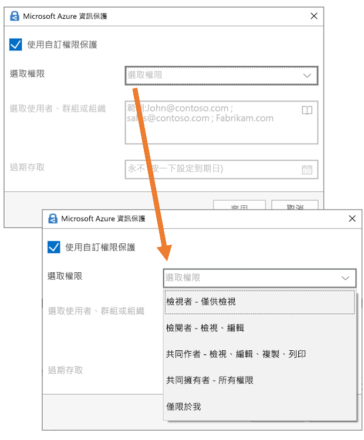

# 使用敏感度標籤來套用加密以限制存取內容Restrict access to content by using sensitivity labels to apply encryption

>*[Microsoft 365 安全性與合規性的授權指引](https://aka.ms/ComplianceSD)。**[Microsoft 365 licensing guidance for security & compliance](https://aka.ms/ComplianceSD).*

當建立敏感度標籤時，您可以限制標籤將套用至其中之內容的存取。例如，使用敏感度標籤的加密設定，您可以保護內容，以便：When you create a sensitivity label, you can restrict access to content that the label will be applied to. For example, with the encryption settings for a sensitivity label, you can protect content so that:

- 僅您組織內的使用者才能開啟機密文件或電子郵件。Only users within your organization can open a confidential document or email.
- 僅行銷部門中的使用者才能編輯和列印促銷公告文件或電子郵件，而您組織中的所有其他使用者則只能讀取它。Only users in the marketing department can edit and print the promotion announcement document or email, while all other users in your organization can only read it.
- 使用者無法轉寄電子郵件，或從中複製包含內部組織相關消息的資訊。Users cannot forward an email or copy information from it that contains news about an internal reorganization.
- 在指定日期之後，無法開啟傳送給商業夥伴的目前價格清單。The current price list that is sent to business partners cannot be opened after a specified date.

加密文件或電子郵件時，內容的存取會受到限制，以便：When a document or email is encrypted, access to the content is restricted, so that it:

- 只有標籤加密設定授權的使用者才能將其解密。Can be decrypted only by users authorized by the label's encryption settings.
- 即使檔案重新命名，無論其位於您組織內部或外部，仍會保持加密狀態。Remains encrypted no matter where it resides, inside or outside your organization, even if the file's renamed.
- 同時進行靜態加密 (例如，在 OneDrive 帳戶中) 及傳輸中加密 (例如，周遊網際網路的電子郵件)。Is encrypted both at rest (for example, in a OneDrive account) and in transit (for example, email as it traverses the internet).

最後，身為系統管理員的您，在設定一個敏感度標籤來套用加密時，可以選擇以下兩者之一：Finally, as an admin, when you configure a sensitivity label to apply encryption, you can choose either to:

- **立即指派權限**，這樣您就能確實決定哪個使用者能夠存取該標籤的內容。**Assign permissions now**, so that you determine exactly which users get which permissions to content with that label.
- **Let users assign permissions** when they apply the label to content. This way, you can allow people in your organization some flexibility that they might need to collaborate and get their work done.**Let users assign permissions** when they apply the label to content. This way, you can allow people in your organization some flexibility that they might need to collaborate and get their work done.

當您在 Microsoft 365 合規性中心、Microsoft 365 安全性中心或是安全性與合規性中心中[建立敏感性標籤](create-sensitivity-labels.md)時，可以使用加密設定。The encryption settings are available when you [create a sensitivity label](create-sensitivity-labels.md) in the Microsoft 365 compliance center, Microsoft 365 security center, or the Security & Compliance Center.

## 了解加密的運作方式Understand how the encryption works

Encryption uses the Azure Rights Management service (Azure RMS) from Azure Information Protection. This protection solution uses encryption, identity, and authorization policies. To learn more, see [What is Azure Rights Management?](https://docs.microsoft.com/azure/information-protection/what-is-azure-rms) from the Azure Information Protection documentation.Encryption uses the Azure Rights Management service (Azure RMS) from Azure Information Protection. This protection solution uses encryption, identity, and authorization policies. To learn more, see [What is Azure Rights Management?](https://docs.microsoft.com/azure/information-protection/what-is-azure-rms) from the Azure Information Protection documentation. 

When you use this encryption solution, the **super user** feature ensures that authorized people and services can always read and inspect the data that has been encrypted for your organization. If necessary, the encryption can then be removed or changed. For more information, see [Configuring super users for Azure Information Protection and discovery services or data recovery](https://docs.microsoft.com/azure/information-protection/configure-super-users).When you use this encryption solution, the **super user** feature ensures that authorized people and services can always read and inspect the data that has been encrypted for your organization. If necessary, the encryption can then be removed or changed. For more information, see [Configuring super users for Azure Information Protection and discovery services or data recovery](https://docs.microsoft.com/azure/information-protection/configure-super-users).

## 如何設定用於加密的標籤How to configure a label for encryption

1. 遵循一般指示以[建立或編輯敏感度標籤](create-sensitivity-labels.md#create-and-configure-sensitivity-labels)標籤，並確認已針對標籤的範圍選取 [檔案和電子郵件 **]**：Follow the general instructions to [create or edit a sensitivity label](create-sensitivity-labels.md#create-and-configure-sensitivity-labels) and make sure **Files & emails** is selected for the label's scope: 
    
    

2. 然後，在 [選擇檔案和電子郵件的保護設定 **]** 頁面上，確認您已選取 [加密檔案和電子郵件 **]**Then, on the **Choose protection settings for files and emails** page, make sure you select **Encrypt files and emails**
    
    

4.  在精靈的 [加密 **]** 頁面上，選取下列其中一個選項：On the **Encryption** page of the wizard, select one of the following options:
    
    - **如果檔案已加密，則移除加密**：如需有關此案例的詳細資訊，請參閱[套用標籤時，現有的加密會發生什麼情況](#what-happens-to-existing-encryption-when-a-labels-applied)小節。**Remove encryption if the file is encrypted**: For more information about this scenario, see the [What happens to existing encryption when a label's applied](#what-happens-to-existing-encryption-when-a-labels-applied) section. 請注意，此設定可能會導致使用者沒有足夠權限時無法套用的敏感度標籤。It's important to understand that this setting can result in a sensitivity label that users might not be able to apply when they don't have sufficient permissions.
    
    - **設定加密設定**：開啟加密功能，並顯示加密設定：**Configure encryption settings**: Turns on encryption and makes the encryption settings visible:
        
        
        
        在下列[設定加密設定](#configure-encryption-settings)一節中可以取得這些設定的指示。Instructions for these settings are in the following [Configure encryption settings](#configure-encryption-settings) section.

### 套用標籤時，現有的加密會發生什麼情況What happens to existing encryption when a label's applied

如果您將敏感度標籤套用到未加密的內容，您可以選取的加密選項結果會一目了然。If a sensitivity label is applied to unencrypted content, the outcome of the encryption options you can select is self-explanatory. 例如，如果您未選取 [加密檔案和電子郵件 **]**，則內容會保持未加密。For example, if you didn't select **Encrypt files and emails**, the content remains unencrypted.

不過，內容可能已加密。However, the content might be already encrypted. 例如，其他使用者可能已套用：For example, another user might have applied:

- 其自己的權限，其中包括標籤提示時的使用者定義權限、Azure 資訊保護用戶端的自訂權限，以及來自 Office 應用程式內的**限制存取**文件保護。Their own permissions, which include user-defined permissions when prompted by a label, custom permissions by the Azure Information Protection client, and the **Restricted Access** document protection from within an Office app.
- Azure 版權管理保護範本可獨立於標籤將內容加密。An Azure Rights Management protection template that encrypts the content independently from a label. 此類別包括使用版權保護來套用加密的郵件流程規則。This category includes mail flow rules that apply encryption by using rights protection.
- 以系統管理員指派的權限套用加密的標籤。A label that applies encryption with permissions assigned by the administrator.

下表說明對該內容套用敏感度標籤時，現有的加密會發生的情況：The following table identifies what happens to existing encryption when a sensitivity label is applied to that content:

| |**加密：未選取****Encryption: Not selected**|**加密：已設定****Encryption: Configured**|**加密：移除****Encryption: Remove**|
|:-----|:-----|:-----|:-----|
|**使用者指定的權限****Permissions specified by a user**|原始加密已保留Original encryption is preserved|新標籤加密已套用New label encryption is applied|原始加密已移除Original encryption is removed|
|**保護範本****Protection template**|原始加密已保留Original encryption is preserved|新標籤加密已套用New label encryption is applied|原始加密已移除Original encryption is removed|
|**具有系統管理員定義權限的標籤****Label with administator-defined permissions**|原始加密已移除Original encryption is removed|新標籤加密已套用New label encryption is applied|原始加密已移除Original encryption is removed|

請注意，在套用新標籤加密或移除原始加密的情況下，只有在套用標籤的使用者有支援此動作的使用權利或角色時，才會發生這種情況：Note that in the cases where the new label encryption is applied or the original encryption is removed, this happens only if the user applying the label has a usage right or role that supports this action:

- [使用權限](https://docs.microsoft.com/azure/information-protection/configure-usage-rights#usage-rights-and-descriptions)匯出或完全控制。The [usage right](https://docs.microsoft.com/azure/information-protection/configure-usage-rights#usage-rights-and-descriptions) Export or Full Control.
- [版權管理簽發者或版權管理擁有者](https://docs.microsoft.com/azure/information-protection/configure-usage-rights#rights-management-issuer-and-rights-management-owner)的角色，或[超級使用者](https://docs.microsoft.com/azure/information-protection/configure-super-users)。The role of [Rights Management issuer or Rights Management owner](https://docs.microsoft.com/azure/information-protection/configure-usage-rights#rights-management-issuer-and-rights-management-owner), or [super user](https://docs.microsoft.com/azure/information-protection/configure-super-users).

如果使用者沒有這些權限或角色中的一個，就無法套用標籤，因此會保留原始加密。If the user doesn't have one of these rights or roles, the label can't be applied and so the original encryption is preserved. 使用者會看到下列訊息：**您沒有對敏感度標籤進行變更所需的權限。請連絡內容的擁有者。**The user sees the following message: **You don't have permission to make this change to the sensitivity label. Please contact the content owner.**

例如，對電子郵件訊息套用 [不可轉寄] 的人員，可以將該對話重新標記，以取代加密或移除它，因為他們是該電子郵件的版權管理擁有者。For example, the person who applies Do Not Forward to an email message can relabel the thread to replace the encryption or remove it, because they are the Rights Management owner for the email. 但除了超級使用者之外，此電子郵件的收件者無法重新標記它，因為他們沒有所需的使用權限。But with the exception of super users, recipients of this email can't relabel it because they don't have the required usage rights.

#### 已加密電子郵件的電子郵件附件Email attachments for encrypted email messages

當電子郵件以任何方法加密時，任何附加至電子郵件的未加密 Office 文件都會自動繼承相同的加密設定。When an email message is encrypted by any method, any unencrypted Office documents that are attached to the email automatically inherit the same encryption settings.

已加密然後新增為附件的文件，一律會保留其原始加密。Documents that are already encrypted and then added as attachments always preserve their original encryption.

## 設定加密設定Configure encryption settings

當您在精靈 [加密 **]** 頁面上選取 [設定加密設定 **]**，以建立或編輯敏感度標籤，請選擇下列其中一個選項：When you select **Configure encryption settings** on the **Encryption** page of the wizard to create or edit a sensitivity label, choose one of the following options:

- **立即指派權限**，這樣您就能決定哪些使用者確切能取得已套用標籤內容的權限。**Assign permissions now**, so that you can determine exactly which users get which permissions to content that has the label applied. 如需詳細資訊，請參閱下一節的[立即指派權限](#assign-permissions-now)。For more information, see the next section [Assign permissions now](#assign-permissions-now).
- 當使用者將標籤套用到內容時，**讓使用者指派權限**。**Let users assign permissions** when your users apply the label to content. 利用此選項，您就可以讓組織中的人員靈活地共同作業並完成工作。With this option, you can allow people in your organization some flexibility that they might need to collaborate and get their work done. 如需詳細資訊，請本頁的[讓使用者指派權限](#let-users-assign-permissions)章節。For more information, see the [Let users assign permissions](#let-users-assign-permissions) section on this page.

例如，如果您有一個名為 [高度機密] \*\*\*\* 的敏感度標籤，該標籤將套用至最敏感的內容，則您可能會希望立即決定誰能取得該內容的何種權限。For example, if you have a sensitivity label named **Highly Confidential** that will be applied to your most sensitive content, you might want to decide now who gets what type of permissions to that content.

或者，如果您有一個名為 [商業合約]\*\*\*\* 的敏感度標籤，並且貴組織的工作流程要求人員隨機與不同人員共同處理此內容，則您可能會希望讓使用者在指派標籤時決定可存取的人員。Alternatively, if you have a sensitivity label named **Business Contracts**, and your organization's workflow requires that your people collaborate on this content with different people on an ad hoc basis, you might want to allow your users to decide who gets permissions when they assign the label. 這種靈活性既可以幫助您提高使用者的工作效率，又可以減少管理員更新或建立新敏感度標籤以滿足特定案例的要求。This flexibility both helps your users' productivity and reduces the requests for your admins to update or create new sensitivity labels to address specific scenarios.

選擇 [立即指派權限] 或 [讓使用者指派權限]：Choosing whether to assign permissions now or let users assign permissions:

## 立即指派權限Assign permissions now

使用下列選項來控制誰可以存取套用此標籤的電子郵件或文件。Use the following options to control who can access email or documents to which this label is applied. 您可以：You can:

- 在特定日期，或是在套用標籤之後的特定天數之後**允許具有標籤的內容的存取權到期**。在此時間後，使用者將無法開啟具有標籤的項目。如果指定日期，則會在目前時區中，該日期的午夜開始生效。(請注意，某些電子郵件用戶端可能因為其快取機制而無法強制執行到期，而顯示超過期限的電子郵件。)**Allow access to labeled content to expire**, either on a specific date or after a specific number of days after the label is applied. After this time, users won't be able to open the labeled item. If you specify a date, it is effective midnight on that date in your current time zone. (Note that some email clients might not enforce expiration and show emails past their expiration date, due to their caching mechanisms.)

- 在套用標籤之後**允許離線存取**可為從不、一律或特定天數。如果您將離線存取限制為從不或天數，則達到該閾值時，必須重新驗證使用者，並記錄其存取。如需詳細資訊，請參閱關於 Rights Management 使用授權的下一節。**Allow offline access** never, always, or for a specific number of days after the label is applied. If you restrict offline access to never or a number of days, when that threshold is reached, users must be reauthenticated and their access is logged. For more information, see the next section on the Rights Management use license.

已加密內容的存取控制設定：Settings for access control for encrypted content:

### 用於離線存取的 Rights Management 使用授權Rights Management use license for offline access

當使用者開啟以來自 Azure Rights Management 服務的加密保護的文件或電子郵件時，Azure Rights Management 會將該內容的使用授權授與給該使用者。When a user opens a document or email that's been protected by encryption from the Azure Rights Management service, an Azure Rights Management use license for that content is granted to the user. 使用授權是一項憑證，其中包含使用者對於文件或電子郵件使用權限，以及用來加密內容的加密金鑰。This use license is a certificate that contains the user's usage rights for the document or email, and the encryption key that was used to encrypt the content. 如果已設定，則使用授權也會包含到期日，以及該使用授權的有效期。The use license also contains an expiration date if this has been set, and how long the use license is valid.

如果未設定到期日，則租用戶的預設使用授權有效期間為 30 天。在這段期間，不會針對內容重新驗證或重新授權使用者。這個程序可讓使用者在沒有網際網路連線的情況下繼續開啟受保護文件或電子郵件。使用授權有效期間到期時，下次使用者存取受保護文件或電子郵件時，則必須重新驗證和重新授權使用者。If no expiration date has been set, the default use license validity period for a tenant is 30 days. For the duration of the use license, the user is not reauthenticated or reauthorized for the content. This process lets the user continue to open the protected document or email without an internet connection. When the use license validity period expires, the next time the user accesses the protected document or email, the user must be reauthenticated and reauthorized.

除了重新驗證外，還會重新評估原則和使用者群組成員資格。In addition to reauthentication, the encryption settings and user group membership is reevaluated. 這表示，如果上次使用者存取內容後，加密設定或群組成員資格發生變更，則這些使用者可能遇到相同的文件或電子郵件，卻有不同的存取結果。This means that users could experience different access results for the same document or email if there are changes in the encryption settings or group membership from when they last accessed the content.

若要了解如何變更預設的 30 天設定，請參閱 [Rights Management 使用授權](https://docs.microsoft.com/azure/information-protection/configure-usage-rights#rights-management-use-license)。To learn how to change the default 30-day setting, see [Rights Management use license](https://docs.microsoft.com/azure/information-protection/configure-usage-rights#rights-management-use-license).

### 將權限指派給特定使用者或群組Assign permissions to specific users or groups

您可以將權限授與特定人員，以便只有他們可與標籤內容互動：You can grant permissions to specific people so that only they can interact with the labeled content:

1. 首先，新增將獲指派標籤內容之權限的使用者或群組。First, add users or groups that will be assigned permissions to the labeled content.

2. 接著，選擇那些使用者應對標籤內容具有的權限。Then, choose which permissions those users should have for the labeled content.

指派權限：Assigning permissions:

#### 新增使用者或群組Add users or groups

指派權限時，您可以選擇：When you assign permissions, you can choose:

- 組織中的所有人 (所有租用戶成員)。此設定會排除來賓帳戶。Everyone in your organization (all tenant members). This setting excludes guest accounts.

- 任何已驗證的使用者。Any authenticated users. 選取此選項之前，請先確認您了解此設定的[需求與限制](#requirements-and-limitations-for-add-any-authenticated-users)。Make sure you understand the [requirements and limitations](#requirements-and-limitations-for-add-any-authenticated-users) of this setting before selecting it.

- Azure AD 中特定使用者或啟用電子郵件功能的安全性群組、通訊群組或 Microsoft 365 群組 ([先前的 Office 365 群組](https://techcommunity.microsoft.com/t5/microsoft-365-blog/office-365-groups-will-become-microsoft-365-groups/ba-p/1303601)) (英文)。Any specific user or email-enabled security group, distribution group, or Microsoft 365 group ([formerly Office 365 group](https://techcommunity.microsoft.com/t5/microsoft-365-blog/office-365-groups-will-become-microsoft-365-groups/ba-p/1303601)) in Azure AD. Microsoft 365 群組可以有靜態或[動態的成員資格](https://docs.microsoft.com/azure/active-directory/users-groups-roles/groups-create-rule) (部分機器翻譯)。The Microsoft 365 group can have static or [dynamic membership](https://docs.microsoft.com/azure/active-directory/users-groups-roles/groups-create-rule). 請注意，您無法使用 [Exchange 的 動態通訊群組](https://docs.microsoft.com/Exchange/recipients/dynamic-distribution-groups/dynamic-distribution-groups) (部分機器翻譯)，因為此群組類型不會同步處理到 Azure AD，且您無法使用未啟用電子郵件功能的安全性群組。Note that you can't use a [dynamic distribution group from Exchange](https://docs.microsoft.com/Exchange/recipients/dynamic-distribution-groups/dynamic-distribution-groups) because this group type isn't synchronized to Azure AD, and you can't use a security group that isn't email-enabled.

- 任何電子郵件地址或網域。Any email address or domain. 使用此選項來指定另一個組織中使用 Azure AD 的所有使用者，方法是輸入來自該組織的任何網域名稱。Use this option to specify all users in another organization who uses Azure AD, by entering any domain name from that organization. 您也可以針對社交提供者使用此選項，方法是輸入其網域名稱，例如 **gmail.com**、**hotmail.com** 或 **outlook.com**。You can also use this option for social providers, by entering their domain name such as **gmail.com**, **hotmail.com**, or **outlook.com**.

    > [!NOTE]
    > 如果您指定的網域來自使用 Azure AD 的組織，則無法限制對該特定網域的存取。If you specify a domain from an organization that uses Azure AD, you can't restrict access to that specific domain. 相反地，系統會為擁有您指定網域名稱的租用戶自動包含 Azure AD 中的所有經驗證網域。Instead, all verified domains in Azure AD are automatically included for the tenant that owns the domain name you specify.

當您選擇組織中的所有使用者和群組，或流覽目錄時，使用者或群組必須有電子郵件地址。When you choose all users and groups in your organization or browse the directory, the users or groups must have an email address.

最佳做法是使用群組，而非使用者。此策略可讓您保持更簡單的組態。As a best practice, use groups rather than users. This strategy keeps your configuration simpler.

##### 「新增任何已驗證使用者」的需求與限制Requirements and limitations for "Add any authenticated users"

此設定不會限制能夠存取標籤所加密內容的人員，同時仍會加密內容，並提供限制內容使用方式 (權限) 和存取方式 (到期和離線存取) 的選項。This setting doesn't restrict who can access the content that the label encrypts, while still encrypting the content and providing you with options to restrict how the content can be used (permissions), and accessed (expiry and offline access). 不過，開啟加密內容的應用程式必須能夠支援所使用的驗證。However, the application opening the encrypted content must be able to support the authentication being used. 因此，同盟社交提供者 (例如 Google) 和一次性密碼驗證僅對電子郵件有效，且僅在您使用 Exchange Online 時才有效。For this reason, federated social providers such as Google, and onetime passcode authentication work for email only, and only when you use Exchange Online. 您可以將 Microsoft 帳戶與 Office 365 應用程式和 [Azure 資訊保護檢視器](https://portal.azurerms.com/#/download)搭配使用。Microsoft accounts can be used with Office 365 apps and the [Azure Information Protection viewer](https://portal.azurerms.com/#/download).

任何已驗證使用者設定的某些典型案例如下:Some typical scenarios for any authenticated users setting:

- 您不在意檢視內容的是誰，但想要限制其使用方式。You don't mind who views the content, but you want to restrict how it is used. 例如，您不希望編輯、複製或列印內容。For example, you don't want the content to be edited, copied, or printed.
- 您不需要限制存取內容的是誰，但想要能夠確認誰開啟了該內容。You don't need to restrict who accesses the content, but you want to be able to confirm who opens it.
- 您必須將靜態內容和在傳輸中的內容加密，但不要求存取控制。You have a requirement that the content must be encrypted at rest and in transit, but it doesn't require access controls.

#### 選擇權限Choose permissions

當您選擇要對那些使用者或群組允許的權限時，您可以選取下列任一項：When you choose which permissions to allow for those users or groups, you can select either:

- [預先定義的權限層級](https://docs.microsoft.com/azure/information-protection/configure-usage-rights#rights-included-in-permissions-levels)，其中有一組預設的權限，例如共同作者或檢閱者。A [predefined permissions level](https://docs.microsoft.com/azure/information-protection/configure-usage-rights#rights-included-in-permissions-levels) with a preset group of rights, such as Co-Author or Reviewer.
- 自訂權限，您可在此選擇一或多個使用權限。Custom permissions, where you choose one or more usage rights.

如需可協助您選取適當權限的詳細資訊，請參閱[使用權限和描述](https://docs.microsoft.com/azure/information-protection/configure-usage-rights#usage-rights-and-descriptions)。For more information to help you select the appropriate permissions, see [Usage rights and descriptions](https://docs.microsoft.com/azure/information-protection/configure-usage-rights#usage-rights-and-descriptions).  

請注意，相同標籤可將不同的權限授與不同的使用者。例如，單一標籤可將某些使用者指派為檢閱者，並將不同的使用者指派為共同作者，如以下螢幕擷取畫面所示。Note that the same label can grant different permissions to different users. For example, a single label can assign some users as Reviewer and a different user as Co-author, as shown in the following screenshot.

若要這麼做，請新增使用者或群組、將權限指派給他們，並儲存這些設定。然後，重複這些步驟、新增使用者並將權限指派給他們，每次完成後儲存設定。您可以視需要經常重複此設定，為不同的使用者定義不同的權限。To do this, add users or groups, assign them permissions, and save those settings. Then repeat these steps, adding users and assigning them permissions, saving the settings each time. You can repeat this configuration as often as necessary, to define different permissions for different users.

#### Rights Management 簽發者 (套用敏感度標籤的使用者) 一律具有完全控制權Rights Management issuer (user applying the sensitivity label) always has Full Control

敏感度標籤的加密使用來自 Azure 資訊保護的 Azure 版權管理服務。Encryption for a sensitivity label uses the Azure Rights Management service from Azure Information Protection. 當使用者套用敏感度標籤以使用加密保護文件或電子郵件時，該使用者就會變成該內容的版權管理簽發者。When a user applies a sensitivity label to protect a document or email by using encryption, that user becomes the Rights Management issuer for that content.

版權管理簽發者一律會被授與文件或電子郵件的完全控制權限，此外：The Rights Management issuer is always granted Full Control permissions for the document or email, and in addition:

- 如果加密設定包括到期日，則版權管理簽發者仍然可在該日期之後開啟和編輯文件或電子郵件。If the encryption settings include an expiration date, the Rights Management issuer can still open and edit the document or email after that date.
- Rights Management 簽發者一律可以離線存取文件或電子郵件。The Rights Management issuer can always access the document or email offline.
- Rights Management 簽發者仍可以開啟撤銷後的文件。The Rights Management issuer can still open a document after it is revoked.

如需詳細資訊，請參閱 [Rights Management 簽發者和 Rights Management 擁有者](https://docs.microsoft.com/azure/information-protection/configure-usage-rights#rights-management-issuer-and-rights-management-owner)。For more information, see [Rights Management issuer and Rights Management owner](https://docs.microsoft.com/azure/information-protection/configure-usage-rights#rights-management-issuer-and-rights-management-owner).

### 雙重金鑰加密Double Key Encryption

> [!NOTE]
> 目前僅 Microsoft Azure 資訊保護的整合標籤用戶端支援此功能。This feature is currently supported only by the Azure Information Protection unified labeling client.

只有在您設定 [雙重金鑰加密] 服務之後，且需要針對將套用此標籤的檔案使用此雙重金鑰加密時，再選取這個選項。Select this option only after you have configured the Double Key Encryption service and you need to use this double key encryption for files that will have this label applied.

如需詳細資訊、先決條件及設定指示，請參閱[雙金鑰加密 (DKE)](double-key-encryption.md)。For more information, prerequisites, and configuration instructions, see [Double Key Encryption (DKE)](double-key-encryption.md).

## 讓使用者指派權限Let users assign permissions

您可以使用這些選項讓使用者在手動將敏感度標籤套用至內容時指派權限：You can use these options to let users assign permissions when they manually apply a sensitivity label to content:

- 在 Outlook 中，使用者可以針對所選的收件者選取等同於[不可轉寄](https://docs.microsoft.com/azure/information-protection/configure-usage-rights#do-not-forward-option-for-emails)選項的限制。In Outlook, a user can select restrictions equivalent to the [Do Not Forward](https://docs.microsoft.com/azure/information-protection/configure-usage-rights#do-not-forward-option-for-emails) option for their chosen recipients.

- 在 Word、PowerPoint 和 Excel 中，系統會提示使用者為特定使用者、群組或組織選取其自己的權限。In Word, PowerPoint, and Excel, a user is prompted to select their own permissions for specific users, groups, or organizations.

    > [!NOTE]
    > 適用於 Word、PowerPoint 和 Excel 的此選項，是由 Azure 資訊保護整合標籤用戶端支援。This option for Word, PowerPoint, and Excel is supported by the Azure Information Protection unified labeling client. 如需使用內建標記的應用程式，請 [查看哪些應用程式提供支援](sensitivity-labels-office-apps.md#sensitivity-label-capabilities-in-word-excel-and-powerpoint)。For apps that use built-in labeling, [check which apps support it](sensitivity-labels-office-apps.md#sensitivity-label-capabilities-in-word-excel-and-powerpoint).
    >
    > 如果已選取此選項，但使用者的應用程式不支援此選項，表示該標籤未顯示給使用者，或為顯示一致的標籤，但無法在套用時為使用者提供說明訊息。If this option is selected but isn't supported for a user's app, either that label doesn't display to the user, or the label displays for consistency, but it can't be applied with an explanation message to users.

支援這些選項時，請使用下表來識別使用者何時可看到敏感度標籤：When the options are supported, use the following table to identify when users see the sensitivity label:

|設定Setting |標籤在 Outlook 中顯示Label visible in Outlook|標籤在 Word、Excel、PowerPoint 中顯示Label visible in Word, Excel, PowerPoint|
|:-----|:-----|:-----|:-----|
|**在 Outlook 中，強制執行限制等同於 [不可轉寄] 選項****In Outlook, enforce restrictions equivalent to the Do Not Forward option**|是Yes |否No |
|**在 Word、PowerPoint 與 Excel 中提示使用者指定權限****In Word, PowerPoint, and Excel, prompt users to specify permissions**|否No |是Yes|

同時選取這兩個設定時，標籤會因此同時在 Outlook 和 Word、Excel 和 PowerPoint 中顯示。When both settings are selected, the label is therefore visible in both Outlook and in Word, Excel, and PowerPoint.

可讓使用者指派權限的敏感度標籤只能透過使用者手動來套用至內容；它不能自動套用，也不能作為推薦標籤。A sensitivity label that lets users assign permissions can be applied to content only manually by users; it can't be auto-applied or used as a recommended label.

設定使用者指派的權限：Configuring the user-assigned permissions:

### Outlook 限制Outlook restrictions

在 Outlook 中，當使用者套用的敏感標籤可允許他們指派郵件的權限時，限制與 [不可轉寄] 選項相同。In Outlook, when a user applies a sensitivity label that lets them assign permissions to a message, the restrictions are the same as the Do Not Forward option. 使用者會在郵件頂端看到標籤名稱和描述，指出內容已受到保護。The user will see the label name and description at the top of the message, which indicates the content's being protected. 與 Word、PowerPoint 和 Excel 不同的是 (請參閱[下一節](#word-powerpoint-and-excel-permissions))，使用者不會收到選取特定權限的提示。Unlike Word, PowerPoint, and Excel (see the [next section](#word-powerpoint-and-excel-permissions)), users aren't prompted to select specific permissions.

將 [不可轉寄] 選項套用到電子郵件時，電子郵件會加密而且收件者必須經過驗證。When the Do Not Forward option is applied to an email, the email is encrypted and recipients must be authenticated. 收件者無法轉寄、列印或複製該電子郵件。Then, the recipients cannot forward it, print it, or copy from it. 例如，在 Outlook 用戶端中，無法使用 [轉寄] 按鈕、[另存新檔] 和 [列印] 功能表選項，且您無法在 [收件人]、[副本] 或 [密件副本] 方塊中新增或變更收件者。For example, in the Outlook client, the Forward button is not available, the Save As and Print menu options are not available, and you cannot add or change recipients in the To, Cc, or Bcc boxes.

附加到電子郵件的未加密 Office 文件會自動繼承相同的限制。Unencrypted Office documents that are attached to the email automatically inherit the same restrictions. 套用至這些文件的使用權限是 [編輯內容]、[編輯]；[儲存]；[檢視]、[開啟]、[讀取]；和 [允許巨集]。The usage rights applied to these documents are Edit Content, Edit; Save; View, Open, Read; and Allow Macros. 如果使用者想要不同的附件使用權限，或者附件不是支援此繼承保護的 Office 文件，則使用者需要在將文件附加到電子郵件之前保護該檔案。If the user wants different usage rights for an attachment, or the attachment is not an Office document that supports this inherited protection, the user needs to protect the file before attaching it to the email.

### Word、PowerPoint 和 Excel 權限Word, PowerPoint, and Excel permissions

在 Word、PowerPoint 和 Excel 中，當使用者套用可讓他們對文件指派權限的敏感度標籤時，系統會提示他們指定套用加密時的所選使用者和權限。In Word, PowerPoint, and Excel, when a user applies a sensitivity label that lets them assign permissions to a document, they are prompted to specify their choice of users and permissions when the encryption is applied.

例如，利用 Azure 資訊保護整合標籤用戶端，使用者可以：For example, with the Azure Information Protection unified labeling client, users can:

- 選取權限等級，例如檢視者 (指派 [僅檢視] 權限) 或共同作者 (指派 [檢視]、[編輯]、[複製] 和 [列印] 權限)。Select a permission level, such as Viewer (which assigns View Only permission) or Co-Author (which assigns View, Edit, Copy, and Print permissions).
- 選取使用者、群組或組織。Select users, groups, or organizations. 這可能包括組織內部或外部的人員。This can include people both inside or outside your organizations.
- 設定到期日，到期之後所選使用者就無法存取內容。Set an expiration date, after which the selected users cannot access the content. 如需詳細資訊, 請參閱前一節的[用於離線存取的 Rights Management 使用授權](#rights-management-use-license-for-offline-access)。For more information, see the above section [Rights Management use license for offline access](#rights-management-use-license-for-offline-access).

針對內建標籤，使用者會在選取下列項目時看到相同的對話方塊：For built-in labeling, users see the same dialog box if they select the following:

- Windows：[檔案]\*\*\*\* 索引標籤 > [資訊]\*\*\*\*  >  [保護文件]\*\*\*\*  >  [限制存取]\*\*\*\*  >  [限制存取]\*\*\*\*Windows: **File** tab > **Info** > **Protect Document** > **Restrict Access** > **Restricted Access**

- MacOS：[校閱]\*\*\*\* 索引標籤 > [保護]\*\*\*\*  >  [權限]\*\*\*\*  >  [限制存取]\*\*\*\*MacOS: **Review** tab > **Protection** > **Permissions** > **Restricted Access**

## 加密設定的範例組態Example configurations for the encryption settings

針對後續的各個範例，在選取 [設定加密設定 **]** 時，請從精靈的 [加密 **]** 頁面執行組態：For each example that follows, do the configuration from the **Encryption** page of the wizard when **Configure encryption settings** is selected:

### 範例 1：套用 [不可轉寄] 標籤，以傳送加密的電子郵件傳送至 Gmail 帳戶Example 1: Label that applies Do Not Forward to send an encrypted email to a Gmail account

此標籤只會在 Outlook 和 Outlook 網頁版中顯示，因此您必須使用 Exchange Online。This label displays only in Outlook and Outlook on the web, and you must use Exchange Online. 當使用者需要傳送加密的電子郵件給使用 Gmail 帳戶 (或您組織外部的任何其他電子郵件帳戶)的人員時，指示使用者選取此標籤。Instruct users to select this label when they need to send an encrypted email to people using a Gmail account (or any other email account outside your organization).

您的使用者在 **[收件者]** 方塊中輸入 Gmail 電子郵件地址。Your users type the Gmail email address in the **To** box.  然後選取標籤，而 [不可轉寄] 選項會自動新增至電子郵件中。Then, they select the label and the Do Not Forward option is automatically added to the email. 結果會是收件者無法轉寄電子郵件、列印它、複製其內容，或使用 **[另存新檔]** 選項將電子郵件儲存在信箱外部。The result is that recipients cannot forward the email, or print it, copy from it, or save the email outside their mailbox by using the **Save As** option.

1. 在 **[加密]** 頁面上：針對 **[立即指派權限，或讓使用者決定?]**，選取 **[當使用者套用標籤時，讓他們指派權限]**。On the **Encryption** page: For **Assign permissions now or let users decide?** select **Let users assign permissions when they apply the label**.

2. 選取核取方塊：**[在 Outlook 中，強制限制等於 [不可轉寄] 選項]**。Select the checkbox: **In Outlook, enforce restrictions equivalent to the Do Not Forward option**.

3. 如果已選取，請清除此核取方塊：**[在 Word、PowerPoint 與 Excel 中提示使用者指定權限]**。If selected, clear the checkbox: **In Word, PowerPoint, and Excel, prompt users to specify permissions**.

4. 選取 **[下一步]** 並完成精靈。Select **Next** and complete the wizard.

### 範例 2：會對其他組織中的所有使用者限制唯讀權限的標籤Example 2: Label that restricts read-only permission to all users in another organization

此標籤適用於以唯讀方式共用的非常敏感文件，以及一律需要網際網路連線才能檢視的文件。This label is suitable for sharing very sensitive documents as read-only, and the documents always require an internet connection to view them.

此標籤不適合用於電子郵件。This label is not suitable for emails.

1. 在 **[加密]** 頁面上：針對 **[立即指派權限，或讓使用者決定?]**，選取 **[立即指派權限]**。On the **Encryption** page: For **Assign permissions now or let users decide?** select **Assign permissions now**.

2. 針對 **[允許離線存取]**，選取 **[從不]**。For **Allow offline access**, select **Never**.

3. 選取 [指派權限]\*\*\*\*。Select **Assign permissions**.

4. 在 **[指派權限]** 窗格中，選取 **[新增特定電子郵件地址或網域]**。On the **Assign permissions** pane, select **Add specific email addresses or domains**.

5. 在文字方塊中，輸入來自另一個組織的網域名稱，例如，**fabrikam.com**。In the text box, enter the name of a domain from the other organization, for example, **fabrikam.com**. 然後選取 **[新增]**。Then select **Add**.

6. 選取 **[選擇許可權]**。Select **Choose permissions**.

7. 在 **[選擇權限]** 窗格中，選取下拉式方塊，選取 **[檢視器]**，然後選取 **[儲存]**。On the **Choose permissions** pane, select the dropdown box, select **Viewer**, and then select **Save**.

8. 回到 **[指派權限]** 窗格，選取 **[儲存]**。Back on the **Assign Permissions** pane, select **Save**.

9. 在 **[加密]** 頁面上，選取 **[下一步]** 並完成精靈。On the **Encryption** page, select **Next** and complete the wizard.

### 範例 3：將外部使用者新增至可加密內容的現有標籤Example 3: Add external users to an existing label that encrypts content

您新增的新使用者將能夠開啟已使用此標籤保護的文件和電子郵件。The new users that you add will be able open documents and emails that have already been protected with this label. 您授與這些使用者的權限可以與現有使用者所擁有的權限不同。The permissions that you grant these users can be different from the permissions that the existing users have.

1. 在 [加密]\*\*\*\* 頁面上：針對 [立即指派權限，或讓使用者決定?]\*\*\*\*，確定已選取 [立即指派權限]\*\*\*\*。On the **Encryption** page: For **Assign permissions now or let users decide?** make sure **Assign permissions now** is selected.

2. 選取 [指派權限]\*\*\*\*。Select **Assign permissions**.

3. 在 **[指派權限]** 窗格中，選取 **[新增特定電子郵件地址或網域]**。On the **Assign permissions** pane, select **Add specific email addresses or domains**.

4. 在文字方塊中，輸入要新增的第一個使用者 (或群組) 的電子郵件地址，然後選取 **[新增]**。In the text box, enter the email address of the first user (or group) to add, and then select **Add**.

5. 選取 **[選擇許可權]**。Select **Choose permissions**.

6. 在 **[選擇權限]** 窗格中，選取此使用者 (或群組) 的權限，然後選取 **[儲存]**。On the **Choose permissions** pane, select the permissions for this user (or group), and then select **Save**.

7. 回到 **[指派權限]** 窗格，針對您要新增至此標籤的每個使用者 (或群組) 重複步驟 3 到 6。Back on the **Assign Permissions** pane, repeat steps 3 through 6 for each user (or group) that you want to add to this label. 然後按一下 [儲存]\*\*\*\*。Then click **Save**.

8. 在 **[加密]** 頁面上，選取 **[下一步]** 並完成精靈。On the **Encryption** page, select **Next** and complete the wizard.

### 範例 4：加密內容但不會限制能夠存取內容人員的標籤Example 4: Label that encrypts content but doesn't restrict who can access it

此組態的優點在於您不需要指定使用者、群組或網域來加密電子郵件或文件。This configuration has the advantage that you don't need to specify users, groups, or domains to encrypt an email or document. 內容仍會加密，您仍然可以指定使用權限、到期日期和離線存取。The content will still be encrypted and you can still specify usage rights, an expiry date, and offline access.

僅當您不需要限制能開啟受保護文件或電子郵件的人員時，才使用此組態。Use this configuration only when you do not need to restrict who can open the protected document or email. [此設定的詳細資訊More information about this setting](#requirements-and-limitations-for-add-any-authenticated-users)

1. 在 [加密]\*\*\*\* 頁面上：針對 [立即指派權限，或讓使用者決定?]\*\*\*\*，確定已選取 [立即指派權限]\*\*\*\*。On the **Encryption** page: For **Assign permissions now or let users decide?** make sure **Assign permissions now** is selected.

2. 視需要設定 **[使用者存取內容的期限]** 和 **[允許離線存取]** 設定。Configure settings for **User access to content expires** and **Allow offline access** as required.

3. 選取 [指派權限]\*\*\*\*。Select **Assign permissions**.

4. 在 **[指派權限]** 窗格中，選取 **[新增所有經過驗證的使用者]**。On the **Assign permissions** pane, select **Add any authenticated users**.

    針對 **[使用者和群組]**，您會看到 **[授權的使用者]** 已自動新增。For **Users and groups**, you see **Authenticated users** automatically added. 您無法變更此值，只能刪除它，這會取消 **[新增所有經過驗證的使用者]** 選取範圍。You can't change this value, only delete it, which cancels the **Add any authenticated users** selection.

5. 選取 **[選擇許可權]**。Select **Choose permissions**.

6. 在 **[選擇權限]** 窗格中，選取下拉式方塊，選取您要的權限，然後選取 **[儲存]**。On the **Choose permissions** pane, select the dropdown box, select the permissions you want, and then select **Save**.

7. 回到 **[指派權限]** 窗格，選取 **[儲存]**。Back on the **Assign Permissions** pane, select **Save**.

8. 在 **[加密]** 頁面上，選取 **[下一步]** 並完成精靈。On the **Encryption** page, select **Next** and complete the wizard.

## 加密內容的考量事項Considerations for encrypted content

加密您最機密的文件和電子郵件，可協助確保只有獲授權的人員可以存取此資料。Encrypting your most sensitive documents and emails helps to ensure that only authorized people can access this data. 不過，有一些事項需要納入考量：However, there are some considerations to take into account:

- 如果您的組織尚未[對 SharePoint 和 OneDrive 中的 Office 檔案啟用敏感度標籤](sensitivity-labels-sharepoint-onedrive-files.md)：If your organization hasn't [enabled sensitivity labels for Office files in SharePoint and OneDrive](sensitivity-labels-sharepoint-onedrive-files.md):

  - 搜尋、電子文件探索和 Delve 對加密的檔案將不適用。Search, eDiscovery, and Delve will not work for encrypted files.
  - DLP 原則對這些加密檔案的中繼資料 (包括保留標籤資訊) 有效，但對這些檔案的內容 (例如檔案中的信用卡號碼) 沒有效用。DLP policies work for the metadata of these encrypted files (including retention label information) but not the content of these files (such as credit card numbers within files).
  - 使用者無法使用 Office 網頁版開啟加密的檔案。Users can't open encrypted files using Office on the web. 啟用 SharePoint 和 OneDrive 中的 Office 檔案敏感度標籤時，使用者可以使用 Office 網頁版來開啟加密的檔案，但有一些[限制](sensitivity-labels-sharepoint-onedrive-files.md#limitations)，其中包括已使用內部部署金鑰 (稱為「保存您自己的金鑰」或 HYOK)、[雙重金鑰加密](#double-key-encryption)，以及已獨立於敏感度標籤套用的加密。When sensitivity labels for Office files in SharePoint and OneDrive are enabled, users can use Office on the web to open encrypted files, with some [limitations](sensitivity-labels-sharepoint-onedrive-files.md#limitations) that include encryption that has been applied with an on-premises key (known as "hold your own key", or HYOK), [double key encryption](#double-key-encryption), and encryption that has been applied independently from a sensitivity label.

- 若要讓多個使用者同時編輯加密的檔案，他們都必須使用 Office 網頁版。For multiple users to edit an encrypted file at the same time, they must all be using Office for the web. 如果未這麼做，而且檔案已經開啟：If this isn't the case, and the file is already open:

  - 在 Office 應用程式 (Windows、Mac、Android 和 iOS) 中，使用者會看到 [檔案使用中]\*\*\*\* 訊息，其中包含已簽出檔案的人員名稱。In Office apps (Windows, Mac, Android, and iOS), users see a **File In Use** message with the name of the person who has checked out the file. 然後，他們可以檢視唯讀複本，或儲存並編輯檔案的複本，並在檔案可用時收到通知。They can then view a read-only copy or save and edit a copy of the file, and receive notification when the file is available.
  - 在 Office 網頁版中，使用者會看到錯誤訊息，指出他們無法與其他人一起編輯該文件。In Office for the web, users see an error message that they can't edit the document with other people. 然後他們可以選取 [在閱讀檢視中開啟]\*\*\*\*。They can then select **Open in Reading View**.

- Office 應用程式 (Windows、Mac、Android 和 iOS) 中的[自動儲存](https://support.office.com/article/what-is-autosave-6d6bd723-ebfd-4e40-b5f6-ae6e8088f7a5)功能已對加密的檔案停用。The [AutoSave](https://support.office.com/article/what-is-autosave-6d6bd723-ebfd-4e40-b5f6-ae6e8088f7a5) functionality in Office apps (Windows, Mac, Android, and iOS) is disabled for encrypted files. 使用者會看到一則訊息，指出檔案具有必須移除的權限限制，之後才可以開啟「自動儲存」。Users see a message that the file has restricted permissions that must be removed before AutoSave can be turned on.

- 在 Office 應用程式 (Windows、Mac、Android 和 iOS) 中開啟加密的檔案可能需要較長的時間才能開啟。Encrypted files might take longer to open in Office apps (Windows, Mac, Android, and iOS).

- 用於已加密檔案的下列動作在 Office 應用程式 (Windows、Mac、Android 和 iOS) 中不受支援，因此使用者會看到錯誤訊息，指出發生錯誤。The following actions for encrypted files aren't supported from Office apps (Windows, Mac, Android, and iOS), and users see an error message that something went wrong. 不過，您可以使用 SharePoint 功能做為替代：However, SharePoint functionality can be used as an alternative:

  - 檢視、還原和儲存舊版的複本。View, restore, and save copies of previous versions. 或者，當您[為清單或文件庫啟用和設定版本設定](https://support.office.com/article/enable-and-configure-versioning-for-a-list-or-library-1555d642-23ee-446a-990a-bcab618c7a37)時，使用者可以使用 Office 網頁版執行這些動作。As an alternative, users can do these actions using Office on the web when you [enable and configure versioning for a list or library](https://support.office.com/article/enable-and-configure-versioning-for-a-list-or-library-1555d642-23ee-446a-990a-bcab618c7a37).
  - 變更檔案的名稱或位置。Change the name or location of files. 或者，使用者可以在 SharePoint 中[重新命名文件庫中的檔案、資料夾或連結](https://support.microsoft.com/office/rename-a-file-folder-or-link-in-a-document-library-bc493c1a-921f-4bc1-a7f6-985ce11bb185)。As an alternative, users can [rename a file, folder, or link in a document library](https://support.microsoft.com/office/rename-a-file-folder-or-link-in-a-document-library-bc493c1a-921f-4bc1-a7f6-985ce11bb185) in SharePoint.

若要獲得使用敏感度標籤加密之檔案的最佳共同作業體驗，建議您[為 SharePoint 和 OneDrive 中的 Office 檔案中使用敏感度標籤](sensitivity-labels-sharepoint-onedrive-files.md)和 Office 網頁版。For the best collaboration experience for files that are encrypted by a sensitivity label, we recommend you use [sensitivity labels for Office files in SharePoint and OneDrive](sensitivity-labels-sharepoint-onedrive-files.md) and Office for the web.

## 重要的先決條件Important prerequisites

在您可以使用加密之前，您可能需要執行一些組態工作。Before you can use encryption, you might need to do some configuration tasks.

- 啟用來自 Azure 資訊保護的保護Activate protection from Azure Information Protection
    
    若要讓敏感度標籤套用加密，必須為您的租用戶啟用來自 Azure 資訊保護的保護服務 (Azure 版權管理)。For sensitivity labels to apply encryption, the protection service (Azure Rights Management) from Azure Information Protection must be activated for your tenant. 在較新的租用戶中，這是預設設定，但您可能需要手動啟用該服務。In newer tenants, this is the default setting, but you might need to manually activate the service. 如需詳細資訊，請參閱[啟用來自 Azure 資訊保護的保護服務](https://docs.microsoft.com/azure/information-protection/activate-service)。For more information, see [Activating the protection service from Azure Information Protection](https://docs.microsoft.com/azure/information-protection/activate-service).

- 設定 Exchange 進行 Azure 資訊保護Configure Exchange for Azure Information Protection
    
    不需要先設定 Exchange 來使用 Azure 資訊保護，使用者就能在 Outlook 中套用標籤來加密電子郵件。Exchange does not have to be configured for Azure Information Protection before users can apply labels in Outlook to encrypt their emails. 不過，在設定 Exchange 使用 Azure 資訊保護之前，您無法獲得使用 Exchange 的 Azure 版權管理保護的完整功能。However, until Exchange is configured for Azure Information Protection, you do not get the full functionality of using Azure Rights Management protection with Exchange.
    
    例如，使用者無法在行動電話或 Outlook 網頁版上檢視加密的電子郵件，無法為加密的電子郵件編製索引供搜尋，而且您無法設定 Exchange Online DLP 使用版權管理保護。For example, users cannot view encrypted emails on mobile phones or with Outlook on the web, encrypted emails cannot be indexed for search, and you cannot configure Exchange Online DLP for Rights Management protection. 
    
    若要確保 Exchange 可以支援這些額外情節，請參閱下列內容：To ensure that Exchange can support these additional scenarios, see the following:
    
    - 針對 Exchange Online，請參閱 [Exchange Online：IRM 設定](https://docs.microsoft.com/azure/information-protection/configure-office365#exchangeonline-irm-configuration)的指示。For Exchange Online, see the instructions for [Exchange Online: IRM Configuration](https://docs.microsoft.com/azure/information-protection/configure-office365#exchangeonline-irm-configuration).
    - 針對 Exchange 內部部署，您必須部署 [RMS 連接器和設定您的 Exchange Server](https://docs.microsoft.com/azure/information-protection/deploy-rms-connector)。For Exchange on-premises, you must deploy the [RMS connector and configure your Exchange servers](https://docs.microsoft.com/azure/information-protection/deploy-rms-connector). 

