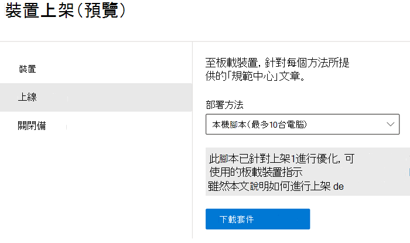
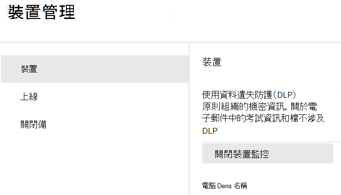

# 開始使用端點資料外洩防護 (預覽版)

Microsoft 端點資料外洩防護 (端點 DLP) 是 Microsoft 365 資料外洩防護 (DLP) 套件的一部分，您可以使用這些功能探索並保護整個 Microsoft 365 服務的敏感性項目。 如需所有 Microsoft DLP 供應項目的詳細資訊，請參閱[資料外洩防護概觀](data-loss-prevention-policies.md) (英文)。 若要深入了解端點 DLP，請參閱[了解有關端點資料外洩防護 (預覽版)](endpoint-dlp-learn-about.md) (英文)

Microsoft 端點 DLP 可讓您監視 Windows 10 裝置，並偵測敏感性項目使用和共用的時間。 這可提供您所需的可見度和控制，以確保它們得到正確的使用與保護，並協助防治可能導致威脅入侵的風險行為。

## 開始之前

### SKU/訂閱授權

開始使用端點 DLP 之前，您應先確認 [Microsoft 365 訂閱](https://www.microsoft.com/microsoft-365/compare-microsoft-365-enterprise-plans?rtc=1)以及任何附加元件。 若要存取和使用端點 DLP 的功能，您必須擁有下列其中一個訂閱或附加元件。

- Microsoft 365 E5
- Microsoft 365 A5 (教育版)
- Microsoft 365 E5 合規性
- Microsoft 365 A5 合規性
- Microsoft 365 E5 資訊保護和控管
- Microsoft 365 A5 資訊保護和控管

### 權限

若要啟用裝置管理，您使用的帳戶必須屬於下列任一角色的成員：

- 全域系統管理員
- 安全性系統管理員
- 合規性系統管理員

如果想要使用自訂帳戶來查看 [裝置管理] 設定，則必須具有下列其中一種角色：

- 全域系統管理員
- 合規性系統管理員
- 合規性資料系統管理員
- 全域讀取者

如果想要使用自訂帳戶來存取上線/離線頁面，則必須具有下列其中一種角色：

- 全域系統管理員
- 合規性系統管理員

如果想要使用自訂帳戶來開啟/關閉裝置監控，則必須具有下列其中一種角色：

- 全域系統管理員
- 合規性系統管理員

可在 [[活動總管]](data-classification-activity-explorer.md)中檢視來自端點 DLP 的資料。 有四個角色可以將權限授與活動總管，您用來存取資料的帳戶必須是其中任一的成員。

- 全域系統管理員
- 合規性系統管理員
- 安全性系統管理員
- 合規性資料系統管理員

### 準備您的端點

請確認您計畫部署端點 DLP 的 Windows 10 裝置符合這些需求。

1. 必須執行 Windows 10 組建 1809 或更新版本。
2. 所有裝置都必須[加入 Azure Active Directory (AAD)](https://docs.microsoft.com/azure/active-directory/devices/concept-azure-ad-join) 或加入混合式 Azure AD。
3. 在端點裝置上安裝 Microsoft Chromium Edge 瀏覽器，以強制執行上傳至雲端活動的原則動作。 請參閱[下載以 Chromium 為基礎的新 Microsoft Edge](https://support.microsoft.com/help/4501095/download-the-new-microsoft-edge-based-on-chromium)。

## 將裝置上線至裝置管理

 您必須先啟用裝置監控與上線端點，才能監視與防護裝置上的敏感性項目。 這兩個動作都是在 Microsoft 365 合規性入口網站中完成。

當您想要將尚未上線的的裝置進行上線時，您將會下載適當的指令碼，並將它部署到這些裝置。 請按照[上線裝置程序](endpoint-dlp-getting-started.md#onboarding-devices)。

如果您的裝置已上線至 [適用於端點的 Microsoft Defender](https://docs.microsoft.com/windows/security/threat-protection/)，這些裝置原本就會出現在 [受管理的裝置] 清單中。 請按照 [[裝置已上線至適用於端點的 Microsoft Defender] 的程序操作](endpoint-dlp-getting-started.md#with-devices-onboarded-into-microsoft-defender-for- endpoint)。

### 上線裝置

在此部署案例中，您將上線尚未上線的裝置，且您只要監視並保護來自 Windows 10 裝置上無意間共用的敏感性項目。

1. 開啟 [Microsoft 合規性中心](https://compliance.microsoft.com)。
2. 開啟 [合規性中心] 設定頁面，然後選擇 **[上線裝置]**。 

   

   > [!NOTE]
   > 通常啟用裝置上線需要 60 秒的時間，但請等候最多 30 分鐘的時間再與 Microsoft 支援服務聯絡以取得協助。

3. 選擇 **[裝置管理]** 以開啟 **[裝置]** 清單。 在您的裝置上線之前，此清單會是空白。
4. 選擇 **[上線]** 開始上線程序。
5. 選擇您想要從 **[部署方法]** 清單中部署至這些其他裝置的方式，然後 **[下載套件]**。

   
6. 按照 [Windows 10 電腦的上線工具和方法](https://docs.microsoft.com/windows/security/threat-protection/microsoft-defender-atp/configure-endpoints)中的適當程序。 此連結會將您帶到一個登陸頁面，讓您存取適用於端點的 Microsoft Defender 且符合您在步驟 5 中選取的部署套件的程序：
    - 使用群組原則上線 Windows 10 電腦
    - 使用 Microsoft Endpoint Configuration Manager 來上線 Windows 電腦
    - 使用行動裝置管理工具上線 Windows 10 電腦
    - 使用本機指令碼上線 Windows 10 電腦
    - 上線非永續性 Virtual Desktop Infrastructure (VDI) 電腦。

一旦完成且端點上線後，端點會顯示在裝置清單中，並開始向 [活動總管] 回報音訊活動記錄。

> [!NOTE]
> 這項體驗屬於授權強制執行。 若無所需授權，資料將不會顯示或無法存取。

### 若裝置已上線至適用於端點的 Microsoft Defender

在這種情況下，適用於端點的 Microsoft Defender 已經部署，且已有回報中的端點。 所有這些端點都會出現在 [受管理的裝置] 清單中。 您可以繼續使用 [[上線裝置程序]](endpoint-dlp-getting-started.md#onboarding-devices) 將新裝置上線至端點 DLP 中，以拓展涵蓋範圍。

1. 開啟 [Microsoft 合規性中心](https://compliance.microsoft.com)。
2. 開啟 [合規性中心] 設定頁面，然後選擇 **[啟用裝置監控]**。
3. 選擇 **[裝置管理]** 以開啟 **[裝置]** 清單。 您應該會看到已向適用於端點的 Microsoft Defender 回報的裝置清單。 
4. 如果您需要上線其他裝置，請選擇 **[上線]**。
5. 選擇您想要從 **[部署方法]** 清單中部署至這些其他裝置的方式，然後 **[下載套件]**。
6. 按照 [Windows 10 電腦的上線工具和方法](https://docs.microsoft.com/windows/security/threat-protection/microsoft-defender-atp/configure-endpoints)中的適當程序。 此連結會將您帶到一個登陸頁面，讓您存取適用於端點的 Microsoft Defender 且符合您在步驟 5 中選取的部署套件的程序：
    - 使用群組原則上線 Windows 10 電腦
    - 使用 Microsoft Endpoint Configuration Manager 來上線 Windows 電腦
    - 使用行動裝置管理工具上線 Windows 10 電腦
    - 使用本機指令碼上線 Windows 10 電腦
    - 上線非永續性 Virtual Desktop Infrastructure (VDI) 電腦。

一旦完成且端點上線後，端點會顯示在 **[裝置]** 表格下，並開始向 **[活動總管]** 回報音訊記錄。

> [!NOTE]
>這項體驗屬於授權強制執行。 若無所需授權，資料將不會顯示或無法存取。

### 檢視 [活動總管] 中的端點 DLP 資料

1. 在 Microsoft 365 合規性中心開啟您網域的 [[資料分類] 頁面](https://compliance.microsoft.com/dataclassification?viewid=overview)，然後選擇 [活動總管]。
2. 請參閱 [開始使用活動總管](data-classification-activity-explorer.md) (英文) 中的程序，以存取及篩選您端裝置的所有資料。

## 後續步驟
現在您擁有已上線的裝置，且可以在 [活動總管] 中檢視活動資料，您已準備好開始建立可保護您敏感性項目之 DLP 原則的下一個步驟。

- [使用端點資料外洩防護 (預覽版)](endpoint-dlp-using.md)

## 另請參閱

- [深入了解端點資料外洩防護 (預覽版)](endpoint-dlp-learn-about.md)
- [使用端點資料外洩防護 (預覽版)](endpoint-dlp-using.md)
- [資料外洩防護概觀](data-loss-prevention-policies.md) (英文)
- [建立、測試及調整 DLP 原則](create-test-tune-dlp-policy.md)
- [開始使用活動總管](data-classification-activity-explorer.md)
- [Microsoft Defender 進階威脅防護 (Microsoft Defender ATP)](https://docs.microsoft.com/windows/security/threat-protection/)
- [Windows 10 電腦上線的工具及方法 ](https://docs.microsoft.com/windows/security/threat-protection/microsoft-defender-atp/configure-endpoints)。
- [Microsoft 365 訂閱](https://www.microsoft.com/microsoft-365/compare-microsoft-365-enterprise-plans?rtc=1)
- [已加入 Azure Active Directory (AAD)](https://docs.microsoft.com/azure/active-directory/devices/concept-azure-ad-join)
- [下載以 Chromium 為基礎的新 Microsoft Edge](https://support.microsoft.com/help/4501095/download-the-new-microsoft-edge-based-on-chromium)。
