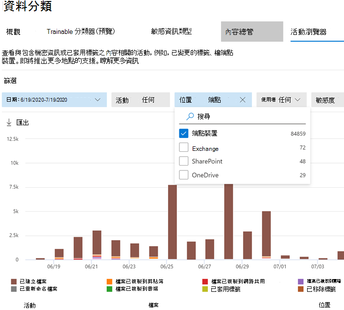

# 開始使用端點資料外洩防護Get started with Endpoint data loss prevention

Microsoft 端點資料外洩防護 (端點 DLP) 是 Microsoft 365 資料外洩防護 (DLP) 套件的一部分，您可以使用這些功能探索並保護整個 Microsoft 365 服務的敏感性項目。Microsoft Endpoint data loss prevention (Endpoint DLP) is part of the Microsoft 365 data loss prevention (DLP) suite of features you can use to discover and protect sensitive items across Microsoft 365 services. 如需所有 Microsoft DLP 供應項目的詳細資訊，請參閱[資料外洩防護概觀](data-loss-prevention-policies.md) (英文)。For more information about all of Microsoft’s DLP offerings, see [Overview of data loss prevention](data-loss-prevention-policies.md). 若要深入了解端點 DLP，請參閱 [深入了解端點資料外洩防護](endpoint-dlp-learn-about.md)To learn more about Endpoint DLP, see [Learn about Endpoint data loss prevention](endpoint-dlp-learn-about.md)

Microsoft 端點 DLP 可讓您監視 Windows 10 裝置，並偵測敏感性項目使用和共用的時間。Microsoft Endpoint DLP allows you to monitor Windows 10 devices and detect when sensitive items are used and shared. 這可提供您所需的可見度和控制，以確保它們得到正確的使用與保護，並協助防治可能導致威脅入侵的風險行為。This gives you the visibility and control you need to ensure that they are used and protected properly, and to help prevent risky behavior that might compromise them.

## 開始之前Before you begin

### SKU/訂閱授權SKU/subscriptions licensing

開始使用端點 DLP 之前，您應先確認 [Microsoft 365 訂閱](https://www.microsoft.com/microsoft-365/compare-microsoft-365-enterprise-plans?rtc=1)以及任何附加元件。Before you get started with Endpoint DLP, you should confirm your [Microsoft 365 subscription](https://www.microsoft.com/microsoft-365/compare-microsoft-365-enterprise-plans?rtc=1) and any add-ons. 若要存取和使用端點 DLP 的功能，您必須擁有下列其中一個訂閱或附加元件。To access and use Endpoint DLP functionality, you must have one of these subscriptions or add-ons.

- Microsoft 365 E5Microsoft 365 E5
- Microsoft 365 A5 (教育版)Microsoft 365 A5 (EDU)
- Microsoft 365 E5 合規性Microsoft 365 E5 compliance
- Microsoft 365 A5 合規性Microsoft 365 A5 compliance
- Microsoft 365 E5 資訊保護和控管Microsoft 365 E5 information protection and governance
- Microsoft 365 A5 資訊保護和控管Microsoft 365 A5 information protection and governance

### 權限Permissions

若要啟用裝置管理，您使用的帳戶必須屬於下列任一角色的成員：To enable device management, the account you use must be a member of any one of these roles:

- 全域系統管理員Global admin
- 安全性系統管理員Security admin
- 合規性系統管理員Compliance admin

如果想要使用自訂帳戶來查看 [裝置管理] 設定，則必須具有下列其中一種角色：If you want to use a custom account to view the device management settings, it must be in one of these roles:

- 全域系統管理員Global admin
- 合規性系統管理員Compliance admin
- 合規性資料系統管理員Compliance data admin
- 全域讀取者Global reader

如果想要使用自訂帳戶來存取上線/離線頁面，則必須具有下列其中一種角色：If you want to use a custom account to access the onboarding/offboarding page, it must be in one of these roles:

- 全域系統管理員Global admin
- 合規性系統管理員Compliance admin

如果想要使用自訂帳戶來開啟/關閉裝置監控，則必須具有下列其中一種角色：If you want to use a custom account to turn on/off device monitoring, it must be in one of these roles:

- 全域系統管理員Global admin
- 合規性系統管理員Compliance admin

可在 [[活動總管]](data-classification-activity-explorer.md)中檢視來自端點 DLP 的資料。Data from Endpoint DLP can be viewed in [Activity explorer](data-classification-activity-explorer.md). 有四個角色可以將權限授與活動總管，您用來存取資料的帳戶必須是其中任一的成員。There are four roles that grant permission to activity explorer, the account you use for accessing the data must be a member of any one of them.

- 全域系統管理員Global admin
- 合規性系統管理員Compliance admin
- 安全性系統管理員Security admin
- 合規性資料系統管理員Compliance data admin

### 準備您的端點Prepare your endpoints

請確認您計畫部署端點 DLP 的 Windows 10 裝置符合這些需求。Make sure that the Windows 10 devices that you plan on deploying Endpoint DLP to meet these requirements.

1. 必須執行 Windows 10 x64 組建 1809 或更新版本。Must be running Windows 10 x64 build 1809 or later.

2. 反惡意程式碼用戶端版本為 4.18.2009.7 或更新版本。Antimalware Client Version is 4.18.2009.7 or newer. 開啟 Windows 安全性應用程式，選取 [設定] 圖示，然後選取 [關於]，以查看您目前的版本。Check your current version by opening Windows Security app, select the Settings icon, and then select About. 版本號碼會列在 [反惡意程式碼用戶端版本] 底下。The version number is listed under Antimalware Client Version. 安裝 Windows Update KB4052623 以更新至最新的反惡意程式碼用戶端版本。Update to the latest Antimalware Client Version by installing Windows Update KB4052623. 附註：Windows 安全性元件不需為作用中，您即可以不依賴 Windows 安全性狀態而執行端點 DLP。Note: None of Windows Security components need to be active, you can run Endpoint DLP independent of Windows Security status.

3. 已安裝下列 Windows 更新。The following Windows Updates are installed. 附註：這些更新不是將裝置上線至端點 DLP 的先決條件，但包含重要問題的修正，因此必須先安裝，才能使用產品。Note: These updates are not a pre-requisite to onboard a device to Endpoint DLP, but contain fixes for important issues thus must be installed before using the product.

    - 若為 Windows 10 1809 - KB4559003、KB4577069、KB4580390For Windows 10 1809 - KB4559003, KB4577069, KB4580390
    - 若為 Windows 10 1903 或 1909 - KB4559004、KB4577062、KB4580386For Windows 10 1903 or 1909 - KB4559004, KB4577062, KB4580386
    - 若為 Windows 10 2004 - KB4568831、KB4577063For Windows 10 2004 - KB4568831, KB4577063
    - 若為執行 Office 2016 的裝置 (不是任何其他 Office 版本) - KB4577063For devices running Office 2016 (and not any other Office version) - KB4577063 

4. 所有裝置都必須[加入 Azure Active Directory (Azure AD)](https://docs.microsoft.com/azure/active-directory/devices/concept-azure-ad-join) 或加入混合式 Azure AD。All devices must be [Azure Active Directory (Azure AD) joined](https://docs.microsoft.com/azure/active-directory/devices/concept-azure-ad-join), or Hybrid Azure AD joined.

5. 在端點裝置上安裝 Microsoft Chromium Edge 瀏覽器，以強制執行上傳至雲端活動的原則動作。Install Microsoft Chromium Edge browser on the endpoint device to enforce policy actions for the upload to cloud activity. 請參閱[下載以 Chromium 為基礎的新 Microsoft Edge](https://support.microsoft.com/help/4501095/download-the-new-microsoft-edge-based-on-chromium)。See, [Download the new Microsoft Edge based on Chromium](https://support.microsoft.com/help/4501095/download-the-new-microsoft-edge-based-on-chromium).

6. 如果您使用的是 Microsoft 365 Apps 版本 2004-2008 的每月企業頻道，則存在端點 DLP 對 Office 內容進行分類的已知問題，您需要更新到 2009 版或更高版本。If you are on Monthly Enterprise Channel of Microsoft 365 Apps versions 2004-2008, there is a known issue with Endpoint DLP classifying Office content and you need to update to version 2009 or later. 請參閲目前版本的 [Microsoft 365 Apps 的更新歷程記錄 (依日期列出)](https://docs.microsoft.com/officeupdates/update-history-microsoft365-apps-by-date)。See [Update history for Microsoft 365 Apps (listed by date)](https://docs.microsoft.com/officeupdates/update-history-microsoft365-apps-by-date) for current versions. 深入了解有關此問題的更多資訊，請參閱 [2020 年目前通道版本的版本資訊](https://docs.microsoft.com/officeupdates/current-channel#version-2010-october-27) 中的 Office 套件一節。To learn more about this issue, see the Office Suite section of [Release notes for Current Channel releases in 2020](https://docs.microsoft.com/officeupdates/current-channel#version-2010-october-27).

## 將裝置上線至裝置管理Onboarding devices into device management

您必須先啟用裝置監控與上線端點，才能監視與防護裝置上的敏感性項目。You must enable device monitoring and onboard your endpoints before you can monitor and protect sensitive items on a device. 這兩個動作都是在 Microsoft 365 合規性入口網站中完成。Both of these actions are done in the Microsoft 365 Compliance portal.

當您想要將尚未上線的的裝置進行上線時，您將會下載適當的指令碼，並將它部署到這些裝置。When you want to onboard devices that haven't been onboarded yet, you'll download the appropriate script and deploy it to those devices. 請按照[上線裝置程序](endpoint-dlp-getting-started.md#onboarding-devices)。Follow the [Onboarding devices procedure](endpoint-dlp-getting-started.md#onboarding-devices).

如果您的裝置已上線至 [適用於端點的 Microsoft Defender](https://docs.microsoft.com/windows/security/threat-protection/)，這些裝置原本就會出現在 [受管理的裝置] 清單中。If you already have devices onboarded into [Microsoft Defender for Endpoint](https://docs.microsoft.com/windows/security/threat-protection/), they will already appear in the managed devices list. 請按照 [[裝置已上線至適用於端點的 Microsoft Defender] 的程序操作](https://docs.microsoft.com/microsoft-365/compliance/endpoint-dlp-getting-started?view=o365-worldwide&source=docs#with-devices-onboarded-into-microsoft-defender-for-endpoint)。Follow the [With devices onboarded into Microsoft Defender for Endpoint procedure](https://docs.microsoft.com/microsoft-365/compliance/endpoint-dlp-getting-started?view=o365-worldwide&source=docs#with-devices-onboarded-into-microsoft-defender-for-endpoint).

### 上線裝置Onboarding devices

在此部署案例中，您將上線尚未上線的裝置，且您只要監視並保護來自 Windows 10 裝置上無意間共用的敏感性項目。In this deployment scenario, you'll onboard devices that have not been onboarded yet, and you just want to monitor and protect sensitive items from unintentional sharing on Windows 10 devices.

1. 開啟 [Microsoft 合規性中心](https://compliance.microsoft.com)。Open the [Microsoft compliance center](https://compliance.microsoft.com).

2. 開啟 [合規性中心] 設定頁面，然後選擇 **[上線裝置]**。Open the Compliance Center settings page and choose **Onboard devices**. 

   > [!div class="mx-imgBorder"]
   > 

   > [!NOTE]
   > 通常啟用裝置上線需要 60 秒的時間，但請等候最多 30 分鐘的時間再與 Microsoft 支援服務聯絡以取得協助。While it usually takes about 60 seconds for device onboarding to be enabled, please allow up to 30 minutes before engaging with Microsoft support.

3. 選擇 **[裝置管理]** 以開啟 **[裝置]** 清單。Choose **Device management** to open the **Devices** list. 在您的裝置上線之前，此清單會是空白。The list will be empty until you onboard devices.

4. 選擇 **[上線]** 開始上線程序。Choose **Onboarding** to begin the onboarding process.

5. 選擇您想要從 **[部署方法]** 清單中部署至這些其他裝置的方式，然後 **[下載套件]**。Choose the way you want to deploy to these additional devices from the **Deployment method** list and then **download package**.

   > [!div class="mx-imgBorder"]
   > 
   
6. 按照 [Windows 10 電腦的上線工具和方法](https://docs.microsoft.com/windows/security/threat-protection/microsoft-defender-atp/configure-endpoints)中的適當程序。Follow the appropriate procedures in [Onboarding tools and methods for Windows 10 machines](https://docs.microsoft.com/windows/security/threat-protection/microsoft-defender-atp/configure-endpoints). 此連結會將您帶到一個登陸頁面，讓您存取適用於端點的 Microsoft Defender 且符合您在步驟 5 中選取的部署套件的程序：This link take you to a landing page where you can access Microsoft Defender for Endpoint procedures that match the deployment package you selected in step 5:

    - 使用群組原則上線 Windows 10 電腦Onboard Windows 10 machines using Group Policy
    - 使用 Microsoft Endpoint Configuration Manager 來上線 Windows 電腦Onboard Windows machines using Microsoft Endpoint Configuration Manager
    - 使用行動裝置管理工具上線 Windows 10 電腦Onboard Windows 10 machines using Mobile Device Management tools
    - 使用本機指令碼上線 Windows 10 電腦Onboard Windows 10 machines using a local script
    - 上線非永續性 Virtual Desktop Infrastructure (VDI) 電腦。Onboard non-persistent virtual desktop infrastructure (VDI) machines.

一旦完成且端點上線後，端點會顯示在裝置清單中，並開始向 [活動總管] 回報音訊活動記錄。Once done and endpoint is onboarded, it should be visible in the devices list and also start reporting audit activity logs to Activity explorer.

> [!NOTE]
> 這項體驗屬於授權強制執行。This experience is under license enforcement. 若無所需授權，資料將不會顯示或無法存取。Without the required license, data will not be visible or accessible.

### 若裝置已上線至適用於端點的 Microsoft DefenderWith devices onboarded into Microsoft Defender for Endpoint

在這種情況下，適用於端點的 Microsoft Defender 已經部署，且已有回報中的端點。In this scenario, Microsoft Defender for Endpoint is already deployed and there are endpoints reporting in. 所有這些端點都會出現在 [受管理的裝置] 清單中。All these endpoints will appear in the managed devices list. 您可以繼續使用 [[上線裝置程序]](endpoint-dlp-getting-started.md#onboarding-devices) 將新裝置上線至端點 DLP 中，以拓展涵蓋範圍。You can continue to onboard new devices into Endpoint DLP to expand coverage by using the [Onboarding devices procedure](endpoint-dlp-getting-started.md#onboarding-devices).

1. 開啟 [Microsoft 合規性中心](https://compliance.microsoft.com)。Open the [Microsoft compliance center](https://compliance.microsoft.com).

2. 開啟 [合規性中心] 設定頁面，然後選擇 **[啟用裝置監控]**。Open the Compliance Center settings page and choose **Enable device monitoring**.

3. 選擇 **[裝置管理]** 以開啟 **[裝置]** 清單。Choose **Device management** to open the **Devices** list. 您應該會看到已向適用於端點的 Microsoft Defender 回報的裝置清單。You should see the list of devices that are already reporting in to Microsoft Defender for Endpoint.

   > [!div class="mx-imgBorder"]
   > 
   
4. 如果您需要上線其他裝置，請選擇 **[上線]**。Choose **Onboarding** if you need to onboard additional devices.

5. 選擇您想要從 **[部署方法]** 清單中部署至這些其他裝置的方式，然後 **[下載套件]**。Choose the way you want to deploy to these additional devices from the **Deployment method** list and then **Download package**.

6. 按照 [Windows 10 電腦的上線工具和方法](https://docs.microsoft.com/windows/security/threat-protection/microsoft-defender-atp/configure-endpoints)中的適當程序。Follow the appropriate procedures in [Onboarding tools and methods for Windows 10 machines](https://docs.microsoft.com/windows/security/threat-protection/microsoft-defender-atp/configure-endpoints). 此連結會將您帶到一個登陸頁面，讓您存取適用於端點的 Microsoft Defender 且符合您在步驟 5 中選取的部署套件的程序：This link take you to a landing page where you can access Microsoft Defender for Endpoint procedures that match the deployment package you selected in step 5:

    - 使用群組原則上線 Windows 10 電腦Onboard Windows 10 machines using Group Policy
    - 使用 Microsoft Endpoint Configuration Manager 來上線 Windows 電腦Onboard Windows machines using Microsoft Endpoint Configuration Manager
    - 使用行動裝置管理工具上線 Windows 10 電腦Onboard Windows 10 machines using Mobile Device Management tools
    - 使用本機指令碼上線 Windows 10 電腦Onboard Windows 10 machines using a local script
    - 上線非永續性 Virtual Desktop Infrastructure (VDI) 電腦。Onboard non-persistent virtual desktop infrastructure (VDI) machines.

一旦完成且端點上線後，端點會顯示在 **[裝置]** 表格下，並開始向 **[活動總管]** 回報音訊記錄。Once done and endpoint is onboarded, it should be visible under the **Devices** table and also start reporting audit logs to the **Activity Explorer**.

> [!NOTE]
>這項體驗屬於授權強制執行。This experience is under license enforcement. 若無所需授權，資料將不會顯示或無法存取。Without the required license, data will not be visible or accessible.

### 在 DLP 警示管理儀表板中檢視端點 DLP 警示Viewing Endpoint DLP alerts in DLP Alerts Management dashboard

1. 在 Microsoft 365 合規性中心開啟 [資料外洩防護] 頁面，並選擇 [警示]。Open the Data loss prevention page in the Microsoft 365 Compliance center and choose Alerts.

2. 請參閱[如何設定和檢視 DLP 原則的警示](dlp-configure-view-alerts-policies.md)中的程序，以檢視您端點 DLP 原則的警示。Refer to the procedures in [How to configure and view alerts for your DLP policies](dlp-configure-view-alerts-policies.md) to view alerts for your Endpoint DLP policies.

### 檢視 [活動總管] 中的端點 DLP 資料Viewing Endpoint DLP data in activity explorer

1. 在 Microsoft 365 合規性中心開啟您網域的 [[資料分類] 頁面](https://compliance.microsoft.com/dataclassification?viewid=overview)，然後選擇 [活動總管]。Open the [Data classification page](https://compliance.microsoft.com/dataclassification?viewid=overview) for your domain in the Microsoft 365 Compliance center and choose Activity explorer.

2. 請參閱 [開始使用活動總管](data-classification-activity-explorer.md) (英文) 中的程序，以存取及篩選您端裝置的所有資料。Refer to the procedures in [Get started with Activity explorer](data-classification-activity-explorer.md) to access and filter all the data for your Endpoint devices.

   > [!div class="mx-imgBorder"]
   > 

## 後續步驟Next steps
現在您擁有已上線的裝置，且可以在 [活動總管] 中檢視活動資料，您已準備好開始建立可保護您敏感性項目之 DLP 原則的下一個步驟。Now that you have onboarded devices and can view the activity data in Activity explorer, you are ready to move on to your next step where you create DLP policies that protect your sensitive items.

- [使用端點資料外洩防護 (預覽版)Using Endpoint data loss prevention (preview)](endpoint-dlp-using.md)

## 另請參閱See also

- [深入了解端點資料外洩防護Learn about Endpoint data loss prevention ](endpoint-dlp-learn-about.md)
- [使用端點資料外洩防護Using Endpoint data loss prevention ](endpoint-dlp-using.md)
- [資料外洩防護概觀Overview of data loss prevention](data-loss-prevention-policies.md)
- [建立、測試及調整 DLP 原則Create, test, and tune a DLP policy](create-test-tune-dlp-policy.md)
- [開始使用活動總管Get started with Activity explorer](data-classification-activity-explorer.md)
- [適用於端點的 Microsoft DefenderMicrosoft Defender for Endpoint](https://docs.microsoft.com/windows/security/threat-protection/)
- [Windows 10 電腦上線的工具及方法 ](https://docs.microsoft.com/windows/security/threat-protection/microsoft-defender-atp/configure-endpoints)。[Onboarding tools and methods for Windows 10 machines](https://docs.microsoft.com/windows/security/threat-protection/microsoft-defender-atp/configure-endpoints)
- [Microsoft 365 訂閱Microsoft 365 subscription](https://www.microsoft.com/microsoft-365/compare-microsoft-365-enterprise-plans?rtc=1)
- [加入 Azure AD 的裝置Azure AD joined devices](https://docs.microsoft.com/azure/active-directory/devices/concept-azure-ad-join)
- [下載以 Chromium 為基礎的新 Microsoft Edge](https://support.microsoft.com/help/4501095/download-the-new-microsoft-edge-based-on-chromium)。[Download the new Microsoft Edge based on Chromium](https://support.microsoft.com/help/4501095/download-the-new-microsoft-edge-based-on-chromium)
