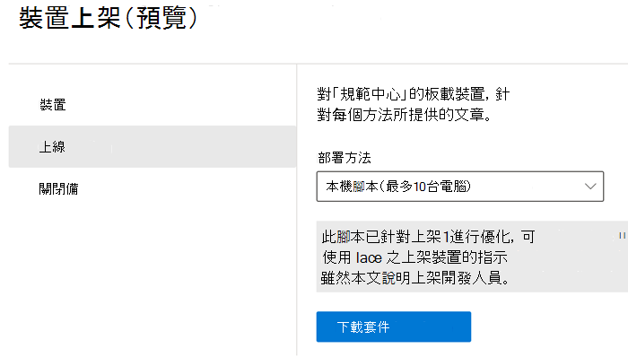
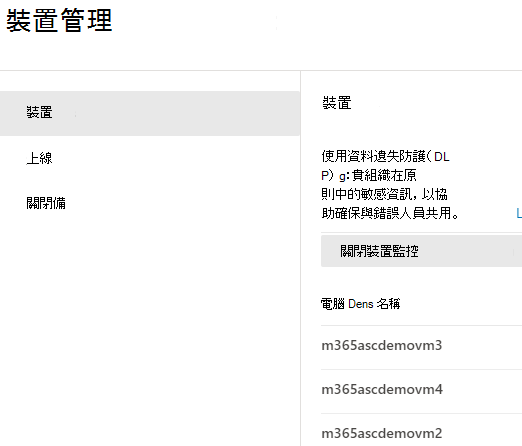
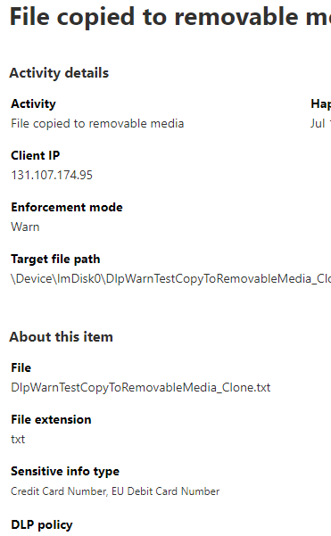

# 深入瞭解 Microsoft 365 端點資料外洩防護（預覽版）

您可以使用 Microsoft 365 資料外洩防護（DLP）來監視正在進行的動作，這些動作會受到您認為敏感性的專案影響，並協助防止意外共用這些專案。 如需 DLP 的詳細資訊，請參閱[資料外洩防護概觀](data-loss-prevention-policies.md)。

**端點資料外洩防護** （端點 DLP）將 DLP 的活動監視和保護功能擴充到 Windows 10 裝置上的敏感性專案。 當裝置登入到裝置管理中時，您可以在 [活動總管](data-classification-activity-explorer.md) 中查看使用者使用敏感度專案的相關資訊，而且您可以透過 [DLP 原則](create-test-tune-dlp-policy.md)強制執行這些專案上的保護動作。

## 您可以監視和採取動作的端點活動

Microsoft 端點 DLP 可讓您稽核及管理下列類型的活動，而使用者會在執行 Windows 10 的裝置上透過這些活動使用敏感度專案。 這包括：

|專案上的活動 |可稽核/可限制  |
|---------|---------|
|建立的    | 可稽核的      |
|重新命名的    |  可稽核的       |
|複製到可移除式媒體或在上面建立     |     可稽核與可限制|
|複製到網路共用，例如，\\my-server\fileshare   |     可稽核與可限制    |
|列印的 |    可稽核與可限制       |
|透過 Chromium Edge 複製到雲端    |   可稽核與可限制        |
|已遭不受允許的應用程式和瀏覽器存取    |  可稽核與可限制       |

## 端點 DLP 有何不同

在您深入了解端點 DLP 之前，您必須先注意一些額外的概念。

### 啟用裝置管理

[裝置管理] 是一種能夠從裝置收集遙測資訊，並將之引入 Microsoft 365 合規性中心解決方案，例如端點 DLP 和 [測試人員風險管理](insider-risk-management.md) 中的功能。 在 DLP 原則中，您需登入您想要用作位置的所有裝置。

您可以從 [裝置管理中心] 下載的腳本處理「登入和登出」。 該中心含有下列每種部署方法的自訂腳本：

- 本機腳本（最多10台電腦）
- 群組原則
- 系統中心設定管理 (版本 1610 或更新版本)
- 行動裝置管理 / Microsoft Intune
- 非持久電腦的 VDI 登入腳本

 使用 [開始使用 Microsoft 365 端點 DLP](endpoint-dlp-getting-started.md) 的程式以登入程式。

如果您透過 [Microsoft Defender 進階威脅防護（Microsoft Defender ATP）](https://docs.microsoft.com/windows/security/threat-protection/) 登入裝置，這些裝置會自動顯示在裝置清單中。

### 查看端點 DLP 資料

 [端點 DLP] 可監視基於 MIME 類型的活動，因此即使副檔名變更，也能捕獲活動。 在公用預覽中，可見全部：

- Word 檔案
- PowerPoint 檔案
- Excel 檔案
- PDF 檔案
- .csv 檔案
- .tsv 檔案
- c 檔案
- 課程檔案
- cpp 檔案
- cs 檔案
- h 檔案
- java 檔案

> [!NOTE]
> .txt 和原始程式碼檔案不會根據預設值稽核，DLP 會根據所套用的原則評估這些檔案，然後會相應地稽核或封鎖使用者動作。

當裝置登入時，在您設定並部署任何被裝置視為位置的 DLP 原則之前，稽核活動的相關資訊便會導入 [活動總管]。

![[活動總管] 中的端點 DLP 資料](../media/endpoint-dlp-learn-about-4-activity-explorer.png)

在稽核活動中，端點 DLP 會收集大量資訊。

例如，如果將檔案複製到可移動 USB 媒體，您會在活動詳細資料中看到下列屬性：

- 活動類型
- 用戶端 IP
- 目標檔案路徑
- 時間戳記
- 檔案名稱
- 使用者
- 檔案副檔名
- 檔案大小
- 敏感資訊類型 (若適用)
- sha1 值
- sha256 值
- 上一個檔案名稱
- 位置
- 母
- 檔案路徑
- 來源位置類型
- 平台
- 裝置名稱
- 目的地位置類型
- 執行複製的應用程式
- MDATP 裝置識別碼（若適用）
- 可移除式媒體裝置製造商
- 可移除式裝置模型
- 可移除式裝置序號

## 後續步驟

現在您已經瞭解了端點 DLP，接下來的步驟如下：

1) [Microsoft 端點資料外洩防護快速入門（預覽版）](endpoint-dlp-getting-started.md)
2) [使用 Microsoft 端點資料外洩防護（預覽版）](endpoint-dlp-using.md)

## 請參閱

- [Microsoft 端點資料外洩防護快速入門（預覽版）](endpoint-dlp-getting-started.md)
- [使用 Microsoft 端點資料外洩防護（預覽版）](endpoint-dlp-using.md)
- [資料外洩防護概觀](data-loss-prevention-policies.md)
- [建立、測試及調整 DLP 原則](create-test-tune-dlp-policy.md)
- [開始使用活動總管](data-classification-activity-explorer.md)
- [Microsoft Defender 進階威脅防護 (Microsoft Defender ATP)](https://docs.microsoft.com/windows/security/threat-protection/)
- [測試人員風險管理](insider-risk-management.md)