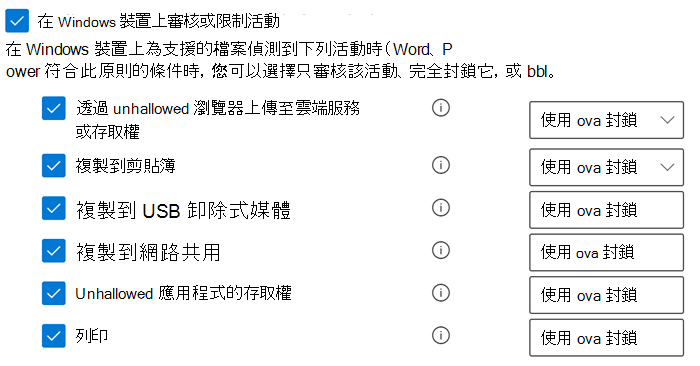

# 使用端點資料外洩防護Using Endpoint data loss prevention

本文將逐步引導您建立及修改使用裝置作為位置的 DLP 原則的三種案例。This article walks you through three scenarios where you create and modify a DLP policy that uses devices as a location.

## DLP 設定DLP settings

在您開始使用之前，您必須設定套用到所有裝置的 DLP 原則的 DLP 設定。Before you get started you should set up your DLP settings which are applied to all DLP policies for devices. 如果您想要建立可強制執行以下內容的原則，則您必須進行設定：You must configure these if you intend to create policies that enforce:

- 雲端輸出限制cloud egress restrictions
- 不受允許的應用程式限制unallowed apps restrictions

或者Or

- 如果您想從監控中排除雜訊檔案路徑If you want to exclude noisy file paths from monitoring

  > [!div class="mx-imgBorder"]
  > 

### 檔案路徑排除File path exclusions

您可能想在裝置上從 DLP 監控、DLP 警示 和 DLP 策略執行中排除某些太吵雜或不包含您感興趣的檔案的路徑。You may want to exclude certain paths from DLP monitoring, DLP alerting, and DLP policy enforcement on your devices because they are too noisy or don’t contain files you are interested in. 這些位置中的檔案不會被稽核，且在那些位置中所建立或修改的任何檔案，都不會受到 DLP 原則強制的制約。Files in those locations will not be audited and any files that are created or modified in those locations will not be subject to DLP policy enforcement. 您可以在 DLP 設定中設定路徑排除。You can configure path exclusions in DLP settings.

您可以使用此邏輯來建立排除路徑：You can use this logic to construct your exclusion paths:

- 以 ' \’ 結尾的有效檔案路徑，也就是直接位於 [資料夾] 底下的檔案。Valid file path that ends with ‘\’, which means only files directly under folder.  例如：C:\TempFor example: C:\Temp\

- 以 ‘\*’ 結尾的有效檔案路徑，也就是除了直接位於 [資料夾] 底下的檔案外，只在 [子資料夾] 底下的檔案。Valid file path that ends with ‘\*’, which means only files under sub-folders, besides the files directly under the folder.  例如：C:\Temp\*For example: C:\Temp\*

- 以 ' \’ 或 ‘\*’ 結尾的有效檔案路徑，也就是直接位於 [資料夾] 和 [子資料夾] 底下的所有檔案。Valid file path that ends without ‘\’ or ‘\*’, which means all files directly under folder and all sub-folders.  例如：C:\TempFor example: C:\Temp

- 兩側間帶有 ’\’ 的萬用字元之路徑。A path with wildcard between ‘\’ from each side.  例如，C:\Users\*\DesktopFor example: C:\Users\*\Desktop\

- 兩側間帶有 ‘\’ 的萬用字元且以 ‘(數字)’ 提供精確數目的子資料夾的路徑。A path with wildcard between ‘\’ from each side and with ‘(number)’ to give exact number of subfolders.  例如： C:\Users\*（1） \DownloadsFor example: C:\Users\*(1)\Downloads\

- 含有 [系統] 內容變數的路徑。A path with SYSTEM environment variables.  例如：%SystemDrive%\Test\*For example: %SystemDrive%\Test\*

- 以上所列的混合。A mix of all the above.  例如：%SystemDrive%\Users\*\Documents\*(2)\SubFor example: %SystemDrive%\Users\*\Documents\*(2)\Sub\

### 不受允許的應用程式Unallowed apps

當一項原則的 **不受允許的應用程式和瀏覽器之存取** 設定已開啟，且使用者嘗試使用這些應用程式存取受保護的檔案時，系統可以允許、封鎖或在封鎖活動下，但使用者仍可以覆寫限制。When a policy's **Access by unallowed apps and browsers** setting is turned on and users attempt to use these apps to access a protected file, the activity will be allowed, blocked, or blocked but users can override the restriction. 所有活動都會經過稽核，並可在活動瀏覽器中查看。All activity is audited and available to review in activity explorer.

> [!IMPORTANT]
> 請不要包含可執行檔的路徑，只包含可執行檔名稱 (例如，.browser.exe)。Do not include the path to the executable, but only the executable name (such as browser.exe).

### 瀏覽器和網域限制Browser and domain restrictions
限制與您的原則匹配的敏感檔案不能與不受限制的雲端服務網域共用。Restrict sensitive files that match your policies from being shared with unrestricted cloud service domains.

#### 服務網域Service domains

您可以控制受原則保護的敏感檔案是否可以從 Microsoft Edge 上載到特定的服務網域。You can control whether sensitive files protected by your policies can be uploaded to specific service domains from Microsoft Edge.

如果 [清單模式] 設為 **[封鎖]**，則使用者將無法將敏感性專案上傳到這些網域。If the list mode is set to **Block**, then user will not be able to upload sensitive items to those domains. 當由於專案符合 DLP 原則而封鎖上傳動作時，DLP 將會產生警告，或封鎖敏感性專案的上傳。When an upload action is blocked because an item matches a DLP policy, DLP will either generate a warning or block the upload of the sensitive item.

如果 [清單模式] 設為 **[允許]**，則使用者 \**_只_* _ 能將敏感性項目上傳到那些網域，而不可將存取權上傳到其他網域。If the list mode is set to **Allow**, then users will be able to upload sensitive items \**_only_* _ to those domains, and upload access to all other domains is not allowed.

#### 不受允許的瀏覽器Unallowed browsers

您新增的瀏覽器是由其可執行檔名稱所標識，這些瀏覽器將無法存取符合強制執行的 DLP 原則的檔案（其中的 [上傳到雲端服務限制] 已設定為 [封鎖] 或 [封鎖覆寫]）。You add browsers, identified by their executable names, that will be blocked from accessing files that match the conditions of an enforced a DLP policy where the upload to cloud services restriction is set to block or block override. 當這些瀏覽器被禁止存取檔案時，終端使用者會看到快顯通知，要求其透過 Edge Chromium 開啟檔案。When these browsers are blocked from accessing a file, the end users will see a toast notification asking them to open the file through Edge Chromium.

### 始終稽核已登入裝置的檔案活動Always audit file activity from onboarded devices

控制是否自動稽核 Office、PDF 和 CSV 檔案的 DLP 活動，並可從已登入裝置的稽核遙測和活動總管中查看。Control whether DLP activity for Office, PDF, and CSV files is automatically audited and available for review in the audit telemetry and the Activity Explorer from onboarded devices. 

如果此選項處於開啟狀態 (預設)，則始終稽核已登入裝置的檔案活動，而不管它們是否包含在活動 DLP 原則中。If this is turned On (the default), file activity is always audited for onboarded devices, regardless of whether or not they are included in an active DLP policy.
如果禁用此選項，則僅當已登入裝置包含在活動 DLP 原則中時，才會稽核已登入裝置的檔案活動。If this is turned off, file activity is audited for onboarded devices only when they are included in an active DLP policy. 

## 將 DLP 設定結合起來Tying DLP settings together

使用端點 DLP 和 Edge Chromium 網頁瀏覽器，您可以對不受允許的雲端應用程式和服務限制不願共用敏感性專案。With Endpoint DLP and Edge Chromium Web browser, you can restrict unintentional sharing of sensitive items to unallowed cloud apps and services. Edge Chromium 瞭解，專案受端點 DLP 原則限制，並強制執行存取限制的狀況。Edge Chromium understands when an item is restricted by an Endpoint DLP policy and enforces access restrictions.

當您在正確設定的 DLP 原則和 [Edge] Chromium 瀏覽器中使用端點 DLP 做為位置時，您在這些設定中定義的不受允許的瀏覽器將無法存取符合您 DLP 原則控制項的敏感性專案。When you use Endpoint DLP as a location in a properly configured DLP policy and the Edge Chromium browser, the unallowed browsers that you've defined in these settings will be prevented from accessing the sensitive items that match your DLP policy controls. 相反地， 使用者會被重新導向，以使用 Edge Chromium 而 Edge Chromium 則根據其對 DLP 的強加限制之理解，可在 DLP 原則中的條件符合時封鎖或限制活動。Instead, users will be redirected to use Edge Chromium and Edge Chromium, with its understanding of DLP imposed restrictions, can block or restrict activities when the conditions in the DLP policy are met.

若要使用這項限制，您需要設定三個重要的部分：To use this restriction you’ll need to configure three important pieces:

1. 指定您想要防止敏感性專案被共用的位置 (服務、網域、IP 位址)。Specify the places – services, domains, IP addresses – that you want to prevent sensitive items from being shared to.

2. 當 DLP 原則相符時，新增不允許存取特定敏感性專案的瀏覽器。Add the browsers that aren’t allowed to access certain sensitive items when a DLP policy match occurs.

3. 設定 DLP 原則，透過開啟 _ *上傳至雲端服務*\* 和 **從不受允許的瀏覽器存取**，以定義敏感性專案上傳所應受限制的位置。Configure DLP policies to define the kinds of sensitive items for which upload should be restricted to these places by turning on _ *Upload to cloud services*\* and **Access from unallowed browser**.

您可以繼續新增服務、應用程式和原則，以延伸並擴充您的限制，以符合您的業務需求並保護敏感性資料。You can continue to add new services, apps, and policies to extend and augment your restrictions to meet your business needs and protect sensitive data. 

這項設定可協助確保您的資料保持安全，同時也避免了防止或限制使用者存取及共用非敏感性專案的不必要限制。This configuration will help ensure your data remains safe while also avoiding unnecessary restrictions that prevent or restrict users from accessing and sharing non-sensitive items.

## 端點 DLP 原則案例Endpoint DLP policy scenarios

為協助您熟悉端點 DLP 功能及其在 DLP 原則中的呈現方式，我們為您整理了一些可遵循的案例。To help familiarize you with Endpoint DLP features and how they surface in DLP policies, we've put together some scenarios for you to follow. 當端點 DLP 公開發行時，所有的端點 DLP 內容都會被折入主要 DLP 內容設定中。All the Endpoint DLP content will be folded in to the main DLP content set when Endpoint DLP becomes generally available.

> [!IMPORTANT]
> 這些端點 DLP 案例非建立和調整 DLP 原則的正式程式。These Endpoint DLP scenarios are not the official procedures for creating and tuning DLP policies. 當您需要在一般情況下使用 DLP 原則時，請參閱下列主題：Refer to the below topics when you need to work with DLP policies in general situations:
>- [資料外洩防護概觀Overview of data loss prevention](data-loss-prevention-policies.md)
>- [預設的 DLP 原則快速入門Get started with the default DLP policy](get-started-with-the-default-dlp-policy.md)
>- [從範本建立 DLP 原則Create a DLP policy from a template](create-a-dlp-policy-from-a-template.md)
>- [建立、測試及調整 DLP 原則Create, test, and tune a DLP policy](create-test-tune-dlp-policy.md)

### 案例1：從範本建立原則，僅限稽核Scenario 1: Create a policy from a template, audit only

這些案例要求你已有上線裝置，並會向 [活動瀏覽器] 進行回報。These scenarios require that you already have devices onboarded and reporting into Activity explorer. 如果您還沒有上線裝置，請參閱 [開始使用端點資料外洩防護](endpoint-dlp-getting-started.md)。If you haven't onboarded devices yet, see [Get started with Endpoint data loss prevention](endpoint-dlp-getting-started.md).

1. 開啟 [[資料外洩防護] 頁面](https://compliance.microsoft.com/datalossprevention?viewid=policies)。Open the [Data loss prevention page](https://compliance.microsoft.com/datalossprevention?viewid=policies).

2. 選擇 **[建立原則]**。Choose **Create policy**.

3. 在此案例中，請選擇 **[隱私權]**，然後 **[美國個人識別資訊 (PII) 資料]**，並選擇 **[下一步]**。For this scenario, choose **Privacy**, then **U.S. Personally Identifiable Information (PII) Data** and choose **Next**.

4. 將 **[裝置]** 以外的所有位置的 **[狀態]** 欄位切換為 [關閉]。Toggle the **Status** field to off for all locations except **Devices**. 選擇 **[下一步]**。Choose **Next**.

5. 接受預設 **[查看並自訂範本中的設定]** 選項，然後選擇 **[下一步]**。Accept the default **Review and customize settings from the template** selection and choose **Next**.

6. 接受預設 **[保護動作]** 值，然後選擇 **[下一步]**。Accept the default **Protection actions** values and choose **Next**.

7. 選取 **[稽核或限制 Windows 裝置上的活動]**，並將動作設定為 **[僅限稽核]**。Select **Audit or restrict activities on Windows devices** and leave the actions set to **Audit only**. 選擇 **[下一步]**。Choose **Next**.

8. 接受預設 **[我想先進行測試]** 值，然後選擇 **[在測試模式中顯示原則提示]**。Accept the default **I'd like to test it out first** value and choose **Show policy tips while in test mode**. 選擇 **[下一步]**。Choose **Next**.

9. 查看您的設定，然後選擇 **[提交]**。Review your settings and choose **Submit**.

10. 新的 DLP 原則會顯示在原則清單中。The new DLP policy will appear in the policy list.

11. 在活動瀏覽器中檢查受監控端點的資料。Check Activity explorer for data from the monitored endpoints. 設定裝置的位置篩選並新增原則，然後依策略名稱篩選，以查看此原則的影響。Set the location filter for devices and add the policy, then filter by policy name to see the impact of this policy. 如有需要，請參閱 [啟動活動資源管理器](data-classification-activity-explorer.md)。See, [Get started with activity explorer](data-classification-activity-explorer.md) if needed.

12. 嘗試與組織外部人員共用包含會觸發美國個人識別資訊（PII）資料條件之測試。Attempt to share a test that contains content that will trigger the U.S. Personally Identifiable Information (PII) Data condition with someone outside your organization. 這應該會觸發該原則。This should trigger the policy.

13. 查看活動的活動瀏覽器。Check Activity explorer for the event.

### 案例2：修改現有原則、設定通知Scenario 2: Modify the existing policy, set an alert

1. 開啟 [[資料外洩防護] 頁面](https://compliance.microsoft.com/datalossprevention?viewid=policies)。Open the [Data loss prevention page](https://compliance.microsoft.com/datalossprevention?viewid=policies).

2. 選擇您在案例 1 中建立的 **[美國個人識別資訊 (PII) 資料]** 原則。Choose the **U.S. Personally Identifiable Information (PII) Data** policy that you created in scenario 1.

3. 選擇 **[編輯原則]**。Choose **edit policy**.

4. 移至 **[進階 DLP 規則]** 頁面，然後編輯 **[偵測到少量的美國個人識別資訊內容]**。Go to the **Advanced DLP rules** page and edit the **Low volume of content detected U.S. Personally Identifiable Inf**.

5. 向下移至 **[事件報告]** 區段，並設定 **[當規則符合時，傳送警示給系統管理員]** 為 **[開啟]**。Scroll down to the **Incident reports** section and set **Send an alert to admins when a rule match occurs** to **On**. 電子郵件警示將會自動傳送給系統管理員，以及您新增至收件者清單中的任何人。Email alerts will be automatically sent to the administrator and anyone else you add to the list of recipients. 

   > [!div class="mx-imgBorder"]
   > 
   
6. 在此情況下，請選擇 **每次當活動符合規則時，傳送警示**。For the purposes of this scenario, choose **Send alert every time an activity matches the rule**.

7. 選擇 **[儲存]**。Choose **Save**.

8. 透過選擇 **[下一步]**，然後 **[提交]** 原則變更，以保留您先前的所有設定。Retain all your previous settings by choosing **Next** and then **Submit** the policy changes.

9. 嘗試與組織外部人員共用包含會觸發美國個人識別資訊（PII）資料條件之測試。Attempt to share a test that contains content that will trigger the U.S. Personally Identifiable Information (PII) Data condition with someone outside your organization. 這應該會觸發該原則。This should trigger the policy.

10. 查看活動的活動瀏覽器。Check Activity explorer for the event.

### 案例3：修改現有原則、封鎖 [允許覆寫] 動作Scenario 3: Modify the existing policy, block the action with allow override

1. 開啟 [[資料外洩防護] 頁面](https://compliance.microsoft.com/datalossprevention?viewid=policies)。Open the [Data loss prevention page](https://compliance.microsoft.com/datalossprevention?viewid=policies).

2. 選擇您在案例 1 中建立的 **[美國個人識別資訊 (PII) 資料]** 原則。Choose the **U.S. Personally Identifiable Information (PII) Data** policy that you created in scenario 1.

3. 選擇 **[編輯原則]**。Choose **edit policy**.

4. 移至 **[進階 DLP 規則]** 頁面，然後編輯 **[偵測到少量的美國個人識別資訊內容]**。Go to the **Advanced DLP rules** page and edit the **Low volume of content detected U.S. Personally Identifiable Inf**.

5. 向下移至 **[稽核或限制 Windows 裝置上的活動]** 區段，並針對每個活動設定對應的動作為 **[透過覆寫進行封鎖]**。Scroll down to the **Audit or restrict activities on Windows device** section and for each activity set the corresponding action to  **Block with override**.

   > [!div class="mx-imgBorder"]
   > ![設定[透過複寫進行封鎖]動作](../media/endpoint-dlp-6-using-dlp-set-blocked-with-override.png)
   
6. 選擇 **[儲存]**。Choose **Save**.

7. 針對 **偵測到大量美國個人識別資訊** 時，重複執行步驟4-7。Repeat steps 4-7 for the **High volume of content detected U.S. Personally Identifiable Inf**.

8. 透過選擇 **[下一步]**，然後 **[提交]** 原則變更，以保留您先前的所有設定。Retain all your previous settings by choosing **Next** and then **Submit** the policy changes.

9. 嘗試與組織外部人員共用包含會觸發美國個人識別資訊（PII）資料條件之測試。Attempt to share a test that contains content that will trigger the U.S. Personally Identifiable Information (PII) Data condition with someone outside your organization. 這應該會觸發該原則。This should trigger the policy.

   在用戶端裝置上，您會看到像這樣的彈出提示：You'll see a popup like this on the client device:

   > [!div class="mx-imgBorder"]
   > 

10. 查看活動的活動瀏覽器。Check Activity explorer for the event.

## 另請參閱See also

- [深入了解端點資料外洩防護Learn about Endpoint data loss prevention](endpoint-dlp-learn-about.md)
- [開始使用端點資料外洩防護Get started with Endpoint data loss prevention](endpoint-dlp-getting-started.md)
- [資料外洩防護概觀Overview of data loss prevention](data-loss-prevention-policies.md)
- [建立、測試及調整 DLP 原則Create, test, and tune a DLP policy](create-test-tune-dlp-policy.md)
- [開始使用活動總管Get started with Activity explorer](data-classification-activity-explorer.md)
- [適用於端點的 Microsoft DefenderMicrosoft Defender for Endpoint](https://docs.microsoft.com/windows/security/threat-protection/)
- [Windows 10 電腦上線的工具及方法 ](https://docs.microsoft.com/windows/security/threat-protection/microsoft-defender-atp/configure-endpoints)。[Onboarding tools and methods for Windows 10 machines](https://docs.microsoft.com/windows/security/threat-protection/microsoft-defender-atp/configure-endpoints)
- [Microsoft 365 訂閱Microsoft 365 subscription](https://www.microsoft.com/microsoft-365/compare-microsoft-365-enterprise-plans?rtc=1)
- [已加入 Azure Active Directory (AAD)Azure Active Directory (AAD) joined](https://docs.microsoft.com/azure/active-directory/devices/concept-azure-ad-join)
- [下載以 Chromium 為基礎的新 Microsoft Edge](https://support.microsoft.com/help/4501095/download-the-new-microsoft-edge-based-on-chromium)。[Download the new Microsoft Edge based on Chromium](https://support.microsoft.com/help/4501095/download-the-new-microsoft-edge-based-on-chromium)
- [預設的 DLP 原則快速入門Get started with the default DLP policy](get-started-with-the-default-dlp-policy.md)
- [從範本建立 DLP 原則Create a DLP policy from a template](create-a-dlp-policy-from-a-template.md)
